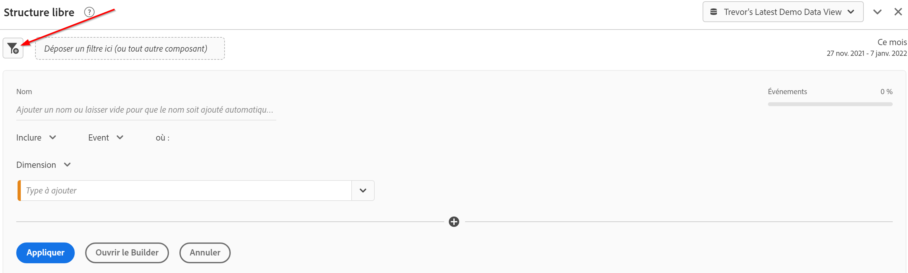
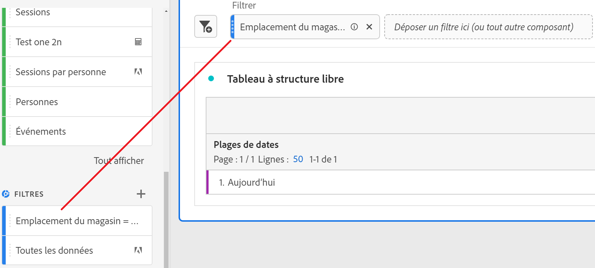
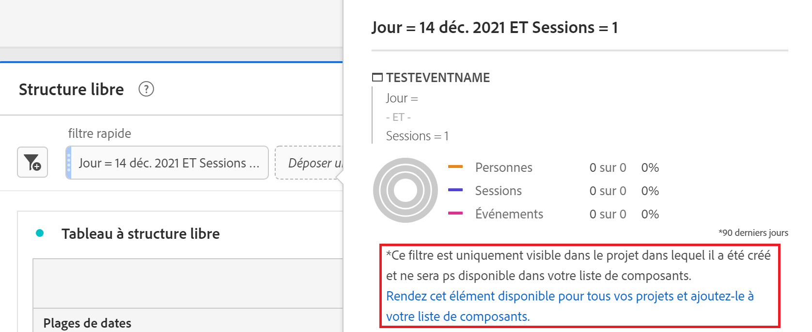
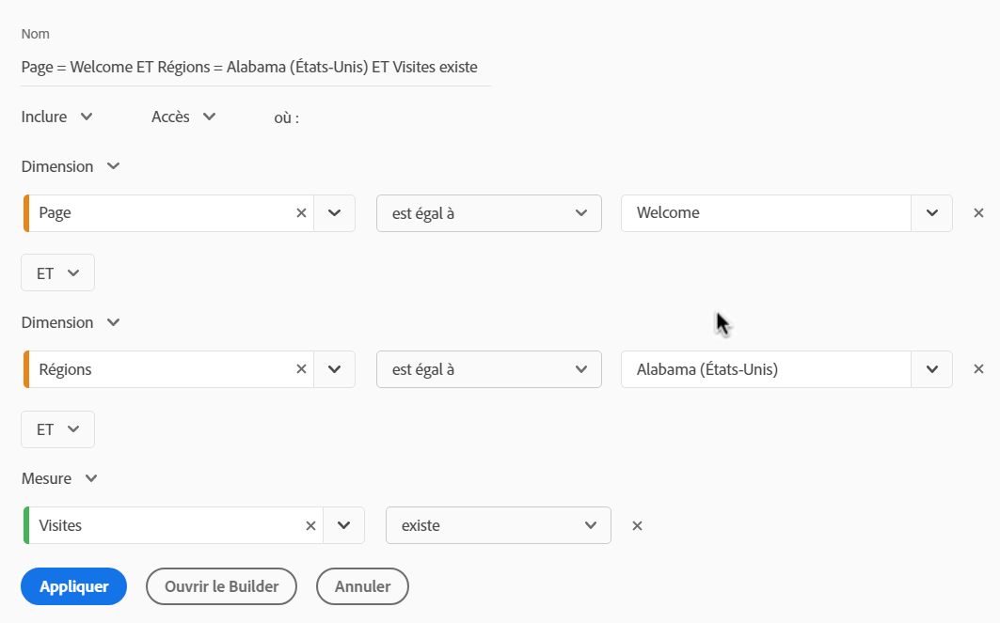

# Filtres rapides

Les filtres rapides vous permettent d’explorer facilement les données d’un projet donné, sans avoir à créer un filtre de liste de composants plus complexe dans la variable [Créateur de filtres](/help/components/filters/create-filters.md).

Tenez compte des points suivants lors de la création de filtres rapides :

* Les filtres rapides s’appliquent uniquement au projet dans lequel ils ont été créés. Ils ne sont pas disponibles dans d’autres projets et ne peuvent pas être partagés avec d’autres utilisateurs.
* 3 règles au maximum sont autorisées.
* Les conteneurs imbriqués ou les règles séquentielles ne sont pas pris en charge.

La vidéo suivante explique comment utiliser les filtres rapides. (Remarque : cette vidéo utilise le terme &quot;segments rapides&quot; au lieu de &quot;filtres rapides&quot;. Toutefois, la fonctionnalité est la même.)

>[!VIDEO](https://video.tv.adobe.com/v/341466/?quality=12&learn=on)

## Créer un filtre rapide {#create}

Tout utilisateur d’Analysis Workspace peut créer un filtre rapide.

Pour créer un filtre rapide :

1. Choisissez l’une des méthodes suivantes pour commencer à créer le filtre rapide :

   * **Ad hoc (glisser-déposer) :** Dans le rail de gauche, faites glisser un composant vers la zone de dépôt en regard de l’option **Filtrer** dans l’en-tête du panneau, puis sélectionnez l’option **Modifier** pour ajuster le filtre.

      

      >[!NOTE]
      >
      > Tenez compte des points suivants lors de la création d’un filtre rapide ad hoc (glisser-déposer) :
      > * Les types de composants suivants ne sont pas pris en charge : mesures calculées et dimensions, ainsi que les mesures à partir desquelles vous ne pouvez pas créer de filtres.
      > * Pour l’intégralité des dimensions et événements, Analysis Workspace crée des segments de filtres « existe ». Exemples : `Hit where eVar1 exists` ou `Hit where event1 exists`.
      > * Si des éléments de type « non spécifié » ou « aucun » sont déposés dans la zone de dépôt, ils sont automatiquement transformés en filtre « n’existe pas » afin d’être traités correctement.

   * **À l’aide de l’icône de filtre :** Dans un tableau à structure libre, sélectionnez la variable **Filtrer** dans l’en-tête du panneau.

      

1. Ajustez l’un des paramètres suivants :

   | Paramètre | Description |
   | --- | --- |
   | [!UICONTROL Nom] | Le nom par défaut d’un filtre est une combinaison des noms des règles du filtre. Vous pouvez donner un nom plus convivial au filtre. |
   | [!UICONTROL Inclure/exclure] | Vous pouvez inclure ou exclure des composants dans votre définition de filtre, mais pas les deux. |
   | [!UICONTROL Conteneur d’accès/de visites/de visiteurs] | Les filtres rapides incluent un [conteneur de filtres](https://experienceleague.adobe.com/docs/analytics-platform/using/cja-components/cja-filters/filters-overview.html?lang=fr#filter-containers) uniquement qui vous permet d’inclure une dimension/mesure/période dans le filtre (ou de l’en exclure). [!UICONTROL Visiteur] contient les données principales spécifiques au visiteur pour les visites et les pages vues. Un conteneur [!UICONTROL Visite] permet de définir des règles pour ventiler les données du visiteur selon les visites. Un conteneur [!UICONTROL Accès] permet de ventiler les informations du visiteur selon des pages vues spécifiques. Le conteneur par défaut est [!UICONTROL Accès]. |
   | [!UICONTROL Composants] (Dimension/mesure/période) | Définissez jusqu’à 3 règles en ajoutant des composants (dimensions, mesures, périodes ou valeurs de dimension). Il existe trois façons de trouver le composant approprié :<ul><li>Commencez la saisie et le créateur de filtres rapides recherche automatiquement le composant approprié.</li><li>Utilisez la liste déroulante pour trouver le composant.</li><li>Glissez et déposez les composants à partir du rail de gauche.</li></ul> |
   | [!UICONTROL Opérateur] | Utilisez le menu déroulant pour trouver les opérateurs standards et les opérateurs [!UICONTROL Comptage distinct]. Voir [Opérateurs de filtres](operators.md). |
   | Signe plus (+) | Ajouter une autre règle |
   | Qualificateurs AND/OR | Vous pouvez ajouter des qualificateurs « AND » ou « OR » aux règles, mais vous ne pouvez pas mélanger « AND » et « OR » dans une seule définition de filtre. |
   | [!UICONTROL Appliquer] | Appliquez ce filtre au panneau. Si le filtre ne contient aucune donnée, vous êtes invité à poursuivre. |
   | [!UICONTROL Ouvrir le Builder] | Ouvre le créateur de filtres. Après avoir enregistré ou appliqué le filtre dans le Créateur de filtres, il n’est plus considéré comme un &quot;filtre rapide&quot;. Il devient une partie de la bibliothèque de filtres de liste de composants. 
Pour rendre le composant disponible dans tous vos projets et dans le rail de gauche, sélectionnez l’option . [!UICONTROL **Rendre ce filtre disponible pour tous vos projets et l’ajouter à votre liste de composants**].

Pour plus d’informations, voir la section [Enregistrer un filtre rapide en tant que filtre de liste de composants](#save-a-quick-filter-as-a-component-list-filter) dans cet article.

**Remarque :** Seuls les utilisateurs disposant de l’autorisation Création de filtres dans la variable [Adobe Admin Console](https://experienceleague.adobe.com/docs/analytics/admin/admin-console/permissions/summary-tables.html?lang=fr#analytics-tools) Vous pouvez ouvrir le Créateur de filtres.
 |
   | [!UICONTROL Annuler] | Annulez ce filtre rapide (ne l’appliquez pas). |
   | [!UICONTROL Période] | Le programme de validation utilise la période du panneau pour sa recherche de données. Cependant, toute période appliquée dans un filtre rapide remplace la période du panneau en haut du panneau. |
   | Aperçu (en haut à droite) | Vous permet de voir si vous disposez d’un filtre valide et quelle est la largeur du filtre. Représente la ventilation du jeu de données auquel vous pouvez vous attendre si vous appliquez ce filtre. Vous pourriez recevoir un avis indiquant que ce filtre ne contient aucune donnée. Dans ce cas, vous pouvez poursuivre ou modifier la définition du filtre. |

1. Sélectionner [!UICONTROL **Appliquer**] pour enregistrer vos modifications.

## Modification d’un filtre rapide {#edit}

1. Pointez sur le filtre rapide à modifier, puis sélectionnez **Modifier** icône .

   

1. Modifiez la définition du filtre ou le nom du filtre.
1. Sélectionner [!UICONTROL **Appliquer**] pour enregistrer vos modifications.

## Enregistrer un filtre rapide en tant que filtre de liste de composants {#save}

>[!IMPORTANT]
>
> Tenez compte des points suivants lors de l’enregistrement d’un filtre rapide :
> 
> * Pour enregistrer un filtre rapide, vous devez disposer de l’autorisation Création de filtre dans la [Adobe Admin Console](https://experienceleague.adobe.com/docs/analytics/admin/admin-console/permissions/summary-tables.html?lang=fr#analytics-tools).
> 
> * Une fois le filtre enregistré ou appliqué, il ne peut plus être modifié dans le créateur de filtres rapides. Vous devez plutôt utiliser le Créateur de filtres standard.

Vous pouvez choisir d’enregistrer des filtres rapides en tant que filtres de liste de composants. Les avantages des filtres de liste de composants incluent :

* Disponibilité sur tous vos projets Workspace
* Prise en charge de filtres plus complexes et de filtres séquentiels

Vous pouvez enregistrer des filtres à partir du Créateur de filtres rapides ou du [!UICONTROL Créateur de filtres].

### Enregistrez dans le créateur de filtres rapides. {#save2}

1. Après avoir appliqué le filtre rapide, pointez dessus et sélectionnez l’icône d’information (&quot;i&quot;).
1. Sélectionner **[!UICONTROL Mettre tous les projets à disposition et ajouter à votre liste de composants]**.
1. (Facultatif) Renommez le filtre.
1. Sélectionnez **[!UICONTROL Enregistrer]**.

   Le filtre apparaît désormais dans la liste des composants du rail de gauche. Notez également que la barre latérale du filtre passe du bleu clair au bleu foncé, ce qui indique qu’il ne peut plus être modifié ni ouvert dans le créateur de filtres rapides.

### Enregistrer dans le Créateur de filtres {#save3}

1. Après avoir appliqué le filtre rapide, pointez dessus et sélectionnez l’icône d’information (&quot;i&quot;).
1. Sélectionnez **[!UICONTROL Enregistrer le filtre]**.
1. (Facultatif) Renommez le filtre, puis sélectionnez [!UICONTROL **Appliquer**].

   Revenez à Workspace et notez que la barre latérale du filtre passe du bleu clair au bleu foncé, ce qui indique qu’il ne peut plus être modifié ni ouvert dans le créateur de filtres rapides. Et en l’enregistrant, il devient une partie de la liste des composants.

   

Après avoir appliqué le filtre, vous pouvez choisir de l’ajouter à votre liste de composants de filtre et de le rendre disponible pour tous vos projets.

1. Survolez le filtre enregistré et sélectionnez l’icône en forme de crayon.

1. Dans la partie supérieure du Créateur de filtres, remarquez cette boîte de dialogue :

   

1. Cochez la case en regard de **[!UICONTROL Rendre disponible pour tous les projets à disposition et ajouter l’élément à votre liste de composants.]**
1. Sélectionnez **[!UICONTROL Enregistrer]**.
Le filtre apparaît désormais dans la liste des composants de filtre pour tous vos projets.
Vous pouvez également [partager le filtre](/help/components/filters/manage-filters.md) avec d’autres personnes de votre entreprise.

## Exemple de filtre rapide

L’exemple suivant de filtre combine des dimensions et des mesures :

