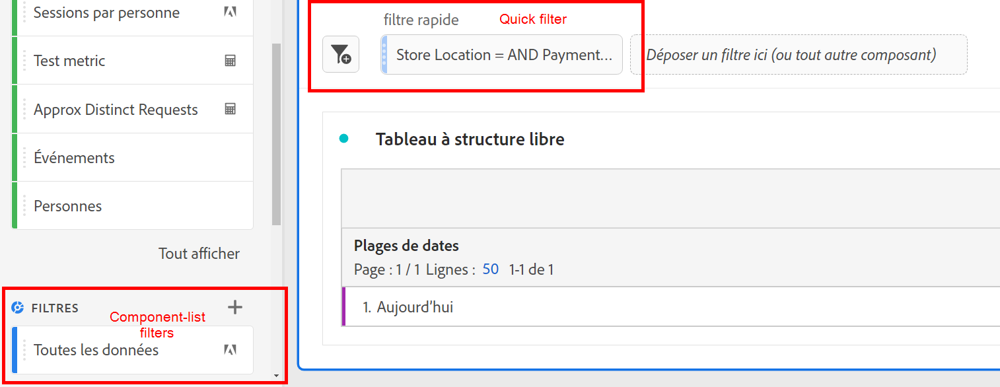

# Filtres rapides

Vous pouvez créer des filtres rapides dans un projet afin de contourner la complexité du [Créateur de filtres](/help/components/filters/create-filters.md) complet. Filtres rapides

* Sʼappliquent uniquement aux projets dans lesquels ils ont été créés (ce paramètre est modifiable).
* Autoriser jusqu’à 3 règles
* Ne pas prendre en charge les conteneurs imbriqués ni les règles séquentielles.

Pour une comparaison des effets des filtres rapides par rapport aux filtres de liste de composants complète, accédez [ici](/help/components/filters/filters-overview.md).

>[!IMPORTANT]
> Les filtres rapides sont actuellement en test limité et ne sont pas encore réellement disponibles.

## Conditions préalables

Tout le monde peut créer un Segment rapide. Cependant, il est nécessaire dʼaccorder lʼautorisation Création de segments dans [Adobe Admin Console](https://experienceleague.adobe.com/docs/analytics/admin/admin-console/permissions/summary-tables.html?lang=fr#analytics-tools) afin de pouvoir enregistrer un segment rapide ou lʼouvrir dans le Créateur de segments.

## Création de filtres rapides

Dans un tableau à structure libre, cliquez sur l’icône filter+ dans l’en-tête du panneau :

| Paramètre | Description |
| --- | --- |
| Nom | Le nom par défaut d’un filtre est une combinaison des noms des règles du filtre. Vous pouvez donner un nom plus convivial au filtre. |
| Inclure/exclure | Vous pouvez inclure ou exclure des composants dans votre définition de filtre, mais pas les deux. |
| Conteneur d’accès/de visites/de visiteurs | Les filtres rapides incluent un [conteneur de filtres](https://experienceleague.adobe.com/docs/analytics-platform/using/cja-components/cja-filters/filters-overview.html?lang=fr#filter-containers) uniquement qui vous permet d’inclure une dimension/mesure/période dans le filtre (ou de l’en exclure). [!UICONTROL Visiteur] contient les données principales spécifiques au visiteur pour les visites et les pages vues. Un conteneur [!UICONTROL Visite] permet de définir des règles pour ventiler les données du visiteur selon les visites, et un conteneur [!UICONTROL Accès] permet de ventiler les informations du visiteur selon des pages vues spécifiques. Le conteneur par défaut est [!UICONTROL Accès]. |
| Composants (Dimension/mesure/période) | Définissez jusqu’à 3 règles en ajoutant des composants (dimensions, mesures, plages de dates ou valeurs de dimension). Il existe trois façons de trouver le composant approprié :<ul><li>Commencez la saisie et le créateur [!UICONTROL Filtre rapide] recherche automatiquement le composant approprié.</li><li>Utilisez la liste déroulante pour trouver le composant.</li><li>Glissez et déposez les composants à partir du rail de gauche.</li></ul> |
| Opérateur | Utilisez le menu déroulant pour trouver les opérateurs standards et les opérateurs [!UICONTROL Comptage distinct]. Voir [Opérateurs de filtres](operators.md). |
| Signe plus (+) | Ajouter une autre règle |
| Qualificateurs AND/OR | Vous pouvez ajouter des qualificateurs « AND » ou « OR » aux règles, mais vous ne pouvez pas mélanger « AND » et « OR » dans une seule définition de filtre. |
| Appliquer | Appliquez ce filtre au panneau. Si le filtre ne contient aucune donnée, vous serez invité à poursuivre. |
| Ouvrir le Builder | Ouvre le créateur de filtres. Une fois le filtre enregistré ou appliqué dans le Créateur de filtres, il n’est plus considéré comme un « Filtre rapide ». Il devient une partie de la bibliothèque de filtres de liste de composants. |
| Annuler | Annulez ce filtre rapide : ne l’appliquez pas. |
| Période | Le programme de validation utilise la période du panneau pour sa recherche de données. Cependant, toute période appliquée dans un filtre rapide remplace la période du panneau en haut du panneau. |
| Aperçu (en haut à droite) | Vous permet de voir si vous disposez d’un filtre valide et quelle est la largeur du filtre. Représente la ventilation du jeu de données auquel vous pouvez vous attendre si vous appliquez ce filtre. Vous pourriez recevoir un avis indiquant que ce filtre ne contient aucune donnée. Dans ce cas, vous pouvez poursuivre ou modifier la définition du filtre. |

Voici un exemple de filtre qui combine des dimensions et des mesures :

Le filtre s’affiche en haut. Notez sa barre latérale bleue, par opposition à la barre latérale bleue pour les filtres au niveau du composant dans la bibliothèque de filtres sur la gauche.

## Modification des filtres rapides

1. Survolez le filtre rapide et sélectionnez l’icône en forme de crayon.
1. Modifiez la définition du filtre ou le nom du filtre.

## Enregistrer les filtres rapides

Vous pouvez choisir d’enregistrer les filtres rapides dans le [!UICONTROL Créateur de filtres rapides] ou dans le [!UICONTROL Créateur de filtres].

>[!IMPORTANT]
>Une fois le filtre enregistré ou appliqué, vous ne pouvez plus le modifier dans le Créateur de filtres rapides, mais uniquement dans le Créateur de filtres standard.

### Enregistrer dans le créateur de filtres rapides

1. Une fois le filtre rapide appliqué, passez la souris dessus et sélectionnez l’icône d’information (« i »).
1. Cliquez sur **[!UICONTROL Rendre disponible pour tous vos projets et ajouter l’élément à votre liste de composants]**.
1. (Facultatif) Renommez le filtre.
1. Cliquez sur **[!UICONTROL Enregistrer]**.

Notez comment la barre latérale du filtre passe de bleu rayé à bleu clair. Il apparaît désormais dans la liste de vos composants dans le rail de gauche.

### Enregistrer dans le Créateur de filtres

1. Survolez le filtre rapide et sélectionnez l’icône d’information (« i »).
1. Sélectionnez **[!UICONTROL Enregistrer le filtre]**.
1. Laissez le nom tel quel ou renommez le filtre.

   Revenez à Espace de travail et remarquez que le filtre comporte désormais une barre latérale bleu clair. Cela indique qu’il ne peut plus être modifié/ouvert dans le Créateur de filtres rapides. Et en l’enregistrant, il devient une partie de la liste des composants.

   

Après avoir appliqué le filtre, vous pouvez choisir de l’ajouter à votre liste de composants de filtre et de le rendre disponible pour tous vos projets.

1. Survolez le filtre enregistré et sélectionnez l’icône en forme de crayon.

1. Dans la partie supérieure du Créateur de filtres, remarquez cette boîte de dialogue :

   

1. Cochez la case en regard de **[!UICONTROL Rendre disponible pour tous les projets à disposition et ajouter l’élément à votre liste de composants.]**
1. Cliquez sur **[!UICONTROL Enregistrer]**.
1. Le filtre apparaît désormais dans la liste des composants de filtre pour tous vos projets.
1. Vous pouvez également [partager le filtre](/help/components/filters/manage-filters.md) avec d’autres personnes de votre entreprise.

## Que sont les filtres Projet uniquement ?

Les filtres Projet uniquement sont des filtres rapides ou des filtres de projet Espace de travail ad hoc. Lorsque vous les modifiez/ouvrez dans le [!UICONTROL créateur de filtres], la zone Projet uniquement s’affiche.

Si vous APPLIQUEZ un filtre rapide dans le créateur mais ne cochez pas la case « Rendre disponible », il s’agit toujours d’un filtre Projet uniquement, mais il ne peut plus être ouvert dans le [!UICONTROL créateur de filtres rapides]. Si vous cochez la case et cliquez sur **[!UICONTROL Enregistrer]**, il sʼagit désormais dʼun filtre présent dans la liste des composants.
