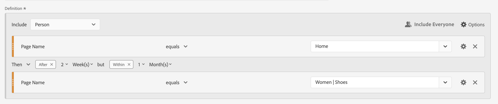

# Filtres séquentiels

Vous créez des filtres séquentiels à l’aide de l’opérateur logique Then (Alors) entre des composants, des conteneurs et des composants, ou des conteneurs. L’opérateur logique Then implique qu’une condition de filtre se produise, suivie d’une autre.

+++ Voici une vidéo montrant la segmentation séquentielle.

>[!VIDEO](https://video.tv.adobe.com/v/25405/?quality=12)

{{videoaa}}

+++

Un filtre séquentiel contient certaines [fonctionnalités de base](#basics) et d’autres options que vous pouvez configurer pour ajouter plus de complexité au filtre séquentiel :

* [Après et dans ](#after-and-within) des contraintes pour la logique Alors dans la définition de filtre de séquence :

* Les données à [inclure](#include) dans la séquence globale pour la définition de filtre. Ou pour une séquence définie dans le cadre d’un conteneur. Par défaut, toutes les données correspondantes sont prises en compte. Ces données sont identifiées par  .

   * Sélectionnez  **[!UICONTROL Only Before Sequence]** pour ne prendre en compte que les données antérieures à la séquence.
   * Sélectionnez  **[!UICONTROL Seulement après la séquence]** pour ne prendre en compte que les données après la séquence.

* Les données à [exclure](#exclude) dans le cadre de la définition de filtre séquentiel.

* Comment [regrouper logique](#logic-group) dans votre définition de filtre séquentiel.

## Principes de base

Les principes de base de la création d’un filtre séquentiel ne sont pas différents de la création d’un filtre normal à l’aide du [Créateur de filtres](filter-builder.md). Vous utilisez le [créateur de définitions](filter-builder.md#definition-builder) pour construire votre définition de filtre. Dans cette construction, vous utilisez des composants, des conteneurs, des opérateurs et une logique. Un filtre normal devient automatiquement un filtre séquentiel dès que vous sélectionnez l’opérateur **[!UICONTROL Then]** dans la définition principale ou dans l’un des conteneurs que vous utilisez dans le [créateur de définitions](filter-builder.md#definition-builder).

### Exemples

Les exemples ci-dessous illustrent l’utilisation de filtres séquentiels dans divers cas d’utilisation.

#### Séquence simple

Identifiez les personnes qui ont consulté une page, puis consulté une autre page. Les données au niveau de l’événement sont filtrées à l’aide de cette séquence. Indépendamment des sessions de personne précédentes, antérieures ou intermédiaires, ou de l’heure ou du nombre de pages vues entre les sessions.

#### Séquence entre les sessions

Identifiez les personnes qui ont consulté une page dans une session, puis consulté une autre page dans une autre session. Pour différencier les sessions, utilisez des conteneurs pour créer la séquence et définir le niveau  **[!UICONTROL Session]** pour chaque conteneur.

#### Séquence de niveau mixte

Identifiez les personnes qui consultent deux pages sur un nombre indéterminé de sessions, puis consultent une troisième page dans une session distincte. Encore une fois, utilisez des conteneurs pour créer la séquence et définir le niveau  **[!UICONTROL Session]** sur le conteneur qui définit la session distincte.

#### Séquence d’agrégat

Identifiez les personnes qui, lors de leur première session, ont consulté une page spécifique, puis ont consulté d’autres pages. Pour différencier la séquence d’événements, utilisez des conteneurs afin de séparer la logique sur un niveau de conteneur  **[!UICONTROL Session]** .

#### Imbrication d’une séquence

Identifiez toutes les sessions au cours desquelles une personne visite une page avant une autre page, puis dispose de sessions de suivi impliquant deux autres pages. Par exemple, identifiez toutes les sessions au cours desquelles une personne accède d’abord à la page d’accueil, puis à une page de catégorie 1 et enfin à d’autres sessions au cours desquelles les pages de catégorie 2 et de catégorie 3 sont visitées au cours de chaque session.

## Après et dans

Vous pouvez utiliser  **[!UICONTROL Après]** et  **[!UICONTROL Dans]** l’opérateur **[!UICONTROL Then]** pour définir des [contraintes de temps](#time-constraints) ou [contraintes pour les événements, sessions ou Dimensions](#event-session-and-dimension-constraints) supplémentaires.

### Contraintes temporelles

Pour appliquer des contraintes de temps à l’opérateur **[!UICONTROL Then]** :

1. Sélectionnez .
1. Sélectionnez **[!UICONTROL Within]** ou **[!UICONTROL After]** dans le menu contextuel.
1. Spécifiez une période (**[!UICONTROL Minute]**, **[!UICONTROL Heure]**, jusqu’à **[!UICONTROL Années]**).
1. Sélectionnez le  **[!UICONTROL *number *]**pour ouvrir une fenêtre contextuelle qui vous permet de saisir ou de spécifier un nombre à l’aide de**[!UICONTROL -]**ou**[!UICONTROL +]**.

Pour supprimer une contrainte temporelle, utilisez .

Le tableau ci-dessous explique plus en détail les opérateurs de contraintes temporelles.

| Opérateurs | Description |
|--- |--- |
| **[!UICONTROL After]** | L’opérateur [!UICONTROL After] est utilisé pour spécifier une limite de temps minimale entre deux points de contrôle. Lors de la définition des valeurs After, la durée commence au moment de l’application du filtre. Par exemple, si l’opérateur [!UICONTROL After] est défini sur un conteneur afin d’identifier les personnes qui visitent la page A, mais ne reviennent pas sur la page B avant un jour, ce jour commence lorsque le visiteur quitte la page A.  Pour que le visiteur soit inclus dans le filtre, au moins 1 440 minutes (un jour) doivent s’écouler après avoir quitté la page A pour afficher la page B. |
| **[!UICONTROL Within]** | L’opérateur [!UICONTROL Within] est utilisé pour spécifier une limite de temps maximale entre deux points de contrôle. Par exemple, si l’opérateur [!UICONTROL Within] est défini sur un conteneur pour identifier les personnes qui consultent la page A, puis reviennent sur la page B dans la journée, ce jour commence lorsque la personne quitte la page A. Pour être inclus dans le filtre, la personne dispose d’un temps maximum d’une journée avant d’ouvrir la page B. Pour que la personne soit incluse dans le filtre, l’ouverture de la page B doit se produire dans un délai maximum de 1 440 minutes (un jour) après avoir quitté la page A pour afficher la page B. |
| **[!UICONTROL Après mais Within]** | Lors de l’utilisation des opérateurs [!UICONTROL After] et [!UICONTROL Within] , les deux opérateurs démarrent et se terminent en parallèle, et non de manière séquentielle.  Par exemple, vous créez un filtre avec le conteneur défini sur : `After = 1 Week(s) and Within = 2 Week(s)`.  Les conditions d&#39;identification des visiteurs dans ce filtre ne sont remplies qu&#39;entre une et deux semaines. Les deux conditions sont appliquées à partir du moment de la première page vue. |

#### Exemples

Quelques exemples d’utilisation des contraintes de temps.

##### Opérateur après

Identifiez les personnes qui ont consulté une page, puis une autre seulement au bout de deux semaines. Par exemple, les personnes qui ont consulté la page d’accueil, mais les femmes | Affiche la page uniquement au bout de deux semaines.

Si une page vue pour la page d’accueil a lieu le 1er juin 2024 à 00:01, alors une page vue pour la page Femmes | Les chaussures seront identiques tant que cette page vue aura lieu après le 15 juin 2024 à 00:01.

##### Opérateur Dans

Identifiez les personnes qui ont consulté une page, puis une autre en cinq minutes. Par exemple, les personnes qui ont consulté la page d’accueil, puis les femmes | Affiche la page dans les 5 minutes.

Si une page vue pour la page d’accueil a lieu le 1er juin 2024 à 12h01, alors une page vue pour la page Femmes | Les chaussures correspondent tant que cette page vue a lieu avant le 15 juin 2024 12:16.

##### Opérateur After mais Within

Identifiez les personnes qui ont consulté une page, puis consulté une autre page dans un délai de deux semaines à un mois. Par exemple, les personnes qui ont consulté la page d’accueil, puis, au bout de deux semaines et au bout d’un mois, les femmes | Page chaussures.

Toute personne qui accède à la page d&#39;accueil le 1er juin 2024 et qui revient visiter les Femmes | Affiche la page après le 15 juin 2019 à 00:01, mais avant le 1er juillet 2019, remplissez les conditions pour le segment.

### Contraintes d’événement, de session et de Dimension

Les contraintes  **[!UICONTROL After]** et  **[!UICONTROL Within]** vous permettent non seulement de spécifier une contrainte temporelle, mais également une contrainte d’événement, de session ou de dimension. Sélectionnez **[!UICONTROL Événement(s)]**, **[!UICONTROL Session(s)]** ou **[!UICONTROL Autres dimensions]**  **[!UICONTROL *Nom de la Dimension *]**}. Vous pouvez utiliser le champ [!UICONTROL *Rechercher*] pour rechercher une dimension.

#### Exemple

Vous trouverez ci-dessous un exemple de filtre séquentiel recherchant les personnes qui ont consulté une page de catégorie de produits (Femmes) | chaussures), suivie d’une page de passage en caisse (passage en caisse) | Merci) sur une page.

Les exemples de séquences suivants correspondent ou ne correspondent pas :

| Séquence |  |
|--- | :---: |
| Page `Women \| Shoes` suivie de la page `Checkout \| Thank You` |  |
| Page `Women \| Shoes` suivie de la page `Women \| Tops` suivie de la page `Checkout \| Thank You` |  |

## Inclure

Vous pouvez spécifier les données à inclure dans votre filtre séquentiel ou dans un conteneur séquentiel qui fait partie de votre filtre séquentiel.

### Tous {#include_everyone}

Pour créer un filtre séquentiel qui inclut tout le monde, sélectionnez l’option  **[!UICONTROL Inclure tout le monde]**.

Le filtre séquentiel identifie les données qui correspondent au modèle donné dans son ensemble.  Vous trouverez ci-dessous un exemple de filtre de séquence de base qui recherche les personnes ayant consulté une page de catégorie de produits (Femme) | chaussures), suivie d’une page de passage en caisse (passage en caisse) | Merci). Le filtre est défini sur  **[!UICONTROL {Inclure tout le monde]**.

Les exemples de séquences suivants correspondent ou ne correspondent pas :

| | Séquence |  |
|---:|--- | --- |
| 1 | `Women \| Shoes` puis `Checkout \| Thank You` dans la même session |  |
| 2 | `Women \| Shoes` puis `Men \| Shoes` puis `Checkout \| Thank You` (entre différentes sessions) |  |
| 3 | `Checkout \| Thank You` puis `Women \| Shoes` |  |

### Seulement avant la séquence et Seulement après la séquence 

Les options  **[!UICONTROL Only Before Sequence]** et  **[!UICONTROL Only After Sequence]** filtrent les données en un sous-ensemble avant ou après la séquence spécifiée.

*  **Seulement avant la séquence** : inclut toutes les données avant une séquence et les premières données de la séquence elle-même. Si une séquence apparaît plusieurs fois dans le cadre des données, [!UICONTROL Seulement avant la séquence] inclut le premier accès de la dernière occurrence de la séquence et tous les accès précédents.
*  **Seulement après la séquence** : inclut tous les accès après une séquence et les dernières données de la séquence elle-même. Si une séquence apparaît plusieurs fois dans le cadre des données, [!UICONTROL Seulement après la séquence] inclut le dernier accès de la première occurrence de la séquence et tous les accès suivants.

Prenons l’exemple d’une définition spécifiant une séquence d’un composant avec les critères identifiés par B, suivis (ensuite) par un composant avec les critères identifiés par D. Les trois options identifieraient les données comme suit :

| B puis D | A | B | C | D | E | F |
|---|:---:|:---:|:---:|:---:|:---:|:---:|
| Inclure tout le monde |  |  |  |  |  |  |
| Seulement avant la séquence |  |  |  |  |  |  |
| Seulement après la séquence |  |  |  |  |  |  |

| B Then D (se produit plusieurs fois) | A | B | C | D | B | C | D | E |
|---|:---:|:---:|:---:|:---:|:---:|:---:|:---:|:---:|
| Inclure tout le monde |  |  |  |  |  |  |  |  |
| Seulement avant la séquence |  |  |  |  |  |  |  |  |
| Seulement après la séquence |  |  |  |  |  |  |  |  |

#### Exemple

Vous avez défini trois versions d’un filtre séquentiel pour les sections du site. Une avec l’option  **[!UICONTROL Inclure tout le monde]**, une avec l’option  **[!UICONTROL Seulement avant la séquence]** et une avec l’option  **[!UICONTROL Seulement après la séquence]**. Vous avez nommé les trois filtres en conséquence.

Lorsque vous créez des rapports sur des sections de site à l’aide de ces trois filtres, l’exemple de sortie dans un tableau à structure libre ressemble à ce qui suit :

## Exclure

Les définitions de filtre incluent toutes les données, sauf si vous excluez spécifiquement les données  [!UICONTROL Person],  [!UICONTROL Session] ou  [!UICONTROL Event] à l’aide de **[!UICONTROL Exclude]**.

[!UICONTROL Exclure] vous permet d’ignorer les données communes et de créer des filtres plus focalisés. Exclure permet également de créer des filtres excluant des groupes de personnes spécifiques. Par exemple, pour définir un filtre qui spécifie les personnes qui ont passé des commandes, puis en excluant ce groupe de personnes afin d’identifier les *non-acheteurs*. Une bonne pratique consiste à créer des règles qui utilisent une définition large plutôt que d’essayer d’utiliser [!UICONTROL Exclure] pour cibler des personnes spécifiques qui correspondent à des valeurs d’inclusion spécifiques.

Voici des exemples de définitions d’exclusion :

* **Exclure des pages**. Utilisez une définition de filtre pour exclure une page spécifique (telle que *Home Page*) d’un rapport, créez une règle Event où la page est égale à `Home Page`, puis excluez la règle. Cette définition inclut automatiquement toutes les pages, à l’exception de la *page d’accueil*.
* **Exclure des domaines référents**. Utilisez une définition qui inclut uniquement des domaines référents de Google.com et exclut tous les autres.
* **Identifier les non-acheteurs**. Déterminez quand les commandes sont supérieures à zéro, puis excluez la [!UICONTROL Personne].

[!UICONTROL Exclure] peut être utilisé pour identifier une séquence dans laquelle des sessions ou des événements spécifiques ne sont pas effectués par la personne. [!UICONTROL Exclure] peut également être inclus dans un [!UICONTROL Groupe logique] (voir ci-dessous).

Vous pouvez exclure des conteneurs, et non des composants.

### Exemples

Voir ci-dessous pour des exemples d’utilisation de [!UICONTROL Exclure].

#### Exclure dans

Identifiez les personnes qui ont consulté une page, n’ont pas consulté une autre page, puis consulté une autre page. Vous excluez le conteneur à l’aide de  [!UICONTROL Exclure]. Un conteneur exclu est identifié par une fine barre rouge sur la gauche.

#### Exclure au début

Identifiez les personnes qui ont consulté une page sans jamais accéder à une autre page. Par exemple, les personnes qui ont effectué un achat sans avoir jamais consulté la page d’accueil.

#### Exclure à la fin

Identifiez les personnes qui ont consulté une page mais n’ont jamais consulté d’autres pages. Par exemple, les personnes qui ont consulté votre page d’accueil, mais jamais vos pages de passage en caisse.

## Groupe logique

>[!NOTE]
>
>Un [!UICONTROL Groupe logique] ne peut être défini que dans un filtre séquentiel, ce qui signifie que l’opérateur [!UICONTROL Then] est utilisé dans le conteneur.

Le groupe logique vous permet de regrouper des conditions dans un seul point de contrôle de filtre séquentiel. Dans le cadre de la séquence, la logique définie dans le conteneur identifié comme Groupe logique est évaluée après tout point de contrôle séquentiel précédent et avant tout point de contrôle séquentiel suivant.

Les conditions du Groupe logique lui-même peuvent être remplies dans n’importe quel ordre. En revanche, les conteneurs non séquentiels (événement, session, personne) ne nécessitent pas que leurs conditions soient remplies dans la séquence globale, ce qui produit des résultats non intuitifs éventuels s’ils sont utilisés avec un opérateur Then.

[!UICONTROL Groupe logique] a été conçu pour traiter *plusieurs conditions en tant que groupe, sans aucun ordre* parmi les conditions regroupées. Dans le cas contraire, l’ordre des conditions dans un groupe logique n’est pas pertinent.

Voici quelques bonnes pratiques pour utiliser le Groupe logique :

* Pour regrouper les points de contrôle séquentiels.
* Pour simplifier la construction de filtres séquentiels.

### Exemples

Voici des exemples d’utilisation du conteneur Groupe logique .

#### Toute commande

Identifiez les personnes qui ont consulté une page, puis chacune d’elles dans un autre ensemble de pages, dans n’importe quel ordre. Par exemple, les personnes qui ont consulté la page d’accueil, puis chacune des pages Hommes, Femmes et Enfants, quelle que soit la commande.

Vous pouvez créer ce filtre sans [!UICONTROL Groupe logique], mais la construction va être complexe et laborieuse. Spécifiez chaque séquence de pages que le visiteur peut afficher. Pour plus de clarté, seul le premier conteneur est ouvert  et les autres conteneurs sont fermés . Vous pouvez dériver le contenu des autres conteneurs par titres.

Vous pouvez utiliser [!UICONTROL Groupe logique] pour simplifier la création de ce filtre, comme illustré ci-dessous. Assurez-vous de sélectionner  **[!UICONTROL Groupe logique]** pour le conteneur.

#### Première correspondance

Identifiez les personnes qui ont consulté une page ou une autre, puis consulté une autre page. Par exemple, les personnes qui ont consulté la page Femmes ou Hommes, puis le passage en caisse | Page de remerciement.

#### Exclure Et

Identifiez les personnes qui ont consulté une page, puis n’ont pas explicitement consulté un ensemble d’autres pages, mais ont consulté une autre page. Par exemple, les personnes qui ont consulté la page d’accueil n’ont pas consulté la page Hommes ou Femmes, mais plutôt la page Enfants.

#### Exclure Ou

Identifiez les personnes qui ont consulté une page, puis n’ont explicitement consulté aucune page d’un ensemble de pages, mais qui ont consulté une autre page. Par exemple, les personnes qui ont consulté la page d’accueil n’ont pas consulté la page Hommes et femmes, mais plutôt la page Enfants.

<!--
An example of a complex sequential filter if you want to find the persons that 

| Session One | Session Two | Session Three |
| --- | --- | --- |
| The person went to the main landing page A, excluded the campaign page B, and then viewed the Product page C.| The person again went to the main landing page A, excluded the campaign page B, and went again to the Product page C, and then to a new page D. | The person entered and followed that same path as in the first and second visits, then excluded page F to go directly to a targeted product on page G. |
-->

## Un dernier exemple

En guise de dernier exemple, vous souhaitez identifier les personnes qui ont pris connaissance d’une page de produit spécifique, sans que ces personnes ne soient jamais touchées par votre campagne &quot;Empower Your Move&quot; (Donnez le pouvoir à votre déplacement). Et lors de leur première visite dans votre boutique en ligne, ils ont consulté la page d’accueil, mais n’ont pas cherché plus loin les produits de remise en forme (matériel) de la catégorie Hommes . Cependant, lors de leur prochaine session, directement après cela, ils sont allés sur une page de produits et ont passé une commande en ligne sans passer par la page d’accueil d’abord.

