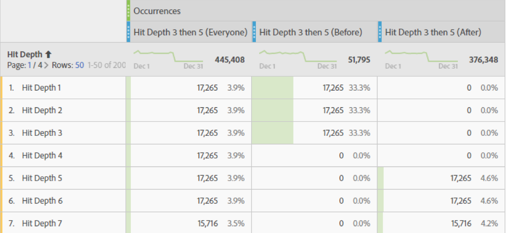
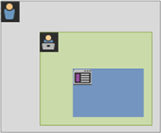
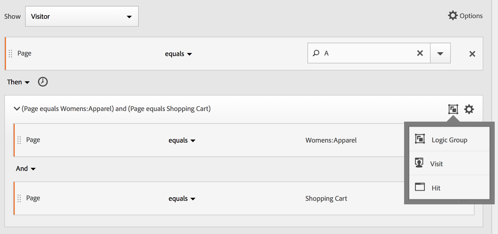

# Création de filtres séquentiels

Les filtres séquentiels sont créés à l’aide de l’opérateur ALORS au lieu de AND ou OR. THEN implique qu’un critère de filtrage se produise, suivi d’un autre. Par défaut, un filtre séquentiel identifie toutes les données correspondantes, en affichant le filtre &quot;Inclure tout le monde&quot;. Les filtres séquentiels peuvent être filtrés davantage pour obtenir un sous-ensemble d’accès correspondants à l’aide des options &quot;Seulement avant la séquence&quot; et &quot;Seulement après la séquence&quot;.

Regardez cet aperçu vidéo sur la segmentation séquentielle :

>[!VIDEO](https://video.tv.adobe.com/v/25405/?quality=12)

## Inclure tout le monde {#include_everyone}

Lors de la création d’un filtre pour lequel &quot;Inclure tout le monde&quot; est défini, le filtre identifie les chemins correspondant au modèle donné dans son ensemble. Il s’agit d’un exemple de filtre de séquence de base recherchant un accès (Page A) suivi d’un autre (Page B) lors d’une visite effectuée par le même visiteur. Le filtre est défini sur Inclure tout le monde.

| Si le résultat… | Séquence |
|--- | --- |
| Correspond à | A puis B A puis (lors d’une autre visite) A puis D puis B |
| Ne correspond pas à | B puis A |

## Seulement avant la séquence et Seulement après la séquence  {#only_before_after}

Les options **[!UICONTROL Seulement avant la séquence]** et **[!UICONTROL Seulement après la séquence]** filtrez le filtre sur un sous-ensemble de données avant ou après la séquence spécifiée.

* **Seulement avant la séquence :** inclut tous les accès avant une séquence + le premier accès de la séquence elle-même (voir les exemples 1 et 3). Si une séquence apparaît plusieurs fois dans un chemin, « Seulement avant la séquence » inclut le premier accès de la dernière occurrence de la séquence et tous les accès précédents (voir l’exemple 2).
* **Seulement après la séquence :** inclut tous les accès après une séquence + le dernier accès de la séquence elle-même (voir les exemples 1 et 3). Si une séquence apparaît plusieurs fois dans un chemin, « Seulement après la séquence » inclut le dernier accès de la première occurrence de la séquence et tous les accès suivants (voir l’exemple 2).

Par exemple, considérons une séquence de B -> D. Les trois filtres identifieraient les accès comme suit :

**Exemple 1 : B puis D apparaissent une fois**

| Exemple | A | B | C | D | E | F |
|---|---|---|---|---|---|---|
| Inclure tout le monde | A | B | C | D | E | F |
| Seulement avant la séquence | A | B |  |  |  |  |
| Seulement après la séquence |  |  |  | D | E | F |

**Exemple 2 : B puis D apparaissent plusieurs fois**

| Exemple | A | B | C | D | B | C | D | E |
|---|---|---|---|---|---|---|---|---|
| Inclure tout le monde | A | B | C | D | B | C | D | E |
| Seulement avant la séquence | A | B | C | D | B |  |  |  |
| Seulement après la séquence |  |  |  | D | B | C | D | E |

Formulons également ce concept avec la dimension de Détail des accès.

**Exemple 3 : Détail des accès sur 3 puis sur 5**

## Contraintes de dimension {#constraints}

Dans une clause « dans » entre des instructions THEN, vous pouvez ajouter par exemple « dans une instance de mot-clé de recherche », « dans une instance eVar 47 ». Le filtre est ainsi limité à une instance d’une dimension.

La définition d’une clause &quot;Within Dimension&quot; entre des règles permet à un filtre de limiter les données aux séquences où cette clause est satisfaite. Voir l’exemple ci-dessous où la contrainte est définie sur « Within 1 Page » :

| Si le résultat… | Séquence |
|--- |--- |
| Correspond à | A puis B |
| Ne correspond pas à | A puis C puis B (car B ne se trouvait pas à moins d’une page de A)  **Remarque :** si la restriction de dimension est levée, « A puis B » et « A puis C puis B » correspondent tous les deux. |

## Séquence simple de pages vues {#simple_sequence}

Identifiez les visiteurs qui ont consulté une page, puis consulté une autre page. Les données au niveau de l’accès filtrent cette séquence sans tenir compte des sessions précédentes ou intermédiaires, ni de l’intervalle ou du nombre de pages vues entre celles-ci.

**Exemple** : le visiteur a consulté la page A, puis la page B au cours de la même visite ou d’une autre.

**Cas d’utilisation**

Vous trouverez ci-dessous des exemples d’utilisation du filtre.

1. Les visiteurs d’un site dédié au sport consultent la page de destination « football », puis la page de destination « basketball » en ordre séquentiel mais pas nécessairement lors de la même visite. Cela invite à créer une campagne visant à « pousser » le contenu de la page « basketball » vers les visiteurs de la page « football » au cours de la saison de football.
1. Un concessionnaire automobile identifie une relation entre ceux qui accèdent à la page de fidélité des clients, puis à la page vidéo à n’importe quel moment au cours de la visite ou d’une autre visite.

**Créer ce filtre**

Vous imbriquez deux règles de pages dans un conteneur [!UICONTROL Visiteur] de niveau supérieur et séquencez les accès aux pages à l’aide de l’opérateur [!UICONTROL THEN].

## Séquence de visiteur entre plusieurs visites {#sequence_across}

Identifiez les visiteurs qui ont abandonné une campagne, mais sont revenus à la séquence de pages vues au cours d’une autre session.

**Exemple** : le visiteur a consulté la page A lors d’une session, puis la page B au cours d’une autre.

**Cas d’utilisation**

Vous trouverez ci-dessous des exemples d’utilisation de ce type de filtre :

* Le visiteur d’un site de nouvelles consulte la page Sports, puis la consulte à nouveau lors d’une autre visite.
* Un détaillant en vêtements constate une relation entre les visiteurs qui accèdent à une page de destination lors d’une visite et qui se rendent directement à la page de passage en caisse lors d’une autre visite.

**Créer ce filtre**

Cet exemple imbrique deux **[!UICONTROL Visite]** conteneurs dans le niveau supérieur **[!UICONTROL Visiteur]** conteneur et séquence le filtre à l’aide de la fonction [!UICONTROL ALORS] de l’opérateur.

## Séquence de niveau mixte {#mixed_level}

Identifiez les visiteurs qui consultent deux pages lors d’un nombre indéterminé de visites, puis consultent une troisième page lors d’une autre visite.

**Exemple** : les visiteurs visitent la page A, puis la page B lors d’une ou de plusieurs visites, puis la page C lors d’une autre visite.

**Cas d’utilisation**

Vous trouverez ci-dessous des exemples d’utilisation de ce type de filtre :

* Les visiteurs consultent tout d’abord un site de nouvelles, puis la page des sports, lors de la même visite. Lors d’une autre visite, le visiteur consulte la page météo.
* Le détaillant définit les visiteurs qui consultent la page d’accueil, puis passe à la page Mon compte. Lors d’une autre visite, ils consultent la page Afficher le panier.

**Créer ce filtre**

1. Déposez deux dimensions Page depuis les panneaux de gauche dans un conteneur [!UICONTROL Visiteur] de niveau supérieur.
1. Ajoutez l’opérateur THEN entre les deux dimensions.
1. Cliquez sur **[!UICONTROL Options]** > **[!UICONTROL Ajouter un conteneur]**, puis ajoutez un conteneur [!UICONTROL Visite] sous le niveau [!UICONTROL Visiteur] et séquencez à l’aide de l’opérateur [!UICONTROL THEN].

## Agrégat de conteneurs {#aggregate_containers}

L’ajout de plusieurs conteneurs [!UICONTROL Accès] à l’intérieur d’un conteneur [!UICONTROL Visiteurs] vous permet d’utiliser les opérateurs appropriés entre des conteneurs de même type, ainsi que d’utiliser des règles et des dimensions, telles que Page et Nombre de visites, pour définir la page vue et fournir une dimension de séquence dans le conteneur [!UICONTROL Accès]. L’application de la logique au niveau Accès vous permet de limiter et de combiner des correspondances au même niveau d’accès dans le [!UICONTROL Visiteur] pour créer divers types de filtres.

**Exemple** : les visiteurs ont consulté la page A après le premier accès dans la séquence de pages vues (page D dans l’exemple), puis ont consulté la page B ou C sans tenir compte du nombre de visites.

**Cas d’utilisation**

Vous trouverez ci-dessous des exemples d’utilisation de ce type de filtre :

* Identifiez les visiteurs qui accèdent à la page de destination principale lors d’une visite, puis consultent la page des vêtements pour hommes lors d’une autre visite, puis la page de destination Femmes ou Enfants lors d’une autre visite.
* Un magasin en ligne capture les visiteurs qui accèdent à la page d’accueil lors d’une visite, à la page Sports lors d’une autre visite et la page Opinion lors d’une autre visite.

**Créer ce filtre**

1. Sélectionnez le conteneur [!UICONTROL Visiteurs] en tant que conteneur de niveau supérieur.
1. Ajoutez deux autres conteneurs de niveau [!UICONTROL Accès] : une dimension avec une dimension numérique appropriée associée au même niveau [!UICONTROL Accès] par l’opérateur [!UICONTROL AND] ou [!UICONTROL OR].
1. Ajoutez un autre conteneur [!UICONTROL Accès] dans le conteneur [!UICONTROL Visites] et imbriquez deux conteneurs [!UICONTROL Accès] supplémentaires, associés par un opérateur [!UICONTROL OR] ou [!UICONTROL AND].

   Séquencez ces conteneurs [!UICONTROL Accès] imbriqués à l’aide de l’opérateur [!UICONTROL THEN].

## &quot;Imbrication&quot; dans les filtres séquentiels {#nesting}

En plaçant des points de contrôle à la fois sur la [!UICONTROL Visite] et [!UICONTROL Accès] vous pouvez contraindre le filtre à répondre aux exigences au cours d’une visite spécifique, ainsi que lors d’un accès spécifique.

**Exemple** : le visiteur a consulté la page A, puis la page B au cours de la même visite. Au cours d’une nouvelle visite, le visiteur a accédé à la page C.

**Créer ce filtre**

1. Sous un conteneur [!UICONTROL Visite] de niveau supérieur, faites glisser deux dimensions Page.
1. Sélectionnez plusieurs fois les deux règles, cliquez sur **[!UICONTROL Options]** > **[!UICONTROL Ajouter un conteneur d’après la sélection]** et modifiez-le en un conteneur [!UICONTROL Visite].
1. Associez-les avec un opérateur [!UICONTROL THEN].
1. Créez un conteneur Accès en tant que pair du conteneur [!UICONTROL Visite] et faites glisser dans une dimension Page.
1. Associez la séquence imbriquée dans le conteneur [!UICONTROL Visite] au conteneur [!UICONTROL Accès] en utilisant un autre opérateur [!UICONTROL THEN].

## Exclure les accès {#exclude}

Les règles de segmentation incluent toutes les données, à moins que vous n’excluiez spécifiquement les données [!UICONTROL Visiteur], [!UICONTROL Visite] ou [!UICONTROL Accès] à l’aide de la règle [!UICONTROL Exclure]. Il vous permet d’ignorer les données courantes et de créer des filtres plus focalisés. Il vous permet également de créer des filtres excluant les groupes trouvés afin d’identifier le jeu de données restant, comme la création d’une règle qui inclut les visiteurs qui ont passé des commandes, puis les exclut afin d’identifier les &quot;non-acheteurs&quot;. Cependant, dans la plupart des cas, il est préférable de créer des règles qui excluent des valeurs trop génériques, plutôt que d’essayer d’utiliser la règle d’exclusion ([!UICONTROL Exclure]) pour cibler des valeurs d’inclusion spécifiques.

Par exemple :

* **Exclure des pages**. Utilisez une règle de filtrage pour exclure une page spécifique (telle que *`Home Page`*) d’un rapport, créez une règle Accès dans laquelle la page est égale à &quot;Page d’accueil&quot;, puis excluez-la. Cette règle inclut automatiquement toutes les valeurs, à l’exception de la page d’accueil.
* **Exclure des domaines référents**. Utilisez une règle qui inclut uniquement des domaines référents de Google.com et exclut tous les autres.
* **Identifier les non-acheteurs**. Identifiez les commandes dont la valeur est supérieure à zéro et excluez ensuite le [!UICONTROL Visiteur].

L’opérateur [!UICONTROL Exclude] peut être utilisé pour identifier une séquence dans laquelle des visites ou des accès spécifiques ne sont pas effectués par le visiteur. [!UICONTROL Exclure les points de contrôle] peut également être inclus dans un groupe logique (voir ci-dessous).

### Exclure entre les points de contrôle {#exclude_between}

Application d’une logique pour filtrer les visiteurs lorsqu’un point de contrôle ne s’est pas produit explicitement entre deux autres.

**Exemple** : les visiteurs qui ont visité la page A, puis la page C mais pas la page B.

**Cas d’utilisation**

Vous trouverez ci-dessous des exemples d’utilisation de ce type de filtre :

* Visiteurs de la page Style de vie, puis de la section Théâtre sans passer par la page Arts.
* Un concessionnaire automobile constate une relation entre ceux qui visitent la page de destination principale, puis passent directement à la campagne « Sans intérêt » sans accéder à la page « Véhicule ».

**Créer ce filtre**

Créez un filtre comme vous le feriez pour un filtre séquentiel simple, de niveau mixte ou imbriqué, puis définissez la variable [!UICONTROL EXCLURE] pour l’élément conteneur. L’exemple ci-dessous est un filtre agrégé où les trois [!UICONTROL Accès] les conteneurs sont déplacés vers la zone de travail, l’objet [!UICONTROL ALORS] est affecté pour joindre la logique du conteneur, puis excluez le conteneur de pages vues intermédiaire afin de n’inclure que les visiteurs qui sont passés de la page A à la page C dans la séquence.

### Exclure au début d’une séquence {#exclude_beginning}

Si le point de contrôle d’exclusion se trouve au début d’un filtre séquentiel, il s’assure qu’une page exclue n’a pas été vue avant le premier accès non exclu.

Par exemple, un restaurant souhaite afficher les utilisateurs qui ont tendance à éviter la page d’entrée principale et qui accèdent directement à la page Commande à emporter. Vous pouvez afficher ces données en excluant les accès à la page d’entrée et en incluant les accès à la page de commande dans un filtre séquentiel.

**Créer ce filtre**

Créez deux conteneurs d’accès distincts au sein d’un conteneur de visiteurs de niveau supérieur. Définissez l’opérateur [!UICONTROL EXCLUDE] pour le premier conteneur.

### Exclure en fin de séquence {#exclude_end}

Si le point de contrôle d’exclusion se situe à la fin d’une séquence, cette option s’assure que le point de contrôle ne s’est pas produit entre le dernier point non exclu et la fin de la séquence du visiteur.

Par exemple, une boutique de vêtements souhaite afficher tous les visiteurs qui ont consulté une page produit, mais qui n’ont jamais consulté leur panier par la suite. Cet exemple peut être simplifié à un visiteur qui accède à la page A sans jamais accéder à la page B au cours de la visite actuelle ou des visites ultérieures.

**Créer ce filtre**

Créez un filtre de séquence simple en faisant glisser deux [!UICONTROL Accès] des conteneurs vers la zone de travail et les connecter à l’aide de la fonction [!UICONTROL ALORS] de l’opérateur. Attribuez ensuite l’opérateur [!UICONTROL EXCLUDE] au deuxième conteneur [!UICONTROL Accès] dans la séquence.

## Conteneurs Groupe logique {#logic_group}

Les conteneurs Groupe logique sont nécessaires pour regrouper les conditions dans un seul point de contrôle de filtre séquentiel. Le conteneur Groupe logique spécial n’est disponible que dans la segmentation séquentielle, afin de garantir que ses conditions sont remplies après tout point de contrôle séquentiel précédent et avant tout point de contrôle séquentiel suivant. Les conditions dans le point de contrôle du groupe logique lui-même peuvent être remplies dans n’importe quel ordre. En revanche, les conteneurs non séquentiels (accès, visite, visiteur) ne nécessitent pas que leurs conditions soient remplies dans la séquence globale, ce qui produit des résultats non intuitifs s’ils sont utilisés avec un opérateur THEN.
Le conteneur [!UICONTROL Groupe logique] a été conçu pour traiter *plusieurs points de contrôle comme un groupe*, *sans aucun ordre* parmi les points de contrôle regroupés. En d’autres termes, nous ne nous soucions pas de l’ordre des points de contrôle dans ce groupe. Par exemple, vous ne pouvez pas imbriquer un conteneur [!UICONTROL Visiteur] dans un conteneur du même type. En revanche, vous pouvez imbriquer un conteneur [!UICONTROL Groupe logique] dans un conteneur [!UICONTROL Visiteur] avec des points de contrôle de niveaux [!UICONTROL Visite] et [!UICONTROL Accès] spécifiques.

>[!NOTE]
>
>A [!UICONTROL Groupe logique] ne peut être défini que dans un filtre séquentiel, ce qui signifie que la variable [!UICONTROL ALORS] est utilisé dans l’expression.

| Hiérarchie des conteneurs | Illustration | Définition |
|---|---|---|
| Hiérarchie des conteneurs standard |  | Dans le [!UICONTROL Visiteur] , le conteneur [!UICONTROL Visite] et [!UICONTROL Accès] les conteneurs sont imbriqués de manière séquentielle afin d’extraire les filtres en fonction des accès, du nombre de visites et du visiteur. |
| Hiérarchie de conteneurs logiques |  | La hiérarchie de conteneurs standard est également requise en dehors du conteneur [!UICONTROL Groupe logique]. Cependant, à l’intérieur du conteneur [!UICONTROL Groupe logique], les points de contrôle ne doivent pas respecter un ordre ou une hiérarchie spécifique ; ils doivent simplement être atteints par le visiteur dans n’importe quel ordre. |

Les groupes logiques peuvent sembler décourageants. Voici quelques bonnes pratiques pour les utiliser :

**Groupe logique ou conteneur Accès/Visite ?**
Si vous souhaitez regrouper des points de contrôle séquentiels, alors votre « conteneur » est Groupe logique. Toutefois, si ces points de contrôle séquentiels doivent se produire dans le cadre d’un accès ou d’une visite unique, des conteneurs « d’accès » ou « de visites » sont requis. (Bien sûr, un « accès » n’a aucun sens pour un groupe de points de contrôle séquentiels, lorsqu’un accès ne peut pas créditer plus d’un point de contrôle).

**Les groupes logiques simplifient-ils la création de filtres séquentiels ?**
Oui, ils le peuvent. Supposons que vous essayez d’identifier ce filtre de visiteurs : **Visiteurs ayant consulté la page A, puis chacune des pages B, C et D**

Vous pouvez créer ce filtre sans conteneur Groupe logique, mais il est complexe et fastidieux. Vous devez spécifier chaque séquence de pages que le visiteur peut consulter :
* `Visitor Container [Page A THEN Page B THEN Page C THEN Page D] or`
* `Visitor Container [Page A THEN Page B THEN Page D THEN Page C] or`
* `Visitor Container [Page A THEN Page C THEN Page B THEN Page D] or`
* `Visitor Container [Page A THEN Page C THEN Page D THEN Page B] or`
* `Visitor Container [Page A THEN Page D THEN Page B THEN Page C] or`
* `Visitor Container [Page A THEN Page D THEN Page C THEN Page B]`

Un conteneur Groupe logique simplifie considérablement la création de ce filtre, comme illustré ici :

### Création d’un filtre Groupe logique {#logic_group_filter}

Comme les autres conteneurs, les conteneurs [!UICONTROL Groupe logique] peuvent être créés de plusieurs manières dans le [!UICONTROL Créateur de segments]. Voici la méthode recommandée pour imbriquer des conteneurs [!UICONTROL Groupe logique] :

1. Faites glisser des dimensions, des événements ou des filtres depuis les volets de gauche.
1. Définissez le conteneur supérieur sur un conteneur [!UICONTROL Visiteur].
1. Indiquez l’opérateur [!UICONTROL AND] à la place de l’opérateur [!UICONTROL OR] ou THEN inséré par défaut.
1. Sélectionnez les conteneurs [!UICONTROL Accès] (la Dimension, l’Événement ou l’Élément) et cliquez sur **[!UICONTROL Options]** > **[!UICONTROL Ajouter un conteneur d’après la sélection]**.
1. Cliquez sur l’icône du conteneur et sélectionnez **[!UICONTROL Groupe logique]**.  
1. Vous pouvez à présent définir le conteneur [!UICONTROL Accès] dans [!UICONTROL Groupe logique] sans tenir compte de la hiérarchie.

### Points de contrôle du groupe logique dans n’importe quel ordre {#any_order}

L’utilisation du [!UICONTROL Groupe logique] vous permet de respecter, au sein de ce groupe, des conditions qui résident en dehors de la séquence. Vous pouvez ainsi créer des filtres pour lesquels une [!UICONTROL Visite] ou [!UICONTROL Accès] se produit quel que soit la hiérarchie normale.

**Exemple** : visiteurs ayant consulté la page A, puis les pages B et C, dans n’importe quel ordre.

**Créer ce filtre**

Les pages B et C sont imbriquées dans un conteneur [!UICONTROL Groupe logique] dans un conteneur [!UICONTROL Visiteur] extérieur. Le conteneur [!UICONTROL Page vue] pour A est ensuite suivi du conteneur [!UICONTROL Groupe logique], les pages B et C étant identifiées à l’aide de l’opérateur [!UICONTROL AND]. Étant donné que la séquence se trouve dans le conteneur [!UICONTROL Groupe logique], elle n’est pas définie. Aussi, l’accès à la page B ou C dans n’importe quel ordre définit l’argument sur « vrai ».

**Autre exemple** : visiteurs qui ont consulté la page B ou C, puis la page A :

Le filtre doit correspondre au moins à l’un des points de contrôle du groupe logique (B ou C). En outre, les conditions du groupe logique peuvent être remplies dans le même accès ou sur plusieurs accès.

### Première correspondance dans le groupe logique {#first_match}

L’utilisation du [!UICONTROL Groupe logique] vous permet de respecter, au sein de ce groupe, des conditions qui résident en dehors de la séquence. Dans ce filtre de première correspondance non ordonné, la variable [!UICONTROL Groupe logique] les règles sont d’abord identifiées comme étant une page vue de la page B ou C, puis comme la vue requise de la page A.

**Exemple** : visiteurs qui ont consulté la page B ou C, puis la page A.

**Créer ce filtre**

Les dimensions des pages B et C sont regroupées dans un conteneur [!UICONTROL Groupe logique], l’opérateur [!UICONTROL OR] étant sélectionné, puis dans le conteneur [!UICONTROL Accès] identifiant une page vue de page A comme valeur.

### Opérateur AND d’exclusion du groupe logique {#lg_exclude_and}

Créez des filtres à l’aide de la méthode [!UICONTROL Groupe logique] où plusieurs pages vues sont agrégées afin de définir les pages auxquelles l’accès était nécessaire, alors que d’autres pages ont été spécifiquement ignorées. ****

**Exemple** : le visiteur a consulté la page A, puis n’a pas explicitement consulté la page B ou C, mais a accédé à la page D.

**Créer ce filtre**

Créez ce filtre en faisant glisser des Dimensions, des événements et des filtres prédéfinis depuis les volets de gauche. Voir la section sur la création d’un filtre Groupe logique .

Après avoir imbriqué les valeurs dans le [!UICONTROL Groupe logique], cliquez sur le bouton **[!UICONTROL Exclure]** dans le conteneur [!UICONTROL Groupe logique].

### Opérateur OR d’exclusion du groupe logique {#lg_exclude_or}

Créez des filtres à l’aide de la méthode [!UICONTROL Groupe logique] où plusieurs pages vues sont agrégées afin de définir les pages auxquelles l’accès était nécessaire, alors que d’autres pages ont été spécifiquement ignorées.

**Exemple** : visiteurs ayant consulté la page A mais sans avoir, au préalable, consulté la page B ou C.

**Créer ce filtre**

Les pages B et C initiales sont identifiées dans un conteneur [!UICONTROL Groupe logique] qui est exclu, puis suivies d’un accès à la page A réalisé par le visiteur.

Créez ce filtre en faisant glisser des Dimensions, des événements et des segments prédéfinis depuis les volets de gauche.

Après avoir imbriqué les valeurs dans le [!UICONTROL Groupe logique], cliquez sur le bouton **[!UICONTROL Exclure]** dans le conteneur [!UICONTROL Groupe logique].

## Création de filtres de durée et de durée {#time_within_after}

Utilisez les opérateurs [!UICONTROL Within] et [!UICONTROL After] intégrés dans l’en-tête de chaque conteneur pour définir la durée, des événements et un nombre.

Vous pouvez limiter la correspondance à une durée spécifique en utilisant les conteneurs [!UICONTROL Within] et [!UICONTROL After], et en indiquant une granularité et un nombre. L’opérateur [!UICONTROL Within] est utilisé pour spécifier une limite de temps maximale entre deux points de contrôle. L’opérateur [!UICONTROL After] est, pour sa part, utilisé pour spécifier une limite de temps minimale entre deux points de contrôle.

>[!NOTE]
>
>Il existe des différences d’évaluation entre des éléments portant le même nom, tels que **Jour(s)** ou **Jour**. Pour obtenir des définitions temporelles de Within et After, utilisez les options répertoriées en premier dans la fenêtre contextuelle :
>
>
>
>Pour les définitions basées sur les dimensions de Within et After, utilisez les options du sous-menu . *Autres Dimensions*:
>
>

### Opérateurs After et Within  {#after_within}

La durée est spécifiée par une seule lettre majuscule représentant la granularité, suivie d’un nombre indiquant le nombre de répétitions de la granularité.

**[!UICONTROL Within]** inclut le point d’entrée (inférieur à ou égal à).

**[!UICONTROL After]** n’inclut pas le point d’entrée (supérieur à).

| Opérateurs | Description |
|--- |--- |
| AFTER | L’opérateur After est utilisé pour spécifier une limite de temps minimale entre deux points de contrôle. Lorsque vous définissez les valeurs After, la durée commence au moment de l’application du filtre. Par exemple, si l’opérateur Après est défini sur un conteneur pour identifier les visiteurs qui consultent la page A mais ne reviennent pas sur la page B avant au moins un jour, ce jour commence au moment où le visiteur quitte la page A. Pour que le visiteur soit inclus dans le filtre, au moins 1 440 minutes (un jour) doivent s’écouler entre le moment où il a quitté la page A et celui où il a consulté la page B. |
| WITHIN | L’opérateur Within est utilisé pour spécifier une limite de temps maximale entre deux points de contrôle. Par exemple, si l’opérateur Within est défini sur un conteneur pour identifier les visiteurs qui consultent la page A, puis reviennent sur la page B dans la journée, ce jour commence lorsque le visiteur quitte la page A. Pour être inclus dans le filtre, le visiteur disposera d’une journée au maximum avant d’ouvrir la page B. Pour que le visiteur soit inclus dans le filtre, la visite à la page B doit avoir lieu dans les 1 440 minutes (un jour) au maximum après avoir quitté la page A pour accéder à la page B. |
| AFTER/WITHIN | Lorsque vous utilisez les opérateurs After et Within, il importe de comprendre que tous les deux commencent et se terminent en parallèle, et non de manière séquentielle.   Par exemple, si vous créez un filtre avec le conteneur défini sur : `After = 1 Week(s) and Within = 2 Week(s)` Ensuite, les conditions d’identification des visiteurs dans le filtre sont remplies uniquement entre 1 et 2 semaines. Les deux conditions sont appliquées à compter du premier accès à la page. |

### Utilisation de l’opérateur After {#after}

* « Temps After » vous permet d’effectuer un suivi par année, mois, jour, heure et minute pour établir des correspondances avec des visites.
* Cet opérateur ne peut être appliqué qu’à un conteneur [!UICONTROL Accès], car il s’agit du seul niveau pour lequel une granularité aussi fine est définie.

**Exemple** : visiteurs qui ont consulté la page A, puis seulement la page B après 2 semaines.****

**Création du segment**: ce filtre est créé en ajoutant une [!UICONTROL Visiteur] conteneur avec deux [!UICONTROL Accès] conteneurs. Vous pouvez ensuite définir l’opérateur [!UICONTROL THEN], puis ouvrir la liste déroulante de l’opérateur [!UICONTROL AFTER] et définir le nombre de semaines.

**Correspond à**

Lorsque « Après 2 semaines » est spécifié, si un accès à la page A a lieu le 1er juin 2019 à 00:01, un accès à la page B suivant sera considéré comme une correspondance s’il se produit avant le 15 juin 2019 à 00:01 (14 jours plus tard).

| Accès A | Accès B | Correspondance |
|--- |--- |--- |
| Accès **A** : 1er juin 2019 00:01 | Accès **B** : 15 juin 2019 00:01 | **Correspond à** : cette contrainte temporelle est considérée comme une correspondance, car elle intervient après le 1er juin 2019 (deux semaines). |
| Accès **A** : 1er juin 2019 00:01 | Accès **B** : 8 juin 2019 00:01 Accès B : 15 juin 2019 00:01 | **Ne correspond pas à** : le premier accès à la page B n’est pas considéré comme une correspondance, car il entre en conflit avec la contrainte. |

### Utilisation de l’opérateur Within {#within}

* [!UICONTROL Within] vous permet d’effectuer un suivi par année, mois, jour, heure et minute pour établir des correspondances avec des visites.
* [!UICONTROL Within] ne peut être appliqué qu’à un conteneur [!UICONTROL Accès], car il s’agit du seul niveau pour lequel une granularité aussi fine est définie.

>[!TIP]
>
>Dans une clause « dans » entre des instructions THEN, vous pouvez ajouter par exemple « dans une instance de mot-clé de recherche », « dans une instance eVar 47 ». Le filtre est ainsi limité à une instance d’une dimension.

**Exemple** : visiteurs ayant consulté la page A, puis la page B dans les cinq minutes.

**Création du filtre**: ce filtre est créé en ajoutant une [!UICONTROL Visiteur] conteneur, puis en faisant glisser deux [!UICONTROL Accès] conteneurs. Vous pouvez alors définir l’opérateur [!UICONTROL THEN] et ouvrir le menu déroulant de l’opérateur [!UICONTROL AFTER] et définir l’intervalle : Accès, Page(s) vue(s), Visite(s), Minute(s), Heure(s), Jour(s), Semaine(s), Mois, Trimestre(s) ou Année(s).

**Correspond à**

Les correspondances doivent se produire dans la limite temporelle définie. Dans le cas de l’expression , si un visiteur accède à la page A à 00:01, un accès ultérieur à la page B sera considéré comme une correspondance pour autant qu’il se produise au plus tard à 00:06 (soit cinq minutes plus tard). Les accès effectués dans la même minute sont également considérés comme des correspondances.

### Opérateurs Within et After {#within_after}

Utilisation [!UICONTROL Within] et [!UICONTROL Après] pour fournir un point de terminaison maximum et minimum aux deux extrémités d’un filtre.

**Exemple** : visiteurs qui ont consulté la page A, puis ont accédé à la page B dans un délai de deux semaines à un mois.

**Création du segment**: créez le filtre en séquençant deux [!UICONTROL Accès] conteneurs dans un [!UICONTROL Visiteur] conteneur. Définissez ensuite les opérateurs [!UICONTROL After] et [!UICONTROL Within].

**Correspond à**

Tous les visiteurs qui accèdent à la page A le 1er juin 2019 reviennent sur le site après le 15 juin 2019 à 00:01, mais *before* Le 1er juillet 2019 est inclus dans le filtre. Comparaison avec la section sur la durée entre les exclusions.

La variable [!UICONTROL Après] et [!UICONTROL Within] peuvent être utilisés ensemble pour définir un filtre séquentiel.

Cet exemple illustre une deuxième visite effectuée sur la page B entre deux semaines et un mois.
