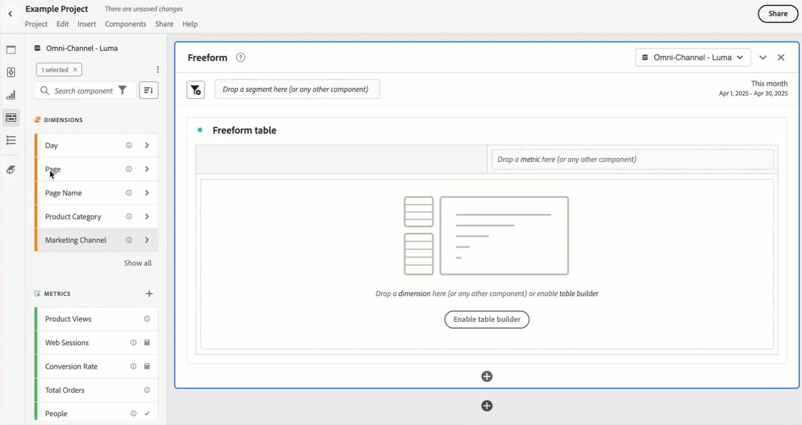

# Vue d’ensemble des composants

Les composants sont des fonctionnalités de Customer Journey Analytics qui peuvent être utilisées dans des visualisations (telles qu’un tableau à structure libre) ou qui complètent les fonctionnalités de rapport.

Pour gérer les composants à partir de l’interface principale de Customer Journey Analytics :

1. Sélectionnez **[!UICONTROL Composants]** dans la barre supérieure.
1. Sélectionnez **[!UICONTROL Composants]** pour afficher une vue d’ensemble des composants que vous pouvez gérer ou sélectionnez directement dans le menu le composant que vous souhaitez gérer.

Vous pouvez gérer les composants suivants :

* [Segments](segments/seg-overview.md) : créez, gérez, partagez et appliquez des segments d’audience puissants à vos rapports. Les segments vous permettent d’identifier des sous-ensembles de personnes selon des caractéristiques ou des interactions.
* [Mesures calculées :](calc-metrics/calc-metr-overview.md) utilisent les mesures et les formules comme nouveaux composants à utiliser dans les rapports.
* [Périodes](date-ranges/create.md) : permettent de personnaliser et d’affiner les offres Analysis Workspace.
* [Annotations](/help/components/annotations/overview.md) : communiquez les nuances et les informations concernant les données contextuelles à votre organisation.
* [Alertes intelligentes](/help/components/c-intelligent-alerts/intelligent-alerts.md) : elles vous permettent de recevoir une notification lorsque des pourcentages ou des points de données spécifiques sont modifiés.
* [Projets planifiés](/help/analysis-workspace/curate-share/t-schedule-report.md#scheduled-projects-manager) : gérez vos projets planifiés.
* [Préférences](/help/analysis-workspace/user-preferences.md) : gérez les préférences d’Analysis Workspace.
* [Audiences](/help/components/audiences/audiences-overview.md) : créez et publiez des audiences à partir de Customer Journey Analytics vers [Real-Time Customer Data Platform](https://experienceleague.adobe.com/fr/docs/experience-platform/profile/home) dans Experience Platform pour le ciblage et la personnalisation.
* [Exports](/help/components/exports/manage-export-locations.md) : gérez votre compte et emplacements d’export.

## Composants d’Analysis Workspace

Les composants d’Analysis Workspace sont constitués de mesures, dimensions, segments et périodes que vous pouvez glisser-déposer dans des panneaux et des visualisations de votre projet Workspace. Les composants personnalisés que vous créez sont ajoutés à ces panneaux, tels qu’une mesure calculée ou une période personnalisée.

Pour accéder au panneau Composants, sélectionnez  **[!UICONTROL Composants]** dans le panneau des boutons.

Consultez [Créer un projet](/help/analysis-workspace/home.md) pour plus d’informations sur l’utilisation de composants dans un projet.

## Gestion des composants {#actions}

Vous pouvez rapidement créer un composant à l’aide du menu **[!UICONTROL Composants]** dans Analysis Workspace. Pour plus d’informations, consultez le [menu Analysis Workspace](/help/analysis-workspace/home.md#menu).

Vous pouvez gérer les composants (individuellement ou en en sélectionnant plusieurs).

1. Sélectionnez un ou plusieurs composants.

1. Dans le menu contextuel ou à partir du bouton d’actions de composant  (en haut des composants), sélectionnez l’une des actions suivantes.

   >[!TIP]
   >
   >Vous pouvez sélectionner plusieurs composants en maintenant la touche **[!UICONTROL Maj]** enfoncée ou en maintenant enfoncée la touche **[!UICONTROL Commande]** (sur Mac) ou **[!UICONTROL Ctrl]** (sur Windows).

   {width=100%}

   | Action des composants | Description |
   |--- |--- |
   |  [!UICONTROL **Étiquette**] | Organisez ou gérez les composants en leur appliquant des étiquettes. Vous pouvez ensuite effectuer une recherche par étiquette dans le panneau de gauche en sélectionnant le filtre  ou en saisissant `#`. Les étiquettes servent également de filtres dans les gestionnaires de composants. |
   |  [!UICONTROL **Ajouter aux favoris**] | Ajoutez le composant à votre liste de favoris. Comme avec les étiquettes, vous pouvez effectuer une recherche par Favoris dans le panneau de gauche et les utiliser comme filtre dans le gestionnaire de composants. |
   |  **[!UICONTROL Retirer des favoris]** | Retire le composant de votre liste de favoris. |
   |  [!UICONTROL **Approuver**] | Marquez les composants comme Approuvés pour signaler à vos utilisateurs et utilisatrices que le composant est approuvé par l’organisation. Comme les étiquettes, vous pouvez rechercher et filtrer par Approuvé dans le panneau de gauche. Une  identifie les composants approuvés. |
   |  [!UICONTROL **Partager**] | Partagez des composants avec des utilisateurs de votre organisation. Cette option est uniquement disponible pour les composants personnalisés, tels que les segments ou les mesures calculées. |
   |  [!UICONTROL **Supprimer**] | Supprimez les composants dont vous n’avez plus besoin. Cette option est uniquement disponible pour les composants personnalisés, tels que les segments ou les mesures calculées. |

Les composants personnalisés peuvent également être gérés par l’intermédiaire de leurs gestionnaires de composants respectifs. Par exemple, consultez [Gérer les segments](/help/components/segments/seg-manage.md).

## Gestion de la liste des composants

Vous pouvez rechercher, filtrer et trier la liste des composants dans le panneau de gauche d’Analysis Workspace afin de localiser un composant particulier.

### Recherche

1. Sélectionnez l’icône **Composants**  dans le panneau de gauche.

2. Dans le champ de recherche, commencez à saisir le nom du composant que vous souhaitez utiliser dans votre projet.

   Une couleur et une icône permettent d’identifier le type de composant. **Les dimensions**  sont orange, **les segments**  sont bleus, **les périodes**  sont violettes et **les mesures**  sont vertes. L’icône Adobe  indique soit un modèle de mesure calculée, soit un modèle de segment. L’icône de calculateur  indique une mesure calculée créée par un administrateur ou une administratrice de votre organisation.

3. Sélectionnez le composant dans le menu déroulant.

### Filtre

1. Sélectionnez l’icône **Composants**  dans le panneau de gauche.

2. Sélectionnez **Filtre**  ou saisissez `#` dans le champ de recherche.

3. Sélectionnez l’une des options de filtre suivantes pour filtrer la liste des composants :

   | Icône | Option de filtre | Description |
   |---------|---|----------|
   |  | **[!UICONTROL Approuvés]** | Afficher uniquement les composants marqués comme approuvés par l’administration. |
   |  | **[!UICONTROL Favoris]** | Affichez uniquement les composants figurant dans votre liste de favoris.  Pour plus d’informations sur l’ajout de composants à votre liste de favoris, consultez [Gérer les composants](#manage-components). |
   |  | **[!UICONTROL Dimensions]** | Afficher uniquement les composants qui sont des dimensions. |
   |  | **[!UICONTROL Mesures]** | Afficher uniquement les composants qui sont des mesures. |
   |  | **[!UICONTROL Segments]** | Afficher uniquement les composants qui sont des segments. |
   |  | **[!UICONTROL Périodes]** | Affiche uniquement les composants qui sont des périodes. |
   |  | **[!UICONTROL *Nom d’étiquette *]** | Affiche uniquement les composants avec les étiquettes spécifiques sélectionnées. Une étiquette dédiée est disponible pour le modèle d’Adobe qui sont les [mesures calculées par défaut](/help/components/calc-metrics/default-calcmetrics.md) d’Adobe. |

   Sélectionnez  dans un filtre pour supprimer le filtre.

4. Vous pouvez éventuellement trier la liste des composants, comme décrit dans [Trier la liste des composants](#sort-the-component-list).

### Tri

<!-- {{release-limited-testing-section}}-->

1. (Facultatif) Appliquez des filtres à la liste des composants, comme décrit dans la section [Filtrer la liste des composants](#filter-the-component-list).

2. Sélectionnez **Composants**  dans le panneau de gauche.

3. Sélectionnez **Trier** , puis sélectionnez l’une des options de filtre suivantes pour trier la liste des composants.

Les options de tri disponibles sont les suivantes :

{{components-sort-options}}

## Autorisations d’accès

Dans Analysis Workspace, les administrateurs et les administratrices peuvent [choisir](/help/analysis-workspace/curate-share/curate.md) les composants à présenter aux utilisateurs et aux utilisatrices dans les rapports.
