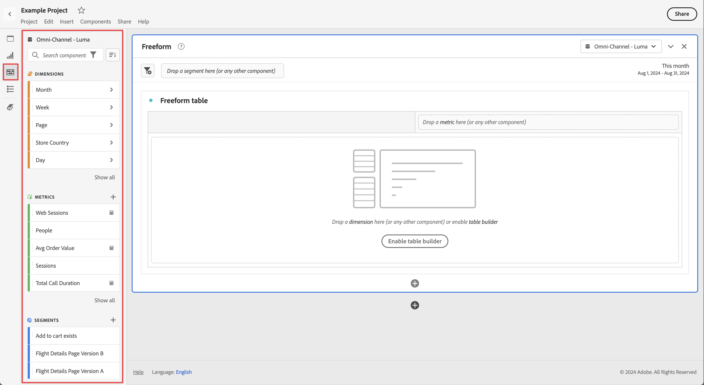

# Vue d’ensemble des composants

Les composants sont des fonctionnalités de Customer Journey Analytics qui peuvent être utilisées dans les visualisations (comme le tableau à structure libre) ou pour compléter les fonctionnalités de création de rapports.

Pour gérer les composants à partir de l’interface de Customer Journey Analytics principale :

1. Sélectionnez **[!UICONTROL Components]** dans la barre supérieure.
1. Sélectionnez **[!UICONTROL Composants]** pour afficher un aperçu des composants que vous pouvez gérer ou sélectionner directement le composant à gérer dans le menu.

Vous pouvez gérer les composants suivants :

* [Filtres](filters/filters-overview.md) : compilez, gérez, partagez et appliquez des filtres d’audience puissants et cadrés à vos rapports. Les filtres vous permettent d’identifier des sous-ensembles de personnes selon des caractéristiques ou des interactions.
* [Mesures calculées :](calc-metrics/calc-metr-overview.md) utilisent les mesures et les formules comme nouveaux composants à utiliser dans les rapports.
* [Périodes](date-ranges/create.md) : permettent de personnaliser et d’affiner les offres Analysis Workspace.
* [Annotations](/help/components/annotations/overview.md) : communiquez les nuances et les informations concernant les données contextuelles à votre organisation.
* [Alertes intelligentes](/help/components/c-intelligent-alerts/intelligent-alerts.md) : vous permet d’être averti en fonction de pourcentages modifiés ou de points de données spécifiques.
* [Projets planifiés](/help/analysis-workspace/export/t-schedule-report.md#scheduled-projects-manager) : gérez vos projets planifiés.
* [Préférences](/help/analysis-workspace/user-preferences.md) : gérez les préférences d’Analysis Workspace.
* [Audiences](/help/components/audiences/audiences-overview.md) : créez et publiez des audiences de Customer Journey Analytics vers [Real-Time Customer Data Platform](https://experienceleague.adobe.com/en/docs/experience-platform/profile/home) dans Experience Platform pour le ciblage et la personnalisation.
* [Exports](/help/components/exports/manage-export-locations.md) : gérez votre compte d’exportation et vos emplacements.

## Composants d’Analysis Workspace

Les composants d’Analysis Workspace se composent de mesures, de dimensions, de filtres et de périodes que vous pouvez faire glisser sur les panneaux et les visualisations de votre projet Workspace. Les composants personnalisés que vous créez sont ajoutés à ces panneaux, par exemple une mesure calculée ou une période personnalisée.

Pour accéder au panneau Composants, sélectionnez  **[!UICONTROL Composants]** dans le panneau des boutons.

Voir [Création d’un projet](/help/analysis-workspace/home.md) pour plus d’informations sur l’utilisation des composants dans un projet.

+++ Affichez une vidéo montrant les possibilités des composants :

>[!VIDEO](https://video.tv.adobe.com/v/23979)

+++

## Gérer les composants {#actions}

Vous pouvez rapidement créer un composant à l’aide du menu **[!UICONTROL Composants]** dans Analysis Workspace. Pour plus d’informations, voir le [menu Analysis Workspace](/help/analysis-workspace/home.md#menu) .

Vous pouvez gérer les composants (individuellement ou en sélectionnant plusieurs).

1. Sélectionnez un ou plusieurs composants.

1. Dans le menu contextuel ou à partir du bouton d’actions  Component (en haut des composants), sélectionnez l’une des actions suivantes.

   >[!TIP]
   >
   >Vous pouvez sélectionner plusieurs composants en maintenant la touche **[!UICONTROL Maj]** ou **[!UICONTROL Commande]** (sur macOS) ou **[!UICONTROL Ctrl]** (sous Windows).

   {width=100%}

   | Action des composants | Description |
   |--- |--- |
   |  [!UICONTROL **Balise**] | Organisez ou gérez les composants en leur appliquant des balises. Vous pouvez ensuite effectuer une recherche par balise dans le panneau de gauche en sélectionnant le filtre  ou en tapant `#`. Les balises servent également de filtres dans les gestionnaires de composants. |
   |  [!UICONTROL **Favori**] | Ajoutez le composant à votre liste de favoris. Comme les balises , vous pouvez rechercher par Favoris dans le panneau de gauche et les filtrer dans les gestionnaires de composants. |
   |  **[!UICONTROL Un-favori]** | Supprimez le composant de votre liste de favoris. |
   |  [!UICONTROL **Approuver**] | Marquez les composants comme Approuvés pour signaler à vos utilisateurs que le composant est approuvé par l’organisation. Comme les balises , vous pouvez rechercher et filtrer par Approuvé dans le panneau de gauche. Une  identifie les composants approuvés. |
   |  [!UICONTROL **Partager**] | Partagez des composants avec des utilisateurs et utilisatrices de votre organisation. Cette option est uniquement disponible pour les composants personnalisés, tels que les filtres ou les mesures calculées. |
   |  [!UICONTROL **Supprimer**] | Supprimez les composants dont vous n’avez plus besoin. Cette option est uniquement disponible pour les composants personnalisés, tels que les filtres ou les mesures calculées. |

Les composants personnalisés peuvent également être gérés par l’intermédiaire de leurs gestionnaires de composants respectifs. Par exemple, voir [Gestion des filtres](/help/components/filters/manage-filters.md).

## Gestion de la liste des composants

Vous pouvez rechercher, filtrer et trier la liste des composants dans le panneau de gauche d’Analysis Workspace pour localiser un composant particulier.

### Recherche

1. Sélectionnez **Composants**  dans le panneau de gauche.

2. Dans le champ de recherche, commencez à saisir le nom du composant que vous souhaitez utiliser dans votre projet.

   Une couleur et une icône identifient le type de composant. **Les Dimensions**  sont orange, **Filtres**  sont bleues, **Plages de dates**  est violette et **Mesures**  est verte. L’icône d’Adobe  indique un modèle de mesure calculée ou un modèle de filtre. L’icône de calculateur  indique une mesure calculée créée par un administrateur de votre entreprise.

3. Sélectionnez le composant dans la liste déroulante.

### Filtre

1. Sélectionnez l’icône **Composants**  dans le panneau de gauche.

2. Sélectionnez ****  ou entrez `#` dans le champ de recherche.

3. Sélectionnez l’une des options de filtre suivantes pour filtrer la liste des composants :

   | Icône | Option de filtrage | Description |
   |---------|---|----------|
   |  | **[!UICONTROL Approuvés]** | Afficher uniquement les composants marqués comme approuvés par l’administration. |
   |  | **[!UICONTROL Favoris]** | Affichez uniquement les composants figurant dans votre liste de favoris.  Pour plus d’informations sur l’ajout de composants à votre liste de favoris, voir [Gestion des composants](#manage-components). |
   |  | **[!UICONTROL Dimensions]** | Afficher uniquement les composants qui sont des dimensions. |
   |  | **[!UICONTROL Mesures]** | Afficher uniquement les composants qui sont des mesures. |
   |  | **[!UICONTROL Filtres]** | Afficher uniquement les composants qui sont des filtres. |
   |  | **[!UICONTROL Périodes]** | Afficher uniquement les composants qui sont des plages de dates. |
   |  | **[!UICONTROL *Nom de balise *]** | Afficher uniquement les composants avec les balises sélectionnées spécifiques. Une balise dédiée est disponible pour le modèle d’Adobe qui sont les [ mesures calculées par défaut](/help/components/calc-metrics/default-calcmetrics.md) d’Adobe. |

   Sélectionnez  dans un filtre pour supprimer le filtre.

4. Vous pouvez éventuellement trier la liste des composants, comme décrit dans [Trier la liste des composants](#sort-the-component-list).

### Tri

<!-- {{release-limited-testing-section}}-->

1. (Facultatif) Appliquez des filtres à la liste des composants, comme décrit dans la section [Filtrer la liste des composants](#filter-the-component-list).

2. Sélectionnez **Composants**  dans le panneau de gauche.

3. Sélectionnez **Trier** , puis sélectionnez l’une des options de filtre suivantes pour trier la liste des composants.

Les options de tri suivantes sont disponibles :

{{components-sort-options}}

## Autorisations d’accès

Dans Analysis Workspace, les administrateurs peuvent [traiter](/help/analysis-workspace/curate-share/curate.md) les composants exposés aux utilisateurs dans les rapports.
