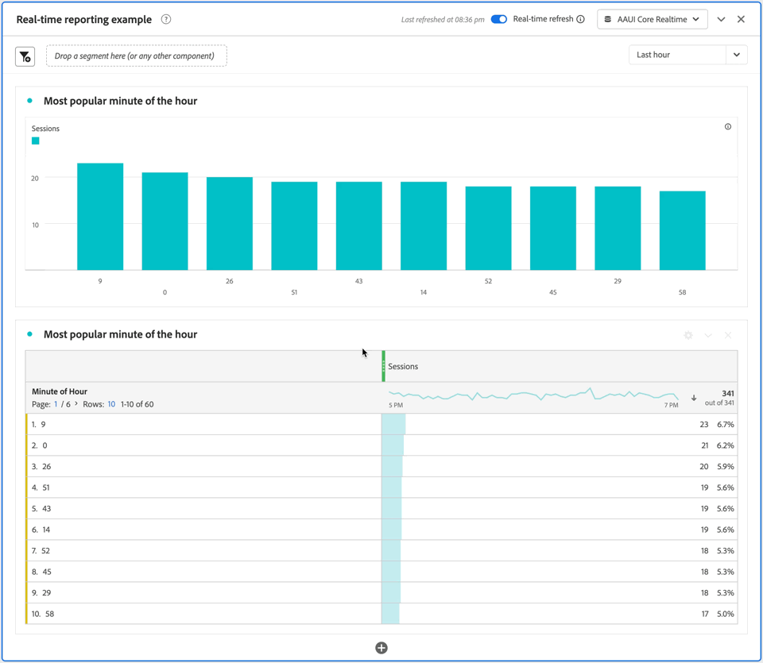

# Utiliser la création de rapports en temps réel {#use-real-time-reporting}

>[!CONTEXTUALHELP]
>id="workspace_panel_realtime_refresh"
>title="Actualisation en temps réel"
>abstract="Activez pour actualiser les données et les visualisations de ce panneau en temps réel."

Pour utiliser les rapports en temps réel, activez le bouton (bascule) **[!UICONTROL Actualisation en temps réel]** sur l’un des panneaux suivants de votre projet Workspace :

* [Panneau vierge](/help/analysis-workspace/c-panels/blank-panel.md)
* [Tableau à structure libre](/help/analysis-workspace/c-panels/freeform-panel.md)
* [Attribution](/help/analysis-workspace/c-panels/attribution.md)
* [Élément suivant ou précédent](/help/analysis-workspace/c-panels/next-previous.md)

Un message contenant la date et l’heure de la dernière actualisation des données s’affiche. Par exemple : [!UICONTROL &#x200B; *Dernière actualisation à 19 :55*].

Sélectionnez la période en temps réel sur laquelle vous souhaitez créer des rapports dans le menu déroulant. Les options disponibles sont les suivantes :

* [!UICONTROL 15 dernières minutes]
* [!UICONTROL 30 dernières minutes]
* [!UICONTROL Dernière heure &#x200B;]
* [!UICONTROL 8 dernières heures]
* [!UICONTROL Dernières 24 heures]

Toutes les visualisations du panneau sont désormais mises à jour chaque minute pendant 30 minutes maximum, tandis que l’onglet du navigateur avec le panneau Actualisation en temps réel activé est actif.

À titre d’exemple, consultez ci-dessous un instantané d’un **[!UICONTROL panneau de création de rapports en temps réel]** qui actualise la visualisation de la barre **[!UICONTROL Chiffre d’affaires total/heure]** et le tableau à structure libre **[!UICONTROL Chiffre d’affaires total/heure]** à mesure que le temps passe de **[!UICONTROL *06:26pm*]** à **[!UICONTROL *06:27 pm *]**.

Au bout de 30 minutes, ou dès que l’onglet du navigateur devient inactif, le bouton **[!UICONTROL Actualisation en temps réel]** est automatiquement désactivé et les mises à jour en temps réel sont arrêtées.

Dès que le bouton (bascule) Actualisation en temps réel est désactivé, le panneau (et toutes les visualisations qu’il contient) revient à [utiliser les données et fonctionnalités de création de rapports standard de Customer Journey Analytics](real-time.md#how-it-works).
