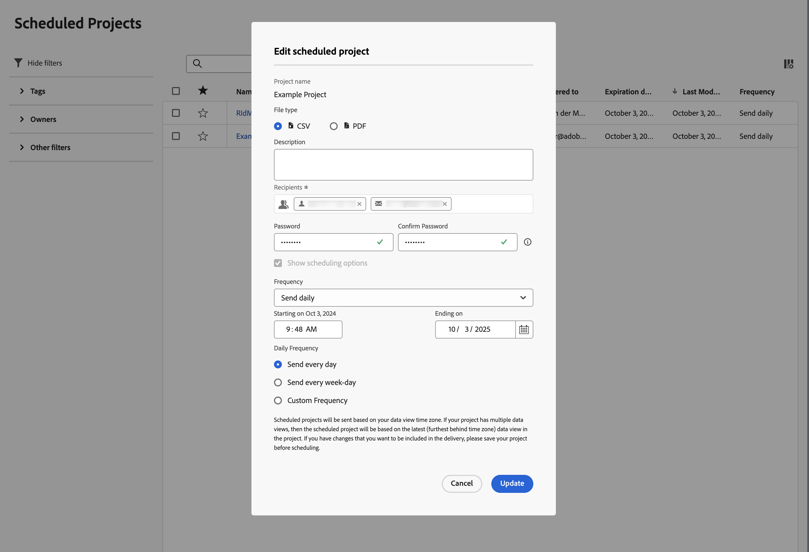

# Projets planifiés

Les projets Analysis Workspace planifiés peuvent être gérés dans Customer Journey Analytics à l’aide de **[!UICONTROL Composants]** > **[!UICONTROL Projets planifiés]**.

Dans **[!UICONTROL Projets planifiés]**, vous pouvez modifier et supprimer les planifications de projets récurrentes.  La [liste des projets planifiés](#scheduled-project-list) affiche les éléments créés par un utilisateur spécifique. Si le compte utilisateur est désactivé dans l’application, toutes les diffusions planifiées s’arrêtent.

## Liste des projets planifiés

La liste Projets planifiés affiche ➊ des colonnes pour :

| Colonne | Description |
| --- | --- |
|  | Lorsqu’un ou plusieurs projets planifiés sont sélectionnés, une barre d’actions bleue s’affiche en bas de l’interface des Projets planifiés . Pour plus de détails, consultez [Actions](#actions). |
|  | Sélectionnez pour favoriser  ou annuler la préférence  un projet planifié. |
| **[!UICONTROL Identifiant de planning]** | Identifiant utilisé principalement à des fins de débogage. |
| **[!UICONTROL Nom]** | Nom de ce projet. Sélectionnez  pour afficher plus de détails sur le projet planifié. Sélectionnez  pour ouvrir un menu contextuel. À partir de ce menu, vous pouvez :<ul><li> **[!UICONTROL Supprimer]** un projet planifié.</li><li> **[!UICONTROL Balise]** un projet planifié.</li><li> **[!UICONTROL Approuver]** un projet planifié.</li><li> **[!UICONTROL Export CSV]** : exportez un projet planifié dans un fichier CSV.</li></ul> |
| **[!UICONTROL Propriétaire]** | Personne qui a créé le projet et qui en est propriétaire. |
| **[!UICONTROL Balises]** | (facultatif) Le balisage est un moyen efficace d’organiser les projets. Tous les utilisateurs peuvent créer des balises et en appliquer une ou plusieurs à un projet. Néanmoins, vous ne pouvez afficher les balises que pour les projets que vous possédez ou qui ont été partagés avec vous. |
| **[!UICONTROL Distribué à]** | Les destinataires de ce projet planifié. |
| **[!UICONTROL Date d’expiration]** | Vous pouvez définir des dates d’expiration maximales allant jusqu’à un an pour les projets planifiés, quelle que soit la fréquence de planification. |
| **[!UICONTROL Fréquence]** | Fréquence à laquelle vous souhaitez envoyer ce projet planifié à un ou plusieurs destinataires. |
| **[!UICONTROL Heure d’exécution]** | Heure à laquelle ce projet planifié est envoyé. |
| **[!UICONTROL Nombre de requêtes]** | Nombre de requêtes concernant ce projet. |
| **[!UICONTROL Période la plus longue]** | Période la plus longue définie pour le projet planifié. Cette valeur peut être pertinente pour examiner les problèmes de performances. Voir [Gestionnaire des activités de rapport](/help/reporting-activity-manager/reporting-activity-overview.md) pour plus d’informations. |
| **[!UICONTROL Nombre de requêtes]** | Nombre de requêtes exécutées pour le projet planifié. Cette valeur peut être pertinente pour examiner les problèmes de performances. Voir [Gestionnaire des activités de rapport](/help/reporting-activity-manager/reporting-activity-overview.md) pour plus d’informations. |

Vous pouvez utiliser  pour configurer les colonnes à afficher.

Recherchez un projet planifié à l’aide de . Vous pouvez également voir si des filtres sont appliqués à partir du panneau Filtres . Pour supprimer un filtre, sélectionnez . Pour supprimer tous les filtres, sélectionnez **[!UICONTROL Effacer tout]**.

Pour modifier un projet planifié, sélectionnez le titre du projet planifié. Utilisez la boîte de dialogue **[!UICONTROL Modifier le projet planifié]** pour mettre à jour les détails du planning. Voir [Envoyer des fichiers à d’autres](../analysis-workspace/export/t-schedule-report.md) pour plus d’informations.

Sélectionnez **[!UICONTROL Mettre à jour]** pour mettre à jour le planning.

## Actions

Voici des actions courantes du gestionnaire de projets planifiés : Vous pouvez sélectionner des actions dans le menu contextuel ou dans la barre d’actions bleue lors de la sélection d’un ou de plusieurs projets planifiés.

| Icône | Action | Description |
|:---:|---|---|
|  | **[!UICONTROL *x *sélectionné]** | Sélectionnez pour désélectionner les projets planifiés sélectionnés. |
|  | **[!UICONTROL Supprimer]** | Supprimer les projets planifiés sélectionnés pour le projet ; les projets ne sont pas supprimés. |
|  | **[!UICONTROL Étiquette]** | Balisez les projets planifiés sélectionnés. Dans les **[!UICONTROL Projets planifiés de balises]** sélectionnez des balises et sélectionnez **[!UICONTROL Enregistrer]** pour enregistrer. |
|  | **[!UICONTROL Approuver]** | Valider les projets planifiés sélectionnés. |
|  | **[!UICONTROL Exporter dans un fichier CSV]** | Exportez les projets planifiés sélectionnés vers un fichier nommé `Export Scheduled Projects List.csv`. |

## Filtre

Vous pouvez filtrer les projets planifiés [liste des projets planifiés](#scheduled-project-list) à l’aide du panneau de filtrage ➌. Pour afficher ou masquer le panneau Filtrer, utilisez .

Le panneau Filtrer se compose des sections suivantes.

### Balises

| Balises | Description |
|---|---|
| {width="300"} | La section **[!UICONTROL Balises]** permet de filtrer par balise. <ul><li>Vous utilisez  **[!UICONTROL Rechercher des balises]** pour rechercher les balises que vous souhaitez utiliser pour filtrer.</li><li>Vous pouvez sélectionnez plusieurs balises. Les balises disponibles dépendent des sélections effectuées dans d’autres sections du panneau Filtrer.</li><li>Les chiffres indiquent ce qui suit :<ul><li>7︎⃣ : nombre de projets planifiés associés à la balise spécifique.</li></ul></li></ul> |

### Propriétaires

| Propriétaire | Description |
|---|---|
| {width="300"} | La section **[!UICONTROL Propriétaire]** vous permet de filtrer les propriétaires. <ul><li>Utilisez  *Rechercher des propriétaires* pour rechercher les propriétaires que vous souhaitez utiliser pour filtrer.</li><li>Vous pouvez sélectionner plusieurs propriétaires. Les propriétaires disponibles dépendent des sélections effectuées dans d’autres sections du panneau Filtrer.</li><li>Les chiffres indiquent ce qui suit :<ul><li>4︎⃣ : nombre de projets planifiés associés au propriétaire spécifique.</li></ul></li></ul> |

### Autres filtres

| Autres filtres | Description |
|---|---|
| {width="300"} | La section **[!UICONTROL Autres filtres]** vous permet de filtrer selon un autre filtre prédéfini.<ul><li>Vous pouvez sélectionner l’une ou plusieurs des options suivantes :<ul><li> **[!UICONTROL Expiré]** : filtrez les projets planifiés ayant expiré.</li><li>**[!UICONTROL Échec]** : filtrez les projets planifiés pour lesquels la planification a échoué.</li></ul>Ce que vous pouvez sélectionner dépend de votre rôle et de vos autorisations.</li><li>Vous pouvez sélectionner plusieurs filtres. Les autres filtres disponibles dépendent des sélections effectuées dans d’autres sections du panneau Filtrer.</li><li>Les chiffres indiquent ce qui suit :<ul><li>4︎⃣ : nombre de projets planifiés associés à l’autre filtre spécifique.</li></ul></li></ul> |
