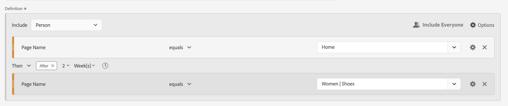
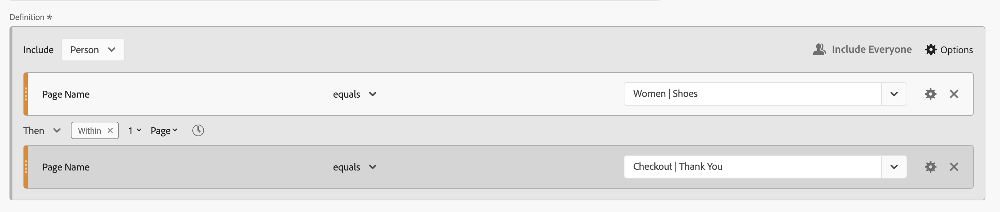
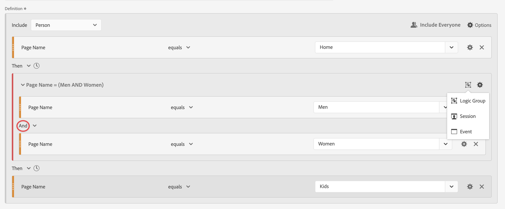

# Segments séquentiels

Vous créez des segments séquentiels à l’aide de l’opérateur logique [!UICONTROL Then] entre les composants, les conteneurs et les composants, ou les conteneurs. L’opérateur logique [!UICONTROL Then] implique qu’une condition de segment se produit, suivie d’une autre.

>[!BEGINSHADEBOX]

Voir  [Segmentation séquentielle](https://experienceleague.adobe.com/en/docs/analytics-learn/tutorials/components/segmentation/sequential-segmentation){target="_blank"} pour une vidéo de démonstration.

{{videoaa}}

>[!ENDSHADEBOX]

Un segment séquentiel comporte des [fonctionnalités de base](#basics) et des options supplémentaires que vous pouvez configurer pour ajouter plus de complexité au segment séquentiel :

* Contraintes [After et within](#after-and-within) pour la logique Then dans la définition de segment de séquence :

* Les données à [inclure](#include) dans la séquence globale de la définition de segment. Ou pour une séquence définie comme faisant partie d’un conteneur. Par défaut, toutes les données correspondantes sont prises en compte. Ces données sont identifiées par  [!UICONTROL Inclure tout le monde].

   * Sélectionnez  **[!UICONTROL Uniquement avant la séquence]** pour ne prendre en compte que les données antérieures à la séquence.
   * Sélectionnez  **[!UICONTROL Only After Sequence]** pour ne prendre en compte que les données postérieures à la séquence.

* Les données à [exclure](#exclude) dans le cadre de la définition de segment séquentiel.

* Comment [regrouper logiquement](#logic-group) les conditions dans votre définition de segment séquentiel.

## Concepts de base

Les principes de base de la création d’un segment séquentiel ne sont pas différents de la création d’un segment normal à l’aide du [créateur de segments](seg-builder.md). Vous pouvez utiliser le [créateur de définitions](seg-builder.md#definition-builder) pour créer votre définition de segment. Dans cette construction, vous utilisez des composants, des conteneurs, des opérateurs et une logique. Un segment standard devient un segment séquentiel dès que vous sélectionnez l’opérateur **[!UICONTROL Then]** dans la définition principale ou dans l’un des conteneurs que vous utilisez dans le [créateur de définitions](seg-builder.md#definition-builder).

### Exemples

Les exemples ci-dessous illustrent la manière dont vous utilisez les segments séquentiels dans divers cas d’utilisation.

#### Séquence simple

Identifiez les personnes qui ont consulté une page, puis consulté une autre page. Les données au niveau de l’événement sont segmentées à l’aide de cette séquence. Indépendamment des sessions de personne précédentes, passées ou intermédiaires, ou de l’heure ou du nombre de pages vues entre les sessions.

#### Séquence entre les sessions

Identifiez les personnes qui ont consulté une page au cours d’une session, puis qui ont consulté une autre page au cours d’une autre session. Pour différencier les sessions, utilisez des conteneurs pour créer la séquence et définir le niveau  **[!UICONTROL Session]** pour chaque conteneur.

#### Séquence de niveau mixte

Identifiez les personnes qui consultent deux pages sur un nombre indéterminé de sessions, puis visualisez une troisième page dans une session distincte. Là encore, utilisez des conteneurs pour créer la séquence et définir le niveau  **[!UICONTROL Session]** sur le conteneur qui définit la session distincte.

#### Séquence agrégée

Identifiez les personnes qui, lors de leur première session, ont visité une page spécifique, puis ont visité d’autres pages par la suite. Pour différencier la séquence d’événements, utilisez des conteneurs pour séparer la logique au niveau du conteneur  **[!UICONTROL Session]**.

#### Imbrication d’une séquence

Identifiez toutes les sessions au cours desquelles une personne visite une page avant une autre page, puis suivez des sessions qui impliquent deux autres pages. Par exemple, identifiez toutes les sessions où une personne visite d’abord la page d’accueil, puis une page de catégorie 1, puis comporte d’autres sessions où, dans chaque session, les pages de catégorie 2 et de catégorie 3 sont visitées.

## [!UICONTROL Après] et [!UICONTROL Dans]

Vous pouvez utiliser  **[!UICONTROL After]** et  **[!UICONTROL Within]** l’opérateur **[!UICONTROL Then]** pour définir des [contraintes de temps ou &#x200B;](#time-constraints)contraintes supplémentaires pour les événements, les sessions ou les dimensions[&#x200B; &#x200B;](#event-session-and-dimension-constraints).

### Contraintes de temps

Pour appliquer des contraintes de temps à l’opérateur **[!UICONTROL Then]** :

1. Sélectionnez .
1. Sélectionnez **[!UICONTROL Dans]** ou **[!UICONTROL Après]** dans le menu contextuel.
1. Spécifiez une période (**[!UICONTROL Minute]**, **[!UICONTROL Heure]**, jusqu’à **[!UICONTROL Années]**).
1. Sélectionnez le  **[!UICONTROL *nombre *]**&#x200B;pour ouvrir une fenêtre contextuelle qui vous permet de saisir ou de spécifier un nombre à l’aide de&#x200B;**[!UICONTROL -]**&#x200B;ou&#x200B;**[!UICONTROL +]**.

Pour supprimer une contrainte de temps, utilisez .

Le tableau ci-dessous explique plus en détail les opérateurs de contrainte de temps.

| Opérateurs | Description |
|--- |--- |
| **[!UICONTROL Après]** | L’opérateur [!UICONTROL After] est utilisé pour spécifier une limite minimale de temps entre deux points de contrôle. Lors de la définition des valeurs Après, le délai commence à courir lorsque le segment est appliqué. Par exemple, si l’opérateur [!UICONTROL After] est défini sur un conteneur pour identifier les personnes qui visitent la page A, mais ne reviennent pas sur la page B avant un jour, ce jour commence lorsque le visiteur quitte la page A.  Pour que le visiteur soit inclus dans le segment, un minimum de 1 440 minutes (un jour) doit s’écouler après avoir quitté la page A pour afficher la page B. |
| **[!UICONTROL Dans]** | L’opérateur [!UICONTROL Within] permet de spécifier une limite maximale de temps entre deux points de contrôle. Par exemple, si l’opérateur [!UICONTROL Within] est défini sur un conteneur pour identifier les personnes qui visitent la page A, puis reviennent visiter la page B dans la journée, alors ce jour commence lorsque la personne quitte la page A. Pour être inclus dans le segment, la personne dispose d’une durée maximale d’un jour avant d’ouvrir la page B. Pour que la personne soit incluse dans le segment, l’ouverture de la page B doit avoir lieu dans un délai maximal de 1 440 minutes (un jour) après avoir quitté la page A pour afficher la page B. |
| **[!UICONTROL Après mais dans]** | Lors de l’utilisation des opérateurs [!UICONTROL After] et [!UICONTROL Within], les deux opérateurs commencent et se terminent en parallèle, et non de manière séquentielle.  Par exemple, vous créez un segment dont le conteneur est défini sur : `After = 1 Week(s) and Within = 2 Week(s)`. Les conditions d’identification des visiteurs dans ce segment sont remplies uniquement entre une et deux semaines. Les deux conditions sont appliquées à partir de la première page vue. |

#### Exemples

Quelques exemples d’utilisation des contraintes de temps.

##### Opérateur [!UICONTROL After]

Identifiez les personnes qui ont consulté une page, puis une autre page uniquement après deux semaines. Par exemple, les personnes qui ont visité la page d’accueil, mais les femmes | Chaussures page seulement après deux semaines.

Si une page vue de l’Accueil se produit le 1er juin 2024 à 00:01, une page vue est alors affichée pour les femmes | Les chaussures correspondent tant que la page vue a lieu après le 15 juin 2024 00:01.

##### Opérateur [!UICONTROL Within]

Identifiez les personnes qui ont visité une page, puis une autre page dans les cinq minutes. Par exemple, les personnes qui ont visité la page d’accueil, puis les femmes | Page de chaussures dans les 5 minutes.

Si une page vue de l’Accueil se produit le 1er juin 2024, à l’adresse 12:01, une page vue de la page Femmes s’affiche | Les chaussures correspondent si cette page vue est antérieure au 15 juin 2024 12:16.

##### Opérateur [!UICONTROL After] but [!UICONTROL Within]

Identifiez les personnes qui ont visité une page, puis ont visité une autre page après deux semaines, mais dans un délai d’un mois. Par exemple, les personnes qui ont visité la page d’accueil, puis, après deux semaines et dans un délai d’un mois, les femmes | Page Chaussures.

Toutes les personnes qui accèdent à la page d’accueil le 1er juin 2024 et qui reviennent visiter les femmes | Page de chaussures postérieure au 15 juin 2019 00:01, mais antérieure au 1er juillet 2019 pour le segment.

### Contraintes [!UICONTROL Event], [!UICONTROL Session] et [!UICONTROL Dimension]

Les contraintes  **[!UICONTROL After]** et  **[!UICONTROL Within]** vous permettent non seulement de spécifier une contrainte de temps, mais aussi une contrainte d&#39;événement, de session ou de dimension. Sélectionnez **[!UICONTROL Événement(s)]**, **[!UICONTROL Session(s)]** ou **[!UICONTROL Autres dimensions]**  **[!UICONTROL *Nom du Dimension *]**. Vous pouvez utiliser le champ [!UICONTROL *Rechercher*] pour rechercher une dimension.

#### Exemple

Vous trouverez ci-dessous un exemple de segment séquentiel recherchant des personnes qui ont visité une page de catégorie de produits (Femmes) | Chaussures), suivie d’une page de passage en caisse (passage en caisse | Merci) sur une seule page.

Les exemples de séquences suivants correspondent ou ne correspondent pas :

| Séquence |  |
|--- | :---: |
| Page `Women \| Shoes` suivie de page `Checkout \| Thank You` |  |
| Page `Women \| Shoes` suivie de page `Women \| Tops` suivie de page `Checkout \| Thank You` |  |

## [!UICONTROL Inclure]

Vous pouvez spécifier les données à inclure dans votre segment séquentiel ou dans un conteneur séquentiel qui fait partie de votre segment séquentiel.

### [!UICONTROL &#x200B; Tout le monde &#x200B;] {#include_everyone}

Pour créer un segment séquentiel qui inclut tout le monde, sélectionnez l’option  **[!UICONTROL Inclure tout le monde]**.

Le segment séquentiel identifie les données qui correspondent au modèle donné dans son ensemble.  Vous trouverez ci-dessous un exemple de segment de séquence de base recherchant des personnes qui ont visité une page de catégorie de produits (Femmes) | Chaussures), suivie d’une page de passage en caisse (passage en caisse | Merci). Le segment est défini sur  **[!UICONTROL Inclure tout le monde]**.

Les exemples de séquences suivants correspondent ou ne correspondent pas :

| | Séquence |  |
|---:|--- | --- |
| 1 | `Women \| Shoes` ensuite `Checkout \| Thank You` dans la même session |  |
| 2 | `Women \| Shoes` puis `Men \| Shoes` puis `Checkout \| Thank You` (entre différentes sessions) |  |
| 3 | `Checkout \| Thank You` puis `Women \| Shoes` |  |

### [!UICONTROL Seulement avant la séquence] et [!UICONTROL Seulement après la séquence]

Les options  **[!UICONTROL Only Before Sequence]** et  **[!UICONTROL Only After Sequence]** segmentent les données en un sous-ensemble avant ou après la séquence spécifiée.

*  **Only Before Sequence** : inclut toutes les données précédant une séquence et les premières données de la séquence elle-même. Si une séquence apparaît plusieurs fois dans le cadre des données, [!UICONTROL Uniquement avant la séquence] inclut le premier accès de la dernière occurrence de la séquence et tous les accès précédents.
*  **Only After Sequence** : inclut tous les accès suivant une séquence et les dernières données de la séquence elle-même. Si une séquence apparaît plusieurs fois dans le cadre des données, [!UICONTROL Uniquement après la séquence] inclut le dernier accès de la première occurrence de la séquence et tous les accès suivants.

Prenons une définition spécifiant une séquence d’un composant avec des critères identifiés par B, suivie (Then) d’un composant avec des critères identifiés par D. Les trois options identifieraient les données comme suit :

| B Puis D | A | B | C | D | E | F |
|---|:---:|:---:|:---:|:---:|:---:|:---:|
| Inclure tout le monde |  |  |  |  |  |  |
| Seulement avant la séquence |  |  |  |  |  |  |
| Seulement après la séquence |  |  |  |  |  |  |

{style="table-layout:fixed"}

| B Puis D (se produit plusieurs fois) | A | B | C | D | B | C | D | E |
|---|:---:|:---:|:---:|:---:|:---:|:---:|:---:|:---:|
| Inclure tout le monde |  |  |  |  |  |  |  |  |
| Seulement avant la séquence |  |  |  |  |  |  |  |  |
| Seulement après la séquence |  |  |  |  |  |  |  |  |

{style="table-layout:fixed"}

#### Exemple

Vous avez défini trois versions d’un segment séquentiel pour les sections du site. Une avec l’option  **[!UICONTROL Inclure tout le monde]**, une avec l’option  **[!UICONTROL Only Before Sequence]** et une avec l’option  **[!UICONTROL Only After Sequence]**. Vous avez nommé les trois segments en conséquence.

Lors de la création de rapports sur les sections de site à l’aide de ces trois segments, l’exemple de sortie dans un tableau à structure libre ressemble à ceci :

## [!UICONTROL Exclure]

Les définitions de segment incluent toutes les données, sauf si vous excluez spécifiquement les données  [!UICONTROL Personne],  [!UICONTROL Session] ou  [!UICONTROL Event] à l’aide de **[!UICONTROL Exclude]**.

[!UICONTROL Exclure] vous permet d’ignorer les données courantes et de créer des segments avec plus de focus. Exclure permet également de créer des segments excluant des groupes de personnes spécifiques. Par exemple, pour définir un segment qui spécifie les personnes ayant passé des commandes, puis excluant ce groupe de personnes afin d’identifier *non-acheteurs*. Une bonne pratique consiste à créer des règles qui utilisent une définition large plutôt que d’essayer d’utiliser [!UICONTROL Exclure] pour cibler des personnes spécifiques qui correspondent à des valeurs d’inclusion spécifiques.

Voici quelques exemples de définitions d’exclusion :

* **Exclure des pages**. Utilisez une définition de segment pour exclure une page spécifique (telle que *Page d’accueil*) d’un rapport, créez une règle Événement où la page est égale à `Home Page`, puis excluez la règle. Cette définition inclut automatiquement toutes les pages, à l’exception de la *Page d’accueil*.
* **Exclure des domaines référents**. Utilisez une définition qui inclut uniquement les domaines référents de Google.com et exclut tous les autres.
* **Identifier les non-acheteurs**. Identifier les commandes supérieures à zéro, puis exclure la [!UICONTROL Personne].

[!UICONTROL Exclure] peut être utilisé pour identifier une séquence dans laquelle des personnes ne font pas partie de sessions spécifiques ou n’effectuent pas d’événements spécifiques. [!UICONTROL Exclure] peut également être inclus dans un [!UICONTROL Groupe logique] (voir ci-dessous).

Vous pouvez exclure les conteneurs, et non les composants.

### Exemples

Consultez ci-dessous des exemples d’utilisation de [!UICONTROL Exclure].

#### [!UICONTROL Exclure] dans

Identifiez les personnes qui ont visité une page, n’en ont pas visité une autre, puis ont visité une autre page. Vous excluez le conteneur à l’aide de  [!UICONTROL Exclure]. Un conteneur exclu est identifié par une fine barre rouge sur la gauche.

#### [!UICONTROL Exclure] au début

Identifiez les personnes qui ont visité une page sans jamais accéder à une autre page. Par exemple, les personnes qui ont extrait un achat sans jamais avoir visité la page d’accueil.

#### [!UICONTROL Exclure] à la fin

Identifiez les personnes qui ont visité une page mais n’ont jamais visité d’autres pages. Par exemple, les personnes qui ont visité votre page d’accueil, mais jamais aucune de vos pages de passage en caisse.

## [!UICONTROL Groupe logique]

>[!NOTE]
>
>Un [!UICONTROL Groupe logique] ne peut être défini que dans un segment séquentiel, ce qui signifie que l’opérateur [!UICONTROL Then] est utilisé dans le conteneur.

Les conteneurs Groupe logique servent à regrouper des conditions dans un point de contrôle de segment séquentiel unique. Dans le cadre de la séquence, la logique définie dans le conteneur identifié comme Groupe logique est évaluée après tout point de contrôle séquentiel précédent et avant tout point de contrôle séquentiel suivant.

Les conditions du groupe logique lui-même peuvent être remplies dans n&#39;importe quel ordre. En revanche, les conteneurs non séquentiels (événement, session, personne) n’ont pas besoin que leurs conditions soient remplies dans la séquence globale, ce qui produit des résultats inintuitifs possibles s’ils sont utilisés avec un opérateur Then.

[!UICONTROL Groupe logique] a été conçu pour traiter *plusieurs conditions en tant que groupe, sans ordre* parmi les conditions regroupées. Autrement dit, l’ordre des conditions au sein d’un groupe logique n’est pas pertinent.

Voici quelques bonnes pratiques d’utilisation du groupe logique :

* Pour regrouper des points de contrôle séquentiels.
* Pour simplifier la construction de segments séquentiels.

### Exemples

Voici des exemples d’utilisation du conteneur Groupe logique .

#### N’importe quelle commande

Identifiez les personnes qui ont visité une page, puis consulté chaque page d’un autre ensemble de pages dans n’importe quel ordre. Par exemple, les personnes qui ont visité la page d’accueil, puis ont visité chacune des pages Hommes, Femmes et Enfants, quel que soit l’ordre.

Vous pouvez créer ce segment sans [!UICONTROL &#x200B; Groupe logique &#x200B;], mais la construction sera complexe et laborieuse. Spécifiez chaque séquence de pages que le visiteur peut afficher. Pour plus de clarté, seul le premier conteneur est ouvert  et les autres conteneurs sont fermés . Vous pouvez dériver le contenu des autres conteneurs par les titres.

Vous pouvez utiliser [!UICONTROL Groupe logique] pour simplifier la création de ce segment, comme illustré ci-dessous. Veillez à sélectionner  **[!UICONTROL Groupe logique]** pour le conteneur.

#### Première correspondance

Identifiez les personnes qui ont visité une page ou une autre, puis qui ont visité une autre page. Par exemple, les personnes qui ont visité la page Femmes ou la page Hommes, puis qui ont visité le passage en caisse | Page de remerciement.

#### [!UICONTROL Exclure] [!UICONTROL Et]

Identifiez les personnes qui ont visité une page, puis qui n’ont pas visité explicitement un ensemble de pages, mais qui ont visité une autre page. Par exemple, les personnes qui ont visité la page d’accueil n’ont pas visité la page Hommes ou Femmes, mais ont visité la page Enfants.

#### [!UICONTROL Exclure] [!UICONTROL Ou]

Identifiez les personnes qui ont visité une page, puis qui n’ont visité explicitement aucune page d’un ensemble de pages, mais qui ont visité une autre page. Par exemple, les personnes qui ont visité la page d’accueil et qui n’ont pas visité la page Hommes et femmes, mais qui ont visité la page Enfants.

<!--
An example of a complex sequential segment if you want to find the persons that 

| Session One | Session Two | Session Three |
| --- | --- | --- |
| The person went to the main landing page A, excluded the campaign page B, and then viewed the Product page C.| The person again went to the main landing page A, excluded the campaign page B, and went again to the Product page C, and then to a new page D. | The person entered and followed that same path as in the first and second visits, then excluded page F to go directly to a targeted product on page G. |
-->

## Dernier exemple

Dernier exemple : vous souhaitez identifier les personnes qui ont appris quelque chose sur une page produit spécifique, sans que ces personnes n’aient jamais été contactées par votre campagne Donnez le pouvoir pour que vous bougiez. Et lors de leur première visite dans votre boutique en ligne, ils ont consulté la page d&#39;accueil, mais n&#39;ont pas examiné plus loin les produits de fitness (équipement) de la catégorie Hommes. Cependant, lors de la session suivante, directement après cela, ils sont allés sur une page produit et ont passé une commande en ligne sans passer par la page d&#39;accueil au préalable.

