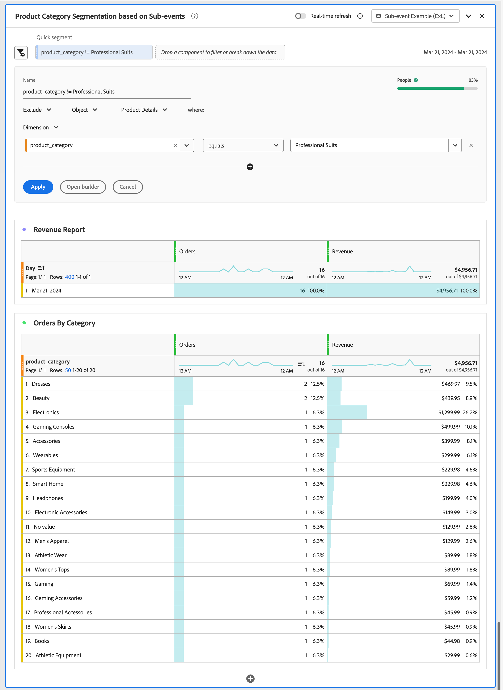

# Analyse des sous-événements

{{release-limited-testing}}

L&#39;analyse des sous-événements permet d&#39;analyser les données d&#39;un événement à un niveau plus granulaire que le niveau de l&#39;événement. Au lieu de filtrer des événements entiers, vous pouvez segmenter des événements sur des conteneurs individuels. Par exemple :

* Segmenter sur une catégorie de produits spécifique sans inclure tous les autres produits achetés dans la même commande.
* Segmentation d’une catégorie de ressources spécifique dans les données d’analyse de contenu.
* Segmentation d’un canal multimédia spécifique dans les données Media Analytics.

Dans Customer Journey Analytics, définissez les conteneurs d’une vue de données pour lesquels vous souhaitez utiliser l’analyse des sous-événements. Sans analyse des sous-événements, la segmentation d’un attribut d’élément de conteneur renvoie tous les événements, sessions, personnes, comptes (globaux) [!BADGE ]{type=Informative url="https://experienceleague.adobe.com/fr/docs/analytics-platform/using/cja-overview/cja-b2b/cja-b2b-edition" newtab=true tooltip="Customer Journey Analytics B2B Edition"}, groupes d’achats [!BADGE B2B edition]{type=Informative url="https://experienceleague.adobe.com/fr/docs/analytics-platform/using/cja-overview/cja-b2b/cja-b2b-edition" newtab=true tooltip="Customer Journey Analytics B2B Edition"}, opportunités [!BADGE B2B edition]{type=Informative url="https://experienceleague.adobe.com/fr/docs/analytics-platform/using/cja-overview/cja-b2b/cja-b2b-edition" newtab=true tooltip="Customer Journey Analytics B2B Edition"} ou autres [conteneurs](/help/data-views/create-dataview.md#containers-1) que vous avez définis. Il en résulte une attribution incorrecte et des mesures de revenus exagérées. L’analyse des sous-événements étend le filtre à des lignes de conteneur individuelles au sein d’un événement et résout ces problèmes.

Dans l’analyse de sous-événement, la logique d’exclusion se comporte différemment de l’exclusion standard au niveau de l’événement par rapport au conteneur. Lorsque vous excluez des attributs d’élément dans le conteneur, le segment renvoie des événements qui **contiennent des éléments** mais ne correspondent pas à vos critères d’exclusion. Le segment ne renvoie pas d’événements sans élément du tout.

## Exemple

Vous ne voulez mesurer les revenus provenant que de la catégorie des combinaisons professionnelles. Sans analyse des sous-événements, l’application d’un segment pour les suites professionnelles inclut le chiffre d’affaires de chaque produit sur une commande (événement) qui contient au moins un produit appartenant à la catégorie des suites professionnelles. Avec l’analyse des sous-événements, vous définissez le filtre au niveau du produit et ne renvoyez que les recettes des produits de la catégorie des suites professionnelles.

Vous devez également mesurer les revenus en ligne de toutes les autres catégories, à l&#39;exception de la catégorie des costumes professionnels.

>[!BEGINTABS]

>[!TAB Analyse des événements]

Dans le créateur de segments ou dans le cadre d’un **[!UICONTROL segment rapide]**, vous spécifiez pour **[!UICONTROL Inclure]** le **[!UICONTROL Dimension]** **[!UICONTROL product_category]** **[!UICONTROL est égal à]** **[!UICONTROL Vues professionnelles]** dans le conteneur **[!UICONTROL Events]**.

Par conséquent, toutes les commandes contenant au moins une **[!UICONTROL suite professionnelle]** **[!UICONTROL product_category]** sont prises en compte et le chiffre d’affaires des autres produits de ces commandes est inclus dans la mesure **[!UICONTROL chiffre d’affaires]**.
Lorsque vous générez des états sur les catégories, toutes les autres valeurs de **[!UICONTROL product_category]** sont générées dans le cadre d&#39;une commande incluant un produit avec le **[!UICONTROL Professional Suits]** **[!UICONTROL product_category]**.

>[!TAB Analyse des sous-événements]

Vous avez défini un **[!UICONTROL Détails du produit]** [conteneur personnalisé](/help/data-views/create-dataview.md#containers) dans votre vue de données à des fins d’analyse de sous-événements sur les produits.

Dans le créateur de segments ou dans le cadre d’un **[!UICONTROL segment rapide]**, vous spécifiez pour **[!UICONTROL Inclure]** le **[!UICONTROL Dimension]** **[!UICONTROL product_category]** **[!UICONTROL est égal à]** **[!UICONTROL Vues professionnelles]** dans le conteneur **[!UICONTROL Détails du produit]**.

Par conséquent, toutes les commandes contenant au moins une **[!UICONTROL suite professionnelle]** **[!UICONTROL product_category]** sont prises en compte et seul le chiffre d’affaires des produits appartenant à la **[!UICONTROL suite professionnelle]** **[!UICONTROL product_category]** est inclus pour la mesure **[!UICONTROL chiffre d’affaires]**.
Lorsque vous créez des rapports sur des catégories, seule la **[!UICONTROL suite professionnelle]** **[!UICONTROL product_category]** est signalée.

>[!TAB Analyse de sous-événements (exclure)]

Vous avez défini un **[!UICONTROL Détails du produit]** [conteneur personnalisé](/help/data-views/create-dataview.md#containers) dans votre vue de données à des fins d’analyse de sous-événements sur les produits.

Dans le créateur de segments ou dans le cadre d’un **[!UICONTROL segment rapide]**, vous spécifiez pour **[!UICONTROL Exclure]** le **[!UICONTROL Dimension]** **[!UICONTROL product_category]** **[!UICONTROL égal]** **[!UICONTROL Vues professionnelles]** dans le conteneur **[!UICONTROL Détails du produit]**.

Pour exclure au niveau du produit, les événements contenant au moins un produit sont inclus, puis l’exclusion au niveau des sous-événements est appliquée dans cette portée. Cette exclusion est différente de l’exclusion au niveau de l’événement, qui exclut l’événement entier.

>[!ENDTABS]
