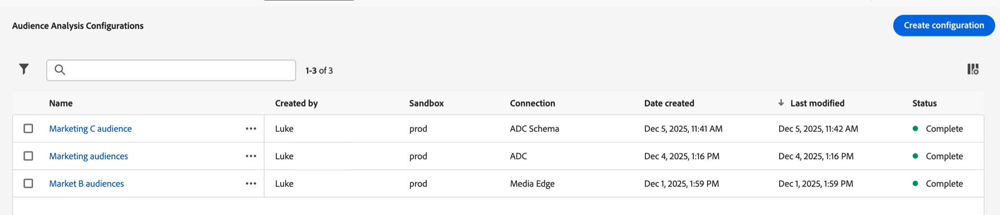

# Gestion des configurations d’analyse d’audience{#manage-audience-analysis}

Après avoir [créé des configurations d’analyse d’audience](/help/connections/audience-analysis/audience-analysis-configure.md), vous pouvez les afficher, les modifier ou les supprimer.

Seuls les administrateurs système peuvent gérer les configurations d’analyse d’audience.

Pour plus d’informations sur l’analyse de l’audience, voir [ Présentation de l’analyse de l’audience](/help/connections/audience-analysis/audience-analysis-overview.md).

## Affichage et filtrage des configurations existantes

Pour afficher vos configurations d’analyse d’audience existantes :

1. Dans Customer Journey Analytics, sélectionnez **[!UICONTROL Gestion des données]** > **[!UICONTROL Configuration de l’analyse de l’audience]**.

   

   Les colonnes d’informations suivantes sont disponibles pour chaque configuration :

   * **[!UICONTROL Créé par]** : utilisateur qui a créé la configuration.

   * **[!UICONTROL Sandbox]** : sandbox Experience Platform contenant le jeu de données de profil que vous avez ajouté à votre connexion.

   * **[!UICONTROL Connexion]** : la connexion que vous avez ajoutée à votre configuration.

   * **[!UICONTROL Date de création]** : date à laquelle la configuration a été créée.

   * **[!UICONTROL Dernière modification]** : date de la dernière modification de la configuration.

   * **[!UICONTROL Statut]** : le statut de la configuration. Les statuts possibles sont Terminé, En cours ou Échec. <!--true?-->

   Vous pouvez masquer des colonnes en sélectionnant l’icône Colonne , en désactivant les colonnes à masquer, puis en sélectionnant **[!UICONTROL Appliquer]**.

1. (Facultatif) Pour filtrer la liste des configurations, sélectionnez l’icône **Filtrer** , puis filtrez selon l’un des critères suivants :

   * **[!UICONTROL Connexion]**

   * **[!UICONTROL Créé par]**

   * **[!UICONTROL Sandbox]**

   * **[!UICONTROL Statut]**

## Modification d’une configuration

Pour modifier une configuration d’analyse d’audience existante :

1. Dans Customer Journey Analytics, sélectionnez **[!UICONTROL Gestion des données]** > **[!UICONTROL Configuration de l’analyse de l’audience]**.

   

1. Sélectionnez le nom de la configuration que vous souhaitez modifier.

   Ou

   Cochez la case en regard de la configuration à modifier, puis sélectionnez **[!UICONTROL Modifier]**.

1. Apportez les modifications souhaitées à la configuration, puis sélectionnez **[!UICONTROL Enregistrer]**.

## Suppression d’une configuration

Pour supprimer une configuration d’analyse d’audience existante :

1. Dans Customer Journey Analytics, sélectionnez **[!UICONTROL Gestion des données]** > **[!UICONTROL Configuration de l’analyse de l’audience]**.

   

1. Cochez la case en regard de la configuration à supprimer, puis sélectionnez **[!UICONTROL Supprimer]**.
