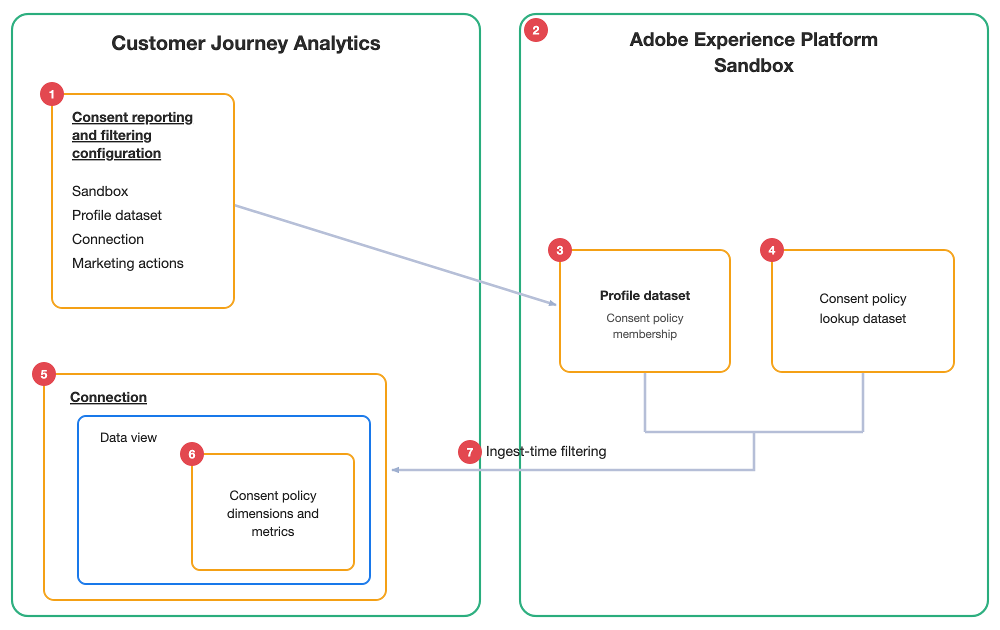

# Présentation de la création de rapports et du filtrage relatifs au consentement

Les rapports et le filtrage sur le consentement utilisent les données d’appartenance à la politique de consentement stockées dans vos jeux de données de profil Adobe Experience Platform pour vous aider à créer des rapports sur le consentement des visiteurs et, éventuellement, à exclure les visiteurs non consentants avant que leurs données ne soient ingérées dans Customer Journey Analytics.

Le diagramme suivant et le tableau associé présentent une représentation de haut niveau de la manière dont les rapports et le filtrage sur le consentement rendent les données de politique de consentement disponibles dans Analysis Workspace et filtrent les données des visiteurs au moment de l’ingestion :

| Nombre | Fonctionnalité | Fonction |
|---------|----------|---------|
| 1 | Configuration des rapports et du filtrage relatifs au consentement | Interface de configuration de Customer Journey Analytics utilisée pour activer les rapports de consentement et, éventuellement, le filtrage de consentement. |
| 2 | Sandbox | Doit contenir le jeu de données Profil qui inclut les données d’appartenance à la politique de consentement sur lesquelles vous souhaitez générer des rapports. |
| 3 | Jeu de données de profil | Inclut les données d’appartenance à la politique de consentement pour chaque visiteur. L’appartenance à une politique de consentement est stockée dans le champ `consentPoliciesIDMap` d’un jeu de données Profil. Ce jeu de données de profil est ajouté à la connexion que vous sélectionnez. 
Le profil de chaque visiteur répertorie les politiques de consentement auxquelles il correspond. Customer Journey Analytics lit ce champ pour rendre les politiques de consentement disponibles pour le compte rendu des performances et pour évaluer les visiteurs à inclure lors de l’ingestion.
 |
| 4 | Jeu de données de recherche de politique de consentement | Fournit des noms et descriptions de politiques conviviaux pour la création de rapports. Le jeu de données de recherche est créé automatiquement et synchronisé avec Experience Platform. Il existe au maximum un jeu de données de recherche de politique de consentement par sandbox. |
| 5 | Connexion | Connexion au sein de laquelle les rapports et le filtrage de consentement sont appliqués. Toutes les vues de données sous la connexion héritent de la configuration. |
| 6 | Composants de la politique de consentement | Nouvelles dimensions, mesures et champ dérivé qui représentent l’appartenance à une politique de consentement. Ces composants sont créés automatiquement et sont disponibles pour la création de rapports dans Analysis Workspace. |
| 7 | Filtrage au moment de l’ingestion | Lorsque le filtrage est activé, les visiteurs non consentants sont exclus lors de l’ingestion, en fonction des actions marketing que vous configurez. |

## Rapports de consentement par rapport au filtrage

La création de rapports de consentement et le filtrage sont deux fonctionnalités distinctes. Vous pouvez activer le compte rendu des performances sur le consentement seul ou activer à la fois le compte rendu des performances et le filtrage.

### Rapports de consentement

Lorsque vous activez la création de rapports de consentement, Customer Journey Analytics ajoute un ensemble de composants de politique de consentement aux vues de données sous la connexion configurée. Ces composants vous permettent d’utiliser Analysis Workspace pour signaler les visiteurs qui correspondent aux différentes politiques de consentement, à l’aide des données d’appartenance aux politiques de consentement dans vos jeux de données de profil Experience Platform.

Pour que les rapports restent lisibles, Customer Journey Analytics synchronise les noms et descriptions des politiques d’Experience Platform dans un jeu de données de recherche de politique de consentement. Lorsqu’une politique est créée, mise à jour, renommée ou supprimée dans Experience Platform, le jeu de données de recherche est automatiquement mis à jour.

Pour plus d’informations sur les composants créés par les rapports de consentement, voir [Analyse des données de politique de consentement](/help/connections/consent-reporting-filtering/consent-analyze.md).

### Filtrage du consentement

>[!IMPORTANT]
>
>Les données de consentement filtrées (exclues) ne sont pas stockées dans Customer Journey Analytics et ne peuvent pas être récupérées pour les dates antérieures en mettant à jour votre configuration.

Lorsque vous activez le filtrage par consentement, Customer Journey Analytics exclut les visiteurs non consentants au moment de l’ingestion. Comme le filtrage se produit au moment de l’ingestion, les données des visiteurs exclus n’entrent jamais dans Customer Journey Analytics et ne sont pas disponibles pour la création de rapports.

Tenez compte des points suivants lors de l’utilisation du filtrage du consentement :

* Customer Journey Analytics détermine les politiques de consentement qui s’appliquent aux actions marketing que vous avez configurées.

  Une action marketing représente une catégorie de données utilisées. Customer Journey Analytics détermine les politiques de consentement qui s’appliquent à chaque action marketing. Vous activez ensuite le filtrage de chaque action marketing indépendamment lors de la [création de votre configuration](/help/connections/consent-reporting-filtering/consent-configure.md#create-a-configuration).

  | Action marketing | Description |
  |---------|----------|
  | **[!UICONTROL Analytics]** | Rapports Customer Journey Analytics standard dans Analysis Workspace. |
  | **[!UICONTROL Science des données]** | Analyses avancées, machine learning et cas d’utilisation de la science des données. |

* Les données d’un visiteur ou d’une visiteuse ne sont ingérées que si celui-ci ou celle-ci correspond **toutes** aux politiques de consentement applicables. Si une politique applicable fait défaut à un visiteur, ses données sont exclues.

## Configuration des rapports et du filtrage liés au consentement

Lorsque vous configurez la création de rapports de consentement et le filtrage, vous sélectionnez le sandbox et le jeu de données Profil contenant les données d’appartenance à votre politique de consentement, choisissez la ou les connexions à configurer et choisissez de filtrer ou non les données pour chaque action marketing. Customer Journey Analytics crée ensuite automatiquement le jeu de données de recherche de politique de consentement et les composants de politique de consentement.

Pour plus d’informations, voir [Configuration des rapports et du filtrage de consentement](/help/connections/consent-reporting-filtering/consent-configure.md).

## Gérer les configurations de filtrage et de création de rapports relatives au consentement

Vous pouvez gérer les configurations de reporting et de filtrage liées au consentement après leur création. Vous pouvez afficher, modifier et supprimer des configurations.

Pour plus d’informations sur la gestion des configurations existantes, voir [Gérer les configurations de filtrage et de création de rapports de consentement](/help/connections/consent-reporting-filtering/consent-manage.md).

## Analyse des données de la politique de consentement

Les données de politique de consentement étant disponibles dans Customer Journey Analytics, vous pouvez indiquer quels visiteurs correspondent à quelles politiques de consentement et utiliser cette insight pour comprendre les audiences de consentement dans vos rapports.

Pour plus d’informations, voir [Analyse des données de la politique de consentement](/help/connections/consent-reporting-filtering/consent-analyze.md).

## Rapports de consentement et filtrage des rôles et des exigences d’autorisation

Les rôles Customer Journey Analytics suivants et les autorisations Experience Platform sont requis pour les rapports et le filtrage de consentement :

| Fonctionnalité | Exigences de rôle ou d’autorisation pour Customer Journey Analytics | Exigences d’autorisation pour Experience Platform |
|---------|----------|----------|
| [Créer des configurations de reporting et de filtrage relatives au consentement](/help/connections/consent-reporting-filtering/consent-configure.md) | Administrateur système | <ul><li>Jeux De Données : Lecture, Écriture</li><li>Schémas : lecture, écriture</li></ul> 
Un accès en lecture est requis pour le jeu de données Profil contenant les données d’appartenance à la politique de consentement. Un accès en écriture est requis, car un jeu de données de recherche de politique de consentement est créé et conservé synchronisé.
 |
| Affichage des composants de politique de consentement dans la vue de données | Administrateur de profil de produit pour le profil de produit auquel la vue de données est affectée 
Pour plus d’informations, voir [Contrôle d’accès](/help/technotes/access-control.md).
 | S.O. |
| Utilisation des composants de politique de consentement dans Analysis Workspace | Accès à une vue de données dans laquelle les composants de politique de consentement ont été ajoutés | S.O. |

## Rapports de consentement et cas d’utilisation de filtrage

Pour obtenir un exemple de cas d’utilisation qui mettent en évidence la valeur fournie par les rapports et le filtrage de consentement, consultez [&#x200B; Rapports et filtrage de consentement &#x200B;](/help/connections/consent-reporting-filtering/consent-use-cases.md).

## Limites de reporting et de filtrage du consentement

Tenez compte des limites suivantes lors de la [configuration des rapports et du filtrage de consentement](/help/connections/consent-reporting-filtering/consent-configure.md) :

* Un seul sandbox ne peut avoir qu’un seul jeu de données de recherche de politique de consentement. Plusieurs configurations dans le même sandbox partagent ce jeu de données de recherche.

* Une connexion ne peut être associée qu’à une seule configuration de rapport et de filtrage de consentement.
