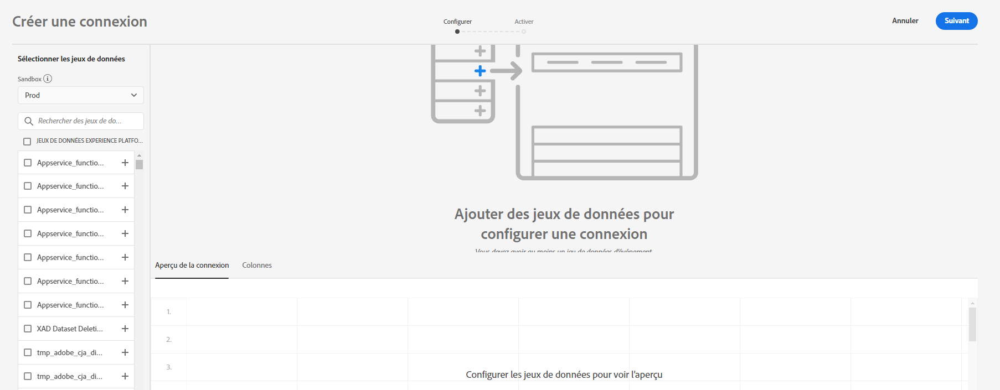
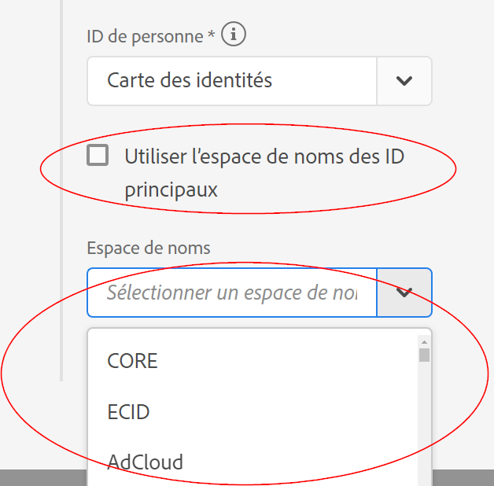

# Création d’une connexion

Une connexion vous permet d’intégrer des jeux de données [!DNL Adobe Experience Platform] dans [!UICONTROL Espace de travail]. Pour générer des rapports sur des jeux de données [!DNL Experience Platform], vous devez d’abord établir une connexion entre les jeux de données dans [!DNL Experience Platform] et [!UICONTROL Espace de travail].

Voici une présentation vidéo :

>[!VIDEO](https://video.tv.adobe.com/v/35111/?quality=12&learn=on)

## Autorisations nécessaires

Afin de créer une connexion CJA, vous avez besoin des autorisations suivantes dans [Adobe Admin Console](https://helpx.adobe.com/fr/enterprise/admin-guide.html/enterprise/using/manage-permissions-and-roles.ug.html) :

Adobe Experience Platform :
* Modélisation des données : Afficher les schémas, Gérer les schémas
* Gestion des données : Afficher les jeux de données, Gérer les jeux de données
* Ingestion des données : Gérer les sources

Customer Journey Analytics
* Accès administrateur de produit

>[!IMPORTANT]
>
>Vous pouvez combiner plusieurs jeux de données [!DNL Experience Platform] en une seule connexion.

## Sélection d’un environnement de test et de jeux de données

1. Accédez à [https://analytics.adobe.com](https://analytics.adobe.com) et connectez-vous avec votre Adobe ID.

1. Cliquez sur lʼicône [!DNL Customer Journey Analytics].

1. Cliquez sur l’onglet **[!UICONTROL Connexions]**.

1. Cliquez sur **[!UICONTROL Créer une nouvelle connexion]** en haut à droite.

   

1. Dans Experience Platform, choisissez un environnement de test qui contient le ou les jeux de données auxquels vous voulez créer une connexion.

   Adobe Experience Platform fournit des [environnements de test](https://experienceleague.adobe.com/docs/experience-platform/sandbox/home.html?lang=fr) qui divisent une instance de plateforme unique en environnements virtuels distincts pour favoriser le développement et l’évolution d’applications d’expérience numérique. Vous pouvez considérer les environnements de test comme des « silos de données » contenant des jeux de données. Les environnements de test permettent de contrôler l’accès aux jeux de données.  Une fois que vous avez sélectionné l’environnement de test, le rail de gauche affiche tous les jeux de données de cet environnement de test que vous pouvez extraire.

   >[!IMPORTANT]
   >
   >Vous ne pouvez pas accéder aux données d’un environnement de test à un autre, c’est-à-dire que vous pouvez uniquement combiner des jeux de données situés dans le même environnements de test.

1. Sélectionnez un ou plusieurs jeux de données à extraire dans [!UICONTROL Customer Journey Analytics] et cliquez sur **[!UICONTROL Ajouter]**.

   (Si vous avez le choix entre de nombreux jeux de données, vous pouvez rechercher les jeux de données appropriés à l’aide de la barre de **[!UICONTROL recherche des jeux de données]** située au-dessus de la liste des jeux de données.)

## Configuration d’un jeu de données

Sur le côté droit, vous pouvez désormais configurer le(s) jeu(x) de données que vous avez ajouté(s).


1. **[!UICONTROL Type de jeu de données]** : pour chaque jeu de données que vous avez ajouté à cette connexion, [!UICONTROL Customer Journey Analytics] définit automatiquement le type de jeu de données en fonction des données qui y sont entrées.

   Il existe trois types de jeux de données différents : les données [!UICONTROL Événement], les données [!UICONTROL Profil] et les données de [!UICONTROL Recherche].

   | Type de jeu de données | Description | Horodatage | Schéma | ID de personne |
   |---|---|---|---|---|
   | [!UICONTROL Événement] | Données qui représentent des événements dans le temps (par exemple, visites Web, interactions, transactions, données de point de vente, données de questionnaire, données d’impression, etc.). Par exemple, il peut s’agir de données de parcours de navigation standard, avec un ID de client ou un ID de cookie, et un horodatage. Avec les données d’événement, vous disposez d’une flexibilité quant à l’ID utilisé comme ID de personne. | Est automatiquement défini sur le champ d’horodatage par défaut à partir des schémas basés sur un événement dans [!UICONTROL Experience Platform]. | Tout schéma intégré ou personnalisé basé sur une classe XDM avec le comportement « Série temporelle ». Par exemple, « Événement d’expérience XDM » ou « Événement de décision XDM ». | Vous pouvez sélectionner l’ID de personne à inclure. Chaque schéma de jeux de données défini dans Experience Platform peut disposer de son propre ensemble d’une ou de plusieurs identités définies et associées à un Espace de nommage d’identité. N’importe lequel de ces paramètres peut être utilisé comme ID de personne. Par exemple, l’ID de cookie, l’ID regroupé, l’ID utilisateur, le code de suivi, etc. |
   | [!UICONTROL Recherche] | Ces données sont utilisées pour rechercher des valeurs ou des clés trouvées dans vos données d’événement ou de profil. Vous pouvez, par exemple, transférer des données de recherche qui font correspondre les identifiants numériques de vos données d’événement aux noms de produits. Voir [ce cas pratique d’utilisation](/help/use-cases/b2b.md) par exemple. | S.O. | Tout schéma intégré ou personnalisé basé sur une classe XDM avec le comportement « Enregistrement (Record) », à l’exception de la classe « Profil XDM individuel ». | S.O. |
   | [!UICONTROL Profil] | Données appliquées à vos visiteurs, utilisateurs ou clients dans les données [!UICONTROL Événement]. Vous permet, par exemple, de charger des données CRM à propos de vos clients. | S.O. | Tout schéma intégré ou personnalisé basé sur la classe « Profil XDM individuel ». | Vous pouvez sélectionner l’ID de personne à inclure. Chaque jeu de données défini dans [!DNL Experience Platform] a son propre jeu d’un ou plusieurs ID de personne définis, tels que l’ID de cookie, l’ID regroupé, l’ID d’utilisateur, le code de suivi, etc.<br>**Remarque** : Si vous créez une connexion qui comprend des jeux de données avec des ID différents, les rapports le reflèteront. Pour véritablement fusionner des jeux de données, vous devez utiliser le même ID de personne. |

1. **[!UICONTROL Identifiant du jeu de données]** : cet identifiant est généré automatiquement.

1. **[!UICONTROL Horodatage]** : pour les jeux de données d’événements uniquement, ce paramètre est automatiquement défini sur le champ d’horodatage par défaut des schémas basés sur un événement dans [!UICONTROL Experience Platform].

1. **[!UICONTROL Schéma]** : il s’agit du [schéma](https://experienceleague.adobe.com/docs/experience-platform/xdm/schema/composition.html?lang=fr) à partir duquel le jeu de données a été créé dans Adobe Experience Platform.

1. **[!UICONTROL ID de personne]** : sélectionnez un ID de personne dans la liste déroulante des identités disponibles. Ces identités ont été définies dans le schéma du jeu de données d’Experience Platform. Pour plus d’informations sur l’utilisation de la carte des identités en tant qu’ID de personne, reportez-vous à la section ci-dessous.

   >[!IMPORTANT]
   >
   >Si aucun ID de personne n’est disponible, cela signifie qu’un ou plusieurs ID de personne n’ont pas été définis dans le schéma. Consultez [cette vidéo](https://youtu.be/G_ttmGl_LRU) sur la façon de définir une identité dans Experience Platform.

1. Cliquez sur **[!UICONTROL Suivant]** pour accéder à la boîte de dialogue [!UICONTROL Activer la connexion].

### Utiliser la carte des identités comme ID de personne

Customer Journey Analytics prend désormais en charge la possibilité d’utiliser la carte des identités pour son ID de personne. La carte des identités est une structure de données de carte qui permet à quelqu’un de télécharger des paires clé -> valeur. Les clés sont des espaces de noms d’identité et la valeur est une structure qui contient la valeur de l’identité. La carte des identités existe sur chaque ligne/événement téléchargé et est renseignée pour chaque ligne en conséquence.

La carte des identités est disponible pour tout jeu de données qui utilise un schéma basé sur la classe [XDM ExperienceEvent](https://experienceleague.adobe.com/docs/experience-platform/xdm/home.html?lang=fr). Lorsque vous sélectionnez un jeu de données à inclure dans une connexion CJA, vous avez la possibilité de sélectionner un champ comme identifiant principal ou la carte des identités :



Si vous sélectionnez Carte des identités, vous disposez de deux options de configuration supplémentaires :

| Option | Description |
|---|---|
| [!UICONTROL Utiliser l’espace de noms des ID principaux] | Ceci indique à CJA, par ligne, de trouver l’identité dans la carte des identités signalée par un attribut primary=true et de l’utiliser comme ID de personne pour cette ligne. Cela signifie qu’il s’agit de la clé primaire qui sera utilisée dans Experience Platform pour le partitionnement. Il s’agit également du candidat idéal pour être utilisé en tant qu’identifiant visiteur de CJA (selon la façon dont le jeu de données est configuré dans une connexion de CJA). |
| [!UICONTROL Espace de noms] | (Cette option n’est disponible que si vous n’utilisez pas l’espace de noms des ID principaux.) Les espaces de noms d’identité sont des composants du [Adobe Experience Platform Identity Service](https://experienceleague.adobe.com/docs/experience-platform/identity/namespaces.html?lang=fr) qui servent d’indicateurs du contexte auquel une identité se rapporte. Si vous spécifiez un espace de noms, CJA recherche la carte des identités pour cette clé d’espace de noms dans chaque ligne et utilise l’identité sous cet espace de noms comme ID de personne pour cette ligne. Veuillez noter que, puisque CJA ne peut pas effectuer une analyse complète des jeux de données de toutes les lignes pour déterminer quels espaces de noms sont réellement présents, tous les espaces de noms possibles sont répertoriés dans la liste déroulante. Vous devez savoir quels espaces de noms sont spécifiés dans les données ; cela ne peut pas être détecté automatiquement. |

### Cas extrême de la carte des identités

Ce tableau présente les deux options de configuration lorsque des cas extrêmes sont présents et indique comment ils sont gérés :

| Option | Aucun ID n’est présent dans la carte des identités | Aucun ID n’est marqué comme principal | Plusieurs ID sont marqués comme principaux | L’ID unique est marqué comme principal | Espace de noms non valide avec un ID marqué comme principal |
|---|---|---|---|---|---|
| **[!UICONTROL Utiliser l’espace de noms des ID principaux] coché** | CJA abandonne la ligne. | CJA abandonne la ligne, car aucun ID principal n’est spécifié. | Tous les identifiants marqués comme principaux, sous tous les espaces de noms, sont extraits dans une liste. Ils sont ensuite triés par ordre alphabétique. Avec ce nouveau tri, le premier espace de noms avec son premier identifiant est utilisé comme ID de personne. | L’ID unique marqué comme principal est utilisé comme ID de personne. | Même si l’espace de noms peut être non valide (il n’est pas présent dans AEP), CJA utilisera l’ID principal sous cet espace de noms comme ID de personne. |
| **[!UICONTROL Espace de noms de carte des identités spécifique] sélectionné** | CJA abandonne la ligne. | Tous les identifiants sous l’espace de noms sélectionné sont extraits dans une liste et le premier est utilisé comme ID de personne. | Tous les identifiants sous l’espace de noms sélectionné sont extraits dans une liste et le premier est utilisé comme ID de personne. | Tous les identifiants sous l’espace de noms sélectionné sont extraits dans une liste et le premier est utilisé comme ID de personne. | Tous les identifiants sous l’espace de noms sélectionné sont extraits dans une liste et le premier est utilisé comme ID de personne. (Seul un espace de noms valide peut être sélectionné au moment de la création de la connexion. Il n’est donc pas possible qu’un espace de noms/ID non valide soit utilisé comme ID de personne). |

## Activer la connexion


1. Pour activer une connexion, définissez ces paramètres pour l’ensemble de la connexion, c’est-à-dire tous les jeux de données de la connexion :

   | Option | Description |
   | --- | --- |
   | [!UICONTROL Nommer la connexion] | Attribuez un nom explicite à la connexion. Impossible d’enregistrer la connexion sans nom. |
   | [!UICONTROL Description] | Ajoutez plus de détails pour distinguer cette connexion des autres. |
   | [!UICONTROL Jeux de données] | Les jeux de données inclus dans cette connexion. |
   | [!UICONTROL Importez automatiquement tous les nouveaux jeux de données dans cette connexion, dès aujourd’hui.] | Sélectionnez cette option si vous souhaitez établir une connexion en cours, de sorte que tous les nouveaux lots de données qui sont ajoutés aux jeux de données dans cette connexion soient automatiquement transférés dans [!UICONTROL Espace de travail]. |
   | [!UICONTROL Importer toutes les données existantes] | Lorsque vous sélectionnez cette option et enregistrez la connexion, toutes les données existantes (historiques) provenant de [!DNL Experience Platform] pour tous les jeux de données de cette connexion seront importés ou renvoyés. A l’avenir, toutes les données historiques existantes pour tout nouveau jeu de données ajouté à cette connexion enregistrée seront également importées automatiquement. Voir aussi [Données historiques de renvoi](https://experienceleague.adobe.com/docs/analytics-platform/using/cja-connections/create-connection.html?lang=fr#backfill-historical-data) ci-dessous.<br>**Notez qu’une fois cette connexion enregistrée, ce paramètre ne peut plus être modifié.** |
   | [!UICONTROL Nombre moyen d’événements quotidiens] | Vous devez indiquer le nombre moyen d’événements quotidiens à importer (nouvelles données **et** données de renvoi) pour tous les jeux de données de la connexion. Sélectionnez une option dans le menu déroulant. Cela permet à Adobe d’allouer suffisamment d’espace pour ces données.<br>Si vous ne connaissez pas le nombre moyen d’événements quotidiens que votre société va importer, vous pouvez effectuer une simple requête SQL dans [Adobe Experience Platform Query Services](https://experienceleague.adobe.com/docs/experience-platform/query/home.html?lang=fr) pour le savoir.<br>Voir « Calculer le nombre moyen dʼévénements quotidiens » ci-dessous. |

1. Cliquez sur **[!UICONTROL Enregistrer et créer une vue des données]**. Pour obtenir de la documentation, voir [créer une vue de données](/help/data-views/create-dataview.md).

### Données historiques de renvoi

**[!UICONTROL Importer toutes les données existantes]** permet de renvoyer des données historiques. N’oubliez pas ce qui suit :

* Nous avons supprimé la limite de renvoi (importation de données historiques). Auparavant, vous pouviez renvoyer un maximum de 2,5 milliards de lignes. Au-delà, vous étiez tenu de demander l’aide du service d’ingénierie. Désormais, vous pouvez renvoyer les données vous-même, sans aucune restriction.
* Nous donnons la priorité aux nouvelles données ajoutées à un jeu de données dans la connexion, de sorte que ces nouvelles données ont la latence la plus faible.
* Les données de renvoi (historiques) sont importées plus lentement. La latence est influencée par la quantité de données historiques dont vous disposez, combinée au paramètre **[!UICONTROL Nombre moyen d’événements quotidiens]** que vous avez sélectionné. Par exemple, si vous disposez de plus d’un milliard de lignes de données par jour, plus 3 ans de données historiques, l’import peut prendre plusieurs semaines. D’un autre côté, si vous avez moins d’un million de lignes par jour et une semaine de données historiques, celui-ci prendrait moins d’une heure.
* Le renvoi s’applique à l’ensemble de la connexion, et non à chaque jeu de données individuellement.
* Le [Connecteur source Adobe Analytics](https://experienceleague.adobe.com/docs/platform-learn/tutorials/data-ingestion/ingest-data-from-adobe-analytics.html?lang=fr) importe jusquʼà 13 mois de données, quelle que soit leur taille.

### Calculer le nombre moyen dʼévénements quotidiens

Ce calcul doit être effectué pour chaque jeu de données de la connexion.

1. Accédez à [Adobe Experience Platform Query Services](https://experienceleague.adobe.com/docs/experience-platform/query/home.html) et créez une nouvelle requête.

   La requête ressemblerait à ceci :

   ```
   Select AVG(A.total_events) from (Select DISTINCT COUNT (*) as total_events, date(TIMESTAMP) from analytics_demo_data GROUP BY 2 Having total_events>0) A;
   ```

   Dans cet exemple, « analytics_demo_data » est le nom du jeu de données.

1. Exécutez la requête `Show Tables` pour afficher tous les jeux de données existant dans AEP.
