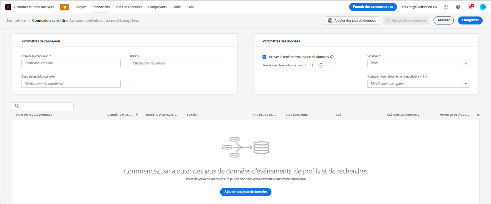
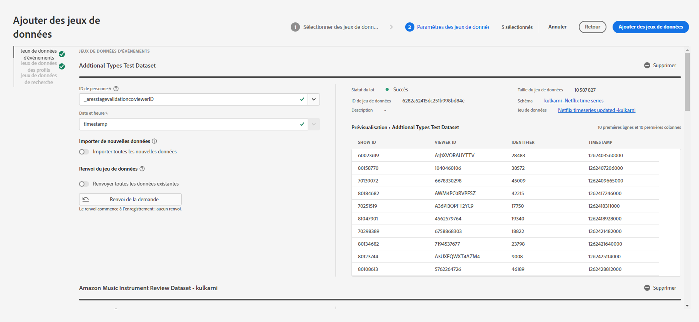
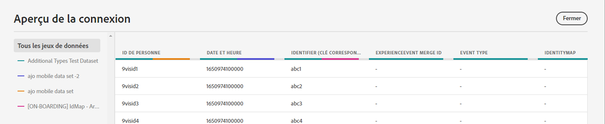
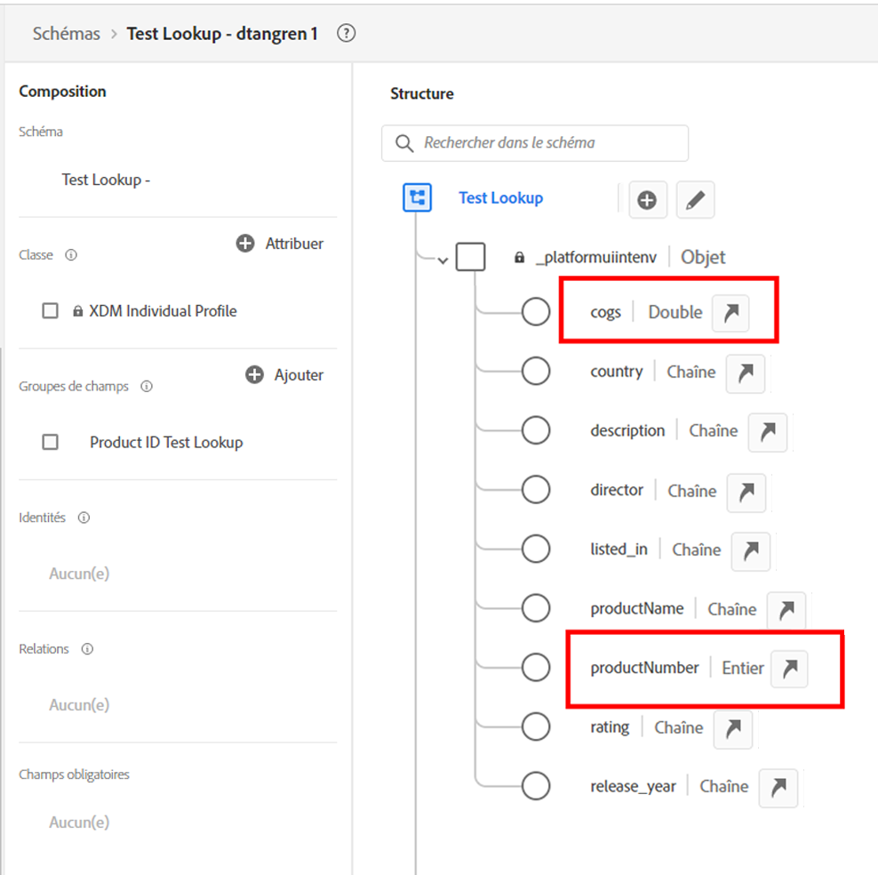
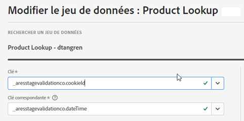

# Création d’une connexion

Un nouveau flux Connexions a été récemment lancé dans Customer Journey Analytics (CJA). La nouvelle expérience de flux de création et de modification de connexion apporte tous les paramètres de configuration de jeu de données et de connexion au centre de l’écran avec le flux d’assistance. Nous avons fourni une expérience détaillée de sélection, de configuration et de révision de jeux de données avec des informations essentielles telles que le type, la taille, le schéma, l’identifiant du jeu de données, le statut du lot, le statut de renvoi, les ID de personne, etc., afin de réduire le risque d’une mauvaise configuration de connexion. Voici un aperçu des nouvelles fonctionnalités :

* Vous pouvez activer une période de conservation des données variable lors de la création de la connexion.
* Vous pouvez ajouter et supprimer des jeux de données d’une connexion. (Supprimer un jeu de données le supprime de la connexion et affecte toutes les vues de données associées et les projets Analysis Workspace sous-jacents.)
* Vous pouvez activer et demander des données de renvoi par jeu de données.
* Vous pouvez modifier des jeux de données, par exemple pour demander un autre renvoi.
* Vous pouvez importer des données existantes par jeu de données.

>[!VIDEO](https://video.tv.adobe.com/v/343044/?quality=12&learn=on)

## Créer et configurer la connexion {#create-connection}

1. Dans CJA, cliquez sur l’onglet **[!UICONTROL Connexions]**.
1. Cliquez sur **[!UICONTROL Créer une connexion]**.

   

1. Configurez les paramètres de connexion.

   | Paramètre | Description |
   | --- | --- |
   | **[!UICONTROL Nom de la connexion]** | Saisissez un nom unique pour la connexion. |
   | **[!UICONTROL Description de la connexion]** | Décrivez l’objectif de cette connexion. |
   | **[!UICONTROL Sandbox]** | Dans Experience Platform, choisissez une sandbox qui contient le ou les jeux de données auxquels vous voulez créer une connexion.<p>Adobe Experience Platform fournit des [sandbox](https://experienceleague.adobe.com/docs/experience-platform/sandbox/home.html?lang=fr) qui divisent une instance de plateforme unique en environnements virtuels distincts pour favoriser le développement et l’évolution d’applications d’expérience numérique. Vous pouvez considérer les sandbox comme des « silos de données » contenant des jeux de données. Les sandbox permettent de contrôler l’accès aux jeux de données.<p>Une fois que vous avez sélectionné la sandbox, le rail de gauche affiche tous les jeux de données de cette sandbox que vous pouvez extraire. |
   | **[!UICONTROL Activer la fenêtre dynamique de conservation des données]** | Si vous cochez cette case, elle vous permet de définir la conservation des données CJA sous la forme d’une fenêtre dynamique en mois (1 mois, 3 mois, 6 mois, etc.), au niveau de la connexion.<p>La conservation des données est basée sur les horodatages des jeux de données dʼévénement et sʼapplique uniquement aux jeux de données dʼévénement. Aucun paramètre de fenêtre dynamique de conservation des données nʼexiste pour les jeux de données de profil ou de recherche, car il nʼexiste aucun horodatage applicable. Cependant, si votre connexion inclut un profil ou des jeux de données de recherche (à part un ou plusieurs jeux de données d’événement), ces données seront conservées pendant la même période.<p> Lʼavantage principal est que vous ne stockez ou ne créez des rapports que sur les données applicables et utiles, et supprimez les données plus anciennes qui ne sont plus utiles. Elle vous aide à rester dans les limites de votre contrat et réduit le risque de surcoût.<p>Si vous laissez la valeur par défaut (non cochée), la période de conservation sera remplacée par le paramètre de conservation des données d’Adobe Experience Platform. Si vous avez 25 mois de données dans Experience Platform, CJA obtiendra 25 mois de données par renvoi. Si vous avez supprimé 10 de ces mois dans Platform, CJA conservera les 15 mois restants. |
   | **[!UICONTROL Ajouter des jeux de données]** (voir ci-dessous) | Ajoutez des jeux de données si aucun jeu de données n’apparaît dans votre liste de jeux de données. |
   | **[!UICONTROL Nom du jeu de données]** | Sélectionnez un ou plusieurs jeux de données à extraire dans Customer Journey Analytics et cliquez sur **[!UICONTROL Ajouter]**.<p>(Si vous avez le choix entre de nombreux jeux de données, vous pouvez rechercher les jeux de données appropriés à l’aide de la barre de recherche des jeux de données située au-dessus de la liste des jeux de données.) |
   | **[!UICONTROL Dernière mise à jour]** | Pour les jeux de données d’événements uniquement, ce paramètre est automatiquement défini sur le champ d’horodatage par défaut des schémas basés sur un événement dans Experience Platform. « S/O » signifie que ce jeu de données ne contient aucune donnée. |
   | **[!UICONTROL Schéma]** | Il s’agit du [schéma](https://experienceleague.adobe.com/docs/experience-platform/xdm/schema/composition.html?lang=fr) à partir duquel le jeu de données a été créé dans Adobe Experience Platform. |
   | **[!UICONTROL Type de jeu de données]** | Pour chaque jeu de données que vous avez ajouté à cette connexion, Customer Journey Analytics définit automatiquement le type de jeu de données en fonction des données qui y sont entrées. Il existe trois types de jeux de données différents : les données Événement, les données Profil et les données de Recherche. Consultez le tableau ci-dessous pour obtenir une explication des types de jeux de données. |
   | **[!UICONTROL ID de personne]** | Sélectionnez un ID de personne dans la liste déroulante des identités disponibles. Ces identités ont été définies dans le schéma du jeu de données d’Experience Platform. Pour plus d’informations sur l’utilisation de la carte des identités en tant qu’ID de personne, reportez-vous à la section ci-dessous.<p>IMPORTANT : si aucun ID de personne n’est disponible, cela signifie qu’un ou plusieurs ID de personne n’ont pas été définis dans le schéma. Consultez [cette vidéo](https://www.youtube.com/watch?v=G_ttmGl_LRU) sur la façon de définir une identité dans Experience Platform. |
   | **[!UICONTROL Clé]** | Pour les jeux de données de recherche uniquement (tels que _id). |
   | **[!UICONTROL Clé correspondante]** | Pour les jeux de données de recherche uniquement (tels que _id). |
   | **[!UICONTROL Importer de nouvelles données]** | Définissez cette option sur Activé ou Désactivé. |
   | **[!UICONTROL Renvoyer les données]** | Vous pouvez demander de renvoyer les données dans un jeu de données en fonction des horodatages d’événement. Par exemple, vous pouvez demander de renvoyer l’équivalent de 7 jours de données, configurer l’ID de personne approprié et tester votre connexion pour une configuration correcte. Si tout semble correct, vous pouvez renvoyer facilement toutes les données restantes.<p>En outre, vous pouvez activer l’importation de nouvelles données par jeu de données. Par exemple, vous pouvez activer l’importation de nouvelles données pour les données de recherche uniquement. |
   | **[!UICONTROL Statut de renvoi]** | Indique si des données de renvoi sont en cours de traitement. |

   {style=&quot;table-layout:auto&quot;}

## Ajouter et configurer des jeux de données {#add-dataset}

Le nouveau workflow permet d’ajouter un jeu de données Experience Platform lors de la création d’une connexion.

1. Dans la boîte de dialogue Paramètres de connexion, cliquez sur **[!UICONTROL Ajouter des jeux de données]**.
1. Sélectionnez un ou plusieurs jeux de données, puis cliquez sur **[!UICONTROL Suivant]**.

   Notez qu’au moins un jeu de données d’événement doit faire partie de la connexion.
1. Maintenant, configurez les jeux de données un par un.

   

   | Paramètre | Description |
   | --- | --- |
   | **[!UICONTROL ID de personne]** | Sélectionnez un ID de personne dans la liste déroulante des identités disponibles. Ces identités ont été définies dans le schéma du jeu de données d’Experience Platform. Pour plus d’informations sur l’utilisation de la carte des identités en tant qu’ID de personne, reportez-vous à la section ci-dessous.<p>Si aucun ID de personne n’est disponible, cela signifie qu’un ou plusieurs ID de personne n’ont pas été définis dans le schéma. Consultez cette vidéo sur la façon de définir une identité dans Experience Platform. |
   | **[!UICONTROL Horodatage]** | Pour les jeux de données d’événements uniquement, ce paramètre est automatiquement défini sur le champ d’horodatage par défaut des schémas basés sur un événement dans Experience Platform. |
   | **[!UICONTROL Importer de nouvelles données]** | Sélectionnez cette option si vous souhaitez établir une connexion en cours, de sorte que tous les nouveaux lots de données qui sont ajoutés aux jeux de données dans cette connexion soient automatiquement transférés dans Espace de travail. Peut être défini sur Activé ou Désactivé. |
   | **[!UICONTROL Renvoi du jeu de données]** | Cliquez sur **[!UICONTROL Demander un renvoi]** pour renvoyer des données historiques.<ul><li>Vous pouvez renvoyer chaque jeu de données individuellement.</li><li>Nous donnons la priorité aux nouvelles données ajoutées à un jeu de données dans la connexion, de sorte que ces nouvelles données ont la latence la plus faible.</li><li>Les données de renvoi (historiques) sont importées plus lentement. La latence est influencée par la quantité de données historiques dont vous disposez.</li><li>Le Connecteur source Adobe Analytics importe jusquʼà 13 mois de données, quelle que soit leur taille.</li></ul> |
   | **[!UICONTROL Statut de renvoi]** | Les indicateurs de statut possibles sont les suivants :<ul><li>Réussite</li><li>Traitement de X renvoi(s)</li><li>Off</li></ul> |
   | **[!UICONTROL Identifiant du jeu de données]** | Cet identifiant est généré automatiquement. |
   | **[!UICONTROL Description]** | Description donnée à ce jeu de données lors de sa création. |
   | **[!UICONTROL Taille du jeu de données]** | Taille du jeu de données. |
   | **[!UICONTROL Schéma]** | Il s’agit du schéma à partir duquel le jeu de données a été créé dans Adobe Experience Platform. |
   | **[!UICONTROL Jeu de données]** | Nom du jeu de données. |
   | **[!UICONTROL Aperçu]** : `<dataset name>` | permet d’obtenir un aperçu du jeu de données avec les colonnes Date, mon identifiant et Identifiant. |
   | **[!UICONTROL À supprimer]** | Vous pouvez supprimer le jeu de données et modifier l’ID de personne sans supprimer l’ensemble de la connexion. Cela permet de réduire les coûts liés à l’ingestion des données et le processus laborieux de recréation de l’ensemble de la connexion et des vues de données associées. |

   {style=&quot;table-layout:auto&quot;}

## Aperçu de la connexion {#preview}

Pour prévisualiser la connexion que vous avez créée, cliquez sur **[!UICONTROL Aperçu de la connexion]** dans la boîte de dialogue Paramètres de connexion.



Cet aperçu contient un certain nombre de colonnes répertoriant la configuration de la connexion. Les types de colonnes affichés dépendent de vos jeux de données individuels.

## Types de jeux de données {#dataset-types}

Pour chaque jeu de données que vous avez ajouté à cette connexion, [!UICONTROL Customer Journey Analytics] définit automatiquement le type de jeu de données en fonction des données qui y sont entrées.

>[!IMPORTANT]
>
>Vous devez ajouter au moins un jeu de données d’événement dans le cadre d’une connexion.

Il existe trois types de jeux de données différents : les données [!UICONTROL Événement], les données [!UICONTROL Profil] et les données de [!UICONTROL Recherche].

| Type de jeu de données | Description | Horodatage | Schéma | ID de personne |
|---|---|---|---|---|
| **[!UICONTROL Événement]** | Données qui représentent des événements dans le temps (par exemple, visites Web, interactions, transactions, données de point de vente, données de questionnaire, données d’impression, etc.). Par exemple, il peut s’agir de données de parcours de navigation standard, avec un ID de client ou un ID de cookie, et un horodatage. Avec les données d’événement, vous disposez d’une flexibilité quant à l’ID utilisé comme ID de personne. | Est automatiquement défini sur le champ d’horodatage par défaut à partir des schémas basés sur un événement dans [!UICONTROL Experience Platform]. | Tout schéma intégré ou personnalisé basé sur une classe XDM avec le comportement « Série temporelle ». Par exemple, « Événement d’expérience XDM » ou « Événement de décision XDM ». | Vous pouvez sélectionner l’ID de personne à inclure. Chaque schéma de jeux de données défini dans Experience Platform peut disposer de son propre ensemble d’une ou de plusieurs identités définies et associées à un Espace de nommage d’identité. N’importe lequel de ces paramètres peut être utilisé comme ID de personne. Par exemple, l’ID de cookie, l’ID regroupé, l’ID utilisateur, le code de suivi, etc. |
| **[!UICONTROL Recherche]** | Ces données sont utilisées pour rechercher des valeurs ou des clés trouvées dans vos données d’événement ou de profil. Vous pouvez, par exemple, transférer des données de recherche qui font correspondre les identifiants numériques de vos données d’événement aux noms de produits. Voir [ce cas pratique d’utilisation](/help/use-cases/b2b.md) par exemple. | S.O. | Tout schéma intégré ou personnalisé basé sur une classe XDM avec le comportement « Enregistrement (Record) », à l’exception de la classe « Profil XDM individuel ». | S.O. |
| **[!UICONTROL Profil]** | Données appliquées à vos visiteurs, utilisateurs ou clients dans les données [!UICONTROL Événement]. Vous permet, par exemple, de charger des données CRM à propos de vos clients. | S.O. | Tout schéma intégré ou personnalisé basé sur la classe « Profil XDM individuel ». | Vous pouvez sélectionner l’ID de personne à inclure. Chaque jeu de données défini dans [!DNL Experience Platform] a son propre jeu d’un ou plusieurs ID de personne définis, tels que l’ID de cookie, l’ID regroupé, l’ID d’utilisateur, le code de suivi, etc.<br>**Remarque** : Si vous créez une connexion qui comprend des jeux de données avec des ID différents, les rapports le reflèteront. Pour véritablement fusionner des jeux de données, vous devez utiliser le même ID de personne. |

{style=&quot;table-layout:auto&quot;}

## Utilisation des champs numériques comme clés et valeurs de recherche {#numeric}

Cette fonctionnalité est utile si vous souhaitez ajouter un champ numérique comme un coût ou une marge à un champ clé reposant sur une chaîne. Les valeurs numériques feront ainsi partie des recherches sous forme de clés ou de valeurs. Dans votre schéma de recherche, il se peut que des valeurs numériques soient liées, par exemple, à vos noms de produit, au COGS, à vos coûts de campagne marketing ou à vos marges. Voici un exemple de schéma de recherche dans Adobe Experience Platform :



Nous prenons désormais en charge l’inclusion de ces valeurs sous forme de mesures ou de dimensions dans la création de rapports CJA. Lorsque vous configurez votre connexion et extrayez des jeux de données de recherche, vous pouvez modifier les jeux de données de manière à sélectionner la [!UICONTROL Clé] et la [!UICONTROL Clé correspondante] :



Lorsque vous configurez une vue de données reposant sur cette connexion, vous ajoutez les valeurs numériques en tant que composants de la vue de données. Tout projet basé sur cette vue de données peut alors créer des rapports sur ces valeurs numériques.

## Utiliser la carte des identités comme ID de personne {#id-map}

Customer Journey Analytics prend en charge la possibilité d’utiliser la carte des identités pour son ID de personne. La carte des identités est une structure de données de carte qui vous permet de télécharger des paires clé -> valeur. Les clés sont des espaces de noms d’identité et la valeur est une structure qui contient la valeur de l’identité. La carte des identités existe sur chaque ligne/événement téléchargé et est renseignée pour chaque ligne en conséquence.

La carte des identités est disponible pour tout jeu de données qui utilise un schéma basé sur la classe [XDM ExperienceEvent](https://experienceleague.adobe.com/docs/experience-platform/xdm/home.html?lang=fr). Lorsque vous sélectionnez un jeu de données à inclure dans une connexion CJA, vous avez la possibilité de sélectionner un champ comme identifiant principal ou la carte des identités :


Si vous sélectionnez Carte des identités, vous disposez de deux options de configuration supplémentaires :

| Option | Description |
|---|---|
| **[!UICONTROL Utiliser l’espace de noms des ID principaux]** | Ceci indique à CJA, par ligne, de trouver l’identité dans la carte des identités signalée par un attribut primary=true et de l’utiliser comme ID de personne pour cette ligne. Cela signifie qu’il s’agit de la clé primaire qui sera utilisée dans Experience Platform pour le partitionnement. Il s’agit également du candidat idéal pour être utilisé en tant qu’identifiant visiteur de CJA (selon la façon dont le jeu de données est configuré dans une connexion de CJA). |
| **[!UICONTROL Espace de noms]** | (Cette option n’est disponible que si vous n’utilisez pas l’espace de noms des ID principaux.) Les espaces de noms d’identité sont des composants du [Adobe Experience Platform Identity Service](https://experienceleague.adobe.com/docs/experience-platform/identity/namespaces.html?lang=fr) qui servent d’indicateurs du contexte auquel une identité se rapporte. Si vous spécifiez un espace de noms, CJA recherche la carte des identités pour cette clé d’espace de noms dans chaque ligne et utilise l’identité sous cet espace de noms comme ID de personne pour cette ligne. Veuillez noter que, puisque CJA ne peut pas effectuer une analyse complète des jeux de données de toutes les lignes pour déterminer quels espaces de noms sont réellement présents, tous les espaces de noms possibles sont répertoriés dans la liste déroulante. Vous devez savoir quels espaces de noms sont spécifiés dans les données ; cela ne peut pas être détecté automatiquement. |

{style=&quot;table-layout:auto&quot;}

### Cas extrême de la carte des identités {#id-map-edge}

Ce tableau présente les deux options de configuration lorsque des cas extrêmes sont présents et indique comment ils sont gérés :

| Option | Aucun ID n’est présent dans la carte des identités | Aucun ID n’est marqué comme principal | Plusieurs ID sont marqués comme principaux | Identifiant unique, marqué comme Principal ou non | Espace de noms non valide avec un ID marqué comme principal |
|---|---|---|---|---|---|
| **[!UICONTROL Utiliser l’espace de noms des ID principaux] coché** | CJA abandonne la ligne. | CJA abandonne la ligne, car aucun ID principal n’est spécifié. | Tous les identifiants marqués comme principaux, sous tous les espaces de noms, sont extraits dans une liste. Ils sont ensuite triés par ordre alphabétique. Avec ce nouveau tri, le premier espace de noms avec son premier identifiant est utilisé comme ID de personne. | L’identifiant unique est utilisé comme identifiant de personne. | Même si l’espace de noms peut être non valide (il n’est pas présent dans AEP), CJA utilisera l’ID principal sous cet espace de noms comme ID de personne. |
| **[!UICONTROL Espace de noms de carte des identités spécifique] sélectionné** | CJA abandonne la ligne. | Tous les identifiants sous l’espace de noms sélectionné sont extraits dans une liste et le premier est utilisé comme ID de personne. | Tous les identifiants sous l’espace de noms sélectionné sont extraits dans une liste et le premier est utilisé comme ID de personne. | Tous les identifiants sous l’espace de noms sélectionné sont extraits dans une liste et le premier est utilisé comme ID de personne. | Tous les identifiants sous l’espace de noms sélectionné sont extraits dans une liste et le premier est utilisé comme ID de personne. (Seul un espace de noms valide peut être sélectionné au moment de la création de la connexion. Il n’est donc pas possible qu’un espace de noms/ID non valide soit utilisé comme ID de personne). |

{style=&quot;table-layout:auto&quot;}

## Calculer le nombre moyen dʼévénements quotidiens

Ce calcul doit être effectué pour chaque jeu de données de la connexion.

1. Accédez à [Adobe Experience Platform Query Services](https://experienceleague.adobe.com/docs/experience-platform/query/home.html?lang=fr) et créez une nouvelle requête.

   La requête ressemblerait à ceci :

   ```
   Select AVG(A.total_events) from (Select DISTINCT COUNT (*) as total_events, date(TIMESTAMP) from analytics_demo_data GROUP BY 2 Having total_events>0) A;
   ```

   Dans cet exemple, « analytics_demo_data » est le nom du jeu de données.

1. Exécutez la requête `Show Tables` pour afficher tous les jeux de données existant dans AEP.
