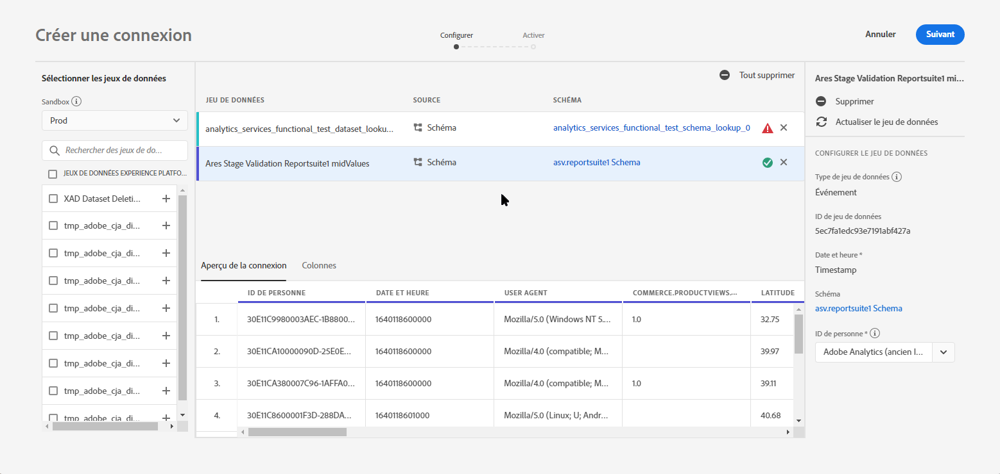
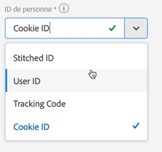
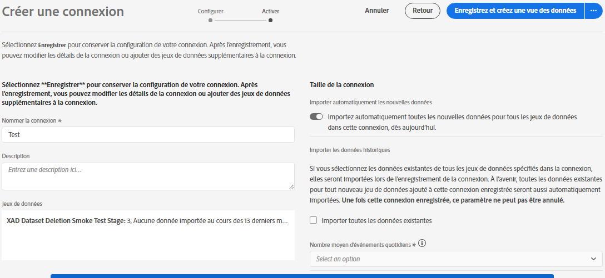

# Création d’une connexion

Une connexion vous permet d&#39;intégrer des jeux de données [!DNL Adobe Experience Platform] dans [!UICONTROL Workspace]. Pour générer des rapports sur [!DNL Experience Platform] les jeux de données, vous devez d’abord établir une connexion entre les jeux de données dans [!DNL Experience Platform] et [!UICONTROL Workspace].

Cliquez [ici](https://docs.adobe.com/content/help/en/platform-learn/tutorials/cja/connecting-customer-journey-analytics-to-data-sources-in-platform.html) pour une présentation vidéo.

>[!IMPORTANT] Vous pouvez combiner plusieurs [!DNL Experience Platform] jeux de données en une seule connexion.

1. Rendez-vous sur [https://analytics.adobe.com](https://analytics.adobe.com).

1. Click the **[!UICONTROL Connections]** tab.

1. Cliquez sur **[!UICONTROL Create new connection]** en haut à droite.

1. Le rail de gauche affiche tous les jeux de données dans [!DNL Experience Platform] lesquels vous pouvez extraire. Sélectionnez un ou plusieurs jeux de données à extraire [!UICONTROL Customer Journey Analytics] et cliquez sur **[!UICONTROL Add]**. (Si vous avez le choix entre de nombreux jeux de données, vous pouvez en rechercher un ou plusieurs dans la barre de recherche située au-dessus du  des jeux de données.)

1. Ensuite, pour chaque jeu de données que vous avez ajouté à cette connexion, [!UICONTROL Customer Journey Analytics] définit automatiquement le type de jeu de données en fonction des données entrantes. Il existe trois types de jeux de données différents : [!UICONTROL Event] données, [!UICONTROL Profile] données et [!UICONTROL Lookup] données.

   | Type de jeu de données | Description | Horodatage | Schéma | ID de personne |
   |---|---|---|---|---|
   | [!UICONTROL Event] | Données qui représentent des  dans le temps (par exemple, visites Web, interactions, transactions, données POS, données de , données d’impression, etc.). Par exemple, il peut s’agir de données de parcours de navigation standard, avec un ID de client ou un ID de cookie, ainsi qu’un horodatage. Avec les données de , vous pouvez choisir l’ID à utiliser comme ID de personne. | Est automatiquement défini sur le champ d’horodatage par défaut du basé sur  dans la plateforme [d’expérience]UICONTROL. | Tout  de intégré ou personnalisé basé sur une classe XDM avec le comportement &quot;Time Series&quot;. Par exemple, &quot; d’expérience XDM&quot; ou &quot;de décision XDM&quot;. | Vous pouvez sélectionner l’ID de personne à inclure. Chaque  de jeux de données  défini dans la plateforme d’expérience peut avoir son propre jeu d’une ou de plusieurs identités défini et associé à un  d’identité. N’importe lequel de ces éléments peut être utilisé comme ID de personne. Par exemple, ID de cookie, ID avec titrage, ID utilisateur, code de suivi, etc. |
   | [!UICONTROL Lookup] | Analogique avec un fichier de classifications. Ces données sont utilisées pour rechercher des valeurs ou des clés trouvées dans vos données de  ou de. Vous pouvez, par exemple, télécharger des données de recherche qui mappent des ID numériques dans vos données de  aux noms de produits. | S.O. | Tout  de intégré ou personnalisé basé sur une classe XDM avec le comportement &quot;Record&quot;, à l’exception de la classe &quot;XDM Individuel&quot;. | S.O. |
   | [!UICONTROL Profile] | Analogique à [!UICONTROL Customer Attributes] - pour les attributs non modifiables et non temporels. Données appliquées à vos, utilisateurs ou clients dans les [!UICONTROL Event] données. Vous permet, par exemple, de transférer des données CRM sur vos clients. | S.O. | Tout  de intégré ou personnalisé basé sur la classe &quot;XDM Individuel&quot;. | Vous pouvez sélectionner l’ID de personne à inclure. Chaque jeu de données défini dans le [!DNL Experience Platform] comporte son propre jeu d’un ou de plusieurs identifiants de personne définis, tels que l’ID de cookie, l’ID avec titre, l’ID utilisateur, le code de suivi, etc. **IDNote **: Si vous créez une connexion qui inclut des jeux de données avec des ID différents, le  le reflétera. Pour vraiment fusionner des jeux de données, vous devez utiliser le même ID de personne. |

1. Cliquez sur **[!UICONTROL Next]** pour accéder à la [!UICONTROL Create Connection] boîte de dialogue.

   

1. Dans la [!UICONTROL Create Connection] boîte de dialogue, définissez les paramètres suivants :

   | Champ | Description |
   |---|---|
   | [!UICONTROL Name Connection] | Attribuez un nom explicite à la connexion. La connexion ne peut pas être enregistrée sans nom. |
   | [!UICONTROL Description] | Ajouter plus de détails pour distinguer cette connexion des autres. |
   | [!UICONTROL Datasets] | Jeu de données inclus dans cette connexion. |
   | [!UICONTROL Automatically import all new datasets in this connection, beginning today.] | Sélectionnez cette option si vous souhaitez établir une connexion permanente, de sorte que les nouveaux lots de données qui sont ajoutés aux jeux de données dans cette connexion se retrouvent automatiquement dans [!UICONTROL Workspace]. |
   | [!UICONTROL Import all existing data] | Lorsque vous sélectionnez cette option et enregistrez la connexion, toutes les données existantes (historiques) de [!DNL Experience Platform] tous les jeux de données se trouvant dans cette connexion seront importées. A l&#39;avenir, toutes les données historiques existantes pour tout nouveau jeu de données ajouté à cette connexion enregistrée seront également automatiquement importées.  **Notez qu’une fois cette connexion enregistrée, ce paramètre ne peut plus être modifié.** |

   **Gardez les éléments suivants à l’esprit :**

   * Si la taille cumulée des données historiques pour tous les jeux de données de la connexion dépasse 1,5 milliard de lignes, un message d’erreur indique que vous ne pouvez pas importer cette quantité de données historiques. Toutefois, si vous deviez ajouter un jeu de données avec 1 milliard de lignes de données historiques et importer ces données, puis une semaine plus tard, ajouter un autre jeu de données de la même taille et importer ses données historiques, cela fonctionnerait.
   * Nous donnons la priorité à de nouvelles données ajoutées à un jeu de données dans la connexion. Ces données ont donc la latence la plus faible.
   * Les données de renvoi (historiques) sont importées plus lentement.

1. Cliquez sur **[!UICONTROL Save]**.

L’étape suivante du processus consiste à [créer un](/help/data-views/create-dataview.md)de données.
