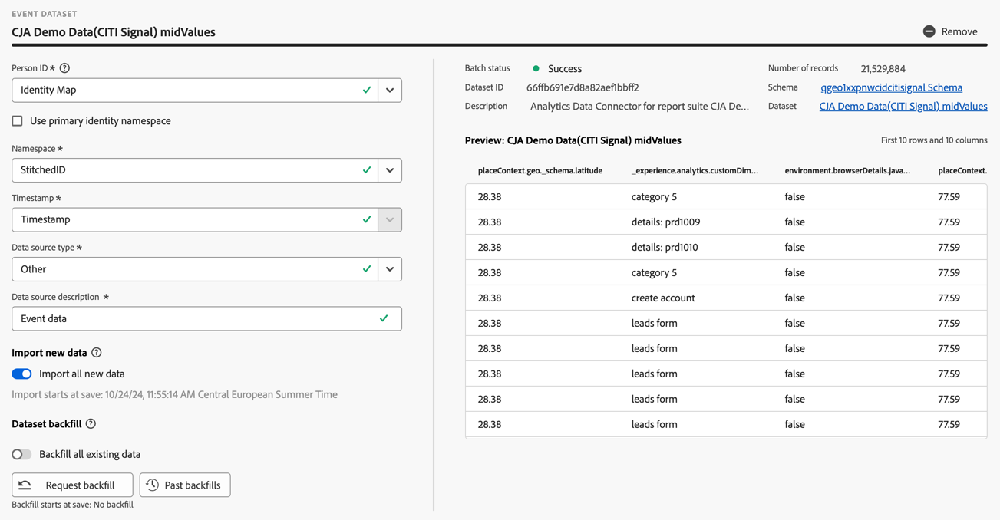
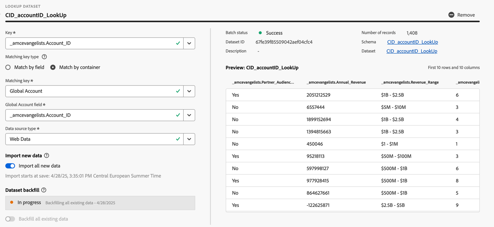
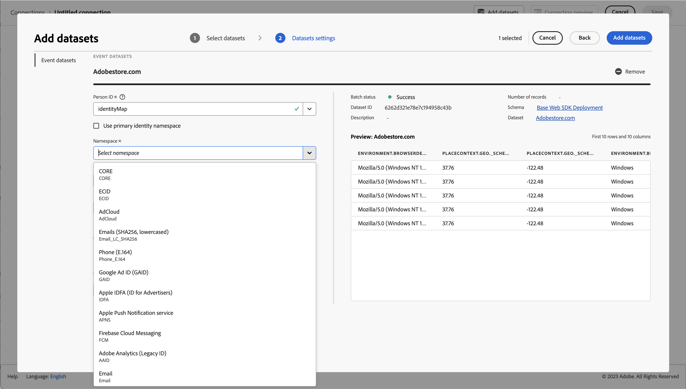

# Créer ou modifier une connexion {#create-or-edit-a-connection}

>[!CONTEXTUALHELP]
>id="cja_connections_recordsadded"
>title="Enregistrements ajoutés"
>abstract="Le nombre d’enregistrements (lignes) ajoutés à une connexion pendant l’intervalle de temps sélectionné pour les jeux de données sélectionnés."

>[!CONTEXTUALHELP]
>id="cja_connections_recordsskipped"
>title="Enregistrements ignorés"
>abstract="Le nombre d’enregistrements (lignes) ignorés pendant le transfert de données pour une connexion pendant l’intervalle de temps sélectionné pour les jeux de données sélectionnés."

>[!CONTEXTUALHELP]
>id="cja_connections_recordsdeleted"
>title="Enregistrements supprimés"
>abstract="Nombre d’enregistrements (lignes) supprimés d’une connexion au cours de la période définie pour les jeux de données sélectionnés."

>[!CONTEXTUALHELP]
>id="cja_connection_lastadded"
>title="Dernier ajout"
>abstract="La date et l’heure du dernier lot de tout jeu de données transféré vers une connexion."

>[!CONTEXTUALHELP]
>id="cja_connection_enablerollingdatawindow"
>title="Activer la fenêtre dynamique de données"
>abstract="Définissez la conservation des données comme une fenêtre dynamique en mois au niveau de la connexion."

>[!CONTEXTUALHELP]
>id="cja_connection_averagenumberofdailyuses"
>title="Nombre moyen d’utilisations quotidiennes"
>abstract="Sélectionnez une plage pour le nombre d’événements quotidiens attendus pour l’ensemble de la connexion."

>[!CONTEXTUALHELP]
>id="connections_recordsadded"
>title="Enregistrements ajoutés"
>abstract="Le nombre d’enregistrements (lignes) ajoutés à une connexion pendant l’intervalle de temps sélectionné pour les jeux de données sélectionnés."

>[!CONTEXTUALHELP]
>id="connections_recordsskipped"
>title="Enregistrements ignorés"
>abstract="Le nombre d’enregistrements (lignes) ignorés pendant le transfert de données pour une connexion pendant l’intervalle de temps sélectionné pour les jeux de données sélectionnés."

>[!CONTEXTUALHELP]
>id="connections_recordsdeleted"
>title="Enregistrements supprimés"
>abstract="Le nombre d’enregistrements (lignes) supprimés d’une connexion pendant l’intervalle de temps sélectionné pour les jeux de données sélectionnés."

>[!CONTEXTUALHELP]
>id="connection_lastadded"
>title="Dernier ajout"
>abstract="La date et l’heure du dernier lot de tout jeu de données transféré vers une connexion."

>[!CONTEXTUALHELP]
>id="connection_enablerollingdatawindow"
>title="Activer la fenêtre dynamique de données"
>abstract="Définissez la conservation des données comme une fenêtre dynamique en mois au niveau de la connexion."

>[!CONTEXTUALHELP]
>id="connection_averagenumberofdailyuses"
>title="Nombre moyen d’utilisations quotidiennes"
>abstract="Sélectionnez une plage pour le nombre d’événements quotidiens attendus pour l’ensemble de la connexion."

>[!CONTEXTUALHELP]
>id="connection_change_personid"
>title="Modifier l’ID de personne"
>abstract="La modification du paramètre de combinaison d’identités sur un jeu de données affecte le paramètre ID de personne une fois que vous appliquez les modifications. Toute modification de l’ID de personne supprime toutes les données existantes dans la connexion. Vous devez ingérer à nouveau les données du jeu de données en fonction du nouvel ID de personne.<br/><br/>Lorsque vous sélectionnez **[!UICONTROL Continuer]**, un délai dans le compte rendu des performances est possible jusqu’à ce que le processus de suppression soit terminé."

>[!CONTEXTUALHELP]
>id="connection_change_accountid"
>title="Modifier l’ID de compte"
>abstract="Une modification de l’ID de compte supprime toutes les données existantes dans la connexion et réingère toutes les données du jeu de données en fonction du nouvel ID de compte. Cette action peut avoir des répercussions sur les coûts. <br/><br/>Lorsque vous sélectionnez **[!UICONTROL Continuer]**, un délai dans la création de rapports est possible jusqu’à ce que le processus soit terminé."

>[!CONTEXTUALHELP]
>id="connection_change_globalaccountid"
>title="Modifier l’ID de compte global"
>abstract="Une modification de l’ID de compte global supprime toutes les données existantes dans la connexion et réingère toutes les données du jeu de données en fonction du nouvel ID de compte global. Cette action peut avoir des répercussions sur les coûts. <br/><br/>Lorsque vous sélectionnez **[!UICONTROL Continuer]**, un délai dans la création de rapports est possible jusqu’à ce que le processus soit terminé."

>[!CONTEXTUALHELP]
>id="connection_change_opportunityid"
>title="Modifier l’ID d’opportunité"
>abstract="Une modification de l’ID d’opportunité supprime toutes les données existantes dans la connexion et réingère toutes les données du jeu de données en fonction du nouvel ID d’opportunité. Cette action peut avoir des répercussions sur les coûts. <br/><br/>Lorsque vous sélectionnez **[!UICONTROL Continuer]**, un délai dans la création de rapports est possible jusqu’à ce que le processus soit terminé."

>[!CONTEXTUALHELP]
>id="connection_change_buyinggroupid"
>title="Modifier l’ID du groupe d’achat"
>abstract="Une modification de l’ID du groupe d’achat supprime toutes les données existantes dans la connexion et réingère toutes les données du jeu de données en fonction du nouvel ID du groupe d’achat. Cette action peut avoir des répercussions sur les coûts. <br/><br/>Lorsque vous sélectionnez **[!UICONTROL Continuer]**, un délai dans la création de rapports est possible jusqu’à ce que le processus soit terminé."

>[!CONTEXTUALHELP]
>id="connection_change_persistentid"
>title="Modifier l’ID persistant"
>abstract="Modifier l’ID persistant supprime toutes les données existantes dans la connexion et réingère toutes les données du jeu de données en fonction du nouvel ID persistant. Cette action peut avoir des répercussions sur les coûts. <br/><br/>Lorsque vous sélectionnez **[!UICONTROL Continuer]**, un délai dans la création de rapports est possible jusqu’à ce que le processus soit terminé."


<!-- Start of contextual help entries for CJA connection dialogs -->

>[!CONTEXTUALHELP]
>id="connections_useincja_exl_ajo"
>title="Utiliser cette connexion dans Customer Journey Analytics"
>abstract="Cette option permet d’exploiter les fonctionnalités de reporting avancé de Customer Journey Analytics avec votre connexion Journey Optimizer. Ces fonctionnalités vous permettent de réaliser les actions suivantes :<ul><li>Effectuer une analyse approfondie des données Journey Optimizer dans Customer Journey Analytics</li><li>Modifiez la connexion Journey Optimizer et les vues de données associées.</li><li>Analysez les événements de parcours, les chemins de conversation et les performances de la campagne.</li></ul>**Lorsque cette option est activée, chaque ligne de données de la connexion est comptabilisée chaque mois dans les lignes de données de licence pour Customer Journey Analytics et apparaît dans l’interface d’utilisation Utilisation des connexions.**<br><br/> Explorez cette option uniquement si vous êtes à l’aise avec l’utilisation supplémentaire de lignes de données dans Customer Journey Analytics. [En savoir plus](https://experienceleague.adobe.com/fr/docs/analytics-platform/using/integrations/ajo){target="_blank"}."

>[!CONTEXTUALHELP]
>id="connections_disableuseincja_exl_ajo"
>title="Supprimer cette connexion de Customer Journey Analytics"
>abstract="Cette connexion Journey Optimizer est en cours d’utilisation dans Customer Journey Analytics. Les connexions vous permettent d’effectuer les opérations suivantes :<ul><li>Effectuer une analyse approfondie des données Journey Optimizer dans Customer Journey Analytics</li><li>Modifiez la connexion Journey Optimizer et les vues de données associées.</li><li>Analysez les événements de parcours, les chemins de conversation et les performances de la campagne.</li></ul>**Si vous supprimez la connexion, une analyse approfondie dans Customer Journey Analytics n’est plus possible. La connexion et les vues de données associées sont réinitialisées à leur état par défaut et ne peuvent plus être modifiées.**<br/><br/>**La facturation de cette connexion dans Customer Journey Analytics inclut le mois complet pendant lequel la connexion est supprimée.**<br/><br/> La connexion reste activée dans Journey Optimizer. [En savoir plus](https://experienceleague.adobe.com/fr/docs/analytics-platform/using/integrations/ajo){target="_blank"}."

>[!CONTEXTUALHELP]
>id="connections_useincja_exl_brand_concierge"
>title="Utiliser cette connexion dans Customer Journey Analytics"
>abstract="Cette option vous permet de tirer profit des fonctionnalités de reporting avancé de Customer Journey Analytics avec votre connexion Brand Concierge. Ces fonctionnalités vous permettent d’effectuer les opérations suivantes :<ul><li>Effectuer une analyse approfondie des données Brand Concierge dans Customer Journey Analytics.</li><li>Modifier la connexion Brand Concierge et les vues de données associées.</li><li>Analyser les mesures d’engagement conversationnel, de sentiment et de conversion.</li></ul>**Lorsque cette option est activée, chaque ligne de données de la connexion est comptabilisée chaque mois dans les lignes de données de licence pour Customer Journey Analytics et apparaît dans l’interface d’utilisation Utilisation des connexions.**<br><br/> Explorez cette option uniquement si vous êtes à l’aise avec l’utilisation supplémentaire de lignes de données dans Customer Journey Analytics. [En savoir plus](https://experienceleague.adobe.com/fr/docs/analytics-platform/using/cja-workspace/templates/use-templates#brand-concierge-templates){target="_blank"}."

>[!CONTEXTUALHELP]
>id="connections_disableuseincja_exl_brand_concierge"
>title="Supprimer cette connexion de Customer Journey Analytics"
>abstract="Cette connexion Brand Concierge est en cours d’utilisation dans Customer Journey Analytics. Les connexions vous permettent d’effectuer les opérations suivantes :<ul><li>Effectuer une analyse approfondie des données Brand Concierge dans Customer Journey Analytics.</li><li>Modifier la connexion Brand Concierge et les vues de données associées.</li><li>Analyser les mesures d’engagement conversationnel, de sentiment et de conversion.</li></ul>**Si vous supprimez la connexion, une analyse approfondie dans Customer Journey Analytics n’est plus possible. La connexion et les vues de données associées sont réinitialisées à leur état par défaut et ne peuvent plus être modifiées.**<br/><br/>**La facturation de cette connexion dans Customer Journey Analytics inclut le mois complet pendant lequel la connexion est supprimée.**<br/><br/> La connexion reste activée dans Brand Concierge. [En savoir plus](https://experienceleague.adobe.com/fr/docs/analytics-platform/using/cja-workspace/templates/use-templates#brand-concierge-templates){target="_blank"}."

>[!CONTEXTUALHELP]
>id="connections_useincja_exl_product_usage"
>title="Utiliser cette connexion dans Customer Journey Analytics"
>abstract="Cette option vous permet de tirer profit des fonctionnalités de reporting avancé de Customer Journey Analytics avec votre connexion d’utilisation des produits. Ces fonctionnalités vous permettent d’effectuer les opérations suivantes :<ul><li>Effectuer une analyse approfondie des données d’utilisation des produits dans Customer Journey Analytics.</li><li>Modifier la connexion d’utilisation des produits et les vues de données associées.</li></ul>**Lorsque cette option est activée, chaque ligne de données de la connexion est comptabilisée chaque mois dans les lignes de données de licence pour Customer Journey Analytics et apparaît dans l’interface d’utilisation Utilisation des connexions.**<br><br/> Explorez cette option uniquement si vous êtes à l’aise avec l’utilisation supplémentaire de lignes de données dans Customer Journey Analytics. [En savoir plus](https://experienceleague.adobe.com/fr/docs/analytics-platform/using/tools/product-usage/usage-overview){target="_blank"}."

>[!CONTEXTUALHELP]
>id="connections_disableuseincja_exl_product_usage"
>title="Supprimer cette connexion de Customer Journey Analytics"
>abstract="Cette connexion d’utilisation des produits est en cours d’utilisation dans Customer Journey Analytics. Les connexions vous permettent d’effectuer les opérations suivantes :<ul><li>Effectuer une analyse approfondie des données d’utilisation des produits dans Customer Journey Analytics.</li><li>Modifier la connexion d’utilisation des produits et les vues de données associées.</li></ul>**Si vous supprimez la connexion, une analyse approfondie dans Customer Journey Analytics n’est plus possible. La connexion et les vues de données associées sont réinitialisées à leur état par défaut et ne peuvent plus être modifiées.**<br/><br/>**La facturation de cette connexion dans Customer Journey Analytics inclut le mois complet pendant lequel la connexion est supprimée.**<br/><br/> La connexion reste activée pour l’utilisation des produits. [En savoir plus](https://experienceleague.adobe.com/fr/docs/analytics-platform/using/tools/product-usage/usage-overview){target="_blank"}."

>[!CONTEXTUALHELP]
>id="connections_useincja_legal_section_section"
>title="Conséquences juridiques"
>abstract="L’utilisation de Customer Journey Analytics peut entraîner des frais supplémentaires en fonction des volumes de données d’intégration. Voir les [détails sur la facturation et l’utilisation de Customer Journey Analytics](https://experienceleague.adobe.com/fr/docs/analytics-platform/using/cja-connections/manage-connections#connections-usage)"


>[!CONTEXTUALHELP]
>id="connections_useincja_exl_ajo_learn_more"
>title="En savoir plus"
>abstract="[En savoir plus](https://experienceleague.adobe.com/fr/docs/analytics-platform/using/cja-connections/manage-connections#connections-usage)."

>[!CONTEXTUALHELP]
>id="connections_useincja_exl_brand_concierge_learn_more"
>title="En savoir plus"
>abstract="[En savoir plus](https://experienceleague.adobe.com/fr/docs/analytics-platform/using/cja-workspace/templates/use-templates#brand-concierge-templates)."

>[!CONTEXTUALHELP]
>id="connections_useincja_exl_product_usage_learn_more"
>title="En savoir plus"
>abstract="[En savoir plus](https://experienceleague.adobe.com/fr/docs/analytics-platform/using/tools/product-usage/usage-overview)."

<!-- End of contextual help entries for CJA connection dialogs -->


L’expérience de workflow de création et de modification de connexion apporte tous les paramètres de configuration de jeu de données et de connexion au centre de l’écran avec le workflow d’assistance. Elle fournit une expérience détaillée de sélection, de configuration et de révision de jeux de données. Elle vous permet également de spécifier des informations essentielles telles que le [type](#dataset-types), la taille, le schéma, l’identifiant du jeu de données, le statut du lot, le statut de renvoi, les identités, etc., afin de réduire le risque d’une mauvaise configuration de connexion. Voici une vue d’ensemble des nouvelles fonctionnalités :

* Vous pouvez activer une période de conservation des données variable lors de la création de la connexion.
* Vous pouvez ajouter et supprimer des jeux de données d’une connexion. (Supprimer un jeu de données le supprime de la connexion et affecte toutes les vues de données associées et les projets Analysis Workspace sous-jacents.)
* Vous pouvez activer et demander des données de renvoi par jeu de données.
* Vous pouvez modifier des jeux de données, par exemple pour demander un autre renvoi.
* Vous pouvez importer des données existantes par jeu de données.


>[!BEGINSHADEBOX]

Voir  [Créer et modifier une connexion](https://video.tv.adobe.com/v/343044/?quality=12&learn=on){target="_blank"} pour une vidéo de démonstration.

>[!ENDSHADEBOX]


## Conditions préalables

Le nombre maximum de jeux de données que vous pouvez ajouter à une connexion est limité à 100. Le mix dépend du package de Customer Journey Analytics acheté par votre société.

Contactez votre administrateur ou administratrice si vous ne savez pas de quel package Customer Journey Analytics vous disposez.

| Package **Select** | Package **Foundation** |
| --- | --- |
| Toute combinaison de jeux de données d’événement, de profil, recherche ou résumé, jusqu’à 100 | Un jeu de données d’événement par connexion |
|  | Jusqu’à 99 jeux de données de profil, de recherche ou de résumé par connexion |

{style="table-layout:auto"}

## Créer une connexion {#create-connection}

Pour créer une connexion :

1. Dans Customer Journey Analytics, sélectionnez **[!UICONTROL Connexions]**, éventuellement à partir de **[!UICONTROL Gestion des données]**, dans le menu supérieur.
1. Sélectionnez **[!UICONTROL Créer une connexion]**.

Vous pouvez maintenant [modifier les détails de votre connexion](#edit-a-connection).

## Modifier une connexion {#edit-connection}

La modification de la connexion dépend du package Customer Journey Analytics dont vous disposez sous licence :

* [Customer Journey Analytics](#customer-journey-analytics)
* [Customer Journey Analytics B2B Edition](#customer-journey-analytics-b2b-edition)

### Customer Journey Analytics

Sur l’écran **[!UICONTROL Connexions]** > **[!UICONTROL *Nom de la connexion *]** :


1. Configurez les paramètres de connexion.

   | Paramètre | Description |
   | --- | --- |
   | **[!UICONTROL Nom de la connexion]** | Saisissez un nom unique pour la connexion. |
   | **[!UICONTROL Description de la connexion]** | Décrivez l’objectif de cette connexion. |
   | **[!UICONTROL Balises]** | Spécifiez des balises pour en ajouter à votre connexion afin de pouvoir les utiliser pour rechercher la connexion ultérieurement. |
   | **[!UICONTROL Activer la fenêtre dynamique de données]** | Si vous cochez cette case, elle vous permet de définir la conservation des données Customer Journey Analytics sous la forme d’une fenêtre dynamique en mois (1 mois, 3 mois, 6 mois, etc.), au niveau de la connexion.<p>La conservation des données est basée sur les horodatages des jeux de données dʼévénement et sʼapplique uniquement aux jeux de données dʼévénement. Aucun paramètre de fenêtre dynamique de conservation des données nʼexiste pour les jeux de données de profil ou de recherche, car il nʼexiste aucun horodatage applicable. Cependant, si votre connexion inclut un profil ou des jeux de données de recherche (en plus d’un ou plusieurs jeux de données d’événement), ces données sont conservées pendant la même période.<p> Lʼavantage principal est que vous ne stockez ou ne créez des rapports que sur les données applicables et utiles, et supprimez les données plus anciennes qui ne sont plus utiles. Elle vous aide à rester dans les limites de votre contrat et réduit le risque de surcoût.<p><ul><li>Si vous laissez la valeur par défaut (non cochée), le paramètre de conservation des données d’Adobe Experience Platform remplace la période de conservation. Si vous avez 25 mois de données dans Experience Platform, Customer Journey Analytics obtient 25 mois de données par renvoi. Si vous avez supprimé 10 de ces mois dans Experience Platform, Customer Journey Analytics conserve les 15 mois restants.</li><li>Si vous activez une fenêtre dynamique de données, dans **[!UICONTROL Sélectionner le nombre de mois]**, spécifiez le nombre de mois pendant lesquels vous activez la fenêtre dynamique de données. |
   | **[!UICONTROL Sandbox]** | Dans Experience Platform, choisissez un sandbox qui contient les jeux de données pour lesquels vous souhaitez créer une connexion.<p>Adobe Experience Platform fournit des [sandbox](https://experienceleague.adobe.com/fr/docs/experience-platform/sandbox/home) qui divisent une instance de plateforme unique en environnements virtuels distincts pour favoriser le développement et l’évolution d’applications d’expérience digitale. Vous pouvez considérer les sandbox comme des « silos de données » contenant des jeux de données. Les sandbox permettent de contrôler l’accès aux jeux de données.<p>Une fois que vous avez sélectionné le sandbox, le rail de gauche affiche tous les jeux de données de ce sandbox que vous pouvez extraire. |
   | **[!UICONTROL Ajouter des jeux de données]** | Sélectionnez  **[!UICONTROL Ajouter des jeux de données]** pour ajouter des jeux de données. Si la connexion ne comporte pas encore de jeux de données, vous pouvez également sélectionner **[!UICONTROL Ajouter des jeux de données]** dans le tableau des jeux de données. |


   Pour les jeux de données que vous avez configurés, le tableau des jeux de données affiche les colonnes suivantes :

   | Colonne | Description |
   |---|---|
   | **[!UICONTROL Nom du jeu de données]** | Sélectionnez un ou plusieurs jeux de données à extraire dans Customer Journey Analytics et choisissez **[!UICONTROL Ajouter]**.<p>(Si vous avez le choix entre un grand nombre de jeux de données, vous pouvez les rechercher à l’aide de la barre de recherche Rechercher des jeux de données située au-dessus de la liste des jeux de données.) |
   |  | Sélectionnez  pour ouvrir un menu contextuel pour le jeu de données sélectionné. En fonction du jeu de données (type), vous avez le choix entre les options suivantes :<ul><li> **[!UICONTROL Supprimer le jeu de données]** pour [supprimer un jeu de données](#delete-a-dataset).</li><li> **[!UICONTROL Modifier le jeu de données]** pour [modifier un jeu de données](#edit-a-dataset).</li><li> **[!UICONTROL Renvois précédents]** pour afficher les [renvois précédents du jeu de données](#past-backfills). |
   | **[!UICONTROL Dernière mise à jour]** | Pour les jeux de données d’événements uniquement, ce paramètre est automatiquement défini sur le champ d’horodatage par défaut des schémas basés sur un événement dans Experience Platform. « S/O » signifie que ce jeu de données ne contient aucune donnée. |
   | **[!UICONTROL Nombre d’enregistrements]** | Total des enregistrements du mois précédent pour le jeu de données dans Experience Platform. |
   | **[!UICONTROL Schéma]** | Le [schéma](https://experienceleague.adobe.com/fr/docs/experience-platform/xdm/schema/composition) à partir duquel le jeu de données a été créé dans Adobe Experience Platform. |
   | **[!UICONTROL Type de jeu de données]** | Pour chaque jeu de données que vous avez ajouté à cette connexion, Customer Journey Analytics définit automatiquement le [type de jeu de données](#dataset-types) en fonction des données qui y sont entrées. Il existe trois types de jeux de données différents : les données Événement, les données Profil et les données de Recherche. Consultez le tableau ci-dessous pour obtenir une explication des types de jeux de données. |
   | **[!UICONTROL Assemblé]** | Si un jeu de données est [activé pour le groupement dans l’interface utilisateur de connexion](/help/stitching/use-stitching-ui.md), la valeur est **[!UICONTROL true]**. Sinon, la valeur est **[!UICONTROL false]**. Les jeux de données groupés qui sont le résultat de la procédure [requête d’assemblage](/help/stitching//use-stitching.md) ne sont pas identifiés comme groupés dans ce tableau et ont par défaut une valeur de **[!UICONTROL false]**. |
   | **[!UICONTROL Granularité]** | Granularité des données du jeu de données, applicable uniquement aux jeux de données de résumé. |
   | **[!UICONTROL Type de source de données]** | Type de source de données du jeu de données. Non applicable pour les jeux de données de résumé. |
   | **[!UICONTROL ID de personne]** | ID de personne utilisé pour prendre en charge les rapports des personnes pour le jeu de données. |
   | **[!UICONTROL Clé]** | Clé utilisée pour un jeu de données de recherche. |
   | **[!UICONTROL Clé correspondante]** | Clé correspondante utilisée pour un jeu de données de recherche. |
   | **[!UICONTROL Importer de nouvelles données]** | Statut de l’import des nouvelles données pour le jeu de données : <p> **[!UICONTROL _x _ activés]**si le jeu de données est configuré pour importer de nouvelles données, et<p> **[!UICONTROL _x désactivés_]** si le jeu de données est configuré pour ne pas importer de nouvelles données. |
   | **[!UICONTROL Renvoyer les données]** | Statut des données de renvoi pour le jeu de données.<p> **[!UICONTROL _x _renvois ayant échoué]**pour le nombre de renvois ayant échoué,<p> **[!UICONTROL _x _renvois en cours de traitement]**pour le nombre de renvois en cours de traitement,<p> **[!UICONTROL _x _renvois terminés]**pour le nombre de renvois terminés, et<p> **[!UICONTROL _Désactivé_]** au cas où aucun renvoi n’est configuré. |

   Vous pouvez rechercher un jeu de données spécifique à l’aide du champ .

### Customer Journey Analytics B2B Edition

[!BADGE B2B Edition]{type=Informative url="https://experienceleague.adobe.com/fr/docs/analytics-platform/using/cja-overview/cja-b2b/cja-b2b-edition" newtab=true tooltip="Customer Journey Analytics B2B Edition"}

Sur l’écran **[!UICONTROL Connexions]** > **[!UICONTROL *Nom de la connexion *]** :


1. Configurez les paramètres de connexion.

   | Paramètre | Description |
   | --- | --- |
   | **[!UICONTROL Nom de la connexion]** | Saisissez un nom unique pour la connexion. |
   | **[!UICONTROL Description de la connexion]** | Décrivez l’objectif de cette connexion. |
   | **[!UICONTROL Balises]** | Spécifiez des balises pour en ajouter à votre connexion afin de pouvoir les utiliser pour rechercher la connexion ultérieurement. |
   | **[!UICONTROL ID principal]** | Sélectionnez l’ID principal approprié pour votre connexion : <ul><li> **[!UICONTROL Personne]** pour une connexion basée sur la personne que vous utilisez généralement dans un scénario B2C.</li><li>  **[!UICONTROL Compte]** pour une connexion basée sur un compte que vous utilisez généralement dans un scénario B2B.</li></ul>Dès que vous ajoutez un ou plusieurs jeux de données à votre connexion, vous ne pouvez plus modifier l’ID principal. <br/>L’ID principal sélectionné définit si la connexion est basée sur une personne ou sur un compte. La base de connexion détermine les [paramètres](#dataset-settings) disponibles pour certains types de jeux de données. |
   | **[!UICONTROL Conteneurs facultatifs]** | Si vous avez sélectionné  **[!UICONTROL Compte]** comme **[!UICONTROL ID principal]**, sélectionnez des conteneurs supplémentaires.<ul><li>**[!UICONTROL Compte global]** : permet la configuration de comptes globaux dans une connexion.</li><li>**[!UICONTROL Opportunité]** : permet la configuration des opportunités dans une connexion.</li><li>**[!UICONTROL Groupe d’achat]** : permet la configuration des groupes d’achat dans une connexion.</li><ul> |
   | **[!UICONTROL Sandbox]** | Choisissez un sandbox dans Experience Platform qui contient les jeux de données pour lesquels vous souhaitez créer une connexion.<p>Adobe Experience Platform fournit des [sandbox](https://experienceleague.adobe.com/fr/docs/experience-platform/sandbox/home) qui divisent une instance de plateforme unique en environnements virtuels distincts pour favoriser le développement et l’évolution d’applications d’expérience digitale. Vous pouvez considérer les sandbox comme des « silos de données » contenant des jeux de données. Les sandbox permettent de contrôler l’accès aux jeux de données.<p>Une fois que vous avez sélectionné le sandbox, le rail de gauche affiche tous les jeux de données de ce sandbox que vous pouvez extraire. |
   | **[!UICONTROL Activer la fenêtre dynamique de conservation des données]** | Si vous cochez cette case, elle vous permet de définir la conservation des données Customer Journey Analytics sous la forme d’une fenêtre dynamique en mois (1 mois, 3 mois, 6 mois, etc.), au niveau de la connexion.<p>La conservation des données est basée sur les horodatages des jeux de données dʼévénement et sʼapplique uniquement aux jeux de données dʼévénement. Aucun paramètre de fenêtre dynamique de conservation des données nʼexiste pour les jeux de données de profil ou de recherche, car il nʼexiste aucun horodatage applicable. Cependant, si votre connexion inclut un profil ou des jeux de données de recherche (en plus d’un ou plusieurs jeux de données d’événement), ces données sont conservées pendant la même période.<p> Lʼavantage principal est que vous ne stockez ou ne créez des rapports que sur les données applicables et utiles, et supprimez les données plus anciennes qui ne sont plus utiles. Elle vous aide à rester dans les limites de votre contrat et réduit le risque de surcoût.<p><ul><li>Si vous laissez la valeur par défaut (non cochée), le paramètre de conservation des données d’Adobe Experience Platform remplace la période de conservation. Si vous avez 25 mois de données dans Experience Platform, Customer Journey Analytics obtient 25 mois de données par renvoi. Si vous avez supprimé 10 de ces mois dans Platform, Customer Journey Analytics conserve les 15 mois restants.</li><li>Si vous activez une fenêtre dynamique de données, indiquez dans **[!UICONTROL Sélectionner le nombre de mois]** le nombre de mois pendant lesquels vous activez la fenêtre dynamique de données. |
   | **[!UICONTROL Ajouter des jeux de données]** | Sélectionnez  **[!UICONTROL Ajouter des données]** pour [ajouter des données](#add-datasets). Si la connexion ne comporte pas encore de jeux de données, vous pouvez également sélectionner **[!UICONTROL Ajouter des jeux de données]** dans le tableau des jeux de données. |


   Pour les jeux de données que vous avez configurés, le tableau des jeux de données affiche les colonnes suivantes :

   | Colonne | Description |
   |---|---|
   | **[!UICONTROL Nom du jeu de données]** | Sélectionnez un ou plusieurs jeux de données à extraire dans Customer Journey Analytics et choisissez **[!UICONTROL Ajouter]**.<p>(Si vous avez le choix entre un grand nombre de jeux de données, vous pouvez les rechercher à l’aide de la barre de recherche Rechercher des jeux de données située au-dessus de la liste des jeux de données.) |
   |  | Sélectionnez  pour ouvrir un menu contextuel pour le jeu de données sélectionné. En fonction du jeu de données (type), vous avez le choix entre les options suivantes :<ul><li> **[!UICONTROL Supprimer le jeu de données]** pour [supprimer un jeu de données](#delete-a-dataset).</li><li> **[!UICONTROL Modifier le jeu de données]** pour [modifier un jeu de données](#edit-a-dataset).</li><li> **[!UICONTROL Renvois précédents]** pour afficher les [renvois précédents du jeu de données](#past-backfills). |
   | **[!UICONTROL Dernière mise à jour]** | Pour les jeux de données d’événements uniquement, ce paramètre est automatiquement défini sur le champ d’horodatage par défaut des schémas basés sur un événement dans Experience Platform. « S/O » signifie que ce jeu de données ne contient aucune donnée. |
   | **[!UICONTROL Nombre d’enregistrements]** | Total des enregistrements du mois précédent pour le jeu de données dans Experience Platform. |
   | **[!UICONTROL Schéma]** | Le [schéma](https://experienceleague.adobe.com/fr/docs/experience-platform/xdm/schema/composition) à partir duquel le jeu de données a été créé dans Adobe Experience Platform. |
   | **[!UICONTROL Type de jeu de données]** | Pour chaque jeu de données que vous avez ajouté à cette connexion, Customer Journey Analytics définit automatiquement le [type de jeu de données](#dataset-types) en fonction des données qui y sont entrées. |
   | **[!UICONTROL Granularité]** | Granularité des données du jeu de données, applicable uniquement aux jeux de données de résumé. |
   | **[!UICONTROL Type de source de données]** | Type de source de données du jeu de données. Non applicable pour les jeux de données de résumé. |
   | **[!UICONTROL ID de compte]** | (Uniquement affiché pour les connexions basées sur des comptes) Identifiant de compte utilisé pour la prise en charge des rapports basés sur les comptes pour le jeu de données. |
   | **[!UICONTROL Identifiant de compte global]** | (affiché uniquement pour les connexions basées sur des comptes) Identifiant de compte global utilisé pour la prise en charge des rapports basés sur des comptes pour le jeu de données. |
   | **[!UICONTROL Identifiant de groupe d’achat]** | (Affiché uniquement pour les connexions basées sur un compte) ID de groupe d’achat utilisé pour rechercher les données de groupe d’achat. |
   | **[!UICONTROL ID d’opportunité]** | (Affiché uniquement pour les connexions basées sur un compte) ID d’opportunité utilisé pour rechercher les données d’opportunité. |
   | **[!UICONTROL ID de personne]** | ID de personne utilisé pour prendre en charge les rapports des personnes pour le jeu de données. |
   | **[!UICONTROL Clé]** | Clé utilisée pour un jeu de données de recherche. |
   | **[!UICONTROL Clé correspondante]** | Clé correspondante utilisée pour un jeu de données de recherche. |
   | **[!UICONTROL Importer de nouvelles données]** | Statut de l’import des nouvelles données pour le jeu de données : <p> **[!UICONTROL _x _ activés]**si le jeu de données est configuré pour importer de nouvelles données, et<p> **[!UICONTROL _x désactivés_]** si le jeu de données est configuré pour ne pas importer de nouvelles données. |
   | **[!UICONTROL Renvoyer les données]** | Statut des données de renvoi pour le jeu de données.<p> **[!UICONTROL _x _renvois ayant échoué]**pour le nombre de renvois ayant échoué,<p> **[!UICONTROL _x _renvois en cours de traitement]**pour le nombre de renvois en cours de traitement,<p> **[!UICONTROL _x _renvois terminés]**pour le nombre de renvois terminés, et<p> **[!UICONTROL _Désactivé_]** au cas où aucun renvoi n’est configuré. |

   Vous pouvez rechercher un jeu de données spécifique à l’aide du champ .

## Jeux de données {#datasets}

Vous [ajoutez un ou plusieurs jeux de données](#add-datasets) ou [modifiez des jeux de données existants](#edit-a-dataset) dans le cadre du workflow de connexion.

>[!NOTE]
>
>Les valeurs antérieures à l’année 1900 pour les champs Date et Date-heure d’une ligne dans n’importe quel type de jeu de données sont remplacées par la valeur `null` avant l’ingestion de la ligne.<br/>Les lignes d’un événement ou d’un jeu de données de résumé dont la valeur d’horodatage est antérieure à l’année 1900 sont supprimées de l’ingestion.


{{relational-model-based}}


>[!CONTEXTUALHELP]
>id="cja_connection_primaryid"
>title="ID principal"
>abstract="Sélectionnez l’ID principal approprié à votre connexion : Personne pour un scénario B2C. Compte pour un scénario B2B."

>[!CONTEXTUALHELP]
>id="cja_connection_optionalcontainers"
>title="Conteneurs facultatifs"
>abstract="Sélectionnez des conteneurs supplémentaires.<br/><br/>**[!UICONTROL Compte global ]** : permet la configuration de comptes globaux dans une connexion.<br/>**[!UICONTROL Opportunité]** : permet la configuration des opportunités dans une connexion.<br/>**[!UICONTROL Groupe d’achat ]** : permet la configuration des groupes d’achat dans une connexion."

>[!CONTEXTUALHELP]
>id="cja_connection_accountid"
>title="ID de compte"
>abstract="Sélectionnez un ID de compte (l’identifiant unique d’un compte) parmi les identités disponibles définies dans le schéma du jeu de données d’Experience Platform."

>[!CONTEXTUALHELP]
>id="cja_connection_accountfield"
>title="Champ de compte"
>abstract="Sélectionnez un champ qui représente l’identifiant de compte (identifiant unique d’un compte)."

>[!CONTEXTUALHELP]
>id="cja_connection_globalaccountid"
>title="ID de compte global"
>abstract="Sélectionnez un ID de compte global (l’identifiant unique d’un compte global) parmi les identités disponibles que vous avez définies dans le schéma du jeu de données d’Experience Platform."

>[!CONTEXTUALHELP]
>id="cja_connection_opportunityid"
>title="ID d’opportunité"
>abstract="Sélectionnez un ID d’opportunité (l’identifiant unique d’une d’opportunité) parmi les identités disponibles que vous avez définies dans le schéma du jeu de données d’Experience Platform."

>[!CONTEXTUALHELP]
>id="cja_connection_buyinggroupid"
>title="ID de groupe d’achat"
>abstract="Sélectionnez un ID de groupe d’achat (l’identifiant unique d’un groupe d’achat) parmi les identités disponibles que vous avez définies dans le schéma du jeu de données d’Experience Platform."

>[!CONTEXTUALHELP]
>id="cja_connection_personid"
>title="ID de personne"
>abstract="Sélectionnez un ID de personne (l’identifiant unique d’une personne) parmi les identités disponibles que vous avez définies dans le schéma du jeu de données d’Experience Platform."

>[!CONTEXTUALHELP]
>id="cja_connection_matchingkey"
>title="Clé correspondante"
>abstract="Sélectionnez un champ à joindre à l’un des jeux de données d’événement. Si cette liste est vide, vous n’avez probablement pas ajouté ni configuré de jeu de données d’événement."

>[!CONTEXTUALHELP]
>id="cja_connection_importnewdata"
>title="Importer de nouvelles données"
>abstract="Tous les nouveaux lots ajoutés au jeu de données Experience Platform sont automatiquement ajoutés à cette connexion et mis à disposition pour analyse."

>[!CONTEXTUALHELP]
>id="cja_connection_datasetbackfill"
>title="Renvoi du jeu de données"
>abstract="Cette option renvoie les données existantes (historiques) dʼExperience Platform pour ce jeu de données dans la connexion."

>[!CONTEXTUALHELP]
>id="cja_connection_transformdataset"
>title="Transformer le jeu de données"
>abstract="Cette option transforme le jeu de données afin qu’il puisse être utilisé pour les recherches basées sur les personnes dans les scénarios B2B. Une fois activée, la transformation du jeu de données est irréversible."

>[!CONTEXTUALHELP]
>id="cja_connection_connectionmap"
>title="Carte de la connexion"
>abstract="La carte de connexion visualise les relations entre les jeux de données d’événement, de personne, de compte et de recherche pertinents (tels que les opportunités, les membres des campagnes, etc.)."

>[!CONTEXTUALHELP]
>id="connection_primaryid"
>title="ID principal"
>abstract="Sélectionnez l’ID principal approprié à votre connexion : Personne pour un scénario B2C. Compte pour un scénario B2B."

>[!CONTEXTUALHELP]
>id="connection_optionalcontainers"
>title="Conteneurs facultatifs"
>abstract="Sélectionnez des conteneurs supplémentaires.<br/><br/>**[!UICONTROL Compte global ]** : permet la configuration de comptes globaux dans une connexion.<br/>**[!UICONTROL Opportunité]** : permet la configuration des opportunités dans une connexion.<br/>**[!UICONTROL Groupe d’achat ]** : permet la configuration des groupes d’achat dans une connexion."

>[!CONTEXTUALHELP]
>id="connection_personid"
>title="ID de personne"
>abstract="Sélectionnez un ID de personne parmi les identités disponibles définies dans le schéma du jeu de données d’Experience Platform."

>[!CONTEXTUALHELP]
>id="connection_accountid"
>title="ID de compte"
>abstract="Sélectionnez un ID de compte (l’identifiant unique d’un compte) parmi les identités disponibles définies dans le schéma du jeu de données d’Experience Platform."

>[!CONTEXTUALHELP]
>id="connection_accountfield"
>title="Champ de compte"
>abstract="Sélectionnez un champ qui représente l’identifiant de compte (identifiant unique d’un compte)."

>[!CONTEXTUALHELP]
>id="connection_globalaccountid"
>title="ID de compte global"
>abstract="Sélectionnez un ID de compte global (l’identifiant unique d’un compte global) parmi les identités disponibles que vous avez définies dans le schéma du jeu de données d’Experience Platform."

>[!CONTEXTUALHELP]
>id="connection_opportunityid"
>title="ID d’opportunité"
>abstract="Sélectionnez un ID d’opportunité (l’identifiant unique d’une d’opportunité) parmi les identités disponibles que vous avez définies dans le schéma du jeu de données d’Experience Platform."

>[!CONTEXTUALHELP]
>id="connection_buyinggroupid"
>title="ID de groupe d’achat"
>abstract="Sélectionnez un ID de groupe d’achat (l’identifiant unique d’un groupe d’achat) parmi les identités disponibles que vous avez définies dans le schéma du jeu de données d’Experience Platform."

>[!CONTEXTUALHELP]
>id="connection_matchingkey"
>title="Clé correspondante"
>abstract="Sélectionnez un champ à joindre à l’un des jeux de données d’événement. Si cette liste est vide, vous n’avez probablement pas ajouté ni configuré de jeu de données d’événement."

>[!CONTEXTUALHELP]
>id="connection_matchingkeytype"
>title="Type de clé correspondante"
>abstract="Sélectionnez le mode de jointure : en fonction d’un champ ou d’un conteneur correspondant.<br/><br/>**[!UICONTROL Correspondance par champ ]** : sélectionnez un champ à joindre à l’un des jeux de données d’événement. Si cette liste est vide, vous n’avez probablement pas ajouté ni configuré de jeu de données d’événement.<br/>**[!UICONTROL Conteneur correspondant]** : sélectionnez un conteneur à utiliser à joindre à l’un des jeux de données d’événement."

>[!CONTEXTUALHELP]
>id="connection_importnewdata"
>title="Importer de nouvelles données"
>abstract="Tous les nouveaux lots ajoutés au jeu de données Experience Platform sont ajoutés automatiquement à cette connexion et mis à disposition pour analyse."

>[!CONTEXTUALHELP]
>id="connection_datasetbackfill"
>title="Renvoi du jeu de données"
>abstract="Cette option renvoie les données existantes (historiques) dʼExperience Platform pour ce jeu de données dans la connexion."

>[!CONTEXTUALHELP]
>id="connection_transformdataset"
>title="Transformer le jeu de données"
>abstract="Cette option transforme le jeu de données afin qu’il puisse être utilisé pour les recherches basées sur les personnes dans les scénarios B2B. Une fois activée, la transformation du jeu de données est irréversible."

>[!CONTEXTUALHELP]
>id="connection_connectionmap"
>title="Carte de la connexion"
>abstract="La carte de connexion visualise les relations entre les jeux de données d’événement, de personne, de compte et de recherche pertinents (tels que les opportunités, les membres des campagnes, etc.)."

>[!CONTEXTUALHELP]
>id="connection_stitching_enable"
>title="Activer l’assemblage d’identités"
>abstract="Activez l’assemblage d’identités pour élever ce jeu de données d’événement en vue d’une analyse cross-canal."
>additional-url="https://experienceleague.adobe.com/fr/docs/analytics-platform/using/stitching/overview" text="Vue d’ensemble du groupement"

>[!CONTEXTUALHELP]
>id="connection_stitching_dialog"
>title="Activer l’assemblage d’identités"
>abstract="L’option Activer l’assemblage des identités génère un identifiant assemblé à partir d’un jeu de données ou d’un graphique d’identités. Ce processus peut inclure la fusion de données d’utilisation provenant de sessions authentifiées et non authentifiées.<br/><br/>Il vous incombe de vous conformer aux lois et règlements applicables. Cette conformité implique que vous obteniez les autorisations d’utilisateur final nécessaires avant d’activer le groupement sur un jeu de données."
>additional-url="https://experienceleague.adobe.com/fr/docs/analytics-platform/using/stitching/overview" text="Vue d’ensemble du groupement"

>[!CONTEXTUALHELP]
>id="connection_persistentid"
>title="Identifiant persistant"
>abstract="Sélectionnez un identifiant persistant parmi les identités disponibles. Un identifiant persistant est un identifiant disponible sur tous les événements du jeu de données d’événement."
>additional-url="https://experienceleague.adobe.com/fr/docs/analytics-platform/using/stitching/overview" text="Vue d’ensemble du groupement"

>[!CONTEXTUALHELP]
>id="connection_lookbackwindow"
>title="Fenêtre de relecture"
>abstract="Sélectionnez la période appropriée pour la fenêtre de relecture à utiliser dans le groupement."
>additional-url="https://experienceleague.adobe.com/fr/docs/analytics-platform/using/stitching/overview" text="Vue d’ensemble du groupement"

>[!CONTEXTUALHELP]
>id="connection_namespace_map"
>title="Mappage d’identité de l’espace de noms"
>abstract="Sélectionnez l’espace de noms à utiliser pour sélectionner l’identifiant dans le mappage d’identité."
>additional-url="https://experienceleague.adobe.com/fr/docs/analytics-platform/using/stitching/overview" text="Vue d’ensemble du groupement"

>[!CONTEXTUALHELP]
>id="connection_namespace_graph"
>title="Graphique d’identité de l’espace de noms"
>abstract="Sélectionnez l’espace de noms à utiliser pour sélectionner l’identifiant dans le mappage d’identité."
>additional-url="https://experienceleague.adobe.com/fr/docs/analytics-platform/using/stitching/overview" text="Vue d’ensemble du groupement"


### Types de jeux de données {#dataset-types}

Pour chaque jeu de données que vous avez ajouté à cette connexion, [!UICONTROL Customer Journey Analytics] définit automatiquement le type de jeu de données en fonction des données qui y sont entrées.

>[!IMPORTANT]
>
>Ajoutez au moins un jeu de données d’événement ou de résumé (standard, de type ad hoc ou relationnel) dans votre connexion.

Il existe différents types de jeux de données : données d’[!UICONTROL Événement], données de [!UICONTROL Profil], données de [!UICONTROL Recherche] et données de [!UICONTROL Résumé], chacun basé sur son schéma XDM correspondant.

| Type de jeu de données | Description | Date et heure | Schéma | ID de personne <br/> ID de compte [!BADGE B2B Edition]{type=Informative url="https://experienceleague.adobe.com/fr/docs/analytics-platform/using/cja-overview/cja-b2b/cja-b2b-edition" newtab=true tooltip="Customer Journey Analytics B2B Edition"} |
|---|---|---|---|---|
| **[!UICONTROL Événement]** | Données qui représentent les événements dans le temps. Par exemple, visites web, interactions, transactions, données de point de vente, données d’enquête, données d’impression, etc. Ces données peuvent être des données de flux de clics typiques, avec un ID client ou un ID de cookie et un horodatage. Avec les données d’événement, vous disposez d’une flexibilité quant à l’ID utilisé comme ID de personne. | Définissez sur le champ d’horodatage par défaut des schémas basés sur un événement dans [!UICONTROL Experience Platform]. | Tout schéma intégré ou personnalisé basé sur une classe XDM avec le comportement *Série temporelle*. Par exemple, *Événement d’expérience XDM* ou *Événement de décision XDM*. | Vous pouvez choisir l’ID de personne ou l’ID de compte [!BADGE B2B Edition]{type=Informative url="https://experienceleague.adobe.com/fr/docs/analytics-platform/using/cja-overview/cja-b2b/cja-b2b-edition" newtab=true tooltip="Customer Journey Analytics B2B Edition"} que vous souhaitez inclure. Chaque schéma du jeu de données défini dans Experience Platform peut disposer de son propre jeu d’une ou de plusieurs identités définies et associées à un espace de noms d’identité. N’importe laquelle de ces identités peut être utilisée comme ID de personne ou ID de compte [!BADGE B2B Edition]{type=Informative url="https://experienceleague.adobe.com/fr/docs/analytics-platform/using/cja-overview/cja-b2b/cja-b2b-edition" newtab=true tooltip="Customer Journey Analytics B2B Edition"}. Par exemple, ID de cookie, ID groupé, ID d’utilisation, code de suivi, ID de compte [!BADGE B2B Edition]{type=Informative url="https://experienceleague.adobe.com/fr/docs/analytics-platform/using/cja-overview/cja-b2b/cja-b2b-edition" newtab=true tooltip="Customer Journey Analytics B2B Edition"}, etc. |
| **[!UICONTROL Recherche]** | Vous pouvez ajouter des jeux de données en tant que recherches de champs dans tous les types de jeux de données : Profil, Recherche et Événement (ce dernier a toujours été pris en charge). Cette fonctionnalité supplémentaire accroît la capacité de Customer Journey Analytics à prendre en charge des modèles de données complexes, y compris B2B. Ces données sont utilisées pour rechercher des valeurs ou des clés trouvées dans vos données d’événement, de profil ou de recherche. Vous pouvez ajouter jusqu’à trois niveaux de recherche. (Notez que les [champs dérivés](/help/data-views/derived-fields/derived-fields.md) ne peuvent pas être utilisés comme clés de correspondance pour les recherches dans les connexions.) Vous pouvez, par exemple, charger des données de recherche qui mappent les identifiants numériques de vos données d’événement avec des noms de produits. Voir l’[exemple B2B](/help/use-cases/b2b/example.md). | S.O. | Tout schéma intégré ou personnalisé basé sur une classe XDM avec le comportement *Enregistrement*, à l’exception de la classe *Profil XDM individuel*. | S.O. |
| **[!UICONTROL Profil]** | Données appliquées à vos comptes, personnes, utilisateurs et utilisatrices ou clientes et clients dans les données [!UICONTROL Événement]. Vous permet, par exemple, de charger des données CRM à propos de vos clients. | S.O. | Tout schéma intégré ou personnalisé basé sur la classe *Profil XDM individuel*. | Vous pouvez choisir l’identifiant de personne/l’identifiant de compte [!BADGE B2B Edition]{type=Informative url="https://experienceleague.adobe.com/fr/docs/analytics-platform/using/cja-overview/cja-b2b/cja-b2b-edition" newtab=true tooltip="Customer Journey Analytics B2B Edition"} à inclure. Chaque jeu de données (à l’exception des jeux de données de résumé) défini dans [!DNL Experience Platform] dispose de son propre jeu d’un ou de plusieurs ID de personne ou ID de compte [!BADGE B2B Edition]{type=Informative url="https://experienceleague.adobe.com/fr/docs/analytics-platform/using/cja-overview/cja-b2b/cja-b2b-edition" newtab=true tooltip="Customer Journey Analytics B2B Edition"} définis. Par exemple, l’identifiant de cookie, l’identifiant assemblé, l’identifiant d’utilisateur ou d’utilisatrice, le code de suivi, l’identifiant de compte, etc.<br>**Note** : si vous créez une connexion qui comprend des jeux de données avec des ID différents, les rapports le reflèteront. Pour fusionner des jeux de données, vous devez utiliser le même ID de personne ou ID de compte [!BADGE B2B Edition]{type=Informative url="https://experienceleague.adobe.com/fr/docs/analytics-platform/using/cja-overview/cja-b2b/cja-b2b-edition" newtab=true tooltip="Customer Journey Analytics B2B Edition"}. |
| **Résumé** | Données de série temporelle qui ne sont pas liées à un identifiant de personne individuel. Les données de résumé représentent des données agrégées à un niveau d’agrégation différent, par exemple des campagnes. Vous pouvez utiliser ces données dans Customer Journey Analytics pour prendre en charge divers cas d’utilisation. Voir la section [Données de résumé](/help/data-views/summary-data.md) pour plus d’informations. | Automatiquement défini sur le champ d’horodatage par défaut à partir des schémas de mesure de résumé basés sur un événement dans Experience Platform. Seule la granularité horaire ou quotidienne est prise en charge. | Tout schéma intégré ou personnalisé basé sur la classe *Mesure de résumé XDM*. | S.O. |

Les types de jeux de données répertoriés ci-dessus peuvent également être basés sur un schéma ad hoc ou relationnel au lieu d’un schéma XDM générique.

| Type de jeu de données | Description | Date et heure | Schéma | ID de personne |
|---|---|---|---|---|
| **[!UICONTROL Ad hoc]** | Données ad hoc basées sur un [schéma ad hoc](https://experienceleague.adobe.com/fr/docs/experience-platform/xdm/api/ad-hoc) avec des champs dont l’espace de noms n’est utilisé que par un seul jeu de données. | En fonction du type de jeu de données que vous sélectionnez pour le jeu de données ad hoc. | Tout schéma ad hoc basé sur une classe en fonction du comportement *ad hoc*. | En fonction du type de jeu de données que vous sélectionnez pour le jeu de données ad hoc. |
| **[!UICONTROL Modèle]** | Données relationnelles basées sur un schéma relationnel. | En fonction du type de jeu de données que vous sélectionnez pour le jeu de données relationnel. | Tout schéma relationnel. | En fonction du type de jeu de données que vous sélectionnez pour le jeu de données relationnel. |


### Ajouter des jeux de données

Vous pouvez ajouter un ou plusieurs jeux de données Experience Platform lorsque vous créez ou modifiez une connexion.


1. Dans l’interface **[!UICONTROL Connexion]** > **[!UICONTROL _Nom de la connexion_]**, sélectionnez  **[!UICONTROL Ajouter des jeux de données]**.

1. À l’étape ➊ **[!UICONTROL Sélectionner les jeux de données]**, une liste des jeux de données Experience Platform s’affiche.

   

   Pour chaque jeu de données, la liste affiche les éléments suivants :

   | Colonne | Description |
   |---|---|
   | **[!UICONTROL Jeu de données]** | Nom du jeu de données. Sélectionnez le nom pour vous diriger vers le jeu de données dans Experience Platform. Sélectionnez  pour afficher une fenêtre contextuelle contenant plus de détails sur le jeu de données. Vous pouvez sélectionner **[!UICONTROL Modifier dans Platform]** pour modifier le jeu de données directement dans Experience Platform. |
   | **[!UICONTROL Type de jeu de données]** | Le type de jeu de données : [Événement](#event-dataset), [Profil](#profile-dataset), [Recherche](#lookup-dataset), [Résumé](#summary-dataset), [Ad hoc](#ad-hoc-dataset) ou [Relationnel](#relational-dataset). |
   | **[!UICONTROL Nombre d’enregistrements]** | Total des enregistrements du mois précédent pour le jeu de données dans Experience Platform. |
   | **[!UICONTROL Schéma]** | Schéma du jeu de données. Sélectionnez le nom pour vous diriger vers le schéma dans Experience Platform. |
   | **[!UICONTROL Dernier lot]** | État du dernier lot ingéré dans Experience Platform. Voir [États des lots](https://experienceleague.adobe.com/fr/docs/experience-platform/ingestion/batch/troubleshooting#batch-states) pour plus d’informations. |
   | **[!UICONTROL Identifiant du jeu de données]** | ID du jeu de données. |
   | **[!UICONTROL Dernière mise à jour]** | Dernier horodatage mis à jour du jeu de données. |

   * Pour modifier les colonnes affichées de la liste des jeux de données, sélectionnez  et sélectionnez les colonnes à afficher dans la boîte de dialogue [!UICONTROL Personnaliser le tableau].
   * Pour rechercher un jeu de données spécifique, utilisez le champ de recherche .
   * Pour basculer entre l’affichage ou le masquage des jeux de données sélectionnés, sélectionnez , **[!UICONTROL Masquer la sélection]** ou **[!UICONTROL Afficher la sélection]**.
   * Pour supprimer un jeu de données de la liste des jeux de données sélectionnés, utilisez . Pour supprimer tous les jeux de données sélectionnés, sélectionnez **[!UICONTROL Effacer tout]**.
   * Pour afficher les détails d’un jeu de données, sélectionnez .


1. Sélectionnez un ou plusieurs jeux de données, puis sélectionnez **[!UICONTROL Suivant]**. Au moins un jeu de données Événement ou Résumé doit faire partie de la connexion.

1. Configurez les [paramètres de chaque jeu de données sélectionné](#dataset-settings), un par un, à l’étape ➋ **[!UICONTROL Paramètres des jeux de données]** de la boîte de dialogue **[!UICONTROL Ajouter des jeux de données]**.

   

1. Sélectionnez **[!UICONTROL Ajouter des jeux de données]** pour ajouter les jeux de données configurés à la connexion. Vous recevez une notification lorsque vous n’avez pas fourni tous les paramètres requis pour chacun des jeux de données à ajouter.

   Vous pouvez également sélectionner **[!UICONTROL Annuler]** pour annuler l’ajout de jeux de données à la connexion. Ou sélectionnez **[!UICONTROL Précédent]** pour revenir à l’étape ➊ **[!UICONTROL Sélectionner des jeux de données]**.


### Modifier un jeu de données

Pour modifier un jeu de données déjà configuré pour une connexion, accédez à l’interface **[!UICONTROL Connexions]** > **[!UICONTROL _Nom de la connexion_]** :

1. Sélectionnez  pour le jeu de données répertorié dans le tableau du jeu de données à modifier.
1. Sélectionnez  **[!UICONTROL Modifier le jeu de données]**.

1. Configurez le [paramètres du jeu de données](#dataset-settings) dans la boîte de dialogue **[!UICONTROL Modifier le jeu de données : _Nom du jeu de données_]**.

   

   >[!NOTE]
   >
   >Vous ne pouvez pas modifier le **[!UICONTROL Type de jeu de données]**, l’**[!UICONTROL ID de personne]**, l’**[!UICONTROL Espace de noms d’identité]** ni la **[!UICONTROL date et heure]** d’un jeu de données [ad hoc](#ad-hoc-dataset) ou [relationnel](#relational-dataset) faisant partie d’une connexion enregistrée. Pour modifier l’un de ces paramètres :
   >
   >1. Supprimez le jeu de données ad hoc ou relationnel existant de la connexion.
   >1. Ajoutez le même jeu de données avec les paramètres mis à jour à la connexion.
   >

1. Sélectionnez **[!UICONTROL Appliquer]** pour appliquer les paramètres du jeu de données. Sélectionnez **[!UICONTROL Annuler]** pour annuler.


### Paramètres des jeux de données

Lorsque vous ajoutez des jeux de données ou modifiez un jeu de données existant, vous configurez les paramètres de chaque jeu. Les paramètres disponibles dépendent du [type de jeu de données](#dataset-types) et, pour certains types, du type de connexion (basé sur la personne ou sur le compte [!BADGE B2B Edition]{type=Informative url="https://experienceleague.adobe.com/fr/docs/analytics-platform/using/cja-overview/cja-b2b/cja-b2b-edition" newtab=true tooltip="Customer Journey Analytics B2B Edition"}).

Tous les jeux de données et types de jeux de données comportent des [paramètres généraux et détails](#general-dataset-settings-and-details), notamment l’option d’importer ou non de nouvelles données et de demander des renvois de requête.

#### Jeu de données d’événements

Les paramètres spécifiques d’un jeu de données d’événement dépendent du type de connexion.

##### Connexion basée sur une personne



Pour un jeu de données d’événement dans une connexion basée sur une personne, vous pouvez spécifier les éléments suivants :

| Paramètre | Description |
| --- | --- |
| **[!UICONTROL ID de personne]** | Sélectionnez un ID de personne dans le menu déroulant des identités disponibles. Ces identités ont été définies dans le schéma du jeu de données d’Experience Platform. Voir [Utiliser le mappage d’identité comme ID de personne](#use-identity-map-as-a-person-id) pour plus d’informations sur cette action.<p>Si aucun ID de personne n’est disponible, cela signifie qu’aucun ID de personne n’est défini dans le schéma. Voir [Définir des champs d’identité dans l’interface utilisateur](https://experienceleague.adobe.com/fr/docs/experience-platform/xdm/ui/fields/identity) pour plus d’informations. <p>La valeur de l’ID de personne sélectionné est considérée comme sensible à la casse. Par exemple : `abc123` et `ABC123` sont deux valeurs différentes.<p>Si un enregistrement ne contient pas de valeur pour l’identité que vous avez sélectionnée en tant qu’ID de personne pour le jeu de données d’événement, l’enregistrement est ignoré. |
| **[!UICONTROL Activer la combinaison d’identités]** | Sélectionnez pour [activer la combinaison d’identités](/help/stitching/overview.md) pour ce jeu de données d’événement. |
| **[!UICONTROL Date et heure]** | Ce paramètre est automatiquement défini sur le champ de date et heure par défaut à partir des schémas basés sur un événement dans Experience Platform. |
| **[!UICONTROL Type de source de données]** | Sélectionnez un type de source de données. Les types de sources de données incluent les éléments suivants : <ul><li>[!UICONTROL Données web]</li><li>[!UICONTROL Données d’application mobile]</li><li>[!UICONTROL Données de point de vente]</li><li>[!UICONTROL Données CRM]</li><li>[!UICONTROL Données de l’enquête]</li><li>[!UICONTROL Données du centre d’appels]</li><li>[!UICONTROL Données du produit]</li><li> [!UICONTROL Données des comptes]</li><li> [!UICONTROL Données de transaction]</li><li>[!UICONTROL Données de commentaires client]</li><li> [!UICONTROL Autre]</li></ul>Ce champ est utilisé pour interroger les types de sources de données en cours d’utilisation. |
| **[!UICONTROL Description de la source de données]** | Description de la source de données lorsque vous avez sélectionné Autre comme type de source de données. |


##### Connexion basée sur un compte

[!BADGE B2B Edition]{type=Informative url="https://experienceleague.adobe.com/fr/docs/analytics-platform/using/cja-overview/cja-b2b/cja-b2b-edition" newtab=true tooltip="Customer Journey Analytics B2B Edition"}

Pour un jeu de données d’événement dans une connexion basée sur un compte, vous pouvez spécifier les éléments suivants :


| Paramètre | Description |
| --- | --- |
| **[!UICONTROL ID de compte global]** | Sélectionnez un ID de compte global (l’identifiant unique d’un compte) parmi les identités disponibles définies dans le schéma du jeu de données d’Experience Platform. Applicable lorsque vous avez ajouté le compte global en tant que conteneur à votre connexion. <p>Si un enregistrement ne contient pas de valeur pour l’identité que vous avez sélectionnée comme ID de compte pour le jeu de données d’événement, l’enregistrement est ignoré. |
| **[!UICONTROL ID de compte]** | Sélectionnez un ID de compte (l’identifiant unique d’un compte) parmi les identités disponibles définies dans le schéma du jeu de données d’Experience Platform. Applicable lorsque vous n’avez pas ajouté le compte global en tant que conteneur à votre connexion. |
| **[!UICONTROL ID d’opportunité]** | Sélectionnez un ID d’opportunité (l’identifiant unique d’une d’opportunité) parmi les identités disponibles définies dans le schéma du jeu de données d’Experience Platform. |
| **[!UICONTROL ID de groupe d’achat]** | Sélectionnez un ID de groupe d’achat (l’identifiant unique d’un groupe d’achat) parmi les identités disponibles définies dans le schéma du jeu de données d’Experience Platform. |
| **[!UICONTROL ID de personne]** | Sélectionnez un ID de personne dans le menu déroulant des identités disponibles. Ces identités ont été définies dans le schéma du jeu de données d’Experience Platform. Voir [Utiliser le mappage d’identité comme ID de personne](#id-map) pour plus d’informations sur cette action.<p>Si aucun ID de personne n’est disponible, cela signifie qu’un ou plusieurs ID de personne n’ont pas été définis dans le schéma. Voir [Définir des champs d’identité dans l’interface utilisateur](https://experienceleague.adobe.com/fr/docs/experience-platform/xdm/ui/fields/identity) pour plus d’informations. <p>La valeur de l’ID de personne sélectionné est considérée comme sensible à la casse. Par exemple : `abc123` et `ABC123` sont deux valeurs différentes. |
| **[!UICONTROL Date et heure]** | Ce paramètre est automatiquement défini sur le champ de date et heure par défaut à partir des schémas basés sur un événement dans Experience Platform. |
| **[!UICONTROL Type de source de données]** | Sélectionnez un type de source de données. Les types de sources de données incluent les éléments suivants : <ul><li>[!UICONTROL Données web]</li><li>[!UICONTROL Données d’application mobile]</li><li>[!UICONTROL Données de point de vente]</li><li>[!UICONTROL Données CRM]</li><li>[!UICONTROL Données de l’enquête]</li><li>[!UICONTROL Données du centre d’appels]</li><li>[!UICONTROL Données du produit]</li><li> [!UICONTROL Données des comptes]</li><li> [!UICONTROL Données de transaction]</li><li>[!UICONTROL Données de commentaires client]</li><li> [!UICONTROL Autre]</li></ul>Ce champ est utilisé pour interroger les types de sources de données en cours d’utilisation. |
| **[!UICONTROL Description de la source de données]** | Description de la source de données lorsque vous avez sélectionné Autre comme type de source de données. |

#### Jeu de données de profil

Les paramètres spécifiques d’un jeu de données de profil dépendent du type de connexion.

##### Connexion basée sur une personne


Pour un jeu de données de profil dans une connexion basée sur une personne, vous spécifiez les éléments suivants :

| Paramètre | Description |
| --- | --- |
| **[!UICONTROL ID de personne]** | Sélectionnez un ID de personne dans le menu déroulant des identités disponibles. Ces identités ont été définies dans le schéma du jeu de données d’Experience Platform. Voir [Utiliser le mappage d’identité comme ID de personne](#id-map) pour plus d’informations sur cette action.<p>Si aucun ID de personne n’est disponible, cela signifie qu’aucun ID de personne n’est défini dans le schéma. Voir [Définir des champs d’identité dans l’interface utilisateur](https://experienceleague.adobe.com/fr/docs/experience-platform/xdm/ui/fields/identity) pour plus d’informations. <p>La valeur de l’ID de personne sélectionné est considérée comme sensible à la casse. Par exemple : `abc123` et `ABC123` sont deux valeurs différentes. <p>Si un enregistrement ne contient pas de valeur pour l’identité que vous avez sélectionnée en tant qu’ID de personne pour le jeu de données de profil, l’enregistrement est ignoré. |
| **[!UICONTROL Type de source de données]** | Sélectionnez un type de source de données. Les types de sources de données incluent les éléments suivants : <ul><li>[!UICONTROL Données web]</li><li>[!UICONTROL Données d’application mobile]</li><li>[!UICONTROL Données de point de vente]</li><li>[!UICONTROL Données CRM]</li><li>[!UICONTROL Données de l’enquête]</li><li>[!UICONTROL Données du centre d’appels]</li><li>[!UICONTROL Données du produit]</li><li> [!UICONTROL Données des comptes]</li><li> [!UICONTROL Données de transaction]</li><li>[!UICONTROL Données de commentaires client]</li><li> [!UICONTROL Autre]</li></ul>Ce champ est utilisé pour interroger les types de sources de données en cours d’utilisation. |
| **[!UICONTROL Description de la source de données]** | Description de la source de données lorsque vous avez sélectionné Autre comme type de source de données. |

#### Connexion basée sur un compte


Pour un jeu de données de profil dans une connexion basée sur un compte, vous spécifiez les éléments suivants :

| Paramètre | Description |
| --- | --- |
| **[!UICONTROL ID de personne]** | Sélectionnez un ID de personne dans le menu déroulant des identités disponibles. Ces identités ont été définies dans le schéma du jeu de données d’Experience Platform. Voir [Utiliser le mappage d’identité comme ID de personne](#id-map) pour plus d’informations sur cette action.<p>Si aucun ID de personne n’est disponible, cela signifie qu’aucun ID de personne n’est défini dans le schéma. Voir [Définir des champs d’identité dans l’interface utilisateur](https://experienceleague.adobe.com/fr/docs/experience-platform/xdm/ui/fields/identity) pour plus d’informations. <p>La valeur de l’ID de personne sélectionné est considérée comme sensible à la casse. Par exemple : `abc123` et `ABC123` sont deux valeurs différentes. <p>Si un enregistrement ne contient pas de valeur pour l’identité que vous avez sélectionnée en tant qu’ID de personne pour le jeu de données de profil, l’enregistrement est ignoré. |
| **[!UICONTROL Champ de compte global]** | Dans le menu déroulant des identités disponibles, sélectionnez un champ de compte global pour la prise en charge des rapports de performances basés sur les comptes pour le jeu de données. Applicable lorsque vous avez ajouté le compte global en tant que conteneur à votre connexion. |
| **[!UICONTROL Champ de compte]** | Dans le menu déroulant des identités disponibles, sélectionnez un champ de compte pour la prise en charge des rapports basés sur les comptes pour le jeu de données. Applicable lorsque vous n’avez pas ajouté le compte global en tant que conteneur à votre connexion. |
| **[!UICONTROL Type de source de données]** | Sélectionnez un type de source de données. Les types de sources de données incluent les éléments suivants : <ul><li>[!UICONTROL Données web]</li><li>[!UICONTROL Données d’application mobile]</li><li>[!UICONTROL Données de point de vente]</li><li>[!UICONTROL Données CRM]</li><li>[!UICONTROL Données de l’enquête]</li><li>[!UICONTROL Données du centre d’appels]</li><li>[!UICONTROL Données du produit]</li><li> [!UICONTROL Données des comptes]</li><li> [!UICONTROL Données de transaction]</li><li>[!UICONTROL Données de commentaires client]</li><li> [!UICONTROL Autre]</li></ul>Ce champ est utilisé pour interroger les types de sources de données en cours d’utilisation. |
| **[!UICONTROL Description de la source de données]** | Description de la source de données lorsque vous avez sélectionné Autre comme type de source de données. |

#### Jeu de données de recherche

Les paramètres spécifiques d’un jeu de données de recherche dépendent du type de connexion.

##### Connexion basée sur une personne


Pour un jeu de données de recherche dans une connexion basée sur une personne, vous spécifiez les éléments suivants :

| Paramètres | Description |
|---|---|
| **[!UICONTROL Clé]** | Clé à utiliser pour un jeu de données de recherche. <p>Si un enregistrement ne contient pas de valeur pour la clé que vous avez sélectionnée pour le jeu de données de recherche, il est ignoré. |
| **[!UICONTROL Clé correspondante]** | Clé correspondante à joindre à l’un des jeux de données d’événement. Si cette liste est vide, vous n’avez probablement pas ajouté ni configuré de jeu de données d’événement. |
| **[!UICONTROL Type de source de données]** | Sélectionnez un type de source de données. Les types de sources de données incluent les éléments suivants : <ul><li>[!UICONTROL Données web]</li><li>[!UICONTROL Données d’application mobile]</li><li>[!UICONTROL Données de point de vente]</li><li>[!UICONTROL Données CRM]</li><li>[!UICONTROL Données de l’enquête]</li><li>[!UICONTROL Données du centre d’appels]</li><li>[!UICONTROL Données du produit]</li><li> [!UICONTROL Données des comptes]</li><li> [!UICONTROL Données de transaction]</li><li>[!UICONTROL Données de commentaires client]</li><li> [!UICONTROL Autre]</li></ul>Ce champ est utilisé pour interroger les types de sources de données en cours d’utilisation. |
| **[!UICONTROL Description de la source de données]** | Description de la source de données lorsque vous avez sélectionné Autre comme type de source de données. |
| **[!UICONTROL Transformer le jeu de données]** | Pour des jeux de données de recherche B2B spécifiques, vous pouvez activer la transformation d’un jeu de données pour des scénarios de rapports individuels B2B appropriés. Consultez [Transformer des jeux de données pour les recherches B2B](transform-datasets-b2b-lookups.md) pour plus d’informations. |


##### Connexion basée sur un compte

[!BADGE B2B Edition]{type=Informative url="https://experienceleague.adobe.com/fr/docs/analytics-platform/using/cja-overview/cja-b2b/cja-b2b-edition" newtab=true tooltip="Customer Journey Analytics B2B Edition"}



Pour un jeu de données de recherche dans une connexion basée sur un compte, vous pouvez spécifier les éléments suivants :

| Paramètres | Description |
|---|---|
| **[!UICONTROL Clé]** | Clé à utiliser pour un jeu de données de recherche. <p>Si un enregistrement ne contient pas de valeur pour la clé que vous avez sélectionnée pour le jeu de données de recherche, il est ignoré. |
| **[!UICONTROL Type de clé correspondante]** | Sélectionnez le mode de jointure des jeux de données : en fonction d’une **[!UICONTROL Correspondance par champ]** ou d’une **[!UICONTROL Correspondance par conteneur]**. Pour plus d’informations, voir [Correspondance par conteneur de champ](/help/getting-started/cja-b2b-concepts-features.md#match-by-container-or-field). |
| **[!UICONTROL Clé correspondante]** | Clé correspondante à joindre à l’un des jeux de données d’événement. Si cette liste est vide, vous n’avez probablement pas ajouté ni configuré de jeu de données d’événement. <br/><br/>En fonction du **[!UICONTROL type de clé correspondante]** sélectionné, choisissez la valeur appropriée :<ul><li>**[!UICONTROL Correspondance par champ]** : <br/>Sélectionnez un champ dans le menu déroulant **[!UICONTROL Clé correspondante]** à joindre à l’un des jeux de données d’événement. Si cette liste est vide, vous n’avez probablement pas ajouté ni configuré de jeu de données d’événement.</li><li>**[!UICONTROL Correspondance par conteneur]** : <br/>Sélectionnez un conteneur dans le menu déroulant **[!UICONTROL Clé correspondante]** à joindre à l’un des jeux de données d’événement. Les conteneurs que vous avez inclus dans le cadre de la configuration de la connexion déterminent les conteneurs disponibles à sélectionner.</li></ul> |
| **[!UICONTROL Champ de compte global]** | ID du compte global à utiliser pour le reporting basé sur le compte. |


#### Jeu de données de résumé

Les paramètres spécifiques d’un jeu de données de résumé sont les suivants :

| Paramètre | Description |
|---|---|
| **[!UICONTROL Date et heure]** | Ce paramètre est automatiquement défini sur le champ de date et heure par défaut à partir des schémas basés sur un événement dans Experience Platform. |
| **[!UICONTROL Fuseau horaire]** | Sélectionnez le fuseau horaire approprié pour les données de résumé de série temporelle. |
| **[!UICONTROL Granularité]** | Représente l’intervalle de temps utilisé pour agréger les données de résumé, en heures ou en jours. Dérivé des données du jeu de données. |


#### Jeu de données ad hoc

>[!NOTE]
>
>Bien que sa configuration et sa sélection soient possibles, vous devez éviter, pour des raisons de performances, d’utiliser un jeu de données ad hoc pour les données de série temporelle (événement, résumé). Les jeux de données XDM relationnels ou génériques sont bien plus adaptés aux données de série temporelle que les jeux de données ad hoc.

Les paramètres spécifiques à un jeu de données ad hoc sont les suivants :

| Paramètre | Type de jeu de données sélectionné | Description |
|---|---|---|
| **[!UICONTROL Type de jeu de données]** | S.O. | Type de données dans le jeu de données ad hoc. Les valeurs possibles sont les suivantes : **[!UICONTROL Événement]**, **[!UICONTROL Profil]**, **[!UICONTROL Recherche]** et **[!UICONTROL Résumé]**. |
| **[!UICONTROL ID de personne]** | Événement, Profil | Sélectionnez un champ dans le schéma ad hoc ou relationnel qui représente l’identifiant de personne. Ce champ peut être n’importe quel champ du jeu de données. Choisissez parmi les **[!UICONTROL champs d’espace de noms d’identité]** ou les **[!UICONTROL champs sans identité]**. <br/>Vous ne pouvez sélectionner un identifiant parmi les **[!UICONTROL espaces de noms d’identité]** que si un ou plusieurs champs du schéma ad hoc sont étiquetés comme identités et possèdent un espace de noms d’identité. |
| **[!UICONTROL Espace de noms d’identité]** | Événement | Sélectionnez un espace de noms d’identité si vous avez sélectionné un identifiant de personne dans des champs **[!UICONTROL sans identité]**. |
| **[!UICONTROL Date et heure]** | Événement, Résumé | Sélectionnez un champ dans le schéma ad hoc qui représente le champ d’horodatage. Ce champ peut être n’importe lequel des champs disponibles de type `DateTime`. |
| **[!UICONTROL Clé]** | Recherche | Clé à utiliser pour un jeu de données de recherche.<br/>Si un enregistrement ne contient pas de valeur pour la clé que vous avez sélectionnée pour le jeu de données de recherche, l’enregistrement est ignoré. |
| **[!UICONTROL Clé correspondante]** | Recherche | Clé correspondante à joindre à l’un des jeux de données d’événement ou de recherche. Si cette liste est vide, vous n’avez probablement pas ajouté ni configuré de jeu de données d’événement ou de recherche. |


#### Jeu de données relationnel

>[!NOTE]
>
>Les jeux de données relationnels sont principalement utilisés pour prendre en charge la fonctionnalité de mise en miroir des données d’Experience Platform dans Customer Journey Analytics.
>

Les paramètres spécifiques à un jeu de données relationnel sont les suivants :

| Paramètre | Type de jeu de données sélectionné | Description |
|---|---|---|
| **[!UICONTROL Type de jeu de données]** | S.O. | Le type de données dans le jeu de données relationnel.<br/>Si le jeu de données contient des données de série temporelle, les valeurs possibles sont les suivantes : **[!UICONTROL Événement]** et **[!UICONTROL Résumé]**. <br/>Si le jeu de données contient des données d’enregistrement, les valeurs possibles sont les suivantes : **[!UICONTROL Profil]** et **[!UICONTROL Recherche]**. |
| **[!UICONTROL ID de personne]** | Événement, Profil | Sélectionnez un champ dans le schéma relationnel qui représente l’identifiant de personne. La sélection se limite à la liste des champs du schéma relationnel qui sont marqués comme identité et qui possèdent un espace de noms d’identité. |
| **[!UICONTROL Date et heure]** | Événement, Résumé | Champ défini comme descripteur d’horodatage dans le schéma. Ce champ est automatiquement renseigné. |
| **[!UICONTROL Clé]** | Recherche | Clé à utiliser pour un jeu de données de recherche.<br/>Si un enregistrement ne contient pas de valeur pour la clé que vous avez sélectionnée pour le jeu de données de recherche, l’enregistrement est ignoré. |
| **[!UICONTROL Clé correspondante]** | Recherche | Clé correspondante à joindre à l’un des jeux de données d’événement. Si cette liste est vide, vous n’avez probablement pas ajouté ni configuré de jeu de données d’événement ou de recherche. |


#### Paramètres généraux et détails du jeu de données

Chacun (des types de jeux de données) possède les paramètres communs suivants :

{{common-dataset-settings}}


### Ingérer à nouveau les données

Vous aurez parfois besoin d’ingérer de nouveau des données provenant d’un ou de plusieurs jeux de données dans une connexion. Pour les jeux de données ad hoc ou relationnels, vous devez [supprimer, puis ajouter à nouveau le jeu de données](#edit-a-dataset). Pour les autres jeux de données, vous pouvez mettre à jour les paramètres. Pour ce faire, procédez comme suit :

1. Pour le jeu de données pour lequel vous souhaitez ingérer à nouveau des données :

   1. Modifiez l’un des éléments suivants :

      * Identifiant (identifiant de personne, identifiant de compte ou autre identifiant) d’un jeu de données d’événement déjà ingéré.
      * Clé, clé correspondante ou type de clé correspondante (champ ou conteneur) d’un jeu de données de profil ou de recherche déjà ingéré.

      Vous pouvez également activer ou désactiver le **[!UICONTROL renvoi de toutes les données existantes]** pour le jeu de données.

   1. **[!UICONTROL Appliquez]** les modifications pour le jeu de données.


1. **[!UICONTROL Enregistrez]** la connexion. Les données sont ingérées à nouveau pour les jeux de données spécifiques.


### Suppression d’un jeu de données

Lorsque vous supprimez un jeu de données, un avertissement s’affiche concernant les implications de la suppression. La suppression d’un jeu de données affecte toutes les connexions, vues de données et projets associés. En outre, si vous supprimez le seul et unique jeu de données d’événement ou de résumé de votre connexion, une invitation à ajouter un autre jeu de données d’événement ou de résumé s’affiche. Vous pouvez uniquement enregistrer une connexion qui contient au moins un jeu de données d’événement ou de résumé.


### Renvois précédents

Lorsque vous sélectionnez  **[!UICONTROL Renvois précédents]** dans l’interface, une boîte de dialogue **[!UICONTROL Renvois précédents : _Nom du jeu de données_]**affiche les renvois les plus récents du jeu de données.


## Prévisualisation de la connexion {#preview}

Pour prévisualiser la connexion que vous avez créée, sélectionnez  **[!UICONTROL Prévisualisation de la connexion]** dans la boîte de dialogue Paramètres de connexion.


Cet aperçu contient certaines colonnes répertoriant la configuration de la connexion. Les types de colonnes affichés dépendent de vos jeux de données individuels.


## Carte de la connexion

Pour afficher une carte des relations entre les jeux de données qui font partie de votre connexion, sélectionnez  **[!UICONTROL Carte de la connexion]** dans la boîte de dialogue Paramètres de connexion.


Cette carte vous permet de mieux comprendre la façon dont vous avez défini votre connexion et configuré la relation entre vos jeux de données d’événement, de profil, de recherche et de synthèse à l’aide de conteneurs et d’identifiants.


## Utilisation des champs numériques comme clés et valeurs de recherche {#numeric}

Cette fonctionnalité de recherche est utile si vous souhaitez ajouter un champ numérique, comme un coût ou une marge, à un champ clé reposant sur une chaîne. Les valeurs numériques feront ainsi partie des recherches sous forme de clés ou de valeurs. Dans votre schéma de recherche, il se peut que des valeurs numériques soient liées, par exemple, à vos noms de produit, au COGS, à vos coûts de campagne marketing ou à vos marges. Voici un exemple de schéma de recherche dans Adobe Experience Platform :


Vous prenez désormais en charge l’inclusion de ces valeurs sous forme de mesures ou de dimensions dans la création de rapports Customer Journey Analytics. Lorsque vous configurez votre connexion et extrayez des jeux de données de recherche, vous pouvez modifier les jeux de données de manière à sélectionner la [!UICONTROL Clé] et la [!UICONTROL Clé correspondante] :


Lorsque vous configurez une vue de données reposant sur cette connexion, vous ajoutez les valeurs numériques en tant que composants de la vue de données. Tout projet basé sur cette vue de données peut alors créer des rapports sur ces valeurs numériques.

## Utiliser la carte des identités comme ID de personne {#id-map}

Customer Journey Analytics prend en charge la possibilité d’utiliser la carte des identités pour son ID de personne. Le mappage d’identité est une structure de données de carte qui vous permet de charger des paires clé-valeur. Les clés sont des espaces de noms d’identité et la valeur est une structure qui contient la valeur de l’identité. La carte des identités existe sur chaque ligne/événement téléchargé et est renseignée pour chaque ligne en conséquence.

La carte des identités est disponible pour tout jeu de données qui utilise un schéma basé sur la classe [XDM ExperienceEvent](https://experienceleague.adobe.com/fr/docs/experience-platform/xdm/home). Lorsque vous sélectionnez un jeu de données à inclure dans une connexion Customer Journey Analytics, vous avez la possibilité de sélectionner un champ comme ID principal ou la carte des identités :



Si vous sélectionnez Carte des identités, vous disposez de deux options de configuration supplémentaires :

| Option | Description |
|---|---|
| **[!UICONTROL Utiliser l’espace de noms d’identité principal]** | Cette option indique à Customer Journey Analytics de trouver l’identité dans le mappage d’identité signalée par un attribut `primary=true` et de l’utiliser comme ID de personne pour cette ligne. Cette identité est la clé primaire utilisée dans Experience Platform pour le partitionnement. Cette identité est également le candidat idéal pour l’utilisation en tant qu’ID de personne Customer Journey Analytics (selon la manière dont le jeu de données est configuré dans une connexion Customer Journey Analytics). |
| **[!UICONTROL Espace de noms]** | (Cette option n’est disponible que si vous n’utilisez pas l’espace de noms d’ID principal.) Les espaces de noms d’identité sont un composant du [service d’identités Experience Platform](https://experienceleague.adobe.com/fr/docs/experience-platform/identity/features/namespaces). Les espaces de noms servent d’indicateurs pour le contexte auquel une identité se rapporte. Si vous spécifiez un espace de noms, Customer Journey Analytics recherche la carte des identités pour cette clé d’espace de noms dans chaque ligne et utilise l’identité sous cet espace de noms comme ID de personne pour cette ligne. Étant donné que Customer Journey Analytics ne peut pas effectuer d’analyse complète des jeux de données de toutes les lignes pour déterminer les espaces de noms présents, tous les espaces de noms possibles sont affichés dans le menu déroulant. Sachez quels espaces de noms sont spécifiés dans les données ; ces derniers ne sont pas détectés automatiquement. |

{style="table-layout:auto"}

### Cas extrême de la carte des identités {#id-map-edge}

Ce tableau présente les deux options de configuration lorsque des cas extrêmes sont présents et indique comment ils sont gérés :

| Option | Aucun ID n’est présent dans la carte des identités | Plusieurs ID, dont aucun n’est marqué comme principal | Plusieurs ID sont marqués comme principaux | ID unique, marqué comme principal ou non | Espace de noms non valide avec un ID marqué comme principal |
|---|---|---|---|---|---|
| **[!UICONTROL Utiliser l’espace de noms d’identité principal] coché**<br/> | Customer Journey Analytics supprime la ligne. | Customer Journey Analytics supprime la ligne, car aucun ID principal n’est spécifié. | Tous les identifiants marqués comme principaux, sous tous les espaces de noms, sont extraits dans une liste. Ils sont ensuite triés par ordre alphabétique. Avec ce nouveau tri, le premier espace de noms avec son premier ID est utilisé comme ID de personne. | L’ID unique est utilisé comme ID de personne. | Même si l’espace de noms peut être non valide (il n’est pas présent dans Adobe Experience Platform), Customer Journey Analytics utilise l’ID principal sous cet espace de noms comme ID de personne. |
| **[!UICONTROL Espace de noms de carte des identités spécifique] sélectionné**<br/> | Customer Journey Analytics supprime la ligne. | Tous les identifiants sous l’espace de noms sélectionné sont extraits dans une liste et le premier est utilisé comme ID de personne. | Tous les identifiants sous l’espace de noms sélectionné sont extraits dans une liste et le premier est utilisé comme ID de personne. | Tous les identifiants sous l’espace de noms sélectionné sont extraits dans une liste et le premier est utilisé comme ID de personne. | Tous les identifiants sous l’espace de noms sélectionné sont extraits dans une liste et le premier est utilisé comme ID de personne. (Seul un espace de noms valide peut être sélectionné au moment de la création de la connexion. Il n’est donc pas possible qu’un espace de noms/ID non valide soit utilisé comme ID de personne). |

{style="table-layout:auto"}

## Calculer le nombre moyen dʼévénements quotidiens {#average-number}

Ce calcul est effectué pour chaque jeu de données de la connexion.

1. Accédez aux [services de requête Adobe Experience Platform](https://experienceleague.adobe.com/fr/docs/experience-platform/query/home) et créez une nouvelle requête.

   La requête ressemblerait à ceci :

   ```
   Select AVG(A.total_events) from (Select DISTINCT COUNT (*) as total_events, date(TIMESTAMP) from analytics_demo_data GROUP BY 2 Having total_events>0) A;
   ```

   Dans cet exemple, « analytics_demo_data » est le nom du jeu de données.

2. Pour afficher tous les jeux de données qui existent dans Adobe Experience Platform, exécutez la requête `Show Tables`.


>[!MORELIKETHIS]
>
>* [Vue d’ensemble de l’ingestion de données](/help/data-ingestion/data-ingestion.md)
>* Blog : [utilisation des jeux de données d’événement, de recherche et de profil dans Adobe Customer Journey Analytics](https://experienceleaguecommunities.adobe.com/t5/adobe-analytics-blogs/how-to-leverage-event-lookup-and-profile-datasets-in-adobe/ba-p/681478)

