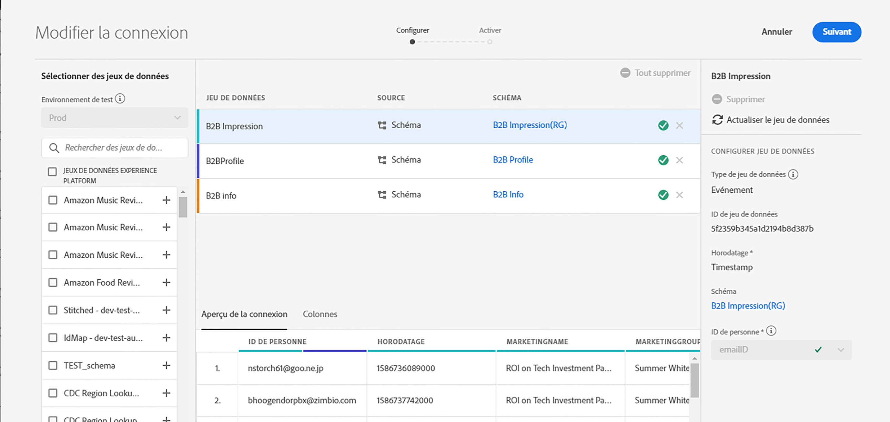
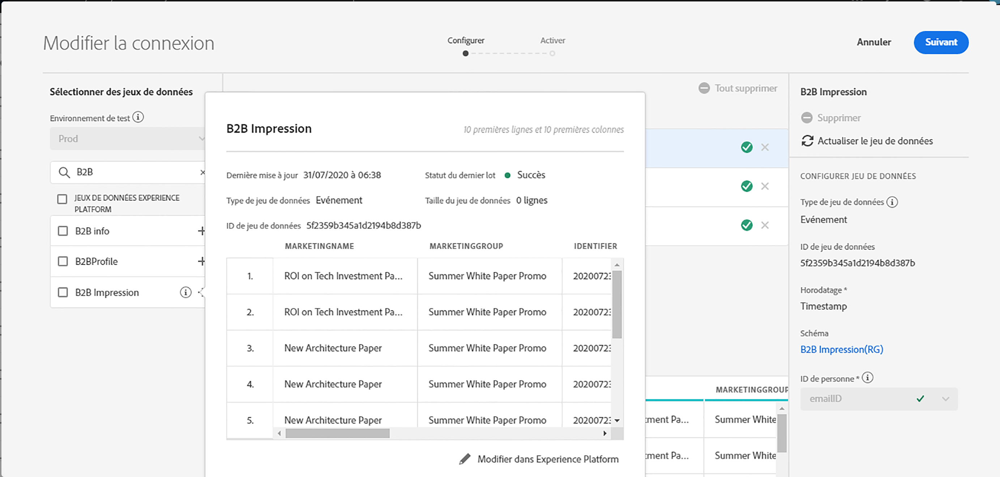
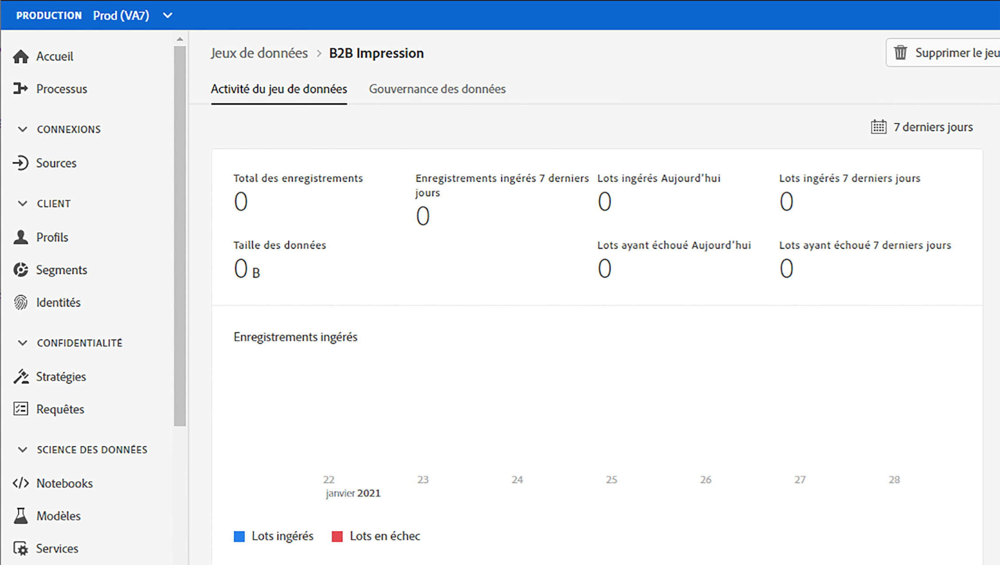
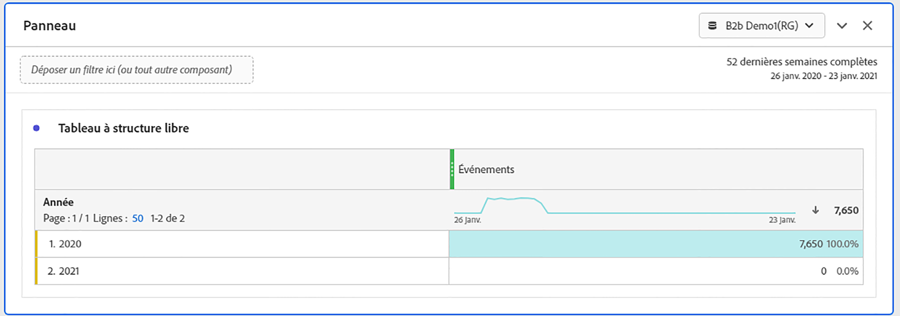
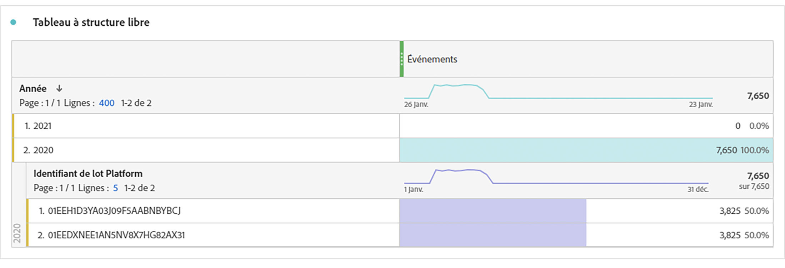

# Estimation de la taille de connexion

Vous devrez peut-être connaître le nombre de lignes de données actuellement présentes dans [!UICONTROL Customer Journey Analytics]. Cette rubrique a pour but de vous montrer comment rendre compte de votre utilisation actuelle de [!UICONTROL Customer Journey Analytics].

1. Dans [!UICONTROL Customer Journey Analytics], cliquez sur l&#39;onglet **[!UICONTROL Connexions]**.
1. Dans l&#39;écran [!UICONTROL Modifier la connexion], sélectionnez une connexion pour laquelle vous souhaitez déterminer la taille d&#39;utilisation/de connexion.

   

1. Sélectionnez un jeu de données qui fait partie de la connexion à partir du rail de gauche. Dans ce cas, il s’agit du jeu de données &quot;B2B Impression&quot;.

   

1. Cliquez sur l’icône bleue (i) (informations) en regard de son nom. Vous remarquerez que le jeu de données contient 3,8 000 lignes/événements. En outre, pour connaître le nombre exact de lignes, cliquez sur **[!UICONTROL Modifier dans Experience Platform]** sous le tableau de la prévisualisation. Vous serez redirigé vers les jeux de données dans [!UICONTROL Adobe Experience Platform].

   

1. Notez que le **[!UICONTROL total des enregistrements]** pour ce jeu de données s&#39;élève à 3,83 k d&#39;enregistrements, la taille des données étant de 388,59 Ko.

1. Répétez les étapes 1 à 5 pour les autres jeux de données de votre connexion et additionnez le nombre d’enregistrements/de lignes. Le dernier nombre agrégé correspond à la mesure d’utilisation de votre connexion. Il s&#39;agit du nombre de lignes des jeux de données de votre connexion que vous allez ingérer à partir de [!UICONTROL Adobe Experience Platform].

## Déterminer le nombre de lignes ingérées

Le nombre de événements réellement ingérés dans [!UICONTROL Customer Journey Analytics] dépend des paramètres de configuration de votre connexion. En outre, si vous avez sélectionné un ID de personne incorrect ou si cet ID n&#39;est pas disponible pour certaines lignes des jeux de données, [!UICONTROL Customer Journey Analytics] ignorera ces lignes. Pour déterminer les lignes réelles de événements ingérés, procédez comme suit :

1. Une fois la connexion enregistrée, créez une vue de données de la même connexion sans filtres.
1. Créez un projet Workspace et sélectionnez la vue de données appropriée. Créez un tableau à structure libre et faites glisser et déposez la mesure **[!UICONTROL Événements]** avec une dimension **[!UICONTROL Année]**. Choisissez une plage de dates suffisamment large dans votre calendrier de sélection de dates pour encapsuler toutes les données de votre connexion. Cela vous permet de voir le nombre de événements ingérés dans [!UICONTROL Customer Journey Analytics].

   

   >[!NOTE]
   >
   >Cela vous permet de voir le nombre de événements ingérés à partir de votre jeu de données de événements. Il n’inclut pas les jeux de données de type profil et recherche. Suivez les étapes 1 à 3 sous &quot;Estimer la taille de la connexion&quot; pour les jeux de données de profil et de recherche et additionnez les chiffres pour obtenir le nombre total de lignes pour cette connexion.

## Diagnostic des incohérences

Dans certains cas, vous remarquerez peut-être que le nombre total de événements ingérés par votre connexion est différent du nombre de lignes du jeu de données dans [!UICONTROL Adobe Experience Platform]. Dans cet exemple, le jeu de données &quot;Impression B2B&quot; contient 7 650 lignes, mais le jeu de données contient 3 830 lignes dans [!UICONTROL Adobe Experience Platform]. Il existe plusieurs raisons pour lesquelles des écarts peuvent survenir et les mesures suivantes peuvent être prises pour diagnostiquer :

1. Ventilez cette dimension par **[!UICONTROL ID de jeu de données de plate-forme]** et vous remarquerez deux jeux de données de même taille mais différents **[!UICONTROL ID de jeu de données de plate-forme]**. Chaque jeu de données contient 3 825 enregistrements. Cela signifie que [!UICONTROL Customer Journey Analytics] a ignoré 5 enregistrements en raison d’identifiants de personne manquants ou d’horodatages manquants :

   

1. En outre, si nous archivons [!UICONTROL Adobe Experience Platform], il n&#39;existe aucun jeu de données avec l&#39;ID &quot;5f21c12b732044194bffc1d0&quot;, d&#39;où la suppression de ce jeu de données particulier de [!UICONTROL Adobe Experience Platform] lors de la création de la connexion initiale. Par la suite, il a été ajouté à [!UICONTROL Customer Journey Analytics], mais un autre [!UICONTROL ID de jeu de données de plateforme] a été généré par [!UICONTROL Adobe Experience Platform].

   Pour en savoir plus sur les [implications de la suppression du jeu de données et de la connexion](https://experienceleague.adobe.com/docs/analytics-platform/using/cja-overview/cja-faq.html?lang=en#implications-of-deleting-data-components) dans [!UICONTROL Customer Journey Analytics] et [!UICONTROL Adobe Experience Platform].
