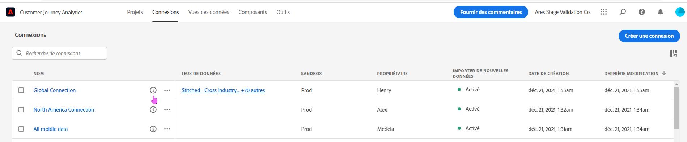
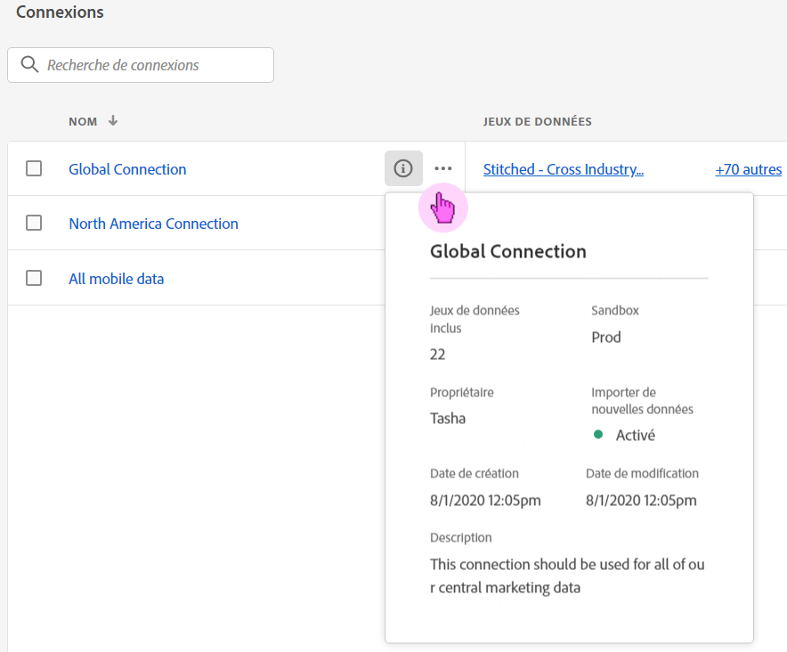
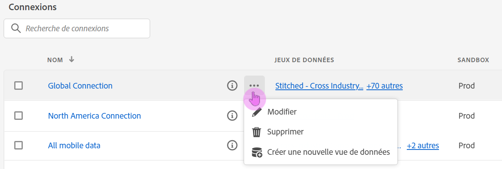
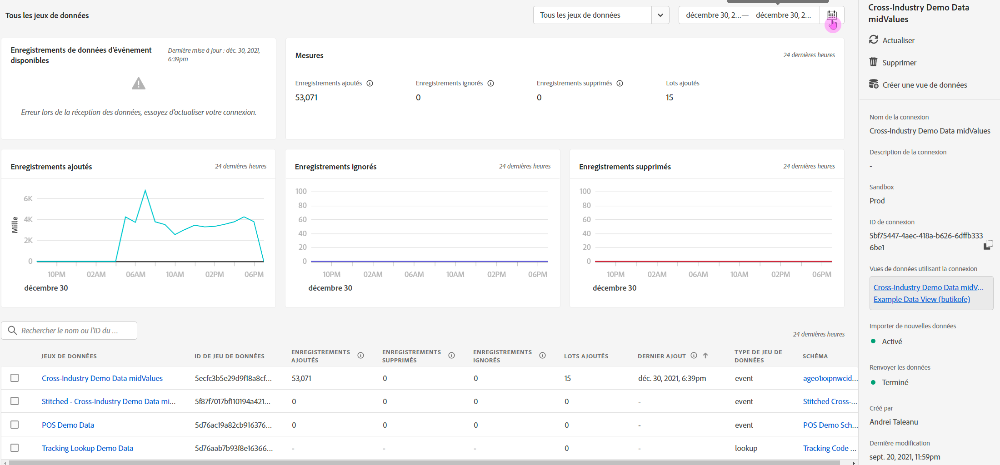

# Gestion des connexions

Une fois que les utilisateurs administrateurs ont [créé une ou plusieurs connexions](/help/connections/create-connection.md), ils peuvent les gérer dans le gestionnaire de [!UICONTROL connexions]. La dernière mise à jour concernant lʼexpérience de connexion ajoute deux fonctionnalités importantes dans la page Détails de la connexion, décrite plus bas dans cette page :

* Elle vous permet de vérifier le **statut des jeux de données de votre connexion ainsi que celui du processus dʼingestion**. Cette vérification du statut vous permet de savoir quand vos données sont disponibles afin que vous puissiez vous rendre dans Analysis Workspace et lancer lʼanalyse.

* Elle vous permet dʼ&#x200B;**identifier les disparités des données** dues à une mauvaise configuration. Vous manque-t-il des lignes ? Si oui, quelles lignes sont manquantes et quelle est la raison ? Avez-vous mal configuré les connexions et généré des données manquantes dans CJA ?

>[!NOTE]
> Cette fonctionnalité sera disponible pour tous le 20 septembre 2021.

## Gestionnaire de connexions {#connections-manager}

Le gestionnaire de connexions offre les fonctionnalités suivantes :

* Affichage récapitulatif des principales caractéristiques de vos connexions, y compris le propriétaire, lʼenvironnement de test ainsi que la date à laquelle elles ont été créées et modifiées.
* Affichage de tous les jeux de données dans une connexion.
* Vérification du statut dʼune connection.
* Supprimer une connexion.
* Renommer une connexion.
* Créer une vue de données à partir d’une connexion.

| Paramètre | Description |
| --- | --- |
| [!UICONTROL Nom] | Nom convivial de la connexion. Lorsque vous cliquez sur le nom du lien hypertexte, vous accédez à la page Détails de la connexion décrite ci-dessous. |
| Informations sur la connexion | Cliquez sur lʼicône dʼinformations en regard du nom de la connexion pour consulter les informations suivantes : |
| Modifier une connexion | Cliquez sur les points de suspension (...) en regard du nom de la connexion, puis cliquez sur [!UICONTROL Modifier]. Pour plus dʼinformations, voir « Modifier la connexion » ci-dessous. |
| Supprimer une connexion | Cliquez sur les points de suspension (...) en regard du nom de la connexion, puis cliquez sur [!UICONTROL Supprimer]. Pour plus dʼinformations, reportez-vous à la section « Supprimer les connexions » ci-dessous. |
| Créer une vue de données | Cliquez sur les points de suspension (...) en regard du nom de la connexion, puis cliquez sur [!UICONTROL Créer une vue de données]. Cette action crée une vue de données à partir de cette connexion. [En savoir plus](https://experienceleague.adobe.com/docs/analytics-platform/using/cja-dataviews/data-views.html?lang=fr) |
| [!UICONTROL Jeux de données] | Jeux de données qui font partie de la connexion. Vous pouvez cliquer sur le lien hypertexte pour afficher tous les jeux de données de la connexion. Cliquer sur un jeu de données l’ouvre dans un nouvel onglet d’Adobe Experience Platform. |
| [!UICONTROL Environnement de test] | [Environnement de test Adobe Experience Platform](https://experienceleague.adobe.com/docs/experience-platform/sandbox/home.html?lang=fr) dʼoù cette connexion tire ses jeux de données. Cet environnement de test a été sélectionné lorsque vous avez créé la connexion pour la première fois. Il ne peut pas être modifié. |
| [!UICONTROL Propriétaire] | Personne qui a créé la connexion. |
| [!UICONTROL Importer des jeux de données] | Permet dʼactiver ou de désactiver ce qui était autrefois appelé « diffusion de données en continu ». |
| [!UICONTROL Date de création ] | Date à laquelle la connexion a été créée pour la première fois. |
| [!UICONTROL Dernière modification] | Date de la dernière mise à jour de la connexion. |

### Suppression des connexions {#connections-delete}

Seuls les administrateurs sont autorisés à supprimer une connexion. Cette action ne sʼaffiche pas pour les utilisateurs non administrateurs.

1. Cliquez sur les points de suspension (...) en regard du nom de la connexion.
1. Cliquez sur [!UICONTROL Supprimer].

Lorsque vous supprimez une connexion dans [!UICONTROL Customer Journey Analytics], un message dʼerreur indique que :

* les vues de données créées à partir de la connexion supprimée ne fonctionnent plus.
* De même, les projets Workspace qui dépendent des vues de données dans la connexion supprimée cesseront de fonctionner.

[En savoir plus](/help/getting-started/cja-deletion.md) sur les conséquences des suppressions.

### Recherche dʼune connexion ou dʼun jeu de données

Vous pouvez rechercher des connexions à lʼaide de la barre de recherche située en haut, sous le titre [!UICONTROL Connexions].

### Tri des connexions

Vous pouvez trier les connexions en cliquant sur lʼen-tête de chaque colonne et en les triant vers le haut ou vers le bas.

## Page Détails de la connexion {#connection-detail}

La nouvelle page Détails des connexions vous offre une vue très détaillée du statut dʼune connexion.

Elle vous offre les possibilités suivantes :

* Vérifier le statut des jeux de données de votre connexion et du processus dʼingestion.
* Identifier les problèmes de configuration qui provoquent des enregistrements ignorés ou supprimés.
* Voir quand les données sont disponibles pour le compte rendu des performances.

>[!IMPORTANT]
>Les données ingérées avant le 13 août 2021 ne sont pas reflétées dans cette boîte de dialogue [!UICONTROL Connexions].

Les widgets et les paramètres sont expliqués ci-dessous :

| Widget/Paramètre | Description |
| --- | --- |
| Jeu de données sélecteur | Permet de sélectionner un ou tous les jeux de données de la connexion. Vous ne pouvez pas sélectionner plusieurs jeux de données. La valeur par défaut est [!UICONTROL Tous les jeux de données]. |
| Calendrier/périodes | La période indique la date à laquelle vous avez ajouté des données à la connexion. Tous les paramètres prédéfinis de calendrier standard sont inclus. Vous pouvez personnaliser la période, mais aucune période personnalisée ne sʼaffiche dans la liste déroulante. |
| Widget [!UICONTROL Enregistrements de données dʼévénement disponibles] | Affiche le nombre total de lignes de jeux de données dʼévénement disponibles pour le compte rendu des performances, **sur lʼensemble de la connexion**. Ce nombre est indépendant des paramètres du calendrier. Il varie si vous sélectionnez un jeu de données à partir du sélecteur de jeux de données ou en sélectionnant un jeu de données dans le tableau. (Remarquez la présence dʼune latence de 1 à 2 heures avant que les données nʼapparaissent dans le compte rendu des performances une fois quʼelles sont ajoutées.) |
| Widget [!UICONTROL Mesures] | Affiche les enregistrements dʼévénements ajoutés, ignorés et supprimés ainsi que le nombre de lots ajoutés, **pour le jeu de données et la période sélectionnés**. |
| Widget [!UICONTROL Enregistrements ajoutés] | Indique le nombre de lignes ajoutées au cours de la période sélectionnée, **pour le jeu de données et la période sélectionnés**. Mis à jour toutes les 10 minutes. **Remarque** : les données relatives aux **[!UICONTROL Enregistrements ajoutés]** incluent uniquement les données dʼévénement pour le moment, et non les données de profil ou de recherche. |
| Widget [!UICONTROL Enregistrements ignorés] | Indique le nombre de lignes ignorées au cours de la période sélectionnée, **pour le jeu de données et la période sélectionnés**. Les raisons pour lesquelles des enregistrements sont ignorés sont les suivantes : dates et heures manquantes, ID de personne non présent, etc. Mis à jour toutes les 10 minutes. **Remarque** : les données relatives aux **[!UICONTROL Enregistrements ignorés]** incluent uniquement les données dʼévénement pour le moment, et non les données de profil ou de recherche. |
| Widget [!UICONTROL Enregistrements supprimés] | Indique le nombre de lignes supprimées au cours de la période sélectionnée, **pour le jeu de données et la période sélectionnés**. Quelquʼun peut avoir supprimé un jeu de données dans Experience Platform, par exemple. Mis à jour toutes les 10 minutes. **Remarque** : les données relatives aux **[!UICONTROL Enregistrements supprimés]** incluent uniquement les données dʼévénement pour le moment, et non les données de profil ou de recherche. |
| Zone de recherche de jeux de données | Vous pouvez rechercher un jeu de données par son nom ou par son [!UICONTROL identifiant]. |
| [!UICONTROL Jeux de données] | Affiche les jeux de données qui font partie de la connexion. Vous pouvez cliquer sur le lien hypertexte pour afficher tous les jeux de données de la connexion. |
| [!UICONTROL Identifiant du jeu de données] | Cet identifiant est généré automatiquement par Adobe Experience Platform. |
| [!UICONTROL Lots] | Indique le nombre de lots de données ajoutés à ce jeu de données. |
| [!UICONTROL Dernier ajout] | Affiche la date et lʼheure à laquelle le dernier lot a été ajouté à ce jeu de données. |
| [!UICONTROL Type de jeu de données] | Le type de ce jeu de données peut être [!UICONTROL Événement], [!UICONTROL Recherche] ou [!UICONTROL Profil]. [En savoir plus](https://experienceleague.adobe.com/docs/analytics-platform/using/cja-connections/create-connection.html?lang=fr#configure-dataset) |
| Schéma | Schéma Adobe Experience Platform sur lequel sont basés les jeux de données dans cette connexion. |
| **Rail droit au niveau de la connexion** |  |
| [!UICONTROL Actualiser] | Actualisez la connexion pour permettre la prise en compte des enregistrements récemment ajoutés. |
| [!UICONTROL Supprimer] | Supprimez cette connexion. |
| [!UICONTROL Créer une vue de données] | Créez une vue de données basée sur cette connexion. [En savoir plus](https://experienceleague.adobe.com/docs/analytics-platform/using/cja-dataviews/data-views.html?lang=en) |
| [!UICONTROL Nom de la connexion] | Affiche le nom convivial de la connexion. |
| [!UICONTROL Description de la connexion] | Affiche une description plus détaillée concernant lʼobjectif de cette connexion. |
| [!UICONTROL ID de personne] | Affiche une identité qui a été définie dans le schéma du jeu de données dans Experience Platform. Il sʼagit de lʼ[!UICONTROL ID de personne] que vous avez choisi lors de la création de la connexion. Si vous créez une connexion qui comprend des jeux de données avec des ID différents, les rapports le reflèteront. Pour véritablement fusionner des jeux de données, vous devez utiliser le même [!UICONTROL ID de personne]. |
| [!UICONTROL Environnement de test] | [Environnement de test Adobe Experience Platform](https://experienceleague.adobe.com/docs/experience-platform/sandbox/home.html?lang=en) à partir duquel cette connexion tire son ou ses jeux de données. Cet environnement de test a été sélectionné lorsque vous avez créé la connexion pour la première fois. Il ne peut pas être modifié. |
| [!UICONTROL ID de connexion] | Cet identifiant est généré par le système dans Adobe Experience Platform. |
| [!UICONTROL Identifiant de l’organisation IMS] | [ID dʼorganisation](https://experienceleague.adobe.com/docs/core-services/interface/administration/organizations.html?lang=fr) associé à la société Experience Cloud activée. Anciennement appelé « société de connexion ». |
| [!UICONTROL Vues de données utilisant la connexion] | Répertorie toutes les vues de données qui utilisent cette connexion. |
| [!UICONTROL Importer de nouvelles données] | Indique si de nouveaux lots de données doivent ou non être ajoutés aux données historiques (de renvoi). |
| **Rail droit au niveau des jeux de données** |  |
| [!UICONTROL Description du jeu de données] | Décrit les paramètres de chaque jeu de données dans cette connexion. |
| [!UICONTROL Enregistrements disponibles] | Représente le nombre total de lignes ingérées pour ce jeu de données, au cours de la période sélectionnée dans le calendrier. Une fois ajoutées, les données apparaissent dans le compte rendu des performances sans aucune latence. (Sauf lorsque vous créez une toute nouvelle connexion, auquel cas il y aura une [latence](https://experienceleague.adobe.com/docs/analytics-platform/using/cja-overview/cja-faq.html?lang=fr#3.-transfert-de-données-dans-customer-journey-analytics).) |
| [!UICONTROL Enregistrements ajoutés] | Nombre de lignes ajoutées au cours de la période sélectionnée. **Remarque** : les données relatives aux **[!UICONTROL Enregistrements ajoutés]** incluent uniquement les données dʼévénement pour le moment, et non les données de profil ou de recherche. |
| [!UICONTROL Enregistrements ignorés] | Nombre de lignes ignorées lors de lʼingestion au cours de la période sélectionnée. **Remarque** : les données relatives aux **[!UICONTROL Enregistrements ignorés]** incluent uniquement les données dʼévénement pour le moment, et non les données de profil ou de recherche. |
| [!UICONTROL Enregistrements supprimés] | Nombre dʼenregistrements supprimés au cours de la période sélectionnée. **Remarque** : les données relatives aux **[!UICONTROL Enregistrements supprimés]** incluent uniquement les données dʼévénement pour le moment, et non les données de profil ou de recherche. |
| [!UICONTROL Erreurs concernant les enregistrements ignorés] | Les raisons pour lesquelles les enregistrements ont été ignorés sont indiquées ici. Il peut sʼagir de dates et heures manquantes, dʼun ID de personne non présent, etc. |
| [!UICONTROL Lots ingérés] | Nombre de lots de données ajoutés à ce jeu de données. |
| [!UICONTROL Dernier ajout] | Date à laquelle le dernier lot a été ajouté. |
| [!UICONTROL Type de jeu de données] | Soit [!UICONTROL Événement], [!UICONTROL Recherche] ou [!UICONTROL Profil]. [En savoir plus](https://experienceleague.adobe.com/docs/analytics-platform/using/cja-connections/create-connection.html?lang=en#configure-dataset) |
| [!UICONTROL Schéma] | Schéma Adobe Experience Platform sur lequel est basé ce jeu de données. |
| [!UICONTROL Identifiant du jeu de données] | Cet identifiant est généré par le système dans Adobe Experience Platform. |
| [!UICONTROL Renvoyer les données] | Le suivi des données de renvoi (historiques) est effectué dans 3 états : [!UICONTROL En file dʼattente], [!UICONTROL En cours] (avec le pourcentage de progression indiqué) et [!UICONTROL Terminé]. |

### Modifier la connexion

Permet aux administrateurs de modifier la connexion. Sélectionnez une connexion, puis cliquez sur [!UICONTROL Modifier la connexion] pour accéder à cette boîte de dialogue. Vous pouvez effectuer les opérations suivantes :

* Démarrer et cesser dʼimporter de nouvelles données. Ce processus était auparavant connu sous le nom de « diffusion de données en continu ».
* Renommer une connexion.
* Actualisez le ou les jeux de données.
* Supprimez le ou les jeux de données des connexions.

## Définir la fenêtre variable pour [!UICONTROL Connexion] rétention des données

>[!IMPORTANT]
>Contactez l’assistance clientèle ou votre gestionnaire de compte d’Adobe pour que ce paramètre soit mis en oeuvre. Elle n’est pas encore disponible via l’interface utilisateur de CJA.

Ce paramètre vous permet de définir la conservation des données CJA sous la forme d’un créneau variable en mois (3 mois, 6 mois, etc.), à une [!UICONTROL connection] (et non à un niveau [!UICONTROL dataset] niveau). La rétention des données est basée sur les horodatages des jeux de données d’événement et s’applique uniquement aux jeux de données d’événement. Il n’existe aucun paramètre de rétention des données pour les jeux de données de profil ou de recherche, puisqu’il n’existe aucun horodatage applicable. L’avantage principal est que vous ne stockez ou ne signalez que des données applicables et utiles et supprimez les données plus anciennes qui ne sont plus utiles. Il vous aide à rester sous les limites de votre contrat et réduit le risque de surcoût.