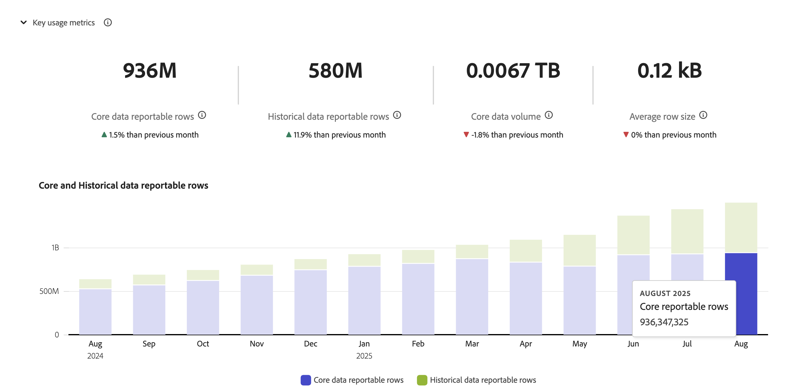

# Gérer des connexions

Une fois que vous avez [créé ou modifié une ou plusieurs connexions](/help/connections/create-connection.md), vous pouvez les gérer dans **[!UICONTROL Connexions]**. Les connexions vous permettent :

* Affichez en un coup d’œil toutes vos connexions, y compris le propriétaire, le sandbox et la date de création et de modification des connexions.
* Modifier une connexion.
* Supprimer une connexion.
* Créer une vue de données à partir d’une connexion.
* Affichage de tous les jeux de données dans une connexion.
* Vérifiez le statut des jeux de données de votre connexion et le statut du processus d’ingestion. Par exemple, quand vos données sont-elles disponibles pour que vous puissiez commencer à créer des rapports et des analyses dans Analysis Workspace ?
* Identifiez les incohérences de données dues à une mauvaise configuration. Vous manque-t-il des lignes ? Si oui, quelles lignes sont manquantes et pourquoi ? Avez-vous mal configuré les connexions et généré des données manquantes dans le Customer Journey Analytics ?
* Obtenez des informations sur l’utilisation des lignes ingérées et à signaler sur toutes vos connexions.

[!UICONTROL Connexions] a deux interfaces : [[!UICONTROL Liste]](#list) et [[!UICONTROL Utilisation]](#usage).

## Liste

L’interface [!UICONTROL List] est l’interface par défaut pour Connexions. Si cette option n’est pas sélectionnée, sélectionnez l’onglet **[!UICONTROL Liste]** pour accéder à l’interface.

L’interface [!UICONTROL Liste] affiche un tableau de toutes les connexions disponibles. Vous pouvez rechercher rapidement une connexion à l’aide de la zone Rechercher .

Les colonnes ou icônes suivantes sont disponibles dans le tableau.

| Colonne ou icône | Description |
| --- | --- |
| [!UICONTROL Nom] | Nom convivial de la connexion. Pour afficher les détails de la connexion, sélectionnez le nom du lien hypertexte. Voir [Détails de la connexion](#connection-details). |
|  | Pour afficher des informations sur [!UICONTROL Jeux de données inclus], [!UICONTROL Sandbox], [!UICONTROL Propriétaire], etc., sélectionnez  en regard du nom de la connexion.
Une fenêtre contextuelle affiche des détails. 
 |
|  | Pour [créer une vue de données](#create-a-data-view) pour la connexion, sélectionnez . Cette icône s’affiche uniquement lorsqu’aucune vue de données n’est déjà associée à la connexion. |
|  | Sélectionnez  pour : 
 [Modifier](#edit-a-connection) une connexion.
 [Supprimer](#delete-a-connection) une connexion.
 [Créer une vue de données](#create-a-data-view). Pour créer des vues de données supplémentaires pour la connexion. |
| [!UICONTROL Jeux de données] | Un ou plusieurs liens vers les jeux de données qui font partie de la connexion. Vous pouvez sélectionner le lien hypertexte du jeu de données pour afficher le jeu de données dans la connexion. Si d’autres jeux de données font partie de la connexion sélectionnée, sélectionnez **[!UICONTROL +*x* plus]** pour afficher un panneau **[!UICONTROL Jeux de données inclus]**. Ce panneau affiche des liens vers tous les jeux de données et une option permettant de rechercher un jeu de données spécifique qui fait partie de la connexion.

La sélection d’un nom de jeu de données ouvre le jeu de données dans l’interface utilisateur de l’Experience Platform dans un nouvel onglet. |
| [!UICONTROL Sandbox] | Le [sandbox Experience Platform ](https://experienceleague.adobe.com/fr/docs/experience-platform/sandbox/home) à partir duquel cette connexion tire ses jeux de données. Ce sandbox a été sélectionné lorsque vous avez créé la connexion pour la première fois. Il ne peut pas être modifié. |
| [!UICONTROL Propriétaire] | Personne qui a créé la connexion. |
| [!UICONTROL Importer de nouvelles données] | Statut de l’importation de nouvelles données pour les jeux de données : 
)    **[!UICONTROL _x _On]**pour les jeux de données configurés afin d’importer de nouvelles données, et
   **[!UICONTROL _x Désactivé_]** pour les jeux de données non configurés pour importer de nouvelles données. |
| [!UICONTROL Date de création] | Date et heure de création de la connexion. |
| [!UICONTROL Dernière modification] | Date et heure de la dernière mise à jour de la connexion. |
| [!UICONTROL Renvoyer les données] | Statut des données de renvoi dans les jeux de données.
   **[!UICONTROL _x _renvois ont échoué]**pour le nombre de renvois ayant échoué dans les jeux de données,
   le traitement des renvois **[!UICONTROL _x _]**pour le nombre de renvois de traitement dans les jeux de données,
   **[!UICONTROL _x _renvois terminés]**pour le nombre de renvois terminés pour les jeux de données, et
   **[!UICONTROL _Désactivé_]** au cas où aucun renvoi n’est défini pour les jeux de données dans la connexion. |

Pour configurer les colonnes à afficher, sélectionnez , qui affiche la boîte de dialogue **Personnaliser le tableau** vous permettant d’activer ou de désactiver les colonnes du tableau.

### Modifier une connexion

1. Sélectionnez  en regard du nom de la connexion
1. Sélectionnez  **[!UICONTROL Modifier]** dans le menu contextuel.

Vous pouvez également effectuer les opérations suivantes :

1. Sélectionnez la ligne de connexion.

1. Sélectionnez  **[!UICONTROL Modifier]** dans la barre bleue.

Lors de la modification d’une connexion, vous pouvez :

* Démarrer et arrêter l’import de nouvelles données.
* Renommer une connexion.
* Actualisez le ou les jeux de données.
* Supprimez le ou les jeux de données des connexions.

Voir [Créer ou modifier une connexion](create-connection.md) pour plus d’informations.

### Supprimer une connexion {#connections-delete}

1. Sélectionnez  en regard du nom de la connexion.
1. Sélectionnez  **[!UICONTROL Supprimer]**.

Vous pouvez également effectuer les opérations suivantes :

1. Sélectionnez la ligne de connexion.

1. Sélectionnez  **[!UICONTROL Supprimer]** dans la barre bleue.

Lorsque vous supprimez une connexion, un panneau **[!UICONTROL Supprimer la connexion]** indique quelles vues de données sont supprimées et quels projets d’espace de travail sont affectés.

Sélectionnez **[!UICONTROL Continuer]** pour supprimer la connexion.

Pour plus d’informations sur la suppression d’une connexion](/help/technotes/deletion.md) voir [ Conséquences de la suppression .

### Créer une vue de données pour une connexion

* Si aucune vue de données n’est associée à la connexion :

   1. Sélectionnez  en regard du nom de la connexion.

* Si une ou plusieurs vues de données sont déjà créées pour la connexion :

   1. Sélectionnez  en regard du nom de la connexion.
   1. Sélectionnez  **[!UICONTROL Créer une vue de données]**.

Vous pouvez également effectuer les opérations suivantes :

1. Sélectionnez la ligne de connexion.

1. Sélectionnez  **[!UICONTROL Créer une vue de données]** dans la barre de boutons bleue.

Consultez [Créer ou modifier une vue de données](/help/data-views/create-dataview.md) pour plus d’informations.

### Détails de la connexion {#connection-detail}

Pour accéder aux détails d’une connexion, sélectionnez un nom de connexion dans la table des connexions.

L’interface Détails des connexions fournit une vue détaillée du statut d’une connexion. Vous pouvez :

* Vérifier le statut des jeux de données de votre connexion et du processus dʼingestion.
* Identifier les problèmes de configuration qui peuvent entraîner des enregistrements ignorés ou supprimés.
* Voir quand les données sont disponibles pour le compte rendu des performances.

| Interface utilisateur | Description |
| --- | --- |
|  [!UICONTROL Modifier la connexion] | Pour modifier les détails d’une connexion, sélectionnez  **[!UICONTROL Modifier la connexion]**. Voir [Créer ou modifier une connexion](create-connection.md) pour plus d’informations. |
| Sélecteur de jeu de données | Permet de sélectionner un ou tous les jeux de données de la connexion. Vous ne pouvez pas sélectionner plusieurs jeux de données. La valeur par défaut est [!UICONTROL Tous les jeux de données]. |
| Sélecteur de période | Modifiez la date de début ou de fin, ou sélectionnez  pour ouvrir le sélecteur de périodes. Dans le sélecteur de période, sélectionnez une période à l’aide de l’une des périodes prédéfinies (par exemple, **[!UICONTROL 6 derniers mois]**) ou utilisez le calendrier pour sélectionner les dates de début et de fin. Sélectionnez **[!UICONTROL Appliquer]** pour appliquer la nouvelle période. |
| [!UICONTROL Enregistrements de données d’événement disponibles] | Nombre total de lignes de jeux de données d’événements disponibles pour la création de rapports, **pour l’ensemble de la connexion**. Ce nombre est indépendant des paramètres du calendrier. Le nombre change si vous sélectionnez un jeu de données à partir du sélecteur de jeux de données ou en sélectionnant un jeu de données dans le tableau. Une fois les données ajoutées, il y a une latence de 1 à 2 heures pour que les données apparaissent dans les rapports. |
| [!UICONTROL Mesures] | Résumez les enregistrements d&#39;événement, de recherche, de profil et de jeu de données de synthèse qui sont ajoutés, ignorés et supprimés, ainsi que le nombre de lots ajoutés. Ces mesures sont basées sur **le jeu de données et la période que vous avez sélectionnés**.
Sélectionnez **[!UICONTROL Vérifier les détails]** pour afficher la fenêtre contextuelle **[!UICONTROL Vérifier les détails ignorés]**. La fenêtre contextuelle répertorie le nombre d’enregistrements ignorés et la raison de tous les jeux de données d’événement ou du jeu de données sélectionné.

Sélectionnez la fenêtre contextuelle  avec plus d’informations. Pour certaines raisons ignorées, telles que [!UICONTROL ID de visiteur vide], la fenêtre contextuelle affiche Exemple de PSQL pour EQS (Experience Platform pour Query Service) que vous pouvez utiliser dans [Query Service](https://experienceleague.adobe.com/fr/docs/experience-platform/query/home) pour rechercher les enregistrements ignorés dans le jeu de données. Sélectionnez  **[!UICONTROL Copier l’exemple PSQL pour EQS]** pour copier le code SQL. |
| [!UICONTROL Enregistrements ajoutés] | Indique le nombre de lignes ajoutées au cours de la période sélectionnée, **pour le jeu de données et la période sélectionnés**. Mis à jour toutes les 10 minutes. |
| [!UICONTROL Enregistrements ignorés] | Indique le nombre de lignes ignorées au cours de la période sélectionnée, **pour le jeu de données et la période sélectionnés**. Les raisons pour lesquelles des enregistrements sont ignorés sont les suivantes : dates et heures manquantes, ID de personne manquant ou non valide, etc. Mis à jour toutes les 10 minutes. 
Les ID de personne non valides (tels que `undefined` ou `00000000`, ou toute combinaison de chiffres et de lettres dans un [!UICONTROL ID de personne] qui apparaît dans un événement plus d’un million de fois au cours d’un mois donné) sont des ID qui ne peuvent pas être attribués à un utilisateur ou à une personne spécifique. Ces lignes ne peuvent pas être ingérées dans le système et entraînent une ingestion et un compte rendu des performances sujets aux erreurs. Pour corriger les ID de personne non valides, vous disposez de 3 options :<ul><li>Utilisez [Assemblage](/help/stitching/overview.md) pour renseigner les ID utilisateur non définis ou entièrement nuls avec des ID utilisateur valides.</li><li>Videz les ID utilisateur, qui sont ensuite ignorés lors de l’ingestion (préférable aux ID d’utilisateur non valides ou entièrement nuls).</li><li>Corrigez tout ID utilisateur non valide dans votre système avant d’ingérer les données.</li></ul> |
| [!UICONTROL Enregistrements] supprimés | Indique le nombre de lignes supprimées au cours de la période sélectionnée, **pour le jeu de données et la période sélectionnés**. Par exemple, quelqu’un peut avoir supprimé un jeu de données dans [!DNL Experience Platform]. Mis à jour toutes les 10 minutes.
Dans certains scénarios, cette valeur peut également inclure des enregistrements remplacés, comme avec le groupement ou certaines mises à jour des jeux de données de recherche. Prenons l’exemple suivant :
<ul><li>Vous chargez un enregistrement vers un jeu de données Profil individuel XDM, que le Customer Journey Analytics est configuré pour ingérer en tant que données de recherche de profil. Dans les détails de la connexion, ce jeu de données affiche 1 enregistrement ajouté.</li><li>Vous chargez un doublon de l’enregistrement d’origine dans le même jeu de données AEP, qui contient désormais deux enregistrements. Customer Journey Analytics ingère l’enregistrement supplémentaire à partir du jeu de données de recherche de profil. Comme il a déjà ingéré un enregistrement de profil dans la connexion pour cet ID de personne, Customer Journey Analytics supprime sa version précédente et ajoute les nouvelles données de profil. Dans les détails de la connexion, cette action représenterait 1 enregistrement ajouté et 1 enregistrement supprimé, car Customer Journey Analytics ne conserve que les données de recherche de profil les plus récentes pour tout ID de personne ingéré.</li><li>Au total, le jeu de données AEP contient deux enregistrements qui se trouvent être identiques. Séparément, les détails de la connexion au Customer Journey Analytics affichent le statut de ses données ingérées : 2 enregistrements ajoutés et 1 enregistrement supprimé pour ce jeu de données de profil. </li></ul> |
|  _Rechercher le nom ou l’ID du jeu de données_ | Champ de recherche de jeu de données. Vous pouvez rechercher le tableau des jeux de données par nom de jeu de données ou [!UICONTROL Identifiant du jeu de données]. |
| [!UICONTROL Tableau des jeux de données] | Les jeux de données qui font partie de la connexion. |
| [!UICONTROL Jeux de données] | Nom du jeu de données qui fait partie de la connexion. Vous pouvez sélectionner le lien hypertexte pour ouvrir le jeu de données dans l’interface utilisateur de l’Experience Platform dans un nouvel onglet. Vous pouvez sélectionner la ligne ou la case à cocher pour afficher les détails du jeu de données sélectionné uniquement. |
| [!UICONTROL Identifiant du jeu de données] | Généré automatiquement par l’Experience Platform. |
| [!UICONTROL Enregistrements ajoutés] | Le nombre d’enregistrements du jeu de données (lignes) ajoutés à une connexion pendant l’intervalle de temps sélectionné. |
| [!UICONTROL Enregistrements ignorés] | Le nombre d’enregistrements du jeu de données (lignes) ignorés pendant le transfert de données pour une connexion pendant l’intervalle de temps sélectionné. |
| [!UICONTROL Enregistrements supprimés] | Le nombre d’enregistrements du jeu de données (lignes) supprimés d’une connexion pendant l’intervalle de temps sélectionné. |
| [!UICONTROL Lots ajoutés] | Le nombre de lots de jeux de données a été ajouté à une connexion. |
| [!UICONTROL Dernier ajout] | La date et l’heure du dernier lot du jeu de données qui a été ajouté à une connexion. |
| [!UICONTROL Type de source de données] | Type de source du jeu de données. Vous définissez le type de source lors de la création d’une connexion. |
| [!UICONTROL Type de jeu de données] | Type de jeu de données pour ce jeu de données. Le type peut être [!UICONTROL Événement], [!UICONTROL Profil], [!UICONTROL Recherche] ou [!UICONTROL Résumé]. [En savoir plus](https://experienceleague.adobe.com/fr/docs/analytics-platform/using/cja-connections/create-connection) |
| Schéma | Schéma Experience Platform sur lequel est basé le jeu de données. |
| [!UICONTROL Importer de nouvelles données] | Statut de l’importation des nouvelles données pour le jeu de données : 
   **[!UICONTROL _x _Activé]**si le jeu de données est configuré pour importer de nouvelles données, et
   **[!UICONTROL _x Désactivé_]** si le jeu de données est configuré pour ne pas importer de nouvelles données. |
| [!UICONTROL Transformer les données] | Statut de transformation des jeux de données de recherche B2B applicables. Voir [Transformer des jeux de données pour les recherches B2B](transform-datasets-b2b-lookups.md) pour plus d’informations.
   **[!UICONTROL _x _Activé]**pour les jeux de données applicables activés pour la transformation, 
   **[!UICONTROL _x Désactivé_]** pour les jeux de données applicables non activés pour la transformation ; et
**[!UICONTROL N/A]** pour tous les autres jeux de données, non applicable à la transformation. |
| [!UICONTROL Renvoyer les données] | Statut des données de renvoi pour le jeu de données.
   **[!UICONTROL _x _renvois ayant échoué]**pour le nombre de renvois ayant échoué,
   le traitement des renvois **[!UICONTROL _x _]**pour le nombre de renvois de traitement,
   **[!UICONTROL _x _renvois terminés]**pour le nombre de renvois terminés, et
   **[!UICONTROL _Désactivé_]** au cas où les renvois ne seraient pas configurés. |
| [!UICONTROL Importer de nouvelles données] | Statut de l’importation des nouvelles données pour le jeu de données : 
   **[!UICONTROL _x _Activé]**si le jeu de données est configuré pour importer de nouvelles données, et
   **[!UICONTROL _x Désactivé_]** si le jeu de données est configuré pour ne pas importer de nouvelles données. |
| [!UICONTROL Renvoyer les données] | Statut des données de renvoi pour le jeu de données.
   **[!UICONTROL _x _renvois ayant échoué]**pour le nombre de renvois ayant échoué,
   le traitement des renvois **[!UICONTROL _x _]**pour le nombre de renvois de traitement,
   **[!UICONTROL _x _renvois terminés]**pour le nombre de renvois terminés, et
   **[!UICONTROL _Désactivé_]** au cas où aucun renvoi n’est configuré. |

>[!IMPORTANT]
>
>Les données ingérées avant le 13 août 2021 ne sont pas reflétées dans l’interface [!UICONTROL Connexions].

#### Panneau Connexion

Lorsqu’aucun jeu de données n’est sélectionné dans le tableau des jeux de données, un panneau sur le côté droit de l’interface Connexions affiche les options et les détails de la connexion.

| Options | Description |
| --- | --- |
|  [!UICONTROL Actualiser] | Pour actualiser la connexion et permettre la prise en compte des enregistrements récemment ajoutés, sélectionnez  **[!UICONTROL Actualiser]**. |
|  **[!UICONTROL Supprimer]** | [Supprimer](#delete-a-connection) cette connexion. |
|  **[!UICONTROL Créer une vue de données]** | [Créez une vue de données](#create-a-data-view) basée sur cette connexion. Voir [Vues de données](https://experienceleague.adobe.com/fr/docs/analytics-platform/using/cja-dataviews/data-views) pour plus d’informations. |
| [!UICONTROL Nom de la connexion] | Nom convivial de la connexion. |
| [!UICONTROL Description de la connexion] | Description plus détaillée de l’objectif de cette connexion. |
| [!UICONTROL Sandbox] | Sandbox Experience Platform  à partir duquel cette connexion tire son ou ses jeux de données. Ce sandbox a été sélectionné lorsque vous avez créé la connexion pour la première fois. Il ne peut pas être modifié. |
| [!UICONTROL ID de connexion] | Cet identifiant est généré dans Experience Platform. Vous pouvez utiliser  pour copier l’ID. |
| [!UICONTROL Vues de données utilisant la connexion] | Répertorie toutes les vues de données qui utilisent cette connexion. |
| [!UICONTROL Importer de nouvelles données] | Statut de l’importation de nouvelles données pour les jeux de données : 
   **[!UICONTROL _x _On]**le nombre de jeux de données configurés pour importer de nouvelles données, et
   **[!UICONTROL _x Désactivé_]** pour le nombre de jeux de données pour lesquels le nouvel import de données est désactivé. |
| [!UICONTROL Renvoyer les données] | Statut des données de renvoi pour les jeux de données.
   **[!UICONTROL _x _renvois ont échoué]**pour le nombre de renvois ayant échoué dans les jeux de données,
   le traitement des renvois **[!UICONTROL _x _]**pour le nombre de renvois de traitement dans les jeux de données,
   **[!UICONTROL _x _renvois terminés]**pour le nombre de renvois terminés pour les jeux de données, et
   **[!UICONTROL _Désactivé_]** au cas où aucun renvoi n’est défini pour les jeux de données dans la connexion. |
| Transformer les données | Statut de transformation des jeux de données de recherche B2B applicables. Voir [Transformer des jeux de données pour les recherches B2B](transform-datasets-b2b-lookups.md) pour plus d’informations.
   **[!UICONTROL _x _On]**pour le nombre de jeux de données activés pour la transformation. |
| [!UICONTROL Créé par] | Nom de la personne qui a créé la connexion. |
| [!UICONTROL Dernière modification] | Date et heure de la dernière modification apportée à la connexion. |
| [!UICONTROL Dernière modification par] | Personne qui a effectué la dernière modification de la connexion. |

#### Panneau Jeu de données

Lorsqu’un jeu de données est sélectionné dans le tableau Jeux de données , un panneau situé sur le côté droit de l’interface Connexions affiche les détails du jeu de données sélectionné.

| Détails | Description |
| --- | --- |
| [!UICONTROL ID de personne] | Identité définie dans le schéma du jeu de données dans l’Experience Platform. Cette identité est l’ID de personne que vous avez sélectionné lors de la création de la connexion. Si vous créez une connexion qui inclut des jeux de données avec des identifiants différents, les rapports le reflètent. Pour fusionner des jeux de données, vous devez utiliser le même ID de personne sur tous les jeux de données. |
| [!UICONTROL Clé] | Clé que vous avez spécifiée pour un jeu de données de recherche. |
| [!UICONTROL Clé correspondante] | La clé correspondante que vous avez spécifiée pour un jeu de données de recherche. |
| [!UICONTROL Date et heure] | Horodatage défini pour un jeu de données d’événement. |
| [!UICONTROL Enregistrements disponibles] | Nombre total de lignes ingérées pour ce jeu de données, pendant la période particulière sélectionnée dans le calendrier. Une fois ajoutées, les données apparaissent dans le compte rendu des performances sans aucune latence. Cependant, lorsque vous créez une toute nouvelle connexion, il y a [ latence ](https://experienceleague.adobe.com/en/docs/analytics-platform/using/cja-overview/cja-faq). |
| [!UICONTROL Enregistrements ajoutés] | Nombre de lignes ajoutées au cours de la période sélectionnée. |
| [!UICONTROL Enregistrements supprimés] | Nombre d’enregistrements supprimés au cours de la période sélectionnée. |
| [!UICONTROL Lots ajoutés] | Nombre de lots de données ajoutés à ce jeu de données. |
| [!UICONTROL Enregistrements ignorés] | Nombre de lignes ignorées lors de lʼingestion au cours de la période sélectionnée.
Les raisons pour lesquelles des enregistrements sont ignorés sont les suivantes : dates et heures manquantes, ID de personne manquant ou non valide, etc. Mis à jour toutes les 10 minutes.
Les ID de personne non valides (tels que `undefined` ou `00000000`, ou toute combinaison de chiffres et de lettres dans un [!UICONTROL ID de personne] qui apparaît dans un événement plus d’un million de fois au cours d’un mois donné) sont des ID qui ne peuvent pas être attribués à un utilisateur ou à une personne spécifique. Ces lignes ne peuvent pas être ingérées dans le système et entraînent une ingestion et un compte rendu des performances sujets aux erreurs. Pour corriger les ID de personne non valides, vous disposez de 3 options :<ul><li>Utilisez [Assemblage](/help/stitching/overview.md) pour renseigner les ID utilisateur non définis ou entièrement nuls avec des ID utilisateur valides.</li><li>Videz l’ID utilisateur, qui est ensuite ignoré lors de l’ingestion (préférable aux ID d’utilisateur non valides ou entièrement nuls).</li><li>Corrigez tout ID utilisateur non valide dans votre système avant d’ingérer les données.</li></ul> |
| [!UICONTROL Dernier ajout] | La date et l’heure du dernier lot a été ajouté. |
| [!UICONTROL Importer de nouvelles données] | Statut de l’importation des nouvelles données pour le jeu de données : 
   **[!UICONTROL _x _Activé]**si le jeu de données est configuré pour importer de nouvelles données, et
   **[!UICONTROL _x Désactivé_]** si le jeu de données est configuré pour ne pas importer de nouvelles données. |
| [!UICONTROL Renvoyer les données] | Statut des données de renvoi pour le jeu de données.
   **[!UICONTROL _x _renvois ayant échoué]**pour le nombre de renvois ayant échoué,
   le traitement des renvois **[!UICONTROL _x _]**pour le nombre de renvois de traitement,
   **[!UICONTROL _x _renvois terminés]**pour le nombre de renvois terminés, et
   **[!UICONTROL _Désactivé_]** au cas où aucun renvoi n’est configuré.
Pour afficher une boîte de dialogue avec un aperçu des renvois précédents pour le jeu de données, sélectionnez  **[!UICONTROL Renvois précédents]**. |
| [!UICONTROL Type de source de données] | Type de source de données tel que défini lors de l’ajout du jeu de données à la connexion. |
| [!UICONTROL Type de jeu de données] | [!UICONTROL Événement], [!UICONTROL Profil], [!UICONTROL Recherche] ou [!UICONTROL Résumé]. [En savoir plus](https://experienceleague.adobe.com/fr/docs/analytics-platform/using/cja-connections/create-connection) |
| [!UICONTROL Schéma] | Schéma Experience Platform sur lequel est basé ce jeu de données. |
| [!UICONTROL Identifiant du jeu de données] | Cet identifiant de jeu de données est généré dans Experience Platform. |

## Utilisation {#connections-usage}

<!-- markdownlint-disable MD034 -->

>[!CONTEXTUALHELP]
>id="cja_connections_usage_keyusagemetrics"
>title="Mesures d’utilisation clés"
>abstract="Elles fournissent des données mensuelles et totales pour les lignes principales et historiques sur lesquelles effectuer des rapports."
<!-- markdownlint-enable MD034 -->

<!-- markdownlint-disable MD034 -->

>[!CONTEXTUALHELP]
>id="cja_connections_usage_monthlyingestedrows"
>title="Lignes ingérées par mois"
>abstract="Cette option mesure le nombre total d’enregistrements ajoutés au système chaque mois pour fournir des informations sur la croissance des données et les taux d’ingestion."
<!-- markdownlint-enable MD034 -->

<!-- markdownlint-disable MD034 -->

>[!CONTEXTUALHELP]
>id="cja_connections_usage_monthlyreportablerows"
>title="Lignes mensuelles sur lesquelles effectuer des rapports"
>abstract="Cette option effectue le suivi du nombre de lignes disponibles pour la création de rapports. Les lignes sur lesquelles effectuer des rapports sont les lignes ingérées moins les lignes ignorées et supprimées lors de l’ingestion. Les lignes sur lesquelles effectuer des rapports servent de mesure clé pour la facturation et l’utilisation des données."
<!-- markdownlint-enable MD034 -->

<!-- markdownlint-disable MD034 -->

>[!CONTEXTUALHELP]
>id="cja_connections_usage_detailbreakdown"
>title="Répartition détaillée."
>abstract="Vous pouvez afficher les mesures détaillées par connexion, jeu de données, sandbox et balises, avec la possibilité de télécharger un fichier CSV des données."
<!-- markdownlint-enable MD034 -->

<!-- markdownlint-disable MD034 -->

>[!CONTEXTUALHELP]
>id="cja_connections_usage_otherdatasets"
>title="Autres jeux de données"
>abstract="Pour les mois précédant septembre 2024, les données ont été collectées au niveau des jeux de données et s’affichent sous la forme *Autres jeux de données* par souci de clarté. À compter de septembre 2024, les données sont collectées au niveau d’un jeu de données granulaire et l’option *Autres jeux de données* n’apparaît plus."
<!-- markdownlint-enable MD034 -->

<!-- markdownlint-disable MD034 -->

>[!CONTEXTUALHELP]
>id="cja_connections_usage_unknowndatasetsorconnections"
>title="Jeux de données ou connexions inconnus"
>abstract="Les jeux de données ou les connexions inconnus s’affichent à l’aide de leurs identifiants."
<!-- markdownlint-enable MD034 -->

<!-- markdownlint-disable MD034 -->

>[!CONTEXTUALHELP]
>id="cja_connections_usage_datanotavailable"
>title="Données non disponibles"
>abstract="Les données historiques antérieures à septembre 2024 ne sont pas disponibles en raison de limitations du système. Les mesures sont collectées et affichées à partir de septembre 2024. Le graphique affiche les 18 derniers mois de la chronologie et les données futures apparaîtront à mesure que les données seront disponibles."
<!-- markdownlint-enable MD034 -->

<!-- markdownlint-disable MD034 -->

>[!CONTEXTUALHELP]
>id="cja_connections_corereportablerows"
>title="Lignes principales sur lesquelles effectuer des rapports"
>abstract="Affiche le nombre total de lignes disponibles au cours des 13 derniers mois. Par exemple, le 1er février 2024, le nombre affiche le nombre total de lignes disponibles avec un horodatage d’événement de janvier 2023 à janvier 2024."
<!-- markdownlint-enable MD034 -->

<!-- markdownlint-disable MD034 -->

>[!CONTEXTUALHELP]
>id="cja_connections_historicalreportablerows"
>title="Lignes historiques sur lesquelles effectuer des rapports"
>abstract="Affiche le nombre total de lignes disponibles pour la période datant de plus de 13 mois. Par exemple, le 1er février 2024, le nombre affiche le nombre total de lignes disponibles avec un horodatage d’événement antérieur à janvier 2023."

<!-- markdownlint-enable MD034 -->

<!-- markdownlint-disable MD034 -->

>[!CONTEXTUALHELP]
>id="connections_usage_keyusagemetrics"
>title="Mesures d’utilisation clés"
>abstract="Elles fournissent des données mensuelles et totales pour les lignes principales et historiques sur lesquelles effectuer des rapports."
<!-- markdownlint-enable MD034 -->

<!-- markdownlint-disable MD034 -->

>[!CONTEXTUALHELP]
>id="connections_usage_monthlyingestedrows"
>title="Lignes ingérées par mois"
>abstract="Cette option mesure le nombre total d’enregistrements ajoutés au système chaque mois pour fournir des informations sur la croissance des données et les taux d’ingestion."
<!-- markdownlint-enable MD034 -->

<!-- markdownlint-disable MD034 -->

>[!CONTEXTUALHELP]
>id="connections_usage_monthlyreportablerows"
>title="Lignes mensuelles sur lesquelles effectuer des rapports"
>abstract="Cette option effectue le suivi du nombre de lignes disponibles pour la création de rapports. Les lignes sur lesquelles effectuer des rapports sont les lignes ingérées moins les lignes ignorées et supprimées lors de l’ingestion. Les lignes sur lesquelles effectuer des rapports servent de mesure clé pour la facturation et l’utilisation des données."
<!-- markdownlint-enable MD034 -->

<!-- markdownlint-disable MD034 -->

>[!CONTEXTUALHELP]
>id="connections_usage_detailbreakdown"
>title="Répartition détaillée."
>abstract="Vous pouvez afficher les mesures détaillées par connexion, jeu de données, sandbox et balises, avec la possibilité de télécharger un fichier CSV des données."
<!-- markdownlint-enable MD034 -->

<!-- markdownlint-disable MD034 -->

>[!CONTEXTUALHELP]
>id="connections_usage_otherdatasets"
>title="Autres jeux de données"
>abstract="Pour les mois précédant septembre 2024, les données ont été collectées au niveau des jeux de données et s’affichent sous la forme *Autres jeux de données* par souci de clarté. À compter de septembre 2024, les données sont collectées au niveau d’un jeu de données granulaire et l’option *Autres jeux de données* n’apparaît plus."
<!-- markdownlint-enable MD034 -->

<!-- markdownlint-disable MD034 -->

>[!CONTEXTUALHELP]
>id="connections_usage_unknowndatasetsorconnections"
>title="Jeux de données ou connexions inconnus"
>abstract="Les jeux de données ou les connexions inconnus s’affichent à l’aide de leurs identifiants."
<!-- markdownlint-enable MD034 -->

<!-- markdownlint-disable MD034 -->

>[!CONTEXTUALHELP]
>id="connections_usage_datanotavailable"
>title="Données non disponibles"
>abstract="Les données historiques antérieures à septembre 2024 ne sont pas disponibles en raison de limitations du système. Les mesures sont collectées et affichées à partir de septembre 2024. Le graphique affiche les 18 derniers mois de la chronologie et les données futures apparaîtront à mesure que les données seront disponibles."
<!-- markdownlint-enable MD034 -->

<!-- markdownlint-disable MD034 -->

>[!CONTEXTUALHELP]
>id="connections_corereportablerows"
>title="Lignes principales sur lesquelles effectuer des rapports"
>abstract="Affiche le nombre total de lignes disponibles au cours des 13 derniers mois. Par exemple, le 1er février 2024, le nombre affiche le nombre total de lignes disponibles avec un horodatage d’événement de janvier 2023 à janvier 2024."
<!-- markdownlint-enable MD034 -->

<!-- markdownlint-disable MD034 -->

>[!CONTEXTUALHELP]
>id="connections_historicalreportablerows"
>title="Lignes historiques sur lesquelles effectuer des rapports"
>abstract="Affiche le nombre total de lignes disponibles pour la période datant de plus de 13 mois. Par exemple, le 1er février 2024, le nombre affiche le nombre total de lignes disponibles avec un horodatage d’événement antérieur à janvier 2023."

<!-- markdownlint-enable MD034 -->

L’interface [!UICONTROL Utilisation] affiche l’utilisation des lignes ingérées et à signaler sur toutes les connexions. Si cette option n’est pas sélectionnée, sélectionnez l’onglet **[!UICONTROL Utilisation]** pour accéder à l’interface.

Cette interface vous aide à déterminer si l’utilisation de votre Customer Journey Analytics est conforme à ce qui est convenu contractuellement. Outre la surveillance, vous pouvez utiliser l’interface d’utilisation pour planifier le renouvellement de la licence de votre Customer Journey Analytics.

L’interface d’utilisation utilise les mesures suivantes

| Nom de la mesure | Description |
|---|---|
| Lignes historiques sur lesquelles effectuer des rapports | Nombre de lignes pour la période de plus de 13 mois. |
| Lignes principales sur lesquelles effectuer des rapports | Nombre de lignes au cours des 13 derniers mois. |
| Lignes ingérées | Nombre de lignes ingérées pour la période spécifique. |
| Lignes à déclarer | Combien de lignes de données avez-vous dans le cadre de la connexion pour la période spécifique ? |
| Lignes cumulées | Nombre de lignes ingérées jusqu’au mois spécifique. |

>[!NOTE]
>
>Les données sont collectées à partir de juillet 2024 pour les enregistrements principaux, historiques et totaux. Contactez votre gestionnaire de compte pour obtenir des données historiques antérieures.
>

L’interface d’utilisation se compose de deux panneaux :

* Le panneau **[!UICONTROL Mesures d’utilisation clés]** : fournit des lignes de données principales et historiques à signaler. Le panneau effectue également le suivi des modifications en pourcentage par rapport au mois précédent pour les lignes de données principales et historiques.

  Le panneau s’affiche dans une visualisation :

   * **[!UICONTROL Lignes de données principales à signaler]**.

     Combien de lignes à déclarer avez-vous au cours des 13 derniers mois ? La synthèse des chiffres correspond au nombre de lignes principales à déclarer (par exemple, 741 millions) pour le dernier mois (par exemple, décembre 2024).

   * **[!UICONTROL Lignes de données historiques à signaler]**.

     Combien de lignes à déclarer avez-vous pour la période de plus de 13 mois ? La synthèse des chiffres correspond au nombre de lignes historiques à déclarer (par exemple, 127 millions) pour le dernier mois (par exemple, décembre 2024).

  Lorsque vous pointez sur une barre empilée dans la visualisation, une fenêtre contextuelle affiche le nombre de lignes de cette partie spécifique de la barre (par exemple).

  

* Panneau combiné affichant trois sous-panneaux pour :

+++ Lignes ingérées

  Le sous-panneau **[!UICONTROL Lignes ingérées]** mesure le nombre total d’enregistrements ajoutés au système chaque mois, fournissant des informations sur la croissance des données et les taux d’ingestion. Le sous-panneau fournit un résumé du nombre total de lignes ingérées de ce mois et de la modification par rapport au mois précédent.

  

  Vous pouvez pointer sur des points de données dans la visualisation pour afficher une fenêtre contextuelle contenant plus de détails.

+++

+++ Lignes à déclarer

  La visualisation **[!UICONTROL Lignes à signaler]** permet de suivre le nombre de lignes disponibles pour la création de rapports en soustrayant les lignes ignorées et supprimées des lignes ingérées, ce qui sert de mesure clé pour la facturation et l’utilisation des données. Le sous-panneau fournit deux résumés :

   * **[!UICONTROL Total du mois dernier]** : synthèse du total des lignes à déclarer jusqu&#39;à ce mois.
   * **[!UICONTROL Ce mois-ci]** : Synthèse du total des lignes à déclarer de ce mois et de la modification par rapport au mois précédent.

  

  Vous pouvez pointer sur des points de données dans les visualisations pour afficher une fenêtre contextuelle contenant plus de détails.

+++

+++ Répartition des détails

  Vous pouvez utiliser le tableau **[!UICONTROL Répartition des détails]** pour afficher les mesures détaillées par connexion, jeu de données, sandbox et balises. Les jeux de données sont signalés à l’aide d’identifiants plutôt que de noms, car les noms des jeux de données peuvent être modifiés pendant une période de création de rapports. Des jeux de données ou des connexions inconnus sont signalés à l’aide d’identifiants.

  Pour les mois précédant septembre 2024, les données ont été collectées au niveau des jeux de données et s’affichent sous la forme [!UICONTROL Autres jeux de données] par souci de clarté. À compter de septembre 2024, les données sont collectées au niveau d’un jeu de données granulaire et [!UICONTROL Autres jeux de données] n’apparaît plus.

   * Pour modifier la répartition, sélectionnez une combinaison pour **[!UICONTROL Afficher par]** et **[!UICONTROL Répartir par]**.

     | Options **[!UICONTROL Afficher par]** | Options **[!UICONTROL Répartition par]** |
     |---|---|
     | **[!UICONTROL Connexion]** | **[!UICONTROL -]** et **[!UICONTROL jeu de données]** |
     | **[!UICONTROL Jeu de données]** | **[!UICONTROL -]** |
     | **[!UICONTROL Sandbox]** | **[!UICONTROL Connexion]** |
     | **[!UICONTROL Étiquette]** | **[!UICONTROL Connexion]** |

  

+++

  Vous pouvez définir une **[!UICONTROL Période]** en mois pour créer un rapport. Utilisez  pour sélectionner la période.

>[!MORELIKETHIS]
>
>Tutoriel [Affichage, dépannage et modification ](https://experienceleague.adobe.com/en/docs/customer-journey-analytics-learn/tutorials/connections/connections-details-experience-in-cja) paramètres de connexion.
