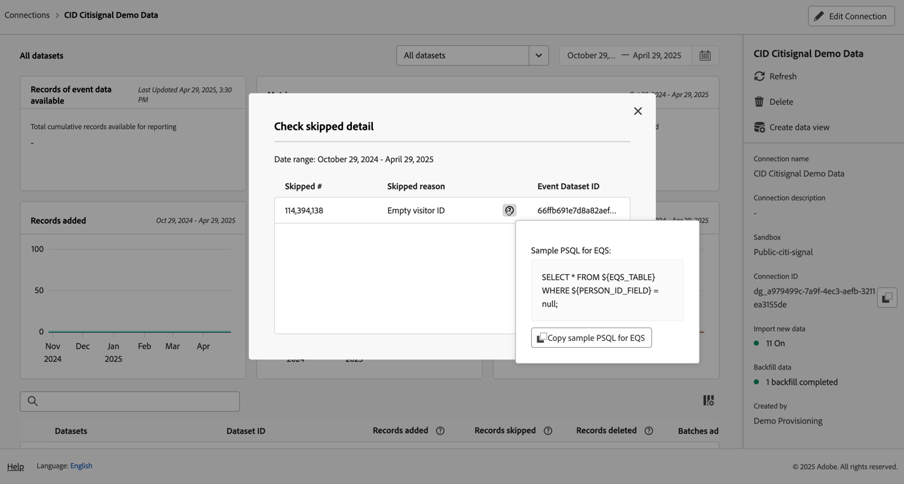

# Gestion des connexions

Une fois que vous avez [création ou modification d’une ou de plusieurs connexions](/help/connections/create-connection.md), vous pouvez les gérer dans **[!UICONTROL Connexions]**. Les connexions permettent :

* Affichez toutes vos connexions en un coup d’oeil, y compris le propriétaire, l’environnement de test et le moment où les connexions ont été créées et modifiées.
* Modification d’une connexion.
* Supprimer une connexion.
* Créer une vue de données à partir d’une connexion.
* Affichage de tous les jeux de données dans une connexion.
* Vérifiez l’état des jeux de données de votre connexion et l’état du processus d’ingestion. Par exemple, quand vos données sont disponibles afin que vous puissiez commencer à créer des rapports et des analyses dans Analysis Workspace.
* Identifiez les incohérences de données dues à une mauvaise configuration. Vous manque-t-il des lignes ? Si tel est le cas, quelles lignes sont manquantes et pourquoi ? Avez-vous mal configuré les connexions et généré des données manquantes en Customer Journey Analytics ?
* Obtenez des informations sur l’utilisation des lignes ingérées et reportables sur toutes vos connexions.

[!UICONTROL Connexions] comporte deux interfaces : [[!UICONTROL Liste]](#list) et [[!UICONTROL Utilisation]](#usage).

## Liste

La variable [!UICONTROL Liste] est l’interface par défaut pour les connexions. Si cette option n’est pas sélectionnée, sélectionnez la variable **[!UICONTROL Liste]** pour accéder à l’interface.

La variable [!UICONTROL Liste] affiche un tableau de toutes les connexions disponibles. Vous pouvez rechercher rapidement une connexion à l’aide de la fonction de recherche  de la boîte.

Les colonnes ou icônes suivantes sont disponibles dans le tableau.

| Colonne ou icône | Description |
| --- | --- |
| [!UICONTROL Nom] | Nom convivial de la connexion. Pour afficher les détails de la connexion, sélectionnez le nom de l’hyperlien. Voir [Détails de la connexion](#connection-details). |
|  | Pour afficher des informations sur [!UICONTROL Jeux de données inclus], [!UICONTROL Sandbox], [!UICONTROL Propriétaire], etc., sélectionnez  en regard du nom de la connexion.
Une fenêtre contextuelle affiche les détails. 
 |
|  | À [créer une vue de données](#create-a-data-view) pour la connexion, sélectionnez . Cette icône s’affiche uniquement lorsqu’aucune vue de données n’est déjà associée à la connexion. |
|  | Sélectionner  à : 
 [Modifier](#edit-a-connection) une connexion.
 [Supprimer](#delete-a-connection) une connexion.
 [Créer une vue de données](#create-a-data-view). Pour créer des vues de données supplémentaires pour la connexion. |
| [!UICONTROL Jeux de données] | Affiche un ou plusieurs liens vers les jeux de données qui font partie de la connexion. Vous pouvez sélectionner l’hyperlien du jeu de données pour afficher le jeu de données dans la connexion. Si d’autres jeux de données font partie de la connexion sélectionnée, sélectionnez **[!UICONTROL +*x* more]** pour afficher un **[!UICONTROL Jeux de données inclus]** du panneau. Ce panneau affiche des liens vers tous les jeux de données et une option permettant de rechercher un jeu de données spécifique qui fait partie de la connexion.

La sélection d’un nom de jeu de données ouvre le jeu de données dans l’interface utilisateur de l’Experience Platform dans un nouvel onglet. |
| [!UICONTROL Sandbox] | Affiche la variable [Environnement de test Experience Platform](https://experienceleague.adobe.com/docs/experience-platform/sandbox/home.html?lang=fr) à partir de laquelle cette connexion dessine ses jeux de données. Ce sandbox a été sélectionné lorsque vous avez créé la connexion pour la première fois. Il ne peut pas être modifié. |
| [!UICONTROL Propriétaire] | Personne qui a créé la connexion. |
| [!UICONTROL Importer de nouvelles données] | Affiche l’état de l’importation de nouvelles données pour les jeux de données : 
)    **[!UICONTROL _x _Activé]**pour les jeux de données configurés pour importer de nouvelles données, et
   **[!UICONTROL _x Désactivé_]** pour les jeux de données non configurés pour importer de nouvelles données. |
| [!UICONTROL Date de création] | Horodatage de création de la connexion. |
| [!UICONTROL Dernière modification] | Horodatage de la dernière mise à jour de la connexion. |
| [!UICONTROL Renvoyer les données] | Affiche l’état des données de renvoi dans les jeux de données.
   **[!UICONTROL _x _renvoi en échec]**pour le nombre de renvois échoués entre les jeux de données,
   **[!UICONTROL _x _traitement des renvois]**pour le nombre de renvois de traitement entre les jeux de données,
)   **[!UICONTROL _x _renvoi terminé]**pour le nombre de renvois terminés pour les jeux de données, et
   **[!UICONTROL _Off_]** si aucun renvoi n’est défini pour les jeux de données dans la connexion. |

Pour configurer les colonnes à afficher, sélectionnez , qui affiche la variable **Personnalisation du tableau** pour activer ou désactiver des colonnes dans le tableau.

### Modifier une connexion

1. Sélectionner  en regard du nom de la connexion
1. Sélectionner  **[!UICONTROL Modifier]** dans le menu contextuel.

Vous pouvez également :

1. Sélectionnez la ligne de connexion.

1. Sélectionner  **[!UICONTROL Modifier]** de la barre bleue.

Lors de l’édition d’une connexion, vous pouvez :

* Démarrez et arrêtez d’importer de nouvelles données.
* Renommer une connexion.
* Actualisez le ou les jeux de données.
* Supprimez le ou les jeux de données des connexions.

Voir [Créer ou modifier une connexion](create-connection.md) pour plus d’informations.

### Supprimer une connexion {#connections-delete}

1. Sélectionner  en regard du nom de la connexion.
1. Sélectionner  **[!UICONTROL Supprimer]**.

Vous pouvez également :

1. Sélectionnez la ligne de connexion.

1. Sélectionner  **[!UICONTROL Supprimer]** de la barre bleue.

Lorsque vous supprimez une connexion, une **[!UICONTROL Supprimer la connexion]** indique quelles vues de données sont supprimées et quels projets workspace sont affectés.

Sélectionner **[!UICONTROL Continuer]** pour supprimer la connexion.

Voir [Conséquences de la suppression](/help/technotes/deletion.md) pour plus d’informations sur la suppression d’une connexion.

### Création d’une vue de données pour une connexion

* Si aucune vue de données n’est associée à la connexion :

   1. Sélectionner  en regard du nom de la connexion.

* Si une ou plusieurs vues de données sont déjà créées pour la connexion :

   1. Sélectionner  en regard du nom de la connexion.
   1. Sélectionner  **[!UICONTROL Créer une vue de données]**.

Vous pouvez également :

1. Sélectionnez la ligne de connexion.

1. Sélectionner  **[!UICONTROL Créer une vue de données]** dans la barre de boutons bleue.

Consultez [Créer ou modifier une vue de données](/help/data-views/create-dataview.md) pour plus d’informations.

### Détails de la connexion {#connection-detail}

Pour accéder aux détails d&#39;une connexion, sélectionnez un nom de connexion dans la table des connexions.

L’interface de détails des connexions fournit une vue détaillée de l’état d’une connexion. Vous pouvez :

* Vérifier le statut des jeux de données de votre connexion et du processus dʼingestion.
* Identifiez les problèmes de configuration qui peuvent entraîner la suppression ou la suppression d’enregistrements.
* Voir quand les données sont disponibles pour le compte rendu des performances.

| Interface utilisateur | Description |
| --- | --- |
|  [!UICONTROL Modifier la connexion] | Pour modifier les détails d’une connexion, sélectionnez  **[!UICONTROL Modifier la connexion]**. Voir [Créer ou modifier une connexion](create-connection.md) pour plus d’informations. |
| Sélecteur de jeux de données | Permet de sélectionner un ou tous les jeux de données de la connexion. Vous ne pouvez pas sélectionner plusieurs jeux de données. La valeur par défaut est [!UICONTROL Tous les jeux de données]. |
| Sélecteur de période | Modifier la date de début, la date de fin ou sélectionner  pour ouvrir le sélecteur de plage de données. Dans le sélecteur de période, sélectionnez une période à l’aide de l’une des périodes prédéfinies (par exemple **[!UICONTROL 6 derniers mois]**) ou utilisez le calendrier pour sélectionner les dates de début et de fin. Sélectionner **[!UICONTROL Appliquer]** pour appliquer la nouvelle plage de données. |
| [!UICONTROL Enregistrements de données d’événement disponibles] | Le nombre total de lignes de jeux de données d’événement disponibles pour la création de rapports, **pour la connexion entière**. Ce nombre est indépendant des paramètres du calendrier. Le nombre change si vous sélectionnez un jeu de données à partir du sélecteur de jeux de données ou en sélectionnant un jeu de données dans le tableau. Une fois les données ajoutées, une latence de 1 à 2 heures s’affiche pour que les données apparaissent dans les rapports. |
| [!UICONTROL Mesures] | récapitule les enregistrements d’événement, de jeu de données de recherche et de profil qui sont ajoutés, ignorés et supprimés, ainsi que le nombre de lots ajoutés, **pour le jeu de données et la période que vous avez sélectionnés**.
Sélectionner **[!UICONTROL Vérifier le détail]** pour afficher la variable **[!UICONTROL Vérifier les détails ignorés]** s’affiche. La fenêtre contextuelle répertorie le nombre d’enregistrements ignorés et la raison de tous les jeux de données d’événement ou jeu de données sélectionné.

Sélectionner  avec plus d’informations. Pour certaines raisons ignorées, comme [!UICONTROL Identifiant visiteur vide], la fenêtre contextuelle affiche Exemple de PSQL pour EQS (Experience Platform pour Query Service) que vous pouvez utiliser dans [Query Service](https://experienceleague.adobe.com/docs/experience-platform/query/home.html) pour rechercher les enregistrements ignorés dans le jeu de données. Sélectionner  **[!UICONTROL Copie d’exemple PSQL pour EQS]** pour copier le SQL. |
| [!UICONTROL Enregistrements ajoutés] | Indique le nombre de lignes ajoutées au cours de la période sélectionnée, **pour le jeu de données et la période sélectionnés**. Mis à jour toutes les 10 minutes. |
| [!UICONTROL Enregistrements ignorés] | Indique le nombre de lignes ignorées au cours de la période sélectionnée, **pour le jeu de données et la période sélectionnés**. Les raisons pour ignorer les enregistrements sont les suivantes : horodatages manquants, ID de personne manquant ou non valide, etc. Mis à jour toutes les 10 minutes. 
ID de personne non valide (par exemple `undefined`, ou `00000000`, ou toute combinaison de nombres et de lettres dans une [!UICONTROL ID de personne] qui apparaît dans un événement plus de 1 million de fois au cours d’un mois donné) sont des identifiants qui ne peuvent être attribués à aucun utilisateur ou personne spécifique. Ces lignes ne peuvent pas être ingérées dans le système, ce qui entraîne l’ingestion et la création de rapports sujets aux erreurs. Pour corriger les ID de personne non valides, vous disposez de 3 options :<ul><li>Utilisation [Assemblage](/help/stitching/overview.md) pour renseigner les identifiants utilisateur non définis ou entièrement nuls avec des identifiants utilisateur valides.</li><li>Videz l’ID utilisateur, qui est ensuite ignoré lors de l’ingestion (préférable à des ID utilisateur non valides ou tous nuls).</li><li>Corrigez tout ID utilisateur non valide dans votre système avant d’ingérer les données.</li></ul> |
| [!UICONTROL Enregistrements] supprimé | Indique le nombre de lignes supprimées au cours de la période sélectionnée, **pour le jeu de données et la période sélectionnés**. Quelqu’un a peut-être supprimé un jeu de données dans [!DNL Experience Platform], par exemple. Mis à jour toutes les 10 minutes.
Dans certains scénarios, cette valeur peut également inclure des enregistrements remplacés, comme le groupement ou certaines mises à jour de jeux de données de recherche. Prenons l’exemple suivant :
<ul><li>Vous chargez un enregistrement dans un jeu de données XDM Individual Profile, que CJA est configuré pour ingérer en tant que données de recherche de profil. Dans les détails de la connexion, ce jeu de données affiche 1 enregistrement ajouté.</li><li>Vous téléchargez un doublon de l’enregistrement d’origine dans le même jeu de données AEP, qui contient désormais deux enregistrements. CJA ingère l’enregistrement supplémentaire à partir du jeu de données de recherche de profil. Comme CJA a déjà ingéré un enregistrement de profil dans la connexion pour cet ID de personne, CJA supprime sa version antérieure et ajoute les nouvelles données de profil. Dans les détails de la connexion, cette action représente 1 enregistrement ajouté et 1 enregistrement supprimé, car CJA conserve uniquement les données de recherche de profil les plus récentes pour tout ID de personne ingéré.</li><li>Au total, le jeu de données AEP contient deux enregistrements qui se trouvent être identiques. Séparément, les détails de la connexion CJA affichent l’état de ses données ingérées : 2 enregistrements ajoutés et 1 enregistrement supprimé pour ce jeu de données de profil. </li></ul> |
|  _Rechercher le nom ou l’identifiant du jeu de données_ | Champ de recherche de jeux de données. Vous pouvez rechercher le tableau des jeux de données par nom de jeu de données ou [!UICONTROL Identifiant du jeu de données]. |
| [!UICONTROL Tableau des jeux de données] | Affiche les jeux de données qui font partie de la connexion. |
| [!UICONTROL Jeux de données] | Affiche le nom du jeu de données qui fait partie de la connexion. Vous pouvez sélectionner l’hyperlien pour ouvrir le jeu de données dans l’interface utilisateur de l’Experience Platform dans un nouvel onglet. Vous pouvez sélectionner la ligne ou la case à cocher pour afficher uniquement les détails du jeu de données sélectionné. |
| [!UICONTROL Identifiant du jeu de données] | Généré automatiquement par l’Experience Platform. |
| [!UICONTROL Enregistrements ajoutés] | Nombre d’enregistrements de jeu de données (lignes) ajoutés à une connexion au cours de l’intervalle de temps sélectionné. |
| [!UICONTROL Enregistrements ignorés] | Nombre d’enregistrements de jeu de données (lignes) ignorés lors du transfert de données pour une connexion au cours de l’intervalle de temps sélectionné. |
| [!UICONTROL Enregistrements supprimés] | Nombre d’enregistrements de jeu de données (lignes) supprimés d’une connexion au cours de l’intervalle de temps sélectionné. |
| [!UICONTROL Lots ajoutés] | Le nombre de lots de jeux de données a été ajouté à une connexion. |
| [!UICONTROL Dernier ajout] | Horodatage du dernier lot du jeu de données ajouté à une connexion. |
| [!UICONTROL Type de source de données] | Type source du jeu de données. Vous définissez le type de source lors de la création d&#39;une connexion. |
| [!UICONTROL Type de jeu de données] | Type de jeu de données pour ce jeu de données. Le type peut être [!UICONTROL Événement], [!UICONTROL Recherche], ou [!UICONTROL Profil]. [En savoir plus](https://experienceleague.adobe.com/docs/analytics-platform/using/cja-connections/create-connection.html?lang=fr#configure-dataset) |
| Schéma | Schéma Experience Platform sur lequel le jeu de données est basé. |
| [!UICONTROL Importer de nouvelles données] | Affiche l’état de l’importation de nouvelles données pour le jeu de données : 
   **[!UICONTROL _x _Activé]**si le jeu de données est configuré pour importer de nouvelles données, et
   **[!UICONTROL _x Désactivé_]** si le jeu de données est configuré pour ne pas importer de nouvelles données d’importation. |
| [!UICONTROL Transformer les données] | Affiche l’état de transformation des jeux de données de recherche B2B applicables. Voir [Transformer des jeux de données pour les recherches B2B](transform-datasets-b2b-lookups.md) pour plus d’informations.
   **[!UICONTROL _x _Activé]**pour les jeux de données applicables activés pour la transformation, 
   **[!UICONTROL _x Désactivé_]** pour les jeux de données applicables non activés pour la transformation ; et
**[!UICONTROL N/A]** pour tous les autres jeux de données, non applicable à la transformation. |
| [!UICONTROL Renvoyer les données] | Affiche l’état des données de renvoi pour le jeu de données.
   **[!UICONTROL _x _renvoi en échec]**pour le nombre de renvois ayant échoué,
   **[!UICONTROL _x _traitement des renvois]**pour le nombre de renvois traités,
   **[!UICONTROL _x _renvoi terminé]**pour le nombre de renvois terminés, et
   **[!UICONTROL _Off_]** si aucun renvoi n’est configuré. |
| [!UICONTROL Importer de nouvelles données] | Affiche l’état de l’importation de nouvelles données pour le jeu de données : 
   **[!UICONTROL _x _Activé]**si le jeu de données est configuré pour importer de nouvelles données, et
   **[!UICONTROL _x Désactivé_]** si le jeu de données est configuré pour ne pas importer de nouvelles données. |
| [!UICONTROL Renvoyer les données] | Affiche l’état des données de renvoi pour le jeu de données.
   **[!UICONTROL _x _renvoi en échec]**pour le nombre de renvois ayant échoué,
   **[!UICONTROL _x _traitement des renvois]**pour le nombre de renvois traités,
   **[!UICONTROL _x _renvoi terminé]**pour le nombre de renvois terminés, et
   **[!UICONTROL _Off_]** si aucun renvoi n’est configuré. |

>[!IMPORTANT]
>
>Les données ingérées avant le 13 août 2021 ne sont pas reflétées dans la variable [!UICONTROL Connexions] .

#### Panneau de connexion

Lorsqu’aucun jeu de données n’est sélectionné dans le tableau des jeux de données, un panneau situé sur le côté droit de l’interface Connexions affiche les options et les détails de connexion.

| Options / Détails | Description |
| --- | --- |
|  [!UICONTROL Actualiser] | Pour actualiser la connexion et permettre la prise en compte des enregistrements récemment ajoutés, sélectionnez  **[!UICONTROL Actualiser]**. |
|  **[!UICONTROL Supprimer]** | [Supprimer](#delete-a-connection) cette connexion. |
|  **[!UICONTROL Créer une vue de données]** | [Création d’une vue de données](#create-a-data-view) selon cette connexion. Voir [Vues des données](https://experienceleague.adobe.com/docs/analytics-platform/using/cja-dataviews/data-views.html) pour plus d’informations. |
| [!UICONTROL Nom de la connexion] | Affiche le nom convivial de la connexion. |
| [!UICONTROL Description de la connexion] | Affiche une description plus détaillée de l’objectif de cette connexion. |
| [!UICONTROL Sandbox] | La variable [Environnement de test Experience Platform](https://experienceleague.adobe.com/docs/experience-platform/sandbox/home.html?lang=fr) à partir de laquelle cette connexion dessine son ou ses jeux de données. Cet environnement de test a été sélectionné lors de la première création de la connexion. Il ne peut pas être modifié. |
| [!UICONTROL ID de connexion] | Cet identifiant est généré dans Experience Platform. Vous pouvez utiliser  pour copier l’identifiant. |
| [!UICONTROL Vues de données utilisant la connexion] | Répertorie toutes les vues de données qui utilisent cette connexion. |
| [!UICONTROL Importer de nouvelles données] | Affiche l’état de l’importation de nouvelles données pour les jeux de données : 
   **[!UICONTROL _x _Activé]**pour connaître le nombre de jeux de données configurés pour importer de nouvelles données, et
   **[!UICONTROL _x Désactivé_]** pour connaître le nombre de jeux de données désactivés pour la nouvelle importation de données. |
| [!UICONTROL Renvoyer les données] | Affiche l’état des données de renvoi pour les jeux de données.
   **[!UICONTROL _x _renvoi en échec]**pour le nombre de renvois échoués entre les jeux de données,
   **[!UICONTROL _x _traitement des renvois]**pour le nombre de renvois de traitement entre les jeux de données,
   **[!UICONTROL _x _renvoi terminé]**pour le nombre de renvois terminés pour les jeux de données, et
   **[!UICONTROL _Off_]** si aucun renvoi n’est défini pour les jeux de données dans la connexion. |
| Transformer les données | Affiche l’état de transformation des jeux de données de recherche B2B applicables. Voir [Transformer des jeux de données pour les recherches B2B](transform-datasets-b2b-lookups.md) pour plus d’informations.
   **[!UICONTROL _x _Activé]**pour le nombre de jeux de données activés pour la transformation. |
| [!UICONTROL Créé par] | Affiche le nom de la personne qui a créé la connexion. |
| [!UICONTROL Dernière modification] | Affiche l’horodatage de la dernière modification apportée à la connexion. |
| [!UICONTROL Dernière modification par] | Affiche la personne qui a modifié la connexion pour la dernière fois. |

#### Panneau Jeu de données

Lorsqu’un jeu de données est sélectionné dans le tableau des jeux de données, un panneau situé sur le côté droit de l’interface Connexions affiche les détails du jeu de données sélectionné.

| Détails | Description |
| --- | --- |
| [!UICONTROL ID de personne] | Affiche une identité qui a été définie dans le schéma du jeu de données dans Experience Platform. Cette identité est l’ID de personne que vous avez sélectionné lors de la création de la connexion. Si vous créez une connexion qui inclut des jeux de données avec des identifiants différents, les rapports le reflètent. Pour fusionner des jeux de données, vous devez utiliser le même ID de personne dans les jeux de données. |
| [!UICONTROL Clé] | Affiche la clé que vous avez spécifiée pour un jeu de données de recherche. |
| [!UICONTROL Clé correspondante] | Affiche la clé correspondante que vous avez spécifiée pour un jeu de données de recherche. |
| [!UICONTROL Date et heure] | Affiche l’horodatage défini pour un jeu de données d’événement. |
| [!UICONTROL Enregistrements disponibles] | Affiche le nombre total de lignes ingérées pour ce jeu de données, pour la période particulière sélectionnée dans le calendrier. Une fois ajoutées, les données apparaissent dans le compte rendu des performances sans aucune latence. Cependant, lorsque vous créez une nouvelle connexion, il y a [latence](https://experienceleague.adobe.com/docs/analytics-platform/using/cja-overview/cja-faq.html?lang=fr#3.-getting-data-into-customer-journey-analytics). |
| [!UICONTROL Enregistrements ajoutés] | Indique le nombre de lignes ajoutées au cours de la période sélectionnée. |
| [!UICONTROL Enregistrements supprimés] | Affiche le nombre d’enregistrements supprimés au cours de la période sélectionnée. |
| [!UICONTROL Lots ajoutés] | Indique le nombre de lots de données ajoutés à ce jeu de données. |
| [!UICONTROL Enregistrements ignorés] | Indique le nombre de lignes ignorées lors de l’ingestion au cours de la période sélectionnée.
Les raisons pour ignorer les enregistrements sont les suivantes : horodatages manquants, ID de personne manquant ou non valide, etc. Mis à jour toutes les 10 minutes.
ID de personne non valide (par exemple `undefined`, ou `00000000`, ou toute combinaison de nombres et de lettres dans une [!UICONTROL ID de personne] qui apparaît dans un événement plus de 1 million de fois au cours d’un mois donné) sont des identifiants qui ne peuvent être attribués à aucun utilisateur ou personne spécifique. Ces lignes ne peuvent pas être ingérées dans le système, ce qui entraîne l’ingestion et la création de rapports sujets aux erreurs. Pour corriger les ID de personne non valides, vous disposez de 3 options :<ul><li>Utilisation [Assemblage](/help/stitching/overview.md) pour renseigner les identifiants utilisateur non définis ou entièrement nuls avec des identifiants utilisateur valides.</li><li>Videz l’ID utilisateur, qui est ensuite ignoré lors de l’ingestion (préférable à des ID utilisateur non valides ou tous nuls).</li><li>Corrigez tout ID utilisateur non valide dans votre système avant d’ingérer les données.</li></ul> |
| [!UICONTROL Dernier ajout] | Affiche le moment où le dernier lot a été ajouté. |
| [!UICONTROL Importer de nouvelles données] | Affiche l’état de l’importation de nouvelles données pour le jeu de données : 
   **[!UICONTROL _x _Activé]**si le jeu de données est configuré pour importer de nouvelles données, et
   **[!UICONTROL _x Désactivé_]** si le jeu de données est configuré pour ne pas importer de nouvelles données. |
| [!UICONTROL Renvoyer les données] | Affiche l’état des données de renvoi pour le jeu de données.
   **[!UICONTROL _x _renvoi en échec]**pour le nombre de renvois ayant échoué,
   **[!UICONTROL _x _traitement des renvois]**pour le nombre de renvois traités,
   **[!UICONTROL _x _renvoi terminé]**pour le nombre de renvois terminés, et
   **[!UICONTROL _Off_]** si aucun renvoi n’est configuré.
Pour afficher une boîte de dialogue avec un aperçu des renvois précédents du jeu de données, sélectionnez  **[!UICONTROL Renvois passés]**. |
| [!UICONTROL Type de source de données] | Type de source de données tel que défini lors de l’ajout du jeu de données à la connexion. |
| [!UICONTROL Type de jeu de données] | Soit [!UICONTROL Événement], [!UICONTROL Recherche] ou [!UICONTROL Profil]. [En savoir plus](https://experienceleague.adobe.com/docs/analytics-platform/using/cja-connections/create-connection.html?lang=fr#configure-dataset) |
| [!UICONTROL Schéma] | Affiche le schéma Experience Platform sur lequel ce jeu de données est basé. |
| [!UICONTROL Identifiant du jeu de données] | Cet identifiant de jeu de données est généré dans Experience Platform. |

## Utilisation

La variable [!UICONTROL Utilisation] affiche l’utilisation des lignes ingérées et reportables sur toutes les connexions. Cette interface vous permet de déterminer si votre utilisation de Customer Journey Analytics est conforme aux conditions contractuelles.

Sélectionnez la variable **[!UICONTROL Utilisation]** pour accéder à l’interface.

### Rapport sur l’utilisation

1. Sélectionnez une **[!UICONTROL Période]**. Vous pouvez effectuer une sélection parmi **[!UICONTROL 6 derniers mois]**, **[!UICONTROL Année à jour]**, ou **[!UICONTROL 2 dernières années]**.
1. Sélectionnez une **[!UICONTROL Intervalle]**. Vous pouvez effectuer une sélection parmi **[!UICONTROL Mensuel]** ou **[!UICONTROL Trimestriel]**.

Pour [!UICONTROL Lignes ingérées]:

* Un panneau affiche le nombre total de lignes ingérées qui incluent toutes les données d’événement sur toutes les connexions mises à jour tous les deux jours d’un mois. Dans le panneau :
   * une zone affiche le nombre de lignes ingérées pour le dernier mois et la modification en % (indiquée par ▲ ou ▼) par rapport au mois précédent.
   * un graphique linéaire affiche la ◼︎ [!UICONTROL Lignes ingérées par mois]. Pour afficher une fenêtre contextuelle qui affiche le nombre de lignes ingérées par mois pendant un mois, passez la souris sur un point de données du graphique linéaire.

Pour [!UICONTROL Lignes à signaler]:

* Un panneau affiche le nombre total de lignes à rapporter qui incluent toutes les données d’événement sur toutes les connexions mises à jour tous les deux jours d’un mois. Dans le panneau :
   * une zone affiche le nombre total cumulé de lignes à rapporter.
   * une zone affiche le nombre total de lignes à signaler pour le dernier mois et la modification en % (indiquée par ▲ ou ▼) par rapport au mois précédent.
   * un graphique linéaire affiche la ◼︎ [!UICONTROL Lignes mensuelles à rapporter]. Pour afficher une fenêtre contextuelle qui affiche le nombre de lignes cumulatives à rapporter pour un mois spécifique, passez la souris sur un point de données du graphique linéaire.
   * un graphique linéaire affiche la ◼︎ [!UICONTROL Lignes cumulatives à rapporter]. Pour afficher une fenêtre contextuelle qui affiche le nombre de lignes mensuelles à générer pour un mois, passez la souris sur un point de données du graphique linéaire.

>[!MORELIKETHIS]
>
>[Affichage, dépannage et modification des paramètres de connexion](https://experienceleague.adobe.com/docs/customer-journey-analytics-learn/tutorials/connections/connections-details-experience-in-cja.html) tutoriel .
