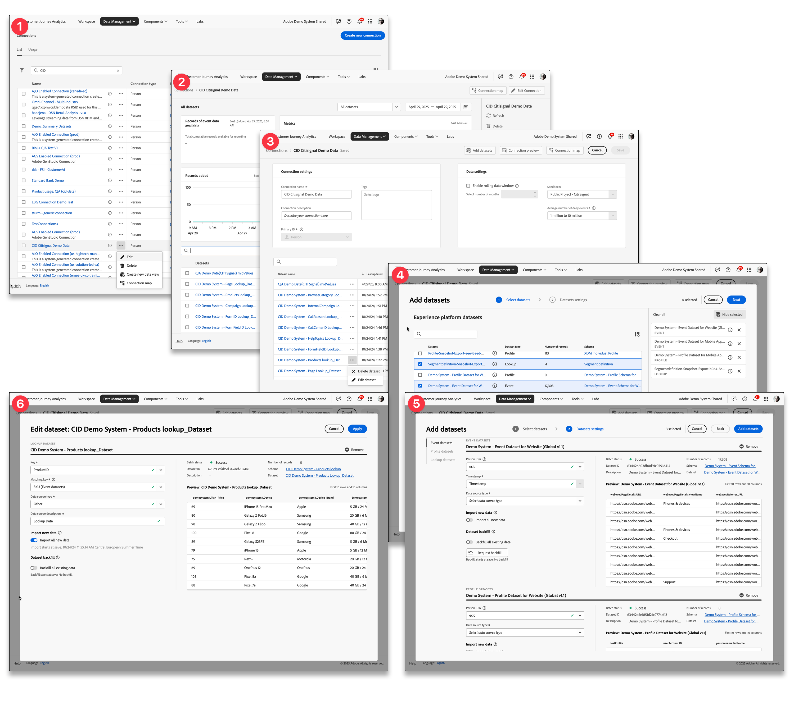

# Présentation des connexions

Les connexions permettent aux administrateurs et administratrices de produits Customer Journey Analytics de définir les sources de données [!DNL  Experience Platform], telles que les jeux de données d’événement, de recherche, de profil et de résumé, qui sont ingérées. Les connexions sont la base de Customer Journey Analytics et déterminent la disponibilité des données (champs) que vous pouvez définir dans une [vue de données](/help/data-views/data-views.md) sous forme de dimension ou de mesures.

>[!IMPORTANT]
>
>Vous pouvez combiner plusieurs jeux de données [!DNL Experience Platform] en une seule connexion.

## Workflow Connexions

>[!BEGINSHADEBOX]

Voir  [Connexion aux sources de données](https://experienceleague.adobe.com/en/docs/customer-journey-analytics-learn/tutorials/connections/connecting-customer-journey-analytics-to-data-sources-in-platform){target="_blank"} pour une vidéo de démonstration.

>[!ENDSHADEBOX]

À un niveau élevé, le workflow Connexions vous permet d’effectuer les opérations suivantes :

| Interface | Description |
|:---:|---|
| ➊ | [Gérez vos connexions et l’utilisation globale](manage-connections.md) de Customer Journey Analytics à partir du gestionnaire de connexions. |
| ➋ | [Inspectez les détails d’une connexion](manage-connections.md#connection-details) tels que les enregistrements de jeux de données ingérés, ignorés ou supprimés. |
| ➌ | [Créez ou modifiez la configuration d’une connexion](create-connection.md#create-or-edit-a-connection) comme une fenêtre de données dynamique, le sandbox à utiliser, les jeux de données qui font partie de la connexion, etc. |
| ➍ | [Ajoutez des jeux de données à une connexion](create-connection.md#add-datasets). Votre connexion doit comporter au moins un jeu de données d’événement ou de résumé, mais peut contenir divers jeux de données d’événement, de profil, de recherche et de résumé. |
| ➎ | [Configurez les paramètres](create-connection.md#dataset-settings) des jeux de données que vous ajoutez. Vous pouvez déterminer comment lier différents jeux de données en fonction d’un identifiant commun basé sur une personne ou sur un compte [!BADGE B2B Edition]{type=Informative url="https://experienceleague.adobe.com/fr/docs/analytics-platform/using/cja-overview/cja-b2b/cja-b2b-edition" newtab=true tooltip="Customer Journey Analytics B2B Edition"}. |
| ➏ | [Modifiez les paramètres d’un jeu de données existant](create-connection.md#edit-a-dataset). Vous pouvez toujours revoir les paramètres du jeu de données ultérieurement. |

## Contrôle d’accès

L’accès à la gestion des connexions doit être limité à un groupe de gestion principal. Les configurations de connexion ont des implications contractuelles concernant les attributions de volume pour les données importées dans Customer Journey Analytics.

>[!MORELIKETHIS]
>
>[Contrôle d’accès](/help/technotes/access-control.md).

