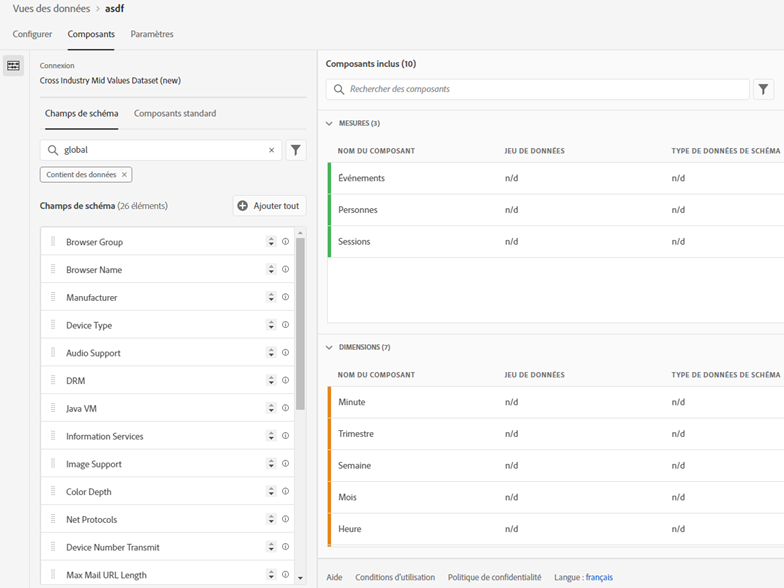
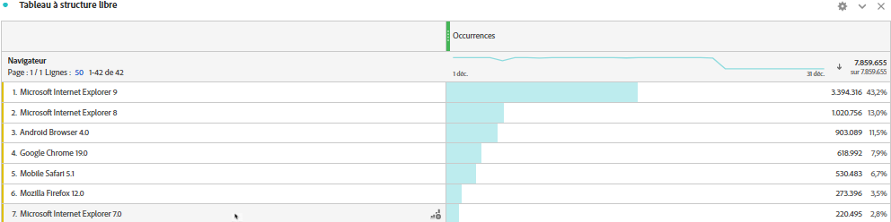

# Ajout de recherches standard à vos jeux de données

>[!IMPORTANT]
>Les recherches standard ne sont disponibles que pour les sources de données Analytics Data Connectors dans CJA. Vous pouvez les utiliser avec des implémentations Adobe Analytics standard, le [SDK Web Adobe Experience Platform](https://experienceleague.adobe.com/docs/experience-platform/edge/home.html?lang=fr) ou les API de collecte de données d’Experience Platform.

Les recherches standard (également appelées recherches fournies par Adobe) améliorent la capacité de Customer Journey Analytics à créer des rapports sur certaines dimensions/attributs qui ne sont pas utiles par elles-mêmes, mais qui le sont lorsqu’elles sont jointes à d’autres données. Il s’agit par exemple des attributs des appareils mobiles et des attributs des dimensions du système d’exploitation et du navigateur, tels que les numéros de version des navigateurs. Une « recherche standard » est similaire à un jeu de données de recherche. Les recherches standard s’appliquent à toutes les organisations Experience Cloud. Elles sont automatiquement appliquées à tous les jeux de données d’événements qui contiennent certains champs de schéma XDM (voir ci-dessous pour les champs spécifiques). Il existe un jeu de données de recherche standard pour chaque emplacement de schéma classifié par Adobe. 

Dans Adobe Analytics traditionnel, ces dimensions s’affichent par elles-mêmes, alors que dans CJA, vous devez les inclure activement lorsque vous créez des vues de données. Dans le workflow Connexions, vous sélectionnez un jeu de données marqué comme étant celui avec une clé pour la recherche standard. L’interface utilisateur des vues de données sait automatiquement inclure toutes les dimensions de recherche standard disponibles pour la création de rapports. Les fichiers de recherche sont automatiquement tenus à jour et disponibles, dans toutes les régions et pour tous les comptes. Ils sont stockés dans des organisations spécifiques à une région associées au client.

## Utiliser des recherches standard avec des jeux de données d’Adobe Data Connector

Les jeux de données de recherche standard sont automatiquement appliqués au moment du rapport. Si vous utilisez Analytics Data Connector et que vous incorporez une dimension pour laquelle Adobe fournit une recherche standard, nous appliquons automatiquement cette recherche standard. Si un jeu de données d’événement contient des champs XDM, nous pouvons lui appliquer des recherches standard.

<!--
### Specific IDs that need to be populated

The following IDs need to be populated in the specific XDM mixins for this functionality to work:

* Environment Details Mixin – device/typeID value populated - Must match Device Atlas IDs and will populate device data.
* Adobe Analytics ExperienceEvent Template Mixin or Adobe Analytics ExperienceEvent Full Extension Mixin with analytics/environment/browserIDStr and analytics/environment/operatingSystemIDStr. Both must match the Adobe IDs and  populate browser and OS data, respectively.

You need these mixins with the three IDs populated (device/typeID, environment/browserIDStr, and environment/operatingSystemIDStr). The lookup dimensions will then be pulled automatically by CJA and will be available in the Data View.

The catch here is that they can only populate those IDs today if they have a direct relationship with Device Atlas. They are Device Atlas IDs, and they provide an API to allow a customer to look them up. This is a significant hurdle, and we may just want to take the reference to this capability out of the product documentation until we have a productized way to expose the Device Atlas ID lookup functionality.
-->

### Champs de recherche standard disponibles

* `browser`
   * `browser`, `group_id`, `id`
* `browser_group`
   * `browser_group`, `id`
* `os`
   * `os`, `group_id`, `id`
* `os_group`
   * `os_group`, `id`
* `mobile_audio_support - multi`
* `mobile_color_depth`
* `mobile_cookie_support`
* `mobile_device_name`
* `mobile_device_number_transmit`
* `mobile_device_type`
* `mobile_drm - multi`
* `mobile_image_support - multi`
* `mobile_information_services`
* `mobile_java_vm - multi`
* `mobile_mail_decoration`
* `mobile_manufacturer`
* `mobile_max_bookmark_url_length`
* `mobile_max_browser_url_length`
* `mobile_max_mail_url_length`
* `mobile_net_protocols - multi`
* `mobile_os`
* `mobile_push_to_talk`
* `mobile_screen_height`
* `mobile_screen_size`
* `mobile_screen_width`
* `mobile_video_support - multi`

## Rapport sur les dimensions de recherche standard

Pour générer des rapports sur les dimensions de recherche standard, vous devez les ajouter lorsque vous créez une vue de données dans Customer Journey Analytics :

Vous pouvez ensuite afficher les données de recherche dans Espace de travail :

