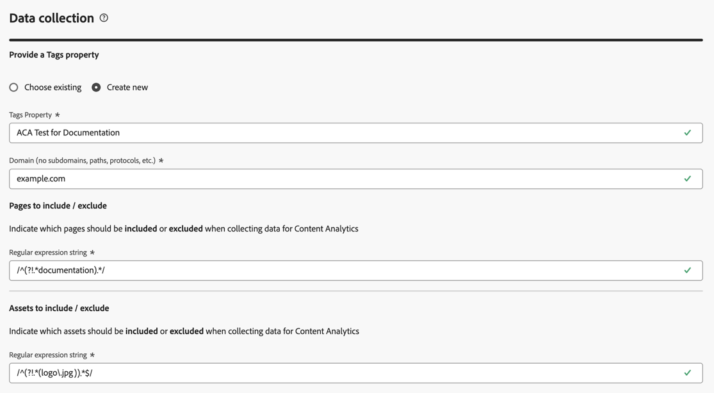

# Configuration guidée de Content Analytics

{{draft-aca}}

{{release-limited-testing}}

La configuration guidée vous permet de configurer rapidement et facilement des analyses de contenu. La configuration guidée utilise un assistant pour définir les exigences afin de configurer Content Analytics automatiquement pour votre organisation. Dans l’écran **[!UICONTROL Configuration]**, vous pouvez créer une configuration ou modifier une configuration existante.

>[!IMPORTANT]
>
>Votre organisation ne peut avoir qu’une seule configuration Content Analytics par sandbox.

Pour accéder à la configuration de Content Analytics

* Sélectionnez **[!UICONTROL Gestion des données]** > **[!UICONTROL Analyse de contenu]** dans le menu principal de Customer Journey Analytics.

Dans l’écran **[!UICONTROL Configurations de Content Analytics]** un tableau des configurations de Content Analytics existantes s’affiche.

Pour chaque configuration, les détails suivants sont disponibles :

| Colonne | Description |
|---|---|
| **[!UICONTROL Nom]** | Nom de la configuration. |
| **[!UICONTROL Créé par]** | Compte technique ayant créé la configuration. |
| **[!UICONTROL Créé le]** | Date et heure de création de la configuration. |
| **[!UICONTROL Modifié le]** | Date et heure de la dernière modification de la configuration. |
| **[!UICONTROL Sandbox]** | Sandbox au sein de l’organisation dans lequel Content Analytics est configuré et implémenté (prévu). |
| **[!UICONTROL Statut]** | Statut de la configuration. Le statut peut être   **[!UICONTROL Draft]** : la configuration est enregistrée pour une utilisation ultérieure et n’est pas déployée.  **[!UICONTROL Failed]** : la configuration a échoué. Vous devez modifier la configuration et apporter les modifications nécessaires.  **[!UICONTROL Complete]** : la configuration est terminée et a été implémentée avec succès. |

Vous pouvez utiliser  pour personnaliser le tableau. Sélectionnez les colonnes à afficher dans la boîte de dialogue **[!UICONTROL Personnaliser le tableau]** et sélectionnez **[!UICONTROL Appliquer]** pour appliquer les modifications.

À partir de l’écran Content Analytics **[!UICONTROL Configuration]**, vous pouvez créer une configuration ou modifier une configuration existante.

Pour créer une configuration :

* Sélectionnez **[!UICONTROL Créer une configuration]**. Cette action ouvre l’[assistant de configuration guidé](#guided-configuration-wizard).

Pour modifier une configuration existante :

* Sélectionnez  puis  **[!UICONTROL Modifier]** pour une configuration Content Analytics existante. Cette action ouvre l’[assistant de configuration guidé](#guided-configuration-wizard).

## Assistant de configuration guidé

L’assistant de configuration guidé se compose de quatre sections ([Détails](#details), [Vue de données](#data-view), [Capture et définition d’expérience](#experience-capture-and-definition) et [Collecte de données](#data-collection)), chacune vous invitant à fournir les détails nécessaires pour configurer correctement Content Analytics. Renseignez chaque section avant de passer à la section suivante, car certains paramètres d’une section peuvent dépendre des valeurs de configuration des sections précédentes.

### Détails {#onboarding-details}

<!-- markdownlint-disable MD034 -->

>[!CONTEXTUALHELP]
>id="aca_onboarding_details_button"
>title="Détails"
>abstract="Fournissez le nom de la connexion. Les sections **[!UICONTROL Vue de données]**, **[!UICONTROL Capture et définition d’expérience]** et **[!UICONTROL Collecte de données]** permettent de fournir plus de détails pour configurer correctement l’analyse du contenu."

>[!CONTEXTUALHELP]
>id="aca_onboarding_details_name_header"
>title="Détails"
>abstract="Ce guide définit les exigences requises pour configurer Content Analytics. Attribuez un nom à cette configuration."

<!-- markdownlint-enable MD034 -->

Chaque configuration nécessite un nom unique. Par exemple : `Example Content Analytics configuration`. Le nom est requis pour enregistrer ou implémenter une configuration.

### Vue de données {#onboarding-data-view}

<!-- markdownlint-disable MD034 -->

>[!CONTEXTUALHELP]
>id="ac_onboarding_dataview_button"
>title="Vue de données"
>abstract="Pour la configuration de Content Analytics, vous devez sélectionner une vue de données existante. Vous pouvez donc fusionner vos données d’analyse de contenu avec d’autres données."

>[!CONTEXTUALHELP]
>id="aca_onboarding_dataview_header"
>title="Vue de données"
>abstract="Dans Customer Journey Analytics, sélectionnez une vue de données existante avec laquelle fusionner vos données d’analyse de contenu."

>[!CONTEXTUALHELP]
>id="aca_onboarding_dataview_header_alt"
>title="Vue de données"
>abstract="Dans Customer Journey Analytics, sélectionnez une vue de données existante avec laquelle fusionner vos données d’analyse de contenu. "

>[!CONTEXTUALHELP]
>id="aca_onboarding_dataview_change_dialog"
>title="Nouvelle vue de données"
>abstract="La sélection d’une nouvelle vue de données entraîne une mise à jour de cette vue de données afin d’inclure les mesures et dimensions Content Analytics. Si nécessaire, la connexion associée est également mise à jour pour inclure les jeux de données d’analyse du contenu. La connexion et la vue de données actuellement configurées pour l’analyse du contenu ne sont pas modifiées."

>[!CONTEXTUALHELP]
>id="aca_onboarding_dataview_current_cleanup_labels_dialog"
>title="Nettoyer la vue de données sélectionnée"
>abstract="Vous avez sélectionné une vue de données déjà configurée pour Content Analytics. Cette configuration Content Analytics existante est supprimée et la vue de données est configurée avec votre nouvelle configuration."

>[!CONTEXTUALHELP]
>id="aca_onboarding_dataview_prev_cleanup_labels_dialog"
>title="Nettoyer la vue de données précédente"
>abstract="Vous avez sélectionné une nouvelle vue de données. La configuration Content Analytics de la vue de données sélectionnée précédente est supprimée."

<!-- markdownlint-enable MD034 -->

Votre configuration nécessite la sélection d’une [Vue de données](/help/data-views/data-views.md).

1. Sélectionner une vue de données

   * Pour sélectionner une nouvelle vue de données pour une configuration, utilisez  **[!UICONTROL Sélectionner la vue de données]**.

     

   * Pour modifier une vue de données pour une configuration, sélectionnez  **[!UICONTROL Modifier]**.

     

   Dans les deux scénarios, une boîte de dialogue **[!UICONTROL Vue de données]** s’affiche, dans laquelle vous pouvez sélectionner une vue de données pour votre configuration.

   

   Pour une nouvelle configuration, la liste affiche uniquement les vues de données associées aux sandbox qui n’ont pas de configuration principale.

   Si vous modifiez une configuration existante, la liste affiche uniquement les vues de données disponibles dans le sandbox déjà associé à la configuration existante.

   Vous pouvez effectuer les actions suivantes :

   * Pour rechercher une vue de données spécifique, utilisez le champ .
   * Pour filtrer la liste des vues de données disponibles, sélectionnez . Vous pouvez filtrer la liste sur [!UICONTROL Connexion], [!UICONTROL Propriétaire] et [!UICONTROL Sandbox]. Utilisez  **[!UICONTROL Masquer les filtres]** pour masquer le volet de filtrage.
   * Pour définir les colonnes à afficher dans le tableau, sélectionnez . Sélectionnez les colonnes à afficher dans la boîte de dialogue **[!UICONTROL Personnaliser le tableau]** et sélectionnez **[!UICONTROL Appliquer]** pour appliquer les modifications.

1. Sélectionnez  la vue de données que vous souhaitez utiliser.
1. Sélectionnez **[!UICONTROL Enregistrer]** pour confirmer la vue de données sélectionnée. Sélectionnez **[!UICONTROL Annuler]** pour annuler.

Dans Customer Journey Analytics, une vue de données est liée à une Customer Journey Analytics [Connexion](/help/connections/overview.md). Et une connexion est basée sur un sandbox au sein de votre organisation. Une fois la configuration enregistrée, la variable **[!UICONTROL Sandbox]** est automatiquement renseignée avec le nom du sandbox, en fonction de la vue de données sélectionnée.

### Capture et définition de l’expérience {#onboarding-experiences}

<!-- markdownlint-disable MD034 -->

>[!CONTEXTUALHELP]
>id="aca_onboarding_experiences_button"
>title="Capture et définition de l’expérience"
>abstract="Vous pouvez choisir d’inclure des expériences dans les données que vous collectez avec l’analyse du contenu. Lorsque cette option est sélectionnée, vous devez définir une ou plusieurs combinaisons d’expression régulière et de paramètres de requête pour définir les URL pour lesquelles inclure des expériences."

>[!CONTEXTUALHELP]
>id="aca_onboarding_experiences_header"
>title="Capture et définition de l’expérience"
>abstract="Collecter des expériences dans l’analyse du contenu"

>[!CONTEXTUALHELP]
>id="aca_onboarding_experiences_parameters_header"
>title="Capture et définition de l’expérience"
>abstract="Spécifiez les paramètres qui déterminent le rendu du contenu sur votre site web."

>[!CONTEXTUALHELP]
>id="aca_onboarding_experiencecapture_edit_button"
>title="Capture et définition de l’expérience"
>abstract="Vous pouvez modifier les paramètres de l’extension Adobe Content Analytics dans la propriété Tags associée à la configuration actuelle."

<!-- markdownlint-enable MD034 -->

Dans cette section, vous pouvez choisir d’inclure des expériences dans les données que vous collectez avec Content Analytics.  Une expérience correspond à tout le texte d’une page web qui est reproductible à l’aide de l’URL utilisée par l’utilisateur initial qui visite cette page web.

Par défaut, l’option **[!UICONTROL Inclure les expériences]** est désactivée. Lorsque cette option est sélectionnée, vous devez définir les URL pour lesquelles vous souhaitez inclure des expériences.

N’envisagez d’inclure des expériences que lorsque les conditions suivantes s’appliquent :

* Vous pouvez accéder au contenu du site à l’aide d’URL publiques uniquement. L&#39;accès au site ne nécessite pas de jetons personnalisés, de cookies ou d&#39;autres mécanismes non disponibles via l&#39;URL.
* Les pages du site doivent être reproductibles à l’aide de l’URL de la page.

Pour inclure des expériences dans une configuration nouvelle ou non implémentée :

1. Activez **[!UICONTROL Inclure des expériences]**.
1. Facultatif. spécifiez les paramètres de rendu du contenu sur votre site web. Les paramètres consistent en zéro ou plusieurs combinaisons d’une **[!UICONTROL Expression régulière du domaine]** et **[!UICONTROL Paramètres de requête]**.
   1. Saisissez une **[!UICONTROL Expression régulière du domaine]** par exemple `/^(?!.*\b(store|help|admin)\b)/`. Veillez à ajouter une séquence d’échappement aux expressions régulières à l’aide de `/`.
   1. Spécifiez une liste de paramètres de requête séparés par des virgules **[!UICONTROL par exemple]** `outdoors, patio, kitchen`.
1. Sélectionnez **[!UICONTROL Supprimer]** si vous souhaitez supprimer une combinaison de paramètres d’expression régulière de domaine et de requête.
1. Sélectionnez **[!UICONTROL Ajouter une expression régulière]** si vous souhaitez ajouter une autre combinaison d’une expression régulière et de paramètres de requête.

Pour modifier des expériences existantes ou en inclure de nouvelles dans une configuration implémentée :

* Sélectionnez  **[!UICONTROL Modifier]** pour modifier la configuration de la collecte d’expériences dans Content Analytics. Vous êtes redirigé vers l’extension [Adobe Content Analytics](https://experienceleague.adobe.com/en/docs/experience-platform/tags/extensions/client/content-analytics/overview#configure-event-filtering) dans la propriété Tags associée à la configuration actuelle.

### Collecte de données {#onboarding-data-collection}

Dans cette section, vous allez configurer comment collecter vos données d’analyse de contenu.

<!-- markdownlint-disable MD034 -->

>[!CONTEXTUALHELP]
>id="aca_onboarding_datacollection_button"
>title="Collecte de données"
>abstract="Définissez la propriété Tags à utiliser ou créez-en une. Définissez également les pages et les ressources à inclure ou à exclure à l’aide d’expressions régulières."

>[!CONTEXTUALHELP]
>id="aca_onboarding_datacollection_tag_header"
>title="Collecte de données"
>abstract="**Fournissez une propriété Tags**"

>[!CONTEXTUALHELP]
>id="aca_onboarding_datacollection_pages_excluded_boldheader"
>title="Collecte de données"
>abstract="**Pages à inclure/exclure**"

>[!CONTEXTUALHELP]
>id="aca_onboarding_datacollection_pages_excluded_header"
>title="Collecte de données"
>abstract="Indiquer les pages à **inclure** ou **exclure** lors de la collecte de données pour l’analyse du contenu"

>[!CONTEXTUALHELP]
>id="aca_onboarding_datacollection_assets_excluded_boldheader"
>title="Collecte de données"
>abstract="**Actifs à inclure/exclure**"

>[!CONTEXTUALHELP]
>id="aca_onboarding_datacollection_assets_excluded_header"
>title="Collecte de données"
>abstract="Indiquer les ressources à **inclure** ou **exclure** lors de la collecte de données pour l’analyse du contenu"

>[!CONTEXTUALHELP]
>id="aca_onboarding_datacollection_experiences_edit_button"
>title="Collecte de données"
>abstract="Vous pouvez modifier les paramètres des pages de l’extension Adobe Content Analytics dans la propriété Tags associée à la configuration actuelle."

>[!CONTEXTUALHELP]
>id="aca_onboarding_datacollection_assets_edit_button"
>title="Collecte de données"
>abstract="Vous pouvez modifier les paramètres des ressources de l’extension Adobe Content Analytics dans la propriété Tags associée à la configuration actuelle."

<!-- markdownlint-enable MD034 -->

#### Nouvelle configuration {#new-configuration}

Dans une nouvelle configuration, vous devez définir si vous souhaitez utiliser une propriété Tags existante ou créer une propriété Tags. Vous devez également définir les pages et les ressources à inclure ou à exclure à l’aide d’expressions régulières.

* Pour utiliser une propriété Tags existante, procédez comme suit :

  

   1. Sélectionnez **[!UICONTROL Choisir existant]**.
   2. Sélectionnez une propriété existante dans le menu déroulant **[!UICONTROL Propriété des balises]**. Vous pouvez commencer à saisir pour rechercher et limiter les options disponibles.

* Pour créer une propriété Tags :

  

   1. Sélectionnez **[!UICONTROL Créer]**.
   1. Spécifiez un **[!UICONTROL Nom des balises]** par exemple `ACA Test for Documentation`.
   1. Spécifiez **[!UICONTROL Domaines]** par exemple, `example.com`.

* Si vous avez choisi d’inclure des expériences, indiquez quelles pages doivent être incluses ou exclues lors de la collecte de données pour Content Analytics.

   * Spécifiez une chaîne d’expression régulière pour **[!UICONTROL Pages à inclure/exclure]**. Par exemple : `/^(?!.*documentation).*/` pour exclure toutes les pages de documentation de Content Analytics. Veillez à ajouter une séquence d’échappement aux expressions régulières à l’aide de `/`.

* Indiquez quelles ressources doivent être incluses ou exclues lors de la collecte de données pour Content Analytics.

   * Spécifiez une chaîne d’expression régulière à inclure/exclure dans **[!UICONTROL Assets]**. Par exemple : `/^(?!.*(logo\.jpg|\.svg)).*$/` d’exclure toutes les images JPEG et SVG de logo de Content Analytics. Veillez à ajouter une séquence d’échappement aux expressions régulières à l’aide de `/`.

#### Configuration existante {#existing-configuration}

Pour une configuration existante, vous ne pouvez pas modifier la propriété Tags. Vous pouvez toutefois modifier les pages et les ressources à inclure ou à exclure.

* Pour modifier les pages à inclure ou à exclure lors de la collecte de données pour Content Analytics, sélectionnez  **[!UICONTROL Modifier]** sous **[!UICONTROL Experience]**. Vous êtes redirigé vers l’extension [Adobe Content Analytics](https://experienceleague.adobe.com/en/docs/experience-platform/tags/extensions/client/content-analytics/overview#configure-event-filtering) associée à la propriété Tags pour la configuration Content Analytics actuelle. Vous pouvez modifier l’expression régulière pour inclure ou exclure des pages. Veillez à [publier](manual.md#publish) vos modifications.

* Pour modifier les ressources à inclure ou à exclure lors de la collecte de données pour Content Analytics, sélectionnez  **[!UICONTROL Modifier]** sous **[!UICONTROL Ressource]**. Vous êtes redirigé vers l’extension [Adobe Content Analytics](https://experienceleague.adobe.com/en/docs/experience-platform/tags/extensions/client/content-analytics/overview#configure-event-filtering) associée à la propriété Tags pour la configuration Content Analytics actuelle. Vous pouvez modifier l’expression régulière pour inclure ou exclure des ressources. Veillez à [publier](manual.md#publish) vos modifications.

### Résumé {#summary}

Une fois que vous avez fourni tous les détails nécessaires, un résumé fournit des détails sur les artefacts créés ou modifiés.

* Un résumé **[!UICONTROL Vous êtes presque prêt à implémenter _nom de configuration_ pour Content Analytics]** s’affiche lorsque vous implémentez une nouvelle configuration.

* Pour les configurations existantes implémentées, un résumé **[!UICONTROL Vous avez implémenté _nom de configuration_ s’affiche pour Content Analytics]**.

### Actions {#actions}

<!-- markdownlint-disable MD034 -->

>[!CONTEXTUALHELP]
>id="aca_onboarding_implementation_warning_dialog"
>title="Confirmation d’implémentation"
>abstract="Si vous sélectionnez **[!UICONTROL Implémenter]**, vous configurerez l’analyse du contenu en fonction des entrées que vous avez fournies dans ce workflow. Plusieurs paramètres sont choisis par défaut en fonction de ce qui est généralement utile pour Content Analytics, mais vous (en tant que contrôleur de données) devez examiner les paramètres de chaque artefact pour confirmer que les paramètres sont mis en œuvre conformément à votre politique de confidentialité, à vos droits et obligations contractuels et aux exigences de consentement en vertu de la loi applicable.  Notez qu’aucune donnée ne sera collectée tant que la bibliothèque de balises associée à cette configuration ne sera pas publiée manuellement.  Afin d’obtenir les attributs des images et du texte, Adobe récupère les attributs à l’aide des éléments suivants :<ol><li>l’URL, capturée au moment de la visite du site de l’utilisateur, en fonction des paramètres de collecte de données que vous avez configurés ; et</li><li>l’URL où l’image est hébergée.</li></ol>Vous ne devez pas baliser les images hébergées sur des sites tiers."

<!-- markdownlint-enable MD034 -->

Lorsque vous avez créé ou modifié une configuration, les actions suivantes sont disponibles.

* **[!UICONTROL Ignorer]** : toutes les modifications apportées dans le cadre de la création d’une configuration ou de la modification d’une configuration existante sont ignorées.
* **[!UICONTROL Enregistrer pour plus tard]** : les modifications apportées à une nouvelle configuration ou à une configuration existante non encore implémentée sont enregistrées. Vous pouvez revoir la configuration ultérieurement pour apporter d’autres modifications ou implémenter la configuration.
* **[!UICONTROL Implémentation]** : les paramètres ou les modifications apportées à une nouvelle configuration ou à une configuration existante non encore implémentée sont enregistrés et implémentés. La mise en œuvre comprend les éléments suivants :

   * Configuration de **[!UICONTROL Customer Journey Analytics]** :
      * La vue de données sélectionnée est mise à jour pour inclure la dimension et les mesures Content Analytics.
      * La connexion liée à la vue de données sélectionnée est modifiée pour inclure les jeux de données d’événements et d’attributs Content Analytics.
      * Un modèle de rapport Content Analytics est ajouté à Workspace.

+++ Détails

     Des détails sont fournis pour les scénarios suivants :

      * La propriété **Tags** existe **✓** ou n’existe pas **✕**.
      * L’extension **Web SDK** de la propriété Tags existe **✓** ou n’existe pas **✕**.
      * L’extension Adobe **Content Analytics** pour la propriété Tag existe **✓** ou n’existe pas **✕**.

     <table style="table-layout:fixed">
      <tr>
        <th></th>
        <th colspan="4">Scénarios :</th>
      </tr>
      <tr>
        <th>
          <strong>Paramètre</strong>
        </th>
        <th>
          <strong>✓ Tags ✓ Web SDK ✓ Content Analytics</strong>
        </th>
        <th>
          <strong>✓ Tags ✓ Web SDK ✕ Content Analytics</strong>
        </th>
        <th>
          <strong>✓Tags ✕ Web SDK ✕ Content Analytics</strong>
        </th>
        <th>
          <strong>✕ Tags ✕ Web SDK ✕ Content Analytics</strong>
        </th>
      </tr>
      <tbody>
        <tr>
          <td>Modèle de rapport</td>
          <td colspan="4">Un modèle de rapport est disponible</td>
        </tr>
        <tr>
          <td>Vue de données</td>
          <td colspan="4">Modifié/créé pour avoir des dimensions et des mesures ACA</td>
        </tr>
        <tr>
          <td>Connexion</td>
          <td colspan="4">Modification pour inclure des jeux de données ACA (événements ACA, attributs de ressource, attribut d’expérience)</td>
        </tr>
      </tbody>
    </table>

+++

   * Configuration de **[!UICONTROL Adobe Experience Platform]** :
      * Création de schémas pour modéliser les événements Content Analytics, les attributs de ressource et les attributs d’expérience (s’ils sont configurés).
      * Création de jeux de données pour collecter les événements Content Analytics, les attributs de ressource et les attributs d’expérience (s’ils sont configurés).
      * Création d’un flux de données qui utilise le service de fonctionnalité pour générer et mettre à jour des attributs de contenu à partir d’événements Content Analytics.

+++ Détails

     Des détails sont fournis pour les scénarios suivants :

      * La propriété **Tags** existe **✓** ou n’existe pas **✕**.
      * L’extension **Web SDK** de la propriété Tags existe **✓** ou n’existe pas **✕**.
      * L’extension Adobe **Content Analytics** pour la propriété Tag existe **✓** ou n’existe pas **✕**.

     <table style="table-layout:fixed">
      <tr>
        <th></th>
        <th colspan="4">Scénarios :</th>
      </tr>
      <tr>
        <th>
          <strong>Paramètre</strong>
        </th>
        <th>
          <strong>✓ Tags ✓ Web SDK ✓ Content Analytics</strong>
        </th>
        <th>
          <strong>✓ Tags ✓ Web SDK ✕ Content Analytics</strong>
        </th>
        <th>
          <strong>✓Tags ✕ Web SDK ✕ Content Analytics</strong>
        </th>
        <th>
          <strong>✕ Tags ✕ Web SDK ✕ Content Analytics</strong>
        </th>
      </tr>
      <tbody>
        <tr>
          <td colspan="5"><strong> Schéma des événements Content Analytics</strong></td>
        </tr>
        <tr>
          <td style="margin-left: 160.0px;">Nom</td>
          <td>Événements Content Analytics</td>
          <td>Événements Content Analytics</td>
          <td>Événements Content Analytics</td>
          <td>Événements Content Analytics</td>
        </tr>
        <tr>
          <td>Description</td>
          <td><i>à déterminer d'avance</i></td>
          <td><i>à déterminer d'avance</i></td>
          <td><i>à déterminer d'avance</i></td>
          <td><i>à déterminer d'avance</i></td>
        </tr>
        <tr>
          <td>Profil activé</td>
          <td>Non</td>
          <td>Non</td>
          <td>Non</td>
          <td>Non</td>
        </tr>
        <tr>
          <td colspan="5"><strong> Jeu de données d’événements Content Analytics</strong></td>
        </tr>
        <tr>
          <td>Nom</td>
          <td>Événements Content Analytics</td>
          <td>Événements Content Analytics</td>
          <td>Événements Content Analytics</td>
          <td>Événements Content Analytics</td>
        </tr>
        <tr>
          <td>Schéma</td>
          <td>Événement Content Analytics</td>
          <td>Événement Content Analytics</td>
          <td>Événement Content Analytics</td>
          <td>Événement Content Analytics</td>
        </tr>
        <tr>
          <td>Description</td>
          <td><i>à déterminer d'avance</i></td>
          <td><i>à déterminer d'avance</i></td>
          <td><i>à déterminer d'avance</i></td>
          <td><i>à déterminer d'avance</i></td>
        </tr>
        <tr>
          <td>Balises</td>
          <td><i>vide ?</i></td>
          <td><i>vide ?</i></td>
          <td><i>vide ?</i></td>
          <td><i>vide ?</i></td>
        </tr>
        <tr>
          <td>Jeu de données système</td>
          <td>?</td>
          <td>?</td>
          <td>?</td>
          <td>?</td>
        </tr>
        <tr>
          <td>Profil activé</td>
          <td>Non</td>
          <td>Non</td>
          <td>Non</td>
          <td>Non</td>
        </tr>
        <tr>
          <td>Gouvernance des données (libellés DULE)</td>
          <td>?</td>
          <td>?</td>
          <td>?</td>
          <td>?</td>
        </tr>
        <tr>
          <td colspan="5"><strong> Schéma Attributs de ressource Content Analytics</strong></td>
        </tr>
        <tr>
          <td>Nom</td>
          <td>Attributs de ressource Content Analytics</td>
          <td>Attributs de ressource Content Analytics</td>
          <td>Attributs de ressource Content Analytics</td>
          <td>Attributs de ressource Content Analytics</td>
        </tr>
        <tr>
          <td>Description</td>
          <td><i>à déterminer d'avance</i></td>
          <td><i>à déterminer d'avance</i></td>
          <td><i>à déterminer d'avance</i></td>
          <td><i>à déterminer d'avance</i></td>
        </tr>
        <tr>
          <td>Profil activé</td>
          <td>Non</td>
          <td>Non</td>
          <td>Non</td>
          <td>Non</td>
        </tr>
        <tr>
          <td colspan="5"><strong> Jeu de données d’attributs Content Analytics Assets</strong></td>
        </tr>
        <tr>
          <td>Nom</td>
          <td>Attributs de ressource Content Analytics</td>
          <td>Attributs de ressource Content Analytics</td>
          <td>Attributs de ressource Content Analytics</td>
          <td>Attributs de ressource Content Analytics</td>
        </tr>
        <tr>
          <td>Schéma</td>
          <td>Attributs de ressource Content Analytics</td>
          <td>Attributs de ressource Content Analytics</td>
          <td>Attributs de ressource Content Analytics</td>
          <td>Attributs de ressource Content Analytics</td>
        </tr>
        <tr>
          <td>Description</td>
          <td><i>à déterminer d'avance</i></td>
          <td><i>à déterminer d'avance</i></td>
          <td><i>à déterminer d'avance</i></td>
          <td><i>à déterminer d'avance</i></td>
        </tr>
        <tr>
          <td>Balises</td>
          <td><i>vide ?</i></td>
          <td><i>vide ?</i></td>
          <td><i>vide ?</i></td>
          <td><i>vide ?</i></td>
        </tr>
        <tr>
          <td>Jeu de données système</td>
          <td>?</td>
          <td>?</td>
          <td>?</td>
          <td>?</td>
        </tr>
        <tr>
          <td>Profil activé</td>
          <td>Non</td>
          <td>Non</td>
          <td>Non</td>
          <td>Non</td>
        </tr>
        <tr>
          <td>Gouvernance des données (libellés DULE)</td>
          <td>?</td>
          <td>?</td>
          <td>?</td>
          <td>?</td>
        </tr>
        <tr>
          <td colspan="5"><strong> Schéma Attributs d’expérience Content Analytics</strong></td>
        </tr>
        <tr>
          <td>Nom</td>
          <td>Attributs d’expérience Content Analytics</td>
          <td>Attributs d’expérience Content Analytics</td>
          <td>Attributs d’expérience Content Analytics</td>
          <td>Attributs d’expérience Content Analytics</td>
        </tr>
        <tr>
          <td>Description</td>
          <td><i>à déterminer d'avance</i></td>
          <td><i>à déterminer d'avance</i></td>
          <td><i>à déterminer d'avance</i></td>
          <td><i>à déterminer d'avance</i></td>
        </tr>
        <tr>
          <td>Profil activé</td>
          <td>Non</td>
          <td>Non</td>
          <td>Non</td>
          <td>Non</td>
        </tr>
        <tr>
          <td colspan="5"><strong> Jeu de données d’attributs d’expérience Content Analytics</strong></td>
        </tr>
        <tr>
          <td>Nom</td>
          <td>Attributs d’expérience Content Analytics</td>
          <td>Attributs d’expérience Content Analytics</td>
          <td>Attributs d’expérience Content Analytics</td>
          <td>Attributs d’expérience Content Analytics</td>
        </tr>
        <tr>
          <td>Schéma</td>
          <td>Attributs d’expérience Content Analytics</td>
          <td>Attributs d’expérience Content Analytics</td>
          <td>Attributs d’expérience Content Analytics</td>
          <td>Attributs d’expérience Content Analytics</td>
        </tr>
        <tr>
          <td>Description</td>
          <td><i>à déterminer d'avance</i></td>
          <td><i>à déterminer d'avance</i></td>
          <td><i>à déterminer d'avance</i></td>
          <td><i>à déterminer d'avance</i></td>
        </tr>
        <tr>
          <td>Balises</td>
          <td><i>vide ?</i></td>
          <td><i>vide ?</i></td>
          <td><i>vide ?</i></td>
          <td><i>vide ?</i></td>
        </tr>
        <tr>
          <td>Jeu de données système</td>
          <td>?</td>
          <td>?</td>
          <td>?</td>
          <td>?</td>
        </tr>
        <tr>
          <td>Profil activé</td>
          <td>Non</td>
          <td>Non</td>
          <td>Non</td>
          <td>Non</td>
        </tr>
        <tr>
          <td>Gouvernance des données (libellés DULE)</td>
          <td>?</td>
          <td>?</td>
          <td>?</td>
          <td>?</td>
        </tr>
      </tbody>
    </table>

+++

   * Configuration **[!UICONTROL collecte de données]** :
      * La propriété Tags nouvelle ou existante est configurée pour prendre en charge la collecte de données Content Analytics. Cette configuration implique l’inclusion de l’extension Adobe Content Analytics pour les balises.
      * Un flux de données est créé pour les événements Content Analytics.
      * L’extension Adobe Content Analytics est configurée pour s’assurer que les événements Content Analytics sont envoyés au flux de données pour Content Analytics.
      * Si le SDK Web n’est pas configuré pour la propriété Tags, une nouvelle configuration de SDK Web est créée pour envoyer uniquement les événements Content Analytics.
      * Si Web SDK est configuré pour cette propriété Tags, aucune modification n’est apportée à la configuration Web SDK existante.

+++ Détails

     Des détails sont fournis pour les scénarios suivants :

      * La propriété **Tags** existe **✓** ou n’existe pas **✕**.
      * L’extension **Web SDK** de la propriété Tags existe **✓** ou n’existe pas **✕**.
      * L’extension Adobe **Content Analytics** pour la propriété Tag existe **✓** ou n’existe pas **✕**.

     <table style="table-layout:fixed">
      <tr>
        <th></th>
        <th colspan="4">Scénarios :</th>
      </tr>
      <tr>
        <th>
          <strong>Paramètre</strong>
        </th>
        <th>
          <strong>✓ Tags ✓ Web SDK ✓ Content Analytics</strong>
        </th>
        <th>
          <strong>✓ Tags ✓ Web SDK ✕ Content Analytics</strong>
        </th>
        <th>
          <strong>✓Tags ✕ Web SDK ✕ Content Analytics</strong>
        </th>
        <th>
          <strong>✕ Tags ✕ Web SDK ✕ Content Analytics</strong>
        </th>
      </tr>
      <tbody>
        <tr>
          <td colspan="5"><strong> Train de données</strong></td>
        </tr>
        <tr>
          <td>Nom</td>
          <td><i>valeur existante</i></td>
          <td>Analyse du contenu</td>
          <td>Analyse du contenu</td>
          <td>Analyse du contenu</td>
        </tr>
        <tr>
          <td>Description</td>
          <td><i>valeur existante</i></td>
          <td><i>prédéterminé</i></td>
          <td><i>prédéterminé</i></td>
          <td><i>prédéterminé</i></td>
        </tr>
        <tr>
          <td>Schéma de mapping</td>
          <td><i>valeur existante</i></td>
          <td><i>prédéterminé</i></td>
          <td><i>prédéterminé</i></td>
          <td><i>prédéterminé</i></td>
        </tr>
        <tr>
          <td>Géolocalisation et recherche réseau</td>
          <td><i>valeurs existantes</i></td>
          <td>Toutes les options désactivées</td>
          <td>Toutes les options désactivées</td>
          <td>Toutes les options désactivées</td>
        </tr>
        <tr>
          <td>Recherche d’appareil</td>
          <td><i>valeur existante</i></td>
          <td>Ne pas collecter d’informations sur les appareils</td>
          <td>Ne pas collecter d’informations sur les appareils</td>
          <td>Ne pas collecter d’informations sur les appareils</td>
        </tr>
        <tr>
          <td>Obscurcissement d’IP</td>
          <td><i>valeur existante</i></td>
          <td>Aucun</td>
          <td>Aucun</td>
          <td>Aucun</td>
        </tr>
        <tr>
          <td>Cookie interne d’identifiant</td>
          <td><i>valeur existante</i></td>
          <td>Off</td>
          <td>Off</td>
          <td>Off</td>
        </tr>
        <tr>
          <td>Synchronisation des identifiants tiers</td>
          <td><i>valeur existante</i></td>
          <td>Off</td>
          <td>Off</td>
          <td>Off</td>
        </tr>
        <tr>
          <td>Type d’accès</td>
          <td><i>valeur existante</i></td>
          <td>Authentification mixte</td>
          <td>Authentification mixte</td>
          <td>Authentification mixte</td>
        </tr>
        <tr>
          <td>Media Analytics</td>
          <td><i>valeur existante</i></td>
          <td>Off</td>
          <td>Off</td>
          <td>Off</td>
        </tr>
            <tr>
          <td>Détection de robots</td>
          <td><i>valeur existante</i></td>
          <td>Off</td>
          <td>Off</td>
          <td>Off</td>
        </tr>
        <tr>
          <td>Mappage</td>
          <td><i>valeur existante</i></td>
          <td><i>fourni par l’utilisateur</i></td>
          <td><i>fourni par l’utilisateur</i></td>
          <td><i>fourni par l’utilisateur</i></td>
        </tr>
        <tr>
          <td colspan="5"><strong> Propriété Tags</strong> Propriété existante ou nouvelle propriété. Le nom et le domaine sont fournis par l’utilisateur.</td>
        </tr>
        <tr>
          <td>Nom</td>
          <td><i>valeur existante</i></td>
          <td><i>valeur existante</i></td>
          <td><i>valeur existante</i></td>
          <td><i>fourni par l’utilisateur</i> (Content Analytics par défaut)</td>
        </tr>
        <tr>
          <td>Domaine</td>
          <td><i>valeur existante</i></td>
          <td><i>valeur existante</i></td>
          <td><i>valeur existante</i></td>
          <td ><i>prédéterminé</i></td>
        </tr>
        <tr>
          <td colspan="5"><strong> Bibliothèque de balises</strong></td>
        </tr>
        <tr>
          <td>Nom</td>
          <td><i>valeur existante</i></td>
          <td><i>valeur existante</i></td>
          <td><i>valeur existante</i></td>
          <td>
             
          </td>
        </tr>
        <tr>
          <td colspan="5"><strong> Extension Web SDK</strong></td>
        </tr>
        <tr>
          <td>Nom</td>
          <td><i>valeur existante</i></td>
          <td><i>valeur existante</i></td>
          <td>Content Analytics - Web SDK</td>
          <td>Content Analytics - Web SDK</td>
        </tr>
        <tr>
          <td>Organisation IMS</td>
          <td><i>renseigné automatiquement</i></td>
          <td><i>renseigné automatiquement</i></td>
          <td><i>renseigné automatiquement</i></td>
          <td><i>renseigné automatiquement</i></td>
        </tr>
        <tr>
          <td>Domaine Edge</td>
          <td><i>valeur existante   peut nécessiter une mise à jour pour correspondre à l’implémentation d’AppMeasurement</i></td>
          <td><i>valeur existante   peut nécessiter une mise à jour pour correspondre à l’implémentation d’AppMeasurement</i></td>
          <td>
            <a href="http://edge.adobedc.net">edge.adobedc.net</a>
          </td>
          <td>
            <a href="http://edge.adobedc.net">edge.adobedc.net</a>
          </td>
        </tr>
        <tr>
          <td colspan="5"><strong> Trains de données</strong></td>
        </tr>
        <tr>
          <td>Production</td>
          <td><i>valeur existante remplacement de flux de données utilisé pour envoyer à un autre flux de données</i></td>
          <td><i>valeur existante remplacement de flux de données utilisé pour envoyer à un autre flux de données</i></td>
          <td><i>utilisateur fourni</i> ?</td>
          <td><i>utilisateur fourni</i> ?</td>
        </tr>
        <tr>
          <td>Évaluation</td>
          <td><i>valeur existante remplacement de flux de données utilisé pour envoyer à un autre flux de données</i></td>
          <td><i>valeur existante remplacement de flux de données utilisé pour envoyer à un autre flux de données</i></td>
          <td><i>utilisateur fourni</i> ?</td>
          <td><i>utilisateur fourni</i> ?</td>
        </tr>
        <tr>
          <td>Développement</td>
          <td><i>valeur existante remplacement de flux de données utilisé pour envoyer à un autre flux de données</i></td>
          <td><i>valeur existante remplacement de flux de données utilisé pour envoyer à un autre flux de données</i></td>
          <td><i>utilisateur fourni</i> ?</td>
          <td><i>utilisateur fourni</i> ?</td>
        </tr>
        <tr>
          <td>Confidentialité   </td>
          <td><i>valeur existante</i></td>
          <td><i>valeur existante</i></td>
          <td>Dans ?</td>
          <td>Dans ?</td>
        </tr>
        <tr>
          <td colspan="5"><strong> Identité</strong></td>
        </tr>
        <tr>
          <td>Migrer l’ECID</td>
          <td><i>valeur existante</i></td>
          <td><i>valeur existante</i></td>
          <td>Vérifié</td>
          <td>Vérifié</td>
        </tr>
        <tr>
          <td>Utiliser des cookies tiers</td>
          <td><i>valeur existante</i></td>
          <td><i>valeur existante</i></td>
          <td>Vérifié</td>
          <td>Vérifié</td>
        </tr>
        <tr>
          <td colspan="5"><strong> Personnalisation</strong></td>
        </tr>
        <tr>
          <td>Migration de Target d’at.js vers Web SDK</td>
          <td><i>valeur existante</i></td>
          <td><i>valeur existante</i></td>
          <td>Non coché</td>
          <td>Non coché</td>
        </tr>
        <tr>
          <td>Activer le stockage de la personnalisation</td>
          <td><i>valeur existante</i></td>
          <td><i>valeur existante</i></td>
          <td>Non coché</td>
          <td>Non coché</td>
        </tr>
        <tr>
          <td>Collecte des clics automatiques pour Adobe Journey Optimizer</td>
          <td><i>valeur existante</i></td>
          <td><i>valeur existante</i></td>
          <td>Toujours</td>
          <td>Toujours</td>
        </tr>
        <tr>
          <td>Collecte automatique des clics pour Adobe Target</td>
          <td><i>valeur existante</i></td>
          <td><i>valeur existante</i></td>
          <td>Jamais</td>
          <td>Jamais</td>
        </tr>
        <tr>
          <td colspan="5"><strong> Collecte de données</strong></td>
        </tr>
        <tr>
          <td>Collecter les clics sur les liens internes</td>
          <td><i>valeur existante</i></td>
          <td><i>valeur existante</i></td>
          <td>Non coché</td>
          <td>Non coché</td>
        </tr>
        <tr>
          <td>Collecter les clics sur les liens externes</td>
          <td><i>valeur existante</i></td>
          <td><i>valeur existante</i></td>
          <td>Non coché</td>
          <td>Non coché</td>
        </tr>
        <tr>
          <td>Collecter les clics sur les liens de téléchargement</td>
          <td><i>valeur existante</i></td>
          <td><i>valeur existante</i></td>
          <td>Non coché</td>
          <td>Non coché</td>
        </tr>
        <tr>
          <td>Lors de l’envoi de données d’événement, incluez automatiquement</td>
          <td><i>valeur existante</i></td>
          <td><i>valeur existante</i></td>
          <td>Toutes les informations contextuelles par défaut</td>
          <td>Toutes les informations contextuelles par défaut</td>
        </tr>
        <tr>
          <td>Streaming Media</td>
          <td><i>valeurs existantes</i></td>
          <td><i>valeurs existantes</i></td>
          <td>Valeurs vides</td>
          <td>Valeurs vides</td>
        </tr>
        <tr>
          <td>Remplacements de la configuration des trains de données</td>
          <td><i>valeur existante</i></td>
          <td><i>valeur existante</i></td>
          <td>Correspondance de la configuration des trains de données</td>
          <td>Correspondance de la configuration des trains de données</td>
        </tr>
        <tr>
          <td>Paramètres avancés - Chemin d’accès de base Edge</td>
          <td><i>valeur existante</i></td>
          <td><i>valeur existante</i></td>
          <td>ee</td>
          <td>ee</td>
        </tr>
        <tr>
          <td colspan="5"><strong> Extension Content Analytics</strong></td>
        </tr>
        <tr>
          <td>Trains de données</td>
          <td><i>valeur existante</i></td>
          <td><i>prédéterminé</i></td>
          <td><i>prédéterminé</i></td>
          <td><i>prédéterminé</i></td>
        </tr>
        <tr>
          <td>Capture et définition d’expérience</td>
          <td><i>valeur existante</i></td>
          <td><i>fourni par l’utilisateur</i></td>
          <td><i>fourni par l’utilisateur</i></td>
          <td><i>fourni par l’utilisateur</i></td>
        </tr>
        <tr>
          <td>Filtrage des événements</td>
          <td><i>valeur existante</i></td>
          <td><i>fourni par l’utilisateur</i></td>
          <td><i>fourni par l’utilisateur</i></td>
          <td><i>fourni par l’utilisateur</i></td>
        </tr>
      </tbody>
    </table>

+++

* **[!UICONTROL Enregistrer]** : les modifications apportées à une configuration implémentée sont enregistrées et l’implémentation est mise à jour.
* **[!UICONTROL Quitter]**. Quitte la configuration guidée. Toutes les modifications apportées à une configuration implémentée sont ignorées.

## Publier {#publish}

Pour activer votre configuration Content Analytics, vous devez publier la propriété Balises créée après avoir sélectionné **[!UICONTROL Implémenter]** [manuellement](manual.md).

<!--
## Onboarding settings and configurations

The following sections outline the settings and configurations applied to [Customer Journey Analytics](#customer-journey-analytics-cja), [Experience Platform](#experience-platform-aep) and [Data Collection](#data-collection-dc) as part of the implementation of a Content Analytics configuration.

Details are provided for the following scenarios:

* **Tags** property exists **✓** or does not exist **✕**.
* **Web SDK** extension for the Tags property exists **✓** or does not exist **✕**.
* Adobe **Content Analytics** extension for the Tag property exists **✓** or does not exist **✕**.

### Customer Journey Analytics {#cja}

<table style="table-layout:fixed">
  <tr>
    <th></th>
    <th colspan="4">Scenarios:</th>
  </tr>
  <tr>
    <th>
      <strong>Setting</strong>
    </th>
    <th>
      <strong>✓ Tags ✓ Web SDK ✓ Content Analytics</strong>
    </th>
    <th>
      <strong>✓ Tags ✓ Web SDK ✕ Content Analytics</strong>
    </th>
    <th>
      <strong>✓Tags ✕ Web SDK ✕ Content Analytics</strong>
    </th>
    <th>
      <strong>✕ Tags ✕ Web SDK ✕ Content Analytics</strong>
    </th>
  </tr>
  <tbody>
    <tr>
      <td>Report Template</td>
      <td colspan="4">A report template is available</td>
    </tr>
    <tr>
      <td>Data view</td>
      <td colspan="4">Modified/Created to have ACA dimensions and metrics</td>
    </tr>
    <tr>
      <td>Connection</td>
      <td colspan="4">Modified to include ACA datasets (ACA events, Asset attributes, Experience Attribute)</td>
    </tr>
  </tbody>
</table>

### Experience Platform {#aep}

<table style="table-layout:fixed">
  <tr>
    <th></th>
    <th colspan="4">Scenarios:</th>
  </tr>
  <tr>
    <th>
      <strong>Setting</strong>
    </th>
    <th>
      <strong>✓ Tags ✓ Web SDK ✓ Content Analytics</strong>
    </th>
    <th>
      <strong>✓ Tags ✓ Web SDK ✕ Content Analytics</strong>
    </th>
    <th>
      <strong>✓Tags ✕ Web SDK ✕ Content Analytics</strong>
    </th>
    <th>
      <strong>✕ Tags ✕ Web SDK ✕ Content Analytics</strong>
    </th>
  </tr>
  <tbody>
    <tr>
      <td colspan="5"><strong> Content Analytics Events schema</strong></td>
    </tr>
    <tr>
      <td style="margin-left: 160.0px;">Name</td>
      <td>Content Analytics Events</td>
      <td>Content Analytics Events</td>
      <td>Content Analytics Events</td>
      <td>Content Analytics Events</td>
    </tr>
    <tr>
      <td>Description</td>
      <td><i>predetermined tbd</i></td>
      <td><i>predetermined tbd</i></td>
      <td><i>predetermined tbd</i></td>
      <td><i>predetermined tbd</i></td>
    </tr>
    <tr>
      <td>Profile enabled</td>
      <td>No</td>
      <td>No</td>
      <td>No</td>
      <td>No</td>
    </tr>
    <tr>
      <td colspan="5"><strong> Content Analytics Events dataset</strong></td>
    </tr>
    <tr>
      <td>Name</td>
      <td>Content Analytics Events</td>
      <td>Content Analytics Events</td>
      <td>Content Analytics Events</td>
      <td>Content Analytics Events</td>
    </tr>
    <tr>
      <td>Schema</td>
      <td>Content Analytics Event</td>
      <td>Content Analytics Event</td>
      <td>Content Analytics Event</td>
      <td>Content Analytics Event</td>
    </tr>
    <tr>
      <td>Description</td>
      <td><i>predetermined tbd</i></td>
      <td><i>predetermined tbd</i></td>
      <td><i>predetermined tbd</i></td>
      <td><i>predetermined tbd</i></td>
    </tr>
    <tr>
      <td>Tags</td>
      <td><i>empty?</i></td>
      <td><i>empty?</i></td>
      <td><i>empty?</i></td>
      <td><i>empty?</i></td>
    </tr>
    <tr>
      <td>System dataset</td>
      <td>?</td>
      <td>?</td>
      <td>?</td>
      <td>?</td>
    </tr>
    <tr>
      <td>Profile enabled</td>
      <td>No</td>
      <td>No</td>
      <td>No</td>
      <td>No</td>
    </tr>
    <tr>
      <td>Data governance (DULE labels)</td>
      <td>?</td>
      <td>?</td>
      <td>?</td>
      <td>?</td>
    </tr>
    <tr>
      <td colspan="5"><strong> Content Analytics Asset Attributes schema</strong></td>
    </tr>
    <tr>
      <td>Name</td>
      <td>Content Analytics Asset Attributes</td>
      <td>Content Analytics Asset Attributes</td>
      <td>Content Analytics Asset Attributes</td>
      <td>Content Analytics Asset Attributes</td>
    </tr>
    <tr>
      <td>Description</td>
      <td><i>predetermined tbd</i></td>
      <td><i>predetermined tbd</i></td>
      <td><i>predetermined tbd</i></td>
      <td><i>predetermined tbd</i></td>
    </tr>
    <tr>
      <td>Profile enabled</td>
      <td>No</td>
      <td>No</td>
      <td>No</td>
      <td>No</td>
    </tr>
    <tr>
      <td colspan="5"><strong> Content Analytics Assets Attributes dataset</strong></td>
    </tr>
    <tr>
      <td>Name</td>
      <td>Content Analytics Asset Attributes</td>
      <td>Content Analytics Asset Attributes</td>
      <td>Content Analytics Asset Attributes</td>
      <td>Content Analytics Asset Attributes</td>
    </tr>
    <tr>
      <td>Schema</td>
      <td>Content Analytics Asset Attributes</td>
      <td>Content Analytics Asset Attributes</td>
      <td>Content Analytics Asset Attributes</td>
      <td>Content Analytics Asset Attributes</td>
    </tr>
    <tr>
      <td>Description</td>
      <td><i>predetermined tbd</i></td>
      <td><i>predetermined tbd</i></td>
      <td><i>predetermined tbd</i></td>
      <td><i>predetermined tbd</i></td>
    </tr>
    <tr>
      <td>Tags</td>
      <td><i>empty?</i></td>
      <td><i>empty?</i></td>
      <td><i>empty?</i></td>
      <td><i>empty?</i></td>
    </tr>
    <tr>
      <td>System dataset</td>
      <td>?</td>
      <td>?</td>
      <td>?</td>
      <td>?</td>
    </tr>
    <tr>
      <td>Profile enabled</td>
      <td>No</td>
      <td>No</td>
      <td>No</td>
      <td>No</td>
    </tr>
    <tr>
      <td>Data governance (DULE labels)</td>
      <td>?</td>
      <td>?</td>
      <td>?</td>
      <td>?</td>
    </tr>
    <tr>
      <td colspan="5"><strong> Content Analytics Experience Attributes schema</strong></td>
    </tr>
    <tr>
      <td>Name</td>
      <td>Content Analytics Experience Attributes</td>
      <td>Content Analytics Experience Attributes</td>
      <td>Content Analytics Experience Attributes</td>
      <td>Content Analytics Experience Attributes</td>
    </tr>
    <tr>
      <td>Description</td>
      <td><i>predetermined tbd</i></td>
      <td><i>predetermined tbd</i></td>
      <td><i>predetermined tbd</i></td>
      <td><i>predetermined tbd</i></td>
    </tr>
    <tr>
      <td>Profile enabled</td>
      <td>No</td>
      <td>No</td>
      <td>No</td>
      <td>No</td>
    </tr>
    <tr>
      <td colspan="5"><strong> Content Analytics Experience Attributes dataset</strong></td>
    </tr>
    <tr>
      <td>Name</td>
      <td>Content Analytics Experience Attributes</td>
      <td>Content Analytics Experience Attributes</td>
      <td>Content Analytics Experience Attributes</td>
      <td>Content Analytics Experience Attributes</td>
    </tr>
    <tr>
      <td>Schema</td>
      <td>Content Analytics Experience Attributes</td>
      <td>Content Analytics Experience Attributes</td>
      <td>Content Analytics Experience Attributes</td>
      <td>Content Analytics Experience Attributes</td>
    </tr>
    <tr>
      <td>Description</td>
      <td><i>predetermined tbd</i></td>
      <td><i>predetermined tbd</i></td>
      <td><i>predetermined tbd</i></td>
      <td><i>predetermined tbd</i></td>
    </tr>
    <tr>
      <td>Tags</td>
      <td><i>empty?</i></td>
      <td><i>empty?</i></td>
      <td><i>empty?</i></td>
      <td><i>empty?</i></td>
    </tr>
    <tr>
      <td>System dataset</td>
      <td>?</td>
      <td>?</td>
      <td>?</td>
      <td>?</td>
    </tr>
    <tr>
      <td>Profile enabled</td>
      <td>No</td>
      <td>No</td>
      <td>No</td>
      <td>No</td>
    </tr>
    <tr>
      <td>Data governance (DULE labels)</td>
      <td>?</td>
      <td>?</td>
      <td>?</td>
      <td>?</td>
    </tr>
  </tbody>
</table>

### Data Collection {#dc}

<table style="table-layout:fixed">
  <tr>
    <th></th>
    <th colspan="4">Scenarios:</th>
  </tr>
  <tr>
    <th>
      <strong>Setting</strong>
    </th>
    <th>
      <strong>✓ Tags ✓ Web SDK ✓ Content Analytics</strong>
    </th>
    <th>
      <strong>✓ Tags ✓ Web SDK ✕ Content Analytics</strong>
    </th>
    <th>
      <strong>✓Tags ✕ Web SDK ✕ Content Analytics</strong>
    </th>
    <th>
      <strong>✕ Tags ✕ Web SDK ✕ Content Analytics</strong>
    </th>
  </tr>
  <tbody>
    <tr>
      <td colspan="5"><strong> Datastream</strong></td>
    </tr>
    <tr>
      <td>Name</td>
      <td><i>existing value</i></td>
      <td>Content Analytics</td>
      <td>Content Analytics</td>
      <td>Content Analytics</td>
    </tr>
    <tr>
      <td>Description</td>
      <td><i>existing value</i></td>
      <td><i>predetermined</i></td>
      <td><i>predetermined</i></td>
      <td><i>predetermined</i></td>
    </tr>
    <tr>
      <td>Mapping schema</td>
      <td><i>existing value</i></td>
      <td><i>predetermined</i></td>
      <td><i>predetermined</i></td>
      <td><i>predetermined</i></td>
    </tr>
    <tr>
      <td>Geolocation and Network Lookup</td>
      <td><i>existing values</i></td>
      <td>All options off</td>
      <td>All options off</td>
      <td>All options off</td>
    </tr>
    <tr>
      <td>Device Lookup</td>
      <td><i>existing value</i></td>
      <td>Do not collect any device information</td>
      <td>Do not collect any device information</td>
      <td>Do not collect any device information</td>
    </tr>
    <tr>
      <td>IP Obfuscation</td>
      <td><i>existing value</i></td>
      <td>None</td>
      <td>None</td>
      <td>None</td>
    </tr>
    <tr>
      <td>First Party ID Cookie</td>
      <td><i>existing value</i></td>
      <td>Off</td>
      <td>Off</td>
      <td>Off</td>
    </tr>
    <tr>
      <td>Third Party ID Synch</td>
      <td><i>existing value</i></td>
      <td>Off</td>
      <td>Off</td>
      <td>Off</td>
    </tr>
    <tr>
      <td>Access Type</td>
      <td><i>existing value</i></td>
      <td>Mixed Authentication</td>
      <td>Mixed Authentication</td>
      <td>Mixed Authentication</td>
    </tr>
    <tr>
      <td>Media Analytics</td>
      <td><i>existing value</i></td>
      <td>Off</td>
      <td>Off</td>
      <td>Off</td>
    </tr>
        <tr>
      <td>Bot Detection</td>
      <td><i>existing value</i></td>
      <td>Off</td>
      <td>Off</td>
      <td>Off</td>
    </tr>
    <tr>
      <td>Mapping</td>
      <td><i>existing value</i></td>
      <td><i>user provided</i></td>
      <td><i>user provided</i></td>
      <td><i>user provided</i></td>
    </tr>
    <tr>
      <td colspan="5"><strong> Tags property</strong> An existing property or new property. The name and domain are provided by the user.</td>
    </tr>
    <tr>
      <td>Name</td>
      <td><i>existing value</i></td>
      <td><i>existing value</i></td>
      <td><i>existing value</i></td>
      <td><i>user provided</i> (default "Content Analytics")</td>
    </tr>
    <tr>
      <td>Domain</td>
      <td><i>existing value</i></td>
      <td><i>existing value</i></td>
      <td><i>existing value</i></td>
      <td ><i>predetermined</i></td>
    </tr>
    <tr>
      <td colspan="5"><strong> Tags library</strong></td>
    </tr>
    <tr>
      <td>Name</td>
      <td><i>existing value</i></td>
      <td><i>existing value</i></td>
      <td><i>existing value</i></td>
      <td>
         
      </td>
    </tr>
    <tr>
      <td colspan="5"><strong> Web SDK Extension</strong></td>
    </tr>
    <tr>
      <td>Name</td>
      <td><i>existing value</i></td>
      <td><i>existing value</i></td>
      <td>Content Analytics - Web SDK</td>
      <td>Content Analytics - Web SDK</td>
    </tr>
    <tr>
      <td>IMS Org</td>
      <td><i>automatically populated</i></td>
      <td><i>automatically populated</i></td>
      <td><i>automatically populated</i></td>
      <td><i>automatically populated</i></td>
    </tr>
    <tr>
      <td>Edge Domain</td>
      <td><i>existing value Might require an update to match the AppMeasurement implementation</i></td>
      <td><i>existing value Might require an update to match the AppMeasurement implementation</i></td>
      <td>
        <a href="http://edge.adobedc.net">edge.adobedc.net</a>
      </td>
      <td>
        <a href="http://edge.adobedc.net">edge.adobedc.net</a>
      </td>
    </tr>
    <tr>
      <td colspan="5"><strong> Datastreams</strong></td>
    </tr>
    <tr>
      <td>Production</td>
      <td><i>existing value Datastream override used to send to a different datastream</i></td>
      <td><i>existing value Datastream override used to send to a different datastream</i></td>
      <td><i>user provided</i>?</td>
      <td><i>user provided</i>?</td>
    </tr>
    <tr>
      <td>Staging</td>
      <td><i>existing value Datastream override used to send to a different datastream</i></td>
      <td><i>existing value Datastream override used to send to a different datastream</i></td>
      <td><i>user provided</i>?</td>
      <td><i>user provided</i>?</td>
    </tr>
    <tr>
      <td>Development</td>
      <td><i>existing value Datastream override used to send to a different datastream</i></td>
      <td><i>existing value Datastream override used to send to a different datastream</i></td>
      <td><i>user provided</i>?</td>
      <td><i>user provided</i>?</td>
    </tr>
    <tr>
      <td>Privacy</td>
      <td><i>existing value</i></td>
      <td><i>existing value</i></td>
      <td>In?</td>
      <td>In?</td>
    </tr>
    <tr>
      <td colspan="5"><strong> Identity</strong></td>
    </tr>
    <tr>
      <td>Migrate ECID</td>
      <td><i>existing value</i></td>
      <td><i>existing value</i></td>
      <td>Checked</td>
      <td>Checked</td>
    </tr>
    <tr>
      <td>Use third-party cookies</td>
      <td><i>existing value</i></td>
      <td><i>existing value</i></td>
      <td>Checked</td>
      <td>Checked</td>
    </tr>
    <tr>
      <td colspan="5"><strong> Personalization</strong></td>
    </tr>
    <tr>
      <td>Migrate Target from at.js to Web SDK</td>
      <td><i>existing value</i></td>
      <td><i>existing value</i></td>
      <td>Unchecked</td>
      <td>Unchecked</td>
    </tr>
    <tr>
      <td>Enable personalization storage</td>
      <td><i>existing value</i></td>
      <td><i>existing value</i></td>
      <td>Unchecked</td>
      <td>Unchecked</td>
    </tr>
    <tr>
      <td>Auto click collection for Adobe Journey Optimizer</td>
      <td><i>existing value</i></td>
      <td><i>existing value</i></td>
      <td>Always</td>
      <td>Always</td>
    </tr>
    <tr>
      <td>Auto click collection for Adobe Target</td>
      <td><i>existing value</i></td>
      <td><i>existing value</i></td>
      <td>Never</td>
      <td>Never</td>
    </tr>
    <tr>
      <td colspan="5"><strong> Data Collection</strong></td>
    </tr>
    <tr>
      <td>Collect internal links clicks</td>
      <td><i>existing value</i></td>
      <td><i>existing value</i></td>
      <td>Unchecked</td>
      <td>Unchecked</td>
    </tr>
    <tr>
      <td>Collect external link clicks</td>
      <td><i>existing value</i></td>
      <td><i>existing value</i></td>
      <td>Unchecked</td>
      <td>Unchecked</td>
    </tr>
    <tr>
      <td>Collect download links clicks</td>
      <td><i>existing value</i></td>
      <td><i>existing value</i></td>
      <td>Unchecked</td>
      <td>Unchecked</td>
    </tr>
    <tr>
      <td>When sending event data, automatically include</td>
      <td><i>existing value</i></td>
      <td><i>existing value</i></td>
      <td>All default context information</td>
      <td>All default context information</td>
    </tr>
    <tr>
      <td>Streaming Media</td>
      <td><i>existing values</i></td>
      <td><i>existing values</i></td>
      <td>Blank values</td>
      <td>Blank values</td>
    </tr>
    <tr>
      <td>Datastream Configuration Overrides</td>
      <td><i>existing value</i></td>
      <td><i>existing value</i></td>
      <td>Match datastream configuration</td>
      <td>Match datastream configuration</td>
    </tr>
    <tr>
      <td>Advanced Settings - Edge base path</td>
      <td><i>existing value</i></td>
      <td><i>existing value</i></td>
      <td>ee</td>
      <td>ee</td>
    </tr>
    <tr>
      <td colspan="5"><strong> Content Analytics Extension</strong></td>
    </tr>
    <tr>
      <td>Datastreams</td>
      <td><i>existing value</i></td>
      <td><i>predetermined</i></td>
      <td><i>predetermined</i></td>
      <td><i>predetermined</i></td>
    </tr>
    <tr>
      <td>Experience Capturing & Definition</td>
      <td><i>existing value</i></td>
      <td><i>user provided</i></td>
      <td><i>user provided</i></td>
      <td><i>user provided</i></td>
    </tr>
    <tr>
      <td>Event Filtering</td>
      <td><i>existing value</i></td>
      <td><i>user provided</i></td>
      <td><i>user provided</i></td>
      <td><i>user provided</i></td>
    </tr>
  </tbody>
</table>

-->

>[!MORELIKETHIS]
>
>[Configuration manuelle](manual.md)
>
