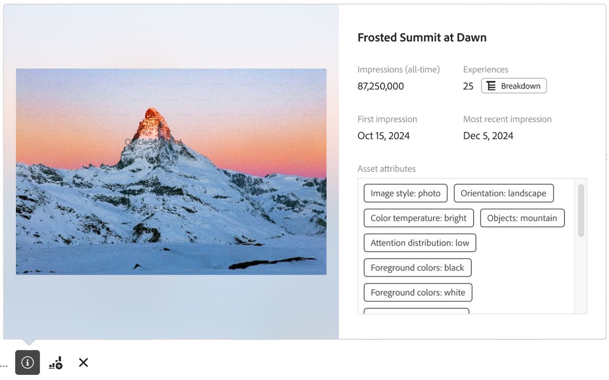

# Vue d’ensemble de la création de rapports sur l’analyse du contenu

Vous créez des rapports, effectuez des analyses et obtenez des informations sur l’analyse du contenu dans [Analysis Workspace](/help/analysis-workspace/home.md). Un [modèle](#template) Workspace spécifique est disponible afin que vous puissiez immédiatement accéder à un projet Workspace prérempli avec des informations pertinentes sur le contenu.

Pour commencer à créer des rapports à partir de zéro sur l’analyse du contenu :

1. [Créez un projet](/help/analysis-workspace/build-workspace-project/create-projects.md) ou [ouvrez un projet existant](/help/analysis-workspace/build-workspace-project/open-projects.md) dans Workspace.
1. Veillez à [sélectionner une vue de données](/help/analysis-workspace/c-panels/panels.md#data-view) pour la création de rapports sur l’analyse du contenu. La création de rapports sur l’analyse du contenu n’est disponible que pour les vues de données [configurées](/help/content-analytics/config/configuration.md) pour l’analyse du contenu.
1. Faites glisser une visualisation  [Tableau à structure libre](/help/analysis-workspace/visualizations/freeform-table/freeform-table.md) sur la zone de travail.
1. Utilisez des [composants d’analyse du contenu spécifiques](components.md) et d’autres [composants](/help/components/overview.md) génériques (tels que des segments, des périodes, des annotations) pour créer vos informations d’analyse du contenu.

## Miniatures

En fonction des dimensions spécifiques à l’analyse du contenu que vous utilisez dans votre projet, des miniatures s’affichent pour les ressources et les dimensions.

Par défaut, des miniatures s’affichent pour les dimensions d’analyse du contenu pertinentes. Pour configurer l’affichage de miniatures pour une dimension d’analyse du contenu :

* Pointez sur la ligne d’en-tête d’une dimension d’analyse du contenu. Par exemple, **[!UICONTROL ID de ressources]** ou **[!UICONTROL ID d’expérience]**.
* Sélectionnez .
* Dans la fenêtre contextuelle **[!UICONTROL Paramètres de la ligne]**, sous **[!UICONTROL Paramètres]**, cochez ou décochez la case **[!UICONTROL Afficher les miniatures]**.

## Prévisualisations

Pour les lignes d’une dimension d’analyse du contenu qui affichent des miniatures, vous pouvez ouvrir une fenêtre contextuelle de prévisualisation.

Pour ouvrir la prévisualisation avec les détails suivants :

* Sélectionnez . Les détails suivants s’affichent.

  | Prévisualisation de l’expérience | Prévisualisation de la ressource |
  |---|---|
  |  |  |
  | Nom de la dimension (par exemple, **[!UICONTROL ID d’expérience])** | Nom de la dimension de ressource (par exemple, **[!UICONTROL ID de ressource])** |
  | **[!UICONTROL Impressions (toutes périodes)]** : nombre d’impressions pour l’expérience. | **[!UICONTROL Impressions (toutes périodes)]** : nombre d’impressions pour la ressource. |
  | **[!UICONTROL Ressources]** : nombre de ressources que contient cette expérience.  Sélectionnez  **[!UICONTROL Répartition]** pour examiner les ressources. | **[!UICONTROL Expériences]** : nombre d’expériences dans lesquelles cette ressource apparaît.  Sélectionnez  **[!UICONTROL Répartition]** pour examiner les ressources. |
  | **[!UICONTROL Première impression]** : date de la première impression de l’expérience. | **[!UICONTROL Première impression]** : date de la première impression de la ressource. |
  | **[!UICONTROL Impression la plus récente]** : date de l’impression la plus récente de l’expérience. | **[!UICONTROL Impression la plus récente]** : date de l’impression la plus récente de la ressource. |
  | **[!UICONTROL Attributs d’expérience]** : les [attributs](/help/content-analytics/report/components.md#experience-attributes) de l’expérience. | **[!UICONTROL Attributs de ressources]** : les [attributs](/help/content-analytics/report/components.md#asset-attributes) de la ressource. |

## Modèle

Un [modèle](/help/analysis-workspace/templates/use-templates.md) d’analyse du contenu est disponible pour vous permettre d’identifier le contenu et les attributs de contenu qui présentent les meilleures performances. Le modèle fait partie du [cas d’utilisation du canal web et de l’engagement](/help/analysis-workspace/templates/use-templates.md#web-engagement) et décrit les performances de votre contenu à un niveau granulaire. Vous pouvez examiner les performances de ressources individuelles ou d’attributs spécifiques.

En fonction de ce que vous apprendrez, vous pourrez effectuer un certain nombre d’opérations, comme promouvoir des ressources hautement performantes sur votre page d’accueil, personnaliser le contenu de segments spécifiques afin d’inclure des attributs hautement performants ou retirer du contenu qui commence à devenir obsolète.

Pour utiliser le modèle :

1. Sélectionnez **[!UICONTROL Workspace]** dans le menu principal.
1. Vérifiez que vous avez sélectionné une vue de données déjà configurée pour l’analyse du contenu.
1. Recherchez ou utilisez des segments (**[!UICONTROL Web]** pour **[!UICONTROL Canal]** et **[!UICONTROL Engagement]** pour [!UICONTROL Cas d’utilisation]) pour trouver et sélectionner le modèle **[!UICONTROL Analyse de contenu]**.
1. Sélectionnez **[!UICONTROL Utiliser le modèle]**.
1. Dans la boîte de dialogue **[!UICONTROL Configurer votre modèle]**, sélectionnez une mesure dans la boîte de dialogue **[!UICONTROL Sélectionner une mesure de conversion]**. Par exemple, **[!UICONTROL CTR des ressource]**.
1. Sélectionnez **[!UICONTROL Continuer]**.

Un projet **[!UICONTROL Vue d’ensemble de l’analyse du contenu]** s’ouvre dans [Analysis Workspace](/help/analysis-workspace/home.md). Le projet se compose de quatre [panneaux](/help/analysis-workspace/c-panels/panels.md). Chaque panneau fournit des [tableaux à structure libre](/help/analysis-workspace/visualizations/freeform-table/freeform-table.md) et des [visualisations](/help/analysis-workspace/visualizations/freeform-analysis-visualizations.md) pour répondre à une question spécifique :

* **Quel est le contenu le plus performant ?**
Ce panneau vous permet de comprendre quelles expériences et quelles ressources de ces expériences génèrent de l’engagement et des conversions. Les expériences sont des pages web complètes, capturées à un moment spécifique. Une expérience peut contenir du texte et plusieurs ressources d’image. Une ressource est une image.

  Le panneau se compose des visualisations suivantes :

   * **Expériences**

     >[!NOTE]
     >
     >Ces visualisations s’affichent uniquement lorsque vous avez [inclus des expériences](/help/content-analytics/config/guided.md#experience-capture-and-definition) dans votre configuration d’analyse du contenu.
     > 

      * **CTR de l’expérience** : visualisation de la [synthèse des modifications](/help/analysis-workspace/visualizations/summary-number-change.md) représentant le CTR de l’expérience.
      * **Principales expériences de conversion** : visualisation en [barre horizontale](/help/analysis-workspace/visualizations/horizontal-bar.md) représentant les principales expériences de conversion en fonction de la mesure de conversion sélectionnée.
      * **Expériences les plus performantes** : [tableau à structure libre](/help/analysis-workspace/visualizations/freeform-table/freeform-table.md) (comprenant des [miniatures](#thumbnails) et des [prévisualisations](#previews)) pour les expériences les plus performantes.

   * **Ressources**

      * **CTR des ressources**
Visualisation de la [synthèse des modifications](/help/analysis-workspace/visualizations/summary-number-change.md) qui affiche le CTR des ressources.
      * **Ressources générant le plus de conversion**
Visualisation en [barre horizontale](/help/analysis-workspace/visualizations/horizontal-bar.md) qui représente les ressources générant le plus de conversions en fonction de la mesure de conversion sélectionnée.
      * **Ressources les plus performantes**
[Tableau à structure libre](/help/analysis-workspace/visualizations/freeform-table/freeform-table.md) (comprenant des [miniatures](#thumbnails) et des [prévisualisations](#previews)) pour les ressources les plus performantes.
      * **Ressources : vues et conversion**
Visualisation en [graphique de dispersion](/help/analysis-workspace/visualizations/scatterplot.md) qui présente un graphique de dispersion des vues de ressources par rapport aux conversions de ressources.

* **Quels sont les attributs de ressources qui contribuent aux conversions ?**
L’analyse du contenu utilise l’IA et GenAI pour attribuer automatiquement chaque métadonnée de ressource, comme les sujets, les scènes, les couleurs du premier plan, etc. Un attribut est une balise de métadonnées affectée par l’IA décrivant le contenu d’une ressource ou d’une expérience. Par exemple : <code>couleur de premier plan : rouge</code> est un attribut affecté automatiquement. Les visualisations vous permettent d’identifier les attributs de vos ressources qui contribuent le plus aux conversions.

  Le panneau se compose des visualisations suivantes :

   * **Attributs de ressources générant le plus de conversions**
[Barre horizontale](/help/analysis-workspace/visualizations/horizontal-bar.md) qui représente les attributs de ressources générant le plus de conversions en fonction de la mesure de conversion sélectionnée.
   * **Attributs d’expérience générant le plus de conversions par rapport aux 30 derniers jours**
Visualisation en [barre horizontale](/help/analysis-workspace/visualizations/horizontal-bar.md) qui représente les attributs d’expérience générant le plus de conversions comparés aux 30 derniers jours, en fonction de la mesure de conversion sélectionnée.
   * **Données des attributs de ressources générant le plus de conversions**
[Tableau à structure libre](/help/analysis-workspace/visualizations/freeform-table/freeform-table.md) qui représente les attributs de ressources générant le plus de conversions en fonction de la mesure de conversion sélectionnée. Sélectionnez une ligne dans le tableau pour mettre à jour la visualisation Tendance des attributs.
   * **Tendance des attributs**
Visualisation en [ligne](/help/analysis-workspace/visualizations/line.md) qui représente la tendance des attributs pour l’attribut de ressource générant le plus de conversions sélectionné.
   * **Couleur du premier plan de la ressource**
Exemple de [tableau à structure libre](/help/analysis-workspace/visualizations/freeform-table/freeform-table.md) qui compare les performances des éléments d’une seule catégorie d’attributs de ressource : Couleurs du premier plan. Vous pouvez remplacer cet attribut de ressource par d’autres dimensions de catégorie d’attributs de ressource.

* **Quels sont les attributs d’expérience qui contribuent aux conversions ?**

  >[!NOTE]
  >
  >Ce panneau s’affiche uniquement lorsque vous avez [inclus des expériences](/help/content-analytics/config/guided.md#experience-capture-and-definition) dans votre configuration d’analyse du contenu.
  > 

  Alors que les attributs de ressource se concentrent sur les qualités visuelles des images, les attributs d’expérience se concentrent sur le texte de votre page. Les visualisations ci-dessous vous permettent de découvrir quels attributs d’expérience contribuent à la conversion. Ces attributs sont également automatiquement affectés à l’aide des modèles d’IA et GenAI.

  Le panneau se compose des visualisations suivantes :

   * **Attributs d’expérience générant le plus de conversions**
Visualisation en [barre horizontale](/help/analysis-workspace/visualizations/horizontal-bar.md) qui représente les attributs d’expérience générant le plus de conversions en fonction de la mesure de conversion sélectionnée.
   * **Attributs d’expérience générant le plus de conversions par rapport aux 30 derniers jours**
Visualisation en [barre horizontale](/help/analysis-workspace/visualizations/horizontal-bar.md) qui représente les attributs d’expérience générant le plus de conversions, comparés aux 30 derniers jours, en fonction de la mesure de conversion sélectionnée.
   * **Données des attributs d’expérience générant le plus de conversions**
[Tableau à structure libre](/help/analysis-workspace/visualizations/freeform-table/freeform-table.md) qui représente les expériences générant le plus de conversions en fonction de la mesure de conversion sélectionnée. Sélectionnez une ligne dans le tableau pour mettre à jour la visualisation en lignes.
   * **Ligne**
Visualisation [en lignes](/help/analysis-workspace/visualizations/line.md) montrant la tendance de l’attribut d’expérience générant le plus de conversions sélectionné.
   * **Mots-clés de l’experience**
[Tableau à structure libre](/help/analysis-workspace/visualizations/freeform-table/freeform-table.md) montrant les principaux mots-clés de l’expérience en fonction de la mesure de conversion sélectionnée.

* **Où les ressources apparaissent-elles sur mon site ?**
Panneau composé d’un tableau à structure libre qui détaille où les ressources les plus consultées apparaissent sur votre site.

  Le panneau se compose d’une visualisation :

   * **Où les ressources les plus consultées apparaissent-elles ?**
Vous pouvez ventiler n’importe quelle ressource par dimensions pour mieux comprendre où cette image apparaît.

     Dans l’exemple de [tableau à structure libre](/help/analysis-workspace/visualizations/freeform-table/freeform-table.md) (comprenant des [miniatures](#thumbnails) et des [prévisualisations](#previews)), **[!UICONTROL ID de perception de ressource]** est utilisé à la place de [!UICONTROL ID de ressource]. Parfois, la même image peut être dupliquée sur votre site avec une autre URL d’image. L’attribut [!UICONTROL ID de perception de ressource] permet de regrouper ces doublons sous un seul ID.

     Étant donné que les ressources peuvent changer sur une page, chaque ressource est ventilée par **[!UICONTROL ID d’expérience]** afin d’identifier la version de la page sur laquelle la ressource est apparue. Vous pouvez remplacer l’[!UICONTROL ID d’expérience] par d’autres dimensions qui vous permettant de déterminer l’emplacement d’une ressource sur votre site. Par exemple, [!UICONTROL Nom de la page], [!UICONTROL URL de la page] ou [!UICONTROL Section du site].

     Vous pouvez également remplacer l’[!UICONTROL ID de perception de ressource] par l’[!UICONTROL ID de ressource] pour obtenir un enregistrement de l’emplacement où des URL d’images spécifiques sont référencées.

>[!MORELIKETHIS]
>
>[Composants de l’analyse du contenu](components.md)
>>[Utiliser des modèles](/help/analysis-workspace/templates/use-templates.md#web-engagement)
>
