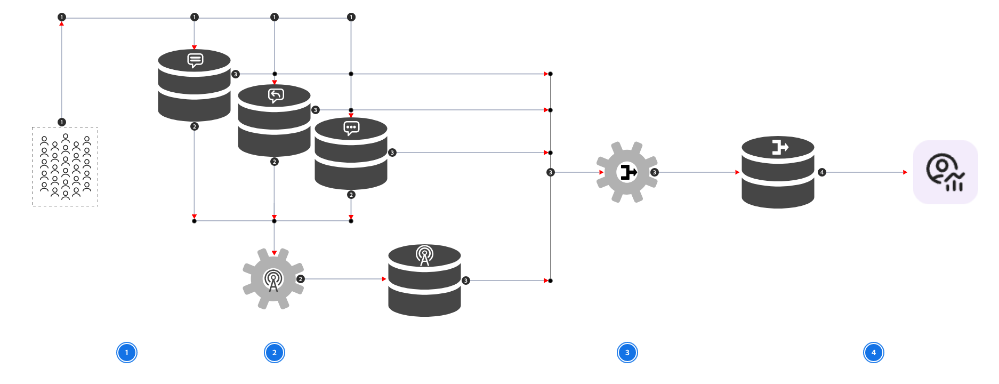

# Informations sur la conversation

Conversation Insights vous permet d’analyser les conversations à partir des expériences d’agent que vous proposez à vos clients. Ces expériences d’agent peuvent être basées sur des modèles de langage étendus (LLM) ou sur des conversations humaines. Conversation Insights analyse les conversations à grande échelle et fournit un contexte pour ces conversations dans le parcours client complet. Grâce à Conversation Insights, vous pouvez comprendre l’impact des agents sur les résultats réels des utilisateurs et utilisatrices.

Les informations de conversation abordent les problèmes que vous pouvez rencontrer. Par exemple :

* Vous ne disposez pas d’insight pour savoir ce qui se passe lorsque les clients interagissent avec des agents (LLM ou humains) dans le cadre du parcours.
* Vous ne pouvez pas comprendre :
  * ce que les agents disent aux clients à grande échelle.
  * comment les clients interagissent avec les agents à grande échelle.
  * quel est l’impact global sur les indicateurs de performance clés suite à ces interactions ?
* Vous créez des expériences agentiques pour s’adapter aux préférences changeantes des utilisateurs et utilisatrices.

Avec les informations de conversation, vous pouvez comprendre :

* Ce que les agents disent aux utilisateurs.
* Ce que les utilisateurs demandent aux agents.
* comment les conversations affectent vos indicateurs de performance clés ;

Vous pouvez déterminer les performances de vos agents par rapport aux directives, le degré de respect des directives de la marque par les agents et si le coût de fonctionnement des agents est justifié par les résultats.

## Concepts

À un niveau élevé dans les informations sur la conversation, une [conversation](#conversation) est une séquence de [tours](#turn) corrélés. Chaque tour peut avoir des événements [invite](#prompt), [réponse](#response) et [retour](#feedback) délivrés indépendamment. Les [signaux](#signal) sont des observations structurées dérivées de la conversation, tandis que le jeu de données combiné rassemble les événements et les signaux sources pour la création de rapports.

Conversation Insights analyse les interactions des agents à deux niveaux :

* Niveau [Conversation](#conversation) : interaction complète entre un utilisateur et un agent, qui contient plusieurs tours.
* [Niveau tour](#turn) : un cycle d’interaction au sein de cette conversation, composé d’une invite utilisateur et d’une réponse de l’agent.

L’application ou le service de l’agent émet des événements d’expérience liés à la conversation dans Experience Platform. Les données d’événement d’invite, de réponse et de retour peuvent arriver indépendamment. Les services Platform corrélent et fusionnent ces événements dans un enregistrement au niveau du tour, enrichissent éventuellement les données avec les signaux extraits et rendent les données obtenues disponibles pour la création de rapports Customer Journey Analytics.

### Conversation

Une conversation est l’interaction complète entre un utilisateur et un agent. Il peut contenir une ou plusieurs spires.

Une conversation est le niveau de conteneur ou de regroupement. Ce conteneur est utile pour des questions telles que :

* Combien de conversations ont eu lieu ?
* Quel était le sujet général d&#39;une conversation ?
* Comment le sentiment a-t-il changé au cours d’une conversation ?
* Quelles conversations ont finalement abouti à une conversion ?

Pour plus d’informations sur l’implémentation, reportez-vous à l’objet [conversation](./conversation-insights-implementation.md#conversation) dans la documentation [&#x200B; Implémenter des informations sur la conversation](./conversation-insights-implementation.md).

### Tourner

Un virage est un cycle d’interaction au sein d’une conversation.

Un virage typique consiste à :

* Invite utilisateur
* Réponse de l’agent
* (facultatif) Commentaires de l’utilisateur

Le tour est l’objet analytique principal à des fins de création de rapports. Le service de mélangeur de conversation combine les informations disponibles sur les invites, les réponses, les retours et les signaux dans des enregistrements au niveau du tour.

Pour plus d’informations sur l’implémentation, reportez-vous à l’objet [tourner](./conversation-insights-implementation.md#turn) dans la documentation [Implémenter des informations de conversation](./conversation-insights-implementation.md).

### Invite

Une invite correspond à l’entrée envoyée à l’agent. Dans la plupart des scénarios client, cette entrée correspond à la question, à la requête, à l’instruction ou au message de l’utilisateur ou de l’utilisatrice.

Une invite peut contenir plusieurs segments bruts. Par exemple, un utilisateur ou une utilisatrice saisit du texte et inclut une URL.

* `Prompt`
  * `"What is the capital of France"`
  * `"https://example.com/france"`

L’invite est l’entrée principale à partir de laquelle les informations de conversation peuvent obtenir des informations analytiques telles que :

* Intention de l’utilisateur
* Objet ou sujet
* Ton de l&#39;utilisateur
* Sentiment de l’utilisateur
* Autres signaux pris en charge

Pour plus d’informations sur l’implémentation, reportez-vous à l’objet [prompt](./conversation-insights-implementation.md#prompt) dans la documentation [Implémenter des informations sur les conversations](./conversation-insights-implementation.md).

### Réponse

Une réponse correspond au contenu renvoyé par l’agent ou une autre partie répondant.

Une réponse contient souvent différents types de contenu. Par exemple :

* Réponse principale
* Citation ou référence
* Lien
* Image
* Contenu promotionnel

Cette distinction est utile, car l’analyse doit séparer la réponse principale des liens, citations, publicités ou autres composants de réponse annexes.

Pour plus d’informations sur l’implémentation, reportez-vous à l’objet [response](./conversation-insights-implementation.md#response) dans la documentation [Implémenter des informations sur les conversations](./conversation-insights-implementation.md).

### Commentaires

Le retour d’informations est l’évaluation ou la réaction explicite de l’utilisateur ou de l’utilisatrice à l’interaction.

Le retour d’informations peut contenir :

* Texte de commentaires de forme libre
* Une évaluation numérique
* Une classification de classification
* Une ou plusieurs raisons de l’évaluation

Les commentaires ne sont pas nécessairement disponibles en même temps que l’invite ou la réponse. Vous pouvez envoyer le retour d’informations ultérieurement à partir de l’application ou du service de l’agent, une fois que l’utilisateur a évalué la réponse.

Pour plus d’informations sur l’implémentation, reportez-vous à l’objet [feedback](./conversation-insights-implementation.md#feedback) dans la documentation [Implémenter des informations sur les conversations](./conversation-insights-implementation.md).

### Signal

Un signal est une observation analytique structurée du contenu de la conversation. Le service d&#39;extraction de signaux extrait des signaux.

Pour plus d’informations sur l’implémentation, reportez-vous à l’objet [signal](./conversation-insights-implementation.md#signal) dans la documentation [Implémenter des informations de conversation](./conversation-insights-implementation.md).

### Agent

Pour identifier l’application ou le service de l’agent, des informations sur l’agent sont requises pour chaque événement de Conversation Insights (invite, réponse, retour d’informations, signal).

#### Appels de compétences

Si votre application d’expérience de l’agent prend en charge l’appel des compétences qui représentent les fonctionnalités invoquées pendant le traitement, vous pouvez ajouter ces appels de compétences au sein du groupe de champs informations sur l’agent .

Pour plus d’informations sur l’implémentation, reportez-vous au groupe de champs [informations agentiques](./conversation-insights-implementation.md#agentic-information-field-group) dans la documentation [Implémenter les informations de conversation](./conversation-insights-implementation.md).

## Fonctionnement

Conversation Insights repose sur trois fonctionnalités principales :

* **Collecte de données** : permet aux utilisateurs de comprendre dans quelle mesure LLM et les agents effectuent leurs tâches. La collecte de données est nécessaire pour collecter tous les points de données nécessaires.
* **Extraction des signaux et fusion des conversations** : transforme les invites et les réponses non structurées (également appelées conversions) en points de données à signaler, comme l’intention et le sentiment. Pour que les utilisateurs puissent créer des rapports sur ces points de données à grande échelle.
* **Reporting** : pour déterminer l’efficacité et le retour sur investissement d’un agent, analysez les conversations à grande échelle dans le cadre du parcours client.

Le processus global de collecte de données, d&#39;extraction de signaux et de mixage des conversations est présenté ci-dessous.

{zoomable="yes"}

| | Description |
|---|---|
| 1 | Vous instrumentez votre application ou service d’agent pour créer des événements contenant des jeux de données d’invites , de réponses  et de commentaires . Pour plus d’informations sur la manière d’instrumenter votre application ou service d’agent, reportez-vous à la [documentation d’implémentation](./conversation-insights-implementation.md). |
| 2 | Le service d’extraction de signal extrait les signaux des invites , des réponses  et des jeux de données de retour  en tant qu’événements de signal  et stocke ces événements de signal dans un nouveau jeu de données. Cette étape est implémentée dans le cadre de la définition d’une [configuration Insights de conversation](./conversation-insights-configure.md). |
| 3 | Le service de mélangeur de conversation fusionne les événements des invites , des réponses , des commentaires  et des signaux  des jeux de données d’événement et génère les événements mélangés dans un nouveau jeu de données. Cette étape est implémentée dans le cadre de la définition d’une [configuration Insights de conversation](./conversation-insights-configure.md). |
| 4 | Le jeu de données  fusionné fait alors partie de la connexion et les composants définis dans le schéma utilisé pour le jeu de données fusionné font partie de la vue de données. Cette étape est implémentée dans le cadre de la définition d’une [configuration Insights de conversation](./conversation-insights-configure.md). |

