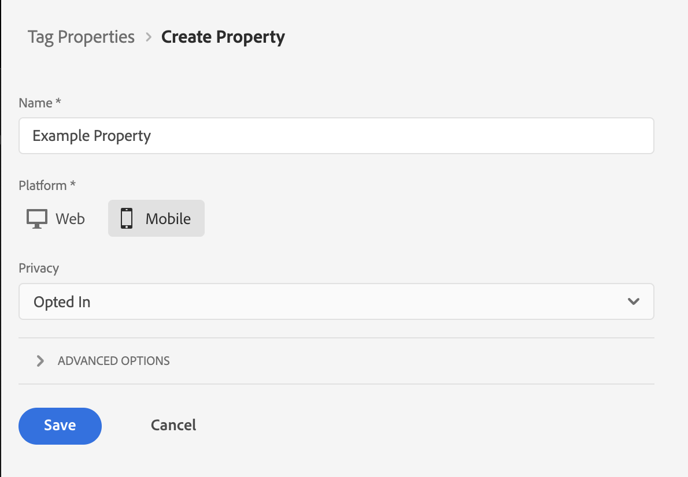
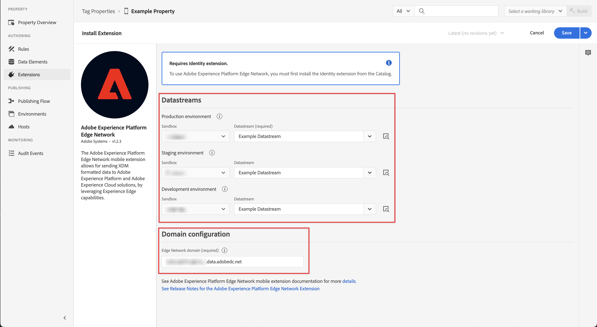

# Ingestion de données via Mobile SDK

Ce guide de démarrage rapide explique comment ingérer des données de tracking d’application mobile directement dans Adobe Experience Platform à l’aide de Adobe Experience Platform Mobile SDK et d’Edge Network. Utilisez ensuite ces données dans Customer Journey Analytics.

Pour ce faire, effectuez les opérations suivantes :

- **Configurer un schéma et un jeu de données** dans Adobe Experience Platform pour définir le modèle (schéma) des données que vous souhaitez collecter et l’emplacement de la collecte effective des données (jeu de données).

- **Définir un flux de données** pour configurer Adobe Experience Platform Edge Network afin d’acheminer les données collectées vers le jeu de données que vous avez configuré dans Adobe Experience Platform.

- **Utiliser des balises** pour configurer facilement des règles et des éléments de données par rapport aux données de votre application mobile. Ensuite, assurez-vous que les données sont envoyées au flux de données configuré sur Adobe Experience Platform Edge Network.

- **Déployer et valider**. Mettez en place un environnement dans lequel vous pouvez itérer sur le développement des balises puis, une fois que tout est validé, procédez à la publication dans l’environnement de production.

- **Configurer une connexion** dans Customer Journey Analytics. Cette connexion doit (au moins) inclure le jeu de données Adobe Experience Platform.

- **Configurer une vue de données** dans Customer Journey Analytics pour définir les mesures et les dimensions à utiliser dans Analysis Workspace.

- **Configurer un projet** dans Customer Journey Analytics pour créer des rapports et des visualisations.

>[!NOTE]
>
>Ce guide de démarrage rapide est un guide simplifié sur la manière d’ingérer les données collectées depuis votre application dans Adobe Experience Platform et de les utiliser dans Customer Journey Analytics. Il est vivement recommandé d’étudier les informations supplémentaires lorsqu’elles sont mentionnées.

## Configurer un schéma et un jeu de données

Pour ingérer des données dans Adobe Experience Platform, vous devez d’abord définir les données à collecter. Toutes les données ingérées dans Adobe Experience Platform doivent être conformes à une structure standard dénormalisée pour être reconnues et utilisées par les fonctionnalités et fonctions en aval. Le modèle de données d’expérience (XDM) est le cadre standard qui fournit une structure sous la forme de schémas.

Une fois que vous avez défini un schéma, vous utilisez un ou plusieurs jeux de données pour stocker et gérer la collecte de données. Un jeu de données est une structure de stockage et de gestion pour une collecte de données (généralement sous la forme d’un tableau) qui contient un schéma (des colonnes) et des champs (des lignes).

Toutes les données ingérées par Adobe Experience Platform doivent être conformes à un schéma prédéfini avant de pouvoir être conservées sous la forme d’un jeu de données.

### Configurer un schéma

Vous souhaitez suivre certaines données minimales provenant des profils à l’aide de votre application mobile, par exemple le nom de la scène, l’identification.
Vous devez d’abord définir un schéma qui modélise ces données.

Configurer le schéma :

1. Dans le rail de gauche de l’interface utilisateur d’Adobe Experience Platform, sélectionnez **[!UICONTROL Schémas]** sous [!UICONTROL GESTION DES DONNÉES].

1. Sélectionnez **[!UICONTROL Créer un schéma]**.
.
1. À l’étape Sélectionner une classe de l’assistant de création de schéma :

   1. Sélectionnez **[!UICONTROL Événement d’expérience]**.

      

      >[!INFO]
      >
      >    Un schéma d’événement d’expérience est utilisé pour modéliser le _comportement_ d’un profil (comme le nom de la scène, le bouton push à ajouter au panier). Un schéma de profil individuel est utilisé pour modéliser les _attributs_ de profil (nom, e-mail, sexe, etc.).

   1. Sélectionnez **[!UICONTROL Suivant]**.

1. À l’étape [!UICONTROL Nom et révision] de l’assistant [!UICONTROL Créer un schéma] :

   1. Saisissez un **[!UICONTROL nom d’affichage du schéma]** et (facultatif) un **[!UICONTROL description]** pour votre schéma.

      

   1. Sélectionnez **[!UICONTROL Terminer]**.

1. Dans l’onglet Structure de l’exemple de schéma :

   1. Sélectionnez **[!UICONTROL + Ajouter]** dans [!UICONTROL Groupes de champs].

      

      Les groupes de champs sont des collections d’objets et d’attributs réutilisables permettant d’étendre facilement le schéma.

   1. Dans la boîte de dialogue [!UICONTROL Ajouter des groupes de champs], sélectionnez le groupe de champs **[!UICONTROL ExperienceEvent AEP Mobile SDK]** dans la liste.

      

      Vous pouvez sélectionner le bouton Aperçu pour afficher un aperçu des champs qui font partie de ce groupe de champs, comme `application > name`.

      

      Sélectionnez **[!UICONTROL Précédent]** pour fermer l’aperçu.

   1. Sélectionnez **[!UICONTROL Ajouter des groupes de champs]**.

1. Sélectionnez **[!UICONTROL +]** en regard du nom du schéma dans le panneau [!UICONTROL Structure].

   

1. Dans le panneau [!UICONTROL Propriétés du champ], saisissez `identification` comme [!UICONTROL Nom du champ], **[!UICONTROL Identification]** comme [!UICONTROL Nom d’affichage], sélectionnez **[!UICONTROL Objet]** comme [!UICONTROL Type] et **[!UICONTROL ExperienceEvent Core v2.1]** comme [!UICONTROL Groupe de champs].

   >[!NOTE]
   >
   >Si ce groupe de champs n’est pas disponible, recherchez un autre groupe de champs contenant des champs d’identité. Ou [créez un groupe de champs](https://experienceleague.adobe.com/docs/experience-platform/xdm/ui/resources/field-groups.html) et [ajoutez de nouveaux champs d’identité](https://experienceleague.adobe.com/docs/experience-platform/xdm/ui/fields/identity.html#define-a-identity-field) (comme `ecid`, `crmId` et autres dont vous avez besoin) au groupe de champs et sélectionnez ce nouveau groupe de champs.

   

   L’objet d’identification ajoute des fonctionnalités d’identification au schéma. Dans votre cas, vous devez identifier les profils à l’aide de votre application mobile à l’aide de l’Experience Cloud ID et de l’adresse e-mail. De nombreux autres attributs sont disponibles pour effectuer le suivi de l’identification de votre personne (par exemple, l’identifiant client, l’identifiant de fidélité).

   Sélectionnez **[!UICONTROL Appliquer]** pour ajouter cet objet au schéma.

1. Sélectionnez le champ **[!UICONTROL ecid]** dans l’objet d’identification que vous venez d’ajouter, puis sélectionnez **[!UICONTROL Identité]**, **[!UICONTROL Identité principale]** et **[!UICONTROL ECID]** dans la liste [!UICONTROL Espace de noms d’identité] du panneau de droite.

   

   Vous spécifiez Experience Cloud Identity comme identité principale qu’Adobe Experience Platform Identity Service peut utiliser pour combiner (regrouper) le comportement des profils avec le même ECID.

   Sélectionnez **[!UICONTROL Appliquer]**. Une icône d’empreinte digitale apparaît dans l’attribut ecid.

1. Sélectionnez le champ **[!UICONTROL e-mail]** dans l’objet d’identification que vous venez d’ajouter, puis sélectionnez **[!UICONTROL Identité]** et **[!UICONTROL E-mail]** dans la liste [!UICONTROL Espace de noms d’identité] du panneau [!UICONTROL Propriétés du champ].

   

   Vous spécifiez l’adresse e-mail en tant qu’autre identité qu’Adobe Experience Platform Identity Service peut utiliser pour combiner (regrouper) le comportement des profils.

   Sélectionnez **[!UICONTROL Appliquer]**. Une icône d’empreinte digitale apparaît dans l’attribut d’e-mail.

   Sélectionnez **[!UICONTROL Enregistrer]**.

1. Sélectionnez l’élément racine du schéma qui affiche le nom du schéma, puis sélectionnez le sélecteur de **[!UICONTROL Profil]**.

   Vous êtes invité à activer le schéma pour le profil. Une fois activé, lorsque les données sont ingérées dans des jeux de données basés sur ce schéma, ces données sont fusionnées dans le profil client en temps réel.

   Consultez [Activer le schéma à utiliser dans le profil client en temps réel](https://experienceleague.adobe.com/docs/experience-platform/xdm/tutorials/create-schema-ui.html#profile) pour plus d’informations.

   >[!IMPORTANT]
   >
   >    Une fois que vous avez enregistré un schéma activé pour le profil, il ne peut plus être désactivé pour le profil.

   

1. Sélectionnez **[!UICONTROL Enregistrer]** pour enregistrer le schéma.

Vous avez créé un schéma minimal qui modélise les données que vous pouvez capturer à partir de votre application mobile. Le schéma permet d’identifier les profils à l’aide d’Experience Cloud Identity et de l’adresse e-mail. En activant le schéma pour le profil, vous vous assurez que les données capturées à partir de votre application mobile sont ajoutées au profil client en temps réel.

En regard des données de comportement, vous pouvez également capturer les données d’attributs de profil de votre application mobile (par exemple, les détails des profils s’abonnant à une newsletter).

Pour capturer les données de profil, vous devez :

- Créer un schéma basé sur la classe Profil XDM individuel ;

- Ajouter le groupe de champs Profil principal v2 au schéma ;

- Ajouter un objet d’identification basé sur le groupe de champs Profil principal v2 ;

- Définissez l’Experience Cloud ID comme identifiant principal et l’e-mail comme identifiant.

- Activer le schéma pour le profil.

Consultez [Créer et modifier des schémas dans l’interface utilisateur](https://experienceleague.adobe.com/docs/experience-platform/xdm/ui/resources/schemas.html?lang=fr) pour plus d’informations sur l’ajout et la suppression de groupes de champs et de champs individuels dans un schéma.

### Configurer un jeu de données

Le schéma vous a permis de définir le modèle de données. Vous devez maintenant définir la structure pour stocker et gérer ces données à l’aide de jeux de données.

Configurer le jeu de données :

1. Dans le rail de gauche de l’interface utilisateur d’Adobe Experience Platform, sélectionnez **[!UICONTROL Jeux de données]** sous [!UICONTROL GESTION DES DONNÉES].

2. Sélectionnez **[!UICONTROL Créer un jeu de données]**.

   

3. Sélectionnez **[!UICONTROL Créer un jeu de données à partir d’un schéma]**.

   

4. Sélectionnez le schéma que vous avez créé précédemment et sélectionnez **[!UICONTROL Suivant]**.

5. Nommez le jeu de données et (facultatif) fournissez une description.

   

6. Sélectionnez **[!UICONTROL Terminer]**.

7. Sélectionnez le sélecteur de **[!UICONTROL Profil]**.

   Vous êtes invité à activer le jeu de données pour le profil. Une fois activé, le jeu de données enrichit les profils clients en temps réel avec ses données ingérées.

   >[!IMPORTANT]
   >
   >    Vous ne pouvez activer un jeu de données pour le profil que si le schéma, auquel le jeu de données adhère, est également activé pour le profil.

   

Consultez [Guide de l’interface utilisateur des jeux de données](https://experienceleague.adobe.com/docs/experience-platform/catalog/datasets/user-guide.html?lang=fr) pour plus d’informations sur l’affichage, la prévisualisation, la création et la suppression d’un jeu de données. Ainsi que l’activation d’un jeu de données pour le profil client en temps réel.

## Configurer un flux de données

Un flux de données représente la configuration côté serveur lors de la mise en œuvre des SDK Web et Mobile Adobe Experience Platform. Lors de la collecte de données avec les SDK Adobe Experience Platform, les données sont envoyées à Adobe Experience Platform Edge Network. Il s’agit du flux de données qui détermine les services vers lesquels ces données sont transférées.

Dans votre configuration, vous souhaitez que les données que vous collectez à partir de l’application mobile soient envoyées à votre jeu de données dans Adobe Experience Platform.

Configurer le flux de données :

1. Dans l’interface utilisateur d’Adobe Experience Platform, sélectionnez **[!UICONTROL Flux de données]** sous [!UICONTROL COLLECTE DE DONNÉES] dans le rail de gauche.

2. Sélectionnez **[!UICONTROL Nouveau flux de données]**.

3. Nommez et décrivez le flux de données. Sélectionnez le schéma dans la liste [!UICONTROL Schéma d’événement].

   

4. Sélectionnez **[!UICONTROL Enregistrer]**.

5. Sélectionnez **[!UICONTROL Ajouter un service]**.

6. Sur l’[!UICONTROL écran Ajouter un service] :

   1. Sélectionnez **[!UICONTROL Adobe Experience Platform]** dans la liste [!UICONTROL Service].

   2. Assurez-vous que l’option **[!UICONTROL Activé]** est sélectionnée.

   3. Sélectionnez le jeu de données dans la liste [!UICONTROL Jeu de données d’événement].

      

   4. Gardez les autres paramètres et sélectionnez **[!UICONTROL Enregistrer]** pour enregistrer le flux de données.

Le flux de données est maintenant configuré pour transférer les données collectées depuis l’application mobile vers le jeu de données dans Adobe Experience Platform.

Consultez [Présentation des flux de données](https://experienceleague.adobe.com/docs/experience-platform/edge/datastreams/overview.html) pour plus d’informations sur la configuration d’un flux de données et la gestion des données sensibles.

## Utiliser des balises

Pour implémenter du code sur votre site afin de collecter des données, utilisez la fonctionnalité Balises de Adobe Experience Platform. Cette solution de gestion des balises vous permet de déployer le code parallèlement à d’autres exigences de balisage. Les balises offrent une intégration transparente à Adobe Experience Platform à l’aide de l’extension Adobe Experience Platform Mobile SDK.

### Créer une balise

1. Dans le rail de gauche de l’interface utilisateur d’Adobe Experience Platform, sélectionnez **[!UICONTROL Balises]** sous [!UICONTROL COLLECTE DE DONNÉES].

2. Sélectionnez **[!UICONTROL Nouvelle propriété]**.

   Nommez la balise, puis sélectionnez **[!UICONTROL Mobile]**. Sélectionnez **[!UICONTROL Enregistrer]** pour continuer.

   

### Configurer la balise

Après avoir créé la balise, vous devez la configurer avec les extensions correctes et configurer les éléments de données et les règles en fonction de la manière dont vous souhaitez effectuer le suivi de votre site et envoyer des données à Adobe Experience Platform.

Pour configurer, sélectionnez la balise que vous venez de créer dans la liste [!UICONTROL Propriétés de balise].

#### **Extensions**

Ajoutez l’extension Adobe Platform Edge Network à la balise pour vous assurer que vous pouvez envoyer des données à Adobe Experience Platform (via le flux de données).

Création et configuration de l’extension Adobe Experience Platform Mobile SDK :

1. Sélectionnez **[!UICONTROL Extensions]** dans le rail de gauche. Vous constatez que les extensions Mobile Core et Profile sont déjà disponibles.

1. Sélectionnez **[!UICONTROL Catalogue]** dans la barre supérieure.

1. Recherchez ou accédez à l’extension **[!UICONTROL Adobe Experience Platform Edge Network]**, puis sélectionnez **[!UICONTROL Installer]** dans le volet de droite pour l’installer.

1. Sélectionnez la sandbox et le flux de données créé précédemment pour l’[!UICONTROL Environnement de production], (facultatif) l’[!UICONTROL Environnement d’évaluation] et l’[!UICONTROL Environnement de développement].

   

1. Entrez votre **[!UICONTROL domaine Edge Network]** sous [!UICONTROL Configuration du domaine]. Utilisez généralement `<organizationName>.data.adobedc.net`.

1. Sélectionnez **[!UICONTROL Enregistrer]**.

Voir [Configuration de l’extension Adobe Experience Platform Edge Network](https://developer.adobe.com/client-sdks/documentation/edge-network) pour plus d’informations.

Vous souhaitez également configurer les extensions supplémentaires suivantes à partir du catalogue :

- Identité.
- AEP Assurance.
- Consentement.

Voir [Configurer une propriété de balise](https://experienceleague.adobe.com/docs/platform-learn/implement-mobile-sdk/initial-configuration/configure-tags.html?lang=fr) dans le Tutoriel sur les applications mobiles pour Experience Platform pour obtenir beaucoup plus d’informations sur les extensions et leur configuration.

#### **Éléments de données**

Les éléments de données sont les blocs de construction de votre dictionnaire de données (ou mappage de données). Utilisez des éléments de données pour recueillir, organiser et diffuser des données dans les technologies marketing et publicitaires. Vous configurez des éléments de données dans la balise qui peuvent être lus à partir de données ou d’événements d’application mobile et être utilisés pour diffuser des données dans Adobe Experience Platform.

Par exemple, vous souhaitez collecter le nom de l’opérateur à partir de l’application mobile.

Pour définir un élément de données de nom d’opérateur :

1. Sélectionnez **[!UICONTROL Éléments de données]** dans le rail de gauche.

2. Sélectionnez **[!UICONTROL Ajouter un élément de données]**.

3. Dans la boîte de dialogue [!UICONTROL Créer un élément de données] :

   - Nommez l’élément de données, par exemple `Carrier Name`.

   - Sélectionnez **[!UICONTROL Mobile Core]** dans la liste [!UICONTROL Extension].

   - Sélectionnez **[!UICONTROL Nom de l’opérateur]** dans la liste [!UICONTROL Type d’élément de données].

     

   - Sélectionnez **[!UICONTROL Enregistrer]**.

Vous pouvez créer autant d’éléments de données que vous le souhaitez et les utiliser dans des règles.

#### **Règles**

Dans Adobe Experience Platform, les balises suivent un système basé sur des règles. Elles recherchent les interactions utilisateur et les données associées. Lorsque les critères définis dans votre règle sont satisfaits, la règle déclenche l’extension, le script ou le code côté client que vous avez identifié. Vous pouvez utiliser des règles pour envoyer des données (comme un objet XDM) dans Adobe Experience Platform à l’aide de l’extension Adobe Experience Platform Edge Network.

Par exemple, vous souhaitez envoyer des données d’événement lorsque l’application mobile est utilisée (au premier plan) et lorsqu’elle n’est pas utilisée (poussée en arrière-plan).

Définir une règle :

1. Sélectionnez **[!UICONTROL Règles]** dans le rail de gauche.

2. Sélectionnez **[!UICONTROL Créer une règle]**.

3. Dans la boîte de dialogue [!UICONTROL Créer une règle] :

   - Nommez la règle, par exemple `Application Status`.

   - Sélectionnez **[!UICONTROL + Ajouter]** sous [!UICONTROL Événements].

   - Dans la boîte de dialogue [!UICONTROL Configuration d’événement] :

      - Sélectionnez **[!UICONTROL Mobile Core]** dans la liste [!UICONTROL Extension].

      - Sélectionnez **[!UICONTROL Premier plan]** dans la liste [!UICONTROL Type d’événement].

      - Sélectionnez **[!UICONTROL Conserver les modifications]**.

   - Cliquez sur  en regard de [!UICONTROL Mobile Core - Premier plan].

      - Sélectionnez **[!UICONTROL Mobile Core]** dans la liste [!UICONTROL Extension].

      - Sélectionnez **[!UICONTROL Arrière-plan]** dans la liste [!UICONTROL Type d’événement].

      - Sélectionnez **[!UICONTROL Conserver les modifications]**.

   - Cliquez sur  Ajouter sous [!UICONTROL ACTIONS]. Dans la boîte de dialogue [!UICONTROL Configuration d’action] :

      - Sélectionnez **[!UICONTROL Adobe Experience Platform Edge Network]** dans la liste [!UICONTROL Extension].

      - Sélectionnez **[!UICONTROL Transférer l’événement vers Edge Network]** dans la liste [!UICONTROL Type d’action].

      - Sélectionnez **[!UICONTROL Conserver les modifications]**.

   - La règle doit se présenter comme suit :

     

   - Sélectionnez **[!UICONTROL Enregistrer]**.

Ce qui précède n’est qu’un exemple de définition d’une règle qui envoie des données XDM, contenant l’état de l’application, à Adobe Edge Network et à Adobe Experience Platform.

Vous pouvez utiliser des règles de différentes manières dans la balise pour manipuler des variables (à l’aide des éléments de données).

Consultez les [Règles](https://developer.adobe.com/client-sdks/documentation/lifecycle-for-edge-network/#configure-a-rule-to-forward-lifecycle-metrics-to-platform) pour plus d’informations.

### Créer et publier la balise

Après avoir défini des éléments de données et des règles, vous devez créer et publier la balise. Lorsque vous créez une version de bibliothèque, vous devez l’affecter à un environnement. Les extensions, règles et éléments de données de la version sont ensuite compilés et placés dans l’environnement attribué. Chaque environnement fournit un code intégré unique qui vous permet d’intégrer la version qui lui est assignée dans votre site.

Créer et publier la balise :

1. Sélectionnez **[!UICONTROL Flux de publication]** dans le rail de gauche.

2. Sélectionnez **[!UICONTROL Sélectionner une bibliothèque de travail]**, puis **[!UICONTROL Ajouter une bibliothèque…]**.

3. Dans la boîte de dialogue [!UICONTROL Créer une bibliothèque] :

   - Nommez la bibliothèque.

   - Sélectionnez **[!UICONTROL Développement (développement)]** dans la liste [!UICONTROL Environnement].

   - Sélectionnez **[!UICONTROL + Ajouter toutes les ressources modifiées]**.

     

   - Sélectionnez **[!UICONTROL Enregistrer et créer pour le développement]**.

   La balise est enregistrée et créée pour votre environnement de développement. Un point vert indique que la balise a été créée avec succès dans l’environnement de développement.

4. Vous pouvez sélectionner **[!UICONTROL …]** pour recréer la bibliothèque ou la déplacer vers un environnement d’évaluation ou de production.

Les balises Adobe Experience Platform prennent en charge les workflows de publication simples à complexes qui doivent s’adapter au déploiement de Adobe Experience Platform Edge Network.

Consultez [Présentation de la publication](https://developer.adobe.com/client-sdks/documentation/getting-started/create-a-mobile-property/#publish-the-configuration) pour plus d’informations.

### Récupérer le code de balise

Enfin, vous devez utiliser la balise dans l’application mobile dont vous souhaitez effectuer le suivi.

Pour obtenir des instructions de code expliquant comment configurer votre application mobile et utiliser la balise dans l’application, procédez comme suit :

1. Sélectionnez **[!UICONTROL Environnements]** dans le rail de gauche.

2. Dans la liste des environnements, sélectionnez le bouton d’installation  approprié.

   Dans la boîte de dialogue [!UICONTROL Instructions d’installation mobile], sélectionnez la plateforme appropriée ([!UICONTROL iOS], [!UICONTROL Android]). Utilisez ensuite le bouton Copier  en regard de chacun des fragments de code pertinents que vous souhaitez utiliser pour configurer et initialiser votre application mobile :

   

3. Sélectionnez **[!UICONTROL Fermer]**.

Au lieu du code de l’environnement de développement, vous auriez pu sélectionner un autre environnement (évaluation, production) en fonction du stade auquel vous vous trouvez dans le processus de déploiement de Adobe Experience Platform Mobile SDK.

Consultez [Environnements](https://experienceleague.adobe.com/docs/experience-platform/tags/publish/environments/environments.html?lang=fr) pour plus d’informations.

## Déployer et valider

Vous pouvez désormais déployer le code dans votre application mobile. Une fois déployée, votre application mobile commence à collecter des données dans Adobe Experience Platform.

Validez la mise en œuvre, corrigez-la si nécessaire, puis déployez-la dans l’environnement d’évaluation et de production à l’aide du processus de publication des balises.

Voir [Tutoriel sur l’implémentation de Adobe Experience Cloud dans les applications mobiles](https://experienceleague.adobe.com/docs/platform-learn/implement-mobile-sdk/overview.html?lang=fr) pour des informations beaucoup plus détaillées.

## Configurer une connexion

Pour utiliser les données Adobe Experience Platform dans Customer Journey Analytics, vous devez créer une connexion comprenant les données issues de la configuration du schéma, du jeu de données et du workflow.

Une connexion vous permet d’intégrer des jeux de données d’Adobe Experience Platform dans Espace de travail. Pour générer des rapports sur ces jeux de données, vous devez d’abord établir une connexion entre les jeux de données dans Adobe Experience Platform et Workspace.

Créer une connexion :

1. Dans l’interface utilisateur de Customer Journey Analytics, sélectionnez **[!UICONTROL Connexions]**, éventuellement à partir de **[!UICONTROL Gestion des données]** dans le menu supérieur.

2. Sélectionnez **[!UICONTROL Créer une connexion]**.

3. Sur l’écran [!UICONTROL Connexion sans titre] :

   Nommez et décrivez la connexion dans [!UICONTROL Paramètres de connexion].

   Sélectionnez la sandbox appropriée dans la liste [!UICONTROL Sandbox] des [!UICONTROL Paramètres des données] et sélectionnez le nombre d’événements quotidiens dans la liste [!UICONTROL Nombre moyen d’événements quotidiens].

   

   Sélectionnez **[!UICONTROL Ajouter des jeux de données]**.

   À l’étape [!UICONTROL Sélectionner des jeux de données] dans [!UICONTROL Ajouter des jeux de données] :

   - Sélectionnez les jeux de données que vous avez créés précédemment et/ou d’autres jeux de données pertinents que vous souhaitez inclure dans votre connexion (par exemple, les données d’événements d’expérience de suivi push et les données de profil push de Adobe Journey Optimizer)

     

   - Sélectionnez **[!UICONTROL Suivant]**.

   À l’étape [!UICONTROL Paramètres des jeux de données] dans [!UICONTROL Ajouter des jeux de données] :

   - Pour chaque jeu de données :

      - Sélectionnez un [!UICONTROL ID de personne] parmi les identités disponibles et définies dans les schémas du jeu de données d’Adobe Experience Platform.

      - Sélectionnez la source de données appropriée dans la liste [!UICONTROL Type de source de données]. Si vous spécifiez **[!UICONTROL Autre]**, ajoutez une description pour la source de données.

      - Définissez **[!UICONTROL Importer toutes les nouvelles données]** et **[!UICONTROL Données existantes de renvoi du jeu de données]** selon vos préférences.

     

   - Sélectionnez **[!UICONTROL Ajouter des jeux de données]**.

   Sélectionnez **[!UICONTROL Enregistrer]**.

Consultez [Présentation des connexions](../connections/overview.md) pour plus d’informations sur la création et la gestion d’une connexion, ainsi que sur la sélection et la combinaison de jeux de données.

## Configurer une vue de données

Une vue de données est un conteneur spécifique à Customer Journey Analytics qui vous permet de déterminer comment interpréter les données d’une connexion. Elle spécifie toutes les dimensions et mesures disponibles dans Analysis Workspace et les colonnes dont ces dimensions et mesures obtiennent leurs données. Les vues de données sont définies en vue de la création de comptes rendus des performances dans Analysis Workspace.

Créer une vue de données :

1. Dans l’interface utilisateur de Customer Journey Analytics, sélectionnez **[!UICONTROL Vues de données]**, éventuellement à partir de **[!UICONTROL Gestion des données]** dans le menu supérieur.

2. Sélectionnez **[!UICONTROL Créer une vue de données]**.

3. À l’étape [!UICONTROL Configurer] :

   Sélectionnez la connexion dans la liste [!UICONTROL Connexion].

   Nommez et décrivez (facultatif) la connexion.

   

   Sélectionnez **[!UICONTROL Enregistrer et continuer]**.

4. À l’étape [!UICONTROL Composants] :

   Ajoutez n’importe quel champ de schéma et/ou composant standard que vous voulez inclure dans les zones de composant [!UICONTROL MESURES] ou [!UICONTROL DIMENSIONS].

   

   Sélectionnez **[!UICONTROL Enregistrer et continuer]**.

5. À l’étape [!UICONTROL Paramètres] :

   

   Ne modifiez pas les paramètres et sélectionnez **[!UICONTROL Enregistrer et terminer]**.

Consultez [Présentation des vues de données](../data-views/data-views.md) pour plus d’informations sur la création et la modification d’une vue de données, sur les composants que vous pouvez utiliser dans votre vue de données et sur l’utilisation des paramètres de filtre et de session.

## Configurer un projet

Analysis Workspace est un outil de navigation flexible qui vous permet de créer rapidement des analyses et de partager des informations sur la base des données. Les projets Espace de travail vous permettent de combiner des composants de données, des tableaux et des visualisations afin d’élaborer une analyse et de la partager avec tous les membres de l’entreprise.

Créer un projet :

1. Dans l’interface utilisateur de Customer Journey Analytics, sélectionnez **[!UICONTROL Projets]** dans le menu supérieur.

2. Sélectionnez **[!UICONTROL Projets]** dans la barre de navigation de gauche.

3. Sélectionnez **[!UICONTROL Créer un projet]**.

   

   Sélectionnez **[!UICONTROL Projet vierge]**.

   

4. Sélectionnez la vue de données dans la liste.

   .

5. Pour créer votre premier rapport, commencez à faire glisser et à déposer des dimensions et des mesures sur le [!UICONTROL Tableau à structure libre] dans le [!UICONTROL Panneau] . À titre d’exemple, faites glisser des `Events` sous forme de mesures et des `Push Title` sous forme de dimension, ventilés par `Event Type`, pour obtenir un aperçu de vos notifications push pour votre application mobile et de ce qui leur est arrivé.

   

Consultez [Présentation d’Analysis Workspace](../analysis-workspace/home.md) pour plus d’informations sur la création de projets et d’une analyse à l’aide de composants, de visualisations et de panneaux.

>[!SUCCESS]
>
>Vous avez terminé toutes les étapes. En commençant par définir les données que vous souhaitez collecter (schéma) et où les stocker (jeu de données) dans Adobe Experience Platform, vous avez configuré un flux de données sur le réseau Edge pour vous assurer que les données peuvent être transférées vers ce jeu de données. Vous avez ensuite défini et déployé la balise contenant les extensions (Adobe Experience Platform Edge Network, etc.), les éléments de données et les règles afin de capturer les données de l’application mobile et de les envoyer au flux de données. Vous avez défini une connexion dans Customer Journey Analytics pour utiliser les données de suivi des notifications push de votre application mobile et d&#39;autres données. La définition de la vue de données vous a permis de spécifier la dimension et les mesures à utiliser. Enfin, vous avez créé votre premier projet de visualisation et d’analyse des données de votre application mobile.
