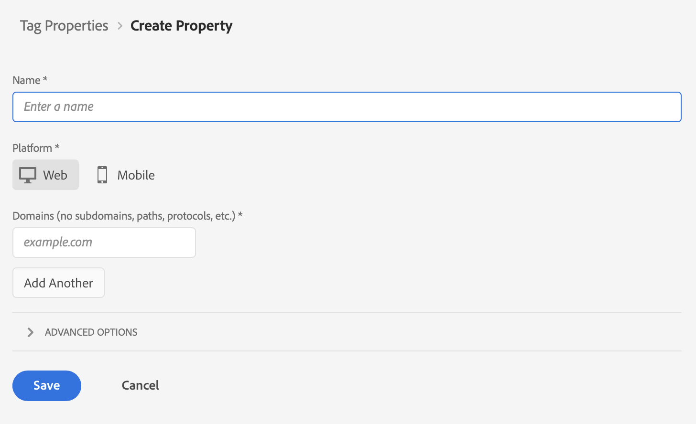

# Ingérer des données via le SDK Web Adobe Experience Platform et le réseau Edge

Ce guide de démarrage rapide explique comment ingérer des données de suivi de site Web directement dans Adobe Experience Platform à l’aide du SDK Web Adobe Experience Platform et du réseau Edge, puis les utiliser dans Customer Journey Analytics.

Pour ce faire, effectuez les opérations suivantes :

- **Configurer un schéma et un jeu de données** dans Adobe Experience Platform pour définir le modèle (schéma) des données que vous souhaitez collecter et l’emplacement de la collecte effective des données (jeu de données).

- **Définir un flux de données** pour configurer Adobe Experience Platform Edge Network afin d’acheminer les données collectées vers le jeu de données que vous avez configuré dans Adobe Experience Platform.

- **Utiliser des balises** pour configurer facilement des règles et des éléments de données par rapport aux données de la couche de données sur le site Web. Ensuite, assurez-vous que les données sont envoyées au flux de données configuré sur Adobe Experience Platform Edge Network.

- **Déployer et valider**. Mettez en place un environnement dans lequel vous pouvez itérer sur le développement des balises puis, une fois que tout est validé, procédez à la publication dans l’environnement de production.

- **Configurer une connexion** dans Customer Journey Analytics. Cette connexion doit (au moins) inclure le jeu de données Adobe Experience Platform.

- **Configurer une vue de données** dans Customer Journey Analytics pour définir les mesures et les dimensions à utiliser dans Analysis Workspace.

- **Configurer un projet** dans Customer Journey Analytics pour créer des rapports et des visualisations.

>[!NOTE]
>
>Il s’agit d’un guide simplifié sur la manière d’ingérer les données collectées sur le site dans Adobe Experience Platform et de les utiliser dans Customer Journey Analytics. Il est vivement recommandé d’étudier les informations supplémentaires lorsqu’elles sont mentionnées.


## Configurer un schéma et un jeu de données

Pour ingérer des données dans Adobe Experience Platform, vous devez d’abord définir les données à collecter. Toutes les données ingérées dans Adobe Experience Platform doivent être conformes à une structure standard dénormalisée pour être reconnues et utilisées par les fonctionnalités et fonctions en aval. Le modèle de données d’expérience (XDM) est le framework standard qui fournit cette structure sous la forme de schémas.

Une fois que vous avez défini un schéma, vous utilisez un ou plusieurs jeux de données pour stocker et gérer la collecte de données. Un jeu de données est une structure de stockage et de gestion pour la collecte de données, généralement sous la forme d’un tableau, qui contient un schéma (des colonnes) et des champs (des lignes).

Toutes les données ingérées par Adobe Experience Platform doivent être conformes à un schéma prédéfini avant de pouvoir être conservées sous la forme d’un jeu de données.

### Configurer un schéma

Vous devez effectuer le suivi de certaines données minimales provenant des profils qui visitent votre site Web, par exemple le nom de la page, l’identification.
Pour cela, vous devez d’abord définir un schéma qui modélise ces données.

Configurer le schéma :

1. Dans le rail de gauche de l’interface utilisateur d’Adobe Experience Platform, sélectionnez **[!UICONTROL Schémas]** sous [!UICONTROL GESTION DES DONNÉES].

2. Sélectionnez **[!UICONTROL Créer un schéma]**. Sélectionnez **[!UICONTROL XDM ExperienceEvent]** dans la liste des options.

   

   >[!INFO]
   >
   >    Un schéma d’événement d’expérience est utilisé pour modéliser le _comportement_ d’un profil (page vue, ajouter au panier, etc.). Un schéma de profil individuel est utilisé pour modéliser les _attributs_ de profil (nom, e-mail, sexe, etc.).


3. Sur l’écran [!UICONTROL Schéma sans titre] :

   1. Saisissez un nom d’affichage pour le schéma et (facultatif) une description.

      

   2. Sélectionnez **[!UICONTROL + Ajouter]** dans [!UICONTROL Groupes de champs].

      

      Les groupes de champs sont des collections d’objets et d’attributs réutilisables permettant d’étendre facilement le schéma.

   3. Dans la boîte de dialogue [!UICONTROL Ajouter des groupes de champs], sélectionnez le groupe de champs **[!UICONTROL ExperienceEvent du SDK Web AEP]** dans la liste.

      

      Vous pouvez sélectionner le bouton Aperçu pour afficher un aperçu des champs qui font partie de ce groupe de champs, comme `web > webPageDetails > name`.

      

      Sélectionnez **[!UICONTROL Précédent]** pour fermer l’aperçu.

   4. Sélectionnez **[!UICONTROL Ajouter des groupes de champs]**.

4. Sélectionnez **[!UICONTROL +]** en regard du nom du schéma dans le panneau [!UICONTROL Structure].

   

5. Dans le panneau [!UICONTROL Propriétés du champ], saisissez `Identification` en tant que nom et **[!UICONTROL Identification]** en tant que [!UICONTROL Nom d’affichage]. Sélectionnez **[!UICONTROL Objet]** en tant que [!UICONTROL Type] et **[!UICONTROL ExperienceEvent Core v2.1]** en tant que [!UICONTROL Groupe de champs].

   

   Cela ajoute des fonctionnalités d’identification au schéma. Dans votre cas, vous devez identifier les profils qui visitent votre site à l’aide d’Experience Cloud ID et de l’adresse e-mail. De nombreux autres attributs sont disponibles pour effectuer le suivi de l’identification de votre personne (par exemple, l’ID de client, l’ID de fidélité).

   Sélectionnez **[!UICONTROL Appliquer]** pour ajouter cet objet au schéma.

6. Sélectionnez le champ **[!UICONTROL ecid]** dans l’objet d’identification que vous venez d’ajouter, puis sélectionnez **[!UICONTROL Identité]**, **[!UICONTROL Identité principale]** et **[!UICONTROL ECID]** dans la liste [!UICONTROL Espace de noms d’identité] du panneau de droite.

   

   Vous spécifiez Experience Cloud Identity comme identité principale qu’Adobe Experience Platform Identity Service peut utiliser pour combiner (regrouper) le comportement des profils avec le même ECID.

   Sélectionnez **[!UICONTROL Appliquer]**. Une icône d’empreinte digitale apparaît dans l’attribut ecid.

7. Sélectionnez le champ **[!UICONTROL e-mail]** dans l’objet d’identification que vous venez d’ajouter, puis sélectionnez **[!UICONTROL Identité]** et **[!UICONTROL E-mail]** dans la liste [!UICONTROL Espace de noms d’identité] du panneau [!UICONTROL Propriétés du champ].

   

   Vous spécifiez l’adresse e-mail en tant qu’autre identité qu’Adobe Experience Platform Identity Service peut utiliser pour combiner (regrouper) le comportement des profils.

   Sélectionnez **[!UICONTROL Appliquer]**. Une icône d’empreinte digitale apparaît dans l’attribut d’e-mail.

   Sélectionnez **[!UICONTROL Enregistrer]**.

8. Sélectionnez l’élément racine du schéma qui affiche le nom du schéma, puis sélectionnez le sélecteur de **[!UICONTROL Profil]**.

   Vous êtes invité à activer le schéma pour le profil. Une fois activé, lorsque les données sont ingérées dans des jeux de données basés sur ce schéma, ces données sont fusionnées dans le profil client en temps réel.

   Consultez [Activer le schéma à utiliser dans le profil client en temps réel](https://experienceleague.adobe.com/docs/experience-platform/xdm/tutorials/create-schema-ui.html?lang=fr#profile) pour plus d’informations.

   >[!IMPORTANT]
   >
   >    Une fois que vous avez enregistré un schéma activé pour le profil, il ne peut plus être désactivé pour le profil.

   

9. Sélectionnez **[!UICONTROL Enregistrer]** pour enregistrer le schéma.

Vous avez créé un schéma minimal qui modélise les données que vous pouvez capturer à partir du site Web. Le schéma permet d’identifier les profils à l’aide d’Experience Cloud Identity et de l’adresse e-mail. En activant le schéma pour le profil, vous vous assurez que les données capturées sur le site Web sont ajoutées au profil client en temps réel.

En regard des données de comportement, vous pouvez également capturer les données d’attribut de profil du site (par exemple, les détails des profils s’abonnant à une newsletter).

Pour capturer ces données de profil, vous devez :

- Créer un schéma basé sur la classe Profil XDM individuel ;

- Ajouter le groupe de champs Profil principal v2 au schéma ;

- Ajouter un objet d’identification basé sur le groupe de champs Profil principal v2 ;

- Définir ecid comme identifiant principal et l’e-mail comme identifiant ;

- Activer le schéma pour le profil.

Consultez [Créer et modifier des schémas dans l’interface utilisateur](https://experienceleague.adobe.com/docs/experience-platform/xdm/ui/resources/schemas.html?lang=fr) pour plus d’informations sur l’ajout et la suppression de groupes de champs et de champs individuels dans un schéma.

### Configurer un jeu de données

Le schéma vous a permis de définir le modèle de données. Vous devez maintenant définir la structure pour stocker et gérer ces données. Pour ce faire, utilisez des jeux de données.

Configurer le jeu de données :

1. Dans le rail de gauche de l’interface utilisateur d’Adobe Experience Platform, sélectionnez **[!UICONTROL Jeux de données]** sous [!UICONTROL GESTION DES DONNÉES].

2. Sélectionnez **[!UICONTROL Créer un jeu de données]**.

   

3. Sélectionnez **[!UICONTROL Créer un jeu de données à partir d’un schéma]**.

   

4. Sélectionnez le schéma que vous avez créé précédemment et sélectionnez **[!UICONTROL Suivant]**.

5. Nommez le jeu de données et (facultatif) fournissez une description.

   

6. Sélectionnez **[!UICONTROL Terminer]**.

7. Sélectionnez le sélecteur de **[!UICONTROL Profil]**.

   Vous êtes invité à activer le jeu de données pour le profil. Une fois activé, le jeu de données enrichit les profils clients en temps réel avec ses données ingérées.

   >[!IMPORTANT]
   >
   >    Vous ne pouvez activer un jeu de données pour le profil que si le schéma, auquel le jeu de données adhère, est également activé pour le profil.

   

Consultez [Guide de l’interface utilisateur des jeux de données](https://experienceleague.adobe.com/docs/experience-platform/catalog/datasets/user-guide.html?lang=fr) pour plus d’informations sur l’affichage, la prévisualisation, la création et la suppression d’un jeu de données. Ainsi que l’activation d’un jeu de données pour le profil client en temps réel.

## Configurer un flux de données

Un flux de données représente la configuration côté serveur lors de la mise en œuvre des SDK Web et Mobile Adobe Experience Platform. Lors de la collecte de données avec les SDK Adobe Experience Platform, les données sont envoyées à Adobe Experience Platform Edge Network. Il s’agit du flux de données qui détermine le ou les services vers lesquels les données sont transférées.

Dans votre configuration, vous devez envoyer les données collectées sur le site Web au jeu de données dans Adobe Experience Platform.

Configurer le flux de données :

1. Dans l’interface utilisateur d’Adobe Experience Platform, sélectionnez **[!UICONTROL Flux de données]** sous [!UICONTROL COLLECTE DE DONNÉES] dans le rail de gauche.

2. Sélectionnez **[!UICONTROL Nouveau flux de données]**.

3. Nommez et décrivez le flux de données. Sélectionnez le schéma dans la liste [!UICONTROL Schéma d’événement].

   

4. Sélectionnez **[!UICONTROL Enregistrer]**.

5. Sélectionnez **[!UICONTROL Ajouter un service]**.

6. Sur l’[!UICONTROL écran Ajouter un service] :

   1. Sélectionnez **[!UICONTROL Adobe Experience Platform]** dans la liste [!UICONTROL Service].

   2. Assurez-vous que l’option **[!UICONTROL Activé]** est sélectionnée.

   3. Sélectionnez le jeu de données dans la liste [!UICONTROL Jeu de données d’événement].

      

   4. Gardez les autres paramètres et sélectionnez **[!UICONTROL Enregistrer]** pour enregistrer le flux de données.

Le flux de données est maintenant configuré pour transférer les données collectées depuis le site Web vers le jeu de données dans Adobe Experience Platform.

Consultez [Présentation des flux de données](https://experienceleague.adobe.com/docs/experience-platform/edge/datastreams/overview.html?lang=fr) pour plus d’informations sur la configuration d’un flux de données et la gestion des données sensibles.


## Utiliser des balises

Utilisez la fonction Balises d’Adobe Experience Platform pour implémenter du code sur le site afin de collecter des données. Cette solution de gestion des balises vous permet de déployer le code parallèlement à d’autres exigences de balisage. Les balises offrent une intégration transparente avec Adobe Experience Platform à l’aide de l’extension du SDK Web Adobe Experience Platform.

### Créer une balise

1. Dans le rail de gauche de l’interface utilisateur d’Adobe Experience Platform, sélectionnez **[!UICONTROL Balises]** sous [!UICONTROL COLLECTE DE DONNÉES].

2. Sélectionnez **[!UICONTROL Nouvelle propriété]**.

   Nommez la balise, sélectionnez **[!UICONTROL Web]** et saisissez un nom de domaine. Sélectionnez **[!UICONTROL Enregistrer]** pour continuer.

   

### Configurer la balise

Après avoir créé la balise, vous devez la configurer avec les extensions correctes et configurer les éléments de données et les règles en fonction de la manière dont vous souhaitez effectuer le suivi de votre site et envoyer des données à Adobe Experience Platform.

Sélectionnez la balise que vous venez de créer dans la liste de [!UICONTROL Propriétés de balise] pour l’ouvrir.


#### **Extensions**

Ajoutez l’extension du SDK Web Adobe Platform à la balise pour vous assurer que vous pouvez envoyer des données à Adobe Experience Platform (via le flux de données).

Créer et configurer l’extension du SDK Web Adobe Experience Platform :

1. Sélectionnez **[!UICONTROL Extensions]** dans le rail de gauche.

2. Sélectionnez **[!UICONTROL Catalogue]** dans la barre supérieure.

3. Recherchez ou accédez à l’extension du SDK Web Adobe Experience Platform, puis sélectionnez **[!UICONTROL Installer]** pour l’installer.

   

4. Sélectionnez la sandbox et le flux de données créé précédemment pour l’[!UICONTROL Environnement de production], (facultatif) l’[!UICONTROL Environnement d’évaluation] et l’[!UICONTROL Environnement de développement].

   

   Sélectionnez **[!UICONTROL Enregistrer]**.

Consultez [Configurer l’extension du SDK Web Adobe Experience Platform](https://experienceleague.adobe.com/docs/experience-platform/edge/extension/web-sdk-extension-configuration.html?lang=fr) pour plus d’informations.

Vous devez également configurer l’extension du service Experience Cloud ID afin de pouvoir utiliser facilement Experience Cloud ID. Le service d’ID d’Experience Cloud identifie les personnes à l’échelle de toutes les solutions Adobe Experience Cloud.

Créer et configurer l’extension du service Experience Cloud ID :

1. Sélectionnez **[!UICONTROL Extensions]** dans le rail de gauche.

2. Sélectionnez **[!UICONTROL Catalogue]** dans la barre supérieure.

3. Recherchez ou accédez à l’extension du service Experience Cloud ID, puis sélectionnez **[!UICONTROL Installer]** pour l’installer.

   

4. Conservez toutes les configurations par défaut.

5. Sélectionnez **[!UICONTROL Enregistrer]**.

#### **Éléments de données**

Les éléments de données sont les blocs de construction de votre dictionnaire de données (ou mappage de données). Utilisez des éléments de données pour recueillir, organiser et diffuser des données dans les technologies marketing et publicitaires. Vous configurez des éléments de données dans la balise qui peuvent être lus à partir de la couche de données et être utilisés pour diffuser des données dans Adobe Experience Platform.

Il existe différents types d’éléments de données. Vous devez d’abord configurer un élément de données pour capturer le nom de page que les personnes consultent sur votre site.

Définir un élément de données de nom de page :

1. Sélectionnez **[!UICONTROL Éléments de données]** dans le rail de gauche.

2. Sélectionnez **[!UICONTROL Ajouter un élément de données]**.

3. Dans la boîte de dialogue [!UICONTROL Créer un élément de données] :

   - Nommez l’élément de données, par exemple `Page Name`.

   - Sélectionnez **[!UICONTROL Principal]** dans la liste [!UICONTROL Extension].

   - Sélectionnez **[!UICONTROL Informations sur la page]** dans la liste [!UICONTROL Type d’élément de données].

   - Sélectionnez **[!UICONTROL Titre]** dans la liste [!UICONTROL Attribut].

      

      Vous auriez également pu utiliser la valeur d’une variable de la couche de données, par exemple `pageName` et le type d’élément de données [!UICONTROL Variable JavaScript] pour définir l’élément de données.

      

   - Sélectionnez **[!UICONTROL Enregistrer]**.

Vous devez maintenant configurer un élément de données faisant référence à Experience Cloud ID qui est automatiquement fourni par le SDK Web Adobe Experience Platform et disponible via l’extension du service Experience Cloud ID.

Définir un élément de données ECID :

1. Sélectionnez **[!UICONTROL Éléments de données]** dans le rail de gauche.

2. Sélectionnez **[!UICONTROL Ajouter un élément de données]**.

3. Dans la boîte de dialogue [!UICONTROL Créer un élément de données] :

   - Nommez l’élément de données, par exemple `ECID`.

   - Sélectionnez **[!UICONTROL Service Experience Cloud ID]** dans la liste [!UICONTROL Extension].

   - Sélectionnez **[!UICONTROL ECID]** dans la liste [!UICONTROL Type d’élément de données].

      

   - Sélectionnez **[!UICONTROL Enregistrer]**.

Enfin, vous devez maintenant mapper l’un des éléments de données spécifiques au schéma que vous avez défini précédemment. Vous définissez un autre élément de données qui fournit une représentation du schéma XDM.

Définir un élément de données d’objet XDM :

1. Sélectionnez **[!UICONTROL Éléments de données]** dans le rail de gauche.

2. Sélectionnez **[!UICONTROL Ajouter un élément de données]**.

3. Dans la boîte de dialogue [!UICONTROL Créer un élément de données] :

   - Nommez l’élément de données, par exemple `XDM - Page View`.

   - Sélectionnez **[!UICONTROL SDK Web Adobe Experience Platform]** dans la liste [!UICONTROL Extension].

   - Sélectionnez **[!UICONTROL Objet XDM]** dans la liste [!UICONTROL Type d’élément de données].

   - Sélectionnez la sandbox dans la liste [!UICONTROL Sandbox].

   - Sélectionnez le schéma dans la liste [!UICONTROL Schéma].

   - Mappez l’attribut `identification > core > ecid`, défini dans le schéma sur l’élément de données ECID. Sélectionnez l’icône de cylindre pour choisir facilement l’élément de données ECID dans la liste d’éléments de données.

      

      


   - Mappez l’attribut `web > webPageDetails > name`, défini dans le schéma sur l’élément de données Nom de page.

      

   - Sélectionnez **[!UICONTROL Enregistrer]**.


#### **Règles**

Dans Adobe Experience Platform, les balises suivent un système basé sur des règles. Elles recherchent les interactions utilisateur et les données associées. Lorsque les critères définis dans votre règle sont satisfaits, la règle déclenche l’extension, le script ou le code côté client que vous avez identifié. Vous pouvez utiliser des règles pour envoyer des données (comme un objet XDM) dans Adobe Experience Platform à l’aide de l’extension du SDK Web Adobe Experience Platform.

Définir une règle :

1. Sélectionnez **[!UICONTROL Règles]** dans le rail de gauche.

2. Sélectionnez **[!UICONTROL Créer une règle]**.

3. Dans la boîte de dialogue [!UICONTROL Créer une règle] :

   - Nommez la règle, par exemple `Page View`.

   - Sélectionnez **[!UICONTROL + Ajouter]** sous [!UICONTROL Événements].

   - Dans la boîte de dialogue [!UICONTROL Configuration d’événement] :

      - Sélectionnez **[!UICONTROL Principal]** dans la liste [!UICONTROL Extension].

      - Sélectionnez **[!UICONTROL Fenêtre chargée]** dans la liste [!UICONTROL Type d’événement].

         

      - Sélectionnez **[!UICONTROL Conserver les modifications]**.
   - Sélectionnez **[!UICONTROL + Ajouter]** sous [!UICONTROL Actions].

   - Dans la boîte de dialogue [!UICONTROL Configuration d’action] :

      - Sélectionnez **[!UICONTROL SDK Web Adobe Experience Platform]** dans la liste [!UICONTROL Extension].

      - Sélectionnez **[!UICONTROL Événement d’envoi]** dans la liste [!UICONTROL Type d’action].

      - Sélectionnez **[!UICONTROL web.webpagedetails.pageViews]** dans la liste [!UICONTROL Type].

      - Sélectionnez l’icône de cylindre en regard de [!UICONTROL Données XDM] et sélectionnez **[!UICONTROL XDM - Page vue]** dans la liste des éléments de données.

         

      - Sélectionnez **[!UICONTROL Conserver les modifications]**.
   - La règle doit se présenter comme suit :

      

   - Sélectionnez **[!UICONTROL Enregistrer]**.


Il s’agit simplement d’un exemple de définition d’une règle qui envoie des données XDM, contenant des valeurs d’autres éléments de données, à Adobe Experience Platform.

Vous pouvez utiliser des règles de différentes manières dans la balise pour manipuler des variables (à l’aide des éléments de données).

Consultez les [Règles](https://experienceleague.adobe.com/docs/experience-platform/tags/ui/rules.html?lang=fr) pour plus d’informations.

### Créer et publier la balise

Après avoir défini des éléments de données et des règles, vous devez créer et publier la balise. Lorsque vous créez une version de bibliothèque, vous devez l’affecter à un environnement. Les extensions, règles et éléments de données de la version sont ensuite compilés et placés dans l’environnement attribué. Chaque environnement fournit un code incorporé unique qui vous permet d’intégrer la version qui lui est assignée dans votre site.

Créer et publier la balise :

1. Sélectionnez **[!UICONTROL Flux de publication]** dans le rail de gauche.

2. Sélectionnez **[!UICONTROL Sélectionner une bibliothèque de travail]**, puis **[!UICONTROL Ajouter une bibliothèque…]**.

3. Dans la boîte de dialogue [!UICONTROL Créer une bibliothèque] :

   - Nommez la bibliothèque.

   - Sélectionnez **[!UICONTROL Développement (développement)]** dans la liste [!UICONTROL Environnement].

   - Sélectionnez **[!UICONTROL + Ajouter toutes les ressources modifiées]**.

      

   - Sélectionnez **[!UICONTROL Enregistrer et créer pour le développement]**.

   Cette opération permet d’enregistrer et de créer la balise pour l’environnement de développement. Un point vert indique que la balise a été créée avec succès dans l’environnement de développement.

4. Vous pouvez sélectionner **[!UICONTROL …]** pour recréer la bibliothèque ou la déplacer vers un environnement d’évaluation ou de production.

   

Les balises Adobe Experience Platform prennent en charge les processus de publication simples à complexes qui doivent s’adapter au déploiement du SDK Web Adobe Experience Platform.

Consultez [Présentation de la publication](https://experienceleague.adobe.com/docs/experience-platform/tags/publish/overview.html?lang=fr) pour plus d’informations.


### Récupérer le code de balise

Enfin, vous devez installer la balise sur le site Web dont vous souhaitez effectuer le suivi. Cela implique de placer le code dans la balise d’en-tête du modèle du site Web.

Obtenir le code qui fait référence à la balise :

1. Sélectionnez **[!UICONTROL Environnements]** dans le rail de gauche.

2. Dans la liste des environnements, sélectionnez le bouton d’installation (boîte) approprié.

   Dans la boîte de dialogue [!UICONTROL Instructions d’installation Web], sélectionnez le bouton Copier en regard du code de script qui doit se présenter comme suit :

   ```javascript
   <script src="https://assets.adobedtm.com/2a518741ab24/.../launch-...-development.min.js" async></script>
   ```

   

3. Sélectionnez **[!UICONTROL Fermer]**.

Au lieu du code de l’environnement de développement, vous auriez pu sélectionner un autre environnement (évaluation, production) en fonction du stade auquel vous vous trouvez dans le processus de déploiement du SDK Web Adobe Experience Platform.

Consultez [Environnements](https://experienceleague.adobe.com/docs/experience-platform/tags/publish/environments/environments.html?lang=fr) pour plus d’informations.

## Déployer et valider

Vous pouvez désormais déployer le code dans la version de développement du site Web dans la balise `<head>`. Une fois déployé, le site Web commence à collecter des données dans Adobe Experience Platform.

Validez la mise en œuvre, corrigez-la si nécessaire, puis déployez-la dans l’environnement d’évaluation et de production à l’aide du processus de publication des balises.

## Configurer une connexion

Pour utiliser les données Adobe Experience Platform dans Customer Journey Analytics, vous devez créer une connexion comprenant les données issues de la configuration du schéma, du jeu de données et du workflow.

Une connexion vous permet d’intégrer des jeux de données d’Adobe Experience Platform dans Espace de travail. Pour générer des rapports sur ces jeux de données, vous devez d’abord établir une connexion entre les jeux de données dans Experience Platform et Espace de travail.

Créer une connexion :

1. Dans l’interface utilisateur de Customer Journey Analytics, sélectionnez **[!UICONTROL Connexions]** dans la barre de navigation supérieure.

2. Sélectionnez **[!UICONTROL Créer une connexion]**.

3. Sur l’écran [!UICONTROL Connexion sans titre] :

   Nommez et décrivez la connexion dans [!UICONTROL Paramètres de connexion].

   Sélectionnez la sandbox appropriée dans la liste [!UICONTROL Sandbox] des [!UICONTROL Paramètres des données] et sélectionnez le nombre d’événements quotidiens dans la liste [!UICONTROL Nombre moyen d’événements quotidiens].

   

   Sélectionnez **[!UICONTROL Ajouter des jeux de données]**.

   À l’étape [!UICONTROL Sélectionner des jeux de données] dans [!UICONTROL Ajouter des jeux de données] :

   - Sélectionnez le jeu de données que vous avez créé précédemment (`Example dataset`) et tout autre jeu de données que vous souhaitez inclure dans la connexion.

      

   - Sélectionnez **[!UICONTROL Suivant]**.
   À l’étape [!UICONTROL Paramètres des jeux de données] dans [!UICONTROL Ajouter des jeux de données] :

   - Pour chaque jeu de données :

      - Sélectionnez un [!UICONTROL ID de personne] parmi les identités disponibles et définies dans les schémas du jeu de données d’Adobe Experience Platform.

      - Sélectionnez la source de données appropriée dans la liste [!UICONTROL Type de source de données]. Si vous spécifiez **[!UICONTROL Autre]**, ajoutez une description pour la source de données.

      - Définissez **[!UICONTROL Importer toutes les nouvelles données]** et **[!UICONTROL Données existantes de renvoi du jeu de données]** selon vos préférences.

      

   - Sélectionnez **[!UICONTROL Ajouter des jeux de données]**.
   Sélectionnez **[!UICONTROL Enregistrer]**.

Consultez [Présentation des connexions](../connections/overview.md) pour plus d’informations sur la création et la gestion d’une connexion, ainsi que sur la sélection et la combinaison de jeux de données.

## Configurer une vue de données

Une vue de données est un conteneur spécifique à Customer Journey Analytics qui vous permet de déterminer comment interpréter les données d’une connexion. Elle spécifie toutes les dimensions et mesures disponibles dans Analysis Workspace et les colonnes dont ces dimensions et mesures obtiennent leurs données. Les vues de données sont définies en vue de la création de comptes rendus des performances dans Analysis Workspace.

Créer une vue de données :

1. Dans l’interface utilisateur de Customer Journey Analytics, sélectionnez **[!UICONTROL Vues de données]** dans la barre de navigation supérieure.

2. Sélectionnez **[!UICONTROL Créer une vue de données]**.

3. À l’étape [!UICONTROL Configurer] :

   Sélectionnez la connexion dans la liste [!UICONTROL Connexion].

   Nommez et décrivez (facultatif) la connexion.

   

   Sélectionnez **[!UICONTROL Enregistrer et continuer]**.

4. À l’étape [!UICONTROL Composants] :

   Ajoutez n’importe quel champ de schéma et/ou composant standard que vous voulez inclure dans les zones de composant [!UICONTROL MESURES] ou [!UICONTROL DIMENSIONS].

   

   Sélectionnez **[!UICONTROL Enregistrer et continuer]**.

5. À l’étape [!UICONTROL Paramètres] :

   

   Ne modifiez pas les paramètres et sélectionnez **[!UICONTROL Enregistrer et terminer]**.

Consultez [Présentation des vues de données](../data-views/data-views.md) pour plus d’informations sur la création et la modification d’une vue de données, sur les composants que vous pouvez utiliser dans votre vue de données et sur l’utilisation des paramètres de filtre et de session.


## Configurer un projet

Analysis Workspace est un outil de navigation flexible qui vous permet de créer rapidement des analyses et de partager des informations sur la base des données. Les projets Espace de travail vous permettent de combiner des composants de données, des tableaux et des visualisations afin d’élaborer une analyse et de la partager avec tous les membres de l’entreprise.

Créer un projet :

1. Dans l’interface utilisateur de Customer Journey Analytics, sélectionnez **[!UICONTROL Projets]** dans la barre de navigation supérieure.

2. Sélectionnez **[!UICONTROL Projets]** dans la barre de navigation de gauche.

3. Sélectionnez **[!UICONTROL Créer un projet]**.

   

   Sélectionnez **[!UICONTROL Projet vierge]**.

   

4. Sélectionnez la vue de données dans la liste.

   .

5. Commencez à faire glisser et à déposer des dimensions et des mesures dans le [!UICONTROL Tableau à structure libre] du [!UICONTROL Panneau] pour créer votre premier rapport. À titre d’exemple, faites glisser `Program Points Balance` et `Page View` comme mesures et `email` comme dimension pour obtenir un aperçu rapide des profils qui ont visité le site Web et font partie du programme de fidélité collectant des points de fidélité.

   

Consultez [Présentation d’Analysis Workspace](../analysis-workspace/home.md) pour plus d’informations sur la création de projets et d’une analyse à l’aide de composants, de visualisations et de panneaux.

>[!SUCCESS]
>
>Vous avez terminé toutes les étapes. En commençant par définir les données que vous souhaitez collecter (schéma) et où les stocker (jeu de données) dans Adobe Experience Platform, vous avez configuré un flux de données sur le réseau Edge pour vous assurer que les données peuvent être transférées vers ce jeu de données. Vous avez ensuite défini et déployé la balise contenant les extensions (SDK Web Adobe Experience Platform, service Experience Cloud ID), les éléments de données et les règles afin de capturer les données du site Web et de les envoyer au flux de données. Vous avez défini une connexion dans Customer Journey Analytics pour utiliser les données de suivi du site Web et d’autres données. La définition de la vue de données vous a permis de spécifier la dimension et les mesures à utiliser. Enfin, vous avez créé votre premier projet de visualisation et d’analyse des données.
