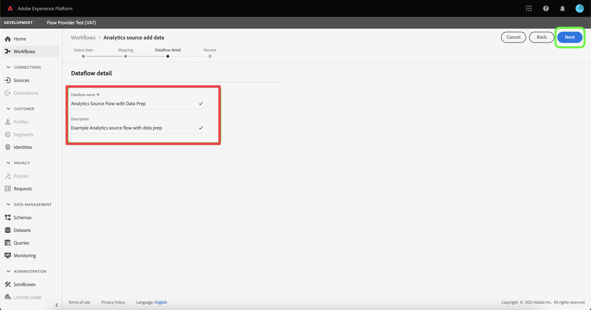

# Ingérer et utiliser des données à partir d’Adobe Analytics classique

Ce guide de démarrage rapide explique comment utiliser les données collectées par Adobe Analytics dans Customer Journey Analytics.

>[!PREREQUISITES]
>
>Vous disposez d’une licence Adobe Analytics et l’avez déployée sur un ou plusieurs de vos sites Web, en utilisant l’une des méthodes de mise en œuvre documentées :
>
>- [Mise en œuvre d’Analytics à l’aide d’Experience Platform Edge](https://experienceleague.adobe.com/docs/analytics/implementation/aep-edge/overview.html?lang=fr)
>
>- [Mise en œuvre d’Analytics à l’aide de l’extension Adobe Analytics](https://experienceleague.adobe.com/docs/analytics/implementation/launch/overview.html?lang=fr)
>
>- [Mise en œuvre d’Analytics à l’aide de JavaScript](https://experienceleague.adobe.com/docs/analytics/implementation/js/overview.html?lang=fr)

Pour ce faire, effectuez les opérations suivantes :

- **Configurer un connecteur source Adobe Analytics** dans Adobe Experience Platform. Cela permet d’ingérer les données Adobe Analytics actuelles dans un jeu de données d’Adobe Experience Platform.

- **Configurer une connexion** dans Customer Journey Analytics. Cette connexion doit (au moins) inclure le jeu de données Adobe Experience Platform.

- **Configurer une vue de données** dans Customer Journey Analytics pour définir les mesures et les dimensions à utiliser dans Analysis Workspace.

- **Configurer un projet** dans Customer Journey Analytics pour créer des rapports et des visualisations.

>[!NOTE]
>
>Il s’agit d’un guide simplifié sur la manière d’ingérer des données à l’aide du connecteur source Adobe Analytics et de les utiliser dans Customer Journey Analytics. Il est vivement recommandé d’étudier les informations supplémentaires lorsqu’elles sont mentionnées.

## Configurer un connecteur source Adobe Analytics

Le connecteur source Adobe Analytics vous permet d’importer les données des suites de rapports Adobe Analytics dans Adobe Experience Platform.

Créer un connecteur source Adobe Analytics :

1. Dans l’interface utilisateur de Platform, sélectionnez **[!UICONTROL Sources]** dans le rail de gauche.

2. Sélectionnez **[!UICONTROL Applications Adobe]** dans la liste des [!UICONTROL CATÉGORIES].

3. Sélectionnez **[!UICONTROL Configurer]** ou **[!UICONTROL Ajouter des données]** dans la mosaïque Adobe Analytics.

   

4. Sélectionnez **[!UICONTROL Suite de rapports]**. Dans la liste des suites de rapports, sélectionnez celle que vous souhaitez utiliser.

   

   Sélectionnez **[!UICONTROL Suivant]**.

5. Sélectionnez **[!UICONTROL Schéma par défaut]** comme [!UICONTROL Schéma cible]. Adobe Experience Platform crée automatiquement le schéma et le jeu de données correspondant pour mapper tous les champs standard de la suite de rapports Adobe Analytics sélectionnée.

   

   Sélectionnez **[!UICONTROL Suivant]**.

6. Nommez le flux de données et (facultatif) fournissez une description.

   

   Sélectionnez **[!UICONTROL Suivant]**.

7. Vérifiez la connexion et sélectionnez **[!UICONTROL Terminer]**.

   

Une fois la connexion créée, le flux de données est automatiquement créé pour renseigner un jeu de données avec les données Adobe Analytics de votre suite de rapports, y compris l’ingestion de 13 mois de données historiques pour les environnements de test de production. (Notez qu’à compter du 26 avril 2023, le renvoi dans les environnements de test hors production est limité à 3 mois.)

Une fois l’ingestion initiale terminée, les données de suite de rapports Adobe Analytics sont prêtes à être utilisées par Customer Journey Analytics.

Consultez [Créer une connexion source Adobe Analytics dans l’interface utilisateur](https://experienceleague.adobe.com/docs/experience-platform/sources/ui-tutorials/create/adobe-applications/analytics.html?lang=fr) pour un tutoriel beaucoup plus complet.

## Configurer une connexion

Pour utiliser les données Adobe Experience Platform dans Customer Journey Analytics, vous devez créer une connexion comprenant les données issues de la configuration du schéma, du jeu de données et du workflow.

Une connexion vous permet d’intégrer des jeux de données d’Adobe Experience Platform dans Espace de travail. Pour générer des rapports sur ces jeux de données, vous devez d’abord établir une connexion entre les jeux de données dans Experience Platform et Espace de travail.

Créer une connexion :

1. Dans l’interface utilisateur de Customer Journey Analytics, sélectionnez **[!UICONTROL Connexions]** dans la barre de navigation supérieure.

2. Sélectionnez **[!UICONTROL Créer une connexion]**.

3. Sur l’écran [!UICONTROL Connexion sans titre] :

   Nommez et décrivez la connexion dans [!UICONTROL Paramètres de connexion].

   Sélectionnez la sandbox appropriée dans la liste [!UICONTROL Sandbox] des [!UICONTROL Paramètres des données] et sélectionnez le nombre d’événements quotidiens dans la liste [!UICONTROL Nombre moyen d’événements quotidiens].

   

   Sélectionnez **[!UICONTROL Ajouter des jeux de données]**.

   À l’étape [!UICONTROL Sélectionner des jeux de données] dans [!UICONTROL Ajouter des jeux de données] :

   - Sélectionnez le jeu de données automatiquement créé par le connecteur source Adobe Analytics et tout autre jeu de données que vous souhaitez inclure dans la connexion.

      

   - Sélectionnez **[!UICONTROL Suivant]**.
   À l’étape [!UICONTROL Paramètres des jeux de données] dans [!UICONTROL Ajouter des jeux de données] :

   - Pour chaque jeu de données :

      - Sélectionnez un [!UICONTROL ID de personne] parmi les identités disponibles et définies dans les schémas du jeu de données d’Adobe Experience Platform.

      - Sélectionnez la source de données appropriée dans la liste [!UICONTROL Type de source de données]. Si vous spécifiez **[!UICONTROL Autre]**, ajoutez une description pour la source de données.

      - Définissez **[!UICONTROL Importer toutes les nouvelles données]** et **[!UICONTROL Données existantes de renvoi du jeu de données]** selon vos préférences.

      

   - Sélectionnez **[!UICONTROL Ajouter des jeux de données]**.
   Sélectionnez **[!UICONTROL Enregistrer]**.

Consultez [Présentation des connexions](../connections/overview.md) pour plus d’informations sur la création et la gestion d’une connexion, ainsi que sur la sélection et la combinaison de jeux de données.

## Configurer une vue de données

Une vue de données est un conteneur spécifique à Customer Journey Analytics qui vous permet de déterminer comment interpréter les données d’une connexion. Elle spécifie toutes les dimensions et mesures disponibles dans Analysis Workspace et les colonnes dont ces dimensions et mesures obtiennent leurs données. Les vues de données sont définies en vue de la création de comptes rendus des performances dans Analysis Workspace.

Créer une vue de données :

1. Dans l’interface utilisateur de Customer Journey Analytics, sélectionnez **[!UICONTROL Vues de données]** dans la barre de navigation supérieure.

2. Sélectionnez **[!UICONTROL Créer une vue de données]**.

3. À l’étape [!UICONTROL Configurer] :

   Sélectionnez la connexion dans la liste [!UICONTROL Connexion].

   Nommez et décrivez (facultatif) la connexion.

   

   Sélectionnez **[!UICONTROL Enregistrer et continuer]**.

4. À l’étape [!UICONTROL Composants] :

   Ajoutez n’importe quel champ de schéma et/ou composant standard que vous voulez inclure dans les zones de composant [!UICONTROL MESURES] ou [!UICONTROL DIMENSIONS].

   

   Sélectionnez **[!UICONTROL Enregistrer et continuer]**.

5. À l’étape [!UICONTROL Paramètres] :

   

   Ne modifiez pas les paramètres et sélectionnez **[!UICONTROL Enregistrer et terminer]**.

Consultez [Présentation des vues de données](../data-views/data-views.md) pour plus d’informations sur la création et la modification d’une vue de données, sur les composants que vous pouvez utiliser dans votre vue de données et sur l’utilisation des paramètres de filtre et de session.

## Configurer un projet

Analysis Workspace est un outil de navigation flexible qui vous permet de créer rapidement des analyses et de partager des informations sur la base des données. Les projets Espace de travail vous permettent de combiner des composants de données, des tableaux et des visualisations afin d’élaborer une analyse et de la partager avec tous les membres de l’entreprise.

Créer un projet :

1. Dans l’interface utilisateur de Customer Journey Analytics, sélectionnez **[!UICONTROL Projets]** dans la barre de navigation supérieure.

2. Sélectionnez **[!UICONTROL Projets]** dans la barre de navigation de gauche.

3. Sélectionnez **[!UICONTROL Créer un projet]**.

   

   Sélectionnez **[!UICONTROL Projet vierge]**.

   

4. Sélectionnez la vue de données dans la liste.

   .

5. Commencez à faire glisser et à déposer des dimensions et des mesures dans le [!UICONTROL Tableau à structure libre] du [!UICONTROL Panneau] pour créer votre premier rapport. À titre d’exemple, faites glisser `Program Points Balance` et `Page View` comme mesures et `email` comme dimension pour obtenir un aperçu rapide des profils qui ont visité le site Web et font partie du programme de fidélité collectant des points de fidélité.

   

Consultez [Présentation d’Analysis Workspace](../analysis-workspace/home.md) pour plus d’informations sur la création de projets et d’une analyse à l’aide de composants, de visualisations et de panneaux.

>[!SUCCESS]
>
>Vous avez terminé toutes les étapes. En commençant par configurer le connecteur de source de données Adobe Analytics pour la suite de rapports, les données Adobe Analytics sont automatiquement chargées dans Adobe Experience Platform. Vous avez défini une connexion dans Customer Journey Analytics pour utiliser les données Adobe Analytics et d’autres données ingérées. La définition de la vue de données vous a permis de spécifier la dimension et les mesures à utiliser. Enfin, vous avez créé votre premier projet de visualisation et d’analyse des données.

