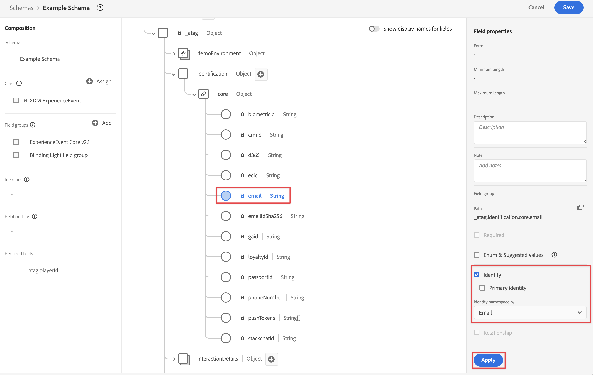

# Ingérer des données via l’API du serveur Edge Network

Ce guide de démarrage rapide explique comment ingérer des données de suivi à partir d’appareils tels que les appareils IoT, les décodeurs, les consoles de jeux et les applications de bureau directement dans Adobe Experience Platform à l’aide de l’API Adobe Experience Platform Edge Network Server et d’Edge Network. Utilisez ensuite ces données dans Customer Journey Analytics.

Pour ce faire, vous devez :

- **Configurer un schéma et un jeu de données** dans Adobe Experience Platform pour définir le modèle (schéma) des données que vous souhaitez collecter et l’emplacement de la collecte effective des données (jeu de données).

- **Définir un flux de données** pour configurer Adobe Experience Platform Edge Network afin d’acheminer les données collectées vers le jeu de données que vous avez configuré dans Adobe Experience Platform.

- **Utilisez l’API du serveur** pour envoyer directement à votre flux de données des données à partir de votre application ou jeu s’exécutant sur un bureau, une console de jeux, un appareil IoT ou un terminal.

- **Déployer et valider**. Mettez en place un environnement dans lequel vous pouvez itérer sur votre développement et, une fois que tout est validé, publiez-le en direct sur votre environnement de production.

- **Configurer une connexion** dans Customer Journey Analytics. Cette connexion doit (au moins) inclure le jeu de données Adobe Experience Platform.

- **Configurer une vue de données** dans Customer Journey Analytics pour définir les mesures et les dimensions à utiliser dans Analysis Workspace.

- **Configurer un projet** dans Customer Journey Analytics pour créer des rapports et des visualisations.

>[!NOTE]
>
>Ce guide de démarrage rapide est un guide simplifié sur la manière d’ingérer les données collectées à partir d’une application ou d’un jeu s’exécutant sur un appareil IoT, un décodeur, une console de jeux ou un bureau dans Adobe Experience Platform et de les utiliser dans Customer Journey Analytics. Il est vivement recommandé d’étudier les informations supplémentaires lorsqu’elles sont mentionnées.


## Configurer un schéma et un jeu de données

Pour ingérer des données dans Adobe Experience Platform, vous devez d’abord définir les données à collecter. Toutes les données ingérées dans Adobe Experience Platform doivent être conformes à une structure standard dénormalisée pour être reconnues et utilisées par les fonctionnalités et fonctions en aval. Le modèle de données d’expérience (XDM) est le cadre standard qui fournit une structure sous la forme de schémas.

Une fois que vous avez défini un schéma, vous utilisez un ou plusieurs jeux de données pour stocker et gérer la collecte de données. Un jeu de données est une structure de stockage et de gestion pour une collecte de données (généralement sous la forme d’un tableau) qui contient un schéma (des colonnes) et des champs (des lignes).

Toutes les données ingérées par Adobe Experience Platform doivent être conformes à un schéma prédéfini avant de pouvoir être conservées sous la forme d’un jeu de données.

### Configurer un schéma

Vous souhaitez effectuer le suivi de certaines données minimales provenant des profils qui jouent à votre jeu sur une console, par exemple l’identification, les scores, la progression et d’autres informations.
Vous devez d’abord définir un schéma qui modélise ces données.

Configurer le schéma :

1. Dans le rail de gauche de l’interface utilisateur d’Adobe Experience Platform, sélectionnez **[!UICONTROL Schémas]** sous [!UICONTROL GESTION DES DONNÉES].

1. Sélectionnez **[!UICONTROL Créer un schéma]**.
.
1. À l’étape Sélectionner une classe de l’assistant de création de schéma :

   1. Sélectionnez **[!UICONTROL Événement d’expérience]**.

      

      >[!INFO]
      >
      >    Un schéma d’événement d’expérience est utilisé pour modéliser le _comportement_ d’un profil (par exemple, nom de scène, bouton sur lequel appuyer pour ajouter au panier). Un schéma de profil individuel est utilisé pour modéliser les _attributs_ de profil (nom, e-mail, sexe, etc.).

   1. Sélectionnez **[!UICONTROL Suivant]**.


1. À l’[!UICONTROL étape Nom et révision] de l’assistant [!UICONTROL Créer un schéma], procédez comme suit :

   1. Saisissez un **[!UICONTROL nom d’affichage de schéma]** pour votre schéma et (facultatif) une **[!UICONTROL description]**.

      

   1. Sélectionnez **[!UICONTROL Terminer]**.

1. Dans l’onglet Structure de l’exemple de schéma :

   1. Sélectionnez **[!UICONTROL + Ajouter]** dans [!UICONTROL Groupes de champs].

      

      Les groupes de champs sont des collections d’objets et d’attributs réutilisables permettant d’étendre facilement le schéma.

   1. Dans la boîte de dialogue [!UICONTROL Ajouter des groupes de champs], sélectionnez le groupe de champs **[!UICONTROL Lumière aveuglante]** dans la liste. Ce groupe de champs est créé pour suivre les progrès de l’utilisateur lors de la lecture d’un jeu fictif intitulé Lumière aveuglante sur une console.

      

      Vous pouvez sélectionner le bouton Aperçu pour afficher un aperçu des champs qui font partie de ce groupe de champs, comme `scores > afterMatch`.

      

      Sélectionnez **[!UICONTROL Précédent]** pour fermer l’aperçu.

   1. Sélectionnez **[!UICONTROL Ajouter des groupes de champs]**.

1. Sélectionnez **[!UICONTROL +]** en regard du nom du schéma.

   

1. Dans le panneau [!UICONTROL Propriétés du champ], saisissez `identification` comme [!UICONTROL Nom du champ], **[!UICONTROL Identification]** comme [!UICONTROL Nom d’affichage], sélectionnez **[!UICONTROL Objet]** comme [!UICONTROL Type] et **[!UICONTROL ExperienceEvent Core v2.1]** comme [!UICONTROL Groupe de champs].

   >[!NOTE]
   >
   >Si ce groupe de champs n’est pas disponible, recherchez un autre groupe de champs contenant des champs d’identité. Ou [créez un groupe de champs](https://experienceleague.adobe.com/docs/experience-platform/xdm/ui/resources/field-groups.html?lang=fr) et [ajoutez de nouveaux champs d’identité](https://experienceleague.adobe.com/docs/experience-platform/xdm/ui/fields/identity.html?lang=fr#define-a-identity-field) (comme `ecid`, `crmId` et d’autres dont vous avez besoin) au groupe de champs et sélectionnez ce nouveau groupe de champs.

   

   L’objet d’identification ajoute des fonctionnalités d’identification au schéma. Dans votre cas, vous devez identifier les profils qui jouent à votre jeu à l’aide de l’Experience Cloud ID et de l’adresse e-mail qu’ils utilisent pour se connecter à leur console de jeux. De nombreux autres attributs sont disponibles pour effectuer le suivi de l’identification de votre personne.

   Sélectionnez **[!UICONTROL Appliquer]** pour ajouter cet objet au schéma.

1. Sélectionnez le champ **[!UICONTROL ecid]** dans l’objet d’identification que vous venez d’ajouter, puis sélectionnez **[!UICONTROL Identité]**, **[!UICONTROL Identité principale]** et **[!UICONTROL ECID]** dans la liste [!UICONTROL Espace de noms d’identité] du panneau de droite.

   

   Vous spécifiez Experience Cloud Identity comme identité principale qu’Adobe Experience Platform Identity Service peut utiliser pour combiner (regrouper) le comportement des profils avec le même ECID.

   Sélectionnez **[!UICONTROL Appliquer]**. Une icône d’empreinte digitale apparaît dans l’attribut ecid.

1. Sélectionnez le champ **[!UICONTROL e-mail]** dans l’objet d’identification que vous venez d’ajouter, puis sélectionnez **[!UICONTROL Identité]** et **[!UICONTROL E-mail]** dans la liste [!UICONTROL Espace de noms d’identité] du panneau [!UICONTROL Propriétés du champ].

   

   Vous spécifiez l’adresse e-mail en tant qu’autre identité qu’Adobe Experience Platform Identity Service peut utiliser pour combiner (regrouper) le comportement des profils.

   Sélectionnez **[!UICONTROL Appliquer]**. Une icône d’empreinte digitale apparaît dans l’attribut d’e-mail.

   Sélectionnez **[!UICONTROL Enregistrer]**.

1. Sélectionnez l’élément racine du schéma qui affiche le nom du schéma, puis sélectionnez le sélecteur de **[!UICONTROL Profil]**.

   Vous êtes invité à activer le schéma pour le profil. Une fois activé, lorsque les données sont ingérées dans des jeux de données basés sur ce schéma, ces données sont fusionnées dans le profil client en temps réel.

   Consultez [Activer le schéma à utiliser dans le profil client en temps réel](https://experienceleague.adobe.com/docs/experience-platform/xdm/tutorials/create-schema-ui.html?lang=fr#profile) pour plus d’informations.

   >[!IMPORTANT]
   >
   >    Une fois que vous avez enregistré un schéma activé pour le profil, il ne peut plus être désactivé pour le profil.

   

1. Sélectionnez **[!UICONTROL Enregistrer]** pour enregistrer le schéma.

Vous avez créé un schéma minimal qui modélise les données que vous pouvez capturer à partir de votre jeu. Le schéma permet d’identifier les profils à l’aide d’Experience Cloud Identity et de l’adresse e-mail. En activant le schéma pour le profil, vous vous assurez que les données capturées dans le jeu de la console sont ajoutées au profil client en temps réel.

En regard des données de comportement, vous pouvez également capturer les données d’attribut de profil à partir de la console (par exemple, les détails des profils connectés dans la console).

Pour capturer les données de profil, vous devez :

- Créer un schéma basé sur la classe Profil XDM individuel ;

- Ajouter le groupe de champs Profil principal v2 au schéma ;

- Ajouter un objet d’identification basé sur le groupe de champs Profil principal v2 ;

- Définir Experience Cloud ID comme identifiant principal et l’adresse e-mail comme identifiant ;

- Activer le schéma pour le profil.

Consultez [Créer et modifier des schémas dans l’interface utilisateur](https://experienceleague.adobe.com/docs/experience-platform/xdm/ui/resources/schemas.html?lang=fr) pour plus d’informations sur l’ajout et la suppression de groupes de champs et de champs individuels dans un schéma.

### Configurer un jeu de données

Le schéma vous a permis de définir le modèle de données. Vous devez maintenant définir la structure pour stocker et gérer ces données à l’aide de jeux de données.

Configurer le jeu de données :

1. Dans le rail de gauche de l’interface utilisateur d’Adobe Experience Platform, sélectionnez **[!UICONTROL Jeux de données]** sous [!UICONTROL GESTION DES DONNÉES].

2. Sélectionnez **[!UICONTROL Créer un jeu de données]**.

   

3. Sélectionnez **[!UICONTROL Créer un jeu de données à partir d’un schéma]**.

   

4. Sélectionnez le schéma que vous avez créé précédemment et sélectionnez **[!UICONTROL Suivant]**.

5. Nommez le jeu de données et (facultatif) fournissez une description.

   

6. Sélectionnez **[!UICONTROL Terminer]**.

7. Sélectionnez le sélecteur de **[!UICONTROL Profil]**.

   Vous êtes invité à activer le jeu de données pour le profil. Une fois activé, le jeu de données enrichit les profils clients en temps réel avec ses données ingérées.

   >[!IMPORTANT]
   >
   >    Vous ne pouvez activer un jeu de données pour le profil que si le schéma, auquel le jeu de données adhère, est également activé pour le profil.

   

Consultez [Guide de l’interface utilisateur des jeux de données](https://experienceleague.adobe.com/docs/experience-platform/catalog/datasets/user-guide.html?lang=fr) pour plus d’informations sur l’affichage, la prévisualisation, la création et la suppression d’un jeu de données. Ainsi que l’activation d’un jeu de données pour le profil client en temps réel.

## Configurer un flux de données

Un flux de données représente la configuration côté serveur lors de l’implémentation des SDK Web et Mobile Adobe Experience Platform et de l’API du serveur Edge Network Adobe Experience Platform. Lors de la collecte de données avec les SDK Adobe Experience Platform et les API du serveur Edge Network, les données sont envoyées à Adobe Experience Platform Edge Network. Il s’agit du train de données qui détermine les services vers lesquels les données sont transférées.

Dans votre configuration, vous souhaitez que les données que vous collectez du jeu soient envoyées à votre jeu de données dans Adobe Experience Platform.

Configurer le flux de données :

1. Dans l’interface utilisateur d’Adobe Experience Platform, sélectionnez **[!UICONTROL Flux de données]** sous [!UICONTROL COLLECTE DE DONNÉES] dans le rail de gauche.

2. Sélectionnez **[!UICONTROL Nouveau flux de données]**.

3. Nommez et décrivez le flux de données. Sélectionnez le schéma dans la liste [!UICONTROL Schéma d’événement].

   

4. Sélectionnez **[!UICONTROL Enregistrer]**.

5. Sélectionnez **[!UICONTROL Ajouter un service]**.

6. Sur l’[!UICONTROL écran Ajouter un service] :

   1. Sélectionnez **[!UICONTROL Adobe Experience Platform]** dans la liste [!UICONTROL Service].

   2. Assurez-vous que l’option **[!UICONTROL Activé]** est sélectionnée.

   3. Sélectionnez le jeu de données dans la liste [!UICONTROL Jeu de données d’événement].

      

   4. Gardez les autres paramètres et sélectionnez **[!UICONTROL Enregistrer]** pour enregistrer le flux de données.

Votre flux de données est maintenant configuré pour transférer les données collectées à partir de votre jeu vers votre jeu de données dans Adobe Experience Platform.

Consultez [Présentation des flux de données](https://experienceleague.adobe.com/docs/experience-platform/datastreams/overview.html?lang=fr) pour plus d’informations sur la configuration d’un flux de données et la gestion des données sensibles.

## Utiliser l’API du serveur Edge Network

Au cours du développement de votre jeu, vous pouvez ajouter des appels pertinents à l’API Adobe Experience Platform Edge Network Server si nécessaire.

Par exemple, pour mettre à jour le score d’un lecteur, vous devez utiliser :

```
curl -X POST "https://server.adobedc.net/ee/v2/interact?dataStreamId={DATASTREAM_ID}"
-H "Authorization: Bearer {TOKEN}"
-H "x-gw-ims-org-id: {ORG_ID}"
-H "x-api-key: {API_KEY}"
-H "Content-Type: application/json"
-d '{
   "event": {
      "xdm": {
         "identityMap": {
            "Email_LC_SHA256": [
               {
                  "id": "0c7e6a405862e402eb76a70f8a26fc732d07c32931e9fae9ab1582911d2e8a3b",
                  "primary": true
               }
            ]
         },
         "eventType": "game.scoreUpdate",
         "{sandbox}": {
            "scores": {
               "afterMatch": 132391",
            }
         },
         "timestamp": "2021-08-09T14:09:20.859Z"
      }
   }
}'
```

Dans l’exemple de requête POST, `{DATASTREAM_ID}` pointe vers l’identifiant de l’exemple de flux de données que vous avez configuré précédemment. `{sandbox}` est le nom unique de votre sandbox qui identifie le chemin d’accès au groupe de champs personnalisé Lumière aveuglante .

Voir [Collecte de données interactive](https://experienceleague.adobe.com/docs/experience-platform/edge-network-server-api/data-collection/interactive-data-collection.html?lang=fr) et [Collecte de données non interactive](https://experienceleague.adobe.com/docs/experience-platform/edge-network-server-api/data-collection/non-interactive-data-collection.html?lang=fr) pour plus d’informations sur l’utilisation de l’API du serveur Edge Network.

## Configurer une connexion

Pour utiliser les données Adobe Experience Platform dans Customer Journey Analytics, vous devez créer une connexion comprenant les données issues de la configuration du schéma, du jeu de données et du workflow.

Une connexion vous permet d’intégrer des jeux de données d’Adobe Experience Platform dans Espace de travail. Pour générer des rapports sur ces jeux de données, vous devez d’abord établir une connexion entre les jeux de données dans Adobe Experience Platform et Workspace.

Créer une connexion :

1. Dans l’interface utilisateur de Customer Journey Analytics, sélectionnez **[!UICONTROL Connexions]**, éventuellement à partir de **[!UICONTROL Gestion des données]** dans le menu supérieur.

2. Sélectionnez **[!UICONTROL Créer une connexion]**.

3. Sur l’écran [!UICONTROL Connexion sans titre] :

   Nommez et décrivez la connexion dans [!UICONTROL Paramètres de connexion].

   Sélectionnez la sandbox appropriée dans la liste [!UICONTROL Sandbox] des [!UICONTROL Paramètres des données] et sélectionnez le nombre d’événements quotidiens dans la liste [!UICONTROL Nombre moyen d’événements quotidiens].

   

   Sélectionnez **[!UICONTROL Ajouter des jeux de données]**.

   À l’étape [!UICONTROL Sélectionner des jeux de données] dans [!UICONTROL Ajouter des jeux de données] :

   - Sélectionnez les jeux de données que vous avez créés précédemment et/ou d’autres jeux de données pertinents que vous souhaitez inclure dans votre connexion

   - Sélectionnez **[!UICONTROL Suivant]**.

   À l’étape [!UICONTROL Paramètres des jeux de données] dans [!UICONTROL Ajouter des jeux de données] :

   - Pour chaque jeu de données :

      - Sélectionnez un [!UICONTROL ID de personne] parmi les identités disponibles et définies dans les schémas du jeu de données d’Adobe Experience Platform.

      - Sélectionnez la source de données appropriée dans la liste [!UICONTROL Type de source de données]. Si vous spécifiez **[!UICONTROL Autre]**, ajoutez une description pour la source de données.

      - Définissez **[!UICONTROL Importer toutes les nouvelles données]** et **[!UICONTROL Données existantes de renvoi du jeu de données]** selon vos préférences.

   - Sélectionnez **[!UICONTROL Ajouter des jeux de données]**.

   Sélectionnez **[!UICONTROL Enregistrer]**.

Consultez [Présentation des connexions](../connections/overview.md) pour plus d’informations sur la création et la gestion d’une connexion, ainsi que sur la sélection et la combinaison de jeux de données.

## Configurer une vue de données

Une vue de données est un conteneur spécifique à Customer Journey Analytics qui vous permet de déterminer comment interpréter les données d’une connexion. Elle spécifie toutes les dimensions et mesures disponibles dans Analysis Workspace et les colonnes dont ces dimensions et mesures obtiennent leurs données. Les vues de données sont définies en vue de la création de comptes rendus des performances dans Analysis Workspace.

Créer une vue de données :

1. Dans l’interface utilisateur de Customer Journey Analytics, sélectionnez **[!UICONTROL Vues de données]**, éventuellement à partir de **[!UICONTROL Gestion des données]** dans le menu supérieur.

2. Sélectionnez **[!UICONTROL Créer une vue de données]**.

3. À l’étape [!UICONTROL Configurer] :

   Sélectionnez la connexion dans la liste [!UICONTROL Connexion].

   Nommez et décrivez (facultatif) la connexion.

   

   Sélectionnez **[!UICONTROL Enregistrer et continuer]**.

4. À l’étape [!UICONTROL Composants] :

   Ajoutez n’importe quel champ de schéma et/ou composant standard que vous voulez inclure dans les zones de composant [!UICONTROL MESURES] ou [!UICONTROL DIMENSIONS].

   Sélectionnez **[!UICONTROL Enregistrer et continuer]**.

5. À l’étape [!UICONTROL Paramètres] :

   

   Ne modifiez pas les paramètres et sélectionnez **[!UICONTROL Enregistrer et terminer]**.

Consultez [Présentation des vues de données](../data-views/data-views.md) pour plus d’informations sur la création et la modification d’une vue de données, sur les composants que vous pouvez utiliser dans votre vue de données et sur l’utilisation des paramètres de segment et de session.


## Configurer un projet

Analysis Workspace est un outil de navigation flexible qui vous permet de créer rapidement des analyses et de partager des informations sur la base des données. Les projets Espace de travail vous permettent de combiner des composants de données, des tableaux et des visualisations afin d’élaborer une analyse et de la partager avec tous les membres de l’entreprise.

Créer un projet :

1. Dans l’interface utilisateur de Customer Journey Analytics, sélectionnez **[!UICONTROL Projets]** dans le menu supérieur.

2. Sélectionnez **[!UICONTROL Projets]** dans la barre de navigation de gauche.

3. Sélectionnez **[!UICONTROL Créer un projet]**.

   

   Sélectionnez **[!UICONTROL Projet vierge]**.

   

4. Sélectionnez la vue de données dans la liste.

   .

5. Pour créer votre premier rapport, commencez à faire glisser et à déposer des dimensions et des mesures sur le [!UICONTROL Tableau à structure libre] dans le [!UICONTROL Panneau].

Consultez [Présentation d’Analysis Workspace](../analysis-workspace/home.md) pour plus d’informations sur la création de projets et d’une analyse à l’aide de composants, de visualisations et de panneaux.

>[!SUCCESS]
>
>Vous avez terminé toutes les étapes. En commençant par définir les données que vous souhaitez collecter (schéma) et où les stocker (jeu de données) dans Adobe Experience Platform. Vous avez configuré un flux de données sur Edge Network pour vous assurer que les données peuvent être transférées vers ce jeu de données. Vous avez ensuite utilisé l’API du serveur Edge Network pour envoyer ces données à votre flux de données. Vous avez défini une connexion dans Customer Journey Analytics pour utiliser vos données de jeu et d’autres données. La définition de la vue de données vous a permis de spécifier la dimension et les mesures à utiliser. Enfin, vous avez créé votre premier projet de visualisation et d’analyse des données du jeu.
