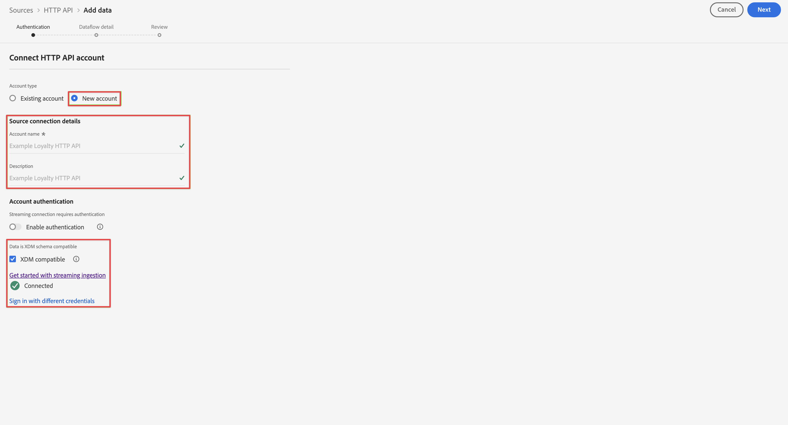

# Ingérer et utiliser des données de flux

Ce guide de démarrage rapide explique comment ingérer des données de flux dans Adobe Experience Platform, puis les utiliser dans Customer Journey Analytics.

Pour ce faire, effectuez les opérations suivantes :

- **Configurer un schéma et un jeu de données** dans Adobe Experience Platform pour définir le modèle (schéma) des données que vous souhaitez collecter et l’emplacement de la collecte effective des données (jeu de données).

- **Utiliser le connecteur source d’API HTTP** pour diffuser facilement les données dans le jeu de données configuré dans Adobe Experience Platform.

- **Configurer une connexion** dans Customer Journey Analytics. Cette connexion doit (au moins) inclure le jeu de données Adobe Experience Platform.

- **Configurer une vue de données** dans Customer Journey Analytics pour définir les mesures et les dimensions à utiliser dans Analysis Workspace.

- **Configurer un projet** dans Customer Journey Analytics pour créer des rapports et des visualisations.


>[!NOTE]
>
>Il s’agit d’un guide simplifié sur la manière d’ingérer des données de flux dans Adobe Experience Platform et de les utiliser dans Customer Journey Analytics. Il est vivement recommandé d’étudier les informations supplémentaires lorsqu’elles sont mentionnées.

## Configurer un schéma et un jeu de données

Pour ingérer des données dans Adobe Experience Platform, vous devez d’abord définir les données à collecter. Toutes les données ingérées dans Adobe Experience Platform doivent être conformes à une structure standard dénormalisée pour être reconnues et utilisées par les fonctionnalités et fonctions en aval. Le modèle de données d’expérience (XDM) est le framework standard qui fournit cette structure sous la forme de schémas.

Une fois que vous avez défini un schéma, vous utilisez un ou plusieurs jeux de données pour stocker et gérer la collecte de données. Un jeu de données est une structure de stockage et de gestion pour la collecte de données, généralement sous la forme d’un tableau, qui contient un schéma (des colonnes) et des champs (des lignes).

Toutes les données ingérées par Adobe Experience Platform doivent être conformes à un schéma prédéfini avant de pouvoir être conservées sous la forme d’un jeu de données.

### Configurer un schéma

Dans ce démarrage rapide, vous devez collecter des données de fidélité, par exemple l’identifiant de fidélité, les points de fidélité et le statut de fidélité.
Pour cela, vous devez d’abord définir un schéma qui modélise ces données.

Configurer le schéma :

1. Dans le rail de gauche de l’interface utilisateur d’Adobe Experience Platform, sélectionnez **[!UICONTROL Schémas]** sous [!UICONTROL GESTION DES DONNÉES].

2. Sélectionnez **[!UICONTROL Créer un schéma]**. Sélectionnez **[!UICONTROL Profil XDM individuel]** dans la liste des options.

   

   >[!INFO]
   >
   >    Un schéma de profil individuel est utilisé pour modéliser les _attributs_ de profil (nom, e-mail, sexe, etc.). Un schéma d’événement d’expérience est utilisé pour modéliser le _comportement_ d’un profil (page vue, ajouter au panier, etc.).


3. Sur l’écran [!UICONTROL Schéma sans titre] :

   1. Saisissez un nom d’affichage pour le schéma et (facultatif) une description.

      

   2. Sélectionnez **[!UICONTROL + Ajouter]** dans [!UICONTROL Groupes de champs].

      

      Les groupes de champs sont une collection d’objets et d’attributs réutilisables permettant d’étendre facilement les schémas.

   3. Dans la boîte de dialogue [!UICONTROL Ajouter des groupes de champs], sélectionnez le groupe de champs **[!UICONTROL Informations de fidélité]** dans la liste.

      

      Vous pouvez sélectionner le bouton Aperçu pour afficher un aperçu des champs qui font partie de ce groupe de champs.

      

      Sélectionnez **[!UICONTROL Précédent]** pour fermer l’aperçu.

   4. Sélectionnez **[!UICONTROL Ajouter des groupes de champs]**.

4. Sélectionnez **[!UICONTROL +]** en regard du nom du schéma dans le panneau [!UICONTROL Structure].

   

5. Dans le panneau [!UICONTROL Propriétés du champ], saisissez `Identification` en tant que nom et **[!UICONTROL Identification]** en tant que [!UICONTROL Nom d’affichage]. Sélectionnez **[!UICONTROL Objet]** en tant que [!UICONTROL Type] et **[!UICONTROL Profil principal v2]** en tant que [!UICONTROL Groupe de champs].

   

   Cela ajoute des fonctionnalités d’identification au schéma. Dans votre cas, vous devez identifier les informations de fidélité à l’aide de l’adresse e-mail dans les données par lot.

   Sélectionnez **[!UICONTROL Appliquer]** pour ajouter cet objet au schéma.

6. Sélectionnez le champ **[!UICONTROL e-mail]** dans l’objet d’identification que vous venez d’ajouter, puis sélectionnez **[!UICONTROL Identité]** et **[!UICONTROL E-mail]** dans l’[!UICONTROL Espace de noms d’identité] du panneau [!UICONTROL Propriétés du champ].

   

   Vous spécifiez l’adresse e-mail en tant qu’identité qu’Adobe Experience Platform Identity Service peut utiliser pour combiner (regrouper) le comportement des profils.

   Sélectionnez **[!UICONTROL Appliquer]**. Une icône d’empreinte digitale apparaît dans l’attribut d’e-mail.

7. Sélectionnez le niveau racine du schéma (avec le nom du schéma), puis sélectionnez le sélecteur de **[!UICONTROL Profil]**.

   Vous êtes invité à activer le schéma pour le profil. Une fois activé, lorsque les données sont ingérées dans des jeux de données basés sur ce schéma, ces données sont fusionnées dans le profil client en temps réel.

   Consultez [Activer le schéma à utiliser dans le profil client en temps réel](https://experienceleague.adobe.com/docs/experience-platform/xdm/tutorials/create-schema-ui.html?lang=fr#profile) pour plus d’informations.

   >[!IMPORTANT]
   >
   >    Une fois que vous avez enregistré un schéma activé pour le profil, il ne peut plus être désactivé pour le profil.

   

8. Sélectionnez **[!UICONTROL Enregistrer]** pour enregistrer le schéma.

Vous avez créé un schéma minimal qui modélise les données de fidélité que vous pouvez ingérer dans Adobe Experience Platform. Le schéma permet d’identifier les profils à l’aide de l’adresse e-mail. En activant le schéma pour le profil, vous vous assurez que les données de la source de diffusion sont ajoutées au profil client en temps réel.

Consultez [Créer et modifier des schémas dans l’interface utilisateur](https://experienceleague.adobe.com/docs/experience-platform/xdm/ui/resources/schemas.html?lang=fr) pour plus d’informations sur l’ajout et la suppression de groupes de champs et de champs individuels dans un schéma.

### Configurer un jeu de données

Le schéma vous a permis de définir le modèle de données. Vous devez maintenant définir la structure pour stocker et gérer ces données. Pour ce faire, utilisez des jeux de données.

Configurer le jeu de données :

1. Dans le rail de gauche de l’interface utilisateur d’Adobe Experience Platform, sélectionnez **[!UICONTROL Jeux de données]** sous [!UICONTROL GESTION DES DONNÉES].

2. Sélectionnez **[!UICONTROL Créer un jeu de données]**.

   

3. Sélectionnez **[!UICONTROL Créer un jeu de données à partir d’un schéma]**.

   

4. Sélectionnez le schéma que vous avez créé précédemment et sélectionnez **[!UICONTROL Suivant]**.

5. Nommez le jeu de données et (facultatif) fournissez une description.

   

6. Sélectionnez **[!UICONTROL Terminer]**.

7. Sélectionnez le sélecteur de **[!UICONTROL Profil]**.

   Vous êtes invité à activer le jeu de données pour le profil. Une fois activé, le jeu de données enrichit les profils client en temps réel avec ses données ingérées.

   >[!IMPORTANT]
   >
   >    Vous ne pouvez activer un jeu de données pour le profil que si le schéma, auquel le jeu de données adhère, est également activé pour le profil.

   

Consultez [Guide de l’interface utilisateur des jeux de données](https://experienceleague.adobe.com/docs/experience-platform/catalog/datasets/user-guide.html?lang=fr) pour plus d’informations sur l’affichage, la prévisualisation, la création et la suppression d’un jeu de données. Ainsi que l’activation d’un jeu de données pour le profil client en temps réel.


## Configurer une connexion en continu d’API HTTP

Votre application source diffuse des données conformes au schéma que vous avez créé et qui ressemble à ceci.

```json
{
    ...
    "_demosystem4": {
        "identification": {
            "core": {
                "email": "abrocking0@blog.com",
                "loyaltyId": "793406",
            }
        }
    },
    "loyalty": {
        "loyaltyID": [
            "793406"
        ],
        "points": 82.16,
        "status": "Silver"
    }
    ...
}
```

Pour diffuser ces données dans le jeu de données que vous avez créé, vous devez définir un point d’entrée de flux vers lequel ces données seront envoyées. Pour ce faire, définissez un connecteur source d’API HTTP.

Créer un connecteur source d’API HTTP :

1. Dans l’interface utilisateur d’Experience Platform, sélectionnez **[!UICONTROL Sources]** sous [!UICONTROL CONNEXIONS] dans le rail de gauche.

2. Sélectionnez **[!UICONTROL Flux continu]** dans la liste [!UICONTROL CATÉGORIES].

3. Sélectionnez **Configurer** dans la mosaïque [!UICONTROL API HTTP].

   

4. À l’étape [!UICONTROL Authentification] de l’écran [!UICONTROL Ajouter des données] :

   Saisissez un nom et une description pour la connexion API HTTP.

   Sélectionnez **[!UICONTROL Compatible avec XDM]** pour indiquer que les données que vous diffusez sont compatibles avec un schéma XDM existant.

   Sélectionnez **[!UICONTROL Connexion à la source]**. Une fois la connexion établie, le message [!UICONTROL Connecté] s’affiche.

   

   Sélectionnez **[!UICONTROL Suivant]** pour continuer.

5. À l’étape [!UICONTROL Détails du flux de données] de l’écran [!UICONTROL Ajouter des données] :

   Sélectionnez **[!UICONTROL Jeu de données existant]**, sélectionnez votre jeu de données dans la liste des jeux de données et choisissez un [!UICONTROL Nom de flux de données].

   

   Sélectionnez **[!UICONTROL Suivant]**.

6. L’étape [!UICONTROL Vérification] de l’écran [!UICONTROL Ajouter des données] vous donne un aperçu de la connexion API HTTP.

   

   Sélectionnez **[!UICONTROL Terminer]**.

7. La définition finale du point d’entrée de flux continu d’API HTTP s’affiche.

   

Vous pouvez copier l’URL du point d’entrée de flux continu et l’utiliser pour configurer l’application de fidélité afin de diffuser des données dans le jeu de données de fidélité d’Adobe Experience Platform.

Consultez [Créer une connexion en continu d’API HTTP à l’aide de l’interface utilisateur](https://experienceleague.adobe.com/docs/experience-platform/sources/ui-tutorials/create/streaming/http.html?lang=fr) pour un tutoriel beaucoup plus complet expliquant comment utiliser l’authentification, comment mapper des données lorsque les données entrantes ne sont pas compatibles avec le schéma XDM et comment créer un jeu de données dans le cadre de la configuration du connecteur de diffusion en continu.


## Configurer une connexion

Pour utiliser les données Adobe Experience Platform dans Customer Journey Analytics, vous devez créer une connexion comprenant les données issues de la configuration du schéma, du jeu de données et du workflow.

Une connexion vous permet d’intégrer des jeux de données d’Adobe Experience Platform dans Espace de travail. Pour générer des rapports sur ces jeux de données, vous devez d’abord établir une connexion entre les jeux de données dans Experience Platform et Espace de travail.

Créer une connexion :

1. Dans l’interface utilisateur de Customer Journey Analytics, sélectionnez **[!UICONTROL Connexions]** dans la barre de navigation supérieure.

2. Sélectionnez **[!UICONTROL Créer une connexion]**.

3. Sur l’écran [!UICONTROL Connexion sans titre] :

   Nommez et décrivez la connexion dans [!UICONTROL Paramètres de connexion].

   Sélectionnez la sandbox appropriée dans la liste [!UICONTROL Sandbox] des [!UICONTROL Paramètres des données] et sélectionnez le nombre d’événements quotidiens dans la liste [!UICONTROL Nombre moyen d’événements quotidiens].

   

   Sélectionnez **[!UICONTROL Ajouter des jeux de données]**.

   À l’étape [!UICONTROL Sélectionner des jeux de données] dans [!UICONTROL Ajouter des jeux de données] :

   - Sélectionnez le jeu de données que vous avez créé précédemment (`Example Loyalty Dataset`) et tout autre jeu de données que vous souhaitez inclure dans la connexion.

      

   - Sélectionnez **[!UICONTROL Suivant]**.
   À l’étape [!UICONTROL Paramètres des jeux de données] dans [!UICONTROL Ajouter des jeux de données] :

   - Pour chaque jeu de données :

      - Sélectionnez un [!UICONTROL ID de personne] parmi les identités disponibles et définies dans les schémas du jeu de données d’Adobe Experience Platform.

      - Sélectionnez la source de données appropriée dans la liste [!UICONTROL Type de source de données]. Si vous spécifiez **[!UICONTROL Autre]**, ajoutez une description pour la source de données.

      - Définissez **[!UICONTROL Importer toutes les nouvelles données]** et **[!UICONTROL Données existantes de renvoi du jeu de données]** selon vos préférences.

      

   - Sélectionnez **[!UICONTROL Ajouter des jeux de données]**.
   Sélectionnez **[!UICONTROL Enregistrer]**.

Consultez [Présentation des connexions](../connections/overview.md) pour plus d’informations sur la création et la gestion d’une connexion, ainsi que sur la sélection et la combinaison de jeux de données.

## Configurer une vue de données

Une vue de données est un conteneur spécifique à Customer Journey Analytics qui vous permet de déterminer comment interpréter les données d’une connexion. Elle spécifie toutes les dimensions et mesures disponibles dans Analysis Workspace et les colonnes dont ces dimensions et mesures obtiennent leurs données. Les vues de données sont définies en vue de la création de comptes rendus des performances dans Analysis Workspace.

Créer une vue de données :

1. Dans l’interface utilisateur de Customer Journey Analytics, sélectionnez **[!UICONTROL Vues de données]** dans la barre de navigation supérieure.

2. Sélectionnez **[!UICONTROL Créer une vue de données]**.

3. À l’étape [!UICONTROL Configurer] :

   Sélectionnez la connexion dans la liste [!UICONTROL Connexion].

   Nommez et décrivez (facultatif) la connexion.

   

   Sélectionnez **[!UICONTROL Enregistrer et continuer]**.

4. À l’étape [!UICONTROL Composants] :

   Ajoutez n’importe quel champ de schéma et/ou composant standard que vous voulez inclure dans les zones de composant [!UICONTROL MESURES] ou [!UICONTROL DIMENSIONS].

   

   Sélectionnez **[!UICONTROL Enregistrer et continuer]**.

5. À l’étape [!UICONTROL Paramètres] :

   

   Ne modifiez pas les paramètres et sélectionnez **[!UICONTROL Enregistrer et terminer]**.

Consultez [Présentation des vues de données](../data-views/data-views.md) pour plus d’informations sur la création et la modification d’une vue de données, sur les composants que vous pouvez utiliser dans votre vue de données et sur l’utilisation des paramètres de filtre et de session.


## Configurer un projet

Analysis Workspace est un outil de navigation flexible qui vous permet de créer rapidement des analyses et de partager des informations sur la base des données. Les projets Espace de travail vous permettent de combiner des composants de données, des tableaux et des visualisations afin d’élaborer une analyse et de la partager avec tous les membres de l’entreprise.

Créer un projet :

1. Dans l’interface utilisateur de Customer Journey Analytics, sélectionnez **[!UICONTROL Projets]** dans la barre de navigation supérieure.

2. Sélectionnez **[!UICONTROL Projets]** dans la barre de navigation de gauche.

3. Sélectionnez **[!UICONTROL Créer un projet]**.

   

   Sélectionnez **[!UICONTROL Projet vierge]**.

   

4. Sélectionnez la vue de données dans la liste.

   .

5. Commencez à faire glisser et à déposer des dimensions et des mesures dans le [!UICONTROL Tableau à structure libre] du [!UICONTROL Panneau] pour créer votre premier rapport. À titre d’exemple, faites glisser `Program Points Balance` et `Page View` comme mesures et `email` comme dimension pour obtenir un aperçu rapide des profils qui ont visité le site Web et font partie du programme de fidélité collectant des points de fidélité.

   

Consultez [Présentation d’Analysis Workspace](../analysis-workspace/home.md) pour plus d’informations sur la création de projets et d’une analyse à l’aide de composants, de visualisations et de panneaux.

>[!SUCCESS]
>
>Vous avez terminé toutes les étapes. En commençant par définir les données de fidélité que vous souhaitez collecter (schéma) et où les stocker (jeu de données) dans Adobe Experience Platform, vous avez configuré un connecteur source d’API HTTP pour diffuser directement les données de fidélité dans le jeu de données. La définition de la vue de données vous a permis de spécifier la dimension et les mesures à utiliser. Enfin, vous avez créé votre premier projet de visualisation et d’analyse des données.
