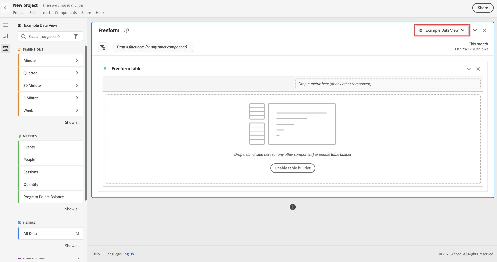

# Ingestion et utilisation de données de diffusion en continu

Ce guide de démarrage rapide explique comment ingérer des données en continu dans Adobe Experience Platform, puis les utiliser dans Customer Journey Analytics.

Pour ce faire, vous devez :

- **Configuration d’un schéma et d’un jeu de données** dans Adobe Experience Platform pour définir le modèle (schéma) des données que vous souhaitez collecter et l’emplacement où les collecter réellement (jeu de données).

- **Utilisation du connecteur source d’API HTTP** pour diffuser facilement vos données dans le jeu de données configuré dans Adobe Experience Platform.

- **Configurer une connexion** en Customer Journey Analytics. Cette connexion doit (au moins) inclure votre jeu de données Adobe Experience Platform.

- **Configuration d’une vue de données** dans Customer Journey Analytics pour définir les mesures et les dimensions à utiliser dans Analysis Workspace.

- **Configuration d’un projet** dans Customer Journey Analytics pour créer des rapports et des visualisations.


>[!NOTE]
>
>Il s’agit d’un guide simplifié sur la manière d’ingérer des données en continu dans Adobe Experience Platform et de les utiliser dans Customer Journey Analytics. Il est vivement recommandé d’étudier les informations supplémentaires lorsqu’elles y sont référencées.

## Configuration d’un schéma et d’un jeu de données

Pour ingérer des données dans Adobe Experience Platform, vous devez d’abord définir les données à collecter. Toutes les données ingérées dans Adobe Experience Platform doivent être conformes à une structure standard dénormalisée pour être reconnues et manipulées par les fonctionnalités et fonctionnalités en aval. Le modèle de données d’expérience (XDM) est la structure standard qui fournit cette structure sous la forme de schémas.

Une fois que vous avez défini un schéma, vous utilisez un ou plusieurs jeux de données pour stocker et gérer la collecte de données. Un jeu de données est une structure de stockage et de gestion pour la collecte de données, généralement sous la forme d&#39;un tableau, qui contient un schéma (des colonnes) et des champs (des lignes).

Toutes les données ingérées dans Adobe Experience Platform doivent être conformes à un schéma prédéfini avant de pouvoir être conservées en tant que jeu de données.

### Configuration d’un schéma

Pour ce démarrage rapide, vous souhaitez collecter des données de fidélité, par exemple l’identifiant de fidélité, les points de fidélité et l’état de fidélité.
Pour cela, vous devez d’abord définir un schéma qui modélise ces données.

Pour configurer votre schéma :

1. Dans l’interface utilisateur de Adobe Experience Platform, dans le rail de gauche, sélectionnez **[!UICONTROL Schémas]** dans [!UICONTROL GESTION DES DONNÉES].

2. Sélectionner **[!UICONTROL Créer un schéma]**. Sélectionner **[!UICONTROL XDM Individual Profile]** dans la liste des options.

   

   >[!INFO]
   >
   >    Un schéma de profil individuel est utilisé pour modéliser le profil. _Attributs_ (nom, email, genre, etc.). Un schéma d’événement d’expérience est utilisé pour modéliser la variable _comportement_ d’un profil (comme une page vue, ajouter au panier).


3. Dans le [!UICONTROL Schéma sans titre] écran :

   1. Saisissez un nom d’affichage pour votre schéma et (facultatif) une description.

      

   2. Sélectionner **[!UICONTROL + Ajouter]** in [!UICONTROL Groupes de champs].

      

      Les groupes de champs sont une collection d’objets et d’attributs réutilisables qui vous permet d’étendre facilement vos schémas.

   3. Dans le [!UICONTROL Ajouter des groupes de champs] , sélectionnez **[!UICONTROL Détails de fidélité]** groupe de champs de la liste.

      

      Vous pouvez sélectionner le bouton Aperçu pour afficher un aperçu des champs qui font partie de ce groupe de champs.

      

      Sélectionner **[!UICONTROL Précédent]** pour fermer l’aperçu.

   4. Sélectionner **[!UICONTROL Ajouter des groupes de champs]**.

4. Sélectionner **[!UICONTROL +]** en regard de votre nom de schéma dans la variable [!UICONTROL Structure] du panneau.

   

5. Dans le [!UICONTROL Propriétés du champ] panneau, entrée `Identification` comme nom, **[!UICONTROL Identification]** comme la propriété [!UICONTROL Nom d’affichage], sélectionnez **[!UICONTROL Objet]** comme la propriété [!UICONTROL Type] et sélectionnez **[!UICONTROL Profile Core v2]** comme la propriété [!UICONTROL Groupe de champs].

   

   Cela ajoute des fonctionnalités d’identification à votre schéma. Dans votre cas, vous souhaitez identifier les informations de fidélité à l’aide de l’adresse électronique dans vos données de lot.

   Sélectionner **[!UICONTROL Appliquer]** pour ajouter cet objet à votre schéma.

6. Sélectionnez la **[!UICONTROL email]** dans l’objet d’identification que vous venez d’ajouter, puis sélectionnez **[!UICONTROL Identité]** et **[!UICONTROL Email]** de la [!UICONTROL Espace de noms d’identité] dans le [!UICONTROL Propriétés du champ] du panneau.

   

   Vous spécifiez l’adresse électronique comme identité que le service Adobe Experience Platform Identity peut utiliser pour combiner (assembler) le comportement des profils.

   Sélectionner **[!UICONTROL Appliquer]**. Une icône d’empreinte digitale apparaît dans l’attribut email.

7. Sélectionnez le niveau racine de votre schéma (avec le nom du schéma), puis sélectionnez l’option **[!UICONTROL Profil]** changer.

   Vous êtes invité à activer le schéma pour le profil. Une fois activées, lorsque les données sont ingérées dans des jeux de données basés sur ce schéma, ces données sont fusionnées dans le profil client en temps réel.

   Voir [Activation du schéma à utiliser dans Real-time Customer Profile](https://experienceleague.adobe.com/docs/experience-platform/xdm/tutorials/create-schema-ui.html?lang=en#profile) pour plus d’informations.

   >[!IMPORTANT]
   >
   >    Une fois que vous avez enregistré un schéma activé pour le profil, il ne peut plus être désactivé pour le profil.

   

8. Sélectionner **[!UICONTROL Enregistrer]** pour enregistrer votre schéma.

Vous avez créé un schéma minimal qui modélise les données de fidélité que vous pouvez ingérer dans Adobe Experience Platform . Le schéma permet d&#39;identifier les profils à l&#39;aide de l&#39;adresse email. En activant le schéma pour le profil, vous vous assurez que les données de votre source de diffusion en continu sont ajoutées au profil client en temps réel.

Voir [Création et modification de schémas dans l’interface utilisateur](https://experienceleague.adobe.com/docs/experience-platform/xdm/ui/resources/schemas.html?lang=fr) pour plus d’informations sur l’ajout et la suppression de groupes de champs et de champs individuels dans un schéma.

### Configuration d’un jeu de données

Avec votre schéma, vous avez défini votre modèle de données. Vous devez maintenant définir le concept pour stocker et gérer ces données. Cela se fait par le biais de jeux de données.

Pour configurer votre jeu de données :

1. Dans l’interface utilisateur de Adobe Experience Platform, dans le rail de gauche, sélectionnez **[!UICONTROL Jeux de données]** dans [!UICONTROL GESTION DES DONNÉES].

2. Sélectionner **[!UICONTROL Création d’un jeu de données]**.

   

3. Sélectionnez **[!UICONTROL Créer un jeu de données à partir d&#39;un schéma]**.

   

4. Sélectionnez le schéma que vous avez créé précédemment et sélectionnez **[!UICONTROL Suivant]**.

5. Nommez votre jeu de données et (facultatif) fournissez une description.

   

6. Sélectionner **[!UICONTROL Terminer]**.

7. Sélectionnez la **[!UICONTROL Profil]** changer.

   Vous êtes invité à activer le jeu de données pour le profil. Une fois activé, le jeu de données enrichit les profils client en temps réel avec ses données ingérées.

   >[!IMPORTANT]
   >
   >    Vous ne pouvez activer un jeu de données que pour le profil lorsque le schéma auquel le jeu de données adhère est également activé pour le profil.

   

Voir [Guide de l’interface utilisateur des jeux de données](https://experienceleague.adobe.com/docs/experience-platform/catalog/datasets/user-guide.html?lang=fr) pour plus d’informations sur l’affichage, la prévisualisation, la création et la suppression d’un jeu de données. Comment activer un jeu de données pour Real-time Customer Profile.


## Configuration d’une connexion en continu d’API HTTP

Votre application source diffuse des données conformes au schéma que vous avez créé et qui ressemble à ça.

```json
{
    ...
    "_demosystem4": {
        "identification": {
            "core": {
                "email": "abrocking0@blog.com",
                "loyaltyId": "793406",
            }
        }
    },
    "loyalty": {
        "loyaltyID": [
            "793406"
        ],
        "points": 82.16,
        "status": "Silver"
    }
    ...
}
```

Pour diffuser ces données dans le jeu de données que vous avez créé, vous devez définir un point de terminaison de diffusion pour que ces données soient envoyées. Pour ce faire, définissez un connecteur source d’API HTTP.

Pour créer un connecteur source d’API HTTP :

1. Dans l’interface utilisateur de l’Experience Platform, sélectionnez **[!UICONTROL Sources]** under [!UICONTROL CONNEXIONS] dans le rail de gauche.

2. Sélectionner **[!UICONTROL Diffusion en continu]** de la liste [!UICONTROL CATÉGORIES].

3. Sélectionner **Configuration** dans le [!UICONTROL API HTTP] mosaïque.

   

4. Dans le [!UICONTROL Authentification] de la [!UICONTROL Ajouter des données] écran :

   Saisissez un nom et une description pour votre connexion API HTTP.

   Sélectionner **[!UICONTROL Compatible XDM]** pour indiquer que les données que vous diffusez sont compatibles avec un schéma XDM existant.

   Sélectionner **[!UICONTROL Connexion à la source]**. Une fois la connexion établie, vous verrez [!UICONTROL Connecté].

   

   Sélectionnez **[!UICONTROL Suivant]** pour continuer.

5. Dans le [!UICONTROL Détails du flux de données] de la [!UICONTROL Ajouter des données] écran :

   Sélectionner **[!UICONTROL Jeu de données existant]**, sélectionnez votre jeu de données dans la liste des jeux de données et nommez votre [!UICONTROL Nom du flux de données].

   

   Sélectionnez **[!UICONTROL Suivant]**.

6. Le [!UICONTROL Réviser] de la [!UICONTROL Ajouter des données] vous donne un aperçu de la connexion à l’API HTTP.

   

   Sélectionner **[!UICONTROL Terminer]**.

7. La définition finale de votre point de terminaison de diffusion en continu d’API HTTP s’affiche.

   

Vous pouvez copier l’URL du point de terminaison de la diffusion en continu et l’utiliser pour configurer votre application de fidélité afin de diffuser des données dans le jeu de données de fidélité de Adobe Experience Platform.

Voir [Création d’une connexion en continu à l’API HTTP à l’aide de l’interface utilisateur](https://experienceleague.adobe.com/docs/experience-platform/sources/ui-tutorials/create/streaming/http.html?lang=en) pour un tutoriel beaucoup plus complet expliquant comment utiliser l’authentification, comment mapper des données lorsque vos données entrantes ne sont pas compatibles avec votre schéma XDM et comment créer un nouveau jeu de données dans le cadre de la configuration du connecteur de diffusion en continu.


## Configurer une connexion

Pour utiliser les données Adobe Experience Platform dans Customer Journey Analytics, vous créez une connexion qui inclut les données résultant de la configuration de votre schéma, de votre jeu de données et de votre workflow.

Une connexion vous permet d’intégrer des jeux de données d’Adobe Experience Platform dans Espace de travail. Pour générer des rapports sur ces jeux de données, vous devez d’abord établir une connexion entre les jeux de données dans Adobe Experience Platform et Workspace.

Pour créer votre connexion :

1. Dans l’interface utilisateur du Customer Journey Analytics, sélectionnez **[!UICONTROL Connexions]** dans le volet de navigation supérieur.

2. Sélectionner **[!UICONTROL Créer une connexion]**.

3. Dans le [!UICONTROL Connexion sans titre] écran :

   Nommez et décrivez votre connexion dans [!UICONTROL Paramètres de connexion].

   Sélectionnez l’environnement de test approprié dans la [!UICONTROL Sandbox] list in [!UICONTROL Paramètres des données] et sélectionnez le nombre d’événements quotidiens dans la [!UICONTROL Nombre moyen d’événements quotidiens] liste.

   

   Sélectionner **[!UICONTROL Ajout de jeux de données]**.

   Dans le [!UICONTROL Sélectionner des jeux de données] étape [!UICONTROL Ajout de jeux de données]:

   - Sélectionnez le jeu de données que vous avez créé précédemment (`Example Loyalty Dataset`) et tout autre jeu de données que vous souhaitez inclure dans votre connexion.

      

   - Sélectionnez **[!UICONTROL Suivant]**.
   Dans le [!UICONTROL Paramètres des jeux de données] étape [!UICONTROL Ajout de jeux de données]:

   - Pour chaque jeu de données :

      - Sélectionnez une [!UICONTROL ID de personne] à partir des identités disponibles définies dans les schémas du jeu de données dans Adobe Experience Platform.

      - Sélectionnez la source de données appropriée dans la [!UICONTROL Type de source de données] liste. Si vous spécifiez **[!UICONTROL Autre]**, puis ajoutez une description pour votre source de données.

      - Définir **[!UICONTROL Importer toutes les nouvelles données]** et **[!UICONTROL Renvoi de données existantes]** selon vos préférences.

      

   - Sélectionner **[!UICONTROL Ajout de jeux de données]**.
   Sélectionnez **[!UICONTROL Enregistrer]**.

Voir [Présentation des connexions](../connections/overview.md) pour plus d’informations sur la création et la gestion d’une connexion, ainsi que sur la sélection et la combinaison de jeux de données.

## Configuration d’une vue de données

Une vue de données est un conteneur spécifique à Customer Journey Analytics qui vous permet de déterminer comment interpréter les données d’une connexion. Elle spécifie toutes les dimensions et mesures disponibles dans Analysis Workspace et les colonnes dont ces dimensions et mesures obtiennent leurs données. Les vues de données sont définies en vue de la création de comptes rendus des performances dans Analysis Workspace.

Pour créer votre vue de données :

1. Dans l’interface utilisateur du Customer Journey Analytics, sélectionnez **[!UICONTROL Vues des données]** dans le volet de navigation supérieur.

2. Sélectionner **[!UICONTROL Créer une vue de données]**.

3. Dans le [!UICONTROL Configurer] étape :

   Sélectionnez votre connexion dans le [!UICONTROL Connexion] liste.

   Nom et (éventuellement) description de la connexion.

   

   Sélectionner **[!UICONTROL Enregistrer et continuer]**.

4. Dans le [!UICONTROL Composants] étape :

   Ajoutez tout champ de schéma et/ou composant standard que vous souhaitez inclure au [!UICONTROL MESURES] ou [!UICONTROL Dimensions] des zones de composant.

   

   Sélectionner **[!UICONTROL Enregistrer et continuer]**.

5. Dans le [!UICONTROL Paramètres] étape :

   Paramètres de la 

   Laissez les paramètres tels quels et sélectionnez **[!UICONTROL Enregistrer et terminer]**.

Voir [Présentation des vues des données](../data-views/data-views.md) pour plus d’informations sur la création et la modification d’une vue de données, sur les composants que vous pouvez utiliser dans votre vue de données et sur l’utilisation des paramètres de filtre et de session.


## Configuration d’un projet

Analysis Workspace est un outil de navigation flexible qui vous permet de créer rapidement des analyses et de partager des informations en fonction de vos données. Vous utilisez des projets Workspace pour combiner des composants de données, des tableaux et des visualisations afin de concevoir votre analyse et de la partager avec toute personne de votre entreprise.

Pour créer votre projet :

1. Dans l’interface utilisateur du Customer Journey Analytics, sélectionnez **[!UICONTROL Projets]** dans le volet de navigation supérieur.

2. Sélectionner **[!UICONTROL Projets]** dans le volet de navigation de gauche.

3. Sélectionner **[!UICONTROL Créer un projet]**.

   

   Sélectionner **[!UICONTROL Projet vierge]**.

   

4. Sélectionnez votre vue de données dans la liste.

   .

5. Commencez à faire glisser et à déposer des dimensions et des mesures sur le [!UICONTROL Tableau à structure libre] dans le [!UICONTROL Panneau] pour créer votre premier rapport. À titre d’exemple, faites glisser `Program Points Balance` et `Page View` comme mesures et `email` comme dimension pour obtenir un aperçu rapide des profils qui ont visité votre site web et font partie du programme de fidélité collectant des points de fidélité.

   

Voir [Présentation d’Analysis Workspace](../analysis-workspace/home.md) pour plus d’informations sur la création de projets et la création de votre analyse à l’aide de composants, de visualisations et de panneaux.

>[!SUCCESS]
>
>Vous avez terminé toutes les étapes. En commençant par définir les données de fidélité que vous souhaitez collecter (schéma) et où les stocker (jeu de données) dans Adobe Experience Platform, vous avez configuré un connecteur source d’API HTTP pour diffuser directement les données de fidélité dans le jeu de données. Votre définition de vue de données vous a permis de spécifier la dimension et les mesures à utiliser. Vous avez enfin créé votre premier projet qui visualise et analyse vos données.
