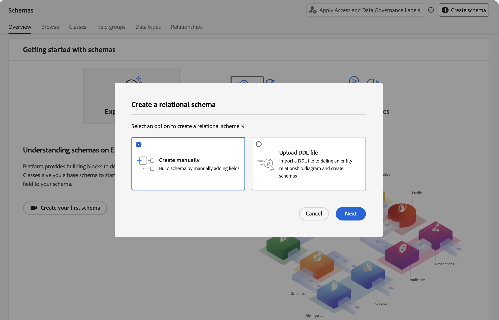
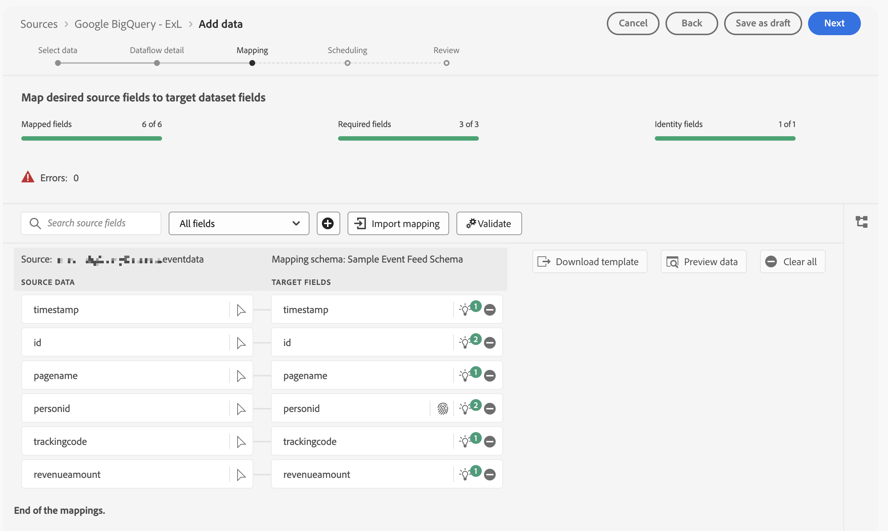
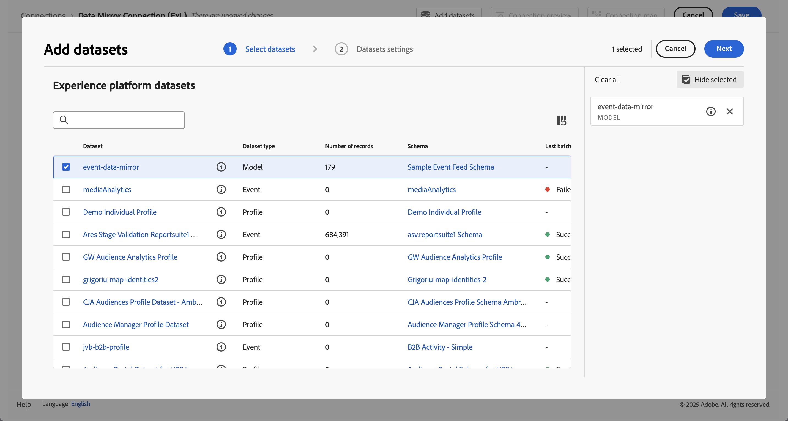

# Mettre en miroir et utiliser des données relationnelles

{{release-limited-testing}}

Ce guide de démarrage rapide explique comment utiliser [Experience Platform Data Mirror for Customer Journey Analytics](data-mirror.md) pour mettre en miroir des données relationnelles à partir d’une solution native d’entrepôt de données dans Adobe Experience Platform. Utilisez ensuite ces données dans Customer Journey Analytics.

Pour accomplir ce cas d’utilisation, vous devez :

* **Utilisez une solution native d’entrepôt de données** pour stocker les données que vous souhaitez mettre en miroir dans Experience Platform. Utilisez ensuite ces données dans Customer Journey Analytics pour créer des rapports et les analyser.

* **Configurer un schéma** dans Experience Platform pour définir le modèle (schéma) des données que vous souhaitez mettre en miroir.

* **Utilisez un connecteur source** dans Experience Platform pour placer les données mises en miroir dans un jeu de données.

* **Configurer une connexion** dans Customer Journey Analytics. Cette connexion doit (au moins) inclure votre jeu de données relationnel Experience Platform.

* **Configurer une vue de données** dans Customer Journey Analytics pour définir les mesures et les dimensions à utiliser dans Analysis Workspace.

* **Configurer un projet** dans Customer Journey Analytics pour créer des rapports et des visualisations.

Experience Platform Data Mirror for Customer Journey Analytics nécessite des schémas relationnels.


>[!NOTE]
>
>Ce guide de démarrage rapide est un guide simplifié sur la manière de mettre en miroir des données relationnelles dans Adobe Experience Platform et de les utiliser dans Customer Journey Analytics. Il est vivement recommandé d’étudier les informations supplémentaires lorsqu’elles sont mentionnées.

{{relational-model-based}}

## Utiliser une solution native d’entrepôt de données

Ce guide de démarrage rapide utilise [[!DNL Google BigQuery]](datawarehouse.md#google-bigquery) comme solution native de l’entrepôt de données. D’autres [solutions prises en charge](datawarehouse.md) sont [[!DNL Snowflake]](datawarehouse.md#snowflake) et [[!DNL Azure Databricks]](datawarehouse.md#azure-databricks).

Dans [!DNL Google BigQuery], les exemples de données suivants sont stockés et mis à jour régulièrement dans une table nommée **[!UICONTROL eventdata]**.

+++ Détails des exemples de données d’événement

| timestamp | identifiant | pagename | personid | trackingcode | commandes | montant du chiffre d’affaires |
| :---                      |  ---: | :---              | :---            | :---          |   ---: | :---           |
| 2025-03-06T19:15:39+00:00 | 10001 | Page d’accueil | person-1abc123 | abc123 |        |                |
| 2025-03-06T19:15:39+00:00 | 10002 | page de confirmation | person-1abc123 |               | 1 | 174,25 |
| 2025-03-06T19:15:39+00:00 | 10003 | Page d’accueil | person-2def123 | def123 |        |                |
| 2025-03-06T19:15:39+00:00 | 10004 | Page d’accueil | person-3ghi123 | ghi123 |        |                |
| 2025-03-06T19:15:39+00:00 | 10005 | page de confirmation | person-3ghi123 |               | 1 | 149,25 |
| 2025-03-06T19:15:39+00:00 | 10006 | Page d’accueil | person-4abc456 | abc456 |        |                |
| 2025-03-06T19:15:39+00:00 | 10007 | Page d’accueil | person-5def456 | def456 |        |                |
| 2025-03-06T19:15:39+00:00 | 10008 | Page d’accueil | person-6ghi456 | ghi456 |        |                |
| 2025-03-06T19:15:39+00:00 | 10009 | page de confirmation | person-6ghi456 |               | 1 | 159,25 |
| 2025-03-06T19:15:39+00:00 | 10010 | Page d’accueil | person-7abc789 | abc789 |        |                |
| 2025-03-06T19:15:39+00:00 | 10011 | Page d’accueil | person-8def789 | def789 |        |                |
| 2025-03-06T19:15:39+00:00 | 10012 | Page d’accueil | person-9ghi789 | ghi789 |        |                |
| 2025-03-06T19:15:39+00:00 | 10013 | page de confirmation | person-9ghi789 |               | 1 | 124,25 |
| 2025-03-06T19:15:39+00:00 | 10014 | Page d’accueil | person-10abc987 | abc987 |        |                |
| 2025-03-06T19:15:39+00:00 | 10015 | Page d’accueil | person-11def987 | def987 |        |                |
| 2025-03-06T19:15:39+00:00 | 10016 | Page d’accueil | person-12ghi987 | ghi987 |        |                |
| 2025-03-06T19:15:39+00:00 | 10017 | Page d’accueil | person-13abc654 | abc654 |        |                |
| 2025-03-06T19:15:39+00:00 | 10018 | Page d’accueil | person-14def654 | def654 |        |                |
| 2025-03-06T19:15:39+00:00 | 10019 | Page d’accueil | person-15ghi654 | ghi654 |        |                |
| 2025-03-06T19:15:39+00:00 | 10020 | page de confirmation | person-15ghi654 |               | 1 | 174,25 |

+++

Les données sont stockées dans une table de base de données avec un schéma associé. Pour inspecter la table de base de données :

1. Connectez-vous à Google BigQuery.
1. Sélectionnez **[!UICONTROL BigQuery]** > **[!UICONTROL Studio]**.
1. Sélectionnez votre projet, jeu de données et tableau. Dans l’onglet **[!UICONTROL Schéma]**, vous voyez un aperçu du schéma pour les données d’événement.

   

Pour inspecter les données :

1. Sélectionnez **[!UICONTROL Requête]**.
1. Exécutez un exemple de requête dans le requêteur, où `project` est le nom de votre projet et `datasets` est le nom de vos jeux de données :

   ```sql
   SELECT * FROM `project.datasets.eventdata` LIMIT 100
   ```

   

Pour Experience Platform Data Mirror for Customer Journey Analytics, les tables de votre solution native d’entrepôt de données doivent être activées pour l’historique des modifications. Pour vérifier que la table est activée pour l&#39;historique des modifications :

1. Exécutez l’instruction SQL suivante dans le requêteur pour vérifier le paramètre , où `project` est le nom de votre projet et `datasets` est le nom de vos jeux de données :

   ```sql
   SELECT
      table_name,
      MAX(CASE WHEN option_name = 'enable_change_history' THEN option_value END) AS enable_change_history
   FROM `project.datasets.INFORMATION_SCHEMA.TABLE_OPTIONS`
   WHERE table_name = 'eventdata'
   GROUP BY table_name
   ORDER BY table_name;
   ```

1. Si le résultat n’est pas **[!UICONTROL TRUE]**, utilisez l’instruction SQL suivante pour activer l’historique des modifications, où `project` est le nom de votre projet et `datasets` est le nom de vos jeux de données :

   ```sql
   ALTER TABLE `project.datasets.eventdata` 
   SET OPTIONS (enable_change_history = TRUE);
   ```

Les données du tableau dans votre solution native d’entrepôt de données sont prêtes pour Experience Platform Data Mirror for Customer Journey Analytics.


## Configurer un schéma

Pour refléter les données dans Experience Platform, vous devez d’abord définir le schéma des données. Toutes les données que vous souhaitez mettre en miroir dans Experience Platform et qui utilisent Experience Platform Data Mirror for Customer Journey Analytics doivent être conformes à un schéma relationnel.

Définissez un schéma qui modélise ces données. Configurer le schéma :

1. Dans le rail de gauche de l’interface utilisateur de Adobe Experience Platform, sélectionnez **[!UICONTROL Schémas]** sous **[!UICONTROL Gestion des données]**.

1. Sélectionnez **[!UICONTROL Créer un schéma]**.
1. Dans le menu déroulant, sélectionnez **[!UICONTROL Relationnel]**.
1. Si une fenêtre contextuelle s’affiche avec la possibilité de choisir entre **[!UICONTROL Créer manuellement]** ou **[!UICONTROL Télécharger un fichier DDL]** :
   1. Sélectionnez **[!UICONTROL Créer manuellement]**.

      

   1. Sélectionnez **[!UICONTROL Suivant]**.
1. Dans l&#39;interface **[!UICONTROL Schémas]** > **[!UICONTROL Créer un schéma relationnel]** :
   1. Saisissez un **[!UICONTROL nom d’affichage du schéma]**. Par exemple : `Sample Event Feed Schema`.
   1. Saisissez une **[!UICONTROL Description]**. Par exemple : `Sample event feed schema for a relational schema`.
   1. Sélectionnez **[!UICONTROL Série temporelle]** comme **[!UICONTROL Comportement du schéma]**. Sélectionnez **[!UICONTROL Série temporelle]** pour les données basées sur une série temporelle et **[!UICONTROL Enregistrement]** pour les données basées sur un enregistrement. Le comportement définit la structure du schéma et les propriétés qui sont incluses.

      Experience Platform Data Mirror for Customer Journey Analytics est principalement utilisé pour les données de série temporelle (par exemple, les données d’événement).

      

   1. Sélectionnez **[!UICONTROL Terminer]**.

1. Dans l’interface **[!UICONTROL Schémas]** > **[!UICONTROL Exemple de schéma de flux d’événements]**, un avertissement s’affiche indiquant que les schémas relationnels prennent en charge l’ingestion en tant que lignes de modification.

   

   L’ingestion en tant que lignes de modification est également appelée capture de données de modification (CDC). Pour prendre en charge la capture de données de modification, le schéma requiert les éléments suivants :

   * Clé de Principal.
   * Descripteur de version.
   * Descripteur d’horodatage pour les données de série temporelle.

1. Sélectionnez  en regard de **[!UICONTROL Sample Event Feed Schema]** pour commencer à ajouter des champs au schéma. Ajoutez les champs suivants avec le type de données et des attributs supplémentaires au schéma.

   | Nom du champ | Nom d’affichage | Type | Attributs supplémentaires |
   |---|---|---|---|
   | `id` | `Id` | **[!UICONTROL Entier]** |  descripteur de version |
   | `orders` | `Orders` | **[!UICONTROL Entier]** | |
   | `pagename` | `Page Name` | **[!UICONTROL Chaîne]** | |
   | `personid` | `Person Id` | **[!UICONTROL Chaîne]** |  clé de Principal <br/> Identité<br/>Sélectionnez CRMID pour l’espace de noms d’identité. |
   | `revenueamount` | `Revenue Amount` | **[!UICONTROL Double]** | |
   | `timestamp` | `Timestamp` | **[!UICONTROL DateHeure]** |  descripteur d’horodatage |
   | `trackingcode` | `Tracking Code` | **[!UICONTROL Chaîne]** | |


   * Le champ **[!UICONTROL id]** est configuré comme **[!UICONTROL descripteur de version]**.

     

   * Le champ **[!UICONTROL personid]** est configuré, avec **[!UICONTROL timestamp]** comme clé de Principal **&#x200B;**. Sélectionnez  **[!UICONTROL Créer une clé primaire composite]** pour créer une clé composite.

     

     Le champ **[!UICONTROL personid]** est également configuré en tant qu’**[!UICONTROL Identité]**, avec **[!UICONTROL CRMID]** comme **[!UICONTROL Espace de noms d’identité]**.

     

   * Le champ **[!UICONTROL timestamp]** est configuré, ainsi que le champ **[!UICONTROL personid]** comme clé de Principal **&#x200B;**. Le champ **[!UICONTROL horodatage]** est également configuré en tant que **[!UICONTROL descripteur d’horodatage]**. Il vous suffit de définir un champ en tant que **[!UICONTROL descripteur d’horodatage]** pour les données relationnelles de série temporelle.

     


   Si vous avez correctement défini la clé de Principal **&#x200B;**, le descripteur de version **&#x200B;**&#x200B;et le descripteur d’horodatage **&#x200B;**, l’avertissement au-dessus de la définition du schéma disparaît.

1. Sélectionnez **[!UICONTROL Enregistrer]** pour enregistrer le schéma.


## Utiliser un connecteur source

Vous utilisez un connecteur source pour connecter la solution native de l’entrepôt de données à Experience Platform.

Dans l’interface d’Experience Platform :

1. Sélectionnez **[!UICONTROL Sources]**.
1. Sélectionnez ou recherchez **[!UICONTROL BigQuery Google]**.
1. Sélectionnez **[!UICONTROL Ajouter des données]**.

L’assistant d’ajout de données vous guide tout au long des étapes suivantes pour connecter les données du tableau de [!DNL Google BigQuery] à Experience Platform.

### Authentification

À l’étape **[!UICONTROL Authentification]**, sélectionnez :

* **[!UICONTROL Compte existant]** lorsque vous disposez déjà d’une configuration de compte pour Google BigQuery. Passez à l’étape [Sélectionner les données](#select-data).
* **[!UICONTROL Nouveau compte]** lorsque vous devez vous connecter à BigQuery Google.
   1. Spécifiez un **[!UICONTROL Nom du compte]** et (facultatif) **[!UICONTROL Description]**.
   1. Sélectionnez votre **[!UICONTROL Type d’authentification]** : **[!UICONTROL Authentification de base]** ou **[!UICONTROL Authentification de service]**. Selon votre sélection, fournissez l’entrée requise.
   1. Sélectionnez **[!UICONTROL Se connecter à la source]**

      

      Votre connexion est vérifiée. Un  **[!UICONTROL Connected]** a indiqué une connexion réussie.

   1. Sélectionnez **[!UICONTROL Suivant]**.

  Consultez la documentation d’Experience Platform pour plus d’informations sur la connexion et l’authentification lorsque vous utilisez le connecteur [Azure Databricks](https://experienceleague.adobe.com/fr/docs/experience-platform/sources/connectors/databases/databricks) ou [Snowflake](https://experienceleague.adobe.com/fr/docs/experience-platform/sources/connectors/databases/snowflake).


### Sélectionner les données

À l’étape **[!UICONTROL Sélectionner des données]** :

1. Sélectionnez la table dans la liste des tables. Par exemple : **[!UICONTROL eventdata]**.

   

   Un exemple des données affichées à des fins de vérification s’affiche.

1. Sélectionnez **[!UICONTROL Suivant]** pour continuer.


### Détails du flux de données

À l’étape **[!UICONTROL Détails du flux de données]** :

1. Sélectionnez **[!UICONTROL Activer la capture de données de modification]**. Une zone d’informations **[!UICONTROL Modifier les exigences de capture de données]** s’affiche avec plus d’informations.
1. Sélectionnez **[!UICONTROL Nouveau jeu de données]** pour **[!UICONTROL Jeu de données cible]** afin de créer un jeu de données contenant les données mises en miroir.
1. Saisissez un **[!UICONTROL Nom du jeu de données de sortie]**. Par exemple : `event-data-mirror`.
1. Sélectionnez le schéma relationnel que vous avez créé précédemment dans le menu déroulant **[!UICONTROL Schéma]**. Par exemple : **[!UICONTROL Exemple de schéma de flux d’événements]**.

   

1. Spécifiez d’autres détails.
1. Sélectionnez **[!UICONTROL Suivant]**.


### Mappage

À l’étape **[!UICONTROL Mappage]** :

1. Mappez les champs . Du schéma dans Google BigQuery (**[!UICONTROL données Source]**) aux champs du schéma que vous avez défini dans Experience Platform (**[!UICONTROL champs cibles]**).

   

1. Si tous les champs sont correctement mappés, sélectionnez **[!UICONTROL Suivant]** pour continuer.


### Planification

À l’étape **[!UICONTROL Planification]** :

1. Spécifiez les paramètres **[!UICONTROL Fréquence]** et **[!UICONTROL Intervalle]** pour planifier la synchronisation des données en miroir.
1. Spécifiez l’**[!UICONTROL Heure de début]** pour le planning.

   

1. Sélectionnez **[!UICONTROL Suivant]** pour continuer.


### Réviser

À l’étape **[!UICONTROL Révision]**.

1. Vérifiez la configuration du connecteur source.

   

1. Sélectionnez **[!UICONTROL Terminer]**. Vous êtes redirigé vers le flux de données configuré.

   


## Configurer une connexion

Dans ce guide de démarrage rapide, vous créez une connexion pour utiliser les données mises en miroir d’Experience Platform. Vous pouvez également ajouter les données en miroir à une connexion existante.

Dans l’interface de Customer Journey Analytics :

1. Sélectionnez **[!UICONTROL Connexions]** dans le menu **[!UICONTROL Gestion des données]**.
1. Sélectionnez **[!UICONTROL Créer une connexion]**.
1. Spécifiez les paramètres obligatoires **[!UICONTROL Nom de la connexion]**, **[!UICONTROL Sandbox]**, **[!UICONTROL Nombre moyen d’événements quotidiens]** et d’autres paramètres facultatifs.
1. Sélectionnez **[!UICONTROL Ajouter des jeux de données]**.

   1. À l’étape **[!UICONTROL Sélectionner des jeux de données]** de **[!UICONTROL Ajouter des jeux de données]** :

      1. Sélectionnez le jeu de données contenant les données mises en miroir. Par exemple : **[!UICONTROL event-data-mirror]**. Le jeu de données a **[!UICONTROL Relationnel]** comme **[!UICONTROL Type de jeu de données]**.

         

      1. Ajoutez des jeux de données supplémentaires pertinents pour la connexion.
      1. Sélectionnez **[!UICONTROL Suivant]**.

   1. À l’étape **[!UICONTROL Paramètres des jeux de données]** de **[!UICONTROL Ajouter des jeux de données]** :

      Pour le jeu de données relationnel **[!UICONTROL event-data-mirror]**

      1. Sélectionnez **[!UICONTROL Événement]** comme **[!UICONTROL Type de jeu de données]**.
      1. Sélectionnez le champ **[!UICONTROL PersonId]** comme **[!UICONTROL ID de personne]**.
      1. **[!UICONTROL Horodatage]** est automatiquement renseigné en tant que **[!UICONTROL Horodatage]**.
      1. Sélectionnez **[!UICONTROL Autre]** comme **[!UICONTROL Type de source de données]**.
      1. Saisissez `Google BigQuery Event Data` comme **[!UICONTROL Description de la source de données]**.
      1. Spécifiez d’autres détails, tels que **[!UICONTROL Importer toutes les nouvelles données]** et **[!UICONTROL Renvoyer toutes les données existantes]**.

         

      Vous pouvez éventuellement spécifier des détails pour d’autres jeux de données.

   1. Sélectionnez **[!UICONTROL Ajouter des jeux de données]**.
1. Sélectionnez **[!UICONTROL Enregistrer]**.

Après avoir créé une [connexion](/help/connections/overview.md), vous pouvez effectuer diverses tâches de gestion. Par exemple, [sélection et combinaison de jeux de données](/help/connections/combined-dataset.md), [vérification du statut des jeux de données d’une connexion et du statut de l’ingestion des données](/help/connections/manage-connections.md) etc.


## Configurer une vue de données

Créer une vue de données :

1. Dans l’interface de Customer Journey Analytics, sélectionnez **[!UICONTROL Vues de données]**, éventuellement à partir de **[!UICONTROL Gestion des données]** dans le menu supérieur.

2. Sélectionnez **[!UICONTROL Créer une vue de données]**.

3. À l’étape **[!UICONTROL Configurer]** :

   1. Sélectionnez la connexion dans la liste **[!UICONTROL Connexion]**.

   1. Nommez et décrivez (facultatif) la connexion.

   1. Sélectionnez **[!UICONTROL Enregistrer et continuer]**.

4. À l’étape **[!UICONTROL Composants]** :

   1. Ajoutez n’importe quel champ de schéma et/ou composant standard que vous souhaitez inclure dans les zones de composant **[!UICONTROL MESURES]** ou **[!UICONTROL DIMENSIONS]**. Veillez à ajouter les champs pertinents du jeu de données contenant les données mises en miroir. Pour accéder à ces champs :

      1. Sélectionnez **[!UICONTROL Jeux de données d’événement]**.
      1. Sélectionnez **[!UICONTROL Champs ad hoc et relationnels]**.
      1. Faites glisser et déposez des champs des schémas relationnels vers **[!UICONTROL MESURES]** ou **[!UICONTROL DIMENSIONS]**.

         

   1. Définissez des champs dérivés pour les champs qui n’ont pas le type approprié, qui ne sont pas au format approprié ou que vous souhaitez modifier pour d’autres raisons. Par exemple, pour **[!UICONTROL Montant des revenus]**.

      1. Sélectionnez **[!UICONTROL Créer un champ dérivé.]**
      1. Dans l’éditeur de champs dérivés :
         1. Définissez un nouveau champ de `Revenue Amount (Numeric)`, comme ci-dessous.

            

         1. Sélectionnez **[!UICONTROL Enregistrer]**.
      1. Faites glisser le nouveau champ dérivé **[!UICONTROL Montant du chiffre d’affaires (numérique)]** et déposez-le dans **[!UICONTROL MESURES]**.

         

   1. Sélectionnez **[!UICONTROL Enregistrer et continuer]**.

5. À l’étape **[!UICONTROL Paramètres]** :

   Ne modifiez pas les paramètres et sélectionnez **[!UICONTROL Enregistrer et terminer]**.

Consultez [Présentation des vues de données](../data-views/data-views.md) pour plus d’informations sur la création et la modification d’une vue de données. Ainsi que les composants que vous pouvez utiliser dans votre vue de données et la manière d’utiliser les paramètres de segment et de session.


## Configurer un projet

Analysis Workspace est un outil de navigateur flexible qui vous permet de créer rapidement des analyses et de partager des informations basées sur vos données. Les projets Espace de travail vous permettent de combiner des composants de données, des tableaux et des visualisations afin d’élaborer une analyse et de la partager avec tous les membres de l’entreprise.

Créer un projet :

1. Dans l’interface de Customer Journey Analytics, sélectionnez **[!UICONTROL Workspace]** dans le menu supérieur.

2. Sélectionnez **[!UICONTROL Projets]** dans la barre de navigation de gauche.

3. Sélectionnez **[!UICONTROL Créer un projet]**. Dans la fenêtre contextuelle :


   1. Sélectionnez **[!UICONTROL Projet Workspace vierge]**.

   1. Sélectionnez **[!UICONTROL Créer]**.


4. Dans l’espace de travail **[!UICONTROL Nouveau projet]**, assurez-vous que votre [vue de données](#set-up-a-data-view) est sélectionnée. Cette vue de données établit un lien vers la [connexion](#set-up-a-connection) qui contient les données mises en miroir.

5. Pour créer votre premier rapport, faites glisser et déposez des dimensions et des mesures dans le **[!UICONTROL tableau à structure libre]** du panneau **[!UICONTROL à structure libre]**. Par exemple, faites glisser **[!UICONTROL Montant des recettes (numérique)]** sur **[!UICONTROL _Faites glisser une mesure ici_]**. Faites ensuite glisser **[!UICONTROL PersonId]** et déposez le champ sur le premier en-tête de colonne. Effectuez d’autres ajustements comme bon vous semble.

   Le résultat final est une vue d’ensemble des profils et de leurs revenus basés sur les données mises en miroir provenant d’un tableau BigQuery Google.

   

Consultez [Présentation d’Analysis Workspace](../analysis-workspace/home.md) pour plus d’informations sur la création de projets et d’une analyse à l’aide de composants, de visualisations et de panneaux.

>[!SUCCESS]
>
>Vous avez terminé toutes les étapes. Vous avez commencé par définir les données en miroir que vous souhaitez collecter (schéma) à partir d’une solution native de Data Warehouse. Et où stocker ces données (jeu de données) dans Experience Platform. Vous avez configuré le connecteur source approprié pour qu’il vous fournisse les données mises en miroir dans Experience Platform. Vous avez défini une connexion dans Customer Journey Analytics pour utiliser les données d’événement mises en miroir et (éventuellement) d’autres données. La définition de la vue de données vous a permis de spécifier la dimension et les mesures à utiliser à partir des données mises en miroir. Enfin, vous avez créé votre premier projet de visualisation et d’analyse des données mises en miroir.
