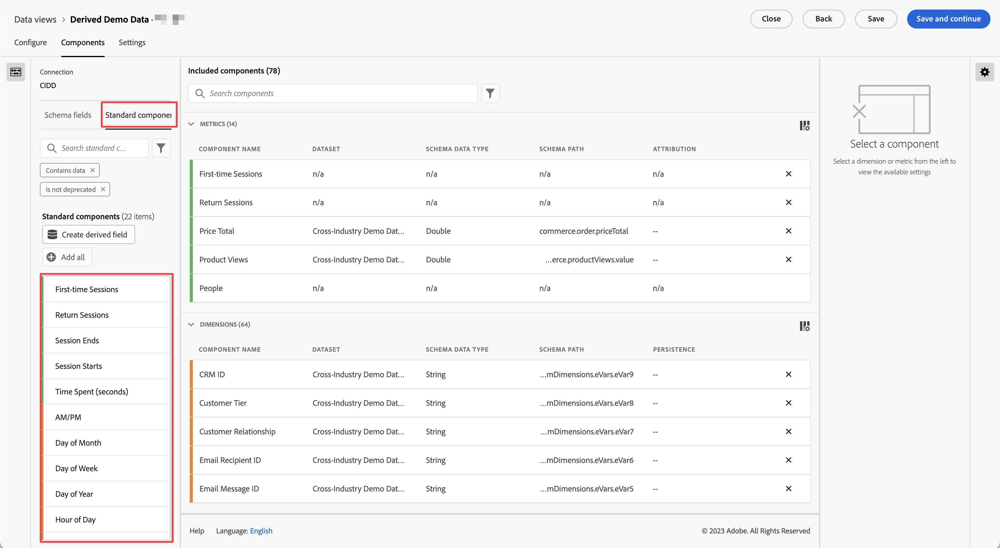

# Référence de composant standard

La plupart des dimensions et des mesures dans Customer Journey Analytics sont basées sur des éléments de schéma de votre jeu de données Adobe Experience Platform. Cependant, plusieurs composants peuvent être ajoutés à une vue de données, quelle que soit la connexion que vous utilisez.

Les [!UICONTROL composants standard] sont des composants qui ne sont pas générés à partir des champs du schéma du jeux de données, mais qui sont générés par le système. Certains composants du système sont requis afin de faciliter les fonctionnalités de compte rendu des performances dans Analysis Workspace, tandis que dʼautres composants du système sont facultatifs.

## Composants standard requis {#required}

Ces composants standard requis sont ajoutés par défaut à chaque vue de données. Ils sont essentiels aux fonctionnalités de création de comptes rendus des performances proposées par Customer Journey Analytics.

### Dimensions standard

{{standard-dimensions}}

### Mesures standard

{{standard-metrics}}

## Composants standard facultatifs {#optional}

Les composants standard facultatifs sont disponibles sous l’onglet **[!UICONTROL Vues de données]** > **[!UICONTROL Modifier la vue de données]** > **[!UICONTROL Composants]** > onglet **[!UICONTROL Composants standard]**.

| Nom du composant | Dimension ou mesure | Notes et valeurs |
| --- | --- | --- |
| [!UICONTROL Matin/après-midi] | Dimension de répartition temporelle | Matin ou après-midi |
| [!UICONTROL ID de lot] | Dimension | Identifiant du lot Experience Platform dont faisait partie un [!UICONTROL Event]. |
| [!UICONTROL Identifiant du jeu de données] | Dimension | Identifiant du jeu de données Experience Platform dont faisait partie un [!UICONTROL Événement]. |
| [!UICONTROL Jour du mois] | Dimension de répartition temporelle | 1-31 |
| [!UICONTROL Jour de la semaine] | Dimension de répartition temporelle | Lundi, mardi, mercredi, jeudi, vendredi, samedi, dimanche |
| [!UICONTROL Jour de l’année] | Dimension de répartition temporelle | 1-366 |
| [!UICONTROL Heure de la journée] | Dimension de répartition temporelle | 0-23 |
| [!UICONTROL &#x200B; Mois de l’année] | Dimension de répartition temporelle | Janvier - Décembre |
| [!UICONTROL Premières sessions] | Mesure | Première session définie par une personne dans la fenêtre de création de rapports. [En savoir plus](https://experienceleague.adobe.com/docs/analytics-platform/using/cja-dataviews/data-views-usecases.html?lang=fr#new-repeat) |
| [!UICONTROL Sessions récurrentes] | Mesure | Nombre de sessions qui n’ont pas été la première session d’une personne. [En savoir plus](https://experienceleague.adobe.com/docs/analytics-platform/using/cja-dataviews/data-views-usecases.html?lang=fr#new-repeat) |
| [!UICONTROL ID de personne] | Dimension | Chaque schéma du jeu de données défini dans Experience Platform peut disposer de son propre jeu d’une ou de plusieurs identités définies et associées à un espace de noms d’identité. N’importe laquelle de ces identité peut être utilisée comme ID de personne. Par exemple, l’ID de cookie, l’ID groupé, l’ID d’utilisateur ou d’utilisatrice, le code de suivi, etc. La dimension de [!UICONTROL l’ID de personne] est la base de la combinaison de jeux de données et de l’identification des personnes uniques dans Customer Journey Analytics.
Les cas d’utilisation possibles sont les suivants :<ul><li>Créez un segment sur une valeur d’ID de personne spécifique afin de tout segmenter en fonction du comportement de cet utilisateur.</li><li>Débogage : s’assurer que les données d’un ID de cookie spécifique (ou d’un ID de client spécifique) sont présentes.</li><li>Identification des utilisateurs qui ont contacté un centre d’appel.</li></ul> |
| [!UICONTROL Espace de noms de l’ID de personne] | Dimension | Le type d’ID dont [!UICONTROL l’ID de personne] est constitué. Exemple : `email address`, `cookie ID`, `Analytics ID` |
| [!BADGE B2B Edition]{type=Informative url="https://experienceleague.adobe.com/fr/docs/analytics-platform/using/cja-overview/cja-b2b/cja-b2b-edition" newtab=true tooltip="Customer Journey Analytics B2B Edition"} [!UICONTROL ID de compte global] | Dimension | L’[!UICONTROL ID de compte global], lorsque vous utilisez le conteneur de compte global dans votre connexion. |
| [!BADGE B2B Edition]{type=Informative url="https://experienceleague.adobe.com/fr/docs/analytics-platform/using/cja-overview/cja-b2b/cja-b2b-edition" newtab=true tooltip="Customer Journey Analytics B2B Edition"} [!UICONTROL ID de compte] | Dimension | Le [!UICONTROL ID de compte], lorsque vous utilisez le conteneur Compte dans votre connexion. |
| [!BADGE B2B Edition]{type=Informative url="https://experienceleague.adobe.com/fr/docs/analytics-platform/using/cja-overview/cja-b2b/cja-b2b-edition" newtab=true tooltip="Customer Journey Analytics B2B Edition"} [!UICONTROL ID d’opportunité] | Dimension | L’[!UICONTROL ID d’opportunité], lorsque vous utilisez le conteneur d’opportunité dans votre connexion. |
| [!BADGE B2B Edition]{type=Informative url="https://experienceleague.adobe.com/fr/docs/analytics-platform/using/cja-overview/cja-b2b/cja-b2b-edition" newtab=true tooltip="Customer Journey Analytics B2B Edition"} [!UICONTROL ID de groupe d’achat] | Dimension | L’[!UICONTROL ID du groupe d’achat], lorsque vous utilisez le conteneur du groupe d’achat dans votre connexion. |
| [!UICONTROL Trimestre de l’année] | Dimension de répartition temporelle | T1, T2, T3, T4 |
| [!UICONTROL Session répétée] | Mesure | Nombre de sessions qui n’ont pas été la toute première session d’une personne. [En savoir plus](https://experienceleague.adobe.com/docs/analytics-platform/using/cja-dataviews/data-views-usecases.html?lang=fr#new-repeat) |
| [!UICONTROL Type de session] | Dimension | Cette dimension possède deux valeurs : 1. [!UICONTROL Première fois] et 2. Récurrent. L’élément de ligne [!UICONTROL Première fois] comprend tous les comportements (mesures comparées à cette dimension) d’une session déterminée comme étant la première session définie par une personne. Tous les autres éléments sont inclus dans l’élément de ligne [!UICONTROL Récurrent] (en supposant que tous ceux-ci appartiennent à une session). Lorsque les mesures ne font partie d’aucune session, elles sont incluses dans le compartiment « Non applicable » de cette dimension. [En savoir plus](https://experienceleague.adobe.com/docs/analytics-platform/using/cja-dataviews/data-views-usecases.html?lang=fr#new-repeat) |
| [!UICONTROL Durée par événement] | Dimension | Regroupe la mesure [!UICONTROL Temps passé] dans des regroupements [!UICONTROL Événement]. |
| [!UICONTROL Durée par session] | Dimension | Regroupe la mesure [!UICONTROL Temps passé] dans des regroupements [!UICONTROL Session]. |
| [!UICONTROL Durée par personne] | Dimension | Regroupe la mesure [!UICONTROL Temps passé] dans des regroupements [!UICONTROL Personne]. |
| [!UICONTROL Week-end]/[!UICONTROL Jour de semaine] | Dimension de répartition temporelle | Week-end ou jour de la semaine |

{style="table-layout:auto"}

>[!MORELIKETHIS]
>
>[Découvrez des informations précises sur les clients et les clientes avec la fonctionnalité Profondeur de l’événement](https://experienceleaguecommunities.adobe.com/t5/adobe-analytics-blogs/discover-deeper-customer-insights-with-adobe-customer-journey/ba-p/753947?profile.language=fr#M576).
>