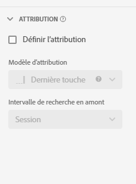

# Paramètres des composants : attribution {#attribution-component-settings}

<!-- markdownlint-disable MD034 -->

>[!CONTEXTUALHELP]
>id="dataview_component_metric_attribution"
>title="Attribution"
>abstract="Configurez le modèle d’attribution par défaut appliqué à une mesure dans les rapports."

<!-- markdownlint-enable MD034 -->

L’attribution vous donne la possibilité de personnaliser la façon dont les éléments de dimension reçoivent du crédit pour les événements de succès.

Par exemple :

1. Une personne sur votre site clique sur un lien de référencement payant vers l’une de vos pages produits. La personne ajoute le produit au panier, mais ne l’achète pas.
2. Le lendemain, elle voit un message d’une personne de son entourage sur les médias sociaux. Elle clique sur le lien, puis effectue l’achat.

Dans certains rapports, vous voudrez peut-être attribuer la commande au référencement payant. Dans d’autres rapports, vous voudrez peut-être attribuer la commande à Social. Attribution vous permet de contrôler cet aspect des rapports.

## Définir un modèle d’attribution de composant

Vous pouvez modifier le modèle d’attribution par défaut d’un composant donné en mettant à jour le paramètre du composant dans la vue de données. Cela remplace le modèle d’attribution du composant chaque fois qu’il est utilisé dans Analysis Workspace.

>[!NOTE]
>
>Tenez compte des points suivants lors de l’activation d’un modèle d’attribution autre que celui par défaut sur une mesure :
>
>* **Lors de l’utilisation de la mesure dans un rapport avec *une seule dimension* :** l’attribution de la mesure remplace le modèle d’attribution défini sur la dimension. Par exemple, une mesure avec une attribution « première touche » remplace une attribution de dimension « le plus récent ».
>
>* **Lors de l’utilisation de la mesure dans un rapport avec *plusieurs dimensions* :** l’attribution de la mesure est appliquée en plus du modèle d’attribution pour chaque dimension. Par exemple, une mesure avec une attribution « Première touche » est appliquée en plus d’une attribution de dimension « Le plus récent ».
>
> Pour plus d’informations sur l’attribution, consultez [Paramètres des composants de persistance](/help/data-views/component-settings/persistence.md).

Pour mettre à jour le modèle d’attribution par défaut d’un composant, procédez comme suit :

1. Accédez à la vue de données contenant le composant dont vous souhaitez mettre à jour le modèle d’attribution par défaut.

1. Sélectionnez le composant, puis développez la section **[!UICONTROL Attribution]** sur le côté droit de l’écran.

   

1. Sélectionnez [!UICONTROL **Définir l’attribution**], puis sélectionnez l’intervalle [modèle d’attribution](#attribution-models), [conteneur](#container) et [recherche en amont](#lookback-window).

1. Sélectionnez [!UICONTROL **Enregistrer et continuer**].

>[!TIP]
>
>Si votre entreprise exige qu’une mesure comporte plusieurs paramètres d’attribution, vous pouvez effectuer l’une des opérations suivantes :
>
> * Copiez la mesure dans la vue de données avec chaque paramètre d’attribution souhaité. Vous pouvez inclure la même mesure plusieurs fois dans une vue de données, ce qui donne à chaque mesure un paramètre différent. Assurez-vous d’étiqueter correctement chaque mesure afin que les analystes comprennent la différence entre ces mesures lors de la génération des rapports.
>
> * Remplacez la mesure dans Analysis Workspace. Dans les [Paramètres de colonne](/help/analysis-workspace/visualizations/freeform-table/column-row-settings/column-settings.md) d’une mesure, sélectionnez **[!UICONTROL Utiliser un modèle d’attribution différent du modèle par défaut]** pour modifier le modèle d’attribution et l’intervalle de recherche en amont de la mesure pour ce rapport spécifique.

## Modèles d’attribution {#attribution-models}

<!-- markdownlint-disable MD034 -->

>[!CONTEXTUALHELP]
>id="dataviews_component_attribution_attributionmodels"
>title="Modèle"
>abstract="Sélectionnez un modèle d’attribution pour la mesure."

<!-- markdownlint-enable MD034 -->

{{attribution-models-details}}

## Conteneur

{{attribution-container}}

## Intervalle de recherche en amont

{{attribution-lookback-window}}

## Exemple

{{attribution-example}}
