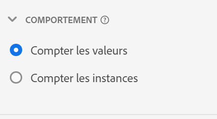
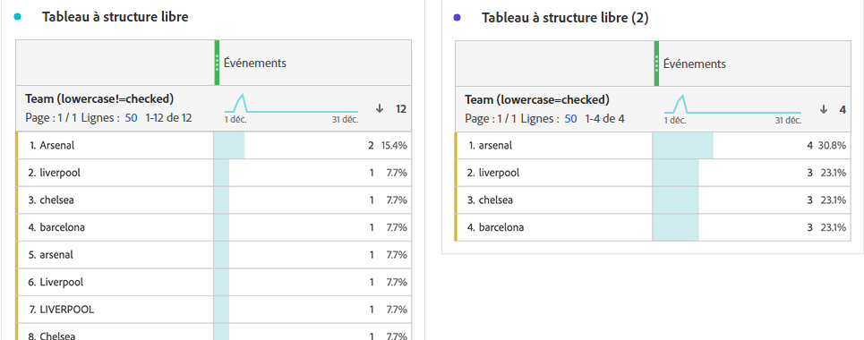

# Paramètres des composants : comportement {#behavior-component-settings}

<!-- markdownlint-disable MD034 -->

>[!CONTEXTUALHELP]
>id="dataview_component_dimension_behavior"
>title="Comportement"
>abstract="Applicable aux composants de dimension et de mesure. Déterminez la façon dont les éléments de ligne de cette mesure sont agrégés. Indiquez si les valeurs de chaîne de cette dimension doivent être en minuscules ou non."

<!-- markdownlint-enable MD034 -->

Les paramètres de comportement sont disponibles pour les dimensions et les mesures. Les paramètres disponibles dépendent du type de composant et du type de données du schéma.

## Paramètres de comportement des dimensions

| Paramètre | Description |
| --- | --- |
| [!UICONTROL Minuscules] | Déduplique les lignes ayant la même valeur mais une casse différente. Si cette option est activée, toutes les instances dʼune dimension ayant la même valeur sont signalées en minuscules. Par exemple, supposons que vos données contiennent les valeurs `"liverpool"`, `"Liverpool"` et `"LIVERPOOL"` dans une dimension de chaîne. Si les [!UICONTROL Minuscules] sont activées, les trois valeurs deviennent toutes `"liverpool"`. Si cette option est désactivée, les trois valeurs sont traitées comme des valeurs distinctes. |

{style="table-layout:auto"}

>[!NOTE]
>
>Si les [!UICONTROL Minuscules] sont activées sur une dimension du jeu de données de recherche, plusieurs valeurs de recherche peuvent exister pour le même identifiant. Si ce conflit se produit, Customer Journey Analytics utilise la première valeur ASCII assemblée (les valeurs en majuscules précèdent les valeurs en minuscules). Adobe ne recommande pas lʼutilisation de jeux de données de recherche qui contiennent la même valeur lorsque les [!UICONTROL Minuscules] sont activées.

## Paramètres de comportement des mesures

| Paramètre | Description/Cas d’utilisation |
| --- | --- |
| [!UICONTROL Compter les valeurs] | Visible sur les types de données des schémas entier et double. Permet dʼaugmenter la valeur de la mesure par le nombre spécifié. Par exemple, la valeur de la mesure augmente de 50 si la valeur de la colonne est `50`. |
| [!UICONTROL Compter les instances] | Visible sur les types de données des schémas entier et double. Permet dʼaugmenter la valeur de la mesure de un, quelle que soit sa valeur. La présence de toute valeur augmente la mesure. Par exemple, la valeur de la mesure augmente de un si la valeur de la colonne est `50`. |
| [!UICONTROL Valeurs à compter] | Visible sur les types de données du schéma booléen. Permet de déterminer si la valeur de la mesure augmente en comptant `true`, `false`, ou les deux. |

{style="table-layout:auto"}

Vous pouvez générer à la fois une mesure « Commandes » et « Chiffre dʼaffaires » dans Analysis Workspace à lʼaide de la même colonne du jeu de données dʼévénement avec des comportements différents. Faites glisser deux fois la colonne du jeu de données « Chiffre dʼaffaires » dans la vue de données et définissez lʼune dʼelles sur « Compter les valeurs » et lʼautre sur « Compter les instances ». La mesure « Commandes » compte les instances, tandis que la mesure « Chiffre dʼaffaires » compte les valeurs.
