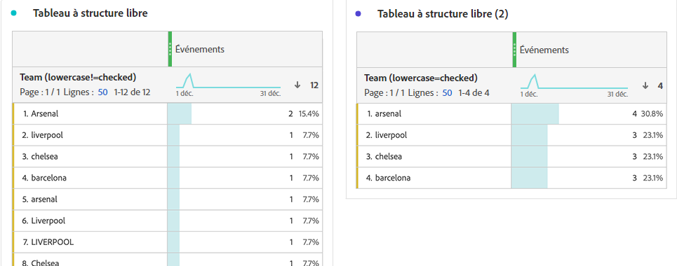

# Paramètres du composant Comportement

Les paramètres de comportement sont disponibles sur les dimensions et les mesures. Les paramètres disponibles dépendent du type de composant et du type de données de schéma.

## Paramètres de comportement des Dimensions

| Paramètre | Description |
| --- | --- |
| [!UICONTROL Minuscules] | Déduplique les lignes ayant la même valeur mais une casse différente. Si cette option est activée, toutes les instances d’une dimension avec la même valeur sont signalées en minuscules. Par exemple, vos données contiennent les valeurs `"liverpool"`, `"Liverpool"` et `"LIVERPOOL"` dans une dimension de chaîne. Si [!UICONTROL La minuscule] est activée, les trois valeurs sont combinées dans `"liverpool"`. Si cette option est désactivée, les trois valeurs sont traitées comme distinctes. |

>[!NOTE]
>
>Si vous activez [!UICONTROL Minuscules] sur une dimension de jeu de données de recherche, plusieurs valeurs de recherche peuvent exister pour le même identifiant. Si ce conflit se produit, CJA utilise la première valeur de collection ASCII (valeurs en majuscules précédées de valeurs en minuscules). Adobe conseille d’utiliser des jeux de données de recherche qui contiennent la même valeur lorsque [!UICONTROL Minuscules] est activé.

## Paramètres de comportement des mesures

| Paramètre | Description/Cas d’utilisation |
| --- | --- |
| [!UICONTROL Compter les valeurs] | Visible sur les types de données de schéma entier et double. Augmentez la mesure selon le montant spécifié. Par exemple, augmente une mesure de 50 si la valeur de la colonne est `50`. |
| [!UICONTROL Compter les instances] | Visible sur les types de données de schéma entier et double. Augmentez la mesure d’une unité, quelle que soit la valeur. La présence de n’importe quelle valeur augmente la mesure. Par exemple, augmente une mesure de 1 si la valeur de la colonne est `50`. |
| [!UICONTROL Valeurs à compter] | Visible sur les types de données de schéma booléen. Permet de déterminer si la mesure augmente en comptant `true`, `false`, ou les deux. |

Vous pouvez générer une mesure &quot;Commandes&quot; et &quot;Recettes&quot; dans Analysis Workspace à l’aide de la même colonne de jeu de données d’événement avec des comportements différents. Faites glisser deux fois la colonne du jeu de données &quot;Recettes&quot; dans la vue de données et définissez l’une sur &quot;Compter les valeurs&quot; et l’autre sur &quot;Compter les instances&quot;. La mesure &quot;Commandes&quot; comptabilise les instances, tandis que la mesure &quot;Recettes&quot; comptabilise les valeurs.
