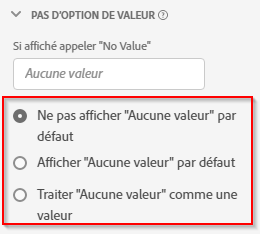

# Paramètres du composant Aucune option de valeur

Aucune option de valeur vous permet de déterminer comment Analysis Workspace gère les situations dans lesquelles un événement d’un jeu de données contient une mesure, mais où la dimension ne contenait pas de valeur. Vous pouvez choisir le nom de cet élément de dimension, le masquer entièrement ou même le traiter comme une valeur réelle.

| Paramètre | Description |
| --- | --- |
| [!UICONTROL Si affiché, appeler « Aucune valeur »] | Champ de texte qui permet de renommer l’élément de dimension **[!UICONTROL Aucune valeur]** en autre chose. |
| [!UICONTROL Ne pas afficher No value par défaut] | Nʼaffiche pas cette valeur dans le compte rendu des performances. Les occurrences de mesure non liées à cette dimension ne sont pas visibles dans le rapport. |
| [!UICONTROL Afficher No value par défaut] | Affiche cette valeur dans les rapports. |
| [!UICONTROL Traiter No value comme une valeur] | Ce paramètre remplace les valeurs vides dans les données par le texte que vous avez spécifié sous [!UICONTROL Si affiché, appeler « Aucune valeur »]. Par exemple, si vous aviez des types dʼéquipement mobile en tant que dimension, vous pouviez renommer lʼélément **[!UICONTROL No value]** en « Bureau ». Lorsque vous remplacez ce champ par une valeur personnalisée, la valeur personnalisée est traitée comme une valeur de chaîne légitime. Par conséquent, si vous entrez la valeur « Rouge » dans ce champ, toutes les instances de la chaîne « Rouge » apparaissant dans les données elles-mêmes sont également reprises sous le même élément de ligne que vous avez spécifié. |

{style=&quot;table-layout:auto&quot;}
