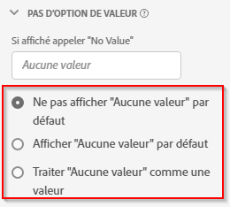

# Paramètres du composant Aucune option de valeur {#no-value-options-component-settings}

<!-- markdownlint-disable MD034 -->

>[!CONTEXTUALHELP]
>id="dataview_component_dimension_novalueoptions"
>title="Pas d’option de valeur"
>abstract="Configurez le comportement par défaut pour lorsqu’aucune valeur n’est présente dans une dimension."

<!-- markdownlint-enable MD034 -->

[!UICONTROL Aucune option de valeur] vous permet de déterminer comment Analysis Workspace gère les situations dans lesquelles un événement d’un jeu de données contient une mesure, mais où la dimension ne contenait pas de valeur. Vous pouvez choisir le nom de cet élément de dimension, le masquer entièrement ou même le traiter comme une valeur réelle.

## Paramètres {#settings}

| Paramètre | Description |
| --- | --- |
| **[!UICONTROL Si affiché, appeler « Aucune valeur »]** | Champ de texte qui permet de renommer l’élément de dimension **[!UICONTROL Aucune valeur]** en autre chose. |
| **[!UICONTROL Ne pas afficher « Aucune valeur » par défaut]** | Nʼaffiche pas cette valeur dans le compte rendu des performances. Les occurrences de mesure non liées à cette dimension ne sont pas visibles dans le rapport. |
| **[!UICONTROL Afficher « Aucune valeur » par défaut]** | Affiche cette valeur dans les rapports. |
| **[!UICONTROL Traiter « Aucune valeur » comme une valeur]** | Ce paramètre remplace les valeurs vides dans les données par le texte que vous avez spécifié sous [!UICONTROL Si affiché, appeler « Aucune valeur »]. Par exemple, si vous aviez des types d’appareil mobile en tant que dimension, vous pouviez renommer lʼélément **[!UICONTROL No value]** en « Bureau ». Lorsque vous remplacez ce champ par une valeur personnalisée, la valeur personnalisée est traitée comme une valeur de chaîne légitime. Par conséquent, si vous entrez la valeur « Rouge » dans ce champ, toutes les instances de la chaîne « Rouge » apparaissant dans les données elles-mêmes sont également reprises sous le même élément de ligne que vous avez spécifié. |

## Prise en charge de « Aucune valeur » pour les dimensions numériques {#numeric}

Lorsque vous utilisez une valeur numérique comme dimension, vous pouvez :

* Configurer l’option « Aucune valeur » dans une vue de données. Notez que tous les paramètres de configuration affichés ci-dessus sont pris en charge, à l’exception de **[!UICONTROL Traiter « Aucune valeur » comme une valeur]**.
* Utiliser **[!UICONTROL Inclure « Aucune valeur »]** pour les dimensions numériques dans un tableau à structure libre dans Workspace.
* Dans le créateur de segments, utilisez les opérateurs **[!UICONTROL existe]** ou **[!UICONTROL n’existe pas]** avec des dimensions numériques.

>[!MORELIKETHIS]
>
>[Manuel complet de gestion de l’absence de valeur dans Adobe Customer Journey Analytics](https://experienceleaguecommunities.adobe.com/t5/adobe-analytics-blogs/the-complete-playbook-for-handling-no-value-in-adobe-cja/ba-p/756696?profile.language=fr#M598).

