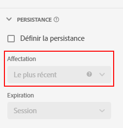

# Paramètres de composant de [!UICONTROL persistance]

La [!UICONTROL persistance] La est la possibilité pour une valeur de dimension donnée d’établir une relation avec une mesure au-delà de l’événement sur lequel elle est définie. Elle recourt à une combinaison d’attribution et d’expiration.

* L’**attribution** vous permet de déterminer la valeur conservée lorsque plusieurs éléments de dimension peuvent persister à la fois dans une seule colonne.
* L’**expiration** vous permet de déterminer la durée pendant laquelle un élément de dimension persiste au-delà de l’événement sur lequel il est défini.

La [!UICONTROL persistance] est disponible uniquement sur les dimensions et est rétroactive aux données auxquelles elle est appliquée. Il s’agit d’une transformation immédiate des données qui se produit avant l’application du filtrage ou d’autres opérations d’analyse.

| Paramètre | Description |
| --- | --- |
| [!UICONTROL Définir la persistance] | Activez la persistance pour la dimension. Si la persistance n’est pas activée, la dimension se rapporte uniquement aux mesures qui existent dans le même événement. Ce paramètre est désactivé par défaut. |
| [!UICONTROL Attribution] | Permet de définir le modèle dʼattribution utilisé sur une dimension pour la persistance. Les options sont les suivantes : [!UICONTROL Plus récent], [!UICONTROL Original], [!UICONTROL Instance], [!UICONTROL Tous]. Depuis le 28 octobre 2021, un intervalle de recherche en amont de 90 jours au maximum a été ajouté au paramètre [!UICONTROL Attribution]. |
| [!UICONTROL Expiration] | Permet de définir la période de persistance pour une dimension. Les options sont les suivantes : [!UICONTROL Session] (par défaut), [!UICONTROL Personne], [!UICONTROL Temps personnalisé], [!UICONTROL Mesure]. Il se peut que vous ayez besoin de pouvoir faire expirer la dimension lors dʼun achat (comme les termes de recherche interne ou dʼautres cas dʼutilisation du marchandisage). Le temps d’expiration maximal que vous pouvez définir est de 90 jours. Si vous sélectionnez une attribution de [!UICONTROL Toutes], seule l’expiration [!UICONTROL Session] ou [!UICONTROL Personne] est disponible. |

## Paramètres [!UICONTROL Attribution] 

Détails sur les paramètres d’attribution disponibles.

* **[!UICONTROL La plus récente]** : fait persister la valeur la plus récente (par horodatage) présente dans la dimension. Toutes les valeurs suivantes qui se produisent pendant la période d’expiration de la dimension remplacent la valeur persistante précédente. Si « Traiter &quot;Aucune valeur&quot; comme valeur » est activé sur cette dimension sous [Aucune option de valeur](no-value-options.md), les valeurs vides remplacent les valeurs précédemment conservées. Par exemple, considérez le tableau suivant avec l’attribution [!UICONTROL La plus récente] et l’expiration [!UICONTROL Session] :

   | Dimension | Accès 1 | Accès 2 | Accès 3 | Accès 4 | Accès 5 |
   | --- | --- | --- | --- | --- | --- |
   | Valeurs du jeu de données |  | C | B |  | A |
   | Affectation la plus récente |  | C | B | B | A |

* **[!UICONTROL Original]** : conserve par horodatage la valeur d’origine présente dans la dimension pour la durée de la période d’expiration. Si cette dimension comporte une valeur, elle n’est pas remplacée lorsqu’une autre valeur est affichée sur un événement suivant. Par exemple, considérez le tableau suivant avec l’attribution [!UICONTROL Original] et l’expiration [!UICONTROL Session] :

   | Dimension | Accès 1 | Accès 2 | Accès 3 | Accès 4 | Accès 5 |
   | --- | --- | --- | --- | --- | --- |
   | Valeurs du jeu de données |  | C | B |  | A |
   | Affectation dʼorigine |  | C | C | C | C |

* **[!UICONTROL Toutes]** : agit de la même manière que le modèle dʼattribution de [!UICONTROL Participation] pour les mesures. Conserve toutes les valeurs de manière égale afin que chacune d’elles reçoive un crédit complet pour la mesure dans les rapports. Par exemple, considérez le tableau suivant avec l’attribution [!UICONTROL Toutes] et l’expiration [!UICONTROL Session] :

   | Dimension | Accès 1 | Accès 2 | Accès 3 | Accès 4 | Accès 5 |
   | --- | --- | --- | --- | --- | --- |
   | Valeurs du jeu de données | A | B | C |  | A |
   | Affectation Tous | A | A,B | A, B, C | A, B, C | A, B, C |

* **[!UICONTROL Première connaissance]** et **[!UICONTROL Dernier connu]**: (19 janvier 2022 ) Ces deux modèles d’attribution répondent aux cas d’utilisation des dimensions &quot;entrée&quot; et &quot;sortie&quot;. Ils prennent la première ou la dernière valeur observée pour une dimension dans une portée de persistance spécifiée (session, personne ou période personnalisée avec recherche arrière) et l’appliquent à tous les événements de la portée spécifiée. Exemple :

| Dimension | Accès 1 | Accès 2 | Accès 3 | Accès 4 | Accès 5 |
| --- | --- | --- | --- | --- | --- |
| Horodatage (min) | 1 | 2 | 3 | 6 | 7 |
| Valeurs d’origine |  | C | B |  | A |
| Préconnu | C | C | C | C | C |
| Dernier connu | A | A | A | A | A |

## Paramètres [!UICONTROL Expiration] 

Détails sur les paramètres d’expiration disponibles.

* **Session** : expire après une session donnée. Fenêtre d’expiration par défaut.
* **Personne** : expire à la fin de votre intervalle de compte rendu des performances.
* **Temps** : vous pouvez définir la valeur de la dimension pour quʼelle expire après une période spécifiée (jusquʼà 90 jours). Cette option dʼexpiration est disponible uniquement pour les modèles dʼattribution d’origine et La plus récente. Lors de lʼutilisation de lʼexpiration basée sur le temps, les valeurs antérieures au début de votre intervalle de compte rendu des performances (jusquʼà 90 jours) sont prises en compte.
* **Mesure** : lorsque cette mesure est vue dans un accès, la valeur conservée dans la dimension arrive immédiatement à expiration. Vous pouvez utiliser n’importe quelle mesure comme fin d’expiration pour cette dimension. Cette option dʼexpiration est disponible uniquement pour les paramètres dʼattribution Original et La plus récente.

## [!UICONTROL Dimension de liaison]

Liste déroulante permettant de lier la persistance d’une valeur de dimension aux valeurs de dimension dans une autre dimension. Les options de liste déroulante valides incluent d’autres dimensions incluses dans la vue de données.

Ce paramètre est généralement utilisé dans les tableaux d’objets et est le plus souvent utilisé pour mesurer des éléments tels que les méthodes de recherche de produits, les résultats de recherche interne, les impressions de promotions internes ou les recommandations de contenu ou de produit. Dans les versions précédentes d’Adobe Analytics, ce concept est similaire au marchandisage de syntaxe de conversion.

## [!UICONTROL Mesure de liaison]

Liste déroulante vous permettant de choisir une mesure qui agit comme déclencheur de liaison. Les options de liste déroulante valides incluent les mesures incluses dans la vue de données.

Ce paramètre s’affiche uniquement lorsque la Dimension de liaison est inférieure au tableau d’objets par rapport au composant. Lorsque la mesure de liaison est présente dans un événement, les valeurs de dimension sont copiées à partir de la dimension de niveau événement vers le niveau de schéma inférieur de la dimension de liaison. Dans les versions précédentes d’Adobe Analytics, un concept similaire mais plus limité est connu sous le nom de marchandisage de syntaxe de produit.
