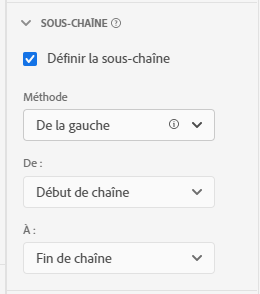

# [!UICONTROL Substring] paramètres du composant

[!UICONTROL Substring] les paramètres de composant vous permettent d’effectuer plusieurs méthodes de manipulation de chaîne pour obtenir les éléments de dimension souhaités dans les rapports.

[!UICONTROL Substring] est disponible uniquement sur les dimensions et est rétroactif par rapport aux données auxquelles elle est appliquée. Il s’agit d’une transformation immédiate des données qui se produit avant l’application du filtrage ou d’autres opérations d’analyse.

## À partir de la gauche/de la droite

Prenez une partie d’une chaîne en fonction de sa position au début ou à la fin d’une chaîne. **[!UICONTROL De la gauche]** et **[!UICONTROL À droite]** Les méthodes offrent deux listes déroulantes : **[!UICONTROL De]** (où la sortie commence) et **[!UICONTROL À]** (où la sortie se termine).

* **[!UICONTROL Début de chaîne]**: Le début de la chaîne.
* **[!UICONTROL Fin de chaîne]**: Fin de la chaîne.
* **[!UICONTROL Position]**: Nombre statique de caractères de gauche ou de droite, selon la méthode .
* **[!UICONTROL Chaîne]**: Faire correspondre un caractère ou une séquence de caractères pour indiquer le début ou la fin d’une chaîne. Cette liste déroulante affiche également d’autres options :
   * **[!UICONTROL Correspondance]**: Chaîne à faire correspondre. Si l’entrée ne correspond pas à ce champ, [Aucune option de valeur](no-value-options.md) appliquez.
   * **[!UICONTROL Index]**: Le **[!UICONTROL Correspondance]** Les critères peuvent être présents plusieurs fois dans une chaîne. Cet entier détermine la correspondance à utiliser pour démarrer ou terminer la sortie, selon la méthode . Par exemple, un index de `1` représente la première correspondance. Si l&#39;index est supérieur au nombre de correspondances disponibles, [Aucune option de valeur](no-value-options.md) appliquez.
   * **[!UICONTROL Inclure la chaîne]**: Une case à cocher qui inclut la variable **[!UICONTROL Correspondance]** chaîne dans la sortie si activée.
* **[!UICONTROL Longueur]**: Entier qui spécifie le nombre de caractères à inclure après la position de départ de la sortie. Disponible uniquement sous **[!UICONTROL À]** menu déroulant.

## Délimiteur

Utilisez cette méthode pour les champs qui utilisent un délimiteur pour séparer plusieurs valeurs de chaîne. Vous pouvez extraire un élément individuel à utiliser comme sortie ou convertir la chaîne en élément de schéma de tableau d’objets.

* **[!UICONTROL Critère]**: Comment traiter la liste délimitée de valeurs.
   * **[!UICONTROL De la gauche]**: Commencez au début de la liste délimitée et comptez vers l’avant.
   * **[!UICONTROL À droite]**: Commencez à la fin de la liste délimitée et comptez en arrière.
   * **[!UICONTROL Convertir en tableau]**: Traitez cette dimension comme s’il s’agissait d’un élément de schéma de tableau d’objets.
* **[!UICONTROL Délimiteur]**: Le délimiteur utilisé par le champ.
* **[!UICONTROL Index]**: Uniquement présente si le critère est De la gauche/droite. Numéro de l’élément comme s’il se trouvait dans un tableau. Par exemple, si l’entrée de chaîne est `"Fox,Turtle,Rabbit,Wolf"` avec un index de 3, la sortie est `"Rabbit"`. Si l&#39;index est supérieur au nombre d&#39;éléments délimités, [Aucune option de valeur](no-value-options.md) appliquez.

## Analyse de l’URL

À utiliser avec des champs contenant des URL. Utilisation de l’exemple d’URL `https://example.com/store/index.html?cid=campaign#cart`, les options suivantes sont disponibles :

* **[!UICONTROL Protocole Get]**: Obtenez le protocole de l’URL. Par exemple : `"https://"`.
* **[!UICONTROL Obtenir l’hôte]**: Obtenez l’hôte de l’URL. Par exemple : `"example.com"`.
* **[!UICONTROL Obtenir le chemin]**: Obtenez le chemin de l’URL. Par exemple : `"store/index.html"`.
* **[!UICONTROL Obtenir la valeur de chaîne de requête]**: Obtenez la valeur à partir d’une seule chaîne de requête. Placez le paramètre de chaîne de requête de votre choix dans le **[!UICONTROL Clé de requête]** champ . Si l’URL ci-dessus est utilisée avec la variable `"cid"` clé de requête, la sortie est `"campaign"`.
* **[!UICONTROL Obtention de la valeur de hachage]**: Obtenez la valeur de hachage de l’URL. Par exemple : `"cart"`.

Si l’entrée n’est pas une URL valide ou si le composant URL souhaité n’est pas présent, [Aucune option de valeur](no-value-options.md) appliquez.

## Trim

Ajustez l’espace blanc ou les caractères spéciaux de la chaîne.

* **[!UICONTROL Rogner les espaces]**: Case à cocher qui supprime tous les espaces au début et à la fin de la chaîne si activée.
* **[!UICONTROL Rogner les caractères spéciaux]**: Une case à cocher qui affiche une **[!UICONTROL Caractères spéciaux]** champ d’entrée s’il est activé. Tous les caractères de ce champ sont supprimés de la sortie. Les caractères à plusieurs octets ne sont pas pris en charge.

## Regex

Appliquez des expressions régulières à une dimension pour récupérer la valeur souhaitée.

* **[!UICONTROL Regex]**: Formule d’expression régulière.
* **[!UICONTROL Format de sortie]**: Champ facultatif qui vous permet d’ajouter du texte ou de réorganiser la sortie du sous-groupe regex. Si ce champ est vide, la sortie de chaîne est l’expression régulière évaluée.
* **[!UICONTROL Respect de la casse]**: Case à cocher qui force l’expression régulière à être sensible à la casse si elle est activée.

CJA utilise un sous-ensemble de la syntaxe de l’expression régulière Perl. Si l’entrée ne correspond pas à l’expression régulière et à la variable **[!UICONTROL Format de sortie]** est vide, [Aucune option de valeur](no-value-options.md) appliquez. Les expressions ci-dessous sont prises en charge :

| Expression | Description |
| --- | --- |
| `a` | Un seul caractère `a`. |
| `a|b` | Un seul caractère `a` ou `b`. |
| `[abc]` | Un seul caractère `a`, `b`ou `c`. |
| `[^abc]` | N’importe quel caractère sauf `a`, `b`ou `c`. |
| `[a-z]` | N’importe quel caractère de la plage `a`-`z`. |
| `[a-zA-Z0-9]` | N’importe quel caractère de la plage `a`-`z`, `A`-`Z`, ou chiffres `0`-`9`. |
| `^` | Correspond au début de la ligne. |
| `$` | Correspond à la fin de la ligne. |
| `\A` | Début de chaîne. |
| `\z` | Fin de chaîne. |
| `.` | Correspond à n’importe quel caractère. |
| `\s` | N’importe quel espace. |
| `\S` | N’importe quel caractère sauf espace. |
| `\d` | N’importe quel chiffre. |
| `\D` | N’importe quel caractère non numérique. |
| `\w` | N’importe quel caractère de soulignement, lettre ou chiffre. |
| `\W` | N’importe quel caractère n’appartenant pas à un mot. |
| `\b` | N’importe quelle limite de mot. |
| `\B` | N’importe quel caractère qui n’est pas une limite de mot. |
| `\<` | Début de mot. |
| `\>` | Fin de mot. |
| `(...)` | Acquérir tout ce qui est compris. |
| `(?:...)` | Capture non marquante. Empêche la référence de la correspondance dans la chaîne de sortie. |
| `a?` | Zéro ou un des `a`. |
| `a*` | Zéro ou plus de `a`. |
| `a+` | Un de plus : `a`. |
| `a{3}` | Exactement 3 de `a`. |
| `a{3,}` | 3 ou plus de `a`. |
| `a{3,6}` | Entre 3 et 6 de `a`. |

Les espaces réservés de sortie sont également pris en charge. Vous pouvez utiliser ces séquences dans la variable **[!UICONTROL Format de sortie]** nombre de fois et dans n’importe quel ordre pour obtenir la sortie de chaîne souhaitée.

| Séquence d’espace réservé de sortie | Description |
| --- | --- |
| `$&` | Génère ce qui correspondait à l’expression entière. |
| `$n` | Génère ce qui correspondait à la énième sous-expression. Par exemple : `$1` génère la première sous-expression. |
| ``$` `` | Sort le texte entre la fin de la dernière correspondance trouvée (ou le début du texte si aucune correspondance précédente n’a été trouvée) et le début de la correspondance actuelle. |
| `$+` | Génère ce qui correspond à la dernière sous-expression marquée dans l’expression régulière. |
| `$$` | Sort le caractère de chaîne `"$"`. |

Voici une vidéo sur les Dimensions de liaison :

>[!VIDEO](https://video.tv.adobe.com/v/342694/?quality=12)
