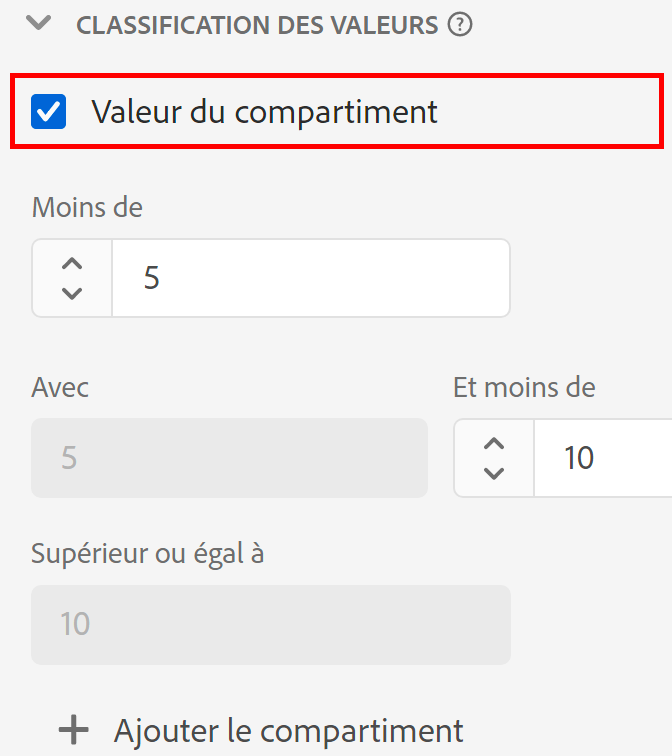

# Paramètres du composant [!UICONTROL Regroupement de valeurs]

Lors de la création ou de la modification d’une vue de données, le regroupement de valeurs permet de combiner des valeurs numériques en fonction d’une plage de données. Elle n’est disponible que pour les dimensions utilisant des types de données de schéma entier ou double.

Le regroupement de valeurs est utile lorsque vous souhaitez regrouper des plages au lieu de traiter chaque nombre unique comme un élément de dimension distinct. Par exemple, un regroupement de valeurs « de 5 à 10 » sʼaffiche en tant quʼélément de ligne « 5 à 10 » dans Analysis Workspace.

Si vous souhaitez bénéficier de la flexibilité de création de comptes rendus de performances sur une dimension regroupée et non regroupée, faites glisser deux copies du composant dans la liste des dimensions disponibles. Activez le regroupement sur une dimension et désactivez-la sur l’autre.

| Paramètre | Description |
| --- | --- |
| [!UICONTROL Valeur du compartiment] | Case à cocher qui vous permet d’activer le regroupement. |
| [!UICONTROL Inférieur à] | La limite supérieure du premier intervalle de dimension. |
| [!UICONTROL incluant] [!UICONTROL et inférieur à] | Limites des regroupements suivants. |
| [!UICONTROL Supérieur ou égal à] | Limite inférieure du dernier regroupement de dimension. |
| [!UICONTROL Ajouter le compartiment] | Permet dʼajouter un autre regroupement au regroupement des dimensions numériques. Vous pouvez ajouter jusqu’à 20 regroupements dans une seule dimension. |

{style=&quot;table-layout:auto&quot;}
