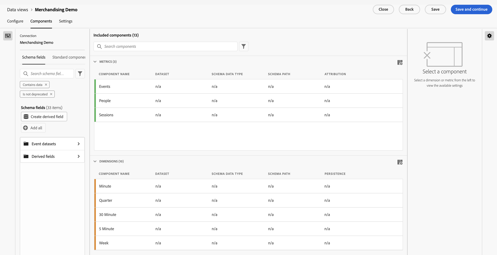

# Création ou modification d’une vue de données

La création dʼune vue de données implique soit la création de mesures et de dimensions à partir dʼéléments de schéma, soit lʼutilisation de composants standard. La plupart des éléments de schéma peuvent être une dimension ou une mesure selon les besoins de votre entreprise. Une fois que vous avez fait glisser un élément de schéma dans une vue de données, des options s’affichent à droite, où vous pouvez ajuster le fonctionnement de la dimension ou de la mesure dans Customer Journey Analytics.

>[!BEGINSHADEBOX]

Voir  [Créer ou modifier une vue de données](https://video.tv.adobe.com/v/35110/?quality=12&learn=on){target="_blank"} pour une vidéo de démonstration.

>[!ENDSHADEBOX]

Pour créer ou modifier une vue de données, procédez comme suit :

1. Connectez-vous à [Customer Journey Analytics](https://analytics.adobe.com) et sélectionnez **[!UICONTROL Vues de données]**, éventuellement à partir de **[!UICONTROL Gestion des données]**, dans le menu supérieur.
1. Pour créer une vue de données, sélectionnez **[!UICONTROL Créer une vue de données]**. Vous pouvez également sélectionner une vue de données existante dans la liste des vues de données pour la modifier.

## Configurer {#configure}

Pour configurer une vue de données nouvelle ou existante :

>[!BEGINTABS]

>[!TAB Standard]

>[!TAB B2B Edition]

>[!ENDTABS]

1. Sélectionnez l’onglet **[!UICONTROL Configurer]**, le cas échéant.

1. Spécifiez les détails [!UICONTROL Paramètres], [!UICONTROL Conteneur] et [!UICONTROL Calendrier] (voir ci-dessous).
1. Sélectionnez **[!UICONTROL Enregistrer et continuer]** pour continuer à configurer votre vue de données nouvelle ou existante. Sélectionnez **[!UICONTROL Enregistrer]** pour enregistrer la configuration de votre vue de données existante.

### Paramètres {#configure-settings}

>[!CONTEXTUALHELP]
>id="dataview_externalid"
>title="Identifiant externe"
>abstract="La modification de l’ID externe peut avoir une incidence sur la manière dont le nom de la vue de données apparaît dans les sources externes telles que les outils de Business Intelligence."

Fournit des paramètres globaux pour la vue de données.

| Paramètre | Description |
| --- | --- |
| **[!UICONTROL Connexion]** | Ce champ relie la vue de données à la connexion que vous avez établie précédemment, qui contient un ou plusieurs jeux de données Adobe Experience Platform. |
| **[!UICONTROL Nom]** | Obligatoire. Nom de la vue de données. Cette valeur apparaît dans le menu déroulant supérieur droit d’Analysis Workspace. |
| **[!UICONTROL ID externe]** | Obligatoire. Nom de la vue de données que vous pouvez utiliser dans des sources externes, telles que les outils d’informatique décisionnelle (Business Intelligence). La valeur par défaut est `unspecified`. Si vous ne spécifiez pas d’ID externe, le nom sera généré à partir du nom de la vue de données, en remplaçant les espaces par des traits de soulignement. |
| **[!UICONTROL Description]** | Facultatif. Adobe recommande une description détaillée afin que les utilisateurs comprennent pourquoi la vue de données existe et pour qui elle a été conçue. |

{style="table-layout:auto"}

### Compatibilité {#compatibility}

>[!CONTEXTUALHELP]
>id="dataview_dataviewsinadobejourneyoptimizer"
>title="Vues de données dans Journey Optimizer"
>abstract="Customer Journey Analytics doit utiliser une connexion et une vue de données compatibles avec Adobe Journey Optimizer. Par défaut, une connexion et une vue de données sont automatiquement créées à cet effet. Vous pouvez également activer cette option pour en faire la vue de données par défaut utilisée dans les rapports Adobe Journey Optimizer. Lorsque cette option est activée, tous les composants nécessaires à Journey Optimizer sont ajoutés à cette vue de données et tous les jeux de données nécessaires à Journey Optimizer sont ajoutés à la connexion associée à cette vue de données."
>additional-url="https://experienceleague.adobe.com/fr/docs/analytics-platform/using/integrations/ajo#connection" text="Les composants et les jeux de données ajoutés."

Fournit des paramètres applicables lors de l’utilisation d’Adobe Journey Optimizer en plus de Customer Journey Analytics.

Cette section n’est visible que pour l’équipe d’administration disposant de Journey Optimizer.

| Paramètre | Description |
| --- | --- |
| [!UICONTROL **Définir la vue des données par défaut dans Adobe Journey Optimizer**] | Cette option de configuration permet de standardiser la création de rapports dans Journey Optimizer et Customer Journey Analytics. Elle vous permet également d’effectuer une analyse avancée de vos données Adobe Journey Optimizer dans Customer Journey Analytics (en sélectionnant  [!UICONTROL **Analyse dans CJA**] dans Journey Optimizer).
Pour effectuer ce type d’analyse, Journey Optimizer doit avoir accès à une vue de données de Customer Journey Analytics.
Activez cette option pour que cette vue de données soit utilisée par défaut dans les rapports de Journey Optimizer pour votre sandbox.

Cette option de configuration permet d’effectuer automatiquement ce qui suit :
<ul><li>Configurer tous les jeux de données Journey Optimizer requis dans la connexion associée dans Customer Journey Analytics pour une utilisation avec Journey Optimizer.</li><li>Créer un ensemble de mesures et de dimensions Journey Optimizer dans la vue de données (y compris les champs dérivés et les mesures calculées). Les libellés de contexte sont automatiquement définis sur toutes ces mesures et dimensions.</li><li>Active automatiquement l’option **[!UICONTROL Utiliser dans CJA]** dans la connexion associée à cette vue de données. (Pour en savoir plus sur cette option, voir [Utiliser une connexion Journey Optimizer dans Customer Journey Analytics](/help/connections/manage-connections.md).)
Si vous désactivez manuellement ce paramètre après son activation, la connexion et les vues de données associées sont réinitialisées à leur état par défaut. Cela peut entraîner des modifications des données dans vos rapports.
</li></ul>

Tenez compte des points suivants lorsque vous activez cette option : <ul><li>Vous pouvez modifier ultérieurement la vue de données par défaut, mais cela peut modifier vos données de création de rapports Journey Optimizer. Si vous choisissez de désactiver cette option une fois qu’elle est activée, vous devrez sélectionner une nouvelle vue de données par défaut.</li><li>Si vous avez déjà personnalisé manuellement des jeux de données, dimensions ou mesures dans la vue de données Customer Journey Analytics, vos personnalisations manuelles restent inchangées lors de l’activation de cette option de configuration. Cette option permet d’effectuer des personnalisations supplémentaires qui permet de standardiser davantage la création de rapports dans Journey Optimizer et Customer Journey Analytics. Vous pouvez également procéder à des personnalisations manuelles après avoir activé cette option.</li><li>Lorsque cette option est sélectionnée, la connexion associée à la vue de données ne peut pas être supprimée.</li></ul>Voir [Intégrer Adobe Journey Optimizer à Adobe Customer Journey Analytics](/help/integrations/ajo.md) pour plus d’informations. |

{style="table-layout:auto"}

### Conteneurs

Désigne le nom des conteneurs pour la vue de données. Les noms de conteneur sont fréquemment utilisés dans [segments](/help/components/segments/seg-overview.md#containers).

| Paramètre | Description |
| --- | --- |
| [!BADGE B2B Edition]{type=Informative url="https://experienceleague.adobe.com/fr/docs/analytics-platform/using/cja-overview/cja-b2b/cja-b2b-edition" newtab=true tooltip="Customer Journey Analytics B2B Edition"} **[!UICONTROL Nom du conteneur Compte global ]** | `Global Account` (valeur par défaut). Le conteneur [!UICONTROL Compte global] inclut toutes les sessions et événements des comptes globaux au cours de la période indiquée. Si votre organisation utilise un autre terme, vous pouvez renommer le conteneur ici. |
| [!BADGE B2B Edition]{type=Informative url="https://experienceleague.adobe.com/fr/docs/analytics-platform/using/cja-overview/cja-b2b/cja-b2b-edition" newtab=true tooltip="Customer Journey Analytics B2B Edition"} **[!UICONTROL Nom du conteneur Compte ]** | `Account` (valeur par défaut). Le conteneur [!UICONTROL Compte] inclut toutes les sessions et événements des comptes au cours de la période indiquée. Si votre organisation utilise un autre terme, vous pouvez renommer le conteneur ici. |
| [!BADGE B2B Edition]{type=Informative url="https://experienceleague.adobe.com/fr/docs/analytics-platform/using/cja-overview/cja-b2b/cja-b2b-edition" newtab=true tooltip="Customer Journey Analytics B2B Edition"} **[!UICONTROL Nom du conteneur Opportunité&#x200B;]** | `Opportunity` (valeur par défaut). Le conteneur [!UICONTROL Opportunité] inclut toutes les sessions et événements des opportunités au cours de la période indiquée. Si votre organisation utilise un autre terme, vous pouvez renommer le conteneur ici. |
| [!BADGE B2B Edition]{type=Informative url="https://experienceleague.adobe.com/fr/docs/analytics-platform/using/cja-overview/cja-b2b/cja-b2b-edition" newtab=true tooltip="Customer Journey Analytics B2B Edition"} **[!UICONTROL Nom du conteneur Groupe d’achat ]** | `Buying Group` (valeur par défaut). Le conteneur [!UICONTROL Groupe d’achat] inclut toutes les sessions et événements des groupes d’achat au cours de la période indiquée. Si votre organisation utilise un autre terme, vous pouvez renommer le conteneur ici. |
| **[!UICONTROL Nom du conteneur Personne]** | `Person` (valeur par défaut). Le conteneur [!UICONTROL Personne] inclut chaque session et événement pour les personnes au cours dʼune période indiquée. Si votre organisation utilise un autre terme (par exemple, « Visiteur » ou « Utilisateur »), vous pouvez renommer le conteneur ici. |
| **[!UICONTROL Nom du conteneur de sessions]** | `Session` (valeur par défaut). Le conteneur [!UICONTROL Session] permet dʼidentifier les interactions de pages, les campagnes ou les conversions pour une session spécifique. Vous pouvez renommer ce conteneur en « Visite » ou tout autre terme de votre choix. |
| **[!UICONTROL Nom du conteneur d’événements]** | `Event` (valeur par défaut). Le conteneur [!UICONTROL Événement] définit des événements individuels dans un jeu de données. Si votre organisation utilise un autre terme (par exemple, « Accès » ou « Pages vues »), vous pouvez renommer le conteneur ici. |

{style="table-layout:auto"}

### Calendrier

Indique le format du calendrier que la vue de données doit suivre. Vous pouvez avoir plusieurs vues de données basées sur la même [connexion](/help/connections/create-connection.md) et leur donner différents types de calendrier ou fuseaux horaires. Ces vues de données peuvent permettre aux équipes qui utilisent différents types de calendrier de répondre à leurs besoins respectifs avec les mêmes données sous-jacentes.

| Paramètre | Description |
| --- | --- |
| [!UICONTROL **Fuseau horaire**] | Choisissez le fuseau horaire dans lequel vous souhaitez que vos données soient présentées. Si vous choisissez un fuseau horaire qui fonctionne à l’heure d’été, les données sont automatiquement ajustées pour refléter cette situation. Au printemps, lorsque les horloges avancent d’une heure, un intervalle d’une heure est présent. À l’automne, lorsque les horloges reculent d’une heure, une heure est répétée pendant le changement d’heure. |
| [!UICONTROL **Type de calendrier**] | Déterminez comment les semaines du mois sont regroupées. **Grégorien :** format de calendrier standard. Les trimestres sont regroupés par mois. **Vente au détail 4-5-4 :** un calendrier de vente au détail 4-5-4 normalisé. Les premier et dernier mois du trimestre contiennent 4 semaines, tandis que le deuxième mois du trimestre contient 5 semaines. **Personnalisé (4-5-4) :** similaire au calendrier 4-5-4, sauf que vous pouvez choisir le premier jour de l’année et l’année où la semaine « supplémentaire » se produit. **Personnalisé (4-4-5) :** les premier et deuxième mois de chaque trimestre contiennent 4 semaines, tandis que le dernier mois de chaque trimestre contient 5 semaines. **Personnalisé (5-4-4) :** le premier mois de chaque trimestre contient 5 semaines, tandis que le deuxième et le troisième mois de chaque trimestre contient 4 semaines. |
| [!UICONTROL **Premier mois de l’année**] et [!UICONTROL **premier jour de la semaine**] | Visible pour le type de calendrier grégorien. Indiquez le mois où vous souhaitez que l’année civile commence et le jour où vous souhaitez que chaque semaine commence. |
| [!UICONTROL **Premier jour de l’année en cours**] | Visible pour les types de calendrier personnalisés. Indiquez le jour de l’année où vous souhaitez que l’année en cours commence. Le calendrier formate automatiquement le premier jour de chaque semaine en fonction de cette valeur. |
| [!UICONTROL **Année au cours de laquelle la semaine « supplémentaire » a lieu**] | Avec la plupart des calendriers de 364 jours (52 semaines de 7 jours chacune), chaque année accumule les jours restants jusqu’à ce qu’ils forment une semaine supplémentaire. Cette semaine supplémentaire est alors ajoutée au dernier mois de cette année. Indiquez à quelle année vous souhaitez ajouter la semaine supplémentaire. |

{style="table-layout:auto"}

## Composants

Vous pouvez ensuite définir les composants d’une vue de données et créer ainsi des mesures et des dimensions à partir d’éléments de schéma. Vous pouvez également utiliser des composants standard.

>[!IMPORTANT]
>
>Vous pouvez ajouter jusqu’à 5 000 mesures et 5 000 dimensions à une seule vue de données.

1. Sélectionnez l’onglet **[!UICONTROL Composants]**.

   

   Vous pouvez voir la [!UICONTROL connexion] en haut à gauche qui contient les jeux de données et ses [!UICONTROL champs de schéma] en dessous.  Les composants déjà inclus sont des composants standard (générés par le système) requis pour toutes les vues de données (comme les événements, les personnes, les mesures de sessions et les dimensions Minute, Trimestre, Semaine). Adobe applique également le filtre **[!UICONTROL Contient des données]** et **[!UICONTROL n’est pas obsolète]** par défaut, de sorte que seuls les champs de schéma contenant des données et qui ne sont pas obsolètes apparaissent.

1. Recherchez un champ de schéma à l’aide de  **[!UICONTROL Rechercher des champs de schéma]**, ou bien recherchez un champ en accédant à l’une des collections de jeux de données, comme les  **[!UICONTROL Jeux de données d’événement]**. Vous pouvez également créer un champ dérivé à l’aide de  **Créer un champ dérivé**. Voir [Champs dérivés](./derived-fields/derived-fields.md) pour plus d’informations.

1. Lorsque vous avez trouvé votre champ de schéma spécifique ou défini votre champ dérivé, faites glisser ce champ, par exemple  **[!UICONTROL Nom de page]**, du rail de gauche vers la section **[!UICONTROL Mesures]** ou **[!UICONTROL Dimensions]** sous **[!UICONTROL Composants inclus]**.
Vous pouvez faire glisser plusieurs fois le même champ de schéma vers les sections des dimensions ou des mesures et configurer la même dimension ou mesure de différentes manières. Par exemple, à partir du champ pageName , vous pouvez créer une dimension intitulée `Product Pages`, et une autre intitulée `Error pages`, en utilisant différents [Paramètres des composants](component-settings/overview.md) sur la droite.
Si vous faites glisser un dossier de champs de schéma depuis le rail de gauche, les champs du dossier sont automatiquement triés dans la section appropriée. Les champs de chaîne se retrouvent dans la section [!UICONTROL Dimensions] et les types de schémas numériques se retrouvent dans la section [!UICONTROL Mesures]. Vous pouvez également cliquer sur **[!UICONTROL Ajouter tout]** et tous les champs de schéma sont ajoutés à leur section respective.

1. Une fois que vous avez sélectionné un composant, les paramètres s’affichent à droite.

   

   Configurez le composant à l’aide des [paramètres du composant](component-settings/overview.md). Les paramètres de composant disponibles dépendent du fait que le composant soit une dimension/mesure et du type de données de schéma. Les paramètres incluent :

   * [[!UICONTROL Attribution]](component-settings/attribution.md)
   * [[!UICONTROL Comportement]](component-settings/behavior.md)
   * [[!UICONTROL Format]](component-settings/format.md)
   * [[!UICONTROL Inclure/Exclure les valeurs]](component-settings/include-exclude-values.md)
   * [[!UICONTROL Déduplication des mesures]](component-settings/metric-deduplication.md)
   * [[!UICONTROL Pas d’option de valeur]](component-settings/no-value-options.md)
   * [[!UICONTROL Persistance]](component-settings/persistence.md)
   * [[!UICONTROL Classification des valeurs]](component-settings/value-bucketing.md)

1. Sélectionnez **[!UICONTROL Enregistrer et continuer]** pour continuer à configurer votre vue de données nouvelle ou existante. Sélectionnez **[!UICONTROL Enregistrer]** pour enregistrer la configuration de votre vue de données existante.

### Dupliquer les mesures ou les dimensions

La duplication des mesures ou des dimensions ainsi que la modification ultérieure des paramètres spécifiques est un moyen facile de créer plusieurs mesures ou dimensions à partir d’un seul champ de schéma. Sélectionnez tout simplement le paramètre [!UICONTROL Dupliquer] sous le nom de la mesure ou de la dimension en haut à droite. Ensuite, modifiez la nouvelle mesure ou dimension et enregistrez-la sous un nom plus explicite.

### Filtrer les champs de schéma ou les jeux de données

Vous pouvez filtrer  les champs de schéma dans le rail de gauche par [!UICONTROL type de données], [!UICONTROL jeux de données], [!UICONTROL gouvernance des données] et [!UICONTROL autres] critères ([!UICONTROL contient des données], [!UICONTROL est une identité] et [!UICONTROL n’est pas obsolète]) :

>[!TIP]
>
>Si les composants ne se chargent pas correctement dans votre vue de données et si un message d’erreur s’affiche à la place, reportez-vous à la section [Absence d’autorisations](../troubleshooting/lack-of-permissions.md) pour une résolution.

### Composants inclus {#included-components}

>[!CONTEXTUALHELP]
>id="dataview_includedcomponents_filter_datagovernance_custom"
>title="Libellés personnalisés"
>abstract="Outre les libellés fournis par Adobe, vous pouvez également définir vos propres libellés personnalisés pour votre entreprise."
>additional-url="https://experienceleague.adobe.com/fr/docs/experience-platform/data-governance/labels/overview" text="Vue d’ensemble des libellés d’utilisation des données"

>[!CONTEXTUALHELP]
>id="dataview_includedcomponents_filter_datagovernance_contract"
>title="Libellés de contrat"
>abstract="Les libellés Contrat (C) sont utilisés pour catégoriser des données qui possèdent des obligations contractuelles ou qui sont liées aux politiques de gouvernance des données de votre organisation."
>additional-url="https://experienceleague.adobe.com/fr/docs/experience-platform/data-governance/labels/overview" text="Vue d’ensemble des libellés d’utilisation des données"

>[!CONTEXTUALHELP]
>id="dataview_includedcomponents_filter_datagovernance_identity"
>title="Libellés Identité"
>abstract="Les libellés Identité (I) sont utilisés pour catégoriser des données pouvant permettre d’identifier ou de contacter une personne en particulier."
>additional-url="https://experienceleague.adobe.com/fr/docs/experience-platform/data-governance/labels/overview" text="Vue d’ensemble des libellés d’utilisation des données"

>[!CONTEXTUALHELP]
>id="dataview_includedcomponents_filter_datagovernance_sensitive"
>title="Libellés sensibles"
>abstract="Les libellés sensibles (S) sont utilisés pour catégoriser les données que vous et votre entreprise considérez comme sensibles."
>additional-url="https://experienceleague.adobe.com/fr/docs/experience-platform/data-governance/labels/overview" text="Vue d’ensemble des libellés d’utilisation des données"

>[!CONTEXTUALHELP]
>id="dataview_includedcomponents_filter_datagovernance_partnerecosystem"
>title="Écosystème du partenaire"
>abstract="Les libellés Écosystème du partenaire (P) servent à catégoriser les données partagées avec des partenaires tiers."
>additional-url="https://experienceleague.adobe.com/fr/docs/experience-platform/data-governance/labels/overview" text="Vue d’ensemble des libellés d’utilisation des données"

>[!CONTEXTUALHELP]
>id="dataview_includedcomponents_filter_datagovernance_policies"
>title="Politiques"
>abstract="Des politiques d’utilisation des données doivent être mises en œuvre pour que les libellés d’utilisation des données prennent en charge efficacement la conformité des données. Les politiques d’utilisation des données sont des règles qui décrivent les types d’actions marketing que vous avez l’autorisation ou non d’effectuer sur des données dans Experience Platform. Les filtres Politiques appliquent la politique activée à la vue de données."
>additional-url="https://experienceleague.adobe.com/fr/docs/experience-platform/data-governance/labels/overview" text="Vue d’ensemble des libellés d’utilisation des données"

>[!CONTEXTUALHELP]
>id="dataview_includedcomponents_filter_datagovernance_responsibleengagement"
>title="Libellés d’engagement responsable"
>abstract="Les libellés d’engagement responsable sont utilisés pour soutenir l’engagement responsable."
>additional-url="https://experienceleague.adobe.com/fr/docs/experience-platform/data-governance/labels/overview" text="Vue d’ensemble des libellés d’utilisation des données"

Le **[!UICONTROL Composants inclus]** contient la liste des **[!UICONTROL Mesures]** et **[!UICONTROL Dimensions]** que vous configurez pour la vue de données.

* Pour rechercher des composants, utilisez  **[!UICONTROL _Rechercher des composants_]**.
* Pour filtrer les composants inclus répertoriés, sélectionnez .

  

  Dans la boîte de dialogue **[!UICONTROL Filtrer par]**, vous pouvez filtrer selon les catégories suivantes :

   * **[!UICONTROL Type de données]** - Vous pouvez sélectionner un ou plusieurs des types de données suivants : [!UICONTROL String], [!UICONTROL Integer], [!UICONTROL Short], [!UICONTROL Boolean], [!UICONTROL Double], [!UICONTROL Byte], [!UICONTROL Long], [!UICONTROL Date] ou [!UICONTROL Date-time].
   * **[!UICONTROL Jeux de données]** - Sélectionnez un ou plusieurs jeux de données.
   * **[!UICONTROL Gouvernance des données]** : sélectionnez un ou plusieurs libellés parmi les sous-catégories [!UICONTROL Libellés personnalisés], [!UICONTROL Libellés de contrat], [!UICONTROL Libellés d’identité], [!UICONTROL Libellés de sensibilité], P[!UICONTROL artner eco] ou [!UICONTROL Policies].
   * **[!UICONTROL Autre]** - Sélectionnez une ou plusieurs des options [!UICONTROL Contient des données], [!UICONTROL Est une identité] ou [!UICONTROL N’est pas obsolète].

  Sélectionnez **[!UICONTROL Appliquer]** pour appliquer les filtres.

## Paramètres {#dataview-settings}

1. Sélectionnez l’onglet **[!UICONTROL Paramètres]**.

   

1. Configurez les segments à appliquer à l’ensemble de votre vue de données. Voir [Paramètres (segments)](#settings-filters) ci-dessous.
1. Configurez les mesures et le délai d’expiration de la session. Voir [Paramètres de session](#session-settings) ci-dessous.

1. Sélectionnez **[!UICONTROL Enregistrer et continuer]** pour continuer à configurer votre vue de données nouvelle ou existante. Sélectionnez **[!UICONTROL Enregistrer]** pour enregistrer la configuration de votre vue de données existante.

### Paramètres (segments) {#segment-settings}

Vous pouvez ajouter des segments qui s’appliquent à l’ensemble d’une vue de données. Ce segment est appliqué à tout rapport exécuté dans Workspace. Faites glisser un segment des composants dans le rail de gauche vers le champ **[!UICONTROL Ajouter des segments]**.

### Paramètres de session

Déterminez la période d’inactivité entre les événements avant l’expiration d’une session et le début d’une nouvelle session. Une période est requise. Vous pouvez également forcer le démarrage d’une nouvelle session lorsqu’un événement contient une mesure spécifique. Voir [Paramètres de session](session-settings.md) pour plus d’informations.

### Prévisualisation des données

La prévisualisation des données compare (pour les différents conteneurs) les données de cette vue de données avec celles de la connexion. Le pourcentage de prévisualisation est basé sur le nombre total dans la connexion des 90 derniers jours.

Si la prévisualisation ne charge pas, votre connexion peut encore être en cours de renvoi.

Une fois tous les paramètres spécifiés, cliquez sur **[!UICONTROL Enregistrer et terminer]**.
