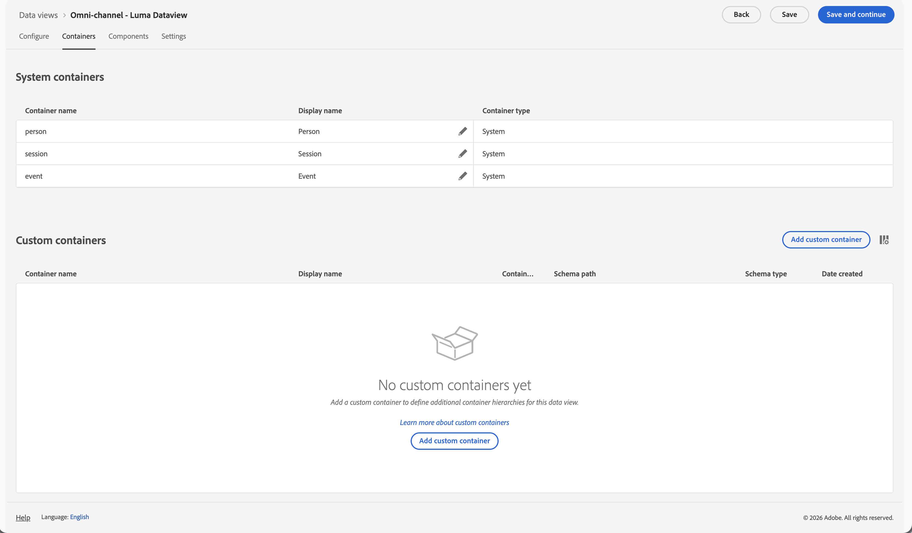

# Création ou modification d’une vue de données

La création dʼune vue de données implique soit la création de mesures et de dimensions à partir dʼéléments de schéma, soit lʼutilisation de composants standard. La plupart des éléments de schéma peuvent être une dimension ou une mesure selon les besoins de votre entreprise. Une fois que vous avez fait glisser un élément de schéma dans une vue de données, des options s’affichent à droite, où vous pouvez ajuster le fonctionnement de la dimension ou de la mesure dans Customer Journey Analytics.

>[!BEGINSHADEBOX]

Voir  [Créer ou modifier une vue de données](https://experienceleague.adobe.com/fr/docs/customer-journey-analytics-learn/tutorials/data-views/overview-of-configuring-data-views-for-cja){target="_blank"} pour une vidéo de démonstration.

>[!ENDSHADEBOX]

Pour créer ou modifier une vue de données, procédez comme suit :

1. Connectez-vous à [Customer Journey Analytics](https://analytics.adobe.com) et sélectionnez **[!UICONTROL Vues de données]**, éventuellement à partir de **[!UICONTROL Gestion des données]**, dans le menu supérieur.
1. Pour créer une vue de données, sélectionnez **[!UICONTROL Créer une vue de données]**. Vous pouvez également sélectionner une vue de données existante dans la liste des vues de données pour la modifier.

## Configurer {#configure}

Pour configurer une vue de données nouvelle ou existante :

1. Sélectionnez l’onglet **[!UICONTROL Configurer]**, le cas échéant.
1. Spécifiez les détails **[!UICONTROL Paramètres]**, **[!UICONTROL Compatibilité]**, **[!UICONTROL Paramètres d’IA]** et **[!UICONTROL Calendrier]** (voir ci-dessous).
1. Sélectionnez **[!UICONTROL Enregistrer et continuer]** pour continuer à configurer votre vue de données nouvelle ou existante. Sélectionnez **[!UICONTROL Enregistrer]** pour enregistrer la configuration de votre vue de données existante.

### Paramètres {#configure-settings}

>[!CONTEXTUALHELP]
>id="dataview_externalid"
>title="Identifiant externe"
>abstract="La modification de l’ID externe a une incidence sur l’affichage du nom de la vue de données dans les sources externes, telles que les outils de Business Intelligence."

Fournit des paramètres globaux pour la vue de données.

| Paramètre | Description |
| --- | --- |
| **[!UICONTROL Connexion]** | Ce champ relie la vue de données à la connexion que vous avez établie précédemment, qui contient un ou plusieurs jeux de données Adobe Experience Platform. |
| **[!UICONTROL Nom]** | Obligatoire. Nom de la vue de données. Cette valeur s’affiche dans le menu déroulant supérieur droit d’Analysis Workspace. |
| **[!UICONTROL ID externe]** | Obligatoire. Nom de la vue de données que vous pouvez utiliser dans des sources externes, telles que les outils d’informatique décisionnelle (Business Intelligence). La valeur par défaut est `unspecified`. Si vous ne spécifiez pas d’ID externe, le nom sera généré à partir du nom de la vue de données, en remplaçant les espaces par des traits de soulignement. |
| **[!UICONTROL Description]** | Facultatif. Adobe recommande une description détaillée afin que les utilisateurs comprennent pourquoi la vue de données existe et pour qui elle a été conçue. |

{style="table-layout:auto"}

### Compatibilité {#compatibility}

>[!CONTEXTUALHELP]
>id="dataview_dataviewsinadobejourneyoptimizer"
>title="Vues de données dans Journey Optimizer"
>abstract="Customer Journey Analytics requiert une connexion et une vue de données compatibles avec Adobe Journey Optimizer. Par défaut, le système crée une connexion et une vue de données. Vous pouvez également activer cette option pour la définir comme vue de données par défaut pour la création de rapports Adobe Journey Optimizer, ce qui ajoute les composants nécessaires à la vue de données et aux jeux de données de la connexion."
>additional-url="https://experienceleague.adobe.com/fr/docs/analytics-platform/using/integrations/ajo#connection" text="Les composants et les jeux de données ajoutés."

Fournit des paramètres applicables lors de l’utilisation d’Adobe Journey Optimizer en plus de Customer Journey Analytics.

Cette section n’est visible que pour l’équipe d’administration disposant de Journey Optimizer.

| Paramètre | Description |
| --- | --- |
| [!UICONTROL **Définir la vue des données par défaut dans Adobe Journey Optimizer**] | Cette option de configuration permet de standardiser la création de rapports dans Journey Optimizer et Customer Journey Analytics. Elle vous permet également d’effectuer une analyse avancée de vos données Adobe Journey Optimizer dans Customer Journey Analytics (en sélectionnant  [!UICONTROL **Analyse dans CJA**] dans Journey Optimizer).
Pour effectuer ce type d’analyse, Journey Optimizer doit avoir accès à une vue de données de Customer Journey Analytics.
Activez cette option pour que cette vue de données soit utilisée par défaut dans les rapports de Journey Optimizer pour votre sandbox.

Cette option de configuration permet d’effectuer automatiquement ce qui suit :
<ul><li>Configurer tous les jeux de données Journey Optimizer requis dans la connexion associée dans Customer Journey Analytics pour une utilisation avec Journey Optimizer.</li><li>Créer un ensemble de mesures et de dimensions Journey Optimizer dans la vue de données (y compris les champs dérivés et les mesures calculées). Les libellés de contexte sont automatiquement définis sur toutes ces mesures et dimensions.</li><li>Active automatiquement l’option **[!UICONTROL Utiliser dans CJA]** dans la connexion associée à cette vue de données. (Pour en savoir plus sur cette option, voir [Utiliser une connexion Journey Optimizer dans Customer Journey Analytics](/help/connections/manage-connections.md).)
Si vous désactivez manuellement ce paramètre après son activation, la connexion et les vues de données associées sont réinitialisées à leur état par défaut. Cela peut entraîner des modifications des données dans vos rapports.
</li></ul>

Tenez compte des points suivants lorsque vous activez cette option : <ul><li>Vous pouvez modifier ultérieurement la vue de données par défaut, mais cela peut modifier vos données de création de rapports Journey Optimizer. Si vous choisissez de désactiver cette option une fois qu’elle est activée, vous devrez sélectionner une nouvelle vue de données par défaut.</li><li>Si vous avez déjà personnalisé manuellement des jeux de données, dimensions ou mesures dans la vue de données Customer Journey Analytics, vos personnalisations manuelles restent inchangées lors de l’activation de cette option de configuration. Cette option permet d’effectuer des personnalisations supplémentaires qui permet de standardiser davantage la création de rapports dans Journey Optimizer et Customer Journey Analytics. Vous pouvez également procéder à des personnalisations manuelles après avoir activé cette option.</li><li>Lorsque cette option est sélectionnée, la connexion associée à la vue de données ne peut pas être supprimée.</li></ul>Voir [Intégrer Adobe Journey Optimizer à Adobe Customer Journey Analytics](/help/integrations/ajo.md) pour plus d’informations. |

{style="table-layout:auto"}

### Paramètres de l’IA

Sélectionnez **[!UICONTROL Activer pour Data Insights Agent]** pour activer la vue de données pour le [Data Insights Agent](/help/data-analysis-ai.md). Le Data Insights Agent est un agent de conversation d’IA génératif accessible à partir de l’assistant d’IA dans Customer Journey Analytics. Il vous permet d’analyser rapidement vos données à l’aide d’invites textuelles. L’agent crée des visualisations pertinentes dans Analysis Workspace à l’aide des composants de votre vue de données et en utilisant vos données réelles.

### Calendrier

Indique le format du calendrier que la vue de données doit suivre. Vous pouvez avoir plusieurs vues de données basées sur la même [connexion](/help/connections/create-connection.md) et leur donner différents types de calendrier ou fuseaux horaires. Ces vues de données peuvent permettre aux équipes qui utilisent différents types de calendrier de répondre à leurs besoins respectifs avec les mêmes données sous-jacentes.

| Paramètre | Description |
| --- | --- |
| [!UICONTROL **Fuseau horaire**] | Choisissez le fuseau horaire dans lequel vous souhaitez que vos données soient présentées. Si vous choisissez un fuseau horaire qui fonctionne à l’heure d’été, les données sont automatiquement ajustées pour refléter cette situation. Au printemps, lorsque les horloges avancent d’une heure, un intervalle d’une heure est présent. À l’automne, lorsque les horloges reculent d’une heure, une heure est répétée pendant le changement d’heure. |
| [!UICONTROL **Type de calendrier**] | Déterminez comment les semaines du mois sont regroupées. **Grégorien :** Format de calendrier standard. Les trimestres sont regroupés par mois. **4-5-4 Vente au détail :** Un calendrier de vente au détail 4-5-4 normalisé. Les premier et dernier mois du trimestre contiennent 4 semaines, tandis que le deuxième mois du trimestre contient 5 semaines. **Personnalisé (4-5-4) :** similaire au calendrier 4-5-4, sauf que vous pouvez choisir le premier jour de l’année et l’année où la semaine « supplémentaire » se produit. **Personnalisé (4-4-5) :** les premier et deuxième mois de chaque trimestre contiennent 4 semaines, tandis que le dernier mois de chaque trimestre contient 5 semaines. **Personnalisé (5-4-4) :** le premier mois de chaque trimestre contient 5 semaines, tandis que le deuxième et le troisième mois de chaque trimestre contient 4 semaines. |
| [!UICONTROL **Premier mois de l’année**] et [!UICONTROL **premier jour de la semaine**] | Visible pour le type de calendrier grégorien. Indiquez le mois où vous souhaitez que l’année civile commence et le jour où vous souhaitez que chaque semaine commence. |
| [!UICONTROL **Premier jour de l’année en cours**] | Visible pour les types de calendrier personnalisés. Indiquez le jour de l’année où vous souhaitez que l’année en cours commence. Le calendrier formate automatiquement le premier jour de chaque semaine en fonction de cette valeur. |
| [!UICONTROL **Année au cours de laquelle la semaine « supplémentaire » a lieu**] | Avec la plupart des calendriers de 364 jours (52 semaines de 7 jours chacune), chaque année accumule les jours restants jusqu’à ce qu’ils forment une semaine supplémentaire. Cette semaine supplémentaire est alors ajoutée au dernier mois de cette année. Indiquez à quelle année vous souhaitez ajouter la semaine supplémentaire.  **Semaines supplémentaires et années bissextiles**  Lorsque vous sélectionnez un **[!UICONTROL Type de calendrier]** personnalisé (**[!UICONTROL Personnalisé (4-5-4)]**, **[!UICONTROL Personnalisé (4-4-5)]** ou **[!UICONTROL Personnalisé (5-4-4)]**), les jours restants s’accumulent chaque année jusqu’à former une semaine supplémentaire complète (7 jours). Cette semaine supplémentaire est ajoutée à l’année que vous sélectionnez dans **[!UICONTROL Année au cours de laquelle la semaine « supplémentaire » a lieu]**.  Les années bissextiles ne sont délibérément pas affichées dans la section **[!UICONTROL Année au cours de laquelle la semaine « supplémentaire » a lieu]**. Cependant, une année bissextile peut toujours contenir 53 semaines. Pour forcer une année bissextile à contenir 53 semaines, sélectionnez une année non bissextile dans **[!UICONTROL Année au cours de laquelle la semaine « supplémentaire » a lieu]** afin de vous assurer que la dérive cumulée des dates contient 7 jours pour votre année bissextile cible. Par exemple : pour disposer de 53 semaines en 2024, sélectionnez **[!UICONTROL 2019]**. De 2019 à 2024, la dérive totale de la date est de 7 jours (2020 (+2), 2021 (+1), 2022 (+1), 2023 (+1) et 2024 (+2)), ce qui se traduit par une 53e semaine en 2024.  La sélection pour **[!UICONTROL Premier jour de l’année en cours]** a une incidence sur le lieu d’arrivée de la semaine supplémentaire. Confirmez votre configuration en utilisant l’aperçu du calendrier. |

{style="table-layout:auto"}

## Conteneurs

{{release-limited-testing-section}}

>[!BEGINTABS]

>[!TAB Standard]

>[!TAB B2B Edition]

>[!ENDTABS]

Dans l’onglet **[!UICONTROL Conteneurs]** vous pouvez renommer les conteneurs système et ajouter des conteneurs personnalisés.

### Conteneurs système

Désigne le nom des conteneurs pour la vue de données. Les noms de conteneur sont souvent utilisés dans les [segments](/help/components/segments/seg-overview.md#containers).

| Nom du conteneur | Nom d’affichage (par défaut) | Description |
| --- | --- | --- |
| globalAccount | [!BADGE Compte &#x200B;]{type=Informative url="https://experienceleague.adobe.com/fr/docs/analytics-platform/using/cja-overview/cja-b2b/cja-b2b-edition" newtab=true tooltip="Customer Journey Analytics B2B Edition"} **[!UICONTROL &#x200B; Global &#x200B;]** | Le conteneur [!UICONTROL Compte global] inclut toutes les sessions et événements des comptes globaux au cours de la période indiquée. Si votre organisation utilise un autre terme, vous pouvez renommer le conteneur ici. |
| Personne | **[!UICONTROL Personne]** | Le conteneur [!UICONTROL Personne] inclut chaque session et événement pour les personnes au cours dʼune période indiquée. Si votre organisation utilise un autre terme (par exemple, « Visiteur » ou « Utilisateur »), vous pouvez renommer le conteneur ici. |
| séance | **[!UICONTROL Session]** | Le conteneur [!UICONTROL Session] permet dʼidentifier les interactions de pages, les campagnes ou les conversions pour une session spécifique. Vous pouvez renommer ce conteneur en « Visite » ou tout autre terme de votre choix. |
| opportunité | {type=Informative url="https://experienceleague.adobe.com/fr/docs/analytics-platform/using/cja-overview/cja-b2b/cja-b2b-edition" newtab=true tooltip="Customer Journey Analytics B2B Edition"} **[!UICONTROL Opportunity &#x200B;]** | Le conteneur [!UICONTROL Opportunité] inclut toutes les sessions et événements des opportunités au cours de la période indiquée. Si votre organisation utilise un autre terme, vous pouvez renommer le conteneur ici. |
| buyGroup | {type=Informative url="https://experienceleague.adobe.com/fr/docs/analytics-platform/using/cja-overview/cja-b2b/cja-b2b-edition" newtab=true tooltip="Customer Journey Analytics B2B Edition"} **[!UICONTROL Groupe d&#39;achat &#x200B;]** | Le conteneur [!UICONTROL Groupe d’achat] inclut toutes les sessions et événements des groupes d’achat au cours de la période indiquée. Si votre organisation utilise un autre terme, vous pouvez renommer le conteneur ici. |
| événement | **[!UICONTROL Événement]** | Le conteneur [!UICONTROL Événement] définit des événements individuels dans un jeu de données. Si votre organisation utilise un autre terme (par exemple, « Accès » ou « Pages vues »), vous pouvez renommer le conteneur ici. |
| account | {type=Informative url="https://experienceleague.adobe.com/fr/docs/analytics-platform/using/cja-overview/cja-b2b/cja-b2b-edition" newtab=true tooltip="Customer Journey Analytics B2B Edition"} **[!UICONTROL Account &#x200B;]** | Le conteneur [!UICONTROL Compte] inclut toutes les sessions et événements des comptes au cours de la période indiquée. Si votre organisation utilise un autre terme, vous pouvez renommer le conteneur ici. |

Pour renommer des conteneurs système :

1. Sélectionnez  pour modifier le **[!UICONTROL Nom d’affichage]** du conteneur.
1. Définissez un nouveau nom pour le conteneur.
1. Sélectionnez **[!UICONTROL Enregistrer]**.

### Conteneurs personnalisés

Vous ajoutez des conteneurs personnalisés à votre vue de données afin de pouvoir les utiliser pour l’analyse des [sous-événements](/help/components/segments/sub-event.md). Les conteneurs personnalisés peuvent être définis à partir des éléments suivants :

* objets ou tableaux disponibles dans les jeux de données qui font partie de la connexion. Par exemple, **[!UICONTROL productListItems]**, **[!UICONTROL content_assets]** ou **[!UICONTROL placeContext.activePOIs]**.
* les champs dérivés qui renvoient un tableau par l’utilisation de la fonction [Split](/help/data-views/derived-fields/derived-fields.md#split).
* Composants de vue de données configurés pour renvoyer un tableau à l’aide des paramètres de composant [Sous-chaîne](/help/data-views/component-settings/substring.md) avec l’option [Délimiteur](/help/data-views/component-settings/substring.md#delimiter).

Pour ajouter un conteneur personnalisé :

1. Sélectionnez **[!UICONTROL Ajouter un conteneur personnalisé]**.
1. Dans la boîte de dialogue **[!UICONTROL Ajouter un conteneur]** :
   1. Sélectionnez un conteneur dans le menu déroulant **[!UICONTROL Conteneur]**. Par exemple : **[!UICONTROL productListItems.productCategories]**. Une fois la sélection effectuée, les valeurs mises à jour pour **[!UICONTROL Chemin du schéma]** et **[!UICONTROL Type de schéma]** s’affichent.

   1. Saisissez un **[!UICONTROL Nom d’affichage]** pour le conteneur. Par exemple : `Product Categories`.
   1. Sélectionnez **[!UICONTROL Enregistrer]**.

Pour modifier un conteneur personnalisé :

1. Sélectionnez  pour le conteneur personnalisé dans la colonne **[!UICONTROL Nom d’affichage]**.
1. Sélectionnez  **[!UICONTROL Modifier]** dans le menu contextuel.
1. Dans la boîte de dialogue **[!UICONTROL Modifier le conteneur]** :
   1. Modifiez **[!UICONTROL Conteneur]** ou **[!UICONTROL Nom d’affichage]** ou les deux.
   1. Sélectionnez **[!UICONTROL Enregistrer]**.

Pour supprimer un conteneur personnalisé :

1. Sélectionnez  pour le conteneur personnalisé dans la colonne Nom d’affichage .
1. Sélectionnez  **[!UICONTROL Supprimer]** dans le menu contextuel.

   >[!NOTE]
   >
   >Le conteneur personnalisé est supprimé sans confirmation.
   >

Pour modifier la liste des conteneurs personnalisés :

1. Sélectionnez .
1. Dans **[!UICONTROL Personnaliser le tableau]** :
   1. Sélectionnez les colonnes à afficher.
   1. Sélectionnez **[!UICONTROL Enregistrer]**.

## Composants

Vous pouvez ensuite définir les composants d’une vue de données et créer ainsi des mesures et des dimensions à partir d’éléments de schéma. Vous pouvez également utiliser des composants standard.

>[!IMPORTANT]
>
>Vous pouvez ajouter jusqu’à 5 000 mesures et 5 000 dimensions à une seule vue de données.

1. Sélectionnez l’onglet **[!UICONTROL Composants]**.

   

   Vous pouvez voir la [!UICONTROL connexion] en haut à gauche qui contient les jeux de données et ses [!UICONTROL champs de schéma] en dessous.  Toutes les vues de données incluent des composants standard tels que les événements, les personnes, les mesures de session et les dimensions temporelles.<ul><li>Lorsque vous définissez [conteneurs personnalisés](#containers-1), les mesures sont automatiquement ajoutées sous la forme  **[!UICONTROL _nom de conteneur personnalisé&#x200B;_Occurrences]**.</li><li>Le système applique par défaut le filtre **[!UICONTROL n’est pas obsolète]** afin que seuls les champs de schéma non obsolètes apparaissent.</li></ul>

1. Recherchez un champ de schéma à l’aide de l’ **[!UICONTROL Rechercher des champs de schéma]**, ou bien recherchez un champ en accédant à l’une des collections de jeux de données, comme  **[!UICONTROL Jeux de données d’événement]** ou  **[!UICONTROL Jeux de données de recherche]**. Pour les jeux de données d’événement, des collections distinctes pour  **[!UICONTROL Champs XDM]** et  **[!UICONTROL Champs ad hoc et relationnels]** sont disponibles. Vous pouvez également créer un champ dérivé à l’aide de Créer un champ dérivé&#x200B;**&#x200B;**. Voir [Champs dérivés](./derived-fields/derived-fields.md) pour plus d’informations.

1. Une fois que vous avez trouvé votre champ de schéma spécifique ou défini votre champ dérivé, faites glisser ce champ, par exemple  **[!UICONTROL Nom de page]**, du rail de gauche vers la section **[!UICONTROL Mesures]** ou **[!UICONTROL Dimensions]** sous **[!UICONTROL Composants inclus]**.Vous pouvez faire glisser plusieurs fois le même champ de schéma vers les sections des dimensions ou des mesures et configurer la même dimension ou mesure de différentes manières. Par exemple, dans le champ pageName , créez des dimensions `Product Pages` et `Error pages` à l’aide de différents [paramètres de composant](component-settings/overview.md) sur la droite.Si vous faites glisser un dossier de champ de schéma depuis le rail de gauche, les champs du dossier sont automatiquement classés dans la section appropriée. Les champs de chaîne se retrouvent dans la section [!UICONTROL Dimensions] et les types de schémas numériques se retrouvent dans la section [!UICONTROL Mesures]. Vous pouvez également cliquer sur **[!UICONTROL Ajouter tout]** et tous les champs de schéma sont ajoutés à leur section respective.

1. Une fois que vous avez sélectionné un composant, les paramètres s’affichent à droite.

   

   Configurez le composant à l’aide des [paramètres du composant](component-settings/overview.md). Les paramètres de composant disponibles dépendent du fait que le composant soit une dimension/mesure et du type de données de schéma. Les paramètres incluent :

   * [[!UICONTROL Attribution]](component-settings/attribution.md)
   * [[!UICONTROL Comportement]](component-settings/behavior.md)
   * [[!UICONTROL Format]](component-settings/format.md)
   * [[!UICONTROL Inclure/Exclure les valeurs]](component-settings/include-exclude-values.md)
   * [[!UICONTROL Déduplication des mesures]](component-settings/metric-deduplication.md)
   * [[!UICONTROL Pas d’option de valeur]](component-settings/no-value-options.md)
   * [[!UICONTROL Persistance]](component-settings/persistence.md)
   * [[!UICONTROL Classification des valeurs]](component-settings/value-bucketing.md)

1. Sélectionnez **[!UICONTROL Enregistrer et continuer]** pour continuer à configurer votre vue de données nouvelle ou existante. Sélectionnez **[!UICONTROL Enregistrer]** pour enregistrer la configuration de votre vue de données existante.

### Dupliquer les mesures ou les dimensions

La duplication des mesures ou des dimensions ainsi que la modification ultérieure des paramètres spécifiques est un moyen efficace de créer plusieurs mesures ou dimensions à partir d’un seul champ de schéma. Sélectionnez le paramètre [!UICONTROL Dupliquer] sous le nom de la mesure ou de la dimension en haut à droite. Ensuite, modifiez la nouvelle mesure ou dimension et enregistrez-la sous un nom plus explicite.

### Filtrer les champs de schéma ou les jeux de données

Vous pouvez filtrer  les champs de schéma dans le rail de gauche par [!UICONTROL type de données], [!UICONTROL jeux de données], [!UICONTROL gouvernance des données] et [!UICONTROL autres] critères ([!UICONTROL contient des données], [!UICONTROL est une identité] et [!UICONTROL n’est pas obsolète]) :

>[!TIP]
>
>Si les composants ne se chargent pas correctement dans votre vue de données et qu’un message d’erreur s’affiche, reportez-vous à la section [Manque d’autorisations](../troubleshooting/lack-of-permissions.md) pour une résolution.

### Composants inclus {#included-components}

>[!CONTEXTUALHELP]
>id="dataview_includedcomponents_filter_datagovernance_custom"
>title="Libellés personnalisés"
>abstract="Outre les libellés fournis par Adobe, vous pouvez également définir vos propres libellés personnalisés pour votre entreprise."
>additional-url="https://experienceleague.adobe.com/fr/docs/experience-platform/data-governance/labels/overview" text="Vue d’ensemble des libellés d’utilisation des données"

>[!CONTEXTUALHELP]
>id="dataview_includedcomponents_filter_datagovernance_contract"
>title="Libellés de contrat"
>abstract="Les libellés Contrat (C) sont utilisés pour catégoriser des données qui possèdent des obligations contractuelles ou qui sont liées aux politiques de gouvernance des données de votre organisation."
>additional-url="https://experienceleague.adobe.com/fr/docs/experience-platform/data-governance/labels/overview" text="Vue d’ensemble des libellés d’utilisation des données"

>[!CONTEXTUALHELP]
>id="dataview_includedcomponents_filter_datagovernance_identity"
>title="Libellés Identité"
>abstract="Les libellés Identité (I) sont utilisés pour catégoriser des données pouvant permettre d’identifier ou de contacter une personne en particulier."
>additional-url="https://experienceleague.adobe.com/fr/docs/experience-platform/data-governance/labels/overview" text="Vue d’ensemble des libellés d’utilisation des données"

>[!CONTEXTUALHELP]
>id="dataview_includedcomponents_filter_datagovernance_sensitive"
>title="Libellés sensibles"
>abstract="Les libellés sensibles (S) sont utilisés pour catégoriser les données que vous et votre entreprise considérez comme sensibles."
>additional-url="https://experienceleague.adobe.com/fr/docs/experience-platform/data-governance/labels/overview" text="Vue d’ensemble des libellés d’utilisation des données"

>[!CONTEXTUALHELP]
>id="dataview_includedcomponents_filter_datagovernance_partnerecosystem"
>title="Écosystème du partenaire"
>abstract="Les libellés Écosystème du partenaire (P) servent à catégoriser les données partagées avec des partenaires tiers."
>additional-url="https://experienceleague.adobe.com/fr/docs/experience-platform/data-governance/labels/overview" text="Vue d’ensemble des libellés d’utilisation des données"

>[!CONTEXTUALHELP]
>id="dataview_includedcomponents_filter_datagovernance_policies"
>title="Politiques"
>abstract="Pour garantir la conformité des données, implémentez des politiques d’utilisation des données. Ces politiques décrivent les actions marketing autorisées ou restreintes sur les données dans Experience Platform. Les filtres Politiques appliquent la politique activée à la vue de données."
>additional-url="https://experienceleague.adobe.com/fr/docs/experience-platform/data-governance/labels/overview" text="Vue d’ensemble des libellés d’utilisation des données"

>[!CONTEXTUALHELP]
>id="dataview_includedcomponents_filter_datagovernance_responsibleengagement"
>title="Libellés d’engagement responsable"
>abstract="Les libellés d’engagement responsable sont utilisés pour soutenir l’engagement responsable."
>additional-url="https://experienceleague.adobe.com/fr/docs/experience-platform/data-governance/labels/overview" text="Vue d’ensemble des libellés d’utilisation des données"

La section **[!UICONTROL Composants inclus]** contient la liste des **[!UICONTROL Mesures]** et **[!UICONTROL Dimensions]** que vous configurez pour la vue de données.

* Pour rechercher des composants, utilisez  **[!UICONTROL _Rechercher des composants_]**.
* Pour filtrer les composants inclus répertoriés, sélectionnez .

  

  Dans la boîte de dialogue **[!UICONTROL Filtrer par]**, vous pouvez filtrer selon les catégories suivantes :

   * **[!UICONTROL Type de données]** - Vous pouvez sélectionner un ou plusieurs des types de données suivants : [!UICONTROL Chaîne], [!UICONTROL Entier], [!UICONTROL Court], [!UICONTROL Booléen], [!UICONTROL Double], [!UICONTROL Octet], [!UICONTROL Long], [!UICONTROL Date] ou [!UICONTROL Date-heure].
   * **[!UICONTROL Jeux de données]** - Sélectionnez un ou plusieurs jeux de données.
   * **[!UICONTROL Gouvernance des données]** : sélectionnez un ou plusieurs libellés parmi les sous-catégories [!UICONTROL Libellés personnalisés], [!UICONTROL Libellés de contrat], [!UICONTROL Libellés d’identité], [!UICONTROL Libellés de sensibilité], [!UICONTROL Écosystème de partenaires] ou [!UICONTROL Politiques].
   * **[!UICONTROL Autre]** - Sélectionnez une ou plusieurs des options [!UICONTROL Contient des données], [!UICONTROL Est une identité] ou [!UICONTROL N’est pas obsolète].

  Sélectionnez **[!UICONTROL Appliquer]** pour appliquer les filtres.

## Paramètres {#dataview-settings}

1. Sélectionnez l’onglet **[!UICONTROL Paramètres]**.

   

1. Configurez les segments à appliquer à l’ensemble de votre vue de données. Voir [Paramètres (segments)](#settings-filters) ci-dessous.
1. Configurez les mesures et le délai d’expiration de la session. Voir [Paramètres de session](#session-settings) ci-dessous.

1. Sélectionnez **[!UICONTROL Enregistrer et continuer]** pour continuer à configurer votre vue de données nouvelle ou existante. Sélectionnez **[!UICONTROL Enregistrer]** pour enregistrer la configuration de votre vue de données existante.

### Paramètres (segments) {#segment-settings}

Vous pouvez ajouter des segments qui sʼappliquent à lʼensemble de votre vue de données. Ce segment sera appliqué à tout rapport exécuté dans Espace de travail. Faites glisser un segment des composants du rail de gauche vers le champ **[!UICONTROL Ajouter des filtres]**.

### Paramètres de session

Déterminez la période d’inactivité entre les événements avant l’expiration d’une session et le début d’une nouvelle session. Une période est requise. Vous pouvez éventuellement forcer le démarrage d’une nouvelle session lorsqu’un événement contient une mesure spécifique. Voir [Paramètres de session](session-settings.md) pour plus d’informations.

### Prévisualisation des données

La prévisualisation des données compare (pour les différents conteneurs) les données de cette vue de données avec celles de la connexion. Le pourcentage de prévisualisation est basé sur le nombre total dans la connexion des 90 derniers jours.

Si l’aperçu ne se charge pas, la connexion est toujours en cours de remplissage.

Une fois tous les paramètres spécifiés, cliquez sur **[!UICONTROL Enregistrer et terminer]**.
