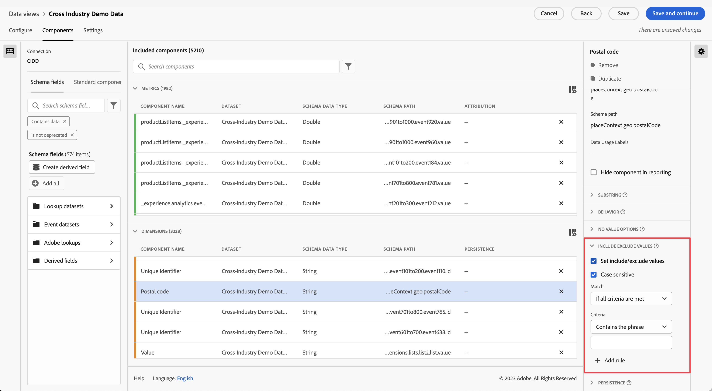

# Création dʼune nouvelle vue de données

La création dʼune vue de données implique soit la création de mesures et de dimensions à partir dʼéléments de schéma, soit lʼutilisation de composants standard. La création de mesures ou de dimensions vous offre une très grande flexibilité. Auparavant, si vous disposiez de jeux de données dans Adobe Experience Platform, les champs de chaîne étaient utilisés en tant que dimensions et les champs numériques en tant que mesures. Pour modifier lʼun de ces champs, vous deviez modifier votre schéma dans Platform. Lʼinterface utilisateur des vues de données permet désormais une [définition plus libre des mesures et des dimensions](/help/data-views/data-views.md). Retrouvez dʼautres cas dʼutilisation dans la section [Cas dʼutilisation des vues de données](/help/data-views/data-views-usecases.md).

## 1. Configuration des paramètres et des conteneurs des vues de données

1. Dans Customer Journey Analytics, accédez à l’onglet **[!UICONTROL Vues de données]**.
2. Cliquez sur **[!UICONTROL Ajouter]** pour créer une nouvelle vue de données et configurer ses paramètres.

| Paramètre | Description/Cas d’utilisation |
| --- | --- |
| [!UICONTROL Connexion] | Ce champ relie la vue de données à la connexion que vous avez établie précédemment, qui contient un ou plusieurs jeux de données Adobe Experience Platform. |
| [!UICONTROL Nom] | Il est obligatoire d’attribuer un nom à la vue de données. |
| [!UICONTROL Description] | Une description détaillée nʼest pas obligatoire, mais recommandée. |
| [!UICONTROL Fuseau horaire] | Choisissez le fuseau horaire dans lequel vous souhaitez que vos données soient présentées. |
| [!UICONTROL Balises] | [!UICONTROL Les balises vous permettent d’organiser vos vues de données en catégories.] |
| [!UICONTROL Conteneurs] | Vous pouvez renommer vos conteneurs ici afin de déterminer la façon dont ils apparaîtront dans tout projet Workspace basé sur cette vue de données. Les [!UICONTROL conteneurs] sont utilisés dans les filtres, les abandons/flux, etc. Ils permettent de définir lʼétendue ou les limites de la portée ou du contexte. [En savoir plus](https://experienceleague.adobe.com/docs/analytics-platform/using/cja-components/cja-filters/filters-overview.html?lang=fr#filter-containers) |
| [!UICONTROL Le nom du conteneur Personne est...] | [!UICONTROL Personne] (par défaut). Le conteneur [!UICONTROL Personne] inclut chaque visite et page vue pour les visiteurs au cours dʼune période indiquée. Vous pouvez renommer ce conteneur en « Utilisateur » ou tout autre terme de votre choix. |
| [!UICONTROL Le nom du conteneur Session est...] | [!UICONTROL Session] (par défaut). Le conteneur [!UICONTROL Session] permet dʼidentifier les interactions de pages, les campagnes ou les conversions pour une session spécifique. Vous pouvez renommer ce conteneur en « Visite » ou tout autre terme de votre choix. |
| [!UICONTROL Le nom du conteneur Événement est...] | [!UICONTROL Événement] (par défaut). Le conteneur [!UICONTROL Événement] définit les événements de page que vous souhaitez inclure ou exclure dʼun filtre. |

Vous pouvez ensuite créer des mesures et des dimensions à partir dʼéléments de schéma. Vous pouvez également utiliser des composants standard.

## 2. Création de mesures et de dimensions à partir dʼéléments de schéma

1. Dans [!UICONTROL Customer Journey Analytics] > [!UICONTROL Vues de données], cliquez sur lʼonglet [!UICONTROL Composants].

Vous pouvez voir la [!UICONTROL connexion] en haut à gauche qui contient les jeux de données et ses [!UICONTROL champs de schéma] en dessous. Gardez les éléments suivants à l’esprit :

* Les composants déjà inclus sont les composants standard requis (générés par le système).
* Par défaut, Adobe applique le filtre **[!UICONTROL Contient des données]**. Ainsi, seuls les champs de schéma contenant des données apparaissent. Si vous recherchez un champ qui ne contient pas de données, supprimez le filtre.

1. Faites maintenant glisser un champ de schéma, tel que [!UICONTROL pageTitle], du rail de gauche vers la section Mesures ou Dimensions.

   Vous pouvez faire glisser plusieurs fois le même champ de schéma vers les sections des dimensions ou des mesures et configurer la même dimension ou mesure de différentes manières.
Par exemple, à partir du champ **[!UICONTROL pageTitle]**, vous pouvez créer une dimension appelée « Pages de produits » et une autre « Pages dʼerreurs », etc., en renommant le **[!UICONTROL nom du composant]** à droite. À partir du champ **[!UICONTROL pageTitle]**, vous pouvez également créer des mesures à partir dʼune valeur de chaîne. Par exemple, vous pouvez créer une ou plusieurs mesures **[!UICONTROL Commandes]** avec des paramètres dʼattribution différents et des valeurs dʼinclusion/exclusion différentes.

   

   >[!NOTE]
   >
   >Vous pouvez faire glisser des dossiers entiers de champs de schéma depuis le rail de gauche et les trier automatiquement en sections traditionnelles. Les champs de chaîne se retrouvent dans la section [!UICONTROL Dimensions] et les champs numériques dans la section [!UICONTROL Mesures]. Vous pouvez également cliquer sur **[!UICONTROL Ajouter tout]** et tous les champs de schéma seront ajoutés.

1. Une fois le composant sélectionné, plusieurs paramètres sʼaffichent sur la droite. Configurez le composant à lʼaide des paramètres décrits ci-dessous.

### Configuration des paramètres des composants

| Paramètre | Description/Cas d’utilisation |
| --- | --- |
| [!UICONTROL Type de composant] | Obligatoire. Permet de modifier un composant de mesure en dimension ou vice versa. |
| [!UICONTROL Nom du composant] | Obligatoire. Permet de définir le nom convivial qui apparaîtra dans Analysis Workspace. Vous pouvez renommer un composant pour lui donner un nom spécifique à la vue de données. |
| [!UICONTROL Description] | Facultatif, mais recommandé, afin de fournir des informations sur le composant à dʼautres utilisateurs. |
| [!UICONTROL Balises] | Facultatif. Permet de marquer le composant avec des balises personnalisées ou prêtes à lʼemploi pour faciliter la recherche/filtrage dans lʼinterface utilisateur Analysis Workspace. |
| [!UICONTROL Nom du champ] | Nom du champ de schéma. |
| [!UICONTROL Type de jeu de données] | Obligatoire. Champ non modifiable qui indique le type de jeu de données (événement, recherche ou profil) dʼoù provient le composant. |
| [!UICONTROL Jeu de données] | Obligatoire. Champ non modifiable qui indique le type de champ dʼoù provient le composant (par exemple : chaîne, entier, etc.). Ce champ peut contenir plusieurs jeux de données. |
| [!UICONTROL Type de données de schéma] | Indique si le composant est une chaîne, un entier, etc.  Alors que vous pouvez utiliser n’importe quel type de champ de schéma pris en charge dans Platform, tous les types de champs ne sont pas pris en charge dans CJA. Les types de données pris en charge sont les suivants : `Integer`, `Int`, `Long`, `Double`, `Float`, `Number`, `Short`, `Byte`, `String` et `Boolean`. Notez que, pour le moment, les jeux de données de recherche n’autorisent que les chaînes. |
| [!UICONTROL ID du composant] | Obligatoire. [LʼAPI CJA](https://adobe.io/cja-apis/docs) utilise ce champ pour référencer le composant. Vous pouvez cliquer sur lʼicône Modifier afin de modifier cet identifiant de composant. Cependant, la modification de cet identifiant de composant rompt tous les projets Workspace existants qui contiennent ce composant. Si vous créez une autre vue de données qui utilise un champ différent pour la dimension pageTitle, vous pouvez la renommer et rendre la dimension compatible entre les vues de données. |
| [!UICONTROL Chemin du schéma] | Obligatoire. Champ non modifiable qui indique le chemin dʼaccès du schéma dʼoù provient le composant. |
| [!UICONTROL Masquer le composant dans le reporting] | Par défaut = désactivé. Permet de retirer le composant de la vue de données lorsquʼil est utilisé dans le compte rendu des performances. Cela nʼa pas dʼimpact sur les autorisations, mais uniquement sur le traitement des composants. En dʼautres termes, vous pouvez masquer le composant aux non-administrateurs dans le compte rendu des performances. Les administrateurs peuvent toujours y accéder en cliquant sur [!UICONTROL Afficher tous les composants] dans un projet Analysis Workspace. |

### Configuration des paramètres de mise en forme

Les paramètres de mise en forme sont réservés aux mesures.

| Paramètre | Description/Cas d’utilisation |
| --- | --- |
| [!UICONTROL Format] | Permet de définir la mise en forme dʼune mesure, telle que la valeur décimale, la durée, le pourcentage ou la devise. |
| [!UICONTROL Nombre de décimales] | Permet de définir le nombre de décimales quʼune mesure doit afficher. |
| [!UICONTROL Afficher la tendance à la hausse sous forme de] | Permet de définir si une tendance à la hausse de cette mesure doit être considérée comme bonne (verte) ou mauvaise (rouge). |
| [!UICONTROL Devise] | Ce paramètre ne sʼaffiche que si le format de mesure sélectionné est [!UICONTROL Devise]. Une liste dʼoptions de devises est disponible. La valeur par défaut est Aucune devise. Cela vous permet de représenter le chiffre dʼaffaires dans la devise de votre choix dans le compte rendu des performances. Il ne sʼagit pas dʼune conversion de devises, mais dʼune option de mise en forme de lʼinterface utilisateur. |

### Configuration des paramètres dʼattribution

| Paramètre | Description/Cas d’utilisation |
| --- | --- |
| [!UICONTROL Définir l’attribution] | Permet de définir les paramètres dʼattribution à appliquer par défaut à cette mesure lorsquʼelle est utilisée. Cette valeur par défaut peut être remplacée dans un [!UICONTROL tableau à structure libre] ou dans une mesure calculée. |
| [!UICONTROL Modèle d’attribution] | Permet de définir un modèle dʼattribution par défaut (uniquement actif lorsque vous activez le paramètre [!UICONTROL Utiliser un modèle dʼattribution autre que celui par défaut]). La valeur par défaut est [!UICONTROL Dernière touche]. Les options sont les suivantes : Dernière touche, Première touche, Linéaire, Participation, Même touche, En U, Courbe en J, J inversé, Dégradation dans le temps, Personnalisé et Algorithmique. Certaines de ces options créent des champs supplémentaires à remplir (par exemple, Personnalisé ou Dégradation dans le temps). Vous pouvez créer plusieurs mesures à lʼaide du même champ, ce qui signifie que vous pouvez avoir une mesure Chiffre dʼaffaires définie sur [!UICONTROL Dernière touche] et une mesure Chiffre dʼaffaires définie sur [!UICONTROL Première touche], mais basées sur le même champ Chiffre dʼaffaires dans le schéma. |
| [!UICONTROL Intervalle de recherche en amont] | Permet de définir un intervalle de recherche en amont par défaut pour une mesure (uniquement actif lorsque vous activez le paramètre [!UICONTROL Utiliser un modèle dʼattribution autre que celui par défaut]). Les options sont les suivantes : [!UICONTROL Personne] (intervalle du compte rendu des performances), [!UICONTROL Session] et [!UICONTROL Personnalisé]. Lorsque lʼoption [!UICONTROL Personnalisé] est sélectionnée, nous vous offrons également la possibilité de sélectionner nʼimporte quel nombre de jours/semaines/mois, etc. (jusquʼà 90 jours), à lʼinstar dʼ[!UICONTROL Attribution IQ]. Vous pouvez avoir plusieurs mesures à lʼaide du même champ de schéma, mais chacune dispose dʼun intervalle de recherche en amont distinct. |

### Configuration des paramètres des valeurs dʼinclusion/exclusion

Ce paramètre vous permet de modifier les données sous-jacentes pour lesquelles vous créez un compte rendu des performances, au moment de la requête. Il ne sʼagit pas dʼun filtre. Mais les filtres respecteront cette nouvelle dimension, tout comme le cheminement et lʼattribution.

Par exemple, vous pouvez créer une dimension à partir du champ pageTitle, mais lʼappeler « pages dʼerreur » et inclure toute page qui [!UICONTROL contient le mot] « erreur ».

| Paramètre | Description/Cas d’utilisation |
| --- | --- |
| [!UICONTROL Respect de la casse] | Par défaut = activé. Ce paramètre ne sʼapplique quʼà la section [!UICONTROL Valeurs dʼinclusion/exclusion]. Il vous permet de déterminer si la règle dʼinclusion/exclusion que vous appliquez doit respecter la casse. |
| [!UICONTROL Correspond à] | Permet de définir les valeurs à prendre en compte pour le compte rendu des performances avant lʼaffectation et les filtres (par exemple, utilisez uniquement les valeurs contenant le mot « erreur »). Vous pouvez définir : **[!UICONTROL si tous les critères sont remplis]**, ou **[!UICONTROL si lʼun dʼeux est rempli]**. |
| [!UICONTROL Critères] | Permet de définir la logique correspondante qui doit être appliquée à une règle de filtrage spécifique.<ul><li>**Chaîne** : contient lʼexpression, contient nʼimporte quel terme, contient tous les termes, ne contient pas nʼimporte quel terme, ne contient pas lʼexpression, est égal à, nʼest pas égal à, commence par, se termine par</li><li>**Doublon/Entier** : est égal à, nʼest pas égal à, est supérieur à, est inférieur à, est supérieur ou égal à, est inférieur ou égal à</li><li>**Date** : est égal à, nʼest pas égal à, est plus récent que, est antérieur à, se produit au niveau de</li></ul> |
| [!UICONTROL Opérande correspondant] | Permet de définir lʼopérande correspondant auquel lʼopérateur correspondant doit être appliqué.<ul><li>**Chaîne** : champ de texte</li><li>**Doublon/Entier** : champ de texte avec des flèches haut/bas pour les valeurs numériques</li><li>**Date** : sélecteur de granularité journalière (calendrier)</li><li>**Date/heure** : sélecteur de granularité de la date et de lʼheure</li></ul> |
| [!UICONTROL Ajouter une règle] | Permet de définir un opérateur et un opérande correspondant supplémentaire. |

### Configuration des paramètres de comportement

Permet de spécifier le comportement d’une mesure dans le compte rendu des performances.

| Paramètre | Description/Cas d’utilisation |
| --- | --- |
| [!UICONTROL Compter les valeurs] | Pour les mesures booléennes uniquement, ce paramètre vous permet de spécifier si vous souhaitez [!UICONTROL Compter les valeurs vraies], [!UICONTROL Compter les valeurs fausses] ou [!UICONTROL Compter les valeurs vraies ou fausses] pour la valeur de la mesure. Par défaut, le paramètre est défini sur [!UICONTROL Compter les valeurs vraies]. Vous obtenez ainsi la valeur réelle d’une mesure, par exemple « 50 » s’il existait une valeur de commande correspondant à 50. |
| [!UICONTROL Compter les instances] | Permet de définir si un champ de type numérique ou de date utilisé en tant que mesure doit compter les fois où il a été défini plutôt que la valeur elle-même.  Si vous souhaitez additionner les instances dʼun champ numérique et simplement additionner le nombre de fois quʼun champ a été *défini* plutôt que la valeur réelle dans le champ. Cela sʼavère utile pour créer une mesure [!UICONTROL Commandes] à partir dʼun champ [!UICONTROL Chiffre dʼaffaires], par exemple. Si le chiffre dʼaffaires a été défini, nous voulons à présent comptabiliser 1 seule commande plutôt que le montant numérique du chiffre dʼaffaires. |
| [!UICONTROL Minuscule] | *Nouveau*  - Pour les dimensions de type &quot;chaîne&quot;. Ce paramètre vous permet de contrôler si Customer Journey Analytics traite les valeurs de dimension comme étant sensibles à la casse. Il permet de dédupliquer les lignes ayant la même valeur, mais une casse différente. Si vous cochez **[!UICONTROL Minuscules]**, toutes les instances d’une dimension avec la même valeur seront signalées comme étant en minuscules. Cette capture d’écran montre ce qui se passe si vous ne **pas** cochez [!UICONTROL minuscule] plutôt que si vous **cochez la case**. Dans le tableau de gauche, remarquez comment &quot;liverpool&quot;, &quot;Liverpool&quot; et &quot;LIVERPOOL&quot; génèrent trois éléments de ligne distincts dans les rapports. Dans le tableau de droite, ces mêmes valeurs ont été dédupliquées et se trouvent sous un élément de ligne :  |

### Configuration des paramètres des [!UICONTROL Options pour No Value]

Les paramètres des [!UICONTROL Options pour No Value] sont analogues aux valeurs [!UICONTROL Non spécifié] ou [!UICONTROL Aucun] dans le compte rendu des performances. Dans lʼinterface utilisateur des vues de données, vous pouvez décider, composant par composant, comment traiter ces valeurs dans le compte rendu des performances. Vous pouvez également renommer [!UICONTROL No Value] en un terme qui convient mieux à votre environnement, tel que [!UICONTROL Null], [!UICONTROL Non définie], ou autre.

Remarquez également que tout ce que vous indiquez dans ce champ peut être utilisé pour le traitement spécial par lʼinterface utilisateur de lʼélément de ligne [!UICONTROL No Value] dans le compte rendu des performances, comme indiqué dans le paramètre [!UICONTROL Options pour No Value].

| Paramètre | Description/Cas d’utilisation |
| --- | --- |
| [!UICONTROL Si affiché appeler No Value...] | Cʼest ici que vous pouvez renommer **[!UICONTROL No value]** en quelque chose dʼautre. |
| [!UICONTROL Ne pas afficher No value par défaut] | Nʼaffiche pas cette valeur dans le compte rendu des performances. |
| [!UICONTROL Afficher No value par défaut] | Affiche cette valeur dans le compte rendu des performances. |
| [!UICONTROL Traiter No value comme une valeur] | Ce paramètre remplace les valeurs vides dans les données par le texte que vous avez spécifié sous [!UICONTROL S’il est affiché, appelez Aucune valeur ...]. Par exemple, si vous aviez des types dʼéquipement mobile en tant que dimension, vous pouviez renommer lʼélément **[!UICONTROL No value]** en « Bureau ». Notez que lorsque vous définissez ce champ sur une valeur personnalisée, cette valeur est traitée comme une valeur de chaîne légitime. Par conséquent, si vous saisissez la valeur &quot;Rouge&quot; dans ce champ, toutes les instances de la chaîne &quot;Rouge&quot; apparaissant dans les données elles-mêmes se déploient sous l’élément de ligne que vous avez spécifié. |

### Configuration des paramètres de persistance

Pour plus dʼinformations, consultez la rubrique sur la [persistance](/help/data-views/persistence.md).

| Paramètre | Description/Cas d’utilisation |
| --- | --- |
| [!UICONTROL Définir la persistance] | Touche bascule |
| [!UICONTROL Attribution] | Permet de définir le modèle dʼattribution utilisé sur une dimension pour la persistance. Les options sont les suivantes : [!UICONTROL Plus récent], [!UICONTROL Original], [!UICONTROL Instance], [!UICONTROL Tous]. Si vous souhaitez qu’une valeur persiste, c’est là que vous la définissez. La persistance maximale que vous pouvez définir est de 90 jours. En outre, lʼoption [!UICONTROL Ne jamais expirer] nʼexiste pas. |
| [!UICONTROL Expiration] | Permet de définir la période de persistance pour une dimension. Les options sont les suivantes : [!UICONTROL Session] (par défaut), [!UICONTROL Personne], [!UICONTROL Durée], [!UICONTROL Mesure]. Il se peut que vous ayez besoin de pouvoir faire expirer la dimension lors dʼun achat (comme les termes de recherche interne ou dʼautres cas dʼutilisation du marchandisage). Lʼoption [!UICONTROL Mesure] permet de définir une des mesures définies comme expiration pour cette dimension (par exemple, une mesure [!UICONTROL Achats]). **Remarque** : vous ne pouvez pas définir d’expiration personnalisée pour une dimension lorsque vous sélectionnez une attribution de [!UICONTROL Tous]. |

### Configuration des paramètres de regroupement des valeurs

Par exemple, un regroupement de « entre 5 et jusquʼà 10 » sʼaffiche en tant quʼélément de ligne « 5 à 10 » dans le compte rendu des performances Workspace.

| Paramètre | Description/Cas d’utilisation |
| --- | --- |
| [!UICONTROL Valeur du compartiment] | Vous permet de créer une version regroupée dʼune dimension numérique. Cela vous permet de créer des rapports sur des regroupements du chiffre dʼaffaires ou dʼautres valeurs numériques en tant que dimension dans le compte rendu des performances. |
| [!UICONTROL Jusqu’à] | Permet de définir les limites du premier regroupement de la dimension numérique. Ne sʼapplique quʼaux dimensions numériques. |
| [!UICONTROL Entre et jusquʼà] | Permet de définir les limites des regroupements de dimensions numériques suivants. |
| [!UICONTROL Ajouter le compartiment] | Permet dʼajouter un autre regroupement au regroupement des dimensions numériques. |

### Utilisation des [!UICONTROL Composants standard]

Outre la création de mesures et de dimensions à partir dʼéléments de schéma, vous pouvez également utiliser des composants standard dans vos vues de données.

Les [!UICONTROL composants standard] sont des composants qui ne sont pas générés à partir des champs du schéma du jeux de données, mais qui sont générés par le système. Certains composants du système sont requis dans toute vue de données afin de faciliter les fonctionnalités de compte rendu des performances dans Analysis Workspace, tandis que dʼautres composants du système sont facultatifs.

Ces composants standard requis sont ajoutés par défaut à chaque vue de données.

| Nom du composant | Dimension ou mesure | Remarques |
| --- | --- | --- |
| [!UICONTROL Personnes] | Mesure | Cette mesure est basée sur lʼidentifiant de personne spécifié dans une [!UICONTROL connexion]. |
| [!UICONTROL Sessions] | Mesure | Cette mesure est basée sur les paramètres de session spécifiés ci-dessous. |
| [!UICONTROL Événements] | Mesure | Cette mesure représente le nombre de lignes de tous les jeux de données dʼévénements dans une [!UICONTROL connexion]. |
| [!UICONTROL Jour] | Dimension | La dimension « Jour » indique le jour au cours duquel une mesure donnée a été effectuée. Le premier élément de dimension correspond au premier jour de la période et le dernier élément de dimension correspond au dernier jour de la période. |
| [!UICONTROL Semaine] | Dimension | La dimension « Semaine » indique la semaine au cours de laquelle une mesure donnée a été effectuée. Le premier élément de dimension correspond à la première semaine de la période et le dernier élément de dimension correspond à la dernière semaine de la période. |
| [!UICONTROL Mois] | Dimension | La dimension « Mois » indique le mois au cours duquel une mesure donnée a été effectuée. Le premier élément de dimension correspond au premier mois de la période, et le dernier élément de dimension correspond au dernier mois de la période. |
| [!UICONTROL Trimestre] | Dimension | La dimension « Trimestre » indique le trimestre au cours duquel une mesure donnée a été effectuée. Le premier élément de dimension correspond au premier trimestre de la période et le dernier élément de dimension correspond au dernier trimestre de la période. |
| [!UICONTROL Année] | Dimension | La dimension « Année » indique lʼannée au cours de laquelle une mesure donnée a été effectuée. Le premier élément de dimension correspond à la première année de la période et le dernier élément de dimension correspond à la dernière année de la période. |
| [!UICONTROL Heure] | Dimension | La dimension « Heure » indique lʼheure au cours de laquelle une mesure donnée a été effectuée (arrondie). Le premier élément de dimension correspond à la première heure de la période et le dernier élément de dimension correspond à la dernière heure de la période. |
| [!UICONTROL Minute] | Dimension | La dimension « Minute » indique la minute à laquelle une mesure donnée a été effectuée (arrondie à lʼunité inférieure). Le premier élément de dimension correspond à la première minute de la période, et le dernier élément de dimension correspond à la dernière minute de la période. |

### Composants standard facultatifs

Les composants standard facultatifs sont disponibles sous lʼonglet **[!UICONTROL Composants standard]**.

| Nom du composant | Dimension ou mesure | Remarques |
| --- | --- | --- |
| [!UICONTROL La session commence] | Mesure | Cette mesure compte le nombre dʼévénements qui étaient le premier événement dʼune session. Lorsquʼelle est utilisée dans une définition de filtre (par exemple « [!UICONTROL Débuts de session] existe »), cette mesure ne filtre que le premier événement de chaque session. |
| [!UICONTROL La session se termine] | Mesure | Cette mesure comptabilise le nombre dʼévénements qui étaient le dernier événement dʼune session. Comme pour les [!UICONTROL Débuts de session], elle peut également être utilisée dans une définition de filtre pour filtrer les éléments jusquʼau dernier événement de chaque session. |
| [!UICONTROL Durée (secondes)] | Mesure | La mesure [!UICONTROL Durée de la visite] additionne le temps entre deux valeurs différentes pour une dimension. |
| [!UICONTROL Durée par événement] | Dimension | [!UICONTROL Durée par événement] regroupe la mesure [!UICONTROL Durée de la visite] dans des regroupements [!UICONTROL Événement]. |
| [!UICONTROL Durée par session] | Dimension | [!UICONTROL Durée par session] regroupe la mesure [!UICONTROL Durée de la visite] dans des regroupements [!UICONTROL Session]. |
| [!UICONTROL Durée par personne] | Dimension | [!UICONTROL Durée par personne] regroupe la mesure [!UICONTROL Durée de la visite] dans des regroupements [!UICONTROL Personne]. |
| [!UICONTROL ID de lot] | Dimension | Représente le lot Experience Platform dont faisait partie un [!UICONTROL Événement]. |
| [!UICONTROL Identifiant du jeu de données] | Dimension | Représente le jeu de données Experience Platform dont faisait partie un [!UICONTROL Événement]. |

## Utilisation de la fonctionnalité [!UICONTROL Dupliquer]

La duplication de mesures ou de dimensions ainsi que la modification ultérieure de paramètres spécifiques est un moyen facile de créer plusieurs mesures ou dimensions à partir d’un seul champ de schéma. Sélectionnez tout simplement le paramètre [!UICONTROL Dupliquer] sous le nom de la mesure ou de la dimension en haut à droite. Ensuite, modifiez la nouvelle mesure ou dimension et enregistrez-la sous un nom plus explicite.

### Filtrage des champs de schéma et des dimensions/mesures

Vous pouvez filtrer les champs de schéma dans le rail de gauche par les types de données suivants :

Vous pouvez également filtrer par jeux de données et selon quʼun champ de schéma contient des données ou quʼil sʼagit dʼune identité. Par défaut, nous appliquons le filtre **[!UICONTROL Contient des données]** à toutes les vues de données.

## Ajoutez un filtre global à la vue de données

Vous pouvez ajouter des filtres qui sʼappliquent à lʼensemble de votre vue de données. Ce filtre sera appliqué à tout rapport exécuté dans Workspace.

1. Cliquez sur lʼonglet [!UICONTROL Paramètres] dans [!UICONTROL Vues de données].
1. Faites glisser un filtre de la liste du rail de gauche vers le champ [!UICONTROL Ajouter des filtres].
