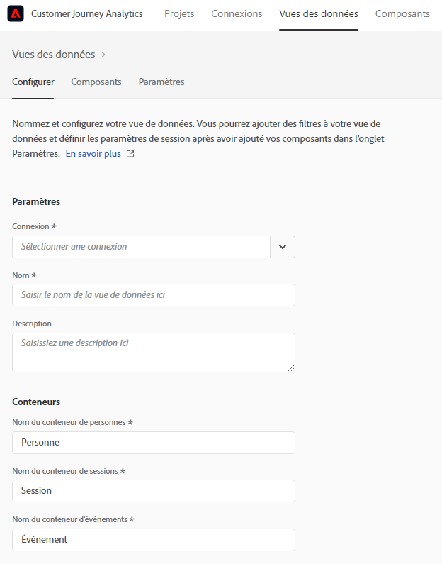

# Création d’une vue de données

>[!IMPORTANT]
>
>Cette fonctionnalité sera disponible en général le 22 avril 2021.

La création d’une vue de données implique la création de mesures et de dimensions à partir d’éléments de schéma ou l’utilisation de composants standard. La création de mesures ou de dimensions vous offre une flexibilité considérable. Auparavant, l’hypothèse était que si vous disposiez de jeux de données dans Adobe Experience Platform, les champs de chaîne étaient utilisés comme dimensions et les champs numériques étaient utilisés comme mesures. Pour modifier l&#39;un de ces champs, vous devez modifier votre schéma dans Platform. L’interface utilisateur des vues de données permet désormais une [définition de forme plus libre des mesures et des dimensions](/help/data-views/data-views.md). Pour plus de cas d’utilisation, voir [Cas d’utilisation des vues de données](/help/data-views/data-views-usecases.md).

## 1. Configuration des paramètres et des conteneurs des Vues de données

1. Dans Customer Journey Analytics, accédez à l’onglet **[!UICONTROL Vues de données]**.
2. Cliquez sur **[!UICONTROL Ajouter]** pour créer une vue de données et configurer ses paramètres.

| Paramètre | Description/Cas d’utilisation |
| --- | --- |
| [!UICONTROL Connexion] | Ce champ relie la vue de données à la connexion que vous avez établie précédemment, qui contient un ou plusieurs jeux de données Adobe Experience Platform. |
| [!UICONTROL Nom] | Il est obligatoire d’attribuer un nom à la vue de données. |
| [!UICONTROL Description] | Une description détaillée n’est pas obligatoire mais est recommandée. |
| [!UICONTROL Fuseau horaire] | Choisissez dans quel fuseau horaire vos données doivent être présentées. |
| [!UICONTROL Balises] | Les balises vous permettent d’organiser vos vues de données en catégories. |
| [!UICONTROL Conteneurs] | Vous pouvez renommer vos conteneurs ici et c’est ainsi qu’ils apparaîtront dans tout projet Workspace basé sur cette vue de données. Les conteneurs sont utilisés dans les filtres et les abandons/flux, etc., pour définir l&#39;étendue ou l&#39;étroitesse de la portée ou du contexte. [En savoir plus](https://experienceleague.adobe.com/docs/analytics-platform/using/cja-components/cja-filters/filters-overview.html?lang=en#filter-containers) |
| [!UICONTROL Le nom du conteneur de la personne est...] | [!UICONTROL Personne]  (par défaut). Le conteneur [!UICONTROL Personne] inclut chaque visite et vue de page pour les visiteurs dans un délai spécifié. Vous pouvez renommer ceci en &quot;Utilisateur&quot; ou tout autre terme de votre choix. |
| [!UICONTROL Le nom du conteneur de session est...] | [!UICONTROL Session]  (par défaut). Le conteneur [!UICONTROL Session] permet d&#39;identifier les interactions de page, les campagnes ou les conversions pour une session spécifique. Vous pouvez renommer ceci en Visite ou tout autre terme de votre choix. |
| [!UICONTROL Le nom du conteneur du événement est...] | [!UICONTROL Événement]  (par défaut). Le conteneur [!UICONTROL Événement] définit les événements de page que vous souhaitez inclure ou exclure d&#39;un filtre. |

Vous pouvez ensuite créer des mesures et des dimensions à partir d’éléments de schéma. Vous pouvez également utiliser des composants standard.

## 2. Créer des mesures et des dimensions à partir d’éléments de schéma

1. Dans [!UICONTROL Customer Journey Analytics] > [!UICONTROL Vues de données], cliquez sur l&#39;onglet [!UICONTROL Composants].

Vous pouvez voir la [!UICONTROL connexion] en haut à gauche, qui contient les jeux de données et ses [!UICONTROL champs de Schéma] ci-dessous. Les composants déjà présents sont les composants standard requis (générés par le système).

1. Faites maintenant glisser un champ de schéma, tel que [!UICONTROL pageTitle], du rail de gauche vers la section Mesures ou Dimensions.

   Vous pouvez faire glisser plusieurs fois le même champ de schéma dans les sections de dimensions ou de mesures et configurer la même dimension ou mesure de différentes manières.
Par exemple, dans le champ **[!UICONTROL pageTitle]**, vous pouvez créer une dimension appelée &quot;Pages de produits&quot;, et une autre &quot;Pages d’erreurs&quot;, etc., en renommant **[!UICONTROL Nom du composant]** à droite. De **[!UICONTROL pageTitle]**; , vous pouvez également créer des mesures à partir d’une valeur de chaîne. Par exemple, vous pouvez créer une ou plusieurs mesures **[!UICONTROL Commandes]** avec des paramètres d’attribution différents et des valeurs d’inclusion/exclusion différentes.

   

   >[!NOTE]
   >
   >Vous pouvez faire glisser des dossiers de champs de schéma entiers depuis le rail de gauche et les trier automatiquement en sections traditionnelles. Les champs de chaîne se retrouvent dans la section [!UICONTROL Dimensions] et dans la section [!UICONTROL Mesures]. Vous pouvez également cliquer sur **[!UICONTROL Ajouter tous]** et tous les champs de schéma seront ajoutés.

1. Une fois le composant sélectionné, plusieurs paramètres s’affichent à droite. Configurez le composant à l’aide des paramètres décrits ci-dessous.

### Configuration des paramètres de composant

| Paramètre | Description/Cas d’utilisation |
| --- | --- |
| [!UICONTROL Type de composant] | Obligatoire. Permet de changer un composant de Mesure en Dimension ou vice versa. |
| [!UICONTROL Nom du composant] | Obligatoire. Permet de spécifier le nom convivial qui apparaîtra dans Analysis Workspace. Vous pouvez renommer un composant pour lui attribuer un nom spécifique à la vue de données. |
| [!UICONTROL Description] | Facultatif, mais recommandé, pour fournir des informations sur le composant à d’autres utilisateurs. |
| [!UICONTROL Balises] | Facultatif. Permet de baliser le composant avec des balises personnalisées ou prêtes à l’emploi pour faciliter la recherche/filtrage dans l’interface utilisateur Analysis Workspace. |
| [!UICONTROL Nom du champ] | Nom du champ de schéma. |
| [!UICONTROL Type de jeu de données] | Obligatoire. Champ non modifiable présentant le type de jeu de données (événement, recherche ou profil) d’où provient le composant. |
| [!UICONTROL Jeu de données] | Obligatoire. Champ non modifiable présentant le type de champ d’où provient le composant (chaîne, entier, etc.). Ce champ peut contenir plusieurs jeux de données, par exemple lorsque vous combinez plusieurs suites de rapports. |
| [!UICONTROL Type de schéma] | Indique si le composant est une chaîne, un entier, etc. |
| [!UICONTROL ID du composant] | Obligatoire. [L’API CJA](https://adobe.io/cja-apis/docs) utilise ce champ pour référencer le composant. Vous pouvez cliquer sur l’icône Modifier et modifier cet ID de composant. Cependant, la modification de cet ID de composant rompt tous les projets Workspace existants qui contiennent ce composant. Si vous créez une autre vue de données qui utilise un champ différent pour une dimension pageTitle, vous pouvez la renommer et la rendre compatible avec la vue de données croisées de dimension. |
| [!UICONTROL Chemin d’accès] | Obligatoire. Champ non modifiable présentant le chemin d’accès au schéma d’où provient le composant. |
| [!UICONTROL Masquer le composant dans le reporting] | Valeur par défaut = désactivée. Permet de traiter le composant hors de la Vue de données lorsqu’il est utilisé dans le rapports. Cela n&#39;a pas d&#39;impact sur les autorisations, juste la gestion des composants. En d’autres termes, vous pouvez masquer le composant des non-administrateurs dans le rapports. Les administrateurs peuvent toujours y accéder en cliquant sur [!UICONTROL Afficher tous les composants] dans un projet Analysis Workspace. |

### Configuration des paramètres Format

Les paramètres de format sont réservés aux mesures.

| Paramètre | Description/Cas d’utilisation |
| --- | --- |
| [!UICONTROL Format] | Permet de spécifier la mise en forme d’une mesure, sous la forme Décimale, Heure, Pourcentage ou Devise. |
| [!UICONTROL Nombre de décimales] | Permet de spécifier le nombre de décimales qu’une mesure doit afficher. |
| [!UICONTROL Afficher la tendance à la hausse sous forme de] | Permet de spécifier si une tendance à la hausse sur cette mesure doit être considérée comme bonne (verte) ou mauvaise (rouge). |
| [!UICONTROL Devise] | Ce paramètre s’affiche uniquement si le format de mesure sélectionné est [!UICONTROL Devise]. Une liste d’options de devise est disponible. Par défaut, aucune devise. Cela vous permet de représenter les recettes dans la devise de votre choix en rapports. Il ne s’agit pas d’une conversion de devise, mais simplement d’une option de formatage de l’interface utilisateur. |

### Configuration des paramètres d’attribution

| Paramètre | Description/Cas d’utilisation |
| --- | --- |
| [!UICONTROL Définir l’attribution] | Permet de spécifier les paramètres d’attribution à appliquer par défaut à cette mesure lorsqu’elle est utilisée. Cette valeur par défaut peut être remplacée dans un tableau à structure libre ou dans une mesure calculée. |
| [!UICONTROL Modèle d’attribution] | Permet de spécifier un modèle d’attribution par défaut - principal uniquement lorsque vous activez le paramètre [!UICONTROL Utiliser un modèle d’attribution autre que par défaut]. Par défaut, [!UICONTROL Dernière touche]. Les options sont les suivantes : Dernière touche, Première touche, Linéaire, Participation, Même touche, En forme de U, Courbe J, Inverse J, Décalage de temps, Personnalisé, Algorithmique. Certaines de ces options créent des champs supplémentaires à remplir, comme Personnalisés ou Décalage temporel. Vous pouvez créer plusieurs mesures à l’aide du même champ, ce qui signifie que vous pouvez avoir une mesure de recettes [!UICONTROL Dernière touche] et une mesure de recettes [!UICONTROL Première touche], mais en fonction du même champ de recettes dans le schéma. |
| [!UICONTROL Intervalle de recherche en amont] | Permet de spécifier une fenêtre de recherche en amont par défaut pour une mesure - principale uniquement lorsque vous activez le paramètre [!UICONTROL Utiliser un modèle d’attribution autre que par défaut]. Les options sont les suivantes : Personne (fenêtre de Rapports), Session, Personnalisée. Lorsque l&#39;option Personnalisé est sélectionnée, nous vous offrons également la possibilité de sélectionner n&#39;importe quel nombre de jours/semaines/mois/etc. (jusqu&#39;à 90 jours), tout comme Attribution IQ. Vous pouvez avoir plusieurs mesures à l’aide du même champ de schéma, mais chacune dispose d’une fenêtre de recherche distincte. |

### Configuration des paramètres Inclure/Exclure les valeurs

Ce paramètre vous permet de modifier les données sous-jacentes sur lesquelles vous vous rapports, au moment de la requête. Il ne s’agit pas d’un filtre (anciennement appelé segment). Mais les filtres respecteront cette nouvelle dimension, tout comme le cheminement et l&#39;attribution.

Par exemple, vous pouvez créer une dimension à partir du champ pageTitle, mais l’appeler &quot;pages d’erreur&quot; et inclure toute page qui [!UICONTROL contient l’expression ] &quot;erreur&quot;.

| Paramètre | Description/Cas d’utilisation |
| --- | --- |
| [!UICONTROL Respect de la casse] | Par défaut = Activé. Ce paramètre s’applique uniquement à la section [!UICONTROL Inclure/Exclure les valeurs]. Il vous permet de déterminer si la règle d’inclusion/exclusion que vous appliquez doit respecter la casse. |
| [!UICONTROL Correspond à] | Permet de spécifier les valeurs à prendre en compte pour le rapports avant l’attribution et la segmentation (par exemple, utilisez uniquement des valeurs contenant l’expression &quot;erreur&quot;). Vous pouvez spécifier : **[!UICONTROL Si tous les critères sont satisfaits]**, ou **[!UICONTROL Si l&#39;un d&#39;eux est satisfait]**. |
| [!UICONTROL Critères] | Permet de spécifier la logique de correspondance à appliquer à une règle de filtre spécifique.<ul><li>**Chaîne** : Contient l’expression, Contient n’importe quel terme, Contient tous les termes, Ne contient aucun terme, Ne contient pas l’expression, Est égal à, N’est pas égal, Débuts avec, Se termine avec</li><li>**Doublon/Entier** : est égal à, n’est pas égal, est supérieur à, est inférieur à, est supérieur ou égal à, est inférieur ou égal à</li><li>**Date** : est égal, n’est pas égal, est plus récent que, est avant, se produit dans</li></ul> |
| [!UICONTROL Opérande de correspondance] | Permet de spécifier l’opérande de correspondance auquel l’opérateur de correspondance doit être appliqué.<ul><li>**Chaîne** : Champ de texte</li><li>**Doublon/Entier** : Champ de texte avec des flèches haut/bas pour les valeurs numériques</li><li>**Date** : Sélecteur de granularité journalière (calendrier)</li><li>**Date heure** : Sélecteur de granularité de date et d’heure</li></ul> |
| [!UICONTROL Ajouter une règle] | Permet de spécifier un opérateur de correspondance et un opérande supplémentaires. |

### Configuration des paramètres de comportement

| Paramètre | Description/Cas d’utilisation |
| --- | --- |
| [!UICONTROL Compter les instances] | Permet de spécifier si un champ numérique ou de type de date utilisé comme mesure doit compter les fois qu’il a été défini plutôt que la valeur elle-même.  Si vous souhaitez additionner les instances d’un champ numérique et simplement additionner le nombre de fois où un champ était  ** différent de la valeur réelle à l’intérieur. Cela s’avère utile pour créer une   mesure Ordersmetric à partir d’un   champ Recettes, par exemple. Si les recettes ont été définies, nous voulons comptabiliser 1 commande unique plutôt que le montant des recettes numériques. |

### Configurer les paramètres [!UICONTROL Aucune option de valeur]

[!UICONTROL Les paramètres Aucune valeur ] Options sont analogues à   Non spécifié ou   Non évalué dans le rapports. Dans l’interface utilisateur des vues de données, composant par composant, vous pouvez décider comment traiter ces valeurs dans le rapports. Vous pouvez également renommer [!UICONTROL Aucune valeur] en une valeur qui convient le mieux à votre environnement, telle que [!UICONTROL Null], [!UICONTROL Non définie], ou d’autres.

Notez également que tout ce que vous indiquez dans ce champ peut être utilisé pour le traitement spécial de l’interface utilisateur de l’élément de ligne [!UICONTROL Aucune valeur] dans le rapports, comme indiqué dans le paramètre [!UICONTROL Aucune valeur Options].

| Paramètre | Description/Cas d’utilisation |
| --- | --- |
| [!UICONTROL S&#39;il s&#39;affiche, appelez Aucune valeur...] | Vous pouvez renommer **[!UICONTROL Aucune valeur]** en autre élément. |
| [!UICONTROL Ne pas afficher de valeur Aucune par défaut] | N’affiche pas cette valeur en rapports. |
| [!UICONTROL Afficher aucune valeur par défaut] | Affiche cette valeur dans le rapports. |
| [!UICONTROL Considérer Aucune valeur comme une valeur] | Ce paramètre remplacera les valeurs vides dans les données par le texte que vous avez spécifié sous [!UICONTROL Si affiché, appelez Aucune valeur ...]. Par exemple, si vous aviez des types de périphériques mobiles comme dimension, vous pouvez renommer l’élément **[!UICONTROL Aucune valeur]** en &quot;Bureau&quot;. Notez que lorsque vous remplacez ce champ par une valeur personnalisée, la valeur personnalisée est traitée comme une valeur de chaîne légitime. Par conséquent, si vous entrez la valeur &quot;Rouge&quot; dans ce champ, toutes les instances de la chaîne &quot;Rouge&quot; apparaissant dans les données elles-mêmes seront également roulées sous le même élément de ligne que celui que vous avez spécifié. |

### Configuration des paramètres de persistance

Ces paramètres sont similaires à ceux de l’eVar dans le Adobe Analytics traditionnel.

| Paramètre | Description/Cas d’utilisation |
| --- | --- |
| [!UICONTROL Définir la persistance] | Basculer sur la touche |
| [!UICONTROL Attribution] | Permet de spécifier le modèle d’allocation utilisé sur une dimension pour la persistance. Les options sont les suivantes : [!UICONTROL Plus récent], [!UICONTROL Original], [!UICONTROL Instance], [!UICONTROL Tous]. Si vous souhaitez qu’une valeur soit persistante (semblable aux eVars dans Analytics traditionnel), c’est là que vous la définissez. La seule différence clé est que la persistance maximale que vous pouvez définir est de 90 jours. En outre, [!UICONTROL Ne jamais expirer] n&#39;est pas une option. |
| [!UICONTROL Expiration] | Permet de spécifier la fenêtre de persistance d’une dimension. Les options sont les suivantes : [!UICONTROL Session] (par défaut), [!UICONTROL Personne], [!UICONTROL Heure], [!UICONTROL Mesure]. Vous devrez peut-être pouvoir faire expirer la dimension lors d’un achat (comme les termes de recherche interne ou d’autres cas d’utilisation du marchandisage). [!UICONTROL Les ] mesures vous permettent de définir l’une des mesures définies comme expiration pour cette dimension (par exemple, une mesure   Achats). |

### Configuration des paramètres de regroupement de valeurs

Par exemple, un intervalle de 5 à 10 s’affiche sur la ligne &quot;5 à 10&quot; dans Workspace rapports.

| Paramètre | Description/Cas d’utilisation |
| --- | --- |
| [!UICONTROL Valeur du compartiment] | Vous permet de créer une version groupée d’une dimension numérique. Cela vous permet de créer des rapports sur des intervalles de recettes ou d’autres valeurs numériques en tant que dimension dans le rapports. |
| [!UICONTROL Jusqu’à] | Permet de spécifier les limites du premier compartiment de dimension numérique. Ceci s’applique uniquement aux dimensions numériques. |
| [!UICONTROL Entre et jusqu’à] | Permet de spécifier les limites des intervalles de dimension numérique suivants. |
| [!UICONTROL Ajouter le compartiment] | Vous permet d’ajouter un autre compartiment au regroupement des dimensions numériques. |

### Utiliser [!UICONTROL les composants standard]

Outre la création de mesures et de dimensions à partir d’éléments de schéma, vous pouvez également utiliser des composants standard dans vos vues de données.

[!UICONTROL Les ] composants standard sont des composants qui ne sont pas générés à partir des champs de schéma de jeux de données, mais qui sont générés par le système. Certains composants système sont requis dans toute vue de données pour faciliter les fonctionnalités de rapports dans Analysis Workspace, tandis que d&#39;autres composants système sont facultatifs.

Composants standard requis

| Nom du composant | Dimension ou mesure | Remarques |
| --- | --- | --- |
| [!UICONTROL Personnes] | Mesure | Anciennement appelé [!UICONTROL Visiteurs uniques] dans Analytics traditionnel. Cette mesure est basée sur l’identifiant de personne spécifié dans une connexion. |
| [!UICONTROL Sessions] | Mesure | Anciennement appelé [!UICONTROL Visites] dans Analytics traditionnel. Cette mesure est basée sur les paramètres de session spécifiés ci-dessous. |
| [!UICONTROL Événements] | Mesure | Anciennement appelé [!UICONTROL Occurrences] dans Analytics traditionnel. Cette mesure représente le nombre de lignes de tous les jeux de données de événement dans une connexion. |
| [!UICONTROL Jour] | Dimension |  |
| [!UICONTROL Semaine] | Dimension |  |
| [!UICONTROL Mois] | Dimension |  |
| [!UICONTROL Trimestre] | Dimension |  |
| [!UICONTROL Année] | Dimension |  |
| [!UICONTROL Heure] | Dimension |  |
| [!UICONTROL Minute] | Dimension |  |

### Composants standard facultatifs

Certains composants système sont requis dans toute vue de données pour faciliter les fonctionnalités de rapports dans Analysis Workspace, tandis que ceux ci-dessous sont facultatifs.

| Nom du composant | Dimension ou mesure | Remarques |
| --- | --- | --- |
| [!UICONTROL La session commence] | Mesure | Cette mesure comptabilise le nombre de événements qui ont été le premier événement d’une session. Utilisé dans une définition de filtre (ex. &quot;[!UICONTROL Débuts de session] existe&quot;), il filtres jusqu&#39;au premier événement de chaque session. Notez qu’il s’agit d’un comportement différent de [!UICONTROL Entrées] en ce qu’il comptabilise toujours le premier événement d’une session, et non la première valeur présente pour une dimension dans une session. |
| [!UICONTROL La session se termine] | Mesure | Cette mesure comptabilise le nombre de événements qui ont été le dernier événement d’une session. Tout comme [!UICONTROL Débuts de session], il peut également être utilisé dans une définition de filtre pour filtrer les éléments jusqu&#39;au dernier événement de chaque session. Notez qu’il s’agit d’un comportement différent de [!UICONTROL Exits] en ce qu’il comptabilise toujours le dernier événement d’une session, et non la dernière valeur présente pour une dimension dans une session. |
| [!UICONTROL Durée (secondes)] | Mesure | La mesure [!UICONTROL Durée de la visite] fonctionne de la même manière que dans l’Adobe Analytics classique : additionnez le temps entre deux valeurs différentes pour une dimension. Cependant, à l’aide des mesures Débuts de session et Fin de session, les clients peuvent construire eux-mêmes les mesures calculées [!UICONTROL Durée de la visite par personne] et [!UICONTROL Durée de la visite par session] (voir filtres OOTB et mesures calculées ci-dessous). |
| [!UICONTROL Durée par événement] | Dimension | D’un point de vue fonctionnel, il s’agit en fait d’un simple cumul de la mesure ci-dessus. Nous fournissons des intervalles par défaut, mais vous permettent de changer les intervalles à ce que vous voulez. |
| [!UICONTROL Durée par session] | Dimension |  |
| [!UICONTROL Durée par personne] | Dimension |  |
| [!UICONTROL ID de lot] | Dimension |  |
| [!UICONTROL Identifiant du jeu de données] | Dimension |  |

### Filtrage des champs de schéma et des dimensions/mesures

Vous pouvez filtrer les champs de schéma dans le rail de gauche selon les types de données suivants :

Vous pouvez également filtrer par jeux de données et selon si un champ de schéma contient des données ou s&#39;il s&#39;agit d&#39;une identité :

## 3. Ajoutez un filtre global pour la vue de données

Vous pouvez ajouter des filtres (anciennement appelés segments) qui s’appliquent à l’ensemble de votre vue de données, comme la vue filtrée des données dans les suites de rapports virtuelles (Adobe Analytics traditionnelles).

1. Cliquez sur l&#39;onglet [!UICONTROL Paramètres] dans [!UICONTROL vues de données].
1. Faites glisser un filtre de la liste du rail de gauche vers le champ [!UICONTROL Ajouter les filtres].
