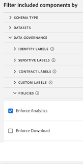

# Étiquettes et stratégies

Lorsque vous créez un jeu de données dans Experience Platform, vous pouvez créer des [libellés d’utilisation des données](https://experienceleague.adobe.com/docs/experience-platform/data-governance/labels/reference.html?lang=fr) pour certains éléments du jeu de données ou pour l’ensemble de ceux-ci. Jusqu’à présent, ces libellés n’étaient pas visibles dans CJA. Grâce à cette version, CJA prend désormais en charge l’affichage des libellés et des stratégies.

Les libellés suivants sont particulièrement utiles dans CJA :

* Le `C8` libellé - **[!UICONTROL Aucune mesure]**. Ce libellé signifie que les données ne peuvent pas être utilisées à des fins d’analyse sur les sites web ou les applications de votre entreprise.

* Le `C12` libellé - **[!UICONTROL Aucune exportation de données générale]**. Les champs de schéma ainsi étiquetés ne peuvent pas être exportés ou téléchargés à partir de CJA (via la création de rapports, l’exportation, l’API, etc.).

L’étiquetage en lui-même ne signifie pas que ces libellés d’utilisation des données sont appliqués. C’est à cela que servent les stratégies. Vous créez vos stratégies en passant par [l’API du service de stratégie](https://experienceleague.adobe.com/docs/experience-platform/data-governance/api/overview.html?lang=fr) dans Experience Platform.

Deux stratégies définies par Adobe sont affichées dans CJA et affectent la création de rapports et le téléchargement/partage :

* Politique **[!UICONTROL Application d’Analytics]**
* Politique **[!UICONTROL Application du téléchargement]**

## Afficher les libellés de données dans les vues de données CJA

Les libellés de données créés dans Experience Platform sont affichés à trois emplacements dans l’interface utilisateur des vues de données :

| Emplacement | Description |
| --- | --- |
| Bouton Infos sur un champ de schéma | Cliquer sur ce bouton indique les [!UICONTROL libellés d’utilisation des données] qui s’appliquent actuellement à un champ :
 |
| Rail de droite sous [Paramètres des composants](/help/data-views/component-settings/overview.md) | Tous les [!UICONTROL libellés d’utilisation des données] sont répertoriés ici :
 |
| Ajouter des libellés de données sous forme d’une colonne | Vous pouvez ajouter les [!UICONTROL libellés d’utilisation des données] sous forme d’une colonne aux colonnes [!UICONTROL Composants inclus] dans les vues de données. Cliquez simplement sur l’icône du sélecteur de colonnes et sélectionnez **[!UICONTROL Libellés d’utilisation des données]** :
 |

{style=&quot;table-layout:auto&quot;}

## Filtrer les libellés de gouvernance des données dans les vues de données

Dans l’éditeur des vues de données, cliquez sur l’icône « Filtrer » dans le rail de gauche et filtrez les composants des vues de données à partir de la **[!UICONTROL gouvernance des données]** et du type de **[!UICONTROL libellé]** :

Cliquez sur **[!UICONTROL Appliquer]** pour voir quels composants sont associés à des libellés.

## Filtrer les stratégies de gouvernance des données dans les vues de données

Vous pouvez vérifier si une stratégie est activée qui bloque l’utilisation de certains éléments de vue de données CJA pour les analyses ou les exportations prévues.

Cliquez à nouveau sur l’icône Filtrer dans le rail de gauche et sous **[!UICONTROL Gouvernance des données]**, puis cliquez sur **[!UICONTROL Stratégies]** :

Cliquez sur **[!UICONTROL Appliquer]** pour voir les stratégies activées.

## Comment les stratégies activées affectent-elles les vues de données ?

Si les stratégies **[!UICONTROL Application d’Analytics]** ou **[!UICONTROL Application du téléchargement]** sont activées, les composants de schéma associés à certains libellés de données (C8 ou C12, par exemple) ne peuvent pas être ajoutés aux vues de données.

Ces composants sont grisés dans la liste de rail de gauche [!UICONTROL Champs de schéma] :

Vous ne pouvez pas non plus enregistrer une vue de données qui contient des champs bloqués.

>[!MORELIKETHIS]
>[Télécharger des données sensibles](/help/analysis-workspace/curate-share/download-send.md)

>[!MORELIKETHIS]
>[Que sont les libellés restreints dans Report Builder ?](https://experienceleague.adobe.com/docs/analytics-platform/using/cja-reportbuilder/restricted-labels.html?lang=fr)

