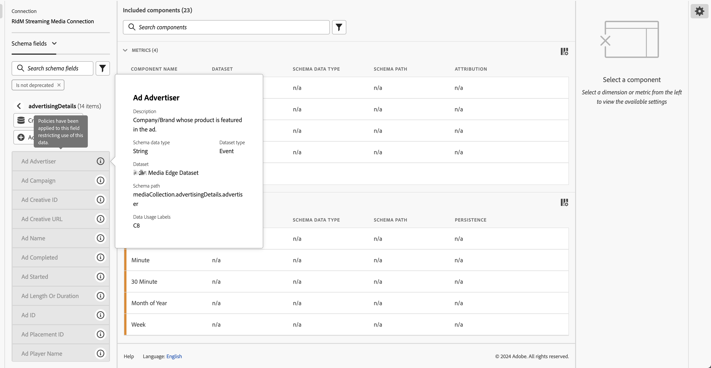

# Libellés et politiques

Lorsque vous créez un jeu de données dans Experience Platform, vous pouvez créer des [libellés d’utilisation des données](https://experienceleague.adobe.com/fr/docs/experience-platform/data-governance/labels/reference) pour certains éléments du jeu de données ou pour l’ensemble de ceux-ci. Vous pouvez afficher ces libellés et politiques dans Customer Journey Analytics.

Les libellés suivants présentent un intérêt particulier pour Customer Journey Analytics :

* Libellé `C8` : **[!UICONTROL Aucune mesure]**. Ce libellé signifie que les données ne peuvent pas être utilisées à des fins d’analyse sur les sites web ou les applications de votre entreprise.

* Libellé `C12` - **[!UICONTROL Aucun export de données générale]**. Les champs de schéma ainsi libellés ne peuvent pas être exportés ou téléchargés à partir de Customer Journey Analytics (via la création de rapports, l’export, l’API, etc.).

>[!NOTE]
>
>Les libellés d’utilisation des données ne sont pas propagés automatiquement aux jeux de données regroupés. Ils peuvent toutefois être ajoutés manuellement.

L’étiquetage en lui-même ne signifie pas que ces libellés d’utilisation des données sont appliqués. C’est à cela que servent les politiques. Vous pouvez créer vos politiques en passant par l’[interface d’utilisation d’Experience Platform](https://experienceleague.adobe.com/fr/docs/experience-platform/data-governance/policies/user-guide) ou via l’[API Policy Service](https://experienceleague.adobe.com/fr/docs/experience-platform/data-governance/api/overview) dans Experience Platform.

Deux politiques définies par Adobe sont disponibles dans Experience Platform et peuvent apparaître dans Customer Journey Analytics et affecter la création de rapports et l’export de données :

* polique de **[!UICONTROL limitation de l’analyse d’utilisation et des mesures basées sur les utilisateurs et utilisatrices]**, à l’aide du libellé `C8`, et
* politique de **[!UICONTROL limitation de l’export des données]**, à l’aide du libellé `C12`.

## Afficher les libellés de données dans les vues de données de Customer Journey Analytics

Les libellés de données que vous ou d’autres personnes créez dans Experience Platform sont affichés à trois emplacements dans l’interface d’utilisation des vues de données :

| Emplacement | Description |
| --- | --- |
| Bouton Infos sur un champ de schéma | Cliquer sur ce bouton indique les [!UICONTROL libellés d’utilisation des données] qui s’appliquent actuellement à un champ :
 |
| Rail de droite sous [Paramètres des composants](/help/data-views/component-settings/overview.md) | Tous les [!UICONTROL libellés d’utilisation des données] sont répertoriés ici :
 |
| Ajouter des étiquettes de données sous la forme d’une colonne | Vous pouvez ajouter les [!UICONTROL libellés d’utilisation des données] sous forme d’une colonne aux colonnes [!UICONTROL Composants inclus] dans les vues de données. Sélectionnez simplement l’icône du sélecteur de colonnes, puis **[!UICONTROL Libellés d’utilisation des données]** :
 |

{style="table-layout:auto"}

## Filtrer les étiquettes de gouvernance des données dans les vues de données

Dans l’éditeur des vues de données, sélectionnez l’icône [!UICONTROL Filtre] dans le rail de gauche et filtrez les composants des vues de données en fonction de la **[!UICONTROL Gouvernance des données]** et du type de **[!UICONTROL Libellé]** :

Cliquez sur **[!UICONTROL Appliquer]** pour voir quels composants sont associés à des libellés.

## Filtrer les politiques de gouvernance des données dans les vues de données

Vous pouvez vérifier si une politique (par exemple, une politique que vous avez créée, nommée **[!UICONTROL Application d’Analytics]**) est activée. Vous pouvez également vérifier si cette politique bloque l’utilisation de certains éléments de vue de données de Customer Journey Analytics pour l’analyse ou l’export de données.

Sélectionnez à nouveau l’icône [!UICONTROL Filtre] dans le rail de gauche, puis sous **[!UICONTROL Gouvernance des données]**, sélectionnez **[!UICONTROL Politiques]** :

Cliquez sur **[!UICONTROL Appliquer]** pour voir les politiques activées.

## Effet des politiques activées sur les vues de données

Si une ou plusieurs politiques sont activées avec des libellés C8 ou C12, les composants de schéma auxquels certains libellés de données sont appliqués ne peuvent pas être ajoutés aux vues de données.

Ces composants sont grisés dans la liste du rail de gauche [!UICONTROL Champs de schéma] :

Vous ne pouvez pas non plus enregistrer une vue de données qui contient des champs bloqués.

Faites preuve de prudence lorsque vous essayez d’appliquer des libellés d’accès et de gouvernance des données (par le biais de politiques) sur des champs ou des groupes de champs dans Experience Platform, pour lesquels des composants sont déjà définis dans votre vue de données. Cette boîte de dialogue peut s’afficher.

Vous devez d’abord résoudre la violation (par exemple, supprimer les composants de la vue de données).

>[!MORELIKETHIS]
>
>[Télécharger des données sensibles](/help/analysis-workspace/export/download-send.md)

>[!MORELIKETHIS]
>
>[Que sont les libellés restreints dans Report Builder ?](https://experienceleague.adobe.com/fr/docs/analytics-platform/using/cja-reportbuilder/restricted-labels)

