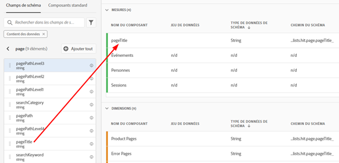
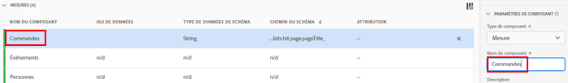
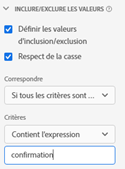
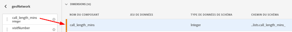
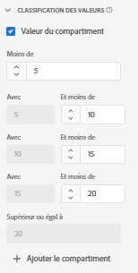
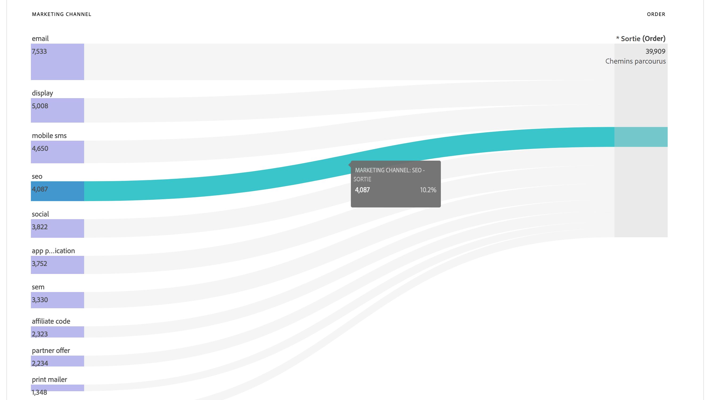
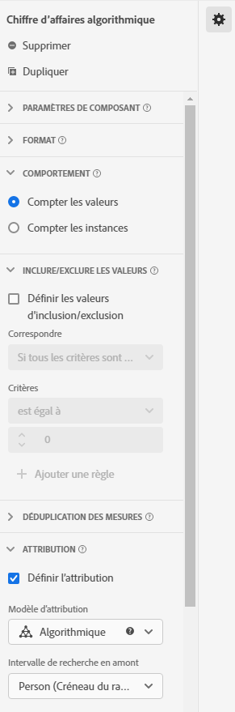

# Cas dʼutilisation des vues de données

Ces cas dʼutilisation montrent la flexibilité et la puissance des vues de données dans Customer Journey Analytics.

## 1. Création dʼune mesure à partir dʼun champ de schéma de chaîne

Par exemple, lors de la création dʼune vue de données, vous pouvez créer une mesure [!UICONTROL Commandes] à partir dʼun champ de schéma [!UICONTROL pageTitle] qui est une chaîne. Voici la procédure à suivre :

1. Dans lʼonglet Composants, faites glisser [!UICONTROL pageTitle] vers la section [!UICONTROL Mesures] sous [!UICONTROL Composants inclus].
   
1. Maintenant, mettez en surbrillance la mesure que vous venez de faire glisser et renommez-la sous [!UICONTROL Paramètres du composant] sur la droite :
   
1. Ouvrez la boîte de dialogue [!UICONTROL Valeurs dʼinclusion/exclusion] sur la droite et effectuez les actions suivantes :
   

   Lʼexpression « confirmation » indique quʼil sʼagit dʼune commande. Après lʼinspection de tous les titres de page où ces critères sont remplis, un « 1 » est comptabilisé pour chaque instance. Une nouvelle mesure est ainsi créée (il ne sʼagit pas dʼune mesure calculée). Une mesure qui contient des valeurs dʼinclusion/exclusion peut être utilisée partout où toute autre mesure peut être utilisée. Elle fonctionne avec Attribution IQ, les filtres et partout où vous pouvez utiliser des mesures standard.
1. Vous pouvez également définir un modèle dʼattribution pour cette mesure, tel que [!UICONTROL Dernière touche], avec un [!UICONTROL intervalle de recherche en amont] de [!UICONTROL Session].
Vous pouvez également créer une autre mesure [!UICONTROL Commandes] à partir du même champ et définir un modèle dʼattribution différent pour celui-ci, tel que [!UICONTROL Première touche], et un autre [!UICONTROL intervalle de recherche en amont], tel que [!UICONTROL 30 jours].

Un autre exemple consiste à utiliser lʼidentifiant visiteur, une dimension, en tant que mesure pour déterminer le nombre dʼidentifiants visiteur de votre société.

## 2. Utilisation de nombres entiers en tant que dimensions

Auparavant, les entiers étaient automatiquement traités comme des mesures dans CJA. Désormais, les données numériques (y compris les événements personnalisés dʼAdobe Analytics) peuvent être traités comme des dimensions. Voici un exemple :

1. Faites glisser lʼentier [!UICONTROL call_length_min] vers la section [!UICONTROL Dimensions] sous [!UICONTROL Composants inclus] :

   

1. Vous pouvez maintenant ajouter lʼoption [!UICONTROL Regroupement des valeurs] afin de présenter cette dimension de manière regroupée dans le compte rendu des performances. (Sans regroupement, chaque instance de cette dimension sʼaffiche sous la forme dʼun élément de ligne dans le compte rendu des performances Espace de travail.)

   

## 3. Utilisation des dimensions numériques en tant que « mesures » dans les diagrammes de flux

Vous pouvez utiliser une dimension numérique pour obtenir des « mesures » dans votre visualisation des [!UICONTROL Flux].

1. Sous lʼonglet [Composants](https://experienceleague.adobe.com/docs/analytics-platform/using/cja-dataviews/create-dataview.html?lang=fr#configure-component-settings) dans les Vues de données, faites glisser le champ de schéma [!UICONTROL Canaux marketing] dans la zone [!UICONTROL Mesures] sous [!UICONTROL Composants inclus].
2. Dans le compte rendu des performances Espace de travail, ce flux affiche les [!UICONTROL Canaux marketing] qui convergent vers les [!UICONTROL Commandes] :

## 4. Filtrage des sous-événements

Cette fonctionnalité s’applique spécifiquement aux champs basés sur des tableaux. La fonctionnalité dʼinclusion/exclusion vous permet d’effectuer un filtrage au niveau des sous-événements, tandis que les filtres (segments) créés dans le créateur de filtres fournissent uniquement un filtrage au niveau des événements. Vous pouvez donc effectuer un filtrage des sous-événements à l’aide de la fonctionnalité dʼinclusion/exclusion dans les vues de données, puis référencer cette nouvelle mesure/dimension dans un filtre au niveau des événements.

Par exemple, utilisez la fonctionnalité dʼinclusion/exclusion dans les vues de données pour vous concentrer uniquement sur les produits qui ont généré des ventes de plus de 50 dollars. Ainsi, si vous avez une commande qui comprend un achat de produit pour 50 dollars et un achat de produit pour 25 dollars, nous ne supprimons que lʼachat de produit pour 25 dollars, et non la commande entière.

1. Sous lʼonglet [Composants](https://experienceleague.adobe.com/docs/analytics-platform/using/cja-dataviews/create-dataview.html?lang=en#configure-component-settings) dans les Vues de données, faites glisser le champ de schéma [!UICONTROL Chiffre dʼaffaires] dans la zone [!UICONTROL Mesures] sous [!UICONTROL Composants inclus].
1. Sélectionnez la mesure et configurez les éléments suivants sur le côté droit :
a. Sous [!UICONTROL Format], sélectionnez [!UICONTROL Devise].
b. Sous [!UICONTROL Devise], sélectionnez USD.
c. Sous [!UICONTROL Inclure/Exclure des valeurs], cochez la case en regard de [!UICONTROL Définir des valeurs dʼinclusion/exclusion].
d. Sous [!UICONTROL Correspond à], sélectionnez [!UICONTROL Si tous les critères sont remplis].
e. Sous [!UICONTROL Critères], sélectionnez [!UICONTROL Est supérieur ou égal à].
f. Indiquez « 50 » comme valeur.

Ces nouveaux paramètres vous permettent dʼafficher uniquement les chiffres dʼaffaires de grande valeur et de filtrer ceux inférieurs à 50 $.

## 5. Utilisation du paramètre [!UICONTROL Options pour No Value]

Les utilisateurs formés par votre entreprise sʼattendent peut-être à retrouver lʼélément de ligne « Non spécifié » dans les rapports. La valeur par défaut dans les vues de données est « No Value ». Vous pouvez désormais [renommer « No Value » en « Non spécifié »](https://experienceleague.adobe.com/docs/analytics-platform/using/cja-dataviews/create-dataview.html?lang=fr#configure-no-value-options-settings) dans lʼinterface utilisateur des vues de données.

Un autre exemple serait une dimension pour l’enregistrement à un programme d’abonnement. Dans ce cas, vous pouvez renommer « Aucune valeur » en « Aucun enregistrement à un programme d’abonnement ».

## 6. Création de plusieurs mesures avec différents paramètres dʼ[!UICONTROL Attribution]

À lʼaide de la fonction [!UICONTROL Dupliquer] dans le coin supérieur droit, créez plusieurs mesures de chiffre dʼaffaires avec différents paramètres dʼattribution tels que [!UICONTROL Première touche], [!UICONTROL Dernière touche] et [!UICONTROL Algorithmique].

Nʼoubliez pas de renommer chaque mesure afin de refléter les différences, par exemple « Chiffre dʼaffaires algorithmique » :

Pour plus dʼinformations sur les autres paramètres de vues de données, voir [Création de vues de données](/help/data-views/create-dataview.md).
Pour un aperçu conceptuel des vues de données, voir [Présentation des vues de données](/help/data-views/data-views.md).
