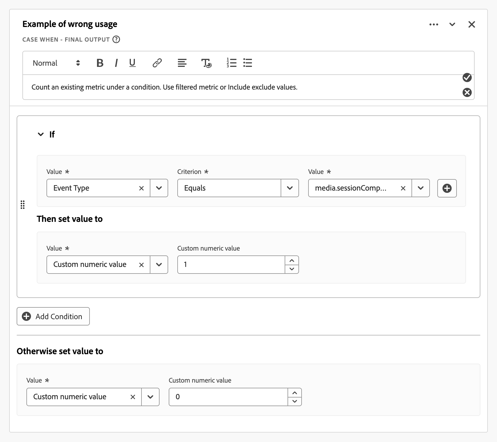

# Instructions relatives aux champs dérivés

Customer Journey Analytics [champs dérivés](./derived-fields.md) vous permet de transformer, de classer et d’enrichir les données au moment de la requête sans modifier les jeux de données source. Cette flexibilité peut entraîner de la complexité, des problèmes de performances et des frais de maintenance si elle est appliquée sans discipline.

Cet article fournit des instructions (bonnes pratiques, mécanismes de sécurisation et pièges courants) pour l’utilisation des champs dérivés. L’audience ciblée est constituée d’architectes de données, d’administrateurs de produits et d’analystes qui doivent :

* **Optimiser les performances** : identifiez les modèles qui ralentissent l’exécution des requêtes ou atteignent les limites du système pour sélectionner l’outil approprié à la tâche :

   * [Champs dérivés](./derived-fields.md)
   * [Paramètres de la vue de données](/help/data-views/component-settings/overview.md)
   * [Préparation de données](https://experienceleague.adobe.com/fr/docs/experience-platform/data-prep/home)
   * [Mesures calculées](/help/components/calc-metrics/calc-metr-overview.md)
   * [Jeux de données de recherche](/help/getting-started/cja-upgrade/cja-upgrade-dataset-lookup.md)

* **Améliorez la maintenabilité** : créez une logique de champ dérivée qui est claire, modulaire et facile à mettre à jour.
* **Garantir l’exactitude** : évitez les erreurs logiques courantes dans la classification, l’attribution et la transformation des données.

Les sections de cet article sont organisées par thème. Des chaînes de règles trop complexes à l’utilisation abusive de fonctions telles que [Recherche](./derived-fields.md#lookup), [Remplacement d’expression régulière](./derived-fields.md#regex-replace) et [Suivant ou précédent](./derived-fields.md#next-or-previous). Chaque section comprend :

* **Modèles** à détecter : signaux observables dans vos définitions de champ dérivées.
* **Diagnostic du risque** : pourquoi le modèle est problématique. Les raisons possibles sont des effets négatifs sur **performances**, **qualité des données** ou **maintenance**.
* **Recommandations** : mesures concrètes pour refactoriser ou améliorer la mise en œuvre.

Ces instructions vous aident à créer des implémentations efficaces, évolutives et sémantiquement correctes dans Customer Journey Analytics. Appliquez ces instructions lorsque vous auditez des vues de données existantes, concevez de nouveaux champs dérivés ou créez des outils de gouvernance.

## Champs dérivés à cardinalité élevée

Cette section traite des segments par défaut de la vue de données qui font référence à des champs dérivés à cardinalité élevée.

### Modèles

* Segments par défaut de la vue de données qui référencent un champ dérivé basé sur une dimension à cardinalité élevée (environ un million ou plus de valeurs distinctes). Par exemple : URL de la page entière.
* Les opérations simples telles que [Minuscules](./derived-fields.md#lowercase), [Rognage](./derived-fields.md#trim) ou [Casse lorsque](./derived-fields.md#case-when) les vérifications sur l’URL de la page sont souvent plus coûteuses que la même logique sur les champs à cardinalité faible tels que le nom de la page, la section du site ou le groupe d’URL.

### Diagnostic des risques : performance

* Les segments par défaut qui filtrent sur les champs dérivés touchant l’URL de la page ou d’autres dimensions à cardinalité élevée ajoutent de la latence à chaque requête par rapport à la vue de données.

### Recommandations

* Évitez de référencer des URL de page entière ou des composants à cardinalité élevée similaires directement dans les segments par défaut de la vue de données. Intégrez une logique d’URL complexe ([Cas complexe](./derived-fields.md#case-when), [Remplacement d’expression régulière](./derived-fields.md#regex-replace), plusieurs fonctions de chaîne) en amont vers [Préparation de données](https://experienceleague.adobe.com/fr/docs/experience-platform/data-prep/home) ou [Jeux de données de recherche](/help/getting-started/cja-upgrade/cja-upgrade-dataset-lookup.md) afin que les classifications résultantes se fondent sur des dimensions plus simples de cardinalité inférieure.
* Privilégiez les clés de cardinalité inférieure telles que le nom de page normalisé, la section de site ou les groupes d’URL préclassés.
* Contrôlez régulièrement les segments par défaut et les champs dérivés de la vue de données existante pour y rechercher les références aux dimensions à cardinalité élevée (URL de page, identifiants de campagne, chaînes de requête brutes) et refactorisez-les en clés normalisées ou groupées.

## Cas trop complexe lorsque les chaînes de règles

Cette section traite des chaînes trop complexes de règles [Cas &#x200B;](./derived-fields.md#case-when).

Customer Journey Analytics applique des [limites de fonction et d’opérateur](derived-fields.md#limitations) explicites par champ dérivé (par exemple, le nombre maximal d’opérateurs, le nombre maximal de fonctions par type). Les fonctions trop complexes et les chaînes au sein des fonctions sont plus difficiles à gérer et plus susceptibles de contenir des erreurs.

### Modèles

* Très grand [Case When](./derived-fields.md#case-when) fonctionne avec des chaînes complexes **[!UICONTROL If]** et **[!UICONTROL Else If]** :
   * De nombreuses conditions (par exemple : plus de 20 opérateurs) ou imbrication profonde (plus de 3 ou 4 niveaux de logique imbriquée [Case When](./derived-fields.md#case-when) **[!UICONTROL If]** et **[!UICONTROL Else If]**).
   * Conditions répétées sur le même champ avec des valeurs différentes.
* Correspondance de chaînes constantes répétées.

  +++ Exemple

  

  +++

### Diagnostic des risques : performances, qualité des données, maintenance élevée

* Maintenance et risque d’erreur : la logique codée en tant que bloc de règle monolithique est difficile à déboguer et à mettre à jour.
* Performances potentielles et risque limite : vous pouvez atteindre ou approcher des [limites d’opérateur ou de fonction](./derived-fields.md#limitations), en particulier avec des modèles de type classification.

### Recommandations

* Diviser en plusieurs champs dérivés. Par exemple, séparez la *normalisation des campagnes* (en mappant les identifiants de campagnes incohérents à une valeur canonique) du regroupement des canaux au lieu de tout combiner dans une seule règle géante.
* Utilisez des jeux de données de recherche. De nombreuses conditions **[!UICONTROL Si la valeur _valeur_ critère _critère_ puis définir _valeur_ sur la valeur]** sont mieux implémentées sous la forme d’un [jeu de données de recherche](/help/getting-started/cja-upgrade/cja-upgrade-dataset-lookup.md) combiné à la fonction [Lookup](./derived-fields.md#lookup) au lieu d’utiliser des chaînes [Case When](./derived-fields.md#case-when) longues.
* Utilisez les filtres des composants de la vue de données. Si une partie de la logique filtre simplement les valeurs incorrectes, utilisez [inclure/exclure](/help/data-views/component-settings/include-exclude-values.md) au niveau du composant de la vue de données au lieu d’incorporer cette logique dans un champ dérivé.

## Utilisation incorrecte

Cette section traite de l’utilisation incorrecte des champs dérivés. Surtout lorsque les alternatives sont une meilleure solution.

>[!NOTE]
>
>Le déplacement de la logique d’un champ dérivé vers un paramètre de composant de vue de données n’améliore pas en soi les performances des requêtes. Les deux approches compilent la même logique dérivée sous-jacente. Les recommandations de cette section concernent la clarté, la gouvernance et la réutilisation plutôt que la vitesse.

### Modèles

* Un champ dérivé reproduit le comportement déjà disponible dans les paramètres du composant :
   * Normalisation de la casse, rognage ou simple filtrage (par exemple : exclusion de `unknown`, `undefined` ou `null`) sans complexité supplémentaire.
   * Groupement de base sur des plages de nombres.

     +++ Exemple

     

     +++

     Utilisez plutôt le [regroupement de valeurs](/help/data-views/component-settings/value-bucketing.md) sur une dimension de votre vue de données.
   * Logique de persistance ou d’attribution codée avec une logique de séquence [suivante ou précédente](./derived-fields.md#next-or-previous) ou manuelle où les paramètres de vue de données [attribution](/help/data-views/component-settings/attribution.md) et [expiration](/help/data-views/component-settings/persistence.md) suffiraient.
   * Mesure dérivée qui comptabilise simplement une mesure existante sous une condition.

     +++ Exemple

     

     +++

     Cela reproduit ce qu’une mesure filtrée ou [Inclure/exclure les valeurs](/help/data-views/component-settings/include-exclude-values.md) pourrait réaliser.

### Diagnostic des risques : qualité des données, maintenance élevée

* Complexité redondante : les champs dérivés sont utilisés lorsqu’il existe des fonctionnalités de vue de données intégrées plus simples.
* Risque de gouvernance : d’autres utilisateurs peuvent ne pas comprendre pourquoi un champ dérivé existe au lieu d’un paramètre natif. Le modèle augmente l’encombrement dans l’administration des champs dérivés.
* Réutilisation réduite : le codage d’indicateurs conditionnels en tant que champs dérivés rend plus difficile la réutilisation des mesures de base avec différents filtres dans les projets.

### Recommandations

* Rogner/Minuscules : utilisez les paramètres des composants [Sous-chaîne](/help/data-views/component-settings/substring.md) et [Comportement](/help/data-views/component-settings/behavior.md), sauf si vous avez besoin de transformations à plusieurs étapes.
* Exclusion de valeur : utilisez [Inclure les valeurs d’exclusion](/help/data-views/component-settings/include-exclude-values.md) pour les mesures ou les valeurs de dimension au niveau du composant de vue de données, et non dans un champ dérivé.
* Attribution et persistance : utilisez les paramètres de la vue de données [Persistance](/help/data-views/component-settings/persistence.md) (**[!UICONTROL Modèle d’attribution]** et **[!UICONTROL Expiration]**) pour les dimensions au lieu de les simuler dans un champ dérivé avec [Suivant ou Précédent](./derived-fields.md#next-or-previous) ou une autre logique séquentielle.
* Groupement numérique : conservez le champ dérivé numérique et laissez la vue de données créer une dimension regroupée par-dessus, plutôt que des libellés de plage de codage en dur dans une chaîne [Cas quand](./derived-fields.md#case-when).
* Logique conditionnelle : convertissez la logique d’indicateur simple 0 ou 1 en :
   * la mesure d’origine avec la logique de filtre des valeurs d’inclusion ou d’exclusion appliquée dans Analysis Workspace.
   * mesure filtrée utilisant la configuration des paramètres des composants de vue de données.

## Mauvaises classifications des mesures et des dimensions

Cette section traite de la classification incorrecte des mesures et des dimensions.

### Modèles

* Un champ dérivé produit clairement :
   * Sorties numériques (nombre, ratio ou arithmétique), mais le composant est configuré en tant que dimension.
   * Sorties catégorielles (libellés ou chaînes), mais le composant est configuré en tant que mesure.
* Un champ dérivé encode les indicateurs 0/1 en tant que chaînes.

Customer Journey Analytics permet de contraindre des champs numériques aux dimensions et des champs de chaîne aux mesures au niveau de la vue de données, mais un mauvais alignement peut créer des rapports déroutants.

### Diagnostic des risques : qualité des données

* Incompatibilité sémantique : le type de composant ne correspond pas à la nature du résultat dérivé, ce qui rend le type de composant plus difficile à analyser ou à agréger correctement.

### Recommandations

* Si la sortie est numérique :
   * Définissez le type de composant sur **[!UICONTROL Mesure]** dans la vue de données.
   * Si le composant représente une mesure de sous-ensemble (par exemple, **[!UICONTROL Extraire les pages vues]**), utilisez une mesure filtrée dans la vue de données plutôt qu’une chaîne dérivée plus une mesure calculée en haut.
* Si la sortie est un libellé :
   * Définissez le type de composant sur **&#x200B;**&#x200B;et configurez les paramètres [Persistance](/help/data-views/component-settings/persistence.md) (**[!UICONTROL Modèle d’affectation]** et **[!UICONTROL Expiration]**) en conséquence.

## Pièges de la logique des canaux marketing et des campagnes

Cette section aborde les pièges de la logique des canaux marketing et des campagnes.

>[!NOTE]
>
>Envisagez une simplification en amont : utilisez des fonctions de champ [Préparation de données](https://experienceleague.adobe.com/fr/docs/experience-platform/data-prep/home), [Jeux de données de recherche](/help/getting-started/cja-upgrade/cja-upgrade-dataset-lookup.md) ou dérivées telles que [Classifier](./derived-fields.md#classify) pour consolider des règles de canal marketing similaires et réduire le nombre d’opérateurs dans votre logique [Cas où](./derived-fields.md#case-when). Limitez également le nombre de champs à cardinalité élevée référencés dans la logique de classification de canal (par exemple : de nombreuses clés de paramètre de requête distinctes), car ces champs augmentent à la fois la cardinalité et le coût de la requête.

### Modèles

* Les canaux marketing Customer Journey Analytics sont souvent implémentés à l’aide de champs dérivés.

   * Champs dérivés implémentant le regroupement du canal marketing ou de la campagne en fonction des paramètres d’URL, du référent, de la page de destination, etc.
   * Commande suspecte : une règle fourre-tout générique apparaît avant l’application de règles plus spécifiques.
   * Gestion incomplète de toutes les options possibles : aucune branche explicite pour **[!UICONTROL le domaine référent n’est pas défini]** ou **[!UICONTROL le paramètre de requête n’est pas défini]**.

### Diagnostic des risques : qualité des données

* Erreur d’ordre logique : règles ultérieures de la chaîne qui peuvent remplacer des canaux spécifiques et entraîner un trafic mal classé.
* Mauvais étiquetage du trafic direct : le trafic non apparié tombe dans un canal non prévu ou est étiqueté comme `Other`.

### Recommandations

* Appliquez l’ordre de priorité descendant. Placez d’abord les signaux les plus forts (par exemple : domaines internes pour exclure les paramètres de campagne payés).
* Inclure une casse explicite finale **[!UICONTROL sinon définir la valeur sur]**. Définissez la version de secours sur **[!UICONTROL Aucune valeur]** pour éviter de remplacer les canaux précédents. Ne définissez pas la valeur sur **[!UICONTROL Valeur de chaîne personnalisée]** puis la **[!UICONTROL Valeur de chaîne personnalisée]** sur `Direct`, `None` ou `Unclassified` dans cette étape fourre-tout.
* Utilisez des modèles. Utilisez, dans la mesure du possible, les modèles de champs dérivés des canaux marketing. Ou au moins aligner la logique avec les bonnes pratiques recommandées pour les canaux marketing d’Adobe.

## Clés de chaîne non normalisées utilisées dans les recherches

Cette section traite de l’utilisation de clés de chaîne non normalisées dans les recherches.

### Modèles

* Fonction [Recherche](./derived-fields.md#lookup) sur un événement ou un champ de profil qui alimente un jeu de données de recherche.
* Aucune [Minuscule](./derived-fields.md#lowercase), [Rognage](./derived-fields.md#trim) ou [Remplacement d’expression régulière](./derived-fields.md#regex-replace) précédente ne normalise la clé.
* Candidats courants : URL, identifiant de campagne, e-mail, identifiant de compte.

### Diagnostic des risques : qualité des données, maintenance élevée

* Risque lié à la qualité des données : les recherches échouent lorsque la casse des clés ou l’espace blanc diffère de la table de recherche, ce qui entraîne *aucune correspondance* des valeurs et des écarts dans les rapports.

### Recommandations

* Ajoutez les fonctions [Minuscules](./derived-fields.md#lowercase) et [Rognage](./derived-fields.md#trim) avant la fonction [Recherche](./derived-fields.md#lookup), sauf s&#39;il existe une raison documentée de conserver les majuscules ou les minuscules.
* Si plusieurs transformations sont déjà chaînées, vérifiez leur ordre : normalisez d’abord, puis recherchez.

## Abus ou excès d’expression régulière

Cette section traite de l’utilisation abusive ou de la portée excessive de la fonctionnalité d’expression régulière pour les champs dérivés.

### Modèles

* Les conditions basées sur [Remplacement d’expression régulière](./derived-fields.md#regex-replace) ou sur une expression régulière utilisent des modèles très larges où des fonctions plus simples [Cas où](./derived-fields.md#case-when) avec **[!UICONTROL Contient]** ou **[!UICONTROL Commence par]** constituent une alternative plus simple et meilleure.

  +++ Exemple

  

  

  +++

* Plusieurs conditions d’expression régulière se chevauchent ou entrent en conflit.
* Utilisation d’une expression régulière intensive pour analyser les URL au lieu d’utiliser la fonction [Analyse d’URL](./derived-fields.md#url-parse).

### Diagnostic des risques : performances, qualité des données, maintenance élevée

* Risque lié aux performances et à la maintenabilité : les modèles d’expression régulière complexes sont plus difficiles à déboguer et peuvent être plus lents.
* Risque d’exactitude : une expression régulière trop large peut capturer des valeurs inattendues.

### Recommandations

* Préférez [Analyse d’URL](./derived-fields.md#url-parse) pour les éléments d’URL standard (domaine, chemin, paramètres de requête) plutôt que [Remplacement d’expression régulière](./derived-fields.md#regex-replace).
* Pour des vérifications de modèle simples, utilisez la logique [Cas où](./derived-fields.md#case-when) avec **[!UICONTROL Contient]**, **[!UICONTROL Commence par]** ou **[!UICONTROL Se termine par]** au lieu des expressions régulières avec [Remplacement d’expression régulière](./derived-fields.md#regex-replace).
* Marquez les expressions régulières qui utilisent plusieurs groupes imbriqués ou des variantes pour des modèles simples. Ou des expressions régulières que vous pouvez remplacer à l’aide de fonctions de chaîne de champ dérivées.

## Logique de style des mesures calculées dans les champs dérivés

Cette section traite de l’utilisation de la logique de style calculé dans un champ dérivé.

>[!NOTE]
>
>Les champs dérivés sont évalués au niveau de l’événement (ligne) avant l’agrégation, tandis que les mesures calculées Analysis Workspace fonctionnent sur des valeurs déjà agrégées. Les rapports, les moyennes et les calculs de style distinct peuvent donc donner des résultats différents selon que ces calculs sont implémentés en tant que champ dérivé ou mesure calculée. Il faut savoir où se situe l&#39;arithmétique, parce que le grain de l&#39;évaluation change la réponse.

### Modèles

* arithmétique pure sur des champs numériques à l’intérieur d’un champ dérivé (somme, soustraction, division) qui ressemble à une mesure calculée.

  +++ Exemples

  

  .

  +++

* Aucune utilisation de la manipulation ou de la classification de chaîne ; la logique est purement numérique.

### Diagnostic des risques : qualité des données

* Question de gouvernance et de conception : l&#39;arithmétique est peut-être mieux placée pour :
   * Une mesure de champ dérivé (si vous souhaitez que le champ dérivé soit une mesure standard régie pour tous les utilisateurs).
   * Une mesure calculée dans Analysis Workspace (si la mesure calculée est spécifique à une analyse).

### Recommandations

* Si le résultat arithmétique est généralement utile pour les utilisateurs et les projets, conservez le résultat en tant que mesure de champ dérivée. Assurez-vous que le type de composant est une mesure et que la mise en forme (devise, pourcentage) est configurée au niveau de la vue de données.
* Si le résultat est spécifique à un créneau ou à un analyste, déplacez le résultat vers une mesure calculée et simplifiez la vue de données.

## Surutilisation des fonctions suivantes, précédentes ou séquentielles

Cette section traite de la surexploitation des fonctions [Suivant](./derived-fields.md#next-or-previous) Précédent ou séquentiel.

### Modèles

* Un champ dérivé utilise plusieurs fois des fonctions [Suivant ou Précédent](./derived-fields.md#next-or-previous) (ce qui est proche de la limite documentée par champ).
* [&#x200B; Suivant ou Précédent &#x200B;](./derived-fields.md#next-or-previous) est utilisé pour implémenter une logique de persistance (par exemple : transférer une campagne vers l’avant) au lieu d’utiliser la persistance de la vue de données.

### Diagnostic des risques : qualité des données, maintenance élevée

* Complexité et fragilité : une logique séquentielle lourde est plus difficile à raisonner et peut être rompue si les règles de sessionisation ou l&#39;ordre changent.
* Redondance avec la persistance de dimension : certains cas d’utilisation (par exemple, le canal Dernière touche sur une session) sont mieux couverts par les paramètres de vue de données [Persistance](/help/data-views/component-settings/persistence.md) (**[!UICONTROL modèle d’affectation]**) sur la dimension.

### Recommandations

* Pour les modèles qui ressemblent à la persistance standard (par exemple, transférer une valeur sur une session ou une personne), utilisez les paramètres [Persistance](/help/data-views/component-settings/persistence.md) de la dimension (**[!UICONTROL Modèle d’affectation]** et **[!UICONTROL Expiration]**) dans la vue de données au lieu de simuler ces modèles avec [Suivant ou Précédent](./derived-fields.md#next-or-previous).
* Réservez la mention [Suivant ou Précédent](./derived-fields.md#next-or-previous) pour le chemin d’accès avancé à plusieurs étapes ou l’étiquetage funnel que la persistance des dimensions ne peut pas atteindre seule (par exemple : concaténation de séquence de canal).

## Ignorer le contexte de session et de niveau personne

Cette section aborde le fait d’ignorer le contexte au niveau de la session et de la personne lors de la définition d’un champ dérivé.

>[!NOTE]
>
>Dans certains cas, un segment défini au niveau de la session ou de la personne dans Analysis Workspace peut modéliser le comportement plus simplement qu’un champ dérivé. Envisagez d’utiliser des segments au lieu de champs dérivés complexes d’étendue transversale, le cas échéant.

### Modèles

* Un champ dérivé suppose implicitement un [niveau de conteneur](/help/getting-started/cja-b2b-concepts-features.md#containers) particulier (événement, session ou personne), mais :

   * Le champ dérivé ne fait aucune référence aux attributs au niveau de la session ou de la personne.
   * Les paramètres de session de la vue de données sont en conflit avec la logique prévue.

### Diagnostic des risques : qualité des données

* Inadéquation conceptuelle : la sémantique des champs dérivés peut ne pas correspondre au niveau d’agrégation attendu par les analystes (par exemple : un champ basé sur un persona qui peut changer à chaque événement).

### Recommandations

* Si la logique est conçue pour être au niveau de la session : vérifiez que les [paramètres de session](/help/data-views/session-settings.md) sont configurés correctement, et envisagez d’utiliser des composants à portée de session ou une synthèse dans Analysis Workspace ou dans un [outil de BI intégré](/help/data-views/bi-extension.md).
* Si la logique est conçue au niveau de la personne : utilisez des jeux de données de profil ou des jeux de données de recherche et référencez ces jeux de données dans des champs dérivés.
* Évaluez si un segment de portée session ou de portée personne dans Analysis Workspace obtiendrait le même résultat plus simplement qu’un champ dérivé.

## Atteindre ou approcher les limites de fonction documentées

Cette section décrit les implications liées à l’atteinte ou à l’approche des limites de fonction de champ dérivé documentées.

>[!NOTE]
>
>Dans la mesure du possible, réduisez la dépendance aux champs à cardinalité élevée dans les champs dérivés complexes (par exemple : utilisez des clés normalisées ou des classifications groupées) pour limiter à la fois le coût de la requête et la probabilité d’atteindre les limites [opérateur ou fonction](./derived-fields.md#limitations).

Customer Journey Analytics [documents](./derived-fields.md#limitations) nombre maximal de fonctions et d’opérateurs par champ dérivé, y compris les limites par type de fonction ([Recherche](./derived-fields.md#lookup), [Math de date](./derived-fields.md#date-math), [Dédupliquer](./derived-fields.md#deduplicate), [Math](./derived-fields.md#math), [Split](./derived-fields.md#split), [URL Parse](./derived-fields.md#url-parse), etc.).

### Modèles

* Un champ dérivé utilise de nombreuses opérations [Recherche](./derived-fields.md#lookup), [Mathématiques](./derived-fields.md#math), [Partage](./derived-fields.md#split) ou d’autres fonctions.
* Le nombre d’opérateurs est proche des [limites documentées](./derived-fields.md#limitations) (par exemple : plus de 70 % à 80 % des décomptes autorisés).

### Diagnostic des risques : performances, maintenance élevée

* Risque d’évolutivité : les ajouts futurs peuvent échouer ou se comporter de manière inattendue si le champ atteint sa limite de fonction.

### Recommandations

* Indicateur proactif lorsque l’utilisation dépasse un seuil (par exemple : > 70 % de toute limite de fonction ou d’opérateur).
* Divisez la logique en plusieurs champs dérivés chaînés (par exemple : un champ dérivé A qui normalise une clé de recherche, et un champ dérivé Band normalize_key puis lookup_label).
* Utilisez la préparation de données externe pour un jeu de données de recherche où des classifications particulièrement volumineuses sont nécessaires.

## Règles d’optimisation spécifiques aux vues de données

Cette section décrit les règles d’optimisation spécifiques aux vues de données pour les champs dérivés.

Vérifiez également la configuration de la vue de données pour chaque composant dérivé.

### Modèles

* Une dimension dérivée possède une attribution par défaut (par exemple : Dernière touche avec expiration de session), mais le nom du champ dérivé implique une sémantique différente (par exemple : `First Campaign of Visit`, `Original Source`).
* Une dimension dérivée possède les paramètres par défaut [Persistance](/help/data-views/component-settings/persistence.md) (par exemple : **[!UICONTROL Affectation la plus récente]** avec **[!UICONTROL Session]** expiration), mais le nom de la dimension dérivée implique une sémantique différente (par exemple : `First Campaign of Visit` ou `Original Source`).

### Diagnostic des risques : qualité des données

* Incohérence sémantique : le libellé de la dimension suggère un comportement d’attribution ou d’expiration différent (par exemple, attribution d’origine ou expiration au niveau de la personne) de ce qui est réellement configuré.
* Cette incohérence augmente le risque que les analystes interprètent mal les rapports ou comparent des composants qui semblent similaires par leur nom, mais utilisent des modèles d’attribution différents.

### Recommandations

* Ajustez le [&#x200B; modèle d’attribution et l’expiration &#x200B;](/help/data-views/component-settings/persistence.md) sur cette dimension pour aligner le nom et le comportement. Par exemple, une dimension de champ dérivé nommée `Original Source` doit utiliser l’attribution Première touche avec l’expiration définie sur Personne.
* Ajustez les paramètres **[!UICONTROL Modèle d’affectation]** et **[!UICONTROL Expiration]** dans les paramètres [Persistance](/help/data-views/component-settings/persistence.md) de la dimension pour aligner le nom et le comportement. Par exemple, `Original Source` devez définir le **[!UICONTROL Modèle d’affectation]** sur **[!UICONTROL Original]** avec **[!UICONTROL Expiration]** défini sur **[!UICONTROL Personne]**.

