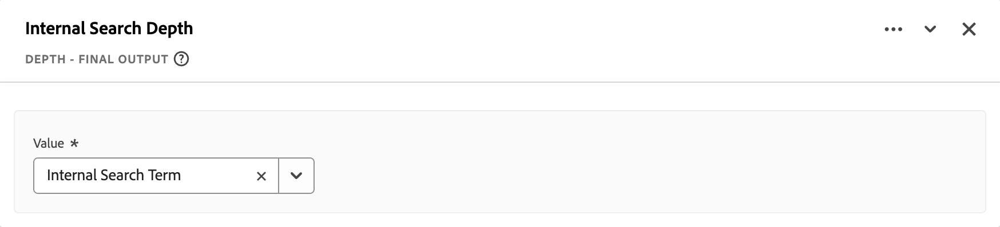

# Champs dérivés (tests limités){#derived-fields}

{{release-limited-testing}}

>[!IMPORTANT]
>
>Il s’agit d’une documentation préliminaire des nouvelles fonctions de champ dérivées qui ne sont pas encore généralement disponibles. Utilisez ces informations pour en savoir plus sur les nouvelles fonctions de champ dérivé. Cette documentation est toujours sujette à modification et aucune obligation légale quelle qu&#39;elle soit ne peut être dérivée de la version actuelle de cet article.
>&#x200B;> Voir [Champs dérivés](derived-fields.md) pour plus d’informations sur la fonctionnalité des champs dérivés en général et sur les fonctions et modèles de fonction actuellement disponibles.
>

## Référence de fonction

{{select-package}}

Pour chaque fonction prise en charge, consultez les détails ci-dessous sur :

- Spécifications :
   - Type de données en entrée : type de données pris en charge,
   - Entrée : valeurs possibles pour l’entrée,
   - Opérateurs inclus : opérateurs pris en charge pour cette fonction (le cas échéant),
   - Limitations : limitations qui s’appliquent à cette fonction spécifique,
   - Sortie.

- Cas d’utilisation, notamment :
   - (facultatif) données avant de définir le champ dérivé,
   - Comment définir le champ dérivé,
   - (facultatif) données après la définition du champ dérivé.

- Contraintes (le cas échéant).

<!-- DATE MATH -->

### Mathématiques de date {#datemath}

>[!CONTEXTUALHELP]
>id="dataview_derivedfields_datemath"
>title="Mathématiques de date"
>abstract="Cette fonction permet de renvoyer la différence entre deux champs de date ou d’heure."

Renvoie la différence entre deux dates ou deux champs date-heure.

+++ Détails

## Spécifications {#datemath-io}

| Type de données d’entrée | Entrée | Opérateurs inclus | Limites | Sortie |
|---|---|---|---|---|
| <ul><li>Date</li><li>Date-time</li></ul> | <ul><li>[!UICONTROL Portée]<ul><li>Événement</li><li>Session</li><li>Personne</li></ul></li><li>[!UICONTROL Valeur] :<ul><li>Date</li><li>Date et heure</li><li>Date statique (saisie par l’utilisateur)</li><li>Date et heure statiques (saisies par l’utilisateur)</li><li>Date dynamique<ul><li>Today</li></ul></li><li>Date et heure dynamiques<ul><li>Now</li></ul></li></ul></li><li>[!UICONTROL Granularité] :<ul><li>Seconds</li><li>Minutes</li><li>Heures</li><li>Days</li><li>Weeks</li><li>Months</li><li>Trimestres</li><li>Ans</li></ul></li><li>Pour chaque retour Date ou Date et heure :<ul><li>Première (dans la session ou la personne)</li><li>Dernier (dans la session ou la personne)</li></ul></li></ul> | 
S.O.
 | 
2 fonctions par champ dérivé
 | 
Nouveau champ dérivé
 |

{style="table-layout:auto"}

## Cas d’utilisation 1 {#datemath-uc1}

En tant qu’analyste marketing d’une société hôtelière, vous souhaitez comprendre la différence de nombre de jours entre les dates d’enregistrement et de réservation des clients au cours de la dernière semaine.

### Champs dérivés {#datemath-uc1-derivedfield}

Vous définissez un champ dérivé `Days between booking and check-in`. Utilisez la fonction [!UICONTROL DATE MATH] pour définir une règle afin de calculer le nombre de jours de la Portée[!DNL Person] entre la [!UICONTROL Date de réservation] et la [!UICONTROL Date d&#39;enregistrement]. Sélectionnez [!UICONTROL Jour] comme [!UICONTROL Granularité de sortie]. Vous pouvez également sélectionner [!UICONTROL Renvoyer la dernière personne] à la fois pour [!UICONTROL Date de réservation] et [!UICONTROL Date d’enregistrement] pour vous assurer que la valeur étendue de la dernière personne est utilisée dans le calcul.

## Cas d’utilisation 2 {#datemath-uc2}

En tant qu’analyste marketing d’une boutique physique, vous souhaitez comprendre combien de jours se sont écoulés depuis la dernière visite d’un client dans la boutique. Vous utilisez la fonctionnalité de géolocalisation dans une application mobile et des balises dans la boutique pour capturer les visites physiques des clients.

### Champs dérivés {#datemath-uc2-derivedfield}

Vous définissez un nouveau champ dérivé `Days Since Visit To Shop`. Utilisez la fonction [!UICONTROL DATE MATH] pour définir une règle afin de calculer le nombre de jours entre une date et une heure personnalisées (que vous spécifiez dans [!UICONTROL Date]) et l&#39;[!UICONTROL heure locale] (à partir du groupe de champs [!UICONTROL placeContext] de votre jeu de données d&#39;événement) avec une [!UICONTROL portée de déduplication] de [!UICONTROL Person]. Sélectionnez [!UICONTROL Renvoyer la dernière valeur] pour vous assurer que la valeur étendue de la dernière personne pour [!UICONTROL Heure locale] est utilisée dans le calcul. Sélectionnez Jour comme [!UICONTROL granularité de sortie].

## Cas d’utilisation 3 {#datemath-uc3}

Vous souhaitez comprendre le temps de recherche en minutes avant qu’un client d’une session ne passe une commande.

Vous définissez un nouveau champ dérivé de `Time Between Search And Order In Minutes` qui est le résultat de deux fonctions [[!UICONTROL CASE QUAND]](#case-when) pour définir les valeurs [!UICONTROL Temps de recherche] et [!UICONTROL Temps de commande].
Utilisez ensuite ces deux valeurs pour calculer la différence avec une fonction [!UICONTROL DATE MATH] avec [!UICONTROL Scope] défini sur [!UICONTROL Session], les valeurs définies sur [!UICONTROL Search Time] et [!UICONTROL Order Time] et [!UICONTROL Output granularity] défini sur [!UICONTROL Minute]. Pour les deux valeurs, sélectionnez [!UICONTROL Renvoyer la première] pour vous assurer que la première [!UICONTROL Heure de recherche] et [!UICONTROL Heure de commande] est renvoyée.

<!--
| Visitor ID | Marketing Channel | Events |
|----|---|---:|
| ABC123 | paid search | 1 |
| DEF123 | email | 1 |
| JKL123 | natural search | 1 |

{style="table-layout:auto"}

-->

+++

<!-- DEPTH -->

### Profondeur {#depth}

>[!CONTEXTUALHELP]
>id="dataview_derivedfields_depth"
>title="Profondeur"
>abstract="Cette fonction permet de renvoyer la profondeur de n’importe quel champ, comme la fonctionnalité du composant standard de profondeur d’événement."

Renvoie la profondeur d’un champ, similaire à ce qui est possible avec la dimension [Profondeur d’événement standard](/help/components/dimensions/overview.md#standard-dimensions) prête à l’emploi.

+++ Détails

## Spécifications {#depth-io}

| Type de données d’entrée | Entrée | Opérateurs inclus | Limites | Sortie |
|---|---|---|---|---|
| Tous | N’importe quel champ | S.O. | 3 fonctions par champ dérivé | Nouveau champ dérivé |

{style="table-layout:auto"}

<!--
## Example Data {#depth-example}

| event# | page name | search | product view | cart add  | order |
|:---:|---|:---:|:---:|:---:|:---:|
| 1 |  home page        |  0  | 0  | 0  | 0 |
| 2 |  search page      |  1  | 0  | 0  | 0 |
| 3 |  product page     |  0  | 0  | 0  | 0 |
| 4 |  cart page        |  0  | 0  | 1  | 0 |
| 5 |  confirmation     |  0  | 0  | 0  | 1 |

-->

## Cas d’utilisation {#depth-uc1}

Vous souhaitez comprendre la profondeur de la recherche (que vous pouvez également interpréter comme le nombre de recherches). Vous pouvez donc utiliser cette profondeur de recherche ultérieurement pour rechercher le terme associé à une profondeur de recherche spécifique.

### Champs dérivés {#depth-uc1-derivedfield}

Vous définissez un nouveau champ dérivé `Search Depth`. Utilisez la fonction [!UICONTROL DEPTH] pour définir une règle afin de récupérer la profondeur de la fonction [!UICONTROL Search] et de la stocker dans un nouveau champ dérivé.

+++

<!-- TYPECASE -->

### Typecast {#typecast}

>[!CONTEXTUALHELP]
>id="dataview_derivedfields_typecast"
>title="Typecast"
>abstract="Cette fonction permet de modifier le type de champ à la volée pour rendre le champ disponible pour des transformations supplémentaires dans Customer Journey Analytics."

Modifiez le type de champ d’un champ afin de le rendre disponible pour des transformations supplémentaires dans Customer Journey Analytics.

+++ Détails

## Spécifications {#typecast-io}

| Type de données d’entrée | Entrée | Opérateurs inclus | Limite | Sortie |
|---|---|---|---|---|
| <ul><li>Numérique</li><li>Date</li><li>Date-time</li><li>Chaîne</li></ul> | <ul><li>[!UICONTROL Champ] | 
<ul><li>Nombre entier<ul><li>To String <strong>(Must)</strong></li></ul></li><li>Double<ul><li>To String <strong>(Must)</strong><ul><li>Inclure le nombre de décimales à hériter (max. 5 ?)</li></ul></li><li>To Integer <strong>(Devrait)</strong></li></ul></li><li>Octet<ul><li>To String <strong>(Must)</strong></li></ul></li><li>Long<ul><li>To String <strong>(Must)</strong></li></ul></li><li>Date<ul><li>To String <strong>(Must)</strong><ul><li>Permet de définir le format de sortie</li></ul></li><li>Exemples<ul><li>Date (exemple du 7 janvier 2025)<ul><li data-stringify-indent="1" data-stringify-border="0">MM-JJ-AA<ul><li data-stringify-indent="2" data-stringify-border="0">Ex. 01-07-25</li></ul></li><li data-stringify-indent="1" data-stringify-border="0">MM-JJ-AAAA<ul><li data-stringify-indent="2" data-stringify-border="0">Ex. 01-07-2025</li></ul></li><li data-stringify-indent="1" data-stringify-border="0">JJ-MM-AA<ul><li data-stringify-indent="2" data-stringify-border="0">Ex. 07-01-25</li></ul></li><li data-stringify-indent="1" data-stringify-border="0">JJ-MM-AAAA<ul><li data-stringify-indent="2" data-stringify-border="0">Ex. 07-01-2025</li></ul></li><li data-stringify-indent="1" data-stringify-border="0">AA-MM-JJ<ul><li data-stringify-indent="2" data-stringify-border="0">Ex. 25-01-07</li></ul></li><li data-stringify-indent="1" data-stringify-border="0">AAAA-MM-JJ<ul><li data-stringify-indent="2" data-stringify-border="0">Ex. 2025-01-07</li></ul></li><li data-stringify-indent="1" data-stringify-border="0">MM/JJ/AA<ul><li data-stringify-indent="2" data-stringify-border="0">Ex. 01/07/25</li></ul></li><li data-stringify-indent="1" data-stringify-border="0">MM/JJ/AAAA<ul><li data-stringify-indent="2" data-stringify-border="0">Ex. 01/07/2025</li></ul></li><li data-stringify-indent="1" data-stringify-border="0">AAAA/MM/JJ<ul><li data-stringify-indent="2" data-stringify-border="0">Ex. 07/01/2025</li></ul></li><li data-stringify-indent="1" data-stringify-border="0">AA/MM/JJ<ul><li data-stringify-indent="2" data-stringify-border="0">Ex. 25/01/07</li></ul></li><li data-stringify-indent="1" data-stringify-border="0">MMM JJ, AAAA<ul><li data-stringify-indent="2" data-stringify-border="0">Ex. mercredi 7 janvier 2025</li></ul></li></ul></li></ul></li></ul></li><li>Date-time<ul><li>To String <strong>(Must)</strong><ul><li>Permet de définir le format de sortie</li></ul></li><li>Exemples<ul><li data-stringify-indent="0" data-stringify-border="0">Date et heure (exemple du 7 janvier 2025 à 1 :30pm 52 secondes)<ul><li data-stringify-indent="2" data-stringify-border="0">MM-JJ-AA hhmmss<ul><li data-stringify-indent="3" data-stringify-border="0">Ex. 01-07-25 13:30:52</li></ul></li><li data-stringify-indent="2" data-stringify-border="0">JJ-MM-AAAA hhmmss<ul><li data-stringify-indent="3" data-stringify-border="0">Ex. 01-07-2025 13:30:52</li></ul></li><li data-stringify-indent="2" data-stringify-border="0">JJ-MM-AAAA hhmmss<ul><li data-stringify-indent="3" data-stringify-border="0">Ex. 07-01-25 13:30:52</li></ul></li><li data-stringify-indent="2" data-stringify-border="0">JJ-MM-AAAA hhmmss<ul><li data-stringify-indent="3" data-stringify-border="0">Ex. 07-01-2025 13:30:52</li></ul></li><li data-stringify-indent="2" data-stringify-border="0">AA-MM-JJ hhmmss<ul><li data-stringify-indent="3" data-stringify-border="0">Ex. 25-01-07 13:30:52</li></ul></li><li data-stringify-indent="2" data-stringify-border="0">AAAA-MM-JJ hhmmss<ul><li data-stringify-indent="3" data-stringify-border="0">Ex. 2025-01-07 13:30:52</li></ul></li><li data-stringify-indent="2" data-stringify-border="0">MM/JJ/AA hhmmss<ul><li data-stringify-indent="3" data-stringify-border="0">Ex. 01/07/25 13:30:52</li></ul></li><li data-stringify-indent="2" data-stringify-border="0">MM/JJ/AAAA hhmmss<ul><li data-stringify-indent="3" data-stringify-border="0">Ex. 01/07/2025 13:30:52</li></ul></li><li data-stringify-indent="2" data-stringify-border="0">AAAA/MM/JJ hhmmss<ul><li data-stringify-indent="3" data-stringify-border="0">Ex. 2025/01/07 13:30:52</li></ul></li><li data-stringify-indent="2" data-stringify-border="0">JJ/MM/AA hh:mm :ss<ul><li data-stringify-indent="3" data-stringify-border="0">Ex. 25/01/07 13:30:52</li></ul></li><li data-stringify-indent="2" data-stringify-border="0">MMM JJ, AAAA hhmmss<ul><li data-stringify-indent="3" data-stringify-border="0">Ex. 7 janvier 2025 13:30:52</li></ul></li></ul></li></ul></li><li>Chaîne<ul><li>En <strong> Numérique(Devrait)</strong><ul><li>Si nous avons des valeurs qui ne sont pas numériques par nature, elles renvoient la valeur null.</li><li>Nous aurons besoin que l’utilisateur saisisse la précision et le paramètre régional à utiliser. </li></ul></li></ul></li></ul></li></ul>
 | 
3 fonctions par champ dérivé
 | 
Nouveau champ dérivé
 |

{style="table-layout:auto"}

## Cas d’utilisation 1 {#typecast-uc1}

Vous souhaitez utiliser un champ entier, la hauteur d’écran (par exemple device.screenHeight à partir du jeu de données de l’événement) comme dimension basée sur une chaîne.

### Champs dérivés {#typecast-uc1-derivedfield}

Vous définissez un champ dérivé `Screen Height`. Utilisez la fonction [!UICONTROL TYPECAST] pour définir une règle pour [!UICONTROL Typecast à] [!UICONTROL String] le champ [!UICONTROL Hauteur d’écran] et la stocker dans le nouveau champ dérivé.

## Cas d’utilisation 2 {#typecast-uc2}

Vous souhaitez utiliser Chiffre d’affaires dans un tableau de cohortes (qui ne prend en charge que les entiers), mais le champ Chiffre d’affaires est de type Double.

### Champs dérivés {#typecast-uc2-derivedfield}

Vous définissez un champ dérivé `Revenue (integer)`. Utilisez la fonction [!UICONTROL TYPECAST] pour définir une règle pour [!UICONTROL Typecast à] [!UICONTROL Integer] le champ [!UICONTROL Revenue] et la stocker dans le nouveau champ dérivé.

+++
